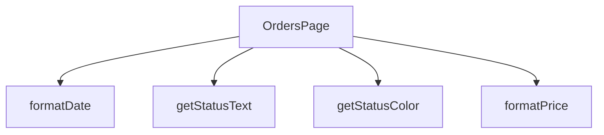

## Genel Bakış
Bu modül, siparişlerin listelendiği ve detaylarının görüntülendiği bir React sayfasıdır. Sipariş verilerini kullanıcı arayüzünde göstermek için gerekli olan tarih, fiyat ve durum gibi bilgileri formatlayan yardımcı fonksiyonlar içerir.

## Fonksiyon Grupları
### Ana Sayfa Bileşeni
Siparişler sayfasının ana yapısını, veri akışını ve kullanıcı arayüzünü yöneten temel React bileşenidir.
- OrdersPage

### Veri Görünüm Formatlayıcıları
Siparişlerle ilgili ham veriyi (tarih, fiyat, durum kodu) kullanıcı dostu metinlere ve arayüz stillerine dönüştüren yardımcı fonksiyonlardır.
- formatDate, formatPrice, getStatusColor, getStatusText

---

## AXIOMS – Mimari Varsayımlar

Bu modül, siparişlerin görüntülenmesi ve formatlanması ile ilgili temel veri dönüşüm varsayımları içermektedir.

[Aksiyom 1]: Eğer `formatDate` fonksiyonuna `dateString` olarak geçerli bir ISO tarih formatı (örn: "YYYY-MM-DDTHH:mm:ss.sssZ") veya parse edilebilir bir tarih string'i verilmezse, fonksiyon beklenmeyen bir sonuç döndürebilir veya hata oluşabilir.

[Aksiyom 2]: Eğer `formatPrice` fonksiyonuna `price` olarak geçerli bir sayısal değer (number) verilmezse, fonksiyon beklenmeyen bir fiyat formatı üretebilir.

[Aksiyom 3]: Eğer `getStatusColor` fonksiyonuna `status` olarak uygulama tarafından tanımlanmamış bir durum kodu verilse, fonksiyon varsayılan bir renk (örn: gri tonu) döndürmeli veya durum bilinmiyorsa belirli bir fallback değeri sağlamalıdır.

[Aksiyom 4]: Eğer `getStatusText` fonksiyonuna `status` olarak uygulama tarafından tanımlanmamış bir durum kodu verilse, fonksiyon okunabilir bir varsayılan metin (örn: "Bilinmiyor") döndürmelidir.

[Aksiyom 5]: Eğer `OrdersPage` bileşeni çalıştırıldığında sipariş listesi verisi (API'den veya state'den) alınamazsa veya boş array dönse, bileşen "sipariş bulunamadı" gibi bir boş durum mesajı göstermelidir.

---

## FONKSİYON DETAYLARI

### OrdersPage
**Ne yapar**: Fonksiyonun amacı ve işlevi kaynak kodunda belirtilmemiştir.  
**Nasıl yapar**: İç mantığı hakkında bilgi bulunmamaktadır.  
**Parametreler**:  
- (parametre yok)  
**Dönüş**: `React.FC` – bir React fonksiyonel bileşeni tipini döndürür.

### formatDate
**Ne yapar**: Fonksiyonun ne amaçla kullanıldığı ve ne yaptığı belirtilmemiştir.  
**Nasıl yapar**: İşlevsel içeriği hakkında bilgi mevcut değildir.  
**Parametreler**:  
- `dateString`: `string` — tarih bilgisini içeren metin.  
**Dönüş**: Belirtilmemiştir (return tipi bilinmiyor).

### formatPrice
**Ne yapar**: Fonksiyonun görevi ve çıktısı kaynakta tanımlanmamıştır.  
**Nasıl yapar**: İç mantığı hakkında veri bulunmamaktadır.  
**Parametreler**:  
- `price`: `number` — fiyat değerini temsil eden sayı.  
**Dönüş**: Belirtilmemiştir (return tipi bilinmiyor).

### getStatusColor
**Ne yapar**: Fonksiyonun işlevi ve kullanım amacı açıklanmamıştır.  
**Nasıl yapar**: İşlevsel detayları mevcut değildir.  
**Parametreler**:  
- `status`: `string` — durum bilgisini ifade eden metin.  
**Dönüş**: Belirtilmemiştir (return tipi bilinmiyor).

### getStatusText
**Ne yapar**: Fonksiyonun ne yaptığı ve ne döndürdüğü kaynakta yer almamaktadır.  
**Nasıl yapar**: İç mantığı hakkında bilgi yoktur.  
**Parametreler**:  
- `status`: `string` — durum bilgisini temsil eden metin.  
**Dönüş**: Belirtilmemiştir (return tipi bilinmiyor).

---

## INTERFACES

### Order
- `id: string`
- `total_amount: number`
- `status: string`
- `payment_status?: string`
- `created_at: string`
- `customer_name: string`
- `customer_email: string`
- `shipping_address: unknown`
- `order_items: OrderItem[]`
- `order_number?: string`
- `is_demo?: boolean`
- `payment_data?: unknown`
- `conversation_id?: string`
- `carrier?: string`
- `tracking_number?: string`
- `tracking_url?: string`
- `shipped_at?: string`
- `delivered_at?: string`

### OrderItem
- `id: string`
- `product_id?: string`
- `product_name: string`
- `quantity: number`
- `unit_price: number`
- `total_price: number`
- `product_image_url?: string`

---

## TYPE ALIASES

### StatusFilter
```typescript
type StatusFilter = 'all' | 'pending' | 'paid' | 'shipped' | 'delivered' | 'failed'
```

---

## AST POINTERS

### [N1_NASIL] AST Pointer: C:\Users\alize\venthub-hvac\src\views\OrdersPage.tsx::fetchOrders
- **params**: (parametre yok)
- **ic_degiskenler**:
  - `ordersData` — Supabase'den getirilen hammadde sipariş verisi
  - `ordersError` — Supabase sorgusu sonucu oluşabilecek hata nesnesi
  - `formattedOrders` — Ham verinin Order[] formatına dönüştürülmüş hali
  - `rawOrder` — map() içindeki her bir ham sipariş nesnesi (unknown tipinde)
  - `order` — isRecord kontrolü ile temizlenmiş sipariş nesnesi (Record tipinde)
  - `itemsList` — Siparişin içindeki venthub_order_items dizisi
  - `rawIt` — inner map() içindeki her bir ham sipariş kalemi (unknown tipinde)
  - `it` — isRecord kontrolü ile temizlenmiş sipariş kalemi (Record tipinde)
  - `items` — Ham kalem verisinin OrderItem[] formatına dönüştürülmüş hali
  - `productQ` — URL search parametresinden alınan ürün filtreleme değeri
- **Dönüş**: void (sadece setOrders ile state günceller)

### [N2_NASIL] AST Pointer: C:\Users\alize\venthub-hvac\src\views\OrdersPage.tsx::mapRawOrderToOrder
- **params**: (rawOrder: unknown)
- **ic_degiskenler**:
  - `order` — isRecord kontrolü ile temizlenmiş sipariş nesnesi
  - `itemsList` — order.venthub_order_items dizisi veya boş dizi
  - `rawIt` — itemsList.map() içindeki her bir ham kalem verisi
  - `it` — isRecord kontrolü ile temizlenmiş kalem nesnesi
  - `items` — Ham kalem verisinin OrderItem[] formatına dönüştürülmüş hali
- **Dönüş**: Order objesi (tam sipariş verisi)

### [N3_NASIL] AST Pointer: C:\Users\alize\venthub-hvac\src\views\OrdersPage.tsx::mapRawItemToOrderItem
- **params**: (rawIt: unknown)
- **ic_degiskenler**:
  - `it` — isRecord kontrolü ile temizlenmiş kalem nesnesi
- **Dönüş**: OrderItem objesi (tek bir sipariş kalemi)

### [N4_NASIL] AST Pointer: C:\Users\alize\venthub-hvac\src\views\OrdersPage.tsx::authEffect
- **params**: (parametre yok)
- **ic_degiskenler**: (yok)
- **Dönüş**: void (router.push ile yönlendirme veya fetchOrders çağrısı yapar)

### [N5_NASIL] AST Pointer: C:\Users\alize\venthub-hvac\src\views\OrdersPage.tsx::formatDate
- **params**: (dateString: string)
- **ic_degiskenler**: (yok)
- **Dönüş**: string (formatDateTime fonksiyonunun döndürdüğü formatlanmış tarih)

### [N6_NASIL] AST Pointer: C:\Users\alize\venthub-hvac\src\views\OrdersPage.tsx::formatPrice
- **params**: (price: number)
- **ic_degiskenler**: (yok)
- **Dönüş**: string (formatCurrency fonksiyonunun döndürdüğü formatlanmış para birimi)

### [N7_NASIL] AST Pointer: C:\Users\alize\venthub-hvac\src\views\OrdersPage.tsx::getStatusColor
- **params**: (status: string)
- **ic_degiskenler**: (yok)
- **Dönüş**: string (Tailwind CSS renk class'ları, ör: "bg-yellow-100 text-yellow-800")

### [N8_NASIL] AST Pointer: C:\Users\alize\venthub-hvac\src\views\OrdersPage.tsx::getStatusText
- **params**: (status: string)
- **ic_degiskenler**: (yok)
- **Dönüş**: string (t() fonksiyonu ile çevrilmiş durum metni)

### [N9_NASIL] AST Pointer: C:\Users\alize\venthub-hvac\src\views\OrdersPage.tsx::orderFilter
- **params**: (o — Order tipinde nesne, parametre ismi belirtilmemiş)
- **ic_degiskenler**: (yok — sadece parametre ve dış scope değişkenleri kullanılır)
- **Dönüş**: boolean (siparişin filtre kriterlerine uyup uymadığı)

### [N10_NASIL] AST Pointer: C:\Users\alize\venthub-hvac\src\views\OrdersPage.tsx::renderOrderCard
- **params**: (order — Order tipinde nesne, parametre ismi belirtilmemiş)
- **ic_degiskenler**: (yok — JSX içinde değişken oluşturulmaz)
- **Dönüş**: JSX.Element (sipariş kartını render eden React bileşeni)

### [N11_NASIL] AST Pointer: C:\Users\alize\venthub-hvac\src\views\OrdersPage.tsx::mapStatusStep
- **params**: (s — step dizisi elemanı, idx — indeks numarası)
- **ic_degiskenler**:
  - `normalizedStatus` — "confirmed" durumunu "paid" olarak normalize edilmiş hali
  - `activeIdx` — normalizedStatus'un steps dizisi içindeki indeksi (yoksa 0)
  - `active` — Mevcut adımın aktif olup olmadığı (idx <= activeIdx)
- **Dönüş**: JSX.Element (adım göstergesi için React bileşeni)

---


## MERMAID CALL GRAPH


## NODE ID STANDARD

  file: src\views\OrdersPage.tsx
  function: src\views\OrdersPage.tsx::OrdersPage
  function: src\views\OrdersPage.tsx::formatDate
  function: src\views\OrdersPage.tsx::formatPrice
  function: src\views\OrdersPage.tsx::getStatusColor
  function: src\views\OrdersPage.tsx::getStatusText

---

## DISA AKTARILANLAR (EXPORTS)
  export: OrdersPage

---

## STİL TOKENLERİ

### Arbitrary Değerler (token'a geçirilmemiş)
Yok — tüm stiller token'a geçirilmiş. ✅

### Kullanılan Token'lar (zaten token'a geçirilmiş)
- (yok)

### Tailwind Sınıf Özeti
- **Renkler:** `bg-clean-white`, `bg-orange-100`, `bg-orange-100/80`, `bg-primary-navy`, `bg-primary-navy/5`, `bg-slate-100`, `bg-slate-50`, `bg-white`, `border-b`, `border-b-2`, `border-orange-200`, `border-primary-navy`, `border-slate-100`, `border-slate-200`, `border-slate-200/60`
- **Layout:** `flex`, `flex-1`, `flex-col`, `gap-2`, `gap-4`, `grid`, `grid-cols-1`, `h-1`, `h-10`, `h-12`, `h-16`, `h-7`, `inline-flex`, `items-center`, `justify-between`
- **Varyant/Responsive:** `:`, `focus-visible:`, `hover:`, `md:` önekleri
- **Yardımcı Sınıflar:** `${active`, `${activeIdx`, `${getStatusColor(order.status`, `1`, `:`, `>=`, `animate-spin`, `border`, `focus-visible:outline-none`, `focus-visible:ring-2`, `focus-visible:ring-primary-navy/20`, `font-bold`, `font-medium`, `hover:scale-102`, `idx`