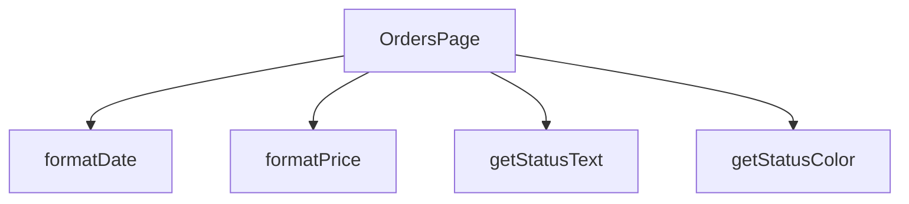

## Genel Bakış
OrdersPage modülü, VentHub HVAC uygulamasının sipariş yönetim arayüzünü oluşturan temel React sayfasıdır. Sipariş listesinin görüntülenmesi, durum bazlı filtreleme ve sipariş detaylarının gösterilmesi gibi kullanıcı etkileşimlerini yönetir. Modül, ham veri değerlerini (tarih, fiyat, durum kodları) arayüzde okunabilir ve tutarlı bir şekilde formatlayan yardımcı fonksiyonlar içerir.

## Fonksiyon Grupları
### Sayfa Bileşeni ve Ana Mantık
Sipariş sayfasının tüm yaşam döngüsünü (veri çekme, filtreleme, durum yönetimi) ve kullanıcı arayüzünün yapısını kontrol eden ana React bileşenidir. Bileşen, iç bağımlılıklar olarak Yardımcı Format Fonksiyonlarını çağırarak verileri görsel formata dönüştürür.
- OrdersPage

### Yardımcı Format Fonksiyonları
Sipariş verilerinin temel bileşenlerini (tarih dizeleri, sayısal fiyatlar, durum kodları) kullanıcı arayüzünde doğrudan gösterilecek standart formatlara ve renklere dönüştürerek soyutlayan işlevlerdir. Bu fonksiyonlar, bileşen içindeki tekrar eden formatlama mantığını kaldırır ve görünüm tutarlılığını sağlar.
- formatDate, formatPrice, getStatusColor, getStatusText

---

## AXIOMS – Mimari Varsayımlar

Bu modül için fonksiyon gövdeleri sağlanmadığından, gövde tabanlı aksiyom üretilememektedir. Aşağıdaki varsayımlar yalnızca fonksiyon imzalarından çıkarılan minimal bilgilerdir.

[Aksiyom 1]: Eğer `formatDate` fonksiyonuna geçerli bir tarih string'i (`dateString`) sağlanmazsa, fonksiyonun nasıl davrandığı bilinmiyor — gövde incelenmeden belirlenemez.

[Aksiyom 2]: Eğer `formatPrice` fonksiyonuna sayısal bir fiyat değeri (`price`) sağlanmazsa, fonksiyonun nasıl davrandığı bilinmiyor — gövde incelenmeden belirlenemez.

[Aksiyom 3]: Eğer `getStatusColor` fonksiyonuna bir durum string'i (`status`) sağlanmazsa, fonksiyonun nasıl davrandığı bilinmiyor — gövde incelenmeden belirlenemez.

[Aksiyom 4]: Eğer `getStatusText` fonksiyonuna bir durum string'i (`status`) sağlanmazsa, fonksiyonun nasıl davrandığı bilinmiyor — gövde incelenmeden belirlenemez.

[Aksiyom 5]: Eğer `OrdersPage` bileşeni bir React ortamında (`React.FC` dönüş tipiyle uyumlu) render edilmezse, bileşenin davranışı bilinmiyor — gövde incelenmeden hangi alt bileşenleri kullandığı veya hangi verileri beklediği belirlenemez.

---

**Not:** Bu modülün gerçek mimari varsayımlarını (örneğin beklenen sipariş veri yapısı, durum kodlarının geçerli değerleri, tarih formatı, fiyat birimi vb.) belirlemek için fonksiyon gövdelerinin incelenmesi gerekmektedir. Mevcut çıktı yalnızca imzalardan elde edilebilen minimal bilgileri içermektedir.

---

## FONKSİYON DETAYLARI

### OrdersPage
**Ne yapar**: Fonksiyonun amacı ve işlevi kaynak kodunda belirtilmemiştir.  
**Nasıl yapar**: İç mantığı hakkında bilgi bulunmamaktadır.  
**Parametreler**:  
- (parametre yok)  
**Dönüş**: `React.FC` – bir React fonksiyonel bileşeni tipini döndürür.

### formatDate
**Ne yapar**: Fonksiyonun ne amaçla kullanıldığı ve ne yaptığı belirtilmemiştir.  
**Nasıl yapar**: İşlevsel içeriği hakkında bilgi mevcut değildir.  
**Parametreler**:  
- `dateString`: `string` — tarih bilgisini içeren metin.  
**Dönüş**: Belirtilmemiştir (return tipi bilinmiyor).

### formatPrice
**Ne yapar**: Fonksiyonun görevi ve çıktısı kaynakta tanımlanmamıştır.  
**Nasıl yapar**: İç mantığı hakkında veri bulunmamaktadır.  
**Parametreler**:  
- `price`: `number` — fiyat değerini temsil eden sayı.  
**Dönüş**: Belirtilmemiştir (return tipi bilinmiyor).

### getStatusColor
**Ne yapar**: Fonksiyonun işlevi ve kullanım amacı açıklanmamıştır.  
**Nasıl yapar**: İşlevsel detayları mevcut değildir.  
**Parametreler**:  
- `status`: `string` — durum bilgisini ifade eden metin.  
**Dönüş**: Belirtilmemiştir (return tipi bilinmiyor).

### getStatusText
**Ne yapar**: Fonksiyonun ne yaptığı ve ne döndürdüğü kaynakta yer almamaktadır.  
**Nasıl yapar**: İç mantığı hakkında bilgi yoktur.  
**Parametreler**:  
- `status`: `string` — durum bilgisini temsil eden metin.  
**Dönüş**: Belirtilmemiştir (return tipi bilinmiyor).

---

## İTHALATLAR (IMPORTS)
- import: ../hooks/useAuth::useAuth
- import: ../hooks/useLocalizedRoutes::useLocalizedRoutes
- import: ../i18n/I18nProvider::useI18n
- import: ../i18n/case::foldForSearch
- import: ../i18n/currency::SYSTEM_CURRENCY
- import: ../i18n/datetime::formatDateTime
- import: ../i18n/format::formatCurrency
- import: ../lib/type-converters::isRecord
- import: @/lib/supabase/client::supabaseBrowserClient
- import: lucide-react::Calendar
- import: lucide-react::CreditCard
- import: lucide-react::Eye
- import: lucide-react::Package
- import: lucide-react::ShoppingBag
- import: next/navigation::useRouter
- import: next/navigation::useSearchParams
- import: react::React
- import: react::useEffect
- import: react::useState
- import: sonner::toast

---

## INTERFACES

### Order
- `id: string`
- `total_amount: number`
- `status: string`
- `payment_status?: string`
- `created_at: string`
- `customer_name: string`
- `customer_email: string`
- `shipping_address: unknown`
- `order_items: OrderItem[]`
- `order_number?: string`
- `is_demo?: boolean`
- `payment_data?: unknown`
- `conversation_id?: string`
- `carrier?: string`
- `tracking_number?: string`
- `tracking_url?: string`
- `shipped_at?: string`
- `delivered_at?: string`

### OrderItem
- `id: string`
- `product_id?: string`
- `product_name: string`
- `quantity: number`
- `unit_price: number`
- `total_price: number`
- `product_image_url?: string`

---

## TYPE ALIASES

### StatusFilter
```typescript
type StatusFilter = 'all' | 'pending' | 'paid' | 'shipped' | 'delivered' | 'failed'
```

---

## AST POINTERS

### [N1_NASIL] AST Pointer: src/views/OrdersPage.tsx::anonim_async_fonksiyon (fetchOrders)
- **params**: yok (anonim async fonksiyon)
- **ic_degiskenler**:
  - `setLoading(true)` — yükleme durumunu aktif eder
  - `supabase` — Supabase tarayıcı istemcisi, veritabanı sorguları için kullanılır
  - `ordersData` — `supabase.from('venthub_orders').select(...)` sorgusundan dönen veri; `user_id` ile filtrelenmiş, `created_at` azalan sıralı sipariş kayıtları
  - `ordersError` — sorgu hatası varsa yakalanır; `code === '42501'` veya `status === 403` ise RLS izin sorunu olarak konsola yazılır
  - `user?.id` — mevcut kullanıcının kimliği, `.eq('user_id', ...)` filtresinde kullanılır; yoksa boş dize gönderilir
  - `t('orders.fetchError')` — sipariş çekme hatası toast mesajı
  - `t('orders.unexpectedError')` — beklenmeyen hata toast mesajı
  - `formattedOrders` — ham veriyi `Order` tipine dönüştüren `.map()` sonucu oluşan dizi
  - `rawOrder` — `.map()` içindeki her bir ham sipariş kaydı (unknown tipinde)
  - `order` — `isRecord(rawOrder)` kontrolünden geçirilen sipariş nesnesi; kayıt değilse boş nesne
  - `itemsList` — `order.venthub_order_items` dizisi; dizi değilse boş dizi
  - `items` — `itemsList.map()` ile dönüştürülen `OrderItem[]` dizisi
  - `rawIt` — her bir ham sipariş kalemi (unknown tipinde)
  - `it` — `isRecord(rawIt)` kontrolünden geçirilen kalem nesnesi
  - `searchParams` — URL arama parametreleri; varsa `product` parametresi okunur
  - `productQ` — `searchParams.get('product')` değeri; varsa `setProductFilter(productQ)` ile ürün filtresi ayarlanır
  - `setOrders(formattedOrders)` — formatlanmış siparişleri state'e kaydeder
  - `setProductFilter(productQ)` — URL'den gelen ürün filtresini state'e kaydeder
  - `error` — `catch` bloğunda yakalanan genel hata
  - `setLoading(false)` — `finally` bloğunda yükleme durumunu kapatır
- **Dönüş**: yok (async fonksiyon; yan etki olarak `setOrders`, `setLoading`, `setProductFilter` çağırır, `toast.error` gösterir)

### [N2_NASIL] AST Pointer: src/views/OrdersPage.tsx::anonim_fonksiyon (rawOrder mapper)
- **params**: `rawOrder` — unknown tipinde ham sipariş verisi
- **ic_degiskenler**:
  - `order` — `isRecord(rawOrder)` true ise `rawOrder`, değilse boş nesne `{}`
  - `itemsList` — `order.venthub_order_items` dizi ise o dizi, değilse boş dizi `[]`
  - `items` — `itemsList.map()` ile üretilen `OrderItem[]`; her kalemde `id`, `product_id`, `product_name`, `quantity`, `unit_price`, `total_price`, `product_image_url` alanları dönüştürülür
  - `rawIt` — her bir ham sipariş kalemi (unknown tipinde)
  - `it` — `isRecord(rawIt)` true ise `rawIt`, değilse boş nesne `{}`
  - `user?.user_metadata?.full_name` — `customer_name` için fallback olarak kullanılır
  - `user?.email` — `customer_name` ve `customer_email` için fallback olarak kullanılır
  - `t('common.userFallback')` — `customer_name` için son fallback değeri
  - `isRecord(order.shipping_address)` — `shipping_address` alanının nesne olup olmadığını kontrol eder
  - `isRecord(order.payment_data)` — `payment_data` alanının nesne olup olmadığını kontrol eder
- **Dönüş**: `Order` tipinde nesne (`as Order` ile tip ataması yapılır)

### [N3_NASIL] AST Pointer: src/views/OrdersPage.tsx::anonim_fonksiyon (rawIt mapper)
- **params**: `rawIt` — unknown tipinde ham sipariş kalemi verisi
- **ic_degiskenler**:
  - `it` — `isRecord(rawIt)` true ise `rawIt`, değilse boş nesne `{}`
  - `it.id` — `String()` ile dönüştürülür, `id` alanı olarak kullanılır
  - `it.product_id` — varsa `String()` ile dönüştürülür, yoksa `undefined`
  - `it.product_name` — `String()` ile dönüştürülür, yoksa boş dize
  - `it.quantity` — `Number()` ile dönüştürülür, geçersizse `0`
  - `it.price_at_time` — `unit_price` ve `total_price` hesaplamasında kullanılır
  - `it.product_image_url` — varsa `String()` ile dönüştürülür, yoksa `undefined`
- **Dönüş**: `OrderItem` nesnesi (`id`, `product_id`, `product_name`, `quantity`, `unit_price`, `total_price`, `product_image_url` alanları içerir)

### [N4_NASIL] AST Pointer: src/views/OrdersPage.tsx::anonim_fonksiyon (useEffect callback)
- **params**: yok (useEffect cleanup olmayan callback)
- **ic_degiskenler**:
  - `authLoading` — kimlik doğrulama yüklenme durumu; true ise fonksiyon çıkış yapar
  - `user` — mevcut kullanıcı nesnesi; null ise login sayfasına yönlendirilir
  - `router` — Next.js yönlendirme nesnesi
  - `Routes.auth.login('/account/orders')` — giriş sayfası rotası; kullanıcı yoksa bu adrese yönlendirilir
  - `fetchOrders()` — kullanıcı varsa siparişleri çeken fonksiyon çağırılır
- **Dönüş**: yok (yan etki: `router.push` veya `fetchOrders` çağırır)

### [N5_NASIL] AST Pointer: src/views/OrdersPage.tsx::formatDate
- **params**: `dateString` — tarih dizgisi
- **ic_degiskenler**:
  - `formatDateTime` — i18n modülünden gelen tarih-saat formatlama fonksiyonu
  - `lang` — mevcut dil ayarı; `formatDateTime`'a ikinci argüman olarak geçirilir
- **Dönüş**: formatlanmış tarih dizgisi

### [N6_NASIL] AST Pointer: src/views/OrdersPage.tsx::formatPrice
- **params**: `price` — sayısal fiyat değeri
- **ic_degiskenler**:
  - `formatCurrency` — para birimi formatlama fonksiyonu
  - `lang` — mevcut dil ayarı
  - `SYSTEM_CURRENCY` — sistem para birimi sabiti (i18n/currency modülünden)
  - `maximumFractionDigits: 0` — ondalık basamak sayısı sıfır olarak ayarlanır
- **Dönüş**: formatlanmış fiyat dizgisi

### [N7_NASIL] AST Pointer: src/views/OrdersPage.tsx::getStatusColor
- **params**: `status` — sipariş durumu dizgisi
- **ic_degiskenler**:
  - `status.toLowerCase()` — durum küçük harfe çevrilerek switch-case'e sokulur
  - `'pending'` → `'bg-yellow-100 text-yellow-800'`
  - `'paid'` veya `'confirmed'` → `'bg-blue-100 text-blue-800'`
  - `'shipped'` → `'bg-purple-100 text-purple-800'`
  - `'delivered'` → `'bg-green-100 text-green-800'`
  - `'failed'` veya `'cancelled'` → `'bg-red-100 text-red-800'`
  - default → `'bg-gray-100 text-gray-800'`
- **Dönüş**: CSS sınıf dizgisi (Tailwind sınıfları)

### [N8_NASIL] AST Pointer: src/views/OrdersPage.tsx::getStatusText
- **params**: `status` — sipariş durumu dizgisi
- **ic_degiskenler**:
  - `status.toLowerCase()` — durum küçük harfe çevrilerek switch-case'e sokulur
  - `t('orders.pending')` — 'pending' durumu için çevrilmiş metin
  - `t('orders.paid')` — 'paid' veya 'confirmed' durumu için çevrilmiş metin
  - `t('orders.shipped')` — 'shipped' durumu için çevrilmiş metin
  - `t('orders.delivered')` — 'delivered' durumu için çevrilmiş metin
  - `t('orders.failed')` — 'failed' durumu için çevrilmiş metin
  - `t('orders.cancelled')` — 'cancelled' durumu için çevrilmiş metin
  - `t('orders.refunded')` — 'refunded' durumu için çevrilmiş metin
  - default → orijinal `status` değeri aynen döndürülür
- **Dönüş**: çevrilmiş durum metni dizgisi veya orijinal status dizgisi

### [N9_NASIL] AST Pointer: src/views/OrdersPage.tsx::anonim_fonksiyon (filtre fonksiyonu)
- **params**: `o` — sipariş nesnesi
- **ic_degiskenler**:
  - `productFilter` — ürün filtresi değeri; varsa sipariş kalemlerinde arama yapılır
  - `foldForSearch(productFilter, lang)` — arama sorgusunu normalize eder
  - `q` — normalize edilmiş arama sorgusu
  - `o.order_items` — sipariş kalemleri dizisi; her kalemde `product_name` üzerinde arama yapılır
  - `foldForSearch(it.product_name || '', lang)` — kalem ürün adını normalize eder
  - `match` — ürün filtresi eşleşme sonucu boolean; false ise sipariş elenir
  - `statusFilter` — durum filtresi; `'all'` değilse `o.status.toLowerCase()` ile karşılaştırılır
  - `dateFrom` — başlangıç tarihi filtresi; `new Date(o.created_at) < new Date(dateFrom)` kontrolü yapılır
  - `dateTo` — bitiş tarihi filtresi; `new Date(o.created_at) > new Date(dateTo)` kontrolü yapılır
  - `searchCode` — sipariş kodu arama filtresi
  - `code` — `o.order_number?.split('-').pop()` veya `o.id.slice(-8).toUpperCase()` ile elde edilen sipariş kodu
  - `searchCode.toUpperCase()` — arama kodu büyük harfe çevrilerek `code.includes()` ile eşleştirilir
- **Dönüş**: boolean (true ise sipariş filtreyi geçer, false ise elenir)

### [N10_NASIL] AST Pointer: src/views/OrdersPage.tsx::anonim_fonksiyon (order render)
- **params**: `order` — sipariş nesnesi
- **ic_degiskenler**:
  - `order.id` — benzersiz sipariş kimliği; JSX `key` prop'u olarak kullanılır
  - `steps` — durum adımları dizisi (örn. `['pending', 'paid', 'shipped', 'delivered']`)
  - `stepLabel` — adım etiketleri nesnesi; her adım için çevrilmiş metin
  - `order.status.toLowerCase()` — sipariş durumu küçük harfe çevrilir
  - `normalizedStatus` — `'confirmed'` durumu `'paid'`'e normalize edilir; diğer durumlar aynen kalır
  - `steps.indexOf(normalizedStatus as ...)` — normalize edilmiş durumun steps dizisindeki indeksi
  - `activeIdx` — aktif adım indeksi; `Math.max(..., 0)` ile en az 0 olur
  - `active` — `idx <= activeIdx` koşulu; adımın aktif olup olmadığını belirler
  - `s` — her bir adım değeri
  - `idx` — adım indeksi
  - `stepLabel[s]` — adımın çevrilmiş etiketi
  - `Package` — lucide-react ikonu; sipariş başlığında kullanılır
  - `order.order_number?.split('-').pop()` — sipariş numarasının son kısmı
  - `order.id.slice(-8).toUpperCase()` — sipariş numarası yoksa ID'nin son 8 karakteri
  - `order.is_demo` — demo sipariş olup olmadığını belirten boolean
  - `t('orders.page.demoBadge')` — demo etiketi çevrilmiş metni
  - `Calendar` — lucide-react ikonu; tarih gösteriminde kullanılır
  - `formatDate(order.created_at)` — sipariş tarihi formatlanmış hali
  - `CreditCard` — lucide-react ikonu; fiyat gösteriminde kullanılır
  - `formatPrice(order.total_amount)` — sipariş toplam tutarı formatlanmış hali
  - `getStatusColor(order.status)` — duruma göre CSS sınıfı
  - `getStatusText(order.status)` — duruma göre çevrilmiş metin
  - `order.payment_status?.toLowerCase()` — ödeme durumu; `'partial_refunded'` ise özel etiket gösterilir
  - `t('orders.partialRefunded')` — kısmi iade etiketi çevrilmiş metni
  - `Eye` — lucide-react ikonu; detay butonunda kullanılır
  - `router.push(Routes.account.orderDetail(order.id))` — detay sayfasına yönlendirme
  - `t('orders.details')` — detay butonu çevrilmiş metni
  - `t('orders.page.orderLabel')` — sipariş etiketi çevrilmiş metni
- **Dönüş**: JSX elementi (sipariş kartı HTML yapısı)

### [N11_NASIL] AST Pointer: src/views/OrdersPage.tsx::anonim_fonksiyon (steps.map callback)
- **params**: `s` — adım değeri (string), `idx` — adım indeksi (number)
- **ic_degiskenler**:
  - `order.status.toLowerCase()` — mevcut sipariş durumu küçük harfe çevrilir
  - `normalizedStatus` — `'confirmed'` durumu `'paid'`'e normalize edilir; diğer durumlar aynen kalır
  - `steps` — durum adımları dizisi
  - `steps.indexOf(normalizedStatus as 'paid' | 'pending' | 'shipped' | 'delivered')` — normalize edilmiş durumun dizideki pozisyonu
  - `activeIdx` — aktif adım indeksi; `Math.max(..., 0)` ile en az 0 olur
  - `active` — `idx <= activeIdx` koşulu; adımın aktif olup olmadığını belirler
  - `stepLabel[s]` — adımın çevrilmiş etiketi
  - `steps.length - 1` — son adım indeksi; bağlantı çizgisi gösterimi için kontrol edilir
  - `activeIdx >= idx + 1` — bir sonraki adımın aktif olup olmadığı; çizgi rengini belirler
- **Dönüş**: `React.Fragment` içinde JSX elementi (adım dairesi, etiket ve bağlantı çizgisi)

---


## MERMAID CALL GRAPH


## NODE ID STANDARD

  file: src\views\OrdersPage.tsx
  function: src\views\OrdersPage.tsx::OrdersPage
  function: src\views\OrdersPage.tsx::formatDate
  function: src\views\OrdersPage.tsx::formatPrice
  function: src\views\OrdersPage.tsx::getStatusColor
  function: src\views\OrdersPage.tsx::getStatusText

---

## DISA AKTARILANLAR (EXPORTS)
  export: OrdersPage

---

## STİL TOKENLERİ

### Arbitrary Değerler (token'a geçirilmemiş)
Yok — tüm stiller token'a geçirilmiş. ✅

### Kullanılan Token'lar (zaten token'a geçirilmiş)
- (yok)

### Tailwind Sınıf Özeti
- **Renkler:** `bg-clean-white`, `bg-orange-100`, `bg-orange-100/80`, `bg-primary-navy`, `bg-primary-navy/5`, `bg-slate-100`, `bg-slate-50`, `bg-white`, `border-b`, `border-b-2`, `border-orange-200`, `border-primary-navy`, `border-slate-100`, `border-slate-200`, `border-slate-200/60`
- **Layout:** `flex`, `flex-1`, `flex-col`, `gap-2`, `gap-4`, `grid`, `grid-cols-1`, `h-1`, `h-10`, `h-12`, `h-16`, `h-7`, `inline-flex`, `items-center`, `justify-between`
- **Varyant/Responsive:** `:`, `focus-visible:`, `hover:`, `md:` önekleri
- **Yardımcı Sınıflar:** `${active`, `${activeIdx`, `${getStatusColor(order.status`, `1`, `:`, `>=`, `animate-spin`, `border`, `focus-visible:outline-none`, `focus-visible:ring-2`, `focus-visible:ring-primary-navy/20`, `font-bold`, `font-medium`, `hover:scale-102`, `idx`