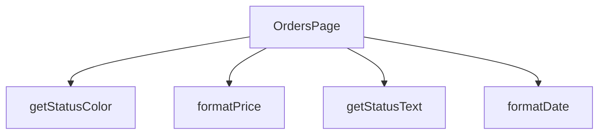

## Genel Bakış
Bu modül, siparişlerin görüntülendiği bir React sayfa bileşenidir. Sipariş verilerini okunabilir ve kullanıcı dostu formata dönüştürmek için çeşitli yardımcı fonksiyonlar içerir.

## Fonksiyon Grupları
### Ana Sayfa Bileşeni
Siparişler sayfasının temel yapısını, görüntüsünü ve genel işleyişini yöneten ana React bileşenidir.
- OrdersPage

### Veri Formatlama Yardımcıları
Siparişlerle ilgili bilgileri (tarih, fiyat) okunabilir formata dönüştürür ve durum bilgileri için görsel ipuçları sağlar.
- formatDate, formatPrice, getStatusColor, getStatusText

---

## AXIOMS – Mimari Varsayımlar
Bu modül, siparişleri görüntüleyen frontend React bileşenidir; çalışması için tüm yardımcı fonksiyonlara iletilen parametrelerin ve ana OrdersPage bileşenine aktarılan sipariş verilerinin tanımlı tür ve formatlarda gelmesi zorunludur.

[Aksiyom 1]: Eğer formatDate fonksiyonuna iletilen dateString parametresi geçerli string türünde değilse, tarih formatlama işlemi başarısız olur, sipariş tarihlerini kullanıcıya doğru şekilde gösteremez.
[Aksiyom 2]: Eğer formatPrice fonksiyonuna iletilen price parametresi geçerli sayısal (number) türünde değilse, fiyat formatlama işlemi başarısız olur, sipariş tutarları hatalı görüntülenir.
[Aksiyom 3]: Eğer getStatusColor ve getStatusText fonksiyonlarına iletilen status parametresi geçerli string türünde değilse, sipariş durumunun arayüzde gösterilmesi gereken rengi ve metni üretilemez, arayüzde hatalı durum görünümü oluşur.
[Aksiyom 4]: Eğer OrdersPage ana bileşenine props olarak her siparişe ait tarih, fiyat, durum gibi zorunlu alanları içeren geçerli sipariş listesi iletilmezse, sayfa içeriğini oluşturamaz, boş ya da hatalı arayüz gösterir.

---

## FONKSİYON DETAYLARI

### OrdersPage
**Ne yapar**: Fonksiyonun amacı ve işlevi kaynak kodunda belirtilmemiştir.  
**Nasıl yapar**: İç mantığı hakkında bilgi bulunmamaktadır.  
**Parametreler**:  
- (parametre yok)  
**Dönüş**: `React.FC` – bir React fonksiyonel bileşeni tipini döndürür.

### formatDate
**Ne yapar**: Fonksiyonun ne amaçla kullanıldığı ve ne yaptığı belirtilmemiştir.  
**Nasıl yapar**: İşlevsel içeriği hakkında bilgi mevcut değildir.  
**Parametreler**:  
- `dateString`: `string` — tarih bilgisini içeren metin.  
**Dönüş**: Belirtilmemiştir (return tipi bilinmiyor).

### formatPrice
**Ne yapar**: Fonksiyonun görevi ve çıktısı kaynakta tanımlanmamıştır.  
**Nasıl yapar**: İç mantığı hakkında veri bulunmamaktadır.  
**Parametreler**:  
- `price`: `number` — fiyat değerini temsil eden sayı.  
**Dönüş**: Belirtilmemiştir (return tipi bilinmiyor).

### getStatusColor
**Ne yapar**: Fonksiyonun işlevi ve kullanım amacı açıklanmamıştır.  
**Nasıl yapar**: İşlevsel detayları mevcut değildir.  
**Parametreler**:  
- `status`: `string` — durum bilgisini ifade eden metin.  
**Dönüş**: Belirtilmemiştir (return tipi bilinmiyor).

### getStatusText
**Ne yapar**: Fonksiyonun ne yaptığı ve ne döndürdüğü kaynakta yer almamaktadır.  
**Nasıl yapar**: İç mantığı hakkında bilgi yoktur.  
**Parametreler**:  
- `status`: `string` — durum bilgisini temsil eden metin.  
**Dönüş**: Belirtilmemiştir (return tipi bilinmiyor).

---

## INTERFACES

### Order
- `id: string`
- `total_amount: number`
- `status: string`
- `payment_status?: string`
- `created_at: string`
- `customer_name: string`
- `customer_email: string`
- `shipping_address: unknown`
- `order_items: OrderItem[]`
- `order_number?: string`
- `is_demo?: boolean`
- `payment_data?: unknown`
- `conversation_id?: string`
- `carrier?: string`
- `tracking_number?: string`
- `tracking_url?: string`
- `shipped_at?: string`
- `delivered_at?: string`

### OrderItem
- `id: string`
- `product_id?: string`
- `product_name: string`
- `quantity: number`
- `unit_price: number`
- `total_price: number`
- `product_image_url?: string`

---

## TYPE ALIASES

### StatusFilter
```typescript
type StatusFilter = 'all' | 'pending' | 'paid' | 'shipped' | 'delivered' | 'failed'
```

---

## AST POINTERS

### [N1_NASIL] AST Pointer: src\views\OrdersPage.tsx::fetchOrders
- **params**: (parametre yok)
- **ic_degiskenler**:
  - `setLoading` — component state setter, loading durumunu kontrol eder
  - `supabase` — Supabase client, veritabanı sorguları için kullanılır
  - `user` — oturum açmış kullanıcı nesnesi, `user?.id` ile filtreleme yapılır
  - `ordersData` — sorgu sonucu gelen sipariş listesi (raw)
  - `ordersError` — sorgu hatası nesnesi
  - `console` — hata loglamak için kullanılır
  - `toast` — kullanıcıya hata mesajı göstermek için `react-hot-toast` kullanılır
  - `t` — i18n çeviri fonksiyonu, hata mesajlarını yerelleştirir
  - `setOrders` — component state setter, formatlanmış siparişleri saklar
  - `searchParams` — URL sorgu parametreleri, ürün filtresi almak için kullanılır
  - `setProductFilter` — component state setter, URL’den gelen ürün filtresini saklar
- **Dönüş**: `void` (state güncellemeleri ve yan etkiler)

### [N2_NASIL] AST Pointer: src\views\OrdersPage.tsx::mapRawOrder
- **params**: `rawOrder: unknown`
- **ic_degiskenler**:
  - `order` — `rawOrder` bir obje ise onun kopyası, aksi takdirde boş obje
  - `itemsList` — `order.venthub_order_items` dizisi, yoksa boş dizi
  - `items` — `itemsList` üzerinden dönüştürülmüş `OrderItem` dizisi
  - `it` — `rawIt` bir obje ise onun kopyası (inner mapper içinde)
- **Dönüş**: `Order` (formatlanmış sipariş nesnesi)

### [N3_NASIL] AST Pointer: src\views\OrdersPage.tsx::mapRawItem
- **params**: `rawIt: unknown`
- **ic_degiskenler**:
  - `it` — `rawIt` bir obje ise onun kopyası, aksi takdirde boş obje
- **Dönüş**: `OrderItem` (formatlanmış sipariş kalemi)

### [N4_NASIL] AST Pointer: src\views\OrdersPage.tsx::authEffect
- **params**: (parametre yok)
- **ic_degiskenler**:
  - `authLoading` — auth hook’dan gelen yükleme durumu
  - `user` — oturum açmış kullanıcı nesnesi
  - `router` — Next.js router, yönlendirme için kullanılır
  - `Routes` — uygulama rotaları sabiti
  - `fetchOrders` — siparişleri getiren fonksiyon
- **Dönüş**: `void` (yönlendirme ve veri çekme yan etkileri)

### [N5_NASIL] AST Pointer: src\views\OrdersPage.tsx::formatDate
- **params**: `dateString: string`
- **ic_degiskenler**:
  - `formatDateTime` — tarih‑zaman formatlayıcı fonksiyon
  - `lang` — geçerli dil kodu (i18n provider’dan alınır)
- **Dönüş**: `string` (formatlanmış tarih)

### [N6_NASIL] AST Pointer: src\views\OrdersPage.tsx::formatPrice
- **params**: `price: number`
- **ic_degiskenler**:
  - `formatCurrency` — para birimi formatlayıcı fonksiyon
  - `lang` — geçerli dil kodu
- **Dönüş**: `string` (formatlanmış fiyat)

### [N7_NASIL] AST Pointer: src\views\OrdersPage.tsx::getStatusColor
- **params**: `status: string`
- **ic_degiskenler**:
  - `status` — sipariş durumu, küçük harfe dönüştürülerek karşılaştırılır
- **Dönüş**: `string` (CSS sınıfı, renk kodu)

### [N8_NASIL] AST Pointer: src\views\OrdersPage.tsx::getStatusText
- **params**: `status: string`
- **ic_degiskenler**:
  - `t` — i18n çeviri fonksiyonu
  - `status` — sipariş durumu, küçük harfe dönüştürülerek karşılaştırılır
- **Dönüş**: `string` (yerelleştirilmiş durum metni)

### [N9_NASIL] AST Pointer: src\views\OrdersPage.tsx::orderFilter
- **params**: `o`
- **ic_degiskenler**:
  - `productFilter` — URL’den gelen ürün filtresi
  - `statusFilter` — seçili durum filtresi
  - `dateFrom` — başlangıç tarihi filtresi
  - `dateTo` — bitiş tarihi filtresi
  - `searchCode` — sipariş kodu arama filtresi
  - `q` — `productFilter`’ın küçük harfe dönüştürülmüş hali
  - `match` — ürün adı filtre kontrol sonucu
  - `code` — sipariş numarasından türetilen kod
- **Dönüş**: `boolean` (siparişin filtreye uygunluğu)

### [N10_NASIL] AST Pointer: src\views\OrdersPage.tsx::orderRowRenderer
- **params**: `order`
- **ic_degiskenler**:
  - `steps` — sipariş aşamaları dizisi
  - `stepLabel` — aşama etiketleri haritası
  - `formatDate` — tarih formatlayıcı
  - `formatPrice` — fiyat formatlayıcı
  - `getStatusColor` — durum renk sınıfı
  - `getStatusText` — durum metni
  - `t` — i18n çeviri fonksiyonu
  - `router` — Next.js router, detay sayfasına yönlendirme
  - `order` — mevcut sipariş nesnesi, JSX içinde çeşitli alanları kullanılır
- **Dönüş**: `JSX.Element` (sipariş kartı)

### [N11_NASIL] AST Pointer: src\views\OrdersPage.tsx::stepRenderer
- **params**: `s, idx`
- **ic_degiskenler**:
  - `order` — dış scope’tan gelen sipariş nesnesi
  - `steps` — aşama dizisi
  - `stepLabel` — aşama etiketleri
  - `normalizedStatus` — `order.status` “confirmed” ise “paid” olarak normalize edilir
  - `activeIdx` — aktif aşama indeksini belirler
  - `active` — mevcut indeksin aktif olup olmadığını gösterir
- **Dönüş**: `JSX.Element` (adım göstergesi)

---


## MERMAID CALL GRAPH


## NODE ID STANDARD

  file: src\views\OrdersPage.tsx
  function: src\views\OrdersPage.tsx::OrdersPage
  function: src\views\OrdersPage.tsx::formatDate
  function: src\views\OrdersPage.tsx::formatPrice
  function: src\views\OrdersPage.tsx::getStatusColor
  function: src\views\OrdersPage.tsx::getStatusText

---

## DISA AKTARILANLAR (EXPORTS)
  export: OrdersPage

---

## STİL TOKENLERİ

### Arbitrary Değerler (token'a geçirilmemiş)
Yok — tüm stiller token'a geçirilmiş. ✅

### Kullanılan Token'lar (zaten token'a geçirilmiş)
- (yok)

### Tailwind Sınıf Özeti
- **Renkler:** `bg-clean-white`, `bg-orange-100`, `bg-orange-100/80`, `bg-primary-navy`, `bg-primary-navy/5`, `bg-slate-100`, `bg-slate-50`, `bg-white`, `border-b`, `border-b-2`, `border-orange-200`, `border-primary-navy`, `border-slate-100`, `border-slate-200`, `border-slate-200/60`
- **Layout:** `flex`, `flex-1`, `flex-col`, `gap-2`, `gap-4`, `grid`, `grid-cols-1`, `h-1`, `h-10`, `h-12`, `h-16`, `h-7`, `inline-flex`, `items-center`, `justify-between`
- **Varyant/Responsive:** `:`, `focus-visible:`, `hover:`, `md:` önekleri
- **Yardımcı Sınıflar:** `${active`, `${activeIdx`, `${getStatusColor(order.status`, `1`, `:`, `>=`, `animate-spin`, `border`, `focus-visible:outline-none`, `focus-visible:ring-2`, `focus-visible:ring-primary-navy/20`, `font-bold`, `font-medium`, `hover:scale-102`, `idx`