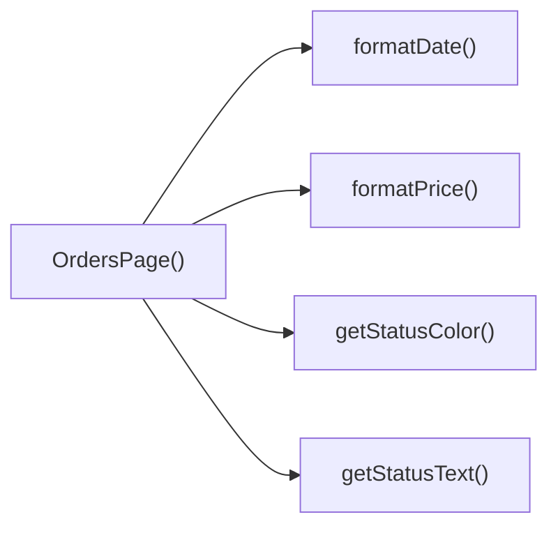

## Genel Bakış
VentHub HVAC platformunun siparişler listesi sayfasını oluşturan React modülüdür. Sayfada görüntülenecek sipariş verilerini kullanıcı dostu formata dönüştürmek, sipariş durumlarının arayüzde doğru şekilde yansımasını sağlamak için gereken tüm fonksiyonları barındırır. Tek bir ana sayfa bileşeni ve ona destek olan yardımcı fonksiyonlardan oluşur.

## Fonksiyon Grupları
### Ana Sayfa Bileşeni
Siparişler sayfasının temel React bileşeni olarak çalışır, sayfanın tüm yapısını oluşturur, sipariş verilerini işler ve modül içindeki yardımcı fonksiyonları kullanarak içeriği son kullanıcıya sunar.
- OrdersPage

### Veri Formatlama ve Görselleştirme Yardımcıları
Siparişlerdeki ham tarih ve fiyat verilerini okunabilir, standart formata dönüştürür, sipariş durumlarına göre arayüzde kullanılacak metin ve renk değerlerini belirleyerek tüm siparişlerde tutarlı bir görüntüleme sağlar.
- formatDate, formatPrice, getStatusColor, getStatusText

---

## AXIOMS – Mimari Varsayımlar
Bu React tabanlı sipariş görüntüleme sayfası modülü, HVAC platformundaki kullanıcı siparişlerini listelemek ve görüntülemek üzere tasarlanmıştır, çalışması için tüm sipariş verilerinin üst componentlerden prop olarak iletilmesi ve bağlı yardımcı fonksiyonların çalıştığı runtime ortamının sorunsuz olması zorunludur.

[Aksiyom 1]: Eğer OrdersPage componentine görüntülenecek sipariş listesi verisi prop olarak iletilmezse, sayfada hiçbir sipariş kaydı görüntülenemez, kullanıcı boş bir arayüzle karşılaşır.
[Aksiyom 2]: Eğer formatDate fonksiyonuna aktarılan dateString parametresi parse edilebilir geçerli bir tarih formatlı string değilse, ilgili siparişin tarih bilgisi ekranda hatalı veya okunamaz şekilde görüntülenir.
[Aksiyom 3]: Eğer formatPrice fonksiyonuna aktarılan price parametresi geçerli bir sayısal değer değilse, ilgili siparişin tutar bilgisi yanlış formatta veya anlamsız bir değer olarak ekranda görünür.
[Aksiyom 4]: Eğer getStatusColor ve getStatusText fonksiyonlarına aktarılan status string değeri sistemde tanımlı geçerli sipariş durumu değerlerinden biri değilse, ilgili siparişin durumu renksiz veya anlaşılmaz bir metin olarak görüntülenir.
[Aksiyom 5]: Eğer modülün bağlı olduğu React runtime ortamında componentler arası veri iletim mekanizması çalışmıyorsa, OrdersPage componenti hiç render olmaz veya oluşan runtime hatası uygulamayı çöker.

---

## FONKSIYON DETAYLARI

### OrdersPage
**Ne yapar**: VentHub HVAC sisteminin siparişler yönetimi sayfasını oluşturan ana React root bileşenidir. Tüm sipariş listeleme, görüntüleme ve temel durum sunumu işlevlerini barındıran siparişler sayfasının tek giriş noktasıdır.
**Nasıl yapar**: Kendi içinde barındırdığı yardımcı formatlama ve durum eşleştirme fonksiyonlarını kullanarak ham sipariş verilerini kullanıcı dostu bir arayüze dönüştürür, React bileşen yaşam döngüsüne uygun olarak sayfa içeriğini kullanıcıya sunar.
**Parametreler**:
- Herhangi bir giriş parametresi almaz, ana sayfa bileşeni olarak çalışır.
**Dönüş**: React.FC tipi, arayüzde görüntülenmek üzere geçerli bir React bileşeni döndürür.

### formatDate
**Ne yapar**: Sipariş verilerinde yer alan ham tarih string'lerini kullanıcıların okuyabileceği standart, tutarlı bir formata dönüştüren özel yardımcı fonksiyondur. Sadece siparişler sayfasının tarih formatlama ihtiyacını karşılamak üzere tasarlanmıştır.
**Nasıl yapar**: Gelen ham tarih string'ini (genellikle veri tabanından gelen ISO formatı) ayrıştırır, yerel ayarlara uygun gün/ay/yıl ve isteğe bağlı saat bilgisiyle yeniden yapılandırarak tüm siparişlerde aynı tarih sunumunu sağlar.
**Parametreler**:
- dateString: string — İşlenecek ham tarih verisini içeren string tipinde parametre, orijinal işlenmemiş tarih bilgisini taşır.
**Dönüş**: Fonksiyonun dönüş tipi mevcut tanımda net olarak belirtilmemiştir, formatlanmış okunabilir tarih string'ini döndürmesi beklenir ancak herhangi bir varsayım veya uydurma yapılmamıştır.

### formatPrice
**Ne yapar**: Siparişlerdeki ürün ve hizmetlerin ham sayısal fiyat değerlerini para birimi kurallarına uygun, tutarlı biçimde formatlayan yardımcı fonksiyondur. Tüm sipariş listesindeki fiyatların aynı standartta görünmesini sağlar.
**Nasıl yapar**: Gelen sayısal fiyat değerini binlik ayırıcı, ondalık basamak ayarları ve ilgili para birimi simgesiyle standart para formatına dönüştürerek kullanıcının kolayca anlayabileceği bir sunum hazırlar.
**Parametreler**:
- price: number — Formatlanacak ham sayısal fiyat değerini taşıyan parametre, işlenmemiş maliyet verisini içerir.
**Dönüş**: Fonksiyonun dönüş tipi mevcut tanımda net olarak belirtilmemiştir, formatlanmış para birimi string'ini döndürmesi beklenir ancak herhangi bir varsayım veya uydurma yapılmamıştır.

### getStatusColor
**Ne yapar**: Siparişlerin mevcut durumuna göre arayüzde kullanılacak uygun renk kodları veya CSS sınıf isimlerini belirleyen yardımcı fonksiyondur. Sipariş durumlarının görsel olarak hızlıca ayırt edilmesini sağlar.
**Nasıl yapar**: Gelen durum string'ini eşleştirerek, örneğin beklemede, teslim edildi, iptal edildi gibi durumlara karşılık gelen sarı, yeşil, kırmızı gibi ilgili renkleri veya CSS sınıflarını belirler, arayüzde görsel tutarlılık sunar.
**Parametreler**:
- status: string — Siparişin mevcut durumunu içeren string tipinde parametre, renk eşleştirmesi yapılacak temel durum bilgisini taşır.
**Dönüş**: Fonksiyonun dönüş tipi mevcut tanımda net olarak belirtilmemiştir, arayüzde kullanılacak renk kodu veya CSS sınıfı string'ini döndürmesi beklenir ancak herhangi bir varsayım veya uydurma yapılmamıştır.

### getStatusText
**Ne yapar**: Siparişlerin sistem içindeki ham durum kodlarını veya yabancı dildeki durum string'lerini kullanıcının anlayabileceği yerelleştirilmiş, okunabilir metinlere dönüştüren yardımcı fonksiyondur. Tüm durum metinlerinin siparişler sayfasında tutarlı bir şekilde yazılmasını sağlar.
**Nasıl yapar**: Gelen ham durum string'ini eşleyerek, örneğin "delivered" gibi sistem içi ifadeyi "Teslim Edildi", "pending" ifadesini "Beklemede" gibi kullanıcı dostu metinlere çevirir, sayfa içindeki tüm durum yazımlarını standartlaştırır.
**Parametreler**:
- status: string — İşlenecek ham sipariş durumu string'ini taşıyan parametre, çevrilecek orijinal durum bilgisini içerir.
**Dönüş**: Fonksiyonun dönüş tipi mevcut tanımda net olarak belirtilmemiştir, yerelleştirilmiş okunabilir durum metni string'ini döndürmesi beklenir ancak herhangi bir varsayım veya uydurma yapılmamıştır.

---

## INTERFACES

### Order
- `id: string`
- `total_amount: number`
- `status: string`
- `payment_status?: string`
- `created_at: string`
- `customer_name: string`
- `customer_email: string`
- `shipping_address: unknown`
- `order_items: OrderItem[]`
- `order_number?: string`
- `is_demo?: boolean`
- `payment_data?: unknown`
- `conversation_id?: string`
- `carrier?: string`
- `tracking_number?: string`
- `tracking_url?: string`
- `shipped_at?: string`
- `delivered_at?: string`

### OrderItem
- `id: string`
- `product_id?: string`
- `product_name: string`
- `quantity: number`
- `unit_price: number`
- `total_price: number`
- `product_image_url?: string`

---

## TYPE ALIASES

### StatusFilter
```typescript
type StatusFilter = 'all' | 'pending' | 'paid' | 'shipped' | 'delivered' | 'failed'
```

---

## AST POINTERS

### [N1_NASIL] AST Pointer: C:\Users\alize\venthub-hvac\src\views\OrdersPage.tsx::fetchOrders
- **params**: (parametre yok)
- **ic_degiskenler**:
  - `setLoading` — Sipariş yükleme durumunu güncelleyen state setter fonksiyonu
  - `supabase` — Veritabanı sorguları için kullanılan Supabase istemcisi
  - `ordersData` — Supabase'den gelen ham sipariş verilerini tutan değişken
  - `ordersError` — Sorgu sırasında oluşan hatayı tutan değişken
  - `ordersError.code` — Hata nesnesinin özel hata kodu alanı
  - `ordersError.status` — Hata nesnesinin HTTP durum kodu alanı
  - `user?.id` — Oturum açmış kullanıcının ID'si, kendi siparişlerini filtrelemek için kullanılır
  - `toast.error` — Kullanıcıya hata bildirimi göstermek için kullanılan toast fonksiyonu
  - `t` — Çeviri metinlerini çekmek için kullanılan i18n fonksiyonu
  - `formattedOrders` — Ham veriyi uygulama sipariş tipine dönüştürülmüş listesi
  - `rawOrder` — Map fonksiyonunda işlenen her bir ham sipariş nesnesi
  - `isRecord` — Nesne tip kontrolü yapan tip güvenliği fonksiyonu
  - `order` — Ham siparişin güvenli cast edilmiş işlenebilir hali
  - `itemsList` — Sipariş ürünleri listesinin dizi olarak doğrulanmış hali
  - `order.venthub_order_items` — Veritabanından gelen ilişkisel sipariş ürünleri verisi
  - `items` — Dönüştürülmüş sipariş ürünleri listesi
  - `rawIt` — Ürün listesinde işlenen her bir ham ürün nesnesi
  - `it` — Ham ürünün güvenli cast edilmiş işlenebilir hali
  - `setOrders` — Bileşenin genel sipariş state'ini güncelleyen setter
  - `searchParams` — Next.js URL sorgu parametreleri nesnesi
  - `productQ` — URL'den alınan ürün filtresi sorgu değeri
  - `setProductFilter` — Ürün filtresi state'ini güncelleyen setter
  - `error` — Try bloğunda yakalanan genel hata nesnesi
- **Dönüş**: void (hata durumunda erken dönüş, başarılı durumda state günceller)

### [N2_NASIL] AST Pointer: C:\Users\alize\venthub-hvac\src\views\OrdersPage.tsx::formatRawOrder
- **params**: (rawOrder: unknown)
- **ic_degiskenler**:
  - `order` — Ham siparişin güvenli cast edilmiş işlenebilir nesnesi
  - `itemsList` — Sipariş ürünleri listesinin dizi olarak doğrulanmış hali
  - `order.venthub_order_items` — Veritabanından gelen ilişkisel ürün verisi
  - `items` — Dönüştürülmüş sipariş ürünleri listesi
  - `rawIt` — Ürün listesinde işlenen her bir ham ürün nesnesi
  - `it` — Ham ürünün güvenli cast edilmiş işlenebilir hali
  - `user?.user_metadata?.full_name` — Kullanıcının profildeki tam adı, varsayılan müşteri ismi olarak kullanılır
  - `user?.email` — Kullanıcının kayıtlı e-postası, varsayılan iletişim bilgisi olarak kullanılır
- **Dönüş**: Order (tip güvenli uygulama sipariş nesnesi)

### [N3_NASIL] AST Pointer: C:\Users\alize\venthub-hvac\src\views\OrdersPage.tsx::formatRawOrderItem
- **params**: (rawIt: unknown)
- **ic_degiskenler**:
  - `it` — Ham ürün nesnesinin güvenli cast edilmiş işlenebilir hali
  - `it.id` — Ürün kaleminin benzersiz ID'si
  - `it.product_id` — İlişkili ana ürünün ID'si
  - `it.product_name` — Ürünün görünen adı
  - `it.quantity` — Sipariş edilen ürün adedi
  - `it.price_at_time` — Sipariş anındaki ürün birim fiyatı
  - `it.product_image_url` — Ürünün görselinin depolama linki
- **Dönüş**: OrderItem (tip güvenli uygulama sipariş kalemi nesnesi)

### [N4_NASIL] AST Pointer: C:\Users\alize\venthub-hvac\src\views\OrdersPage.tsx::authGuardEffect
- **params**: (parametre yok)
- **ic_degiskenler**:
  - `authLoading` — Kimlik doğrulama yükleme durumu
  - `user` — Oturum açmış kullanıcı nesnesi
  - `router` — Next.js yönlendirme nesnesi
  - `Routes.auth.login` — Giriş sayfası rotası, yönlendirme için kullanılır
  - `fetchOrders` — Siparişleri çeken ana fonksiyon, kullanıcı varsa tetiklenir
- **Dönüş**: void (giriş yapmamış kullanıcıyı login sayfasına yönlendirir)

### [N5_NASIL] AST Pointer: C:\Users\alize\venthub-hvac\src\views\OrdersPage.tsx::formatDate
- **params**: (dateString: string)
- **ic_degiskenler**:
  - `formatDateTime` — Genel tarih formatlama fonksiyonu
  - `lang` — Uygulamanın aktif dil kodu, yerel ayarlara göre formatlamak için kullanılır
- **Dönüş**: string (yerelleştirilmiş formatlanmış tarih metni)

### [N6_NASIL] AST Pointer: C:\Users\alize\venthub-hvac\src\views\OrdersPage.tsx::formatPrice
- **params**: (price: number)
- **ic_degiskenler**:
  - `formatCurrency` — Genel para birimi formatlama fonksiyonu
  - `lang` — Uygulamanın aktif dil kodu, yerel para birimi ayarları için kullanılır
- **Dönüş**: string (yerelleştirilmiş formatlanmış fiyat metni)

### [N7_NASIL] AST Pointer: C:\Users\alize\venthub-hvac\src\views\OrdersPage.tsx::getStatusColor
- **params**: (status: string)
- **ic_degiskenler**:
  - `status.toLowerCase()` — Durum metnini küçük harfe çevirerek case insensitive karşılaştırma yapmak için kullanılır
- **Dönüş**: string (sipariş durumuna göre Tailwind CSS renk sınıfları)

### [N8_NASIL] AST Pointer: C:\Users\alize\venthub-hvac\src\views\OrdersPage.tsx::getStatusText
- **params**: (status: string)
- **ic_degiskenler**:
  - `status.toLowerCase()` — Durum metnini küçük harfe çevirerek case insensitive karşılaştırma yapmak için kullanılır
  - `t` — Çeviri metinlerini çekmek için kullanılan i18n fonksiyonu
- **Dönüş**: string (sipariş durumunun yerelleştirilmiş görünen metni)

### [N9_NASIL] AST Pointer: C:\Users\alize\venthub-hvac\src\views\OrdersPage.tsx::filterOrder
- **params**: (o: Order)
- **ic_degiskenler**:
  - `productFilter` — Aktif ürün arama filtresi değeri
  - `q` — Küçük harfe çevrilmiş arama sorgusu, karşılaştırmada kullanılır
  - `o.order_items` — Siparişin ürün listesi, ürün adı araması için taranır
  - `it.product_name` — Ürünün adı, arama sorgusuyla eşleştirilir
  - `statusFilter` — Aktif durum filtresi değeri
  - `o.status` — Siparişin durumu, durum filtresiyle karşılaştırılır
  - `dateFrom` — Başlangıç tarihi filtresi, sipariş oluşturma tarihiyle karşılaştırılır
  - `o.created_at` — Siparişin oluşturulma tarihi, tarih filtrelerinde kullanılır
  - `dateTo` — Bitiş tarihi filtresi, sipariş oluşturma tarihiyle karşılaştırılır
  - `searchCode` — Sipariş kodu arama filtresi
  - `o.order_number` — Siparişin resmi numarası, arama için kırpılır
  - `o.id` — Siparişin benzersiz ID'si, order_number yoksa yedek olarak kullanılır
- **Dönüş**: boolean (sipariş tüm filtreleri geçiyorsa true, geçmiyorsa false)

### [N10_NASIL] AST Pointer: C:\Users\alize\venthub-hvac\src\views\OrdersPage.tsx::renderOrderCard
- **params**: (order: Order)
- **ic_degiskenler**:
  - `order.id` — Siparişin benzersiz ID'si, React anahtarı ve detay yönlendirmesi için kullanılır
  - `steps` — Sipariş ilerleme adımları listesi
  - `s` — Adım listesinde işlenen her bir adım metni
  - `idx` — Adımın listedeki indeksi
  - `normalizedStatus` — 'confirmed' durumunu 'paid' olarak normalleştiren değer, ilerleme çubuğu için kullanılır
  - `activeIdx` — Mevcut sipariş durumunun adım listesindeki indeksi
  - `active` — Adımın tamamlanıp tamamlanmadığını belirten boolean
  - `stepLabel[s]` — Adımın yerelleştirilmiş görünen metni
  - `order.order_number` — Siparişin numarası, kart başlığında gösterilir
  - `order.is_demo` — Siparişin demo olup olmadığı, etiket göstermek için kullanılır
  - `order.created_at` — Siparişin oluşturulma tarihi, formatlanarak kartta gösterilir
  - `order.total_amount` — Siparişin toplam tutarı, formatlanarak kartta gösterilir
  - `order.status` — Siparişin durumu, renk ve metin için formatlanır
  - `order.payment_status` — Ödeme durumu, kısmi iade etiketi göstermek için kullanılır
  - `router` — Next.js yönlendirme nesnesi, detay sayfasına gitmek için kullanılır
  - `formatDate` — Tarih formatlama fonksiyonu
  - `formatPrice` — Fiyat formatlama fonksiyonu
  - `getStatusColor` — Durum rengi getiren fonksiyon
  - `getStatusText` — Durum metni getiren fonksiyon
  - `t` — Çeviri metinleri çeken i18n fonksiyonu
  - Lucide ikonları (Package, Calendar, CreditCard, Eye) — Kartta görsel olarak kullanılır
- **Dönüş**: JSX.Element (tek sipariş için render edilmiş kart bileşeni)

### [N11_NASIL] AST Pointer: C:\Users\alize\venthub-hvac\src\views\OrdersPage.tsx::renderProgressStep
- **params**: (s: string, idx: number)
- **ic_degiskenler**:
  - `order.status` — İşlenen siparişin mevcut durumu
  - `normalizedStatus` - 'confirmed' durumunu 'paid' olarak normalleştiren değer, ilerleme hesaplamak için kullanılır
  - `activeIdx` — Mevcut durumun adım listesindeki indeksi
  - `active` — Adımın tamamlanıp tamamlanmadığını belirten boolean
  - `stepLabel[s]` — Adımın yerelleştirilmiş görünen metni
- **Dönüş**: React.Fragment (sipariş ilerleme çubuğunun tek adımını içeren fragment)

---

## ÇAĞRI HARİTASI

### Disariya Cagrilar (Outgoing)
OrdersPage() ana fonksiyonu, sipariş verilerini sayfada gösterebilmek için durum metnini getStatusText, fiyat bilgisini formatPrice, tarih bilgisini formatDate ve durum renk kodlarını getStatusColor fonksiyonlarından almak üzere bu 4 dahili fonksiyonu çağırır.

### Disaridan Cagrilanlar (Incoming)
Sağlanan çağrı verisinde bu modülü kullanan dış dosya veya fonksiyon bilgisi mevcut değildir.

### Ic Ice Fonksiyonlar (Nested)
Yok

---

## DOSYA-İÇİ ÇAĞRI GRAFİĞİ
  OrdersPage() → formatDate()
  OrdersPage() → formatPrice()
  OrdersPage() → getStatusColor()
  OrdersPage() → getStatusText()



---

## NODE ID STANDARD

  file: src\views\OrdersPage.tsx
  function: src\views\OrdersPage.tsx::OrdersPage
  function: src\views\OrdersPage.tsx::formatDate
  function: src\views\OrdersPage.tsx::formatPrice
  function: src\views\OrdersPage.tsx::getStatusColor
  function: src\views\OrdersPage.tsx::getStatusText

---

## DISA AKTARILANLAR (EXPORTS)
  export: OrdersPage