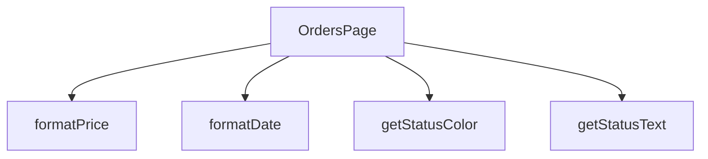

## Genel Bakış
Bu modül, siparişlerin listelendiği ve görüntülendiği bir React sayfasıdır. Sipariş verilerini kullanıcı arayüzünde göstermek için gerekli olan tarih, fiyat ve durum gibi bilgileri formatlayan yardımcı fonksiyonlar içerir.

## Fonksiyon Grupları
### Ana Sayfa Bileşeni
Siparişler sayfasının ana yapısını, veri akışını ve kullanıcı arayüzünü yöneten temel React bileşenidir.
- OrdersPage

### Veri Görünüm Formatlayıcıları
Siparişlerle ilgili ham veriyi (tarih, fiyat, durum kodu) kullanıcı dostu metinlere ve arayüz stillerine dönüştüren yardımcı fonksiyonlardır.
- formatDate, formatPrice, getStatusColor, getStatusText

---

## AXIOMS – Mimari Varsayımlar

Bu modül, fonksiyon imzalarından yola çıkarak belirlenen temel veri tipi ve geçerlilik varsayımlarına dayanır.

**[Aksiyom 1]:** Eğer `formatDate` fonksiyonuna `dateString` parametresi olarak geçerli bir ISO tarih formatı (örn: `YYYY-MM-DDTHH:mm:ss.sssZ`) veya JavaScript tarafından parse edilebilir bir tarih dizisi verilmezse, "Invalid Date" veya beklenmeyen bir çıktı üretilir.

**[Aksiyom 2]:** Eğer `formatPrice` fonksiyonuna `price` parametresi olarak geçerli bir sayısal değer (`number`) verilmezse, para birimi formatlaması hatalı sonuç üretir veya hata fırlatır.

**[Aksiyom 3]:** Eğer `getStatusColor` fonksiyonuna beklenmeyen (tanımsız) bir `status` değeri verilirse, fonksiyonun döndüren renk değeri bilinmeyen veya tutarsız olabilir — işlevsel davranışı fonksiyon gövdesine bağlıdır.

**[Aksiyom 4]:** Eğer `getStatusText` fonksiyonuna beklenmeyen (tanımsız) bir `status` değeri verilirse, fonksiyonun döndüren metin değeri bilinmeyen veya tutarsız olabilir — işlevsel davranışı fonksiyon gövdesine bağlıdır.

**[Aksiyom 5]:** `OrdersPage` bileşeni, işlevsel olabilmesi için ilgili sipariş verilerine (API veya state) erişim sağlamak zorundadır; veri kaynağı mevcut değilse bileşen boş veya hata durumunda görüntülenir.

---

> **Not:** `getStatusColor` ve `getStatusText` için geçerli `status` değerleri (örn: `"pending"`, `"completed"` vb.) fonksiyon gövdesinde tanımlı olmakla birlikte, verilen imza bilgisinden bu değerler kesin olarak çıkarılamamıştır. Dolayısıyla bu fonksiyonların beklenmeyen girdilere karşı davranışları **bilinmiyor** olarak belirtilmiştir.

---

## FONKSİYON DETAYLARI

### OrdersPage
**Ne yapar**: Fonksiyonun amacı ve işlevi kaynak kodunda belirtilmemiştir.  
**Nasıl yapar**: İç mantığı hakkında bilgi bulunmamaktadır.  
**Parametreler**:  
- (parametre yok)  
**Dönüş**: `React.FC` – bir React fonksiyonel bileşeni tipini döndürür.

### formatDate
**Ne yapar**: Fonksiyonun ne amaçla kullanıldığı ve ne yaptığı belirtilmemiştir.  
**Nasıl yapar**: İşlevsel içeriği hakkında bilgi mevcut değildir.  
**Parametreler**:  
- `dateString`: `string` — tarih bilgisini içeren metin.  
**Dönüş**: Belirtilmemiştir (return tipi bilinmiyor).

### formatPrice
**Ne yapar**: Fonksiyonun görevi ve çıktısı kaynakta tanımlanmamıştır.  
**Nasıl yapar**: İç mantığı hakkında veri bulunmamaktadır.  
**Parametreler**:  
- `price`: `number` — fiyat değerini temsil eden sayı.  
**Dönüş**: Belirtilmemiştir (return tipi bilinmiyor).

### getStatusColor
**Ne yapar**: Fonksiyonun işlevi ve kullanım amacı açıklanmamıştır.  
**Nasıl yapar**: İşlevsel detayları mevcut değildir.  
**Parametreler**:  
- `status`: `string` — durum bilgisini ifade eden metin.  
**Dönüş**: Belirtilmemiştir (return tipi bilinmiyor).

### getStatusText
**Ne yapar**: Fonksiyonun ne yaptığı ve ne döndürdüğü kaynakta yer almamaktadır.  
**Nasıl yapar**: İç mantığı hakkında bilgi yoktur.  
**Parametreler**:  
- `status`: `string` — durum bilgisini temsil eden metin.  
**Dönüş**: Belirtilmemiştir (return tipi bilinmiyor).

---

## INTERFACES

### Order
- `id: string`
- `total_amount: number`
- `status: string`
- `payment_status?: string`
- `created_at: string`
- `customer_name: string`
- `customer_email: string`
- `shipping_address: unknown`
- `order_items: OrderItem[]`
- `order_number?: string`
- `is_demo?: boolean`
- `payment_data?: unknown`
- `conversation_id?: string`
- `carrier?: string`
- `tracking_number?: string`
- `tracking_url?: string`
- `shipped_at?: string`
- `delivered_at?: string`

### OrderItem
- `id: string`
- `product_id?: string`
- `product_name: string`
- `quantity: number`
- `unit_price: number`
- `total_price: number`
- `product_image_url?: string`

---

## TYPE ALIASES

### StatusFilter
```typescript
type StatusFilter = 'all' | 'pending' | 'paid' | 'shipped' | 'delivered' | 'failed'
```

---

## AST POINTERS

### [N1_NASIL] AST Pointer: src/views/OrdersPage.tsx::fetchOrders (async anonim)
- **params**: (parametre yok — useCallback ile tanımlı anonim fonksiyon)
- **ic_degiskenler**:
  - `ordersData` — supabase'den dönen ham sipariş verisi (satır listesi), select ile nested order_items dahil
  - `ordersError` — supabase sorgusundan dönen hata nesnesi, varsa fetch iptal edilir
  - `formattedOrders` — ham verinin Order[] tipine dönüştürülmüş hali, map ile her rawOrder dönüştürülür
  - `rawOrder` — map callback'inin her bir ham sipariş satırı parametresi (unknown tip)
  - `order` — rawOrder'ın Record tipine güvenli dönüştürülmüş hali, alanlara erişim için kullanılır
  - `itemsList` — order.venthub_order_items dizisi veya boş dizi, array guard ile alınır
  - `items` — OrderItem[] tipinde dönüştürülmüş sipariş kalemleri listesi
  - `rawIt` — itemsList map callback'inin her bir ham kalem satırı parametresi
  - `it` — rawIt'ın Record tipine güvenli dönüştürülmüş hali
  - `searchParams` — URL arama parametrelerinden product filtresi okunur (useSearchParams hook)
  - `productQ` — URL'deki `?product=` değerini tutan string
- **Dönüş**: void (setOrders ile state'i günceller, setLoading ile loading durumunu kapatır, toast ile hata bildirir)

---

### [N2_NASIL] AST Pointer: src/views/OrdersPage.tsx::ordersData.map callback (rawOrder -> Order)
- **params**: `rawOrder: unknown` — supabase'den dönen tek bir ham sipariş satırı
- **ic_degiskenler**:
  - `order` — rawOrder'ın `isRecord(rawOrder)` guard'ı ile Record'a dönüştürülmüş hali
  - `itemsList` — `order.venthub_order_items` alanından alınan dizi veya boş dizi fallback
  - `items` — her rawIt'ı OrderItem objesine dönüştüren nested map sonucu, OrderItem[] tipinde
  - `rawIt` — itemsList içindeki her bir ham kalem verisi (unknown)
  - `it` — rawIt'ın `isRecord(rawIt)` ile güvenli cast edilmiş Record hali
- **Dönüş**: `Order` objesi — id, total_amount, status, payment_status, created_at, customer_name, customer_email, shipping_address, order_items, order_number, is_demo, payment_data, conversation_id, carrier, tracking_number, tracking_url, shipped_at, delivered_at alanlarını içerir

---

### [N3_NASIL] AST Pointer: src/views/OrdersPage.tsx::itemsList.map callback (rawIt -> OrderItem)
- **params**: `rawIt: unknown` — venthub_order_items dizisindeki tek bir ham kalem satırı
- **ic_degiskenler**:
  - `it` — rawIt'ın `isRecord(rawIt)` ile Record'a cast edilmiş hali
- **Dönüş**: `OrderItem` objesi — id (String), product_id (String|undefined), product_name (String), quantity (Number), unit_price (price_at_time'dan Number), total_price (unit_price * quantity), product_image_url (String|undefined)

---

### [N4_NASIL] AST Pointer: src/views/OrdersPage.tsx::useEffect guard callback
- **params**: (parametre yok — useEffect hook callback)
- **ic_degiskenler**:
  - `authLoading` — useAuth hook'tan gelen yüklenme durumu boolean'ı, true ise henüz kontrol bitmemiştir
  - `user` — useAuth hook'tan gelen mevcut kullanıcı nesnesi, null ise giriş yapılmamıştır
  - `router` — useRouter hook'tan gelen Next.js router nesnesi, login sayfasına yönlendirme için kullanılır
- **Dönüş**: void (auth yoksa login sayfasına push, user varsa fetchOrders çağırır)

---

### [N5_NASIL] AST Pointer: src/views/OrdersPage.tsx::formatDate
- **params**: `dateString: string` — formatlanacak tarih stringi (ISO veya benzeri format)
- **ic_degiskenler**: (yok — doğrudan return)
- **Dönüş**: `formatDateTime(dateString, lang)` çağırısının sonucu, lang useI18n hook'undan gelen dil kodu

---

### [N6_NASIL] AST Pointer: src/views/OrdersPage.tsx::formatPrice
- **params**: `price: number` — formatlanacak para miktarı (sayısal değer)
- **ic_degiskenler**: (yok — doğrudan return)
- **Dönüş**: `formatCurrency(price, lang, { maximumFractionDigits: 0 })` çağırısının sonucu, lang useI18n'den gelir, ondalık basamak gösterilmez

---

### [N7_NASIL] AST Pointer: src/views/OrdersPage.tsx::getStatusColor
- **params**: `status: string` — sipariş durumunu belirten string
- **ic_degiskenler**: (yok — switch-case içinde return)
- **Dönüş**: Tailwind CSS renk class string'i — pending: `bg-yellow-100 text-yellow-800`, paid/confirmed: `bg-blue-100 text-blue-800`, shipped: `bg-purple-100 text-purple-800`, delivered: `bg-green-100 text-green-800`, failed/cancelled: `bg-red-100 text-red-800`, default: `bg-gray-100 text-gray-800`

---

### [N8_NASIL] AST Pointer: src/views/OrdersPage.tsx::getStatusText
- **params**: `status: string` — sipariş durumunu belirten string
- **ic_degiskenler**: (yok — switch-case içinde return)
- **Dönüş**: `t()` i18n çeviri fonksiyonu ile çevrilmiş durum metni — pending, paid, shipped, delivered, failed, cancelled, refunded için ayrı çeviriler; bilinmeyen durum için ham status değeri döner

---

### [N9_NASIL] AST Pointer: src/views/OrdersPage.tsx::filter callback (orders.filter)
- **params**: `o` — filter üzerinde dönülen tek bir Order objesi
- **ic_degiskenler**:
  - `productFilter` — URL'den veya input'tan gelen ürün adı filtresi stringi, yoksa bu blok atlanır
  - `q` — productFilter'ın lowercase karşılığı, karşılaştırma için hazırlanmış
  - `match` — order_items içindeki product_name'lerin q ile eşleşip eşleşmediğini belirten boolean
  - `statusFilter` — seçili durum filtresi stringi, 'all' ise bu blok atlanır
  - `dateFrom` — başlangıç tarihi filtresi stringi
  - `dateTo` — bitiş tarihi filtresi stringi
  - `searchCode` — sipariş kodu arama input'undan gelen string
  - `code` — order_number'dan split ile alınan son parça veya id'nin son 8 karakteri uppercase
- **Dönüş**: boolean — true ise sipariş filtrelerden geçer ve gösterilir, false ise gizlenir

---

### [N10_NASIL] AST Pointer: src/views/OrdersPage.tsx::renderOrderCard callback
- **params**: `order` — render edilecek Order objesi
- **ic_degiskenler**:
  - `steps` — sipariş durum adımlarını tutan dizi (useMemo veya sabit olarak tanımlı, fonksiyon gövdesinde kullanılır)
  - `stepLabel` — her adım için çevrilmiş label'ı tutan obje, `stepLabel[s]` ile erişilir
  - `s` — steps dizisindeki mevcut adım stringi (map callback parametresi)
  - `idx` — steps dizisindeki mevcut adımın indeksi (map callback parametresi)
  - `normalizedStatus` — 'confirmed' durumunu 'paid' olarak normalize eden string, progress bar için
  - `activeIdx` — normalizedStatus'ün steps dizisindeki indeksi, Math.max ile 0'a eşikli
  - `active` — `idx <= activeIdx` boolean'ı, adımın aktif olup olmadığını belirler
- **Dönüş**: JSX.Element — sipariş kartı div'i, içinde status stepper, sipariş numarası, tarih, tutar, durum badge'leri ve detay butonu barındırır

---

### [N11_NASIL] AST Pointer: src/views/OrdersPage.tsx::statusStepper map callback
- **params**: `s` — steps dizisindeki mevcut adım stringi, `idx` — bu adımın indeksi
- **ic_degiskenler**:
  - `normalizedStatus` — `order.status`'ün lowercase'i, 'confirmed' ise 'paid' olarak normalize edilir
  - `activeIdx` — normalizedStatus'un `steps.indexOf(...)` ile bulunan indeksi, `Math.max(..., 0)` ile negatif engellenir
  - `active` — `idx <= activeIdx` boolean'ı, bu adımın tamamlanmış/aktif olup olmadığını belirler
  - `steps` — useCallback/hookscope'tan gelen durum adım dizisi
  - `stepLabel` — her adım için çevrilmiş label haritası
  - `order` — üst scope'tan gelen mevcut Order objesi
- **Dönüş**: React.Fragment — her adım için daire (aktif: primary-navy arka plan + beyaz yazı, pasif: slate arka plan) ve adım arası connector çizgisi (aktif: primary-navy, pasif: slate-100)

---


## MERMAID CALL GRAPH


## NODE ID STANDARD

  file: src\views\OrdersPage.tsx
  function: src\views\OrdersPage.tsx::OrdersPage
  function: src\views\OrdersPage.tsx::formatDate
  function: src\views\OrdersPage.tsx::formatPrice
  function: src\views\OrdersPage.tsx::getStatusColor
  function: src\views\OrdersPage.tsx::getStatusText

---

## DISA AKTARILANLAR (EXPORTS)
  export: OrdersPage

---

## STİL TOKENLERİ

### Arbitrary Değerler (token'a geçirilmemiş)
Yok — tüm stiller token'a geçirilmiş. ✅

### Kullanılan Token'lar (zaten token'a geçirilmiş)
- (yok)

### Tailwind Sınıf Özeti
- **Renkler:** `bg-clean-white`, `bg-orange-100`, `bg-orange-100/80`, `bg-primary-navy`, `bg-primary-navy/5`, `bg-slate-100`, `bg-slate-50`, `bg-white`, `border-b`, `border-b-2`, `border-orange-200`, `border-primary-navy`, `border-slate-100`, `border-slate-200`, `border-slate-200/60`
- **Layout:** `flex`, `flex-1`, `flex-col`, `gap-2`, `gap-4`, `grid`, `grid-cols-1`, `h-1`, `h-10`, `h-12`, `h-16`, `h-7`, `inline-flex`, `items-center`, `justify-between`
- **Varyant/Responsive:** `:`, `focus-visible:`, `hover:`, `md:` önekleri
- **Yardımcı Sınıflar:** `${active`, `${activeIdx`, `${getStatusColor(order.status`, `1`, `:`, `>=`, `animate-spin`, `border`, `focus-visible:outline-none`, `focus-visible:ring-2`, `focus-visible:ring-primary-navy/20`, `font-bold`, `font-medium`, `hover:scale-102`, `idx`