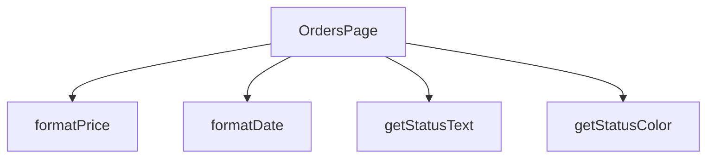

## Genel Bakış
Bu modül, VentHub HVAC sistemindeki siparişlerin listelendiği ve yönetildiği temel React sayfasıdır. Sayfa, sipariş verilerini kullanıcıya göstermek için tarih, fiyat ve sipariş durumu gibi bilgileri okunabilir ve görsel olarak tutarlı formata dönüştüren yardımcı fonksiyonları içerir.

## Fonksiyon Grupları
### Ana Sayfa Bileşeni
Siparişler sayfasının tüm yapısını, durum yönetimini ve veri akışını kontrol eden, arayüzü oluşturan temel React bileşenidir.
- OrdersPage

### Veri Görünüm Formatlayıcıları
Siparişlerle ilgili ham veri değerlerini (tarih dizgeleri, sayısal fiyatlar, durum kodları) kullanıcı arayüzünde doğrudan ve anlaşılır bir şekilde gösterilecek metinlere ve renklere dönüştüren yardımcı işlevlerdir. Bu fonksiyonlar, bileşen içindeki gösterim mantığını soyutlayarak kodun okunabilirliğini artırır.
- formatDate, formatPrice, getStatusColor, getStatusText

---

## AXIOMS – Mimari Varsayımlar
Bu modül için, sipariş verilerinin formatlanması ve sunulmasıyla ilgili temel veri bütünlüğü ve geçerlilik varsayımları tanımlanmıştır.

[Aksiyom 1]: Eğer `formatDate` fonksiyonuna geçersiz veya boş bir `dateString` parametresi verilirse, fonksiyon geçersiz bir tarih formatı hatası üretebilir veya uygulamanın beklenmeyen davranış göstermesine neden olabilir.
[Aksiyom 2]: Eğer `formatPrice` fonksiyonuna negatif bir `price` parametresi verilirse, işlenen fiyat değeri mantıksal olarak tutarsız olabilir ve arayüzde negatif bir fiyat gösterimine yol açabilir.
[Aksiyom 3]: Eğer `getStatusColor` veya `getStatusText` fonksiyonlarına, bilinmeyen veya desteklenmeyen bir `status` dizgesi verilirse, fonksiyonlar önceden tanımlanmamış bir renk kodu veya metin döndürebilir; bu da arayüzde tutarsız veya eksik bilgi display edilmesine yol açabilir.

---

## FONKSİYON DETAYLARI

### OrdersPage
**Ne yapar**: Fonksiyonun amacı ve işlevi kaynak kodunda belirtilmemiştir.  
**Nasıl yapar**: İç mantığı hakkında bilgi bulunmamaktadır.  
**Parametreler**:  
- (parametre yok)  
**Dönüş**: `React.FC` – bir React fonksiyonel bileşeni tipini döndürür.

### formatDate
**Ne yapar**: Fonksiyonun ne amaçla kullanıldığı ve ne yaptığı belirtilmemiştir.  
**Nasıl yapar**: İşlevsel içeriği hakkında bilgi mevcut değildir.  
**Parametreler**:  
- `dateString`: `string` — tarih bilgisini içeren metin.  
**Dönüş**: Belirtilmemiştir (return tipi bilinmiyor).

### formatPrice
**Ne yapar**: Fonksiyonun görevi ve çıktısı kaynakta tanımlanmamıştır.  
**Nasıl yapar**: İç mantığı hakkında veri bulunmamaktadır.  
**Parametreler**:  
- `price`: `number` — fiyat değerini temsil eden sayı.  
**Dönüş**: Belirtilmemiştir (return tipi bilinmiyor).

### getStatusColor
**Ne yapar**: Fonksiyonun işlevi ve kullanım amacı açıklanmamıştır.  
**Nasıl yapar**: İşlevsel detayları mevcut değildir.  
**Parametreler**:  
- `status`: `string` — durum bilgisini ifade eden metin.  
**Dönüş**: Belirtilmemiştir (return tipi bilinmiyor).

### getStatusText
**Ne yapar**: Fonksiyonun ne yaptığı ve ne döndürdüğü kaynakta yer almamaktadır.  
**Nasıl yapar**: İç mantığı hakkında bilgi yoktur.  
**Parametreler**:  
- `status`: `string` — durum bilgisini temsil eden metin.  
**Dönüş**: Belirtilmemiştir (return tipi bilinmiyor).

---

## INTERFACES

### Order
- `id: string`
- `total_amount: number`
- `status: string`
- `payment_status?: string`
- `created_at: string`
- `customer_name: string`
- `customer_email: string`
- `shipping_address: unknown`
- `order_items: OrderItem[]`
- `order_number?: string`
- `is_demo?: boolean`
- `payment_data?: unknown`
- `conversation_id?: string`
- `carrier?: string`
- `tracking_number?: string`
- `tracking_url?: string`
- `shipped_at?: string`
- `delivered_at?: string`

### OrderItem
- `id: string`
- `product_id?: string`
- `product_name: string`
- `quantity: number`
- `unit_price: number`
- `total_price: number`
- `product_image_url?: string`

---

## TYPE ALIASES

### StatusFilter
```typescript
type StatusFilter = 'all' | 'pending' | 'paid' | 'shipped' | 'delivered' | 'failed'
```

---

## AST POINTERS

### [N1_NASIL] AST Pointer: `OrdersPage.tsx`::fetchOrders (async anonim)
- **params**: () — parametre yok; dış kapsamdan `user`, `setLoading`, `t`, `searchParams`, `setOrders`, `setProductFilter` kapanır
- **ic_degiskenler**:
  - `ordersData` — Supabase'den dönen sipariş satırları dizisi (ham veri)
  - `ordersError` — Supabase sorgusundaki hata nesnesi; null ise sorgu başarılı demektir
  - `formattedOrders` — Ham `ordersData` dizisinin `Order[]` tipine dönüştürülmüş hali
  - `rawOrder` — `.map()` iterasyonundaki her bir ham sipariş kaydı (`unknown`)
  - `order` — `isRecord(rawOrder)` ile tip güvencesi alınmış kayıt nesnesi; tüm alanlara erişim sağlar
  - `itemsList` — `order.venthub_order_items` alanından çıkarılan dizi; dizi değilse boş dizi kullanılır
  - `items` — Her bir `rawIt` öğesinin `OrderItem` objesine dönüştürülmüş hali
  - `rawIt` — `itemsList.map()` içindeki her bir ham sipariş kalemi (`unknown`)
  - `it` — `isRecord(rawIt)` ile tip güvencesi alınmış sipariş kalemi nesnesi
  - `productQ` — URL search parametresinden okunan `?product=...` değeri; filtre amaçlı kullanılır
- **Dönüş**: `void` — state setter'ları çağırarak bileşen durumunu günceller; `setOrders(formattedOrders)` ile siparişleri, `setLoading(false)` ile yükleme durumunu, `setProductFilter(productQ)` ile filtre değerini ayarlar

---


## MERMAID CALL GRAPH


## NODE ID STANDARD

  file: src\views\OrdersPage.tsx
  function: src\views\OrdersPage.tsx::OrdersPage
  function: src\views\OrdersPage.tsx::formatDate
  function: src\views\OrdersPage.tsx::formatPrice
  function: src\views\OrdersPage.tsx::getStatusColor
  function: src\views\OrdersPage.tsx::getStatusText

---

## DISA AKTARILANLAR (EXPORTS)
  export: OrdersPage

---

## STİL TOKENLERİ

### Arbitrary Değerler (token'a geçirilmemiş)
Yok — tüm stiller token'a geçirilmiş. ✅

### Kullanılan Token'lar (zaten token'a geçirilmiş)
- (yok)

### Tailwind Sınıf Özeti
- **Renkler:** `bg-clean-white`, `bg-orange-100`, `bg-orange-100/80`, `bg-primary-navy`, `bg-primary-navy/5`, `bg-slate-100`, `bg-slate-50`, `bg-white`, `border-b`, `border-b-2`, `border-orange-200`, `border-primary-navy`, `border-slate-100`, `border-slate-200`, `border-slate-200/60`
- **Layout:** `flex`, `flex-1`, `flex-col`, `gap-2`, `gap-4`, `grid`, `grid-cols-1`, `h-1`, `h-10`, `h-12`, `h-16`, `h-7`, `inline-flex`, `items-center`, `justify-between`
- **Varyant/Responsive:** `:`, `focus-visible:`, `hover:`, `md:` önekleri
- **Yardımcı Sınıflar:** `${active`, `${activeIdx`, `${getStatusColor(order.status`, `1`, `:`, `>=`, `animate-spin`, `border`, `focus-visible:outline-none`, `focus-visible:ring-2`, `focus-visible:ring-primary-navy/20`, `font-bold`, `font-medium`, `hover:scale-102`, `idx`