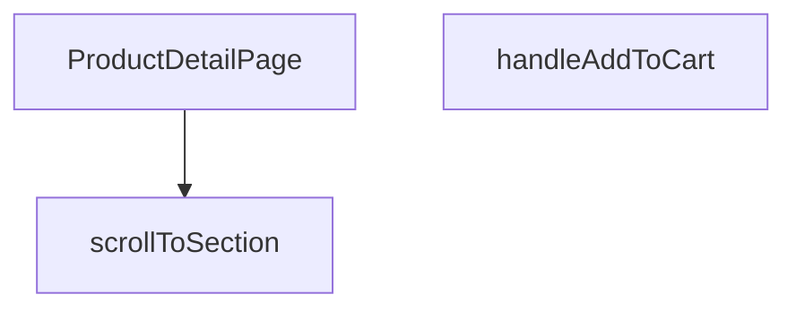

## Genel Bakış
Bu modül, VentHub HVAC platformunda ürün detaylarını kullanıcılara sunan React tabanlı ön yüz bileşenidir. Dışarıdan alınan ilk ürün verisini işleyerek tüm sayfa içeriğini oluşturur, kullanıcı etkileşimlerini destekleyen yardımcı işlevleri bünyesinde barındırır.

## Fonksiyon Grupları
### Ana Sayfa Bileşeni
Modülün temel sorumluluğunu üstlenen ana bileşendir, ürün detayları sayfasının tüm yapısını ve temel işleyişini yönetir.
- ProductDetailPage

### Kullanıcı Etkileşimi İşlevleri
Kullanıcının sayfa içindeki işlemlerini yönetir, sayfa içi gezinme ve alışveriş sepetine ekleme gibi kullanıcı odaklı eylemleri gerçekleştirir.
- scrollToSection, handleAddToCart

---

## AXIOMS – Mimari Varsayımlar
Bu modül, ürün detaylarını görüntülemek, sayfa içi gezinme ve sepete ürün ekleme işlevlerini gerçekleştirmek için bileşene iletilen giriş prop'larının ve entegre olduğu global state/servislerin erişilebilir ve geçerli olmasını varsayar.

[Aksiyom 1]: Eğer ProductDetailPage bileşenine initialProduct prop'u iletilmezse, ürün detayları sayfada görüntülenemez, kullanıcı boş veya hata içeren bir sayfa ile karşılaşır.
[Aksiyom 2]: Eğer scrollToSection fonksiyonuna iletilen sectionId değerine karşılık gelen DOM öğesi sayfada mevcut değilse, sayfa ilgili bölüme kaydırılamaz, kullanıcı istediği bölüme yönlendirilemez.
[Aksiyom 3]: Eğer handleAddToCart fonksiyonunun erişmesi gereken sepet yönetimi için global state veya ürün sepete ekleme API servisi erişilebilir değilse, ürün sepete eklenemez, kullanıcı işlemin başarısızlığı hatası alır.

---

## FONKSİYON DETAYLARI

### ProductDetailPage
**Ne yapar**: VentHub HVAC projesinde ürün detaylarını görüntülemek için tasarlanmış ana React sayfa bileşenidir. Kullanıcıların ilgili ürüne ait tüm özellikleri, görselleri, fiyat bilgilerini ve diğer detayları erişebilmesini sağlar. Sayfa içerisindeki tüm interaktif eylemleri yöneterek tutarlı bir kullanıcı deneyimi sunar.
**Nasıl yapar**: Kendisine prop olarak iletilen initialProduct verisini kullanarak sayfanın tüm statik ve dinamik içeriğini oluşturur. İçerisinde barındırdığı scrollToSection ve handleAddToCart gibi yardımcı fonksiyonlar ile sayfanın tüm kullanıcı etkileşimlerini tek merkezden yönetir.
**Parametreler**:
- name: initialProduct, type: ProductDetailPageProps — Bileşenin yükleneceği ürüne ait tüm temel verileri içeren başlangıç prop nesnesi
**Dönüş**: React.FC<ProductDetailPageProps> tipinde, tarayıcıda render edilebilen bir React fonksiyonel bileşeni döndürür.

### scrollToSection
**Ne yapar**: Ürün detay sayfası içerisinde farklı içerik bölümleri arasında yumuşak kaydırma işlemini gerçekleştiren yardımcı işlevdir. Kullanıcının sayfa üzerindeki başlık, menü bağlantısı veya butona tıklaması sonrası ilgili bölüme otomatik olarak odaklanmasını sağlar. Sayfa içi gezinme deneyimini kolaylaştırır.
**Nasıl yapar**: Kendisine parametre olarak iletilen benzersiz bölüm kimliği ile DOM ağacından ilgili öğeyi konumlar, tarayıcının standart kaydırma API'sini kullanarak o bölgeye sorunsuz bir geçişle kaydırma işlemini başlatır.
**Parametreler**:
- name: sectionId, type: string — Kaydırma işleminin hedefleneceği DOM öğesinin benzersiz kimlik değeri
**Dönüş**: Herhangi bir değer döndürmez, sadece DOM üzerinde kaydırma eylemini gerçekleştirir.

### handleAddToCart
**Ne yapar**: Ürün detay sayfasındaki "Sepete ekle" butonunun tıklanma etkileşimini yöneten işleyici fonksiyondur. Kullanıcının mevcut ürünü alışveriş sepetine eklemesi işlemini tüm adımlarıyla hayata geçirir. Gerekli doğrulamalar yapıldıktan sonra işlem sonucunu kullanıcıya net bir şekilde iletir.
**Nasıl yapar**: Sayfa üzerinden eriştiği ürün verilerini kullanarak öncelikle stok durumu, geçerli adet gibi temel doğrulamaları tamamlar. Ardından projenin global alışveriş sepeti durumunu güncelleyerek ürünü geçerli sepet verisine ekler, işlem sonucuna göre başarı veya hata bildirimleri tetikler.
**Parametreler**: Kendisine herhangi bir girdi parametresi iletilmez, tüm işlemlerini sayfa içi yerel durum ve global uygulama state verilerini kullanarak yürütür.
**Dönüş**: Herhangi bir değer döndürmez, sadece sepete ekleme iş akışını yönetir.

---

## INTERFACES

### ProductDetailPageProps
- `initialProduct?: Product | null`

---

## TYPE ALIASES

### DbProductImage
```typescript
type DbProductImage = Tables['product_images']['Row']
```

---

## AST POINTERS

### [N1_NASIL] AST Pointer: `src/views/ProductDetailPage.tsx::ProductDetailPage`
- **params**: `{ initialProduct }` — sunucudan gelen ilk ürün verisi
- **ic_degiskenler**:
  - `t` — useI18n() hook'undan gelen çeviri fonksiyonu
  - `lang` — useI18n() hook'undan gelen dil kodu, formatCurrency'e传递
  - `params` — useParams() ile alınan URL parametreleri
  - `currentSlug` — params.slug'dan türetilen, sonundaki 'cc' kesilerek normalize edilmiş ürün tanımlayıcı
  - `addToCart` — useCart() hook'undan gelen sepete ekleme fonksiyonu
  - `categories` — useCategories() hook'undan gelen kategori listesi
  - `wrapCategory` — useCategoryViewModel() hook'undan gelen ham kategori nesnesini sarmalayan fonksiyon
  - `product` — useState: aktif ürün verisi, initialProduct'tan başlatılır veya API ile yüklenir
  - `loading` — useState: veri yüklenme durumu bayrağı
  - `images` — useState: ürün resimlerinin {path, alt} listesi
  - `quantity` — useState: Sepete eklenecek ürün adedi, başlangıç 1
  - `activeSection` — useState: Sticky nav'da aktif olan bölüm ID'si, scroll spy ile güncellenir
  - `leadOpen` — useState: LeadModal açma/kapama durumu
  - `isProjectModalOpen` — useState: ProjeyeEkleModal açma/kapama durumu
  - `isNavSticky` — useState: Sticky navigasyonun sabitlenme durumu
  - `sectionRefs` — useRef<Record<string, HTMLElement | null>>: Bölüm DOM elementlerinin referans haritası
  - `navTriggerRef` — useRef<HTMLDivElement>: Sticky nav'ın tetiklendiği sentinel element referansı
  - `hierarchy` — useMemo: {main, sub} kategori hiyerarşisi, product ve categories'ten hesaplanır
  - `breadcrumbItems` — useMemo: Breadcrumb navigasyon öğeleri dizisi
  - `categoryMetadata` — hierarchy.main?.raw?.metadata'dan türetilen kategori meta verisi (hide_price kontrolü için kullanılır)
  - `sections` — Dizi: Sayfa bölümlerinin id, title, icon, bgClass bilgileri
- **Dönüş**: JSX — Ürün detay sayfasının tam render çıktısı (hero, galeri, fiyat, sepete ekle, sticky nav, bölüm içerikleri)

### [N2_NASIL] AST Pointer: `src/views/ProductDetailPage.tsx::hierarchy (useMemo callback)`
- **params**: (parametre yok)
- **ic_degiskenler**:
  - `categoryMap` — categories dizisinden oluşturulmuş Map<id, Category>, hızlı lookup için
  - `rawSub` — product.subcategory_id ile categoryMap'ten çekilen ham alt kategori nesnesi
  - `rawMain` — product.category_id ile categoryMap'ten çekilen ham ana kategori nesnesi
- **Dönüş**: `{ main: WrappedCategory | null, sub: WrappedCategory | null }` — wrapCategory ile sarılmış ana ve alt kategori

### [N3_NASIL] AST Pointer: `src/views/ProductDetailPage.tsx::breadcrumbItems (useMemo callback)`
- **params**: (parametre yok)
- **ic_degiskenler**:
  - `items` — Başlangıçta [{label: t('category.breadcrumbHome'), href: '/'}] olan breadcrumb öğeleri dizisi, koşullara göre ürün eklenir
- **Dönüş**: `Array<{ label: string, href: string }>` — Tam breadcrumb yolu

### [N4_NASIL] AST Pointer: `src/views/ProductDetailPage.tsx::fetchProduct (useEffect içinde)`
- **params**: (parametre yok)
- **ic_degiskenler**:
  - `productData` — getProductBySlugOrId(currentSlug) ile çekilen ürün verisi, null olabilir
  - `imgs` — supabase.from('product_images') sorgusundan dönen {data: imgs} destructuring ile alınan ham görsel listesi
  - `list` — imgs dizisinin map ile {path, alt} formatına dönüştürülmüş hali
  - `error` — try-catch bloğunda yakalanan hata nesnesi, console.error ile loglanır
- **Dönüş**: yok (yan etki: setProduct, setImages, setLoading çağrıları ile state günceller)

### [N5_NASIL] AST Pointer: `src/views/ProductDetailPage.tsx::scrollToSection`
- **params**: `(sectionId: string)` — Kaydırılacak bölümün ID'si
- **ic_degiskenler**:
  - `element` — sectionRefs.current[sectionId] ile alınan DOM elementi referansı
  - `navEl` — document.getElementById('pdp-sticky-nav') ile bulunan sticky navigasyon elementi, offset hesaplaması için
- **Dönüş**: yok (yan etki: window.scrollTo ile smooth kaydırma yapar)

### [N6_NASIL] AST Pointer: `src/views/ProductDetailPage.tsx::handleAddToCart`
- **params**: (parametre yok)
- **ic_degiskenler**:
  - (fonksiyon gövdesinde ek değişken yok, sadece product ve quantity dış scope'tan erişilir)
- **Dönüş**: yok (yan etki: addToCart(product, quantity) ile sepete ürün ekler)

### [N7_NASIL] AST Pointer: `src/views/ProductDetailPage.tsx::handleScrollSpy (useEffect içinde)`
- **params**: (parametre yok)
- **ic_degiskenler**:
  - `navEl` — document.getElementById('pdp-sticky-nav'), offset yüksekliği hesaplamak için
  - `headerOffset` — navEl varsa navEl.offsetHeight + 120, yoksa 200 sabit değeri
  - `scrollPosition` — window.scrollY + headerOffset toplamı, mevcut kaydırma pozisyonu
  - `sectionOffsets` — sectionRefs.current'ın Object.entries ile dönülüp map/filter ile {id, top, bottom} dizisine dönüştürülmüş hali
  - `section` — for döngüsündeki her bir bölüm offset nesnesi
- **Dönüş**: yok (yan etki: setActiveSection ile aktif bölümü günceller)

### [N8_NASIL] AST Pointer: `src/views/ProductDetailPage.tsx::useEffect scroll handler (isNavSticky)`
- **params**: (parametre yok)
- **ic_degiskenler**:
  - `handleScroll` — İç arrow function: navTriggerRef.current varsa, window.scrollY > navTriggerRef.current.offsetTop - 80 koşulunu kontrol eder
- **Dönüş**: yok (yan etki: setIsNavSticky ile sticky durumu güncellenir, scroll event listener eklenir/kaldırılır)

### [N9_NASIL] AST Pointer: `src/views/ProductDetailPage.tsx::sectionRefs nav map callback`
- **params**: `(section)` — sections dizisindeki tek bir bölüm nesnesi {id, title, icon, bgClass}
- **ic_degiskenler**:
  - (ek değişken yok, section.id, section.icon, section.title dış scope'tan erişilir)
- **Dönüş**: `JSX.Element` — Aktif/pasif durumuna göre stillendirilmiş navigasyon butonu

### [N10_NASIL] AST Pointer: `src/views/ProductDetailPage.tsx::sectionRefs content map callback`
- **params**: `(section)` — sections dizisindeki tek bir bölüm nesnesi {id, title, icon, bgClass}
- **ic_degiskenler**:
  - (ek değişken yok, section.id, section.bgClass, section.icon, section.title, product.description dış scope'tan erişilir)
- **Dönüş**: `JSX.Element` — Section başlığı ve 'genel' bölümü için RichTextRenderer ile ürün açıklaması içeren PageShell

### [N11_NASIL] AST Pointer: `src/views/ProductDetailPage.tsx::useEffect scrollSpy setup`
- **params**: (parametre yok)
- **ic_degiskenler**:
  - `handleScrollSpy` — İç async function: scroll pozisyonuna göre aktif section'ı belirler (detaylı analiz için N7'ye bak)
- **Dönüş**: yok (yan etki: scroll event listener eklenir, cleanup'ta kaldırılır)

### [N12_NASIL] AST Pointer: `src/views/ProductDetailPage.tsx::hierarchy categoryMap callback`
- **params**: `(c)` — categories dizisindeki tek bir kategori nesnesi
- **ic_degiskenler**: (yok)
- **Dönüş**: `[c.id, c]` tuple'ı — Map oluşturmak için key-value çifti

---


## MERMAID CALL GRAPH


## NODE ID STANDARD

  file: src\views\ProductDetailPage.tsx
  function: src\views\ProductDetailPage.tsx::ProductDetailPage
  function: src\views\ProductDetailPage.tsx::scrollToSection
  function: src\views\ProductDetailPage.tsx::handleAddToCart

---

## DISA AKTARILANLAR (EXPORTS)
  export: ProductDetailPage
  export: ProductDetailPageProps

---

## STİL TOKENLERİ

### Arbitrary Değerler (token'a geçirilmemiş)
Yok — tüm stiller token'a geçirilmiş. ✅

### Kullanılan Token'lar (zaten token'a geçirilmiş)
- `rounded-hvac-2xl`, `rounded-hvac-3xl`, `tracking-hvac-loose`, `tracking-hvac-normal`, `tracking-hvac-relaxed`

### Tailwind Sınıf Özeti
- **Renkler:** `bg-cyan-500`, `bg-cyan-500/10`, `bg-slate-50`, `bg-slate-50/30`, `bg-slate-950`, `bg-white`, `bg-white/90`, `border-2`, `border-b`, `border-b-2`, `border-cyan-500/20`, `border-primary-navy`, `border-slate-100`, `border-slate-50`, `hover:bg-cyan-600`
- **Layout:** `backdrop-blur-2xl`, `block`, `fixed`, `flex`, `flex-col`, `gap-12`, `gap-2`, `gap-3`, `gap-4`, `gap-6`, `grid`, `grid-cols-1`, `h-0`, `h-10`, `h-12`
- **Varyant/Responsive:** `:`, `active:`, `disabled:`, `group-hover:`, `hover:`, `last:`, `lg:`, `md:`, `sm:`, `xl:` önekleri
- **Yardımcı Sınıflar:** `${activeSection`, `${isNavSticky`, `${section.bgClass`, `:`, `===`, `active:scale-95`, `animate-pulse`, `animate-spin`, `border`, `disabled:opacity-50`, `duration-500`, `font-black`, `font-bold`, `font-extralight`, `font-light`