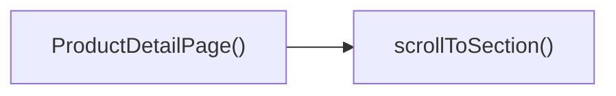

## Genel Bakış
Bu modül, VentHub HVAC platformunda ürün detaylarını kullanıcılara sunan React tabanlı ön yüz bileşenidir. Dışarıdan alınan ilk ürün verisini işleyerek tüm sayfa içeriğini oluşturur, kullanıcı etkileşimlerini destekleyen yardımcı işlevleri bünyesinde barındırır.

## Fonksiyon Grupları
### Ana Sayfa Bileşeni
Modülün temel sorumluluğunu üstlenen ana bileşendir, ürün detayları sayfasının tüm yapısını ve temel işleyişini yönetir.
- ProductDetailPage

### Kullanıcı Etkileşimi İşlevleri
Kullanıcının sayfa içindeki işlemlerini yönetir, sayfa içi gezinme ve alışveriş sepetine ekleme gibi kullanıcı odaklı eylemleri gerçekleştirir.
- scrollToSection, handleAddToCart

---

## AXIOMS – Mimari Varsayımlar
Bu modül, ürün detaylarını görüntülemek, sayfa içi gezinme ve sepete ürün ekleme işlevlerini gerçekleştirmek için bileşene iletilen giriş prop'larının ve entegre olduğu global state/servislerin erişilebilir ve geçerli olmasını varsayar.

[Aksiyom 1]: Eğer ProductDetailPage bileşenine initialProduct prop'u iletilmezse, ürün detayları sayfada görüntülenemez, kullanıcı boş veya hata içeren bir sayfa ile karşılaşır.
[Aksiyom 2]: Eğer scrollToSection fonksiyonuna iletilen sectionId değerine karşılık gelen DOM öğesi sayfada mevcut değilse, sayfa ilgili bölüme kaydırılamaz, kullanıcı istediği bölüme yönlendirilemez.
[Aksiyom 3]: Eğer handleAddToCart fonksiyonunun erişmesi gereken sepet yönetimi için global state veya ürün sepete ekleme API servisi erişilebilir değilse, ürün sepete eklenemez, kullanıcı işlemin başarısızlığı hatası alır.

---

## FONKSIYON DETAYLARI

### ProductDetailPage
**Ne yapar**: VentHub HVAC projesinde ürün detaylarını görüntülemek için tasarlanmış ana React sayfa bileşenidir. Kullanıcıların ilgili ürüne ait tüm özellikleri, görselleri, fiyat bilgilerini ve diğer detayları erişebilmesini sağlar. Sayfa içerisindeki tüm interaktif eylemleri yöneterek tutarlı bir kullanıcı deneyimi sunar.
**Nasıl yapar**: Kendisine prop olarak iletilen initialProduct verisini kullanarak sayfanın tüm statik ve dinamik içeriğini oluşturur. İçerisinde barındırdığı scrollToSection ve handleAddToCart gibi yardımcı fonksiyonlar ile sayfanın tüm kullanıcı etkileşimlerini tek merkezden yönetir.
**Parametreler**:
- name: initialProduct, type: ProductDetailPageProps — Bileşenin yükleneceği ürüne ait tüm temel verileri içeren başlangıç prop nesnesi
**Dönüş**: React.FC<ProductDetailPageProps> tipinde, tarayıcıda render edilebilen bir React fonksiyonel bileşeni döndürür.

### scrollToSection
**Ne yapar**: Ürün detay sayfası içerisinde farklı içerik bölümleri arasında yumuşak kaydırma işlemini gerçekleştiren yardımcı işlevdir. Kullanıcının sayfa üzerindeki başlık, menü bağlantısı veya butona tıklaması sonrası ilgili bölüme otomatik olarak odaklanmasını sağlar. Sayfa içi gezinme deneyimini kolaylaştırır.
**Nasıl yapar**: Kendisine parametre olarak iletilen benzersiz bölüm kimliği ile DOM ağacından ilgili öğeyi konumlar, tarayıcının standart kaydırma API'sini kullanarak o bölgeye sorunsuz bir geçişle kaydırma işlemini başlatır.
**Parametreler**:
- name: sectionId, type: string — Kaydırma işleminin hedefleneceği DOM öğesinin benzersiz kimlik değeri
**Dönüş**: Herhangi bir değer döndürmez, sadece DOM üzerinde kaydırma eylemini gerçekleştirir.

### handleAddToCart
**Ne yapar**: Ürün detay sayfasındaki "Sepete ekle" butonunun tıklanma etkileşimini yöneten işleyici fonksiyondur. Kullanıcının mevcut ürünü alışveriş sepetine eklemesi işlemini tüm adımlarıyla hayata geçirir. Gerekli doğrulamalar yapıldıktan sonra işlem sonucunu kullanıcıya net bir şekilde iletir.
**Nasıl yapar**: Sayfa üzerinden eriştiği ürün verilerini kullanarak öncelikle stok durumu, geçerli adet gibi temel doğrulamaları tamamlar. Ardından projenin global alışveriş sepeti durumunu güncelleyerek ürünü geçerli sepet verisine ekler, işlem sonucuna göre başarı veya hata bildirimleri tetikler.
**Parametreler**: Kendisine herhangi bir girdi parametresi iletilmez, tüm işlemlerini sayfa içi yerel durum ve global uygulama state verilerini kullanarak yürütür.
**Dönüş**: Herhangi bir değer döndürmez, sadece sepete ekleme iş akışını yönetir.

---

## INTERFACES

### ProductDetailPageProps
- `initialProduct?: Product | null`

---

## TYPE ALIASES

### DbProductImage
```typescript
type DbProductImage = Tables['product_images']['Row']
```

---

## AST POINTERS

### [N1_NASIL] AST Pointer: src\views\ProductDetailPage.tsx::ProductDetailPage
- **params**: initialProduct
- **ic_degiskenler**:
  - `t` — useI18n hook'undan alınan çeviri fonksiyonu
  - `lang` — useI18n hook'undan alınan aktif dil kodu
  - `params` — useParams hook'undan alınan rota parametreleri
  - `currentSlug` — params.slug'dan temizlenerek elde edilen geçerli ürün slug'ı
  - `addToCart` — useCart hook'undan alınan sepete ekleme fonksiyonu
  - `categories` — useCategories hook'undan alınan kategori listesi
  - `wrapCategory` — useCategoryViewModel hook'undan alınan kategori sarmalama fonksiyonu
  - `product` — useState ile tutulan aktif ürün nesnesi, null da olabilir
  - `setProduct` — ürün durumunu güncellemek için kullanılan state setter fonksiyonu
  - `loading` — ürün yükleme durumunu tutan state
  - `setLoading` — loading state'ini güncelleyen setter
  - `images` — ürüne ait resim listesini tutan state
  - `setImages` — resim listesini güncelleyen setter
  - `quantity` — sepete eklenecek ürün miktarını tutan state
  - `setQuantity` — miktar state'ini güncelleyen setter
  - `activeSection` — aktif olan ürün detay sayfası bölümünün id'sini tutan state
  - `setActiveSection` — aktif bölüm state'ini güncelleyen setter
  - `leadOpen` — teklif modalının açık olma durumunu tutan state
  - `setLeadOpen` — lead modal durumunu güncelleyen setter
  - `isProjectModalOpen` — projeye ekleme modalının açık olma durumu
  - `setIsProjectModalOpen` — proje modal state'ini güncelleyen setter
  - `isNavSticky` — gezinti çubuğunun sabitlenme durumu
  - `setIsNavSticky` — sticky nav state'ini güncelleyen setter
  - `sectionRefs` — useRef ile tutulan bölüm DOM elemanları kayıt nesnesi
  - `navTriggerRef` — useRef ile tutulan sticky nav tetikleyici DOM elemanı
  - `hierarchy` — useMemo ile hesaplanan ana ve alt kategori nesneleri
  - `breadcrumbItems` — useMemo ile hesaplanan ekmek kırıntısı öğeleri listesi
  - `scrollToSection` — belirtilen bölüme kaydırma fonksiyonu
  - `handleAddToCart` — sepete ekleme işlemini yöneten fonksiyon
  - `sections` — ürün detay sayfasındaki bölümleri tanımlayan sabit liste
  - `categoryMetadata` — ana kategorinin ham metadatasını tipleyen nesne
- **Dönüş**: React JSX elemanı, ürün detay sayfası arayüzü

### [N2_NASIL] AST Pointer: src\views\ProductDetailPage.tsx::useMemo.hierarchyCalculator
- **params**: (yok)
- **ic_degiskenler**:
  - `product` — ana fonksiyondan erişilen aktif ürün nesnesi
  - `categories` — ana fonksiyondan erişilen kategori listesi
  - `wrapCategory` — ana fonksiyondan erişilen kategori sarmalama fonksiyonu
  - `categoryMap` — kategorileri id'leri ile eşleyen Map nesnesi
  - `rawSub` — ham alt kategori nesnesi, veritabanından gelen ham veri
  - `rawMain` — ham ana kategori nesnesi, veritabanından gelen ham veri
- **Dönüş**: { main: sarmalanmış ana kategori, sub: sarmalanmış alt kategori } nesnesi, her ikisi de null olabilir

### [N3_NASIL] AST Pointer: src\views\ProductDetailPage.tsx::useMemo.breadcrumbCalculator
- **params**: (yok)
- **ic_degiskenler**:
  - `hierarchy` — ana fonksiyondan erişilen kategori hiyerarşisi nesnesi
  - `product` — ana fonksiyondan erişilen aktif ürün nesnesi
  - `t` — ana fonksiyondan erişilen çeviri fonksiyonu
  - `items` — oluşturulacak ekmek kırıntısı öğelerini tutan geçici liste
- **Dönüş**: Ekmek kırıntısı öğelerinden oluşan { label, href } nesneleri listesi

### [N4_NASIL] AST Pointer: src\views\ProductDetailPage.tsx::useEffect.fetchProduct
- **params**: (yok)
- **ic_degiskenler**:
  - `currentSlug` — ana fonksiyondan erişilen geçerli ürün slug'ı
  - `product` — ana fonksiyondan erişilen aktif ürün nesnesi
  - `initialProduct` — ana fonksiyona parametre olarak gelen başlangıç ürünü
  - `setProduct` — ürün state'ini güncelleyen setter fonksiyonu
  - `setLoading` — yükleme state'ini güncelleyen setter
  - `setImages` — resim listesini güncelleyen setter
  - `productData` — API'den çekilen ürün verisi nesnesi
  - `imgs` — supabase sorgusundan dönen ürün resimleri verisi
  - `list` — işlenerek state'e aktarılacak resim listesi
  - `error` — ürün çekerken oluşan hata nesnesi
- **Dönüş**: Promise<void> (async void)

### [N5_NASIL] AST Pointer: src\views\ProductDetailPage.tsx::useEffect.handleScroll
- **params**: (yok)
- **ic_degiskenler**:
  - `navTriggerRef` — ana fonksiyondan erişilen tetikleyici ref nesnesi
  - `setIsNavSticky` — sticky nav state'ini güncelleyen setter
  - `window.scrollY` — mevcut dikey kaydırma konumu
  - `navTriggerRef.current.offsetTop` — tetikleyici elemanın dikey konumu
- **Dönüş**: void

### [N6_NASIL] AST Pointer: src\views\ProductDetailPage.tsx::useEffect.handleScrollSpy
- **params**: (yok)
- **ic_degiskenler**:
  - `sectionRefs` — ana fonksiyondan erişilen bölüm ref'leri kayıt nesnesi
  - `setActiveSection` — aktif bölüm state'ini güncelleyen setter
  - `navEl` — sticky nav DOM elemanı, document.getElementById ile alınan
  - `headerOffset` — hesaplanan başlık yüksekliği ofseti
  - `scrollPosition` — mevcut kaydırma konumu + header offset ile hesaplanan eşik değeri
  - `sectionOffsets` — her bölümün üst ve alt konumlarını içeren işlenmiş liste
- **Dönüş**: void

### [N7_NASIL] AST Pointer: src\views\ProductDetailPage.tsx::handleScrollSpy.sectionOffsetMapper
- **params**: sectionId, ref
- **ic_degiskenler**:
  - `sectionId` — işlenen bölümün string id'si
  - `ref` — bölümün DOM elemanı referansı
  - `ref.offsetTop` — bölümün dikey üst konumu
  - `ref.offsetHeight` — bölümün yüksekliği
- **Dönüş**: { id, top, bottom } nesnesi veya geçersizse null

### [N8_NASIL] AST Pointer: src\views\ProductDetailPage.tsx::scrollToSection
- **params**: sectionId: string
- **ic_degiskenler**:
  - `sectionRefs` — ana fonksiyondan erişilen bölüm ref'leri kayıt nesnesi
  - `element` — hedeflenen bölümün DOM elemanı
  - `navEl` — sticky nav DOM elemanı, document.getElementById ile alınan
- **Dönüş**: void

### [N9_NASIL] AST Pointer: src\views\ProductDetailPage.tsx::sectionsMap.navButtonClickHandler
- **params**: section (bölüm nesnesi)
- **ic_degiskenler**:
  - `section.id` — tıklanan bölümün id'si
  - `scrollToSection` — bölüm kaydırma fonksiyonu
- **Dönüş**: void

### [N10_NASIL] AST Pointer: src\views\ProductDetailPage.tsx::sectionsMap.sectionRefSetter
- **params**: el (DOM elemanı)
- **ic_degiskenler**:
  - `section.id` — işlenen bölümün id'si
  - `sectionRefs.current` — bölüm ref'leri kayıt nesnesi
- **Dönüş**: void

### [N11_NASIL] AST Pointer: src\views\ProductDetailPage.tsx::handleAddToCart
- **params**: (yok)
- **ic_degiskenler**:
  - `product` — ana fonksiyondan erişilen aktif ürün nesnesi
  - `quantity` — ana fonksiyondan erişilen seçilen ürün miktarı
  - `addToCart` — useCart hook'undan alınan sepete ekleme fonksiyonu
- **Dönüş**: void

---

## ÇAĞRI HARİTASI

### Disariya Cagrilar (Outgoing)
Aynı dosyadaki ProductDetailPage() fonksiyonu, sayfa içindeki ilgili bölüme kaydırma işlemini yapmak için scrollToSection fonksiyonunu çağırır.

### Disaridan Cagrilanlar (Incoming)
Verilen çağrı verisinde bu modülü kullanan herhangi bir dış dosya veya fonksiyon bilgisi bulunmamaktadır.

### Ic Ice Fonksiyonlar (Nested)
Yok

---

## DOSYA-İÇİ ÇAĞRI GRAFİĞİ
  ProductDetailPage() → scrollToSection()



---

## NODE ID STANDARD

  file: src\views\ProductDetailPage.tsx
  function: src\views\ProductDetailPage.tsx::ProductDetailPage
  function: src\views\ProductDetailPage.tsx::scrollToSection
  function: src\views\ProductDetailPage.tsx::handleAddToCart

---

## DISA AKTARILANLAR (EXPORTS)
  export: ProductDetailPage
  export: ProductDetailPageProps