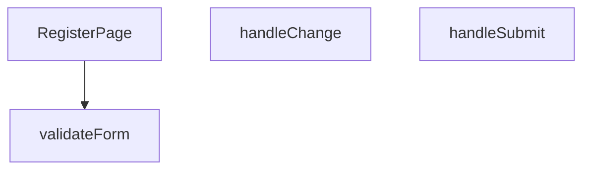

## Genel Bakış
RegisterPage.tsx modülü, kullanıcıların hesap oluşturabilmesi için gerekli olan kayıt sayfasını ve ilgili form yönetim mantığını içeren bir React bileşenidir. Modül, kullanıcının form alanlarına girdiği verileri yönetir, bu verilerin geçerliliğini doğrular ve son olarak kayıt işlemini tetikleyerek sunucuya gönderir.

## Fonksiyon Grupları
### Ana Sayfa Bileşeni
Tüm kayıt arayüzünü ve form yapısını ekrana çizen, modülün dışa açılan kapısıdır.
- RegisterPage

### Form Etkileşimi ve İş Akışı Yönetimi
Kullanıcı girdilerini takip eden, bu girdilerin tanımlı kurallara göre doğruluğunu sınayan ve nihayetinde formun sunucuya gönderilmesi işlemini başlatan yardımcı fonksiyonlar kümesidir.
- handleChange, validateForm, handleSubmit

---

## AXIOMS – Mimari Varsayımlar
Bu modül, kullanıcı kayıt formunu yöneten React bileşenidir.

[Aksiyom 1]: Eğer handleChange, React.ChangeEvent<HTMLInputElement> tipinde parametre almıyorsa, form alanlarındaki input değişiklikleri doğru şekilde yakalanamaz.

[Aksiyom 2]: Eğer validateForm, form geçerlilik durumunu boolean olarak döndürmüyorsa, handleSubmit geçerlilik kontrolüne güvenemez.

[Aksiyom 3]: Eğer handleSubmit, React.FormEvent parametresi almıyorsa, form submit olayının varsayılan davranışı (sayfa yenileme) engellenemez.

[Aksiyom 4]: Eğer RegisterPage, handleChange ve handleSubmit'ü aynı form bileşenine bağlamıyorsa, kullanıcı etkileşimleri form state'ine yansıtılmaz.

[Aksiyom 5]: Eğer validateForm çağrılmadan önce form state'i güncellenmemişse, eski verilerle doğrulama yapılır ve hatalı sonuç üretilebilir.

---

## FONKSİYON DETAYLARI

### RegisterPage
**Ne yapar**: Bu React bileşeni, kullanıcı kayıt formunu oluşturur ve yönetir. Bileşen, form alanlarını, giriş doğrulamayı ve gönderme işlemini kapsayan bir kayıt arayüzü sağlar.
**Nasıl yapar**: Bileşen, içinde `handleChange`, `validateForm` ve `handleSubmit` yardımcı fonksiyonlarını tanımlayarak form durumunu (state) ve olaylarını yönetir. `useState` ve `useEffect` gibi React hook'larını kullanarak form verilerini ve hata mesajlarını tutar. JSX dönüşünde bir HTML form öğesi ve gerekli input alanlarını render eder.
**Parametreler**: Fonksiyon hiçbir parametre almaz.
**Dönüş**: `React.FC` — Bileşen, geçerli bir React fonksiyonel bileşeni olarak `React.FC` tipini döndürür.

### handleChange
**Ne yapar**: Form içindeki herhangi bir giriş alanındaki (input) değişiklik olayını yakalar ve ilgili form durumunu (state) günceller. Kullanıcının her tuş vuruşunda veya seçiminde form verilerini canlı olarak güncel tutar.
**Parametreler**:
- `e: React.ChangeEvent<HTMLInputElement>` — Bir input öğesinden (text, email, password vb.) gelen değişiklik olayını temsil eder. Olay nesnesinden hedef elementin `name` ve `value` niteliklerini alarak ilgili form alanını günceller.
**Dönüş**: Hiçbir değer döndürmez (void). Sadece yan etki olarak form state'ini günceller.

### validateForm
**Ne yapar**: Formdaki tüm alanların geçerliliğini kontrol eder. Gerekli alanların boş olup olmadığını, e-posta formatı gibi belirli kurallara uygunluğu denetler.
**Parametreler**: Hiçbir parametre almaz. Form durumuna (state) doğrudan erişir.
**Dönüş**: Hiçbir değer döndürmez (void). Doğrulama sonuçlarını bir hata durumu (errors state) nesnesine kaydeder veya geçerlilik bayrağını günceller. `handleSubmit` tarafından gönderme öncesi çağrılır.

### handleSubmit
**Ne yapar**: Form gönderme olayını işler. Öncelikle `validateForm` ile doğrulama yapar, eğer doğrulama başarılıysa form verilerini bir API'ye göndermek veya başka bir işlem için hazırlar. Sayfanın yeniden yüklenmesini engeller.
**Parametreler**:
- `e: React.FormEvent` — Formun submit olayını temsil eder. `preventDefault()` yöntemi ile varsayılan form gönderme davranışı durdurulur.
**Dönüş**: Hiçbir değer döndürmez (void). Başarılı gönderimde kullanıcıyı başka bir sayfaya yönlendirebilir veya bir durum mesajı gösterebilir.

---

## AST POINTERS

### [N1_NASIL] AST Pointer: src/views/RegisterPage.tsx::RegisterPage
- **params**: (parametre yok)
- **ic_degiskenler**:
  - `formData` — form alanlarının değerlerini tutan state nesnesi (name, email, password, confirmPassword alanları içerir)
  - `setFormData` — formData state'ini güncellemek için setter fonksiyonu
  - `loading` — form gönderim sürecindeki yükleme durumunu tutan boolean state
  - `setLoading` — loading state'ini güncellemek için setter fonksiyonu
  - `passedRules` — kullanıcının şifresinin kaç güvenlik kuralını geçtiğini tutan sayısal state
  - `strengthColor` — şifre gücü seviyesine karşılık gelen renk sınıfı string'i
  - `setRegistrationComplete` — kayıt işleminin tamamlanma durumunu güncellemek için setter fonksiyonu
  - `t` — useI18n hook'unun döndürdüğü çeviri fonksiyonu
  - `signUp` — useAuth hook'unun sağladığı kayıt olma fonksiyonu
  - `Routes` — uygulama rotalarını tutan sabit nesne
  - `i` — strength bar için döngü indis sayacı (JSX map içinde)
  - `rule` — passwordRules dizisindeki tek bir kural nesnesi (key, label, test alanları)
- **Dönüş**: React.FC (JSX Element — formsayfası, strength bar, password kuralları listesi ve kayıt formu döndürür)

---

### [N2_NASIL] AST Pointer: src/views/RegisterPage.tsx::handleChange
- **params**: `e: React.ChangeEvent<HTMLInputElement>` — input değişim olayı nesnesi
- **ic_degiskenler**:
  - `formData` — mevcut form verisi, spread operator ile kopyalanıp güncellenir
  - `setFormData` — formData state'ini güncellemek için setter
  - `e.target.name` — değişen input alanının name attribute'u (hangi alanın değiştiğini belirler)
  - `e.target.value` — değişen input alanının yeni değeri
- **Dönüş**: yok (state setter ile yan etki: formData güncellenir)

---

### [N3_NASIL] AST Pointer: src/views/RegisterPage.tsx::validateForm
- **params**: (parametre yok)
- **ic_degiskenler**:
  - `formData.name` — kullanıcının adı, trim edilip boş olup olmadığı kontrol edilir
  - `formData.email` — kullanıcının e-posta adresi, boş ve `@` karakteri içermesi kontrol edilir
  - `formData.password` — kullanıcının şifresi, passedRules eşiği ile kontrol edilir
  - `formData.confirmPassword` — kullanıcının şifre tekrar alanı, password ile eşleşme kontrol edilir
  - `passedRules` — kaç şifre kuralının geçildiği sayısal değer, 4'ten küçükse hata verir
  - `t` — i18n çeviri fonksiyonu, hata mesajları için kullanılır
  - `toast` — sonner toast bildirim fonksiyonu, hata mesajlarını gösterir
- **Dönüş**: boolean (true = form geçerli, false = form geçersiz ve hata toast gösterildi)

---

### [N4_NASIL] AST Pointer: src/views/RegisterPage.tsx::handleSubmit
- **params**: `e: React.FormEvent` — form submit olayı nesnesi
- **ic_degiskenler**:
  - `e` — form submit olayı, `e.preventDefault()` ile sayfa yenilenmesi engellenir
  - `validateForm` — form validasyon fonksiyonu çağrısı, false dönerse işlem durur
  - `setLoading` — yükleme durumunu true yapar (try bloğu başında) ve false yapar (finally bloğunda)
  - `pwned` — hibpPwnedCount fonksiyonunun döndürdüğü sayı, şifrenin bilinen sızıntılarda kaç kez geçtiğini tutar; 0'dan büyükse kayıt engellenir
  - `hibpPwnedCount` — HIBP API'sine k-anonymity ile sızıntı kontrolü yapan fonksiyon, formData.password argümanı ile çağrılır
  - `formData.email` — signUp fonksiyonuna传递 edilen e-posta
  - `formData.password` — signUp fonksiyonuna传递 edilen şifre
  - `formData.name` — signUp fonksiyonuna传递 edilen kullanıcı adı
  - `error` — signUp fonksiyonunun `{ error }` destructured sonucu; hata mesajı içerir (already registered / Password should be at least / diğer)
  - `signUp` — useAuth hook'unun sağladığı asenkron kayıt fonksiyonu, (email, password, name) argümanlarıyla çağrılır
  - `setRegistrationComplete` — başarılı kayıt sonrası true yapılarak onay ekranına geçişi tetikler
  - `t` — i18n çeviri fonksiyonu, tüm hata/başarı mesajları için kullanılır
  - `toast` — sonner toast bildirim fonksiyonu, hata ve başarı mesajlarını gösterir
- **Dönüş**: yok (yan etkiler: hata/başarı toast gösterimi, state güncellemeleri, signUp API çağrısı)

---

## MERMAID CALL GRAPH

## NODE ID STANDARD

  file: src\views\RegisterPage.tsx
  function: src\views\RegisterPage.tsx::RegisterPage
  function: src\views\RegisterPage.tsx::handleChange
  function: src\views\RegisterPage.tsx::validateForm
  function: src\views\RegisterPage.tsx::handleSubmit

---

## DISA AKTARILANLAR (EXPORTS)
  export: RegisterPage

---

## STİL TOKENLERİ

### Arbitrary Değerler (token'a geçirilmemiş)
Yok — tüm stiller token'a geçirilmiş. ✅

### Kullanılan Token'lar (zaten token'a geçirilmiş)
- (yok)

### Tailwind Sınıf Özeti
- **Renkler:** `bg-gradient-to-br`, `bg-light-gray`, `bg-primary-navy`, `bg-repeat`, `bg-success-green`, `bg-white/90`, `border-2`, `border-b-2`, `border-light-gray`, `border-primary-navy`, `border-white`, `border-white/20`, `focus-visible:border-transparent`, `from-air-blue`, `hover:bg-primary-navy`
- **Layout:** `absolute`, `backdrop-blur-sm`, `block`, `flex`, `flex-1`, `from-air-blue`, `gap-1`, `gap-1.5`, `h-1.5`, `h-16`, `h-5`, `inline-flex`, `items-center`, `justify-center`, `left-3`
- **Varyant/Responsive:** `:`, `disabled:`, `focus-visible:`, `hover:` önekleri
- **Yardımcı Sınıflar:** `$`, `:`, `<=`, `animate-spin`, `border`, `disabled:cursor-not-allowed`, `disabled:opacity-50`, `duration-300`, `focus-visible:outline-none`, `focus-visible:ring-2`, `focus-visible:ring-primary-navy`, `font-bold`, `font-medium`, `font-semibold`, `i`