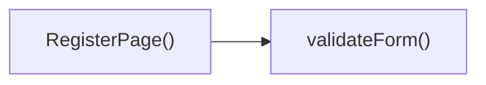

## Genel Bakış
src/views/RegisterPage.tsx, VentHub HVAC platformunun kullanıcı kayıt ekranını oluşturan React bileşenidir. Kullanıcıların yeni hesap oluşturmak için doldurduğu kayıt formunun tüm işlevlerini tek merkezde yönetir. Form girdisi takibi, doğrulama ve sunucuya gönderim süreçlerini kapsar.

## Fonksiyon Grupları
### Ana Bileşen
Modülün temel React bileşenidir, kayıt sayfasının arayüzünü oluşturur, tüm form işlevlerini barındırır ve sayfayı kullanıcıya sunar.
- RegisterPage

### Form Girdisi Yönetimi
Kullanıcının form alanlarına yaptığı giriş değişikliklerini algılar, formun dahili veri durumunu güncel tutar.
- handleChange

### Form Doğrulama
Kayıt formundaki tüm alanların belirlenen kurallara uygunluğunu kontrol eder, geçersiz veya eksik girdileri tespit eder.
- validateForm

### Form Gönderimi
Doğrulanmış form verilerini sunucuya gönderen asenkron işlem akışını yönetir, sunucu yanıtına göre kullanıcı deneyimini yönlendirir.
- handleSubmit

---

## AXIOMS – Mimari Varsayımlar
Bu React tabanlı kullanıcı kayıt sayfası bileşeninin sorunsuz çalışması için frontend React ortam bağımlılıklarının, form yönetimi altyapısının ve backend kayıt servisinin erişilebilir olması zorunludur.

[Aksiyom 1]: Eğer React kütüphanesi, React.ChangeEvent ve React.FormEvent tipleri ile bileşen çalışması için gerekli tüm React çekirdek yapıları ortamda mevcut değilse, bileşen derlenemez, olay dinleyicileri çalışmaz, kayıt sayfası hiç görüntülenemez.
[Aksiyom 2]: Eğer kullanıcı girişlerini saklamak için tanımlanan yerel bileşen state yapısı mevcut değilse, handleChange fonksiyonu input değişikliklerini kaydedemez, validateForm ve handleSubmit fonksiyonları işlenecek form verisine erişemediği için kayıt süreci çalışmaz.
[Aksiyom 3]: Eğer formdaki HTML input elementleri handleChange ve handleSubmit olay dinleyicileri ile doğru şekilde ilişkilendirilmemişse, kullanıcı girişi yakalanmaz, form gönderim işlemi hiç tetiklenemez.
[Aksiyom 4]: Eğer validateForm fonksiyonunun çalışması için gerekli alan doğrulama kuralları tanımlanmamışsa, formdaki hatalı veriler tespit edilemez, geçersiz girdilerin gönderimi engellenemez.
[Aksiyom 5]: Eğer handleSubmit fonksiyonunun kayıt verilerini göndereceği backend kullanıcı kayıt API uç noktası erişilebilir değilse, sunucu tarafında kullanıcı hesabı oluşturulamaz, kayıt süreci başarısız olur.
[Aksiyom 6]: Eğer kayıt sonrası kullanıcıyı yönlendirecek frontend yönlendirme (routing) altyapısı mevcut değilse, başarılı kayıt işleminin ardından kullanıcı platformun ilgili çalışma ekranına yönlendirilemez.

---

## FONKSIYON DETAYLARI

### RegisterPage
**Ne yapar**: VentHub HVAC projesinin kullanıcı hesap oluşturma süreçlerini yöneten frontend kayıt sayfası React bileşenidir. Kullanıcıların kayıt formu üzerinden girdiği tüm bilgilerin toplanması, doğrulanması ve gönderilmesi süreçlerini tek bileşen altında toplar.
**Nasıl yapar**: Form yönetimi için gerekli yerel durum (state) değişkenlerini, input değişikliklerini takip eden işleyicileri, form doğrulama ve gönderim fonksiyonlarını içinde barındırır. Sayfanın kullanıcı arayüzünü ve tüm iş mantığını birleştirerek sunuma hazır React bileşeni olarak döndürür.
**Parametreler**: Girdi parametresi bulunmamaktadır.
**Dönüş**: React.FC tipi, yandexim kayıt sayfasının kullanıcıya sunulacak React bileşenini döndürür.

### handleChange
**Ne yapar**: Kayıt formundaki input alanlarında meydana gelen değer değişikliklerini anlık olarak takip eder ve formun genel durumunu (state) günceller. Kullanıcının herhangi bir input alanına girdiği verinin ilgili form alanına kaydedilmesini sağlar.
**Nasıl yapar**: Tetiklendiği input elementinin name ve value özelliklerini alarak, formun durum nesnesindeki ilgili alanı dinamik olarak günceller. Tüm form inputları için tek bir değişiklik yönetim fonksiyonu olarak çalışarak kod tekrarını ortadan kaldırır.
**Parametreler**:
- e: React.ChangeEvent<HTMLInputElement> — Formdaki input alanında tetiklenen değişiklik olayını taşıyan React olay nesnesi, olayın gerçekleştiği elementin özelliklerine erişim sağlar.
**Dönüş**: Dönüş tipi belirtilmemiştir, yalnızca form durumunu güncellemek üzere işlem gerçekleştirir.

### validateForm
**Ne yapar**: Kullanıcının kayıt formuna girdiği tüm bilgilerin ön tanımlı kurallara uygunluğunu kontrol eder. Formun gönderilmeden önce doğruluğunu teyit ederek, hatalı veya eksik verinin backend'e gönderilmesini engeller.
**Nasıl yapar**: Formdaki zorunlu alanların doldurulma durumunu, e-posta formatının geçerliliği, şifre güvenlik kriterleri gibi standart doğrulama kontrollerini gerçekleştirir. Oluşan tüm hata mesajlarını kullanıcıya gösterilmek üzere ilgili durum (state) alanına kaydeder.
**Parametreler**: Girdi parametresi bulunmamaktadır.
**Dönüş**: Dönüş tipi belirtilmemiştir, yalnızca form doğrulama işlemini gerçekleştirir.

### handleSubmit
**Ne yapar**: Kullanıcının kayıt formunu gönderme isteğinde bulunduğunda tetiklenerek, formun gönderim sürecini yönetir. Varsayılan tarayıcı form gönderim davranışını engelleyerek tek sayfa uygulama akışını korur.
**Nasıl yapar**: İlk olarak olayın varsayılan davranışını engelleyerek sayfanın yenilenmesini önler. Ardından formun doğruluğunu kontrol etmek için validateForm fonksiyonunu çağırır, doğrulama süreci başarılı geçerse kayıt verilerini backend API'sine iletmek için gerekli istek işlemlerini başlatır.
**Parametreler**:
- e: React.FormEvent — Formun gönderilmesi olayını taşıyan React olay nesnesi, varsayılan gönderim davranışını engellemek ve form verilerine erişmek için kullanılır.
**Dönüş**: Dönüş tipi belirtilmemiştir, yalnızca form gönderim sürecini yönetmek üzere işlem gerçekleştirir.

---

## AST POINTERS

### [N1_NASIL] AST Pointer: C:\Users\alize\venthub-hvac\src\views\RegisterPage.tsx::RegisterPage
- **params**: (parametre yok)
- **ic_degiskenler**:
  - `useState` — React state hook'u, form ve bileşen state'lerini yönetmek için kullanılır
  - `useAuth` — kimlik doğrulama hook'u, kayıt işlemi için signUp metoduna erişim sağlar
  - `useI18n` — yerelleştirme hook'u, çeviri fonksiyonuna erişim sağlar
- **Dönüş**: React.FC (JSX bileşeni)

### [N2_NASIL] AST Pointer: C:\Users\alize\venthub-hvac\src\views\RegisterPage.tsx::handleChange
- **params**: (e: React.ChangeEvent<HTMLInputElement>)
- **ic_degiskenler**:
  - `setFormData` — form verisi state'ini güncellemek için kullanılan state setter fonksiyonu
  - `formData` — tüm form alanlarının mevcut değerlerini tutan state nesnesi
  - `e.target.name` — değişikliğe uğrayan input elementinin name niteliği, hangi alanın güncelleneceğini belirler
  - `e.target.value` — değişikliğe uğrayan input elementinin yeni girilen değeri
- **Dönüş**: yok

### [N3_NASIL] AST Pointer: C:\Users\alize\venthub-hvac\src\views\RegisterPage.tsx::validateForm
- **params**: (parametre yok)
- **ic_degiskenler**:
  - `formData.name` — formda girilen kullanıcı adı, boş geçilip geçilmediği kontrol edilir
  - `toast` — kullanıcıya bildirim göstermek için kullanılan toast kütüphanesi fonksiyonu
  - `t` — yerelleştirilmiş metinleri çekmek için kullanılan çeviri fonksiyonu
  - `formData.email` — formda girilen email adresi, @ içerip içermediği kontrol edilir
  - `passedRules` — şifre güvenlik kurallarından kaç tanesinin karşılandığını tutan sayısal değer
  - `formData.password` — formda girilen şifre, tekrarıyla eşleşip eşleşmediği kontrol edilir
  - `formData.confirmPassword` — formda girilen şifre tekrarı, ana şifreyle eşleşip eşleşmediği kontrol edilir
- **Dönüş**: boolean (form geçerliyse true, değilse false)

### [N4_NASIL] AST Pointer: C:\Users\alize\venthub-hvac\src\views\RegisterPage.tsx::handleSubmit
- **params**: (e: React.FormEvent)
- **ic_degiskenler**:
  - `e.preventDefault()` — formun varsayılan gönderim davranışını engeller
  - `validateForm` — form alanlarının geçerliliğini kontrol eden fonksiyon, geçersizse işlemi durdurur
  - `setLoading` — yükleme durumunu güncelleyen state setter fonksiyonu
  - `hibpPwnedCount` — şifrenin veri ihlallerinde bulunup bulunmadığını kontrol eden API fonksiyonu
  - `formData.password` — HIBP kontrolü ve kayıt işlemi için kullanılan şifre değeri
  - `pwned` — şifrenin kaç veri ihlalinde geçtiğini döndüren HIBP cevap değeri
  - `signUp` — useAuth hook'undan gelen kullanıcı kaydı yapan kimlik doğrulama fonksiyonu
  - `formData.email` — kayıt işlemi için kullanılan email adresi
  - `formData.name` — kayıt işlemi için kullanılan kullanıcı adı
  - `error` — kayıt işlemi sırasında oluşan hata nesnesi
  - `setRegistrationComplete` — kaydın başarılı olduğunu işaretleyen state setter fonksiyonu
  - `console.error` — oluşan beklenmedik hataları konsola yazdıran fonksiyon
- **Dönüş**: yok

### [N5_NASIL] AST Pointer: C:\Users\alize\venthub-hvac\src\views\RegisterPage.tsx::anonymous-strength-bar-item
- **params**: (i: döngü indeksi)
- **ic_degiskenler**:
  - `i` -- şifre gücü çubuğundaki doluluk segmentinin indeksi
  - `passedRules` -- karşılanan güvenlik kuralı sayısı, segmentin renkli olup olmayacağını belirler
  - `strengthColor` -- karşılanan kural sayısına göre belirlenen dolu segmentin arka plan rengi
  - `bg-light-gray` -- boş segmentlerin varsayılan arka plan rengi
- **Dönüş**: JSX.Element (şifre gücü çubuğu segmenti div'i)

### [N6_NASIL] AST Pointer: C:\Users\alize\venthub-hvac\src\views\RegisterPage.tsx::anonymous-password-rule-item
- **params**: (rule: şifre güvenlik kuralı nesnesi)
- **ic_degiskenler**:
  - `rule.key` -- kuralın benzersiz tanımlayıcısı, React liste anahtarı olarak kullanılır
  - `rule.test` -- şifrenin kuralı karşılayıp karşılamadığını kontrol eden fonksiyon
  - `formData.password` — kuralın test edildiği mevcut girilen şifre değeri
  - `rule.label` — kullanıcıya gösterilen kuralın açıklama metni
- **Dönüş**: JSX.Element (şifre güvenlik kuralı listeleme li elementi)

---

## ÇAĞRI HARİTASI

### Disariya Cagrilar (Outgoing)
Bu modüldeki `RegisterPage()` fonksiyonu, form doğrulama işlemini gerçekleştirmek için aynı dosya içindeki `validateForm` fonksiyonunu çağırır.

### Disaridan Cagrilanlar (Incoming)
Verilen çağrı verisinde bu modülü kullanan herhangi bir dış dosya veya fonksiyon belirtilmemiştir, kayıtlı gelen çağrı bulunmamaktadır.

### Ic Ice Fonksiyonlar (Nested)
Yok

---

## DOSYA-İÇİ ÇAĞRI GRAFİĞİ
  RegisterPage() → validateForm()

---

## NODE ID STANDARD

  file: src\views\RegisterPage.tsx
  function: src\views\RegisterPage.tsx::RegisterPage
  function: src\views\RegisterPage.tsx::handleChange
  function: src\views\RegisterPage.tsx::validateForm
  function: src\views\RegisterPage.tsx::handleSubmit

---

## DISA AKTARILANLAR (EXPORTS)
  export: RegisterPage