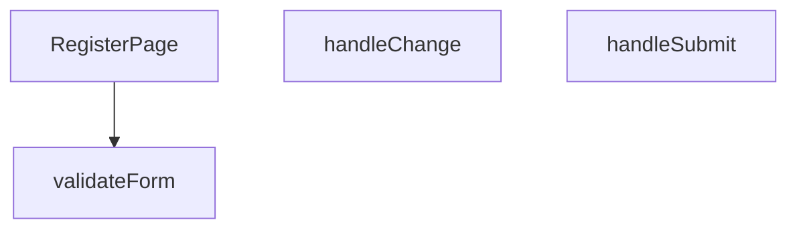

## Genel Bakış
Bu modül, kullanıcı kayıt arayüzünü sağlayan bir React bileşenidir. Form verilerini yönetir, kullanıcı girdilerinin geçerliliğini kontrol eder ve kayıt işlemini başlatır.

## Fonksiyon Grupları
### Ana Bileşen
Kayıt sayfasının görsel yapısını oluşturur ve kullanıcı arayüzünü sunar.
- RegisterPage

### Form Yönetimi ve Doğrulama
Kullanıcı girdilerini takip eder, verilerin kurallara uygunluğunu sınar ve form gönderme işlemini koordine eder.
- handleChange, validateForm, handleSubmit

---

## AXIOMS – Mimari Varsayımlar
Bu modül için özel aksiyom tanımlanmamıştır.

---

## FONKSİYON DETAYLARI

### RegisterPage
**Ne yapar**: Bu React bileşeni, kullanıcı kayıt formunu oluşturur ve yönetir. Bileşen, form alanlarını, giriş doğrulamayı ve gönderme işlemini kapsayan bir kayıt arayüzü sağlar.
**Nasıl yapar**: Bileşen, içinde `handleChange`, `validateForm` ve `handleSubmit` yardımcı fonksiyonlarını tanımlayarak form durumunu (state) ve olaylarını yönetir. `useState` ve `useEffect` gibi React hook'larını kullanarak form verilerini ve hata mesajlarını tutar. JSX dönüşünde bir HTML form öğesi ve gerekli input alanlarını render eder.
**Parametreler**: Fonksiyon hiçbir parametre almaz.
**Dönüş**: `React.FC` — Bileşen, geçerli bir React fonksiyonel bileşeni olarak `React.FC` tipini döndürür.

### handleChange
**Ne yapar**: Form içindeki herhangi bir giriş alanındaki (input) değişiklik olayını yakalar ve ilgili form durumunu (state) günceller. Kullanıcının her tuş vuruşunda veya seçiminde form verilerini canlı olarak güncel tutar.
**Parametreler**:
- `e: React.ChangeEvent<HTMLInputElement>` — Bir input öğesinden (text, email, password vb.) gelen değişiklik olayını temsil eder. Olay nesnesinden hedef elementin `name` ve `value` niteliklerini alarak ilgili form alanını günceller.
**Dönüş**: Hiçbir değer döndürmez (void). Sadece yan etki olarak form state'ini günceller.

### validateForm
**Ne yapar**: Formdaki tüm alanların geçerliliğini kontrol eder. Gerekli alanların boş olup olmadığını, e-posta formatı gibi belirli kurallara uygunluğu denetler.
**Parametreler**: Hiçbir parametre almaz. Form durumuna (state) doğrudan erişir.
**Dönüş**: Hiçbir değer döndürmez (void). Doğrulama sonuçlarını bir hata durumu (errors state) nesnesine kaydeder veya geçerlilik bayrağını günceller. `handleSubmit` tarafından gönderme öncesi çağrılır.

### handleSubmit
**Ne yapar**: Form gönderme olayını işler. Öncelikle `validateForm` ile doğrulama yapar, eğer doğrulama başarılıysa form verilerini bir API'ye göndermek veya başka bir işlem için hazırlar. Sayfanın yeniden yüklenmesini engeller.
**Parametreler**:
- `e: React.FormEvent` — Formun submit olayını temsil eder. `preventDefault()` yöntemi ile varsayılan form gönderme davranışı durdurulur.
**Dönüş**: Hiçbir değer döndürmez (void). Başarılı gönderimde kullanıcıyı başka bir sayfaya yönlendirebilir veya bir durum mesajı gösterebilir.

---

## AST POINTERS

### [N1_NASIL] AST Pointer: C:\Users\alize\venthub-hvac\src\views\RegisterPage.tsx::RegisterPage
- **params**: (parametre yok)
- **ic_degiskenler**: yok
- **Dönüş**: React.FC (bileşen render eder, JSX döndürür)

### [N2_NASIL] AST Pointer: C:\Users\alize\venthub-hvac\src\views\RegisterPage.tsx::handleChange
- **params**: e — `React.ChangeEvent<HTMLInputElement>` (giriş elemanının değişim olayı)
- **ic_degiskenler**:
  - `setFormData` — dışarıdan gelen state güncelleme fonksiyonu; form verisini yeni değerle birleştirerek günceller.
  - `formData` — dışarıdan gelen mevcut form durumu; yeni alan değeriyle genişletilir.
- **Dönüş**: yok (state günceller, UI yeniden render olur)

### [N3_NASIL] AST Pointer: C:\Users\alize\venthub-hvac\src\views\RegisterPage.tsx::validateForm
- **params**: (parametre yok)
- **ic_degiskenler**:
  - `formData` — form alanlarının mevcut değerleri; `name`, `email`, `password`, `confirmPassword` vb. içerir.
  - `passedRules` — şifre güvenlik kurallarının kaç tanesinin sağlandığını gösteren sayı.
  - `toast` — kullanıcıya hata mesajı göstermek için kullanılan bildirim fonksiyonu.
  - `t` — i18n çeviri fonksiyonu; hata mesajlarını yerelleştirir.
- **Dönüş**: `boolean` — form geçerli ise `true`, aksi takdirde `false` (hata toastları gösterilir)

### [N4_NASIL] AST Pointer: C:\Users\alize\venthub-hvac\src\views\RegisterPage.tsx::handleSubmit
- **params**: e — `React.FormEvent` (form gönderim olayı)
- **ic_degiskenler**:
  - `e` — form gönderim olayını durdurmak için `preventDefault()` çağrılır.
  - `validateForm` — form doğrulama fonksiyonu; `false` dönerse işlem durur.
  - `setLoading` — yükleme durumunu `true/false` olarak ayarlayan state setter.
  - `toast` — başarı ve hata bildirimleri için kullanılan fonksiyon.
  - `t` — i18n çeviri fonksiyonu; mesajları yerelleştirir.
  - `hibpPwnedCount` — şifreyi Have I Been Pwned API'siyle kontrol eden async fonksiyon; `pwned` sayısını döner.
  - `formData` — gönderilecek kayıt bilgileri (`email`, `password`, `name`).
  - `signUp` — kullanıcı kaydı yapan async fonksiyon; `{ error }` nesnesi döner.
  - `setRegistrationComplete` — kayıt tamamlandığında UI durumunu güncelleyen state setter.
  - `console.error` — beklenmeyen hataları konsola loglar.
- **Dönüş**: yok (state günceller, toast gösterir, olası hataları yakalar)

---

## MERMAID CALL GRAPH

## NODE ID STANDARD

  file: src\views\RegisterPage.tsx
  function: src\views\RegisterPage.tsx::RegisterPage
  function: src\views\RegisterPage.tsx::handleChange
  function: src\views\RegisterPage.tsx::validateForm
  function: src\views\RegisterPage.tsx::handleSubmit

---

## DISA AKTARILANLAR (EXPORTS)
  export: RegisterPage

---

## STİL TOKENLERİ

### Arbitrary Değerler (token'a geçirilmemiş)
Yok — tüm stiller token'a geçirilmiş. ✅

### Kullanılan Token'lar (zaten token'a geçirilmiş)
- (yok)

### Tailwind Sınıf Özeti
- **Renkler:** `bg-gradient-to-br`, `bg-light-gray`, `bg-primary-navy`, `bg-repeat`, `bg-success-green`, `bg-white/90`, `border-2`, `border-b-2`, `border-light-gray`, `border-primary-navy`, `border-white`, `border-white/20`, `focus-visible:border-transparent`, `from-air-blue`, `hover:bg-primary-navy`
- **Layout:** `absolute`, `backdrop-blur-sm`, `block`, `flex`, `flex-1`, `from-air-blue`, `gap-1`, `gap-1.5`, `h-1.5`, `h-16`, `h-5`, `inline-flex`, `items-center`, `justify-center`, `left-3`
- **Varyant/Responsive:** `:`, `disabled:`, `focus-visible:`, `hover:` önekleri
- **Yardımcı Sınıflar:** `$`, `:`, `<=`, `animate-spin`, `border`, `disabled:cursor-not-allowed`, `disabled:opacity-50`, `duration-300`, `focus-visible:outline-none`, `focus-visible:ring-2`, `focus-visible:ring-primary-navy`, `font-bold`, `font-medium`, `font-semibold`, `i`