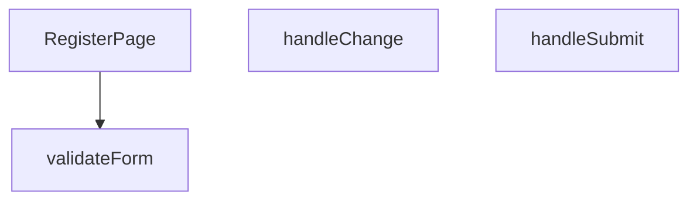

## Genel Bakış
RegisterPage.tsx modülü, kullanıcıların yeni bir hesap oluşturabilmesi için gerekli olan kayıt formunu ve formun yönetim mantığını barındıran bir React bileşenidir. Modül, kullanıcının form alanlarına girdiği verileri tutar, bu verilerin tanımlı kurallara göre geçerliliğini doğrular ve geçerli ise sunucuya göndererek kayıt işlemini tamamlar.

## Fonksiyon Grupları
### Ana Sayfa Bileşeni
Modülün dışa açılan kapısı olup tüm kayıt sayfası arayüzünü, form yapısını ve kullanıcı etkileşim noktalarını ekrana çizer.
- RegisterPage

### Form Etkileşimi ve İş Akışı Yönetimi
Kullanıcı girdilerini yakalayarak form verisini güncelleyen, bu verilerin doğruluğunu test eden ve son olarak formun sunucuya gönderilmesi işlemini başlatarak iş akışını tamamlayan yardımcı fonksiyonlardır.
- handleChange, validateForm, handleSubmit

---

## AXIOMS – Mimari Varsayımlar
[Genel varsayım]: Bu modül, bir kullanıcı kayıt formu sunan ve gönderilen verilerin doğruluğunu doğrulayan bir React bileşenidir.

[Aksiyom 1]: Eğer bileşen doğru bir şekilde render edilecekse, bir `useState` hook'u ile en az `email`, `password`, `confirmPassword`, `error` ve `loading` alanlarını tutan bir başlangıç state'i (initialState) tanımlı olmalıdır.
[Aksiyom 2]: Eğer bir form alanı güncellenecekse, `handleChange` fonksiyonu, bir `React.ChangeEvent<HTMLInputElement>` parametresi almalı ve ilgili state alanını güncellemelidir. Etkilenen state alanının adı, HTML input'unun `name` özelliği ile eşleşmelidir.
[Aksiyom 3]: Eğer form gönderimi tetiklenecekse, `handleSubmit` fonksiyonu, bir `React.FormEvent` parametresi almalı ve `e.preventDefault()` çağrısı ile sayfa yenilemesini engellemelidir.
[Aksiyom 4]: Eğer `validateForm` fonksiyonu çalıştırılacaksa, mevcut state alanlarını (`email`, `password`, `confirmPassword`) kontrol etmeli ve geçerli ise `true`, geçersiz ise `false` döndürmelidir. Eşik değerleri ve kurallar (ör. email formatı, minimum şifre uzunluğu) fonksiyon gövdesinde tanımlı olmalıdır.
[Aksiyom 5]: Eğer `handleSubmit` başarılı bir form doğrulamasından (`validateForm() === true`) geçecekse, `loading` state'i `true` olarak ayarlanmalı ve bir API isteği (fetch/axios) gönderilmelidir. İstek başarısız olursa `error` state'i güncellenmeli, başarılı olursa kullanıcı başka bir sayfaya yönlendirilmelidir.

---

## FONKSİYON DETAYLARI

### RegisterPage
**Ne yapar**: Bu React bileşeni, kullanıcı kayıt formunu oluşturur ve yönetir. Bileşen, form alanlarını, giriş doğrulamayı ve gönderme işlemini kapsayan bir kayıt arayüzü sağlar.
**Nasıl yapar**: Bileşen, içinde `handleChange`, `validateForm` ve `handleSubmit` yardımcı fonksiyonlarını tanımlayarak form durumunu (state) ve olaylarını yönetir. `useState` ve `useEffect` gibi React hook'larını kullanarak form verilerini ve hata mesajlarını tutar. JSX dönüşünde bir HTML form öğesi ve gerekli input alanlarını render eder.
**Parametreler**: Fonksiyon hiçbir parametre almaz.
**Dönüş**: `React.FC` — Bileşen, geçerli bir React fonksiyonel bileşeni olarak `React.FC` tipini döndürür.

### handleChange
**Ne yapar**: Form içindeki herhangi bir giriş alanındaki (input) değişiklik olayını yakalar ve ilgili form durumunu (state) günceller. Kullanıcının her tuş vuruşunda veya seçiminde form verilerini canlı olarak güncel tutar.
**Parametreler**:
- `e: React.ChangeEvent<HTMLInputElement>` — Bir input öğesinden (text, email, password vb.) gelen değişiklik olayını temsil eder. Olay nesnesinden hedef elementin `name` ve `value` niteliklerini alarak ilgili form alanını günceller.
**Dönüş**: Hiçbir değer döndürmez (void). Sadece yan etki olarak form state'ini günceller.

### validateForm
**Ne yapar**: Formdaki tüm alanların geçerliliğini kontrol eder. Gerekli alanların boş olup olmadığını, e-posta formatı gibi belirli kurallara uygunluğu denetler.
**Parametreler**: Hiçbir parametre almaz. Form durumuna (state) doğrudan erişir.
**Dönüş**: Hiçbir değer döndürmez (void). Doğrulama sonuçlarını bir hata durumu (errors state) nesnesine kaydeder veya geçerlilik bayrağını günceller. `handleSubmit` tarafından gönderme öncesi çağrılır.

### handleSubmit
**Ne yapar**: Form gönderme olayını işler. Öncelikle `validateForm` ile doğrulama yapar, eğer doğrulama başarılıysa form verilerini bir API'ye göndermek veya başka bir işlem için hazırlar. Sayfanın yeniden yüklenmesini engeller.
**Parametreler**:
- `e: React.FormEvent` — Formun submit olayını temsil eder. `preventDefault()` yöntemi ile varsayılan form gönderme davranışı durdurulur.
**Dönüş**: Hiçbir değer döndürmez (void). Başarılı gönderimde kullanıcıyı başka bir sayfaya yönlendirebilir veya bir durum mesajı gösterebilir.

---

## İTHALATLAR (IMPORTS)
- import: ../hooks/useAuth::useAuth
- import: ../hooks/useLocalizedRoutes::useLocalizedRoutes
- import: ../i18n/I18nProvider::useI18n
- import: ../utils/passwordSecurity::hibpPwnedCount
- import: lucide-react::ArrowLeft
- import: lucide-react::CheckCircle
- import: lucide-react::Eye
- import: lucide-react::EyeOff
- import: lucide-react::Lock
- import: lucide-react::Mail
- import: lucide-react::User
- import: next/link::Link
- import: react::React
- import: react::useState
- import: sonner::toast

---

## AST POINTERS

### [N1_NASIL] AST Pointer: src/views/RegisterPage.tsx::RegisterPage
- **params**: (parametre yok)
- **ic_degiskenler**:
  - `useState` hook'lardan dönen state'ler ve setter'lar — form verisi, loading durumu, şifre görünürlüğü, kurallar listesi, registration tamamlanma durumu, şifre gücü rengi,passedRules (geçilen kural sayısı) bileşen içinde manage edilir
  - `formData` — `{ name, email, password, confirmPassword }` shape'inde form state'i
  - `loading` — submit sırasında true olan yüklenme flag'i
  - `showPassword` — şifre alanı toggling görünürlüğü
  - `showConfirmPassword` — şifre tekrar alanı toggling görünürlüğü
  - `registrationComplete` — kayıt sonrası email onay ekranına geçiş flag'i
  - `strengthColor` — şifre gücü barı için dinamik renk (passedRules'a bağlı)
  - `passedRules` — kurallar listesi içinde test() geçen kural sayısı
  - `rules` — şifre güvenlik kuralları dizisi (her biri `{ key, test, label }`)
  - `t` — `useI18n()` hook'undan dönen çeviri fonksiyonu
  - `signUp` — `useAuth()` hook'undan dönen kayıt fonksiyonu
  - `router` — `useLocalizedRoutes()` hook'undan dönen yönlendirme objesi
- **Dönüş**: JSX — Register sayfası (form, şifre gücü göstergesi, kurallar listesi, onay ekranı)

---

## MERMAID CALL GRAPH

## NODE ID STANDARD

  file: src\views\RegisterPage.tsx
  function: src\views\RegisterPage.tsx::RegisterPage
  function: src\views\RegisterPage.tsx::handleChange
  function: src\views\RegisterPage.tsx::validateForm
  function: src\views\RegisterPage.tsx::handleSubmit

---

## DISA AKTARILANLAR (EXPORTS)
  export: RegisterPage

---

## STİL TOKENLERİ

### Arbitrary Değerler (token'a geçirilmemiş)
Yok — tüm stiller token'a geçirilmiş. ✅

### Kullanılan Token'lar (zaten token'a geçirilmiş)
- (yok)

### Tailwind Sınıf Özeti
- **Renkler:** `bg-gradient-to-br`, `bg-light-gray`, `bg-primary-navy`, `bg-repeat`, `bg-success-green`, `bg-white/90`, `border-2`, `border-b-2`, `border-light-gray`, `border-primary-navy`, `border-white`, `border-white/20`, `focus-visible:border-transparent`, `from-air-blue`, `hover:bg-primary-navy`
- **Layout:** `absolute`, `backdrop-blur-sm`, `block`, `flex`, `flex-1`, `from-air-blue`, `gap-1`, `gap-1.5`, `h-1.5`, `h-16`, `h-5`, `inline-flex`, `items-center`, `justify-center`, `left-3`
- **Varyant/Responsive:** `:`, `disabled:`, `focus-visible:`, `hover:` önekleri
- **Yardımcı Sınıflar:** `$`, `:`, `<=`, `animate-spin`, `border`, `disabled:cursor-not-allowed`, `disabled:opacity-50`, `duration-300`, `focus-visible:outline-none`, `focus-visible:ring-2`, `focus-visible:ring-primary-navy`, `font-bold`, `font-medium`, `font-semibold`, `i`