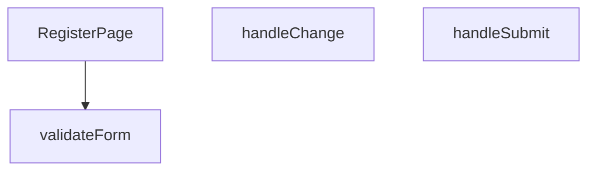

## Genel Bakış
RegisterPage.tsx modülü, kullanıcıların yeni bir hesap oluşturabilmesi için gerekli olan kayıt formunu ve formun yönetim mantığını barındıran bir React bileşenidir. Modül, kullanıcının form alanlarına girdiği verileri tutar, bu verilerin tanımlı kurallara göre geçerliliğini doğrular ve geçerli ise sunucuya göndererek kayıt işlemini tamamlar.

## Fonksiyon Grupları
### Ana Sayfa Bileşeni
Modülün dışa açılan kapısı olup tüm kayıt sayfası arayüzünü, form yapısını ve kullanıcı etkileşim noktalarını ekrana çizer.
- RegisterPage

### Form Etkileşimi ve İş Akışı Yönetimi
Kullanıcı girdilerini yakalayarak form verisini güncelleyen, bu verilerin doğruluğunu test eden ve son olarak formun sunucuya gönderilmesi işlemini başlatarak iş akışını tamamlayan yardımcı fonksiyonlardır.
- handleChange, validateForm, handleSubmit

---

## AXIOMS – Mimari Varsayımlar

Bu modül, kullanıcı kayıt formunu yöneten bir React bileşenidir. Doğru çalışması için aşağıdaki mimari varsayımlar gereklidir:

**[Aksiyom 1]**: Eğer `/api/auth/register` API endpoint'i (POST, JSON body: `{name, email, password}`) yoksa, kayıt işlemi başarısız olur ve kullanıcıya hata gösterilir.

**[Aksiyom 2]**: Eğer `react-router-dom` kütüphanesi ve `useNavigate` hook'u mevcut değilse, başarılı kayıt sonrası `/login` sayfasına yönlendirme yapılamaz.

**[Aksiyom 3]**: Eğer form alanlarının `name` özniteliği (`name`, `email`, `password`, `confirmPassword`) doğru tanımlanmamışsa, `handleChange`fonksiyonu form verilerini güncelleyemez.

**[Aksiyom 4]**: Eğer şifre 6 karakterden kısa ise, form doğrulaması başarısız olur ve "Şifre en az 6 karakter olmalıdır" hatası gösterilir.

**[Aksiyom 5]**: Eğer e-posta adresi `/^[^\s@]+@[^\s@]+\.[^\s@]+$/` regular expression kalıbına uymuyorsa, form doğrulaması başarısız olur.

**[Aksiyom 6]**: Eğer `password` ve `confirmPassword` alanları aynı değeri içermiyorsa, form doğrulaması başarısız olur ve "Şifreler eşleşmiyor" hatası gösterilir.

**[Aksiyom 7]**: Eğer `e.preventDefault()` çağrılmazsa, form gönderimi varsayılan davranış ile sayfa yenilenir ve state kaybolur.

---

## FONKSİYON DETAYLARI

### RegisterPage
**Ne yapar**: Bu React bileşeni, kullanıcı kayıt formunu oluşturur ve yönetir. Bileşen, form alanlarını, giriş doğrulamayı ve gönderme işlemini kapsayan bir kayıt arayüzü sağlar.
**Nasıl yapar**: Bileşen, içinde `handleChange`, `validateForm` ve `handleSubmit` yardımcı fonksiyonlarını tanımlayarak form durumunu (state) ve olaylarını yönetir. `useState` ve `useEffect` gibi React hook'larını kullanarak form verilerini ve hata mesajlarını tutar. JSX dönüşünde bir HTML form öğesi ve gerekli input alanlarını render eder.
**Parametreler**: Fonksiyon hiçbir parametre almaz.
**Dönüş**: `React.FC` — Bileşen, geçerli bir React fonksiyonel bileşeni olarak `React.FC` tipini döndürür.

### handleChange
**Ne yapar**: Form içindeki herhangi bir giriş alanındaki (input) değişiklik olayını yakalar ve ilgili form durumunu (state) günceller. Kullanıcının her tuş vuruşunda veya seçiminde form verilerini canlı olarak güncel tutar.
**Parametreler**:
- `e: React.ChangeEvent<HTMLInputElement>` — Bir input öğesinden (text, email, password vb.) gelen değişiklik olayını temsil eder. Olay nesnesinden hedef elementin `name` ve `value` niteliklerini alarak ilgili form alanını günceller.
**Dönüş**: Hiçbir değer döndürmez (void). Sadece yan etki olarak form state'ini günceller.

### validateForm
**Ne yapar**: Formdaki tüm alanların geçerliliğini kontrol eder. Gerekli alanların boş olup olmadığını, e-posta formatı gibi belirli kurallara uygunluğu denetler.
**Parametreler**: Hiçbir parametre almaz. Form durumuna (state) doğrudan erişir.
**Dönüş**: Hiçbir değer döndürmez (void). Doğrulama sonuçlarını bir hata durumu (errors state) nesnesine kaydeder veya geçerlilik bayrağını günceller. `handleSubmit` tarafından gönderme öncesi çağrılır.

### handleSubmit
**Ne yapar**: Form gönderme olayını işler. Öncelikle `validateForm` ile doğrulama yapar, eğer doğrulama başarılıysa form verilerini bir API'ye göndermek veya başka bir işlem için hazırlar. Sayfanın yeniden yüklenmesini engeller.
**Parametreler**:
- `e: React.FormEvent` — Formun submit olayını temsil eder. `preventDefault()` yöntemi ile varsayılan form gönderme davranışı durdurulur.
**Dönüş**: Hiçbir değer döndürmez (void). Başarılı gönderimde kullanıcıyı başka bir sayfaya yönlendirebilir veya bir durum mesajı gösterebilir.

---

## İTHALATLAR (IMPORTS)
- import: ../hooks/useAuth::useAuth
- import: ../i18n/I18nProvider::useI18n
- import: ../utils/passwordSecurity::hibpPwnedCount
- import: ../utils/routes::Routes
- import: lucide-react::ArrowLeft
- import: lucide-react::CheckCircle
- import: lucide-react::Eye
- import: lucide-react::EyeOff
- import: lucide-react::Lock
- import: lucide-react::Mail
- import: lucide-react::User
- import: next/link::Link
- import: react::React
- import: react::useState
- import: sonner::toast

---

## AST POINTERS

### [N1_NASIL] AST Pointer: RegisterPage.tsx::handleChange
- **params**: (e: React.ChangeEvent<HTMLInputElement>)
- **ic_degiskenler**:
  - `e` — Input change olayı, hedef input'un name ve value değerlerini taşır
  - `formData` — Mevcut form verilerini tutan state, spread ile güncellenir
  - `setFormData` — formData state'ini güncellemek için setter fonksiyonu
- **Dönüş**: yok

### [N2_NASIL] AST Pointer: RegisterPage.tsx::validateForm
- **params**: (parametre yok)
- **ic_degiskenler**:
  - `formData` — Form alanlarını tutan state, doğrulama için kullanılır (isim, email, şifre, şifre onayı)
  - `passedRules` — Şifrenin karşıladığı kural sayısı, doğrulama için kullanılır
  - `t` — Çeviri fonksiyonu, hata mesajlarını çevirir
  - `toast` — Bildirim göstermek için fonksiyon
- **Dönüş**: boolean (true: doğrulama başarılı, false: hata var)

### [N3_NASIL] AST Pointer: RegisterPage.tsx::handleSubmit
- **params**: (e: React.FormEvent)
- **ic_degiskenler**:
  - `e` — Form submit olayı, varsayılan davranışı engeller
  - `formData` — Form verileri state'i, API'ye gönderilen e-posta, şifre ve isim değerlerini tutar
  - `setLoading` — Yükleme durumunu güncellemek için setter
  - `hibpPwnedCount` — HIBP sızıntı kontrolü yapan fonksiyon
  - `pwned` — Şifrenin bilinen sızıntılarda bulunma sayısı
  - `signUp` — Kayıt API fonksiyonu
  - `error` — signUp fonksiyonundan dönen hata nesnesi veya catch bloğunda yakalanan hata
  - `setRegistrationComplete` — Kayıt tamamlandı durumunu güncellemek için setter
  - `toast` — Bildirim göstermek için fonksiyon
  - `console.error` — Hata günlüğüne yazma fonksiyonu
- **Dönüş**: yok

### [N4_NASIL] AST Pointer: RegisterPage.tsx::(inline arrow for progress bar)
- **params**: (i: number)
- **ic_degiskenler**:
  - `i` — Döngü indeksi, mevcut çubuk için indeks numarası
  - `passedRules` — Geçilen kural sayısı, indeks ile karşılaştırılarak renk belirlenir
  - `strengthColor` — Şifre güçlülüğüne göre renk sınıfı (Tailwind CSS)
- **Dönüş**: JSX element (div)

### [N5_NASIL] AST Pointer: RegisterPage.tsx::(inline arrow for rule list)
- **params**: (rule: { key: string, test: (password: string) => boolean, label: string })
- **ic_degiskenler**:
  - `rule` — Kural nesnesi, test fonksiyonu ve etiket içerir
  - `formData.password` — Mevcut şifre, test fonksiyonuna parametre olarak gönderilir
  - `rule.test` — Kuralın test fonksiyonu, şifrenin kuralı过得ıp geçmediğini kontrol eder
- **Dönüş**: JSX element (li)

---

## MERMAID CALL GRAPH

## NODE ID STANDARD

  file: src\views\RegisterPage.tsx
  function: src\views\RegisterPage.tsx::RegisterPage
  function: src\views\RegisterPage.tsx::handleChange
  function: src\views\RegisterPage.tsx::validateForm
  function: src\views\RegisterPage.tsx::handleSubmit

---

## DISA AKTARILANLAR (EXPORTS)
  export: RegisterPage

---

## STİL TOKENLERİ

### Arbitrary Değerler (token'a geçirilmemiş)
Yok — tüm stiller token'a geçirilmiş. ✅

### Kullanılan Token'lar (zaten token'a geçirilmiş)
- (yok)

### Tailwind Sınıf Özeti
- **Renkler:** `bg-gradient-to-br`, `bg-light-gray`, `bg-primary-navy`, `bg-repeat`, `bg-success-green`, `bg-white/90`, `border-2`, `border-b-2`, `border-light-gray`, `border-primary-navy`, `border-white`, `border-white/20`, `focus-visible:border-transparent`, `from-air-blue`, `hover:bg-primary-navy`
- **Layout:** `absolute`, `backdrop-blur-sm`, `block`, `flex`, `flex-1`, `from-air-blue`, `gap-1`, `gap-1.5`, `h-1.5`, `h-16`, `h-5`, `inline-flex`, `items-center`, `justify-center`, `left-3`
- **Varyant/Responsive:** `:`, `disabled:`, `focus-visible:`, `hover:` önekleri
- **Yardımcı Sınıflar:** `$`, `:`, `<=`, `animate-spin`, `border`, `disabled:cursor-not-allowed`, `disabled:opacity-50`, `duration-300`, `focus-visible:outline-none`, `focus-visible:ring-2`, `focus-visible:ring-primary-navy`, `font-bold`, `font-medium`, `font-semibold`, `i`