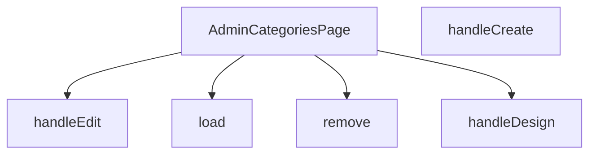

## Genel Bakış
AdminCategoriesPage, VentHub HVAC yönetim panelindeki kategorileri yönetmek için kullanılan ana React sayfasıdır. Sayfa, kategorilerin listelenmesi, eklenmesi, düzenlenmesi, silinmesi ve tasarım ayarlarının yönetilmesi gibi tüm kategori CRUD işlemlerini tek bir arayüzde sunar. Admin kullanıcısının kategori yapısı üzerindeki tüm operasyonları bu bileşen üzerinden gerçekleştirilir.

## Fonksiyon Grupları
### Sayfa Bileşeni
Kategori yönetim arayüzünün tüm yapısını ve işlevsel akışını tanımlayan ana React bileşenidir.
- AdminCategoriesPage

### Veri Yönetim İşlemleri
Kategori verilerinin sunucudan yüklenmesi ve belirli bir kategorinin sistemden kalıcı olarak silinmesi gibi asenkron veri işlemlerini yönetir.
- load, remove

### Eylem İşleyicileri
Yeni kategori oluşturma, mevcut kategoriyi düzenleme formunu açma ve kategorinin tasarım sayfasına yönlendirme gibi kullanıcı etkileşimlerini yönetir.
- handleCreate, handleEdit, handleDesign

---

## AXIOMS – Mimari Varsayımlar

Bu modül, VentHub HVAC yönetim panelinde kategori yönetimi sağlayan React bileşenidir. Aşağıdaki mimari varsayımlar fonksiyon imzaları ve modül yapısından çıkarılmıştır.

**[Aksiyom 1]**: Eğer `load()` fonksiyonu çağrıldığında arka planda bir kategori listesi servisi (API) mevcut değilse veya ağ bağlantısı kesikse, bileşen kategorileri yükleyemez ve hata durumuna geçer.

**[Aksiyom 2]**: Eğer `handleEdit(r: DbCategory)` fonksiyonuna geçilen `r` parametresi `null` veya `undefined` ise, düzenleme işlemi başarısız olur veya beklenmeyen davranış oluşur.

**[Aksiyom 3]**: Eğer `handleDesign(r: DbCategory)` fonksiyonuna geçilen `r` parametresi `null` veya `undefined` ise, tasarım ayarı işlemi başarısız olur veya beklenmeyen davranış oluşur.

**[Aksiyom 4]**: Eğer `remove(id: string)` fonksiyonuna geçilen `id` boş string (`""`) ise, silme işlemi hedef belirsizliği nedeniyle başarısız olur veya beklenmeyen bir kaydı siler.

**[Aksiyom 5]**: Eğer bileşen yüklendiğinde kategori verilerini tutan state/depo alanı başlatılmamışsa, `ColumnsMenu` ve `ExportMenu` bileşenlerine geçilecek veri listesi boş olur veya hata oluşur.

**[Aksiyom 6]**: Eğer `DbCategory` tipi (`id`, `name` ve/veya diğer zorunlu alanları) içermiyorsa, `handleEdit` ve `handleDesign` fonksiyonları beklenen form alanlarını dolduramaz.

**[Aksiyom 7]**: Eğer `ColumnsMenu` bileşeni çağrıldığında (call) gerekli sütun tanımı verisi sağlanmamışsa, tablo başlıkları eksik veya hatalı render edilir.

**[Aksiyom 8]**: Eğer `ExportMenu` bileşeni çağrıldığında (call) dışa aktarılacak kategori verisi boş listeyse, dışa aktarma işlemi anlamsız bir çıktı üretir veya sessizce başarısız olur.

**[Aksiyom 9]**: Eğer `handleCreate()` fonksiyonu çağrıldığında form alanı zorunlu alanlar (örn: kategori adı) dolu değilse, kayıt işlemi engellenmelidir — aksi halde geçersiz veri kaydı oluşur.

---

## FONKSİYON DETAYLARI

### AdminCategoriesPage
**Ne yapar**: VentHub HVAC projesinin yönetici panelinde kategori yönetimi işlemlerinin sunulduğu ana React bileşenidir. Tüm kategori ekleme, düzenleme, silme ve tasarım işlemlerinin barındığı tek sayfa arayüzünü oluşturur.
**Nasıl yapar**: Bileşen kendi içinde tanımlı olan tüm CRUD ve kullanıcı etkileşimi fonksiyonlarını entegre ederek çalışır. Sayfa ilk yüklendiğinde kategori verilerini çekmek için yerleşik yardımcı fonksiyonları tetikler, kullanıcı etkileşimlerini ilgili işleyicilere yönlendirerek React tabanlı sayfa içeriğini sürekli güncel tutar.
**Parametreler**: Bu bir React bileşeni olarak herhangi bir giriş parametresi almaz.
**Dönüş**: React.FC tipinde, yönetici kategoriler sayfasının tüm kullanıcı arayüzü öğelerini içeren React DOM ağacını döndürür.

### load
**Ne yapar**: Veritabanında kayıtlı tüm HVAC kategorilerini çekerek sayfa durumuna kaydetmekle görevli yardımcı fonksiyondur. Sayfa yüklendiğinde veya kategori listesinin yenilenmesi gerektiğinde tetiklenir.
**Nasıl yapar**: Backend API'sine istek göndererek tüm kategori kayıtlarını alır, elde edilen verileri yerel sayfa durumuna atayarak ekranda kategori listesinin güncel olarak görüntülenmesini sağlar. İşlem başarısız olursa hata yönetimi mantığını çalıştırarak kullanıcıya bildirim gösterebilir.
**Parametreler**: Herhangi bir giriş parametresi almaz.
**Dönüş**: Belirtilmemiş dönüş tipine sahiptir, void olarak çalışır; yalnızca sayfa durumunu günceller, herhangi bir değer döndürmez.

### handleCreate
**Ne yapar**: Yeni bir HVAC kategorisi oluşturma işlemini yöneten kullanıcı etkileşim işleyicisidir. Genellikle sayfadaki "Yeni Kategori Ekle" butonuna tıklandığında tetiklenir.
**Nasıl yapar**: Kullanıcıdan yeni kategori bilgilerini girmesi için bir form modalı açar, kullanıcının girdiği verileri backend API'sine göndererek yeni kategori kaydını oluşturur. İşlem başarılı olduğunda load fonksiyonunu çağırarak güncel kategori listesini sayfada yeniler.
**Parametreler**: Herhangi bir giriş parametresi almaz.
**Dönüş**: Belirtilmemiş dönüş tipine sahiptir, void olarak çalışır; yalnızca kullanıcı etkileşimini ve veri işlemlerini yönetir, herhangi bir değer döndürmez.

### handleEdit
**Ne yapar**: Mevcut bir HVAC kategorisinin bilgilerini düzenleme işlemini yöneten kullanıcı etkileşim işleyicisidir. İlgili kategoriye ait "Düzenle" butonuna tıklandığında tetiklenir.
**Nasıl yapar**: Parametre olarak aldığı mevcut kategori verisini düzenleme formuna doldurur, düzenleme işlemi için modal arayüzünü açar. Kullanıcının yaptığı değişiklikleri backend'e göndererek ilgili kategori kaydını günceller, işlem başarılı olursa kategori listesini yenilemek için load fonksiyonunu çağırır.
**Parametreler**:
- name: r, type: DbCategory — Düzenleme işlemi yapılacak mevcut kategori kaydının tüm verilerini içeren veritabanı nesnesi
**Dönüş**: Belirtilmemiş dönüş tipine sahiptir, void olarak çalışır; yalnızca düzenleme işlemini yönetir, herhangi bir değer döndürmez.

### handleDesign
**Ne yapar**: Mevcut bir HVAC kategorisine özel tasarım veya görünüm ayarlarını düzenleme işlemini yöneten kullanıcı etkileşim işleyicisidir. İlgili kategoriye ait "Tasarım" butonuna tıklandığında tetiklenir.
**Nasıl yapar**: Parametre olarak aldığı kategori verisini kullanarak tasarım düzenleme arayüzünü açar veya kullanıcıyı ilgili tasarım sayfasına yönlendirir. Kullanıcının yaptığı tasarım değişikliklerini kaydederek kategori için özel ayarları günceller, işlem sonrası sayfa durumunu güncel tutar.
**Parametreler**:
- name: r, type: DbCategory — Tasarım ayarları düzenlenecek kategori kaydının tüm verilerini içeren veritabanı nesnesi
**Dönüş**: Belirtilmemiş dönüş tipine sahiptir, void olarak çalışır; yalnızca tasarım düzenleme işlemini yönetir, herhangi bir değer döndürmez.

### remove
**Ne yapar**: Belirli bir HVAC kategorisini veritabanından silme işlemini yöneten kullanıcı etkileşim işleyicisidir. İlgili kategoriye ait "Sil" butonuna tıklandığında tetiklenir.
**Nasıl yapar**: Önce kullanıcıdan silme işlemini onaylamasını ister, onay alınması halinde silme isteğini ilgili backend API'sine gönderir. İşlem başarılı olduğunda load fonksiyonunu çağırarak silinen kategorinin kategori listesinden kaldırılmasını ve listenin güncel olarak kalmasını sağlar.
**Parametreler**:
- name: id, type: string — Silinecek kategori kaydının benzersiz tanımlayıcısı (ID'si)
**Dönüş**: Belirtilmemiş dönüş tipine sahiptir, void olarak çalışır; yalnızca silme işlemini yönetir, herhangi bir değer döndürmez.

---

## SABİTLER
- **ColumnsMenu** (call) — `lazy(() => import('../../components/admin/ColumnsMenu'))`
- **ExportMenu** (call) — `lazy(() => import('../../components/admin/ExportMenu'))`

---

## AST POINTERS

### [N1_NASIL] AST Pointer: AdminCategoriesPage.tsx::useEffectLocalStorageLoad
- **params**: (parametre yok)
- **ic_degiskenler**:
  - `c` — localStorage'dan okunan sütun görünürlük ayarı stringi; JSON.parse ile `visibleCols` state'ine dönüştürülür
  - `d` — localStorage'dan okunan yoğunluk (density) ayarı stringi; 'compact' veya 'comfortable' değerlerinden biri ise `density` state'ine set edilir
- **Dönüş**: yok (side-effect: `setVisibleCols`, `setDensity` state güncellemeleri)

### [N2_NASIL] AST Pointer: AdminCategoriesPage.tsx::useEffectSaveCols
- **params**: (parametre yok)
- **ic_degiskenler**: (yok)
- **Dönüş**: yok (side-effect: `localStorage.setItem` ile `visibleCols` kaydedilir)

### [N3_NASIL] AST Pointer: AdminCategoriesPage.tsx::useEffectSaveDensity
- **params**: (parametre yok)
- **ic_degiskenler**: (yok)
- **Dönüş**: yok (side-effect: `localStorage.setItem` ile `density` kaydedilir)

### [N4_NASIL] AST Pointer: AdminCategoriesPage.tsx::load
- **params**: (parametre yok)
- **ic_degiskenler**:
  - `data` — supabase sorgusundan dönen kategori satırları dizisi; `DbCategory[]` türüne cast edilerek `setRows` ile state'e yazılır
  - `fetchErr` — supabase `select` sorgusundan dönen hata nesnesi; varsa fırlatılır
  - `e` — try-catch yakaladığı genel hata nesnesi; `message` özelliği `setError` ile state'e yazılır
- **Dönüş**: yok (side-effect: `setLoading`, `setError`, `setRows` state güncellemeleri)

### [N5_NASIL] AST Pointer: AdminCategoriesPage.tsx::handleCreate
- **params**: (parametre yok)
- **ic_degiskenler**: (yok)
- **Dönüş**: yok (side-effect: `setEditingId(null)` ve `setIsModalOpen(true)` ile modal açılır)

### [N6_NASIL] AST Pointer: AdminCategoriesPage.tsx::handleEdit
- **params**: `r: DbCategory` — düzenlenecek kategori nesnesi
- **ic_degiskenler**: (yok)
- **Dönüş**: yok (side-effect: `setEditingId(r.id)` ve `setIsModalOpen(true)` ile modal açılır)

### [N7_NASIL] AST Pointer: AdminCategoriesPage.tsx::handleDesign
- **params**: `r: DbCategory` — tasarımı yapılacak kategori nesnesi
- **ic_degiskenler**: (yok)
- **Dönüş**: yok (side-effect: `router.push` ile `/admin/categories/${r.id}/builder` rotasına yönlendirilir)

### [N8_NASIL] AST Pointer: AdminCategoriesPage.tsx::remove
- **params**: `id: string` — silinecek kategorinin primary key'i
- **ic_degiskenler**:
  - `before` — silinmeden önce `rows` dizisi içinde `r.id === id` koşuluyla bulunan kategori nesnesi; bulunamazsa `null` olur; audit log için referans olarak kullanılır
  - `delErr` — supabase `delete` sorgusundan dönen hata nesnesi; varsa fırlatılır
  - `logAdminAction` — `../../lib/audit` dosyasından dinamik import ile yüklenen audit loglama fonksiyonu; silme işlemini kaydeder
- **Dönüş**: yok (side-effect: supabase'den satır silinir, audit log yazılır, `load()` ile tablo yenilenir)

### [N9_NASIL] AST Pointer: AdminCategoriesPage.tsx::handleCsvExport
- **params**: (parametre yok)
- **ic_degiskenler**:
  - `cols` — CSV başlıkları dizisi; `['id', 'name', 'sort_order', 'slug', 'parent_id', 'description']`
  - `header` — virgülle birleştirilmiş CSV başlık satırı stringi
  - `lines` — `filtered` dizisi üzerinden her kategoriyi CSV satırına dönüştüren map sonucu; her satırda `r.id`, `r.name`, `r.sort_order`, `r.slug`, `r.parent_id`, `r.description` değerleri virgülle ayrılır
  - `csv` — BOM karakteri (`\ufeff`) ile birleştirilmiş tüm CSV içeriği stringi
  - `blob` — CSV içeriğinden oluşturulan `Blob` nesnesi; `text/csv;charset=utf-8;` MIME tipi ile
  - `url` — `URL.createObjectURL` ile `blob`'dan türetilen tarayıcı URL'i; indirme bağlantısı olarak kullanılır
  - `a` — `document.createElement('a')` ile oluşturulan geçici HTML anchor elementi; `href` ve `download` ayarlanıp `click()` ile tetiklenir
- **Dönüş**: yok (side-effect: tarayıcıda dosya indirme tetiklenir, geçici URL revoke edilir)

### [N10_NASIL] AST Pointer: AdminCategoriesPage.tsx::renderRow
- **params**: `r: DbCategory` — render edilecek kategori satır nesnesi
- **ic_degiskenler**: (yok — JSX içinde doğrudan `r` özellikleri ve bileşen prop'ları kullanılır)
- **Dönüş**: JSX `<tr>` elementi — kategorinin görsel, ad, sıra, slug, üst kategori, açıklama ve aksiyon sütunlarını içeren tablo satırı

### [N11_NASIL] AST Pointer: AdminCategoriesPage.tsx::onSaveName
- **params**: `val: string` — EditableCell'den gelen yeni kategori adı değeri
- **ic_degiskenler**:
  - `upErr` — supabase `update` sorgusundan dönen hata nesnesi; varsa fırlatılır
- **Dönüş**: yok (side-effect: supabase'de kategori adı güncellenir, `setRows` ile local state synclenir, `toast.success` ile bildirim gösterilir)

### [N12_NASIL] AST Pointer: AdminCategoriesPage.tsx::onSaveSortOrder
- **params**: `val: string` — EditableCell'den gelen yeni sıralama değeri stringi
- **ic_degiskenler**:
  - `num` — `val`'ın `parseInt` ile 10'luk tabanda parse edilmiş tamsayı karşılığı; `isNaN` kontrolü yapılır
  - `upErr` — supabase `update` sorgusundan dönen hata nesnesi; varsa fırlatılır
- **Dönüş**: yok (side-effect: supabase'de `sort_order` güncellenir, `setRows` ile local state synclenir, `toast.success` ile bildirim gösterilir, `load()` ile tablo yenilenir)

---

## MERMAID CALL GRAPH

## NODE ID STANDARD

  file: src\views\admin\AdminCategoriesPage.tsx
  function: src\views\admin\AdminCategoriesPage.tsx::AdminCategoriesPage
  function: src\views\admin\AdminCategoriesPage.tsx::load
  function: src\views\admin\AdminCategoriesPage.tsx::handleCreate
  function: src\views\admin\AdminCategoriesPage.tsx::handleEdit
  function: src\views\admin\AdminCategoriesPage.tsx::handleDesign
  function: src\views\admin\AdminCategoriesPage.tsx::remove

---

## DISA AKTARILANLAR (EXPORTS)
  export: AdminCategoriesPage

---

## STİL TOKENLERİ

### Arbitrary Değerler (token'a geçirilmemiş)
Yok — tüm stiller token'a geçirilmiş. ✅

### Kullanılan Token'lar (zaten token'a geçirilmiş)
- `tracking-hvac-snug`

### Tailwind Sınıf Özeti
- **Renkler:** `bg-cyan-400`, `bg-indigo-500/10`, `bg-rose-500`, `bg-rose-500/10`, `bg-slate-700`, `bg-white/5`, `border-b`, `border-indigo-500/20`, `border-white/5`, `group-hover:border-cyan-400/30`, `group-hover:border-white/10`, `group-hover:text-cyan-400`, `group-hover:text-cyan-400/60`, `hover:bg-indigo-500`, `hover:bg-white/2`
- **Layout:** `custom-scrollbar`, `flex`, `flex-col`, `gap-1.5`, `gap-2`, `gap-4`, `h-1`, `h-1.5`, `h-12`, `h-full`, `h-px`, `inline-block`, `items-center`, `items-start`, `justify-between`
- **Varyant/Responsive:** `:`, `group-hover:`, `hover:`, `md:` önekleri
- **Yardımcı Sınıflar:** `${adminButtonPrimaryClass`, `${adminTableActionClass`, `${adminTableCellClass`, `${adminTableHeadCellClass`, `${cellPad`, `${headPad`, `${r.parent_id`, `:`, `border`, `divide-white/5`, `divide-y`, `duration-300`, `duration-500`, `duration-700`, `font-black`