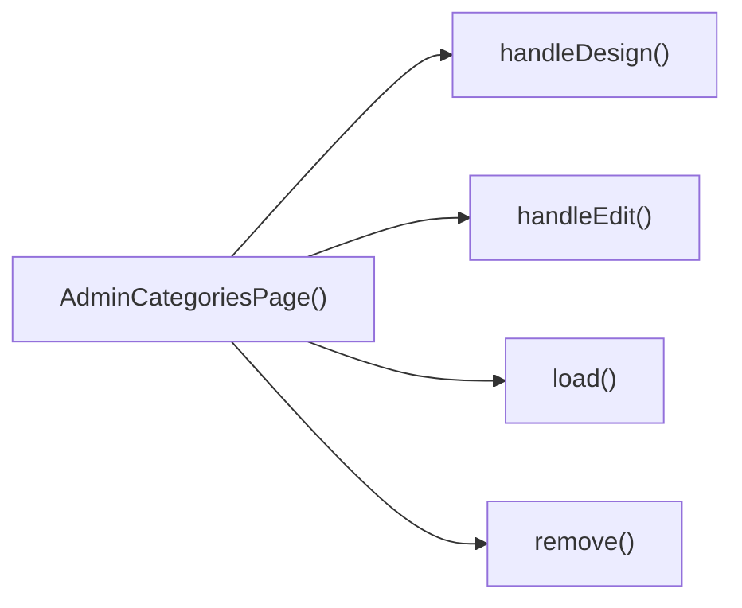

## Genel Bakış
Bu modül, VentHub HVAC yönetim platformunun yönetici panelinde yer alan kategori yönetimi sayfasını oluşturur. Admin kullanıcıların sistemdeki tüm kategoriler üzerinde işlem yapabilmesini sağlayan ön yüz mantığını barındıran React bileşenidir, tüm kategoriyle ilgili işlevleri tek noktada toplar.

## Fonksiyon Grupları
### Ana Sayfa Bileşeni
Modülün ana giriş noktası olarak tüm kategori yönetim arayüzünü ve bağlı işlevleri bir araya getirerek yönetici sayfasını oluşturur.
- AdminCategoriesPage

### Veri İşleme Fonksiyonları
Kategori verilerini sunucudan yüklemek ve istenildiğinde kayıt silmek gibi arka uçla entegre çalışan temel veri işlemlerini gerçekleştirir.
- load, remove

### Kullanıcı Eylemi İşleyicileri
Yönetici kullanıcının arayüzde gerçekleştirdiği yeni kategori oluşturma, mevcut kategoriyi düzenleme ve tasarlama gibi tüm kullanıcı eylemlerini yönetir.
- handleCreate, handleEdit, handleDesign

---

## AXIOMS – Mimari Varsayımlar
VentHub HVAC projesinin admin arayüzünde kategori yönetimi işlemlerini yürüten bu React bileşeninin doğru çalışması için tüm bağımlı UI bileşenleri, backend veri erişim servisleri ve yetkilendirme mekanizmalarının sağlıklı ve erişilebilir olması zorunludur.

[Aksiyom 1]: Eğer load() fonksiyonunun kategorileri veritabanından çekmek için kullandığı veri servisi erişilebilir değilse, sayfa üzerindeki kategori listesi hiçbir zaman yüklenemez ve kullanıcı boş bir ekranla karşılaşır.
[Aksiyom 2]: Eğer handleEdit() ve handleDesign() fonksiyonlarına parametre olarak iletilen DbCategory nesnesi erişilebilir değil veya eksik alanlara sahipse, ilgili kategori düzenleme ve tasarım akışları başlatılamaz.
[Aksiyom 3]: Eğer remove() fonksiyonuna parametre olarak gönderilen string türündeki kategori kimliği geçersiz veya veritabanında mevcut değilse, kategori silme işlemi başarısız olur.
[Aksiyom 4]: Eğer modülün kullandığı ColumnsMenu ve ExportMenu UI bileşenleri import edilemez veya çalıştırılamaz durumdaysa, sayfadaki sütun özelleştirme ve kategori listesi dışa aktarma işlevleri devre dışı kalır.
[Aksiyom 5]: Eğer sayfaya erişen kullanıcının admin paneli kullanma yetkisi doğrulanamazsa, bu bileşen hiçbir zaman yüklenemez ve yetkisiz erişim hatası oluşur.
[Aksiyom 6]: Eğer yeni kategori oluşturma işlemini yürüten handleCreate() fonksiyonunun bağlı olduğu backend oluşturma servisi çalışmıyorsa, hiçbir yeni kategori sisteme eklenemez.

---

## FONKSIYON DETAYLARI

### AdminCategoriesPage
**Ne yapar**: VentHub HVAC projesinin yönetici panelinde kategori yönetimi işlemlerinin sunulduğu ana React bileşenidir. Tüm kategori ekleme, düzenleme, silme ve tasarım işlemlerinin barındığı tek sayfa arayüzünü oluşturur.
**Nasıl yapar**: Bileşen kendi içinde tanımlı olan tüm CRUD ve kullanıcı etkileşimi fonksiyonlarını entegre ederek çalışır. Sayfa ilk yüklendiğinde kategori verilerini çekmek için yerleşik yardımcı fonksiyonları tetikler, kullanıcı etkileşimlerini ilgili işleyicilere yönlendirerek React tabanlı sayfa içeriğini sürekli güncel tutar.
**Parametreler**: Bu bir React bileşeni olarak herhangi bir giriş parametresi almaz.
**Dönüş**: React.FC tipinde, yönetici kategoriler sayfasının tüm kullanıcı arayüzü öğelerini içeren React DOM ağacını döndürür.

### load
**Ne yapar**: Veritabanında kayıtlı tüm HVAC kategorilerini çekerek sayfa durumuna kaydetmekle görevli yardımcı fonksiyondur. Sayfa yüklendiğinde veya kategori listesinin yenilenmesi gerektiğinde tetiklenir.
**Nasıl yapar**: Backend API'sine istek göndererek tüm kategori kayıtlarını alır, elde edilen verileri yerel sayfa durumuna atayarak ekranda kategori listesinin güncel olarak görüntülenmesini sağlar. İşlem başarısız olursa hata yönetimi mantığını çalıştırarak kullanıcıya bildirim gösterebilir.
**Parametreler**: Herhangi bir giriş parametresi almaz.
**Dönüş**: Belirtilmemiş dönüş tipine sahiptir, void olarak çalışır; yalnızca sayfa durumunu günceller, herhangi bir değer döndürmez.

### handleCreate
**Ne yapar**: Yeni bir HVAC kategorisi oluşturma işlemini yöneten kullanıcı etkileşim işleyicisidir. Genellikle sayfadaki "Yeni Kategori Ekle" butonuna tıklandığında tetiklenir.
**Nasıl yapar**: Kullanıcıdan yeni kategori bilgilerini girmesi için bir form modalı açar, kullanıcının girdiği verileri backend API'sine göndererek yeni kategori kaydını oluşturur. İşlem başarılı olduğunda load fonksiyonunu çağırarak güncel kategori listesini sayfada yeniler.
**Parametreler**: Herhangi bir giriş parametresi almaz.
**Dönüş**: Belirtilmemiş dönüş tipine sahiptir, void olarak çalışır; yalnızca kullanıcı etkileşimini ve veri işlemlerini yönetir, herhangi bir değer döndürmez.

### handleEdit
**Ne yapar**: Mevcut bir HVAC kategorisinin bilgilerini düzenleme işlemini yöneten kullanıcı etkileşim işleyicisidir. İlgili kategoriye ait "Düzenle" butonuna tıklandığında tetiklenir.
**Nasıl yapar**: Parametre olarak aldığı mevcut kategori verisini düzenleme formuna doldurur, düzenleme işlemi için modal arayüzünü açar. Kullanıcının yaptığı değişiklikleri backend'e göndererek ilgili kategori kaydını günceller, işlem başarılı olursa kategori listesini yenilemek için load fonksiyonunu çağırır.
**Parametreler**:
- name: r, type: DbCategory — Düzenleme işlemi yapılacak mevcut kategori kaydının tüm verilerini içeren veritabanı nesnesi
**Dönüş**: Belirtilmemiş dönüş tipine sahiptir, void olarak çalışır; yalnızca düzenleme işlemini yönetir, herhangi bir değer döndürmez.

### handleDesign
**Ne yapar**: Mevcut bir HVAC kategorisine özel tasarım veya görünüm ayarlarını düzenleme işlemini yöneten kullanıcı etkileşim işleyicisidir. İlgili kategoriye ait "Tasarım" butonuna tıklandığında tetiklenir.
**Nasıl yapar**: Parametre olarak aldığı kategori verisini kullanarak tasarım düzenleme arayüzünü açar veya kullanıcıyı ilgili tasarım sayfasına yönlendirir. Kullanıcının yaptığı tasarım değişikliklerini kaydederek kategori için özel ayarları günceller, işlem sonrası sayfa durumunu güncel tutar.
**Parametreler**:
- name: r, type: DbCategory — Tasarım ayarları düzenlenecek kategori kaydının tüm verilerini içeren veritabanı nesnesi
**Dönüş**: Belirtilmemiş dönüş tipine sahiptir, void olarak çalışır; yalnızca tasarım düzenleme işlemini yönetir, herhangi bir değer döndürmez.

### remove
**Ne yapar**: Belirli bir HVAC kategorisini veritabanından silme işlemini yöneten kullanıcı etkileşim işleyicisidir. İlgili kategoriye ait "Sil" butonuna tıklandığında tetiklenir.
**Nasıl yapar**: Önce kullanıcıdan silme işlemini onaylamasını ister, onay alınması halinde silme isteğini ilgili backend API'sine gönderir. İşlem başarılı olduğunda load fonksiyonunu çağırarak silinen kategorinin kategori listesinden kaldırılmasını ve listenin güncel olarak kalmasını sağlar.
**Parametreler**:
- name: id, type: string — Silinecek kategori kaydının benzersiz tanımlayıcısı (ID'si)
**Dönüş**: Belirtilmemiş dönüş tipine sahiptir, void olarak çalışır; yalnızca silme işlemini yönetir, herhangi bir değer döndürmez.

---

## SABİTLER
- **ColumnsMenu** (call) — `lazy(() => import('../../components/admin/ColumnsMenu'))`
- **ExportMenu** (call) — `lazy(() => import('../../components/admin/ExportMenu'))`

---

## AST POINTERS

### [N1_NASIL] AST Pointer: C:\Users\alize\venthub-hvac\src\views\admin\AdminCategoriesPage.tsx::readLocalStorageSettings
- **params**: (parametre yok)
- **ic_degiskenler**:
  - `typeof window` — sunucu tarafı çalışma durumunu kontrol etmek için kullanılan global window nesnesi tür check'i
  - `STORAGE_KEY` — localStorage anahtarlarını oluşturmak için kullanılan sabit temel anahtar
  - `c` — localStorage'dan okunan görünür sütun ayarlarının ham string değeri
  - `setVisibleCols` — görünür sütun listesini state'de güncellemek için kullanılan React state setter'ı
  - `JSON.parse` — string formatındaki ayarları JS nesnesine dönüştürmek için kullanılan native fonksiyon
  - `d` — localStorage'dan okunan tablo satır yoğunluğu ayarının ham string değeri
  - `setDensity` — tablo satır yoğunluğunu state'de güncellemek için kullanılan React state setter'ı
- **Dönüş**: void (tarayıcı dışı ortamda veya hata durumunda erken çıkış yapar)

### [N2_NASIL] AST Pointer: C:\Users\alize\venthub-hvac\src\views\admin\AdminCategoriesPage.tsx::saveVisibleColsToLocalStorage
- **params**: (parametre yok)
- **ic_degiskenler**:
  - `typeof window` — sunucu tarafı çalışma durumunu kontrol etmek için kullanılan global window nesnesi tür check'i
  - `STORAGE_KEY` — localStorage anahtarını oluşturmak için kullanılan sabit temel anahtar
  - `visibleCols` - state'deki güncel görünür sütun listesi, localStorage'a kaydedilecek değer
  - `JSON.stringify` - JS nesnesini localStorage için string formatına dönüştürmek için kullanılan native fonksiyon
- **Dönüş**: void (tarayıcı dışı ortamda veya hata durumunda erken çıkış yapar)

### [N3_NASIL] AST Pointer: C:\Users\alize\venthub-hvac\src\views\admin\AdminCategoriesPage.tsx::saveDensityToLocalStorage
- **params**: (parametre yok)
- **ic_degiskenler**:
  - `typeof window` — sunucu tarafı çalışma durumunu kontrol etmek için kullanılan global window nesnesi tür check'i
  - `STORAGE_KEY` — localStorage anahtarını oluşturmak için kullanılan sabit temel anahtar
  - `density` - state'deki güncel tablo satır yoğunluğu değeri, localStorage'a kaydedilecek
- **Dönüş**: void (tarayıcı dışı ortamda veya hata durumunda erken çıkış yapar)

### [N4_NASIL] AST Pointer: C:\Users\alize\venthub-hvac\src\views\admin\AdminCategoriesPage.tsx::load
- **params**: (parametre yok)
- **ic_degiskenler**:
  - `setLoading` - yükleme durumunu state'de güncellemek için kullanılan React state setter'ı
  - `setError` - hata mesajını state'de güncellemek için kullanılan React state setter'ı
  - `ensureSessionFresh` - kullanıcı oturumunun geçerliliğini kontrol eden yardımcı fonksiyon
  - `supabase` - veritabanı işlemleri için kullanılan Supabase istemcisi
  - `data` - veritabanından çekilen kategori listesi ham değeri
  - `fetchErr` - kategori çekme işlemi sırasında oluşan hata nesnesi
  - `setRows` - kategori listesini state'de kaydetmek için kullanılan React state setter'ı
  - `DbCategory` - kategori verilerinin tipini tanımlayan TypeScript tipi
- **Dönüş**: void (tüm async işlemler sonrası state güncellemeleri yapar, değer döndürmez)

### [N5_NASIL] AST Pointer: C:\Users\alize\venthub-hvac\src\views\admin\AdminCategoriesPage.tsx::handleCreate
- **params**: (parametre yok)
- **ic_degiskenler**:
  - `setEditingId` - düzenleme sırasında seçili kategori ID'sini sıfırlamak için kullanılan React state setter'ı
  - `setIsModalOpen` - kategori oluşturma/düzenleme modalını açmak için kullanılan React state setter'ı
- **Dönüş**: void

### [N6_NASIL] AST Pointer: C:\Users\alize\venthub-hvac\src\views\admin\AdminCategoriesPage.tsx::handleEdit
- **params**: r: DbCategory
- **ic_degiskenler**:
  - `r.id` - düzenlenecek kategorinin benzersiz kimliği
  - `setEditingId` - düzenlenen kategori ID'sini state'e kaydeden React state setter'ı
  - `setIsModalOpen` - kategori düzenleme modalını açan React state setter'ı
- **Dönüş**: void

### [N7_NASIL] AST Pointer: C:\Users\alize\venthub-hvac\src\views\admin\AdminCategoriesPage.tsx::handleDesign
- **params**: r: DbCategory
- **ic_degiskenler**:
  - `r.id` - tasarlanacak kategorinin benzersiz kimliği
  - `router` - Next.js yönlendirme istemcisi, sayfa yönlendirmesi için kullanılır
- **Dönüş**: void

### [N8_NASIL] AST Pointer: C:\Users\alize\venthub-hvac\src\views\admin\AdminCategoriesPage.tsx::remove
- **params**: id: string
- **ic_degiskenler**:
  - `confirm` - kullanıcıdan silme onayı alan yerleşik browser fonksiyonu
  - `rows` - state'deki mevcut kategori listesi, silinen kategorinin önceki değerini almak için kullanılır
  - `before` - silinmeden önceki kategori nesnesinin kopyası, denetim kaydı için saklanır
  - `supabase` - veritabanı işlemleri için kullanılan Supabase istemcisi
  - `delErr` - kategori silme işlemi sırasında oluşan hata nesnesi
  - `logAdminAction` - denetim kaydı oluşturmak için içe aktarılan audit modülü fonksiyonu
  - `load` - silme sonrası kategori listesini yenilemek için çağrılan yükleme fonksiyonu
  - `alert` - hata durumunda kullanıcıya mesaj gösteren yerleşik browser fonksiyonu
- **Dönüş**: void

### [N9_NASIL] AST Pointer: C:\Users\alize\venthub-hvac\src\views\admin\AdminCategoriesPage.tsx::exportCategoriesToCsv
- **params**: (parametre yok)
- **ic_degiskenler**:
  - `cols` - CSV dosyasına yazılacak sütun isimleri listesi
  - `header` - CSV dosyasının başlık satırı, sütun isimlerinden birleştirilir
  - `filtered` - dışa aktarılacak filtrelenmiş kategori listesi
  - `lines` - CSV dosyasının veri satırları, her kategori için bir satır oluşturulur
  - `csv` - tam olarak birleştirilmiş CSV dosyası içeriği
  - `blob` - CSV içeriğinden oluşturulan Blob nesnesi, indirme için kullanılır
  - `url` - Blob nesnesinden oluşturulan geçici indirme URL'si
  - `document.createElement` - indirme bağlantısı için <a> etiketi oluşturan native DOM fonksiyonu
  - `URL.revokeObjectURL` - kullanım sonrası geçici URL'yi temizleyen native fonksiyon
- **Dönüş**: void

### [N10_NASIL] AST Pointer: C:\Users\alize\venthub-hvac\src\views\admin\AdminCategoriesPage.tsx::renderCategoryTableRow
- **params**: r: DbCategory
- **ic_degiskenler**:
  - `r.id` - tablo satırının benzersiz anahtarı olarak kullanılan kategori kimliği
  - `visibleCols.image` - resim sütununun görünürlük durumu
  - `VentImage` - resim göstermek için kullanılan özel React bileşeni
  - `process.env.NEXT_PUBLIC_SUPABASE_URL` - Supabase proje URL'si, resim yolu oluşturmak için kullanılır
  - `r.image_url` - kategoriye ait resmin depodaki yolu
  - `hasWriteAccess` - kullanıcının yazma yetkisi olup olmadığını belirten bayrak
  - `EditableCell` - satır içi düzenleme için kullanılan özel React bileşeni
  - `supabase` - kategori güncelleme işlemleri için kullanılan Supabase istemcisi
  - `setRows` - güncellenen kategori listesini state'e kaydeden React state setter'ı
  - `toast.success` - işlem başarısı hakkında kullanıcıya bildirim gösteren fonksiyon
  - `categoryMap` - üst kategori isimlerini ID'den almak için kullanılan Map nesnesi
  - `handleDesign` - tasarım sayfasına yönlendiren fonksiyon
  - `handleEdit` - kategori düzenleme modalını açan fonksiyon
  - `remove` - kategori silme fonksiyonu
  - `t` - çeviri fonksiyonu, arayüz metinlerini yerelleştirmek için kullanılır
- **Dönüş**: JSX.Element (kategori tablosu için bir <tr> elementi döndürür)

### [N11_NASIL] AST Pointer: C:\Users\alize\venthub-hvac\src\views\admin\AdminCategoriesPage.tsx::saveCategoryNameUpdate
- **params**: val: string
- **ic_degiskenler**:
  - `val` - EditableCell'den gelen yeni kategori adı değeri
  - `r.name` - mevcut kategori adı, değişiklik kontrolü için kullanılır
  - `r.id` - güncellenecek kategorinin benzersiz kimliği
  - `supabase` - veritabanı güncellemesi için kullanılan Supabase istemcisi
  - `upErr` - güncelleme işlemi sırasında oluşan hata nesnesi
  - `setRows` - güncellenen kategori listesini state'e kaydeden React state setter'ı
  - `toast.success` - işlem başarısı hakkında kullanıcıya bildirim gösteren fonksiyon
- **Dönüş**: void

### [N12_NASIL] AST Pointer: C:\Users\alize\venthub-hvac\src\views\admin\AdminCategoriesPage.tsx::saveCategorySortOrderUpdate
- **params**: val: string
- **ic_degiskenler**:
  - `val` - EditableCell'den gelen yeni sıralama değeri string hali
  - `num` - string'ten dönüştürülmüş sayısal sıralama değeri
  - `r.sort_order` - mevcut sıralama değeri, değişiklik kontrolü için kullanılır
  - `r.id` - güncellenecek kategorinin benzersiz kimliği
  - `supabase` - veritabanı güncellemesi için kullanılan Supabase istemcisi
  - `upErr` - güncelleme işlemi sırasında oluşan hata nesnesi
  - `setRows` - güncellenen kategori listesini state'e kaydeden React state setter'ı
  - `toast.success` - işlem başarısı hakkında kullanıcıya bildirim gösteren fonksiyon
  - `load` - sıralama değişikliği sonrası kategori listesini yenilemek için çağrılan fonksiyon
- **Dönüş**: void

---

## ÇAĞRI HARİTASI

### Disariya Cagrilar (Outgoing)
Dosya içindeki ana AdminCategoriesPage() fonksiyonu, kategori yönetimi iş akışını çalıştırmak için aynı dosyadaki yükleme, düzenleme, silme ve tasarım işlemlerini yönetecek load, handleEdit, remove ve handleDesign fonksiyonlarını çağırır.

### Disaridan Cagrilanlar (Incoming)
Sağlanan çağrı verisinde bu modülü kullanan dış dosya veya fonksiyon bilgisi bulunmamaktadır.

### Ic Ice Fonksiyonlar (Nested)
Yok

---

## DOSYA-İÇİ ÇAĞRI GRAFİĞİ
  AdminCategoriesPage() → handleDesign()
  AdminCategoriesPage() → handleEdit()
  AdminCategoriesPage() → load()
  AdminCategoriesPage() → remove()

---

## NODE ID STANDARD

  file: src\views\admin\AdminCategoriesPage.tsx
  function: src\views\admin\AdminCategoriesPage.tsx::AdminCategoriesPage
  function: src\views\admin\AdminCategoriesPage.tsx::load
  function: src\views\admin\AdminCategoriesPage.tsx::handleCreate
  function: src\views\admin\AdminCategoriesPage.tsx::handleEdit
  function: src\views\admin\AdminCategoriesPage.tsx::handleDesign
  function: src\views\admin\AdminCategoriesPage.tsx::remove

---

## DISA AKTARILANLAR (EXPORTS)
  export: AdminCategoriesPage