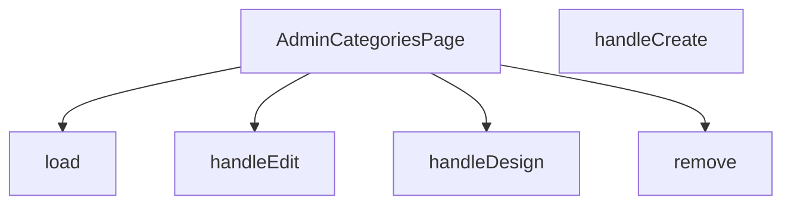

## Genel Bakış
Bu modül, VentHub HVAC yönetim panelinde kategori yönetimi için kullanılan ana React bileşenidir. Sistemdeki kategorilerin yüklenmesi, eklenmesi, düzenlenmesi, tasarım ayarlarının yapılması ve silinmesi gibi tüm CRUD işlemlerini tek bir arayüzden yönetir. Admin kullanıcıya kategoriler üzerinde tam kontrol sağlayan merkezi bir yönetim sayfası oluşturur.

## Fonksiyon Grupları
### Ana Sayfa Bileşeni
Modülün giriş noktası olarak tüm kategori yönetim arayüzünü ve işlevsel mantığı bir araya getiren ana bileşendir.
- AdminCategoriesPage

### Veri Yükleme ve Silme İşlemleri
Sunucuyla asenkron iletişim kurarak kategori verilerinin ilk yükleme ve kalıcı silme gibi temel veri işlemlerini yürütür.
- load, remove

### Kullanıcı Eylem İşleyicileri
Yönetici panelindeki etkileşimlere yanıt olarak yeni kategori oluşturma, mevcut kategoriyi düzenleme ve tasarım sayfasını açma gibi kullanıcı odaklı tüm eylemleri yönetir.
- handleCreate, handleEdit, handleDesign

---

## AXIOMS – Mimari Varsayımlar
Bu modül, bir kategori yönetim sayfası olarak temel veri modeli ve işlevsellik için aşağıdaki zorunlu koşulları gerektirir.

[Aksiyom 1]: Eğer `DbCategory` veri modeli (interface veya type) tanımlı veya içe aktarılmamışsa, `handleEdit` ve `handleDesign` fonksiyonları düzgün çalışamaz ve çağrıldığında zaman veya derleme hatası oluşur.
[Aksiyom 2]: Eğer kategori listesini yükleme mekanizması (örn. API isteği) çalışmıyorsa, `load` fonksiyonu çağrıldığında sayfa verileri boş kalır veya hata oluşur.
[Aksiyom 3]: Eğer `ColumnsMenu` veya `ExportMenu` bileşenleri içe aktarılmamışsa, modülün render fonksiyonunda bu bileşenleri kullanmaya çalıştığında derleme hatası oluşur.
[Aksiyom 4]: Eğer kullanıcı oturumu veya rol bilgisi (admin yetkisi) sağlanamıyorsa, sayfanın kendisi erişime kapatılmalı veya tüm CRUD işlemleri reddedilmelidir.
[Aksiyom 5]: Eğer `remove` fonksiyonu geçersiz (null, undefined veya boş string) bir `id` ile çağrılırsa, silme isteği sunucuya gönderilmez veya geçersiz veri hatası oluşur.

---

## FONKSİYON DETAYLARI

### AdminCategoriesPage
**Ne yapar**: VentHub HVAC projesinin yönetici panelinde kategori yönetimi işlemlerinin sunulduğu ana React bileşenidir. Tüm kategori ekleme, düzenleme, silme ve tasarım işlemlerinin barındığı tek sayfa arayüzünü oluşturur.
**Nasıl yapar**: Bileşen kendi içinde tanımlı olan tüm CRUD ve kullanıcı etkileşimi fonksiyonlarını entegre ederek çalışır. Sayfa ilk yüklendiğinde kategori verilerini çekmek için yerleşik yardımcı fonksiyonları tetikler, kullanıcı etkileşimlerini ilgili işleyicilere yönlendirerek React tabanlı sayfa içeriğini sürekli güncel tutar.
**Parametreler**: Bu bir React bileşeni olarak herhangi bir giriş parametresi almaz.
**Dönüş**: React.FC tipinde, yönetici kategoriler sayfasının tüm kullanıcı arayüzü öğelerini içeren React DOM ağacını döndürür.

### load
**Ne yapar**: Veritabanında kayıtlı tüm HVAC kategorilerini çekerek sayfa durumuna kaydetmekle görevli yardımcı fonksiyondur. Sayfa yüklendiğinde veya kategori listesinin yenilenmesi gerektiğinde tetiklenir.
**Nasıl yapar**: Backend API'sine istek göndererek tüm kategori kayıtlarını alır, elde edilen verileri yerel sayfa durumuna atayarak ekranda kategori listesinin güncel olarak görüntülenmesini sağlar. İşlem başarısız olursa hata yönetimi mantığını çalıştırarak kullanıcıya bildirim gösterebilir.
**Parametreler**: Herhangi bir giriş parametresi almaz.
**Dönüş**: Belirtilmemiş dönüş tipine sahiptir, void olarak çalışır; yalnızca sayfa durumunu günceller, herhangi bir değer döndürmez.

### handleCreate
**Ne yapar**: Yeni bir HVAC kategorisi oluşturma işlemini yöneten kullanıcı etkileşim işleyicisidir. Genellikle sayfadaki "Yeni Kategori Ekle" butonuna tıklandığında tetiklenir.
**Nasıl yapar**: Kullanıcıdan yeni kategori bilgilerini girmesi için bir form modalı açar, kullanıcının girdiği verileri backend API'sine göndererek yeni kategori kaydını oluşturur. İşlem başarılı olduğunda load fonksiyonunu çağırarak güncel kategori listesini sayfada yeniler.
**Parametreler**: Herhangi bir giriş parametresi almaz.
**Dönüş**: Belirtilmemiş dönüş tipine sahiptir, void olarak çalışır; yalnızca kullanıcı etkileşimini ve veri işlemlerini yönetir, herhangi bir değer döndürmez.

### handleEdit
**Ne yapar**: Mevcut bir HVAC kategorisinin bilgilerini düzenleme işlemini yöneten kullanıcı etkileşim işleyicisidir. İlgili kategoriye ait "Düzenle" butonuna tıklandığında tetiklenir.
**Nasıl yapar**: Parametre olarak aldığı mevcut kategori verisini düzenleme formuna doldurur, düzenleme işlemi için modal arayüzünü açar. Kullanıcının yaptığı değişiklikleri backend'e göndererek ilgili kategori kaydını günceller, işlem başarılı olursa kategori listesini yenilemek için load fonksiyonunu çağırır.
**Parametreler**:
- name: r, type: DbCategory — Düzenleme işlemi yapılacak mevcut kategori kaydının tüm verilerini içeren veritabanı nesnesi
**Dönüş**: Belirtilmemiş dönüş tipine sahiptir, void olarak çalışır; yalnızca düzenleme işlemini yönetir, herhangi bir değer döndürmez.

### handleDesign
**Ne yapar**: Mevcut bir HVAC kategorisine özel tasarım veya görünüm ayarlarını düzenleme işlemini yöneten kullanıcı etkileşim işleyicisidir. İlgili kategoriye ait "Tasarım" butonuna tıklandığında tetiklenir.
**Nasıl yapar**: Parametre olarak aldığı kategori verisini kullanarak tasarım düzenleme arayüzünü açar veya kullanıcıyı ilgili tasarım sayfasına yönlendirir. Kullanıcının yaptığı tasarım değişikliklerini kaydederek kategori için özel ayarları günceller, işlem sonrası sayfa durumunu güncel tutar.
**Parametreler**:
- name: r, type: DbCategory — Tasarım ayarları düzenlenecek kategori kaydının tüm verilerini içeren veritabanı nesnesi
**Dönüş**: Belirtilmemiş dönüş tipine sahiptir, void olarak çalışır; yalnızca tasarım düzenleme işlemini yönetir, herhangi bir değer döndürmez.

### remove
**Ne yapar**: Belirli bir HVAC kategorisini veritabanından silme işlemini yöneten kullanıcı etkileşim işleyicisidir. İlgili kategoriye ait "Sil" butonuna tıklandığında tetiklenir.
**Nasıl yapar**: Önce kullanıcıdan silme işlemini onaylamasını ister, onay alınması halinde silme isteğini ilgili backend API'sine gönderir. İşlem başarılı olduğunda load fonksiyonunu çağırarak silinen kategorinin kategori listesinden kaldırılmasını ve listenin güncel olarak kalmasını sağlar.
**Parametreler**:
- name: id, type: string — Silinecek kategori kaydının benzersiz tanımlayıcısı (ID'si)
**Dönüş**: Belirtilmemiş dönüş tipine sahiptir, void olarak çalışır; yalnızca silme işlemini yönetir, herhangi bir değer döndürmez.

---

## SABİTLER
- **ColumnsMenu** (call) — `lazy(() => import('../../components/admin/ColumnsMenu'))`
- **ExportMenu** (call) — `lazy(() => import('../../components/admin/ExportMenu'))`

---

## AST POINTERS

### [N1_NASIL] AST Pointer: AdminCategoriesPage.tsx::load
- **params**: (parametre yok)
- **ic_degiskenler**:
  - `data` — Supabase'den dönen kategori listesi verisi
  - `fetchErr` — Supabase sorgusu sırasında oluşan hata nesnesi
  - `e` — try-catch bloğunda yakalanan hata nesnesi
- **Dönüş**: yok (void)

### [N2_NASIL] AST Pointer: AdminCategoriesPage.tsx::handleCreate
- **params**: (parametre yok)
- **ic_degiskenler**: yok
- **Dönüş**: yok (void)

### [N3_NASIL] AST Pointer: AdminCategoriesPage.tsx::handleEdit
- **params**: (r: DbCategory)
- **ic_degiskenler**: yok
- **Dönüş**: yok (void)

### [N4_NASIL] AST Pointer: AdminCategoriesPage.tsx::handleDesign
- **params**: (r: DbCategory)
- **ic_degiskenler**: yok
- **Dönüş**: yok (void)

### [N5_NASIL] AST Pointer: AdminCategoriesPage.tsx::remove
- **params**: (id: string)
- **ic_degiskenler**:
  - `before` — Silinecek kategorinin mevcut durumu (DB'den önceki hali)
  - `delErr` — Supabase silme işleminde oluşan hata nesnesi
  - `e` — try-catch bloğunda yakalanan hata nesnesi
- **Dönüş**: yok (void)

---

## MERMAID CALL GRAPH

## NODE ID STANDARD

  file: src\views\admin\AdminCategoriesPage.tsx
  function: src\views\admin\AdminCategoriesPage.tsx::AdminCategoriesPage
  function: src\views\admin\AdminCategoriesPage.tsx::load
  function: src\views\admin\AdminCategoriesPage.tsx::handleCreate
  function: src\views\admin\AdminCategoriesPage.tsx::handleEdit
  function: src\views\admin\AdminCategoriesPage.tsx::handleDesign
  function: src\views\admin\AdminCategoriesPage.tsx::remove

---

## DISA AKTARILANLAR (EXPORTS)
  export: AdminCategoriesPage

---

## STİL TOKENLERİ

### Arbitrary Değerler (token'a geçirilmemiş)
Yok — tüm stiller token'a geçirilmiş. ✅

### Kullanılan Token'lar (zaten token'a geçirilmiş)
- `tracking-hvac-snug`

### Tailwind Sınıf Özeti
- **Renkler:** `bg-cyan-400`, `bg-indigo-500/10`, `bg-rose-500`, `bg-rose-500/10`, `bg-slate-700`, `bg-white/5`, `border-b`, `border-indigo-500/20`, `border-white/5`, `group-hover:border-cyan-400/30`, `group-hover:border-white/10`, `group-hover:text-cyan-400`, `group-hover:text-cyan-400/60`, `hover:bg-indigo-500`, `hover:bg-white/2`
- **Layout:** `custom-scrollbar`, `flex`, `flex-col`, `gap-1.5`, `gap-2`, `gap-4`, `h-1`, `h-1.5`, `h-12`, `h-full`, `h-px`, `inline-block`, `items-center`, `items-start`, `justify-between`
- **Varyant/Responsive:** `:`, `group-hover:`, `hover:`, `md:` önekleri
- **Yardımcı Sınıflar:** `${adminButtonPrimaryClass`, `${adminTableActionClass`, `${adminTableCellClass`, `${adminTableHeadCellClass`, `${cellPad`, `${headPad`, `${r.parent_id`, `:`, `border`, `divide-white/5`, `divide-y`, `duration-300`, `duration-500`, `duration-700`, `font-black`