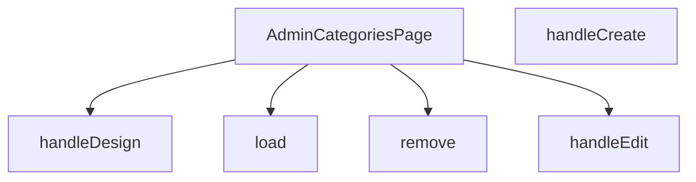

## Genel Bakış
Bu modül, VentHub HVAC yönetim platformunun yönetici panelinde yer alan kategori yönetim sayfasını oluşturan React bileşenidir. Sistemdeki kategorilerin yüklenmesi, oluşturulması, düzenlenmesi, tasarlanması ve silinmesi gibi tüm CRUD işlemlerini tek bir arayüz üzerinden yönetir. Admin kullanıcıların kategoriler üzerinde tam kontrole sahip olduğu merkezi bir yönetim noktasıdır.

## Fonksiyon Grupları
### Ana Sayfa Bileşeni
Modülün giriş noktası olarak tüm kategori yönetim arayüzünü ve bağlı işlevleri bir araya getirerek yönetici sayfasını oluşturur.
- AdminCategoriesPage

### Veri İşleme Fonksiyonları
Kategori verilerini sunucudan çekmek ve kalıcı olarak silmek gibi arka uçla entegre çalışan temel veri işlemlerini yürütür.
- load, remove

### Kullanıcı Eylem İşleyicileri
Yönetici kullanıcının arayüzdeki etkileşimlerine yanıt olarak yeni kategori oluşturma, mevcut kategoriyi düzenleme ve tasarım sayfasını açma gibi tüm kullanıcı odaklı eylemleri yönetir.
- handleCreate, handleEdit, handleDesign

---

## AXIOMS – Mimari Varsayımlar

Bu modül, admin panelinde kategori yönetim sayfasını temsil eden bir React bileşenidir. Aşağıda, bileşenin doğru çalışması için gereken mimari varsayımlar listelenmektedir.

Bu modül için belirli bir eşik değeri veya kabul kriteri belirtilmemiştir. Varsayımlar, fonksiyon imzaları ve modülün genel yapısına dayanmaktadır.

[Aksiyom 1]: Eğer `DbCategory` tipi veya bu tipe karşılık gelen bir veri yapısı (örneğin, `id`, `name`, `description` gibi alanları içeren bir nesne) yoksa, `handleEdit` ve `handleDesign` fonksiyonları doğru çalışamaz.

[Aksiyom 2]: Eğer `remove(id: string)` fonksiyonu çağrılmadan önce ilgili kategorinin `id` değerine sahip olduğu doğrulanmamışsa, beklenmeyen bir kategori silinmesine veya hata fırlatılmasına yol açabilir.

[Aksiyom 3]: Eğer `ColumnsMenu` veya `ExportMenu` modül sabitleri (muhtemelen bileşenler) doğru bir şekilde içe aktarılmamışsa veya çağrılamıyorsa, sayfa düzgün render edilemez veya menü işlevleri çalışmaz.

[Aksiyom 4]: Eğer `load()` fonksiyonu bileşen mount edildiğinde veya veriye ihtiyaç duyulduğunda çağrılmazsa, kategoriler listesi boş veya güncel olmayabilir.

[Aksiyom 5]: Eğer `handleCreate` fonksiyonu, yeni bir kategori oluşturmak için gerekli parametreleri (örneğin, kullanıcıdan alınan veri) alamıyorsa, yeni kategori eklenemez.

[Aksiyom 6]: Eğer `AdminCategoriesPage` bileşeni, yönetici panelinde yetkilendirilmiş bir kullanıcı tarafından erişilemez bir rotada render edilirse, bileşen görünmeyebilir veya hata verebilir (bu, rotalama veya yetkilendirme katmanına bağlıdır).

[Aksiyom 7]: Eğer `remove` fonksiyonu, silme işlemini sunucuya iletmeden önce bir onay mekanizması (örneğin, bir modal) içermiyorsa, yanlışlıkla silme riski vardır.

[Aksiyom 8]: Eğer `handleEdit` ve `handleDesign` fonksiyonları, ilgili kategorinin mevcut verilerini (örneğin, `DbCategory` nesnesini) parametre olarak alamıyorsa, düzenleme veya tasarım sayfası doğru verilerle doldurulamaz.

[Aksiyom 9]: Eğer `load` fonksiyonu, kategorileri yüklerken bir hata oluşursa (örneğin, ağ hatası), bileşen hata durumunu göstermeli veya kullanıcıyı bilgilendirmelidir; aksi takdirde kullanıcı veri eksikliğiyle karşılaşabilir.

[Aksiyom 10]: Eğer `AdminCategoriesPage` bileşeni, alt bileşenlere (örneğin

---

## FONKSİYON DETAYLARI

### AdminCategoriesPage
**Ne yapar**: VentHub HVAC projesinin yönetici panelinde kategori yönetimi işlemlerinin sunulduğu ana React bileşenidir. Tüm kategori ekleme, düzenleme, silme ve tasarım işlemlerinin barındığı tek sayfa arayüzünü oluşturur.
**Nasıl yapar**: Bileşen kendi içinde tanımlı olan tüm CRUD ve kullanıcı etkileşimi fonksiyonlarını entegre ederek çalışır. Sayfa ilk yüklendiğinde kategori verilerini çekmek için yerleşik yardımcı fonksiyonları tetikler, kullanıcı etkileşimlerini ilgili işleyicilere yönlendirerek React tabanlı sayfa içeriğini sürekli güncel tutar.
**Parametreler**: Bu bir React bileşeni olarak herhangi bir giriş parametresi almaz.
**Dönüş**: React.FC tipinde, yönetici kategoriler sayfasının tüm kullanıcı arayüzü öğelerini içeren React DOM ağacını döndürür.

### load
**Ne yapar**: Veritabanında kayıtlı tüm HVAC kategorilerini çekerek sayfa durumuna kaydetmekle görevli yardımcı fonksiyondur. Sayfa yüklendiğinde veya kategori listesinin yenilenmesi gerektiğinde tetiklenir.
**Nasıl yapar**: Backend API'sine istek göndererek tüm kategori kayıtlarını alır, elde edilen verileri yerel sayfa durumuna atayarak ekranda kategori listesinin güncel olarak görüntülenmesini sağlar. İşlem başarısız olursa hata yönetimi mantığını çalıştırarak kullanıcıya bildirim gösterebilir.
**Parametreler**: Herhangi bir giriş parametresi almaz.
**Dönüş**: Belirtilmemiş dönüş tipine sahiptir, void olarak çalışır; yalnızca sayfa durumunu günceller, herhangi bir değer döndürmez.

### handleCreate
**Ne yapar**: Yeni bir HVAC kategorisi oluşturma işlemini yöneten kullanıcı etkileşim işleyicisidir. Genellikle sayfadaki "Yeni Kategori Ekle" butonuna tıklandığında tetiklenir.
**Nasıl yapar**: Kullanıcıdan yeni kategori bilgilerini girmesi için bir form modalı açar, kullanıcının girdiği verileri backend API'sine göndererek yeni kategori kaydını oluşturur. İşlem başarılı olduğunda load fonksiyonunu çağırarak güncel kategori listesini sayfada yeniler.
**Parametreler**: Herhangi bir giriş parametresi almaz.
**Dönüş**: Belirtilmemiş dönüş tipine sahiptir, void olarak çalışır; yalnızca kullanıcı etkileşimini ve veri işlemlerini yönetir, herhangi bir değer döndürmez.

### handleEdit
**Ne yapar**: Mevcut bir HVAC kategorisinin bilgilerini düzenleme işlemini yöneten kullanıcı etkileşim işleyicisidir. İlgili kategoriye ait "Düzenle" butonuna tıklandığında tetiklenir.
**Nasıl yapar**: Parametre olarak aldığı mevcut kategori verisini düzenleme formuna doldurur, düzenleme işlemi için modal arayüzünü açar. Kullanıcının yaptığı değişiklikleri backend'e göndererek ilgili kategori kaydını günceller, işlem başarılı olursa kategori listesini yenilemek için load fonksiyonunu çağırır.
**Parametreler**:
- name: r, type: DbCategory — Düzenleme işlemi yapılacak mevcut kategori kaydının tüm verilerini içeren veritabanı nesnesi
**Dönüş**: Belirtilmemiş dönüş tipine sahiptir, void olarak çalışır; yalnızca düzenleme işlemini yönetir, herhangi bir değer döndürmez.

### handleDesign
**Ne yapar**: Mevcut bir HVAC kategorisine özel tasarım veya görünüm ayarlarını düzenleme işlemini yöneten kullanıcı etkileşim işleyicisidir. İlgili kategoriye ait "Tasarım" butonuna tıklandığında tetiklenir.
**Nasıl yapar**: Parametre olarak aldığı kategori verisini kullanarak tasarım düzenleme arayüzünü açar veya kullanıcıyı ilgili tasarım sayfasına yönlendirir. Kullanıcının yaptığı tasarım değişikliklerini kaydederek kategori için özel ayarları günceller, işlem sonrası sayfa durumunu güncel tutar.
**Parametreler**:
- name: r, type: DbCategory — Tasarım ayarları düzenlenecek kategori kaydının tüm verilerini içeren veritabanı nesnesi
**Dönüş**: Belirtilmemiş dönüş tipine sahiptir, void olarak çalışır; yalnızca tasarım düzenleme işlemini yönetir, herhangi bir değer döndürmez.

### remove
**Ne yapar**: Belirli bir HVAC kategorisini veritabanından silme işlemini yöneten kullanıcı etkileşim işleyicisidir. İlgili kategoriye ait "Sil" butonuna tıklandığında tetiklenir.
**Nasıl yapar**: Önce kullanıcıdan silme işlemini onaylamasını ister, onay alınması halinde silme isteğini ilgili backend API'sine gönderir. İşlem başarılı olduğunda load fonksiyonunu çağırarak silinen kategorinin kategori listesinden kaldırılmasını ve listenin güncel olarak kalmasını sağlar.
**Parametreler**:
- name: id, type: string — Silinecek kategori kaydının benzersiz tanımlayıcısı (ID'si)
**Dönüş**: Belirtilmemiş dönüş tipine sahiptir, void olarak çalışır; yalnızca silme işlemini yönetir, herhangi bir değer döndürmez.

---

## SABİTLER
- **ColumnsMenu** (call) — `lazy(() => import('../../components/admin/ColumnsMenu'))`
- **ExportMenu** (call) — `lazy(() => import('../../components/admin/ExportMenu'))`

---

## AST POINTERS

### [N1_NASIL] AST Pointer: AdminCategoriesPage.tsx::AdminCategoriesPage
- **params**: (parametre yok)
- **ic_degiskenler**: Fonksiyon govdesi dogrudan saglanmamis; iceride tanimlanan state'ler (useState): `loading`, `error`, `rows`, `editingId`, `isModalOpen`, `visibleCols`, `density` — bileşen durum yonetimi icin kullanilir
- **Dönüş**: React.FC (JSX render)

---

### [N2_NASIL] AST Pointer: AdminCategoriesPage.tsx::load
- **params**: (parametre yok)
- **ic_degiskenler**:
  - `fetchErr` — supabase `select()` sorgusundan donen hata nesnesi; varsa `throw` ile yakalanir
  - `data` — supabase'den gelen kategori satirlarinin ham dizisi; `DbCategory[]` tipine cast edilerek `setRows` ile state'e yazilir
  - `e` — try-catch yakalanan hata nesnesi; `.message` ozelligi `setError` ile hata mesaji olarak kaydedilir
- **Dönüş**: yok (async); `setLoading`, `setError`, `setRows` ile state gunceller

---

### [N3_NASIL] AST Pointer: AdminCategoriesPage.tsx::handleCreate
- **params**: (parametre yok)
- **ic_degiskenler**: (yok)
- **Dönüş**: yok; `setEditingId(null)` ile duzenleme kimligini sifirlar, `setIsModalOpen(true)` ile olusturma modalini acar

---

### [N4_NASIL] AST Pointer: AdminCategoriesPage.tsx::handleEdit
- **params**: `r: DbCategory` — duzenlenecek kategori nesnesi; iceriden `r.id` erisilerek `editingId` state'i guncellenir
- **ic_degiskenler**: (yok)
- **Dönüş**: yok; `setEditingId(r.id)` ile secilen kategorinin ID'sini kaydeder, `setIsModalOpen(true)` ile duzenleme modalini acar

---

### [N5_NASIL] AST Pointer: AdminCategoriesPage.tsx::handleDesign
- **params**: `r: DbCategory` — tasarlanacak kategori nesnesi; `r.id` kullanilarak rota olusturulur
- **ic_degiskenler**: (yok)
- **Dönüş**: yok; `router.push()` ile `/admin/categories/${r.id}/builder` rotasina yonlendirme yapar

---

### [N6_NASIL] AST Pointer: AdminCategoriesPage.tsx::remove
- **params**: `id: string` — silinecek kategorinin benzersiz kimligi
- **ic_degiskenler**:
  - `before` — silinmeden onceki kategori verisi; `rows.find(r => r.id === id)` ile mevcut satirlardan id eslesmesiyle bulunur, bulunamazsa `null` olur; audit log'a onceki deger olarak yazilir
  - `delErr` — supabase `delete()` isleminden donen hata nesnesi; varsa `throw` ile yakalanir
  - `e` — try-catch yakalanan hata nesnesi; `alert` ile kullaniciya hata mesaji gosterilir
- **Dönüş**: yok (async); `confirm` ile onay alir, `supabase.from('categories').delete().eq('id', id)` ile silme islemi yapar, `logAdminAction` ile audit log kaydeder, `load()` ile listeyi yeniler

---

### [N7_NASIL] AST Pointer: AdminCategoriesPage.tsx::(unnamed — localStorage sutun yukleyici useEffect)
- **params**: (parametre yok)
- **ic_degiskenler**:
  - `c` — `localStorage.getItem()` ile okunan sutun gorunurluk ayarlari JSON stringi; parse edilip `setVisibleCols` ile state'e birlestirilir
  - `d` — `localStorage.getItem()` ile okunan yogunluk (density) ayari stringi; `"compact"` veya `"comfortable"` degeri ise `setDensity` ile state'e yazilir
- **Dönüş**: yok; `window` kontrolu ile sunucu tarafinda calismayi engeller, try-catch ile localStorage hatalarini yutar

---

### [N8_NASIL] AST Pointer: AdminCategoriesPage.tsx::(unnamed — localStorage sutun kaydedici useEffect)
- **params**: (parametre yok)
- **ic_degiskenler**: (yok — `visibleCols` state'i kapsamdan okunur)
- **Dönüş**: yok; `visibleCols` degerini `JSON.stringify` ile serialized olarak `localStorage.setItem` ile kaydeder

---

### [N9_NASIL] AST Pointer: AdminCategoriesPage.tsx::(unnamed — localStorage yogunluk kaydedici useEffect)
- **params**: (parametre yok)
- **ic_degiskenler**: (yok — `density` state'i kapsamdan okunur)
- **Dönüş**: yok; `density` degerini dogrudan `localStorage.setItem` ile kaydeder

---

### [N10_NASIL] AST Pointer: AdminCategoriesPage.tsx::(unnamed — CSV disa aktarim handler'i)
- **params**: (parametre yok)
- **ic_degiskenler**:
  - `cols` — disa aktarilacak sutun adlarinin dizisi: `['id', 'name', 'sort_order', 'slug', 'parent_id', 'description']`
  - `header` — sutun adlarinin virgülle birlestirilmis CSV baslik satiri
  - `lines` — `filtered` dizisi uzerinden `.map()` ile her kategori satirinin CSV formatina donusturulmus hali; `r.name.replace(/"/g, '""')` ile tirnak isaretleri escape edilir, `r.sort_order || 0` ile bos deger varsayilir
  - `csv` — BOM karakteri (`\ufeff`) + baslik + satirlarin `\n` ile birlestirilmis tam CSV icerigi
  - `blob` — CSV metninden olusturulan `Blob` nesnesi; MIME tipi `text/csv;charset=utf-8`
  - `url` — `URL.createObjectURL(blob)` ile olusturulan gecici dosya URL'i
  - `a` — `document.createElement('a')` ile olusturulan gecici anchor elementi; `href`, `download` ozellikleri ayarlanip `click()` ile indirme tetiklenir, sonra `URL.revokeObjectURL` ile URL serbest birakilir
- **Dönüş**: yok (dosya indirme yan etkisi)

---

### [N11_NASIL] AST Pointer: AdminCategoriesPage.tsx::(unnamed — tablo satir renderer'i)
- **params**: `r: DbCategory` — render edilecek kategori satiri verisi
- **ic_degiskenler**: (yerel degisken yok; kapsamdan erisilenler: `visibleCols`, `adminTableCellClass`, `cellPad`, `process.env.NEXT_PUBLIC_SUPABASE_URL`, `hasWriteAccess`, `categoryMap`, `adminTableActionClass`, `adminTableActionDangerClass`, `t`, `supabase`, `setRows`, `toast`, `load`, `handleDesign`, `handleEdit`, `remove`)
- **Dönüş**: JSX `<tr>` elementi; gorunurluk ayarlarina gore `visibleCols.image`, `visibleCols.name`, `visibleCols.sortOrder`, `visibleCols.slug`, `visibleCols.parent`, `visibleCols.description`, `visibleCols.actions` kosullariyla sutunlari sartli olarak render eder

---

### [N12_NASIL] AST Pointer: AdminCategoriesPage.tsx::(unnamed — kategori adi inline guncelleme handler'i)
- **params**: `val` — duzeltilmis yeni kategori adi degeri (string)
- **ic_degiskenler**:
  - `upErr` — `supabase.from('categories').update({ name: val }).eq('id', r.id)` sorgusundan donen hata nesnesi; varsa `throw` ile yakalanir
- **Dönüş**: yok (async); `val` bos veya eski degerle ayni ise erken donus; aksi halde supabase update ile veritabanini gunceller, `setRows` ile yerel state'i gunceller, `toast.success` ile bildirim gosterir

---

### [N13_NASIL] AST Pointer: AdminCategoriesPage.tsx::(unnamed — siralama sirasi inline guncelleme handler'i)
- **params**: `val` — girilen yeni siralama degeri (string olarak girilir, parseInt ile cevrilir)
- **ic_degiskenler**:
  - `num` — `parseInt(val || '0', 10)` ile string degerin donusturulmus sayisal hali; `isNaN` kontrolu ile gecersiz giris onlenir
  - `upErr` — `supabase.from('categories').update({ sort_order: num }).eq('id', r.id)` sorgusundan donen hata nesnesi; varsa `throw` ile yakalanir
- **Dönüş**: yok (async); `num` NaN veya eski degerle ayni ise erken donus; aksi halde supabase update ile veritabanini gunceller, `setRows` ile yerel state'i gunceller, `toast.success` ile bildirim gosterir, `load()` ile listeyi yeniler

---

## MERMAID CALL GRAPH

## NODE ID STANDARD

  file: src\views\admin\AdminCategoriesPage.tsx
  function: src\views\admin\AdminCategoriesPage.tsx::AdminCategoriesPage
  function: src\views\admin\AdminCategoriesPage.tsx::load
  function: src\views\admin\AdminCategoriesPage.tsx::handleCreate
  function: src\views\admin\AdminCategoriesPage.tsx::handleEdit
  function: src\views\admin\AdminCategoriesPage.tsx::handleDesign
  function: src\views\admin\AdminCategoriesPage.tsx::remove

---

## DISA AKTARILANLAR (EXPORTS)
  export: AdminCategoriesPage

---

## STİL TOKENLERİ

### Arbitrary Değerler (token'a geçirilmemiş)
Yok — tüm stiller token'a geçirilmiş. ✅

### Kullanılan Token'lar (zaten token'a geçirilmiş)
- `tracking-hvac-snug`

### Tailwind Sınıf Özeti
- **Renkler:** `bg-cyan-400`, `bg-indigo-500/10`, `bg-rose-500`, `bg-rose-500/10`, `bg-slate-700`, `bg-white/5`, `border-b`, `border-indigo-500/20`, `border-white/5`, `group-hover:border-cyan-400/30`, `group-hover:border-white/10`, `group-hover:text-cyan-400`, `group-hover:text-cyan-400/60`, `hover:bg-indigo-500`, `hover:bg-white/2`
- **Layout:** `custom-scrollbar`, `flex`, `flex-col`, `gap-1.5`, `gap-2`, `gap-4`, `h-1`, `h-1.5`, `h-12`, `h-full`, `h-px`, `inline-block`, `items-center`, `items-start`, `justify-between`
- **Varyant/Responsive:** `:`, `group-hover:`, `hover:`, `md:` önekleri
- **Yardımcı Sınıflar:** `${adminButtonPrimaryClass`, `${adminTableActionClass`, `${adminTableCellClass`, `${adminTableHeadCellClass`, `${cellPad`, `${headPad`, `${r.parent_id`, `:`, `border`, `divide-white/5`, `divide-y`, `duration-300`, `duration-500`, `duration-700`, `font-black`