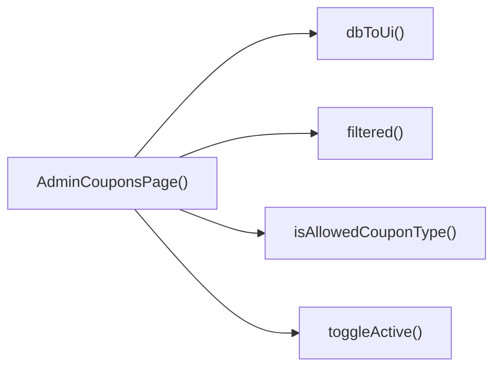

## Genel Bakış
Bu modül, VentHub HVAC platformunun yönetici panelinde kupon yönetimi işlemlerini sunan React tabanlı bir ön yüz sayfasıdır. Yöneticilerin kuponları görüntülemesi, düzenlemesi, kaydetmesi ve durumlarını yönetmesi için gerekli tüm işlevleri tek bir modülde toplar.

## Fonksiyon Grupları
### Ana Sayfa Bileşeni
Yönetici kuponları sayfasını oluşturan ana React bileşenidir, tüm alt işlevleri bir araya getirerek kullanıcı arayüzünü sunar.
- AdminCouponsPage

### Veri Doğrulama ve Dönüşüm
Veritabanından gelen ham kupon verilerini arayüzün kullanabileceği formata dönüştürmek ve geçerli kupon tiplerini doğrulamakla sorumludur.
- isAllowedCouponType, dbToUi

### Kupon İşlem Yönetimi
Kuponların filtrelenmesi, kaydedilmesi ve aktiflik durumlarının değiştirilmesi gibi tüm kullanıcı odaklı işlemleri gerçekleştiren işlevleri barındırır.
- filtered, saveCoupon, toggleActive

---

## AXIOMS – Mimari Varsayımlar
Bu modül, admin yetkisine sahip kullanıcılar için kupon oluşturma, listeleme, durum güncelleme ve kaydetme işlemlerini sunar, tüm işlevlerinin sorunsuz çalışması için kullanıcı yetkilendirmesi, veritabanı erişimi ve tip doğrulama mekanizmalarının kesintisiz çalışması zorunludur.

[Aksiyom 1]: Eğer kupon tiplerinin geçerliliğini doğrulayan isAllowedCouponType işlevi çalışmıyorsa, sistemde geçersiz tiplerde kuponlar kaydedilebilir veya mevcut kuponlar listelenirken hatalar oluşur.
[Aksiyom 2]: Eğer veritabanı kupon kayıtlarını (DbCouponRow) UI formatına dönüştüren dbToUi işlevi çalışmıyorsa, admin panelinde kuponlar doğru şekilde görüntülenemez, tüm listeleme işlemleri başarısız olur.
[Aksiyom 3]: Eğer AdminCouponsPage ana bileşeni sadece yetkili admin kullanıcılarına erişim izni vermiyorsa, yetkisiz kişiler kupon yönetimi işlemlerini gerçekleştirebilir, veri güvenliği ihlal edilir.
[Aksiyom 4]: Eğer kayıtlı kuponları filtreleyen filtered() işlevi tüm veritabanı kupon kayıtlarına erişemiyorsa, admin kullanıcıları aradıkları kuponlara ulaşamaz, hatalı filtrelenmiş listelerle karşılaşır.
[Aksiyom 5]: Eğer yeni veya düzenlenmiş kupon verilerini kalıcı olarak kaydeden saveCoupon() işlevi veritabanı yazma iznine sahip değilse, kupon oluşturma ve güncelleme işlemleri tamamlanamaz.
[Aksiyom 6]: Eğer kuponların aktiflik durumunu değiştiren toggleActive(id: string, active: boolean) işlevi tarafından gönderilen kimlik ve durum verileri veritabanı tarafından doğru işlenemiyorsa, kuponların aktif/pasif durumu yönetilemez.

---

## FONKSIYON DETAYLARI

### isAllowedCouponType
**Ne yapar**: Girilen bilinmeyen türdeki değerin geçerli kupon tiplerinden olup olmadığını kontrol eden tip koruma fonksiyonudur. Sadece ön tanımlı iki izinli kupon tipinin sistemde kullanılmasına izin vererek veri tutarlılığını korur.
**Nasıl yapar**: Gelen bilinmeyen değeri doğrudan 'percent' ve 'fixed' string değerleriyle eşleştirerek kontrol sağlar. TypeScript'te tip daraltma işlemi yaparak, sonrasında ilgili değerin güvenli şekilde string olarak kullanılmasını sağlar.
**Parametreler**:
- name: x, type: unknown — Geçerliliği kontrol edilecek bilinmeyen türdeki giriş değeri
**Dönüş**: boolean — Giren değer 'percent' veya 'fixed' ise true, aksi takdirde false döndürür

### dbToUi
**Ne yapar**: Veritabanından çekilen ham kupon kaydını, kullanıcı arayüzünde kullanılabilecek formata dönüştüren veri dönüşüm fonksiyonudur. Veritabanı ve arayüz arasındaki veri formatı farklarını ortadan kaldırarak uyum sağlar.
**Nasıl yapar**: DbCouponRow tipinde almış olduğu veritabanı kaydını, arayüzün ihtiyaç duyduğu alanlara ve tiplere uyumlu olacak şekilde yeniden yapılandırır, tüm zorunlu alanları arayüz standardına göre düzenler.
**Parametreler**:
- name: row, type: DbCouponRow — Veritabanından çekilen ham yapıdaki kupon kaydı
**Dönüş**: CouponRow — Arayüzde kullanıma uygun formatlanmış, yapılandırılmış kupon kaydı

### AdminCouponsPage
**Ne yapar**: Yönetici panelinin kupon yönetimi sayfasını oluşturan ana React bileşenidir. Tüm kupon yönetimi işlemlerinin tek merkezde toplandığı, yöneticiye tüm kupon işlemlerini yapma imkanı sunan sayfayı render eder.
**Nasıl yapar**: Sayfa içerisinde kupon listeleme, arama ile filtreleme, yeni kupon oluşturma, mevcut kuponları düzenleme, aktiflik durumlarını değiştirme gibi tüm iş mantığını barındırır, ilgili alt bileşenleri ve işlemleri koordine ederek arayüzü oluşturur.
**Parametreler**: Herhangi bir giriş parametresi almaz, standart React sayfa bileşeni olarak çağrılır.
**Dönüş**: React.FC — React tarafından işlenebilen, tüm kupon yönetimi arayüzünü içeren fonksiyonel bileşen

### filtered
**Ne yapar**: Mevcut tüm kupon listesini girilen arama metnine göre filtreleyen, arama sonuçlarını döndüren fonksiyondur. Yöneticinin kupon listesi içinde kolayca arama yapmasını sağlar.
**Nasıl yapar**: Kapsamı içinde eriştiği tüm kupon satırları üzerinde dolaşır, her bir kuponun kodunu ve tipini küçük harfe çevirir. Gelen arama metninin de küçük harfli halini içeren kayıtları seçerek filtrelenmiş listeyi oluşturur.
**Parametreler**:
- name: rows, type: DbCouponRow[] — Filtreleme işlemine tabi tutulacak tüm kupon kayıtlarını içeren ana liste, fonksiyonun kapsamı içinde erişildiği tanımlanmıştır
- name: s, type: string — Filtreleme için kullanılan arama metni, fonksiyonun kapsamı içinde erişildiği tanımlanmıştır
**Dönüş**: DbCouponRow[] — Arama kriterlerine uyan tüm kupon kayıtlarını içeren filtrelenmiş liste

### saveCoupon
**Ne yapar**: Oluşturulan veya düzenlenen kupon kaydını kalıcı olarak kaydetme işlemini gerçekleştiren fonksiyondur. Yeni kupon ekleme veya mevcut kuponu güncelleme işlemlerinin son adımını yönetir.
**Nasıl yapar**: Düzenlenen veya oluşturulan kupon verilerini alarak gerekli doğrulama kontrollerini yapar, ardından ilgili servis çağrılarıyla veriyi kalıcı depolama alanına kaydeder. İşlem sırasında oluşabilecek hata ve başarı durumlarını yönetir.
**Parametreler**: Resmi olarak tanımlanmış herhangi bir giriş parametresi belirtilmemiştir.
**Dönüş**: Dönüş tipi resmi olarak tanımlanmamıştır, muhtemelen void türündedir.

### toggleActive
**Ne yapar**: Belirli bir kuponun aktiflik durumunu değiştiren, kuponun sistemde kullanılıp kullanılamayacağını yöneten fonksiyondur. Yöneticinin tek tıkla kuponları aktif veya pasif hale getirmesini sağlar.
**Nasıl yapar**: İlgili kuponun benzersiz kimliğini ve ayarlanacak yeni aktiflik durumunu alır, bu durumu veritabanında günceller. Ardından arayüzdeki kupon listesini de yeni duruma göre güncelleyerek görüntünün tutarlı kalmasını sağlar.
**Parametreler**:
- name: id, type: string — Aktiflik durumu değiştirilecek kuponun benzersiz kimlik numarası
- name: active, type: boolean — Kuponun ayarlanacak yeni aktiflik durumu, true ise aktif, false ise pasif duruma getirilir
**Dönüş**: Dönüş tipi resmi olarak tanımlanmamıştır, muhtemelen void türündedir.

---

## INTERFACES

### CouponRow
- `id: string`
- `code: string`
- `type: 'percent' | 'fixed' | string`
- `value: number`
- `starts_at?: string | null`
- `ends_at?: string | null`
- `active: boolean`
- `usage_limit?: number | null`
- `used_count?: number | null`
- `created_at: string`

---

## TYPE ALIASES

### AllowedCouponType
```typescript
type AllowedCouponType = 'percent' | 'fixed'
```

### DbCouponRow
```typescript
type DbCouponRow = {
  id: string
  code: string
  discount_type: 'percentage' | 'fixed_amount' | string
  discount_value: number
  valid_from?: string | null
  valid_until?: string | null
  is_active: boolean
 
```

---

## AST POINTERS

### [N1_NASIL] AST Pointer: src/views/admin/AdminCouponsPage.tsx::isAllowedCouponType
- **params**: (x: unknown)
- **ic_degiskenler**:
  - `x` — Giriş değeri, izin verilen kupon türleri ('percent', 'fixed') ile kıyaslanarak tür doğrulaması yapılır
- **Dönüş**: x is AllowedCouponType (tip predicate, boolean)

### [N2_NASIL] AST Pointer: src/views/admin/AdminCouponsPage.tsx::dbToUi
- **params**: (row: DbCouponRow)
- **ic_degiskenler**:
  - `row.id` — Veritabanından gelen kupon satırının benzersiz kimliği, UI nesnesinin id alanına aktarılır
  - `row.code` — Veritabanından gelen kupon kodu, UI nesnesinin code alanına aktarılır
  - `row.discount_type` — Veritabanındaki indirim türü, UI'daki 'percent'/'fixed' formatına dönüştürülerek type alanına atanır
  - `row.discount_value` — Veritabanındaki indirim değeri, sayıya dönüştürülerek UI nesnesinin value alanına atanır
  - `row.valid_from` — Kuponun geçerlilik başlangıç tarihi, null durumu yönetilerek UI starts_at alanına aktarılır
  - `row.valid_until` — Kuponun geçerlilik bitiş tarihi, null durumu yönetilerek UI ends_at alanına aktarılır
  - `row.is_active` — Kuponun aktiflik durumu, boolean'a dönüştürülerek UI active alanına aktarılır
  - `row.usage_limit` — Kuponun kullanım limiti, null durumu yönetilerek UI usage_limit alanına aktarılır
  - `row.used_count` — Kuponun kullanım sayısı, varsayılan 0 atanarak UI used_count alanına aktarılır
  - `row.created_at` — Kuponun oluşturulma tarihi, UI nesnesinin created_at alanına aktarılır
- **Dönüş**: CouponRow (UI formatında kupon nesnesi)

### [N3_NASIL] AST Pointer: src/views/admin/AdminCouponsPage.tsx::anonymous_fetch_coupons
- **params**: (parametre yok)
- **ic_degiskenler**:
  - `setLoading` — Yükleme durumunu yöneten state setter, işlem başlangıcında true, sonunda false yapılır
  - `ensureSessionFresh` — Oturumun geçerliliğini kontrol eden asenkron fonksiyon, işlem başında çağrılır
  - `supabase.from('coupons').select` — Supabase'den kupon verilerini çeken sorgu, 200 adetle sınırlı, oluşturulma tarihine göre sıralı
  - `data` — Sorgudan dönen kupon verileri listesi
  - `error` — Sorgu sırasında oluşan hata nesnesi
  - `mapped` — dbToUi ile UI formatına dönüştürülmüş tüm kuponlar listesi
  - `setRows` — Kupon listesi state'ini güncelleyen setter, dönüştürülmüş verileri state'e atar
  - `console.error` — Hata durumunda konsola log yazan fonksiyon
- **Dönüş**: yok

### [N4_NASIL] AST Pointer: src/views/admin/AdminCouponsPage.tsx::filtered
- **params**: (parametre yok)
- **ic_degiskenler**:
  - `q` — Arama sorgusu metni, boşlukları temizlenerek filtreleme işlemi için kullanılır
  - `rows` — Tüm mevcut kupon satırları, filtrelenerek döndürülür
  - `s` — Küçük harfe çevrilmiş normalize edilmiş arama sorgusu, kıyaslamalarda kullanılır
  - `r` — Filtreleme sırasında işlenen tek bir kupon satırı
- **Dönüş**: CouponRow[] (arama sorgusuyla eşleşen filtrelenmiş kupon listesi)

### [N5_NASIL] AST Pointer: src/views/admin/AdminCouponsPage.tsx::saveCoupon
- **params**: (parametre yok)
- **ic_degiskenler**:
  - `form.code` — Formda girilen kupon kodu, trimlenerek doğrulanır
  - `form.type` — Formda seçilen indirim türü, izin verilen türler arasında mı diye kontrol edilir
  - `form.value` — Formda girilen indirim değeri, sayıya dönüştürülerek doğrulanır
  - `codeTrim` — Trimlenmiş geçerli kupon kodu, tüm sonraki işlemlerde kullanılır
  - `issues` — Doğrulama sırasında oluşan hata mesajları listesi, doluysa işlem durdurulur
  - `val` — Sayıya dönüştürülmüş geçerli indirim değeri, doğrulama ve payload oluşturulmasında kullanılır
  - `toast.error` — Hata bildirimi gösteren fonksiyon, doğrulama hatalarını kullanıcıya iletir
  - `setSaving` — Kayıt durumunu yöneten state setter, işlem başında true, sonunda false yapılır
  - `payload` — Supabase edge function'a gönderilecek kupon verisi, form değerlerinden oluşturulur
  - `form.starts_at` — Formda girilen kupon geçerlilik başlangıç tarihi, payload'a aktarılır
  - `form.ends_at` — Formda girilen kupon geçerlilik bitiş tarihi, payload'a aktarılır
  - `form.active` — Formda işaretlenen kupon aktiflik durumu, payload'a aktarılır
  - `form.usage_limit` — Formda girilen kupon kullanım limiti, payload'a aktarılır
  - `supabase.functions.invoke` — 'admin-create-coupon' Supabase edge function'ını tetikleyen çağrı
  - `response` — Edge function'dan dönen tam cevap nesnesi
  - `data` — Edge function'dan dönen veritabanı formatında yeni kupon nesnesi
  - `error` — Edge function çağrısı sırasında oluşan hata nesnesi
  - `ui` — dbToUi ile UI formatına dönüştürülmüş yeni kupon nesnesi
  - `setRows` — Kupon listesi state'ini güncelleyen setter, yeni kuponu listenin başına ekler
  - `setForm` — Form state'ini sıfırlayan setter, varsayılan değerlere döndürür
  - `toast.success` — Başarı bildirimi gösteren fonksiyon, kupon eklendiğinde kullanıcıya iletilir
  - `console.error` — İşlem sırasında oluşan hataları konsola loglayan fonksiyon
- **Dönüş**: yok

### [N6_NASIL] AST Pointer: src/views/admin/AdminCouponsPage.tsx::toggleActive
- **params**: (id: string, active: boolean)
- **ic_degiskenler**:
  - `id` — Durumu değiştirilecek kuponun benzersiz kimliği
  - `active` — Kuponun mevcut aktiflik durumu, tersine çevrilerek güncellenir
  - `supabase.from('coupons').update` — Supabase'de ilgili kuponun is_active değerini güncelleyen sorgu
  - `data` — Sorgudan dönen, kuponun id ve güncel is_active değerini içeren nesne
  - `error` — Sorgu sırasında oluşan hata nesnesi
  - `setRows` — Kupon listesi state'ini güncelleyen setter, ilgili kuponun aktiflik durumunu değiştirir
  - `r` — State güncellemesi sırasında işlenen tek kupon satırı
  - `toast.success` — Başarı bildirimi, durum değişikliği kullanıcıya iletilir
  - `toast.error` — Hata bildirimi, durum değiştirilemezse gösterilir
  - `console.error` — Hata durumunda konsola log yazan fonksiyon
- **Dönüş**: yok

### [N7_NASIL] AST Pointer: src/views/admin/AdminCouponsPage.tsx::anonymous_usage_limit_form_setter
- **params**: (e: InputChangeEvent)
- **ic_degiskenler**:
  - `e.target.value` — Kullanım limiti inputundan girilen değer, sayıya dönüştürülür
  - `raw` — Input değerinin sayıya dönüştürülmüş hali, null durumu yönetilir
  - `normalized` — Sıfırdan büyük olan geçerli kullanım limiti değeri, form state'ine atanır
  - `f` — Mevcut form state nesnesi, güncellenerek yeni state döndürülür
- **Dönüş**: Güncellenmiş form state nesnesi

### [N8_NASIL] AST Pointer: src/views/admin/AdminCouponsPage.tsx::anonymous_render_coupon_row
- **params**: (r: CouponRow, idx: number)
- **ic_degiskenler**:
  - `r.id` — Kuponun benzersiz kimliği, tablo satırının benzersiz key değeri olarak kullanılır
  - `r.code` — Kupon kodu, tabloda stil verilerek görüntülenir
  - `r.type` — Kuponun indirim türü, türüne göre stil ayrıması yapılarak tabloda gösterilir
  - `r.value` — Kuponun indirim değeri, yüzde veya para formatında görüntülenir
  - `r.active` — Kuponun mevcut aktiflik durumu, durum butonunda gösterilir, toggleActive fonksiyonuna parametre verilir
  - `r.starts_at` — Kuponun geçerlilik başlangıç tarihi, formatlanarak tabloda gösterilir
  - `r.ends_at` — Kuponun geçerlilik bitiş tarihi, formatlanarak tabloda gösterilir
  - `r.used_count` — Kuponun kullanım sayısı, sayaç ve ilerleme çubuğunda kullanılır
  - `r.usage_limit` — Kuponun kullanım limiti, ilerleme çubuğu ve sayaçta kullanılır
  - `r.created_at` — Kuponun oluşturulma tarihi, formatlanarak tabloda gösterilir
  - `idx` — Kuponun listedeki indeksi, satır animasyonunun gecikmesini ayarlamak için kullanılır
  - `hasWriteAccess` — Kullanıcının yazma izni durumu, aktiflik değiştirme butonunun aktifliğini kontrol eder
  - `toggleActive` — Kuponun aktiflik durumunu değiştiren asenkron fonksiyon, butona tıklandığında çağrılır
  - `formatCurrency` — Para birimi formatlayan fonksiyon, sabit indirimleri göstermek için kullanılır
  - `formatDateTime` — Tarih formatlayan fonksiyon, geçerlilik ve oluşturulma tarihlerini göstermek için kullanılır
  - `lang` — Uygulama dili, formatlama fonksiyonlarına parametre olarak iletilir
- **Dönüş**: React.ReactNode (tek kupon için tablo satırı JSX çıktısı)

---

## ÇAĞRI HARİTASI

### Disariya Cagrilar (Outgoing)
Bu dosyadaki tek ana fonksiyon olan AdminCouponsPage(), yetki doğrulaması için isAllowedCouponType, veritabanı verisini kullanıcı arayüzüne uyarlamak için dbToUi, kuponları filtrelemek için filtered, kupon aktiflik durumunu değiştirmek için toggleActive yerel fonksiyonlarını çağırır.

### Disaridan Cagrilanlar (Incoming)
Verilen çağrı verisinde bu modülü kullanan dış dosya veya fonksiyon bilgisi bulunmamaktadır.

### Ic Ice Fonksiyonlar (Nested)
Yok

---

## DOSYA-İÇİ ÇAĞRI GRAFİĞİ
  AdminCouponsPage() → dbToUi()
  AdminCouponsPage() → filtered()
  AdminCouponsPage() → isAllowedCouponType()
  AdminCouponsPage() → toggleActive()



---

## NODE ID STANDARD

  file: src\views\admin\AdminCouponsPage.tsx
  function: src\views\admin\AdminCouponsPage.tsx::isAllowedCouponType
  function: src\views\admin\AdminCouponsPage.tsx::dbToUi
  function: src\views\admin\AdminCouponsPage.tsx::AdminCouponsPage
  function: src\views\admin\AdminCouponsPage.tsx::filtered
  function: src\views\admin\AdminCouponsPage.tsx::saveCoupon
  function: src\views\admin\AdminCouponsPage.tsx::toggleActive

---

## DISA AKTARILANLAR (EXPORTS)
  export: AdminCouponsPage
  export: dbToUi
  export: isAllowedCouponType