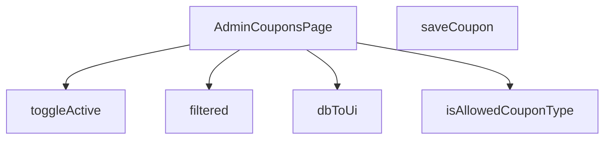

## Genel Bakış
Bu modül, yönetici panelinde kupon yönetimi sayfasının ve bu sayfada kullanılan yardımcı fonksiyonların bulunduğu bir React modülüdür. Kuponların veritabanından arayüz formatına dönüştürülmesi, filtrelenmesi, yeni eklenmesi ve aktiflik durumunun değiştirilmesi dahil olmak üzere kupon yaşam döngüsünün temel yönetim süreçlerini kapsar.

## Fonksiyon Grupları
### Ana Sayfa Bileşeni
Kupon yönetimi arayüzünün ana yapısını, durum yönetimini ve kullanıcı etkileşim akışlarını kontrol eden merkezi React bileşenini tanımlar.
- AdminCouponsPage

### Veri Dönüştürme ve Doğrulama
Veritabanından gelen ham kupon verilerini arayüzde gösterilebilir forma dönüştürür ve kupon türlerinin sistem tarafından izin verilen değerler arasında olup olmadığını doğrular.
- isAllowedCouponType, dbToUi

### Filtreleme
Kullanıcı tarafından belirlenen kriterlere göre kupon listesini dinamik olarak filtreleyerek görüntülenecek veri kümesini hazırlar.
- filtered

### API Etkileşimleri
Sunucu tarafında yeni bir kuponun kaydedilmesi ve mevcut bir kuponun aktif/pasif durumunun değiştirilmesi gibi kalıcı veri işlemleri için asenkron API çağrılarını yönetir.
- saveCoupon, toggleActive

---

## AXIOMS – Mimari Varsayımlar
Bu modül için temel mimari varsayımlar, kupon yönetimi işlevselliğinin doğru çalışması için veri doğrulama ve tutarlılık kurallarını tanımlar.

[Aksiyom 1]: Eğer `isAllowedCouponType` fonksiyonuna `bilinmeyen bir veri tipi` (unknown) girilmezse, kupon tür doğrulaması gerçekleşmez ve izin verilmeyen türler sisteme eklenebilir.

[Aksiyom 2]: Eğer `dbToUi` fonksiyonuna `DbCouponRow` yapısına uymayan bir satır verilirse, arayüz verileri tutarsız olur ve bileşen hata üretir.

[Aksiyom 3]: Eğer `saveCoupon` fonksiyonu çağrılmadan önce zorunlu kupon alanları (tür, kod, indirim değeri vb.) doğrulanmazsa, geçersiz veriler veritabanına kaydedilir.

[Aksiyom 4]: Eğer `toggleActive` fonksiyonu mevcut olmayan bir kupon `id`'si ile çağrılırsa, kupon aktiflik durumu değiştirilemez ve sessizce başarısız olur.

[Aksiyom 5]: Eğer `filtered()` fonksiyonu, bileşenin iç durumunda (`state`) filtreleme kriterleri tanımlanmadan çalıştırılırsa, tüm kuponlar gösterilir ve filtreleme işlevsiz kalır.

[Aksiyom 6]: Eğer veritabanından gelen kupon verisi (`DbCouponRow`) beklenen alanlardan (örn: `id`, `code`, `discount`) birini içermezse, `dbToUi` dönüşümü eksik veriyle çalışır ve arayüz bozulur.

[Aksiyom 7]: Eğer `AdminCouponsPage` bileşeni, veritabanı bağlantı nesnesine erişemezse, tüm CRUD operasyonları (kaydetme, listeleme, durum değiştirme) başarısız olur.

---

## FONKSİYON DETAYLARI

### isAllowedCouponType
**Ne yapar**: Verilen değerin izin verilen kupon tiplerinden (`'percent'` veya `'fixed'`) biri olup olmadığını kontrol eder.  
**Nasıl yapar**: Değeri doğrudan `'percent'` ve `'fixed'` stringleriyle karşılaştırır; eşleşme varsa `true`, aksi takdirde `false` döner.  
**Parametreler**:
- x: unknown — Kontrol edilmek istenen değer.  
**Dönüş**: `x is AllowedCouponType` (boolean) – değer izin verilen tiplerden biriyse `true`, değilse `false`.

### dbToUi
**Ne yapar**: Veritabanı satırını (DbCouponRow) UI katmanında kullanılacak biçime (CouponRow) dönüştürür.  
**Nasıl yapar**: Gelen nesnenin alanlarını yeniden adlandırır, tip dönüşümleri yapar (`discount_type` → `type`, `discount_value` → `value` gibi) ve null/undefined kontrolleriyle güvenli değerler üretir.  
**Parametreler**:
- row: DbCouponRow — Veritabanından alınan kupon kaydı.  
**Dönüş**: `CouponRow` — UI’da gösterilecek kupon nesnesi.

### AdminCouponsPage
**Ne yapar**: Yönetim panelinde kuponları listeleyen, ekleyen ve düzenleyen React bileşenini tanımlar.  
**Nasıl yapar**: İçerik olarak `useState`, `useEffect` ve yukarıdaki yardımcı fonksiyonları (ör. `saveCoupon`, `toggleActive`, `filtered`) kullanarak kupon verilerini yönetir ve UI render eder.  
**Parametreler**: Yok.  
**Dönüş**: `React.FC` — Fonksiyonel React bileşeni.

### filtered
**Ne yapar**: Kullanıcı arama sorgusuna göre kupon listesini filtreler.  
**Nasıl yapar**: Arama metni boşsa tüm satırları döndürür; aksi takdirde kod ve tip alanlarını küçük harfe çevirerek sorgu metniyle içerik kontrolü yapar.  
**Parametreler**: Yok (fonksiyon dışındaki `q` ve `rows` değişkenlerine erişir).  
**Dönüş**: `CouponRow[]` — Filtrelenmiş kupon satırları dizisi.

### saveCoupon
**Ne yapar**: Formdan alınan kupon verilerini doğrular, Supabase edge function aracılığıyla yeni bir kupon oluşturur ve UI’da listeyi günceller.  
**Nasıl yapar**:  
1. Form alanlarını temizler ve temel doğrulamalar (kod uzunluğu, tip seçimi, değer pozitifliği) yapar.  
2. Hata yoksa `supabase.functions.invoke` ile backend’e istek gönderir.  
3. Gelen veriyi `dbToUi` ile UI formatına çevirir, mevcut satır listesine ekler ve formu sıfırlar.  
4. Başarı veya hata durumunda toast mesajları gösterir.  
**Parametreler**: Yok.  
**Dönüş**: `void` (asenkron işlem, sonuç UI üzerinden yansıtılır).

### toggleActive

**Ne yapar**: Bir kuponun aktif/pasif durumunu tersine çevirir. Veritabanındaki `is_active` alanını günceller, yerel state'i senkronize eder, audit log kaydı oluşturur ve kullanıcıya durum bildirimi gösterir.

**Nasıl yapar**: Fonksiyon önce kullanıcının yazma yetkisi olup olmadığını kontrol eder; yetki yoksa hata toast'ı gösterip işlemi sonlandırır. Yetki varsa Supabase üzerinden ilgili kuponun `is_active` değerini tersine çevirir (boolean negasyonu ile). Güncelleme başarılı olduğunda, yerel `rows` state'ini `map` ile döner ve ilgili kuponun `active` değerini güncellenmiş veri ile değiştirir. Ardından bağımsız bir try-catch bloğu içinde `logAdminAction` ile audit log kaydı düşürür — bu log işleminin başarısız olması UI'ı etkilemez. Son olarak kullanıcıya başarılı veya hatalı durum bildirimi toast mesajı ile gösterilir.

**Parametreler**:
- `id`: `string` — Güncellenecek kuponun benzersiz tanımlayıcı (UUID) değeri
- `active`: `boolean` — Kuponun mevcut aktiflik durumu; fonksiyon bu değerin tersini alarak güncelleme yapar

**Dönüş**: `void` — Fonksiyon doğrudan bir değer dönmez; tüm durum değişikliklerini yan etkiler (state güncellemesi, toast bildirimleri, audit log) aracılığıyla gerçekleştirir.

---

## INTERFACES

### CouponRow
- `id: string`
- `code: string`
- `type: 'percent' | 'fixed' | string`
- `value: number`
- `starts_at?: string | null`
- `ends_at?: string | null`
- `active: boolean`
- `usage_limit?: number | null`
- `used_count?: number | null`
- `created_at: string`

---

## TYPE ALIASES

### AllowedCouponType
```typescript
type AllowedCouponType = 'percent' | 'fixed'
```

### DbCouponRow
```typescript
type DbCouponRow = {

  id: string

  code: string

  discount_type: 'percentage' | 'fixed_amount' | string

  discount_value: number

  valid_from?: string | null

  valid_until?: string | null

  is_active: boolean

 
```

---

## AST POINTERS

### [N1_NASIL] AST Pointer: src/views/admin/AdminCouponsPage.tsx::isAllowedCouponType
- **params**: `(x: unknown)`
- **ic_degiskenler**:
  - `x` — kontrol edilecek değer, `'percent'` veya `'fixed'` olup olmadığı test edilir
- **Dönüş**: `x is AllowedCouponType` (type guard, boolean)

### [N2_NASIL] AST Pointer: src/views/admin/AdminCouponsPage.tsx::dbToUi
- **params**: `(row: DbCouponRow)`
- **ic_degiskenler**:
  - `row` — veritabanından gelen kupon satırı, dönüşüm için kullanılır
- **Dönüş**: `CouponRow` (UI formatına dönüştürülmüş kupon nesnesi)

### [N3_NASIL] AST Pointer: src/views/admin/AdminCouponsPage.tsx::fetchCoupons (anonim async fonksiyon)
- **params**: `(yok)`
- **ic_degiskenler**:
  - `setLoading` — yükleme durumunu güncellemek için state setter
  - `data` — supabase'den gelen kupon listesi
  - `error` — supabase sorgusu hata nesnesi
  - `mapped` — DbCouponRow dizisinin CouponRow dizisine dönüştürülmüş hali
  - `setRows` — kupon listesini güncellemek için state setter
  - `e` — yakalanan hata nesnesi
- **Dönüş**: yok (side effect: rows state'ini günceller)

### [N4_NASIL] AST Pointer: src/views/admin/AdminCouponsPage.tsx::filtered
- **params**: `(yok)`
- **ic_degiskenler**:
  - `q` — arama sorgusu (component scope'tan)
  - `rows` — tüm kuponlar (component scope'tan)
  - `s` — küçük harfe dönüştürülmüş arama sorgusu
- **Dönüş**: `CouponRow[]` (filtrelenmiş kupon listesi)

### [N5_NASIL] AST Pointer: src/views/admin/AdminCouponsPage.tsx::saveCoupon
- **params**: `(yok)`
- **ic_degiskenler**:
  - `form` — form verileri (component scope'tan)
  - `codeTrim` — boşlukları temizlenmiş kupon kodu
  - `issues` — validasyon hataları dizisi
  - `val` — kupon değeri (sayıya dönüştürülmüş)
  - `setSaving` — kaydetme durumunu güncellemek için state setter
  - `payload` — veritabanına gönderilecek kupon verisi
  - `response` — edge function yanıt nesnesi
  - `data` — oluşturulan kupon verisi (DbCouponRow)
  - `error` — hata nesnesi
  - `ui` — DB formatından UI formatına dönüştürülmüş kupon
  - `setRows` — kupon listesini güncellemek için state setter
  - `setForm` — formu sıfırlamak için state setter
  - `e` — yakalanan hata nesnesi
- **Dönüş**: yok (side effect: rows listesine ekler, formu sıfırlar)

### [N6_NASIL] AST Pointer: src/views/admin/AdminCouponsPage.tsx::toggleActive
- **params**: `(id: string, active: boolean)`
- **ic_degiskenler**:
  - `hasWriteAccess` — yazma yetkisi (component scope'tan)
  - `supabase` — supabase client (component scope'tan)
  - `data` — güncellenen satır verisi (id ve is_active)
  - `error` — supabase update hatası
  - `setRows` — kupon listesini güncellemek için state setter
  - `e` — yakalanan hata nesnesi
- **Dönüş**: yok (side effect: aktiflik durumunu tersine çevirir, audit log yazar)

---


## MERMAID CALL GRAPH


## NODE ID STANDARD

  file: src\views\admin\AdminCouponsPage.tsx
  function: src\views\admin\AdminCouponsPage.tsx::isAllowedCouponType
  function: src\views\admin\AdminCouponsPage.tsx::dbToUi
  function: src\views\admin\AdminCouponsPage.tsx::AdminCouponsPage
  function: src\views\admin\AdminCouponsPage.tsx::filtered
  function: src\views\admin\AdminCouponsPage.tsx::saveCoupon
  function: src\views\admin\AdminCouponsPage.tsx::toggleActive

---

## DISA AKTARILANLAR (EXPORTS)
  export: AdminCouponsPage
  export: dbToUi
  export: isAllowedCouponType

---

## STİL TOKENLERİ

### Arbitrary Değerler (token'a geçirilmemiş)
Yok — tüm stiller token'a geçirilmiş. ✅

### Kullanılan Token'lar (zaten token'a geçirilmiş)
- (yok)

### Tailwind Sınıf Özeti
- **Renkler:** `bg-blue-500`, `bg-cyan-500`, `bg-cyan-500/10`, `bg-emerald-500`, `bg-emerald-500/10`, `bg-gradient-to-r`, `bg-slate-500`, `bg-slate-500/10`, `bg-slate-800`, `bg-white/10`, `bg-white/5`, `border-cyan-500/20`, `border-emerald-500/20`, `border-t`, `border-white/10`
- **Layout:** `custom-scrollbar`, `flex`, `flex-col`, `from-cyan-500`, `gap-1`, `gap-1.5`, `gap-2`, `gap-3`, `gap-4`, `gap-5`, `grid`, `grid-cols-1`, `h-1`, `h-1.5`, `h-4`
- **Varyant/Responsive:** `:`, `focus-visible:`, `group-hover:`, `hover:`, `md:` önekleri
- **Yardımcı Sınıflar:** `$`, `${adminButtonPrimaryClass`, `${adminButtonSecondaryClass`, `${adminCardPaddedClass`, `${adminInputClass`, `${adminTableCellClass`, `${adminTableHeadCellClass`, `${r.active`, `${r.type`, `:`, `===`, `animate-in`, `border`, `cursor-pointer`, `divide-white/5`