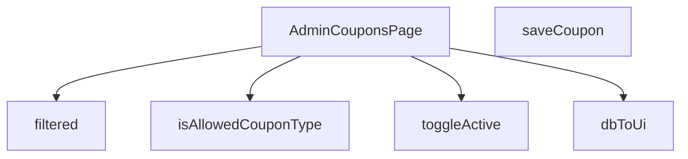

## Genel Bakış
Bu modül, yönetici panelinde kupon yönetimi sayfasını oluşturan React bileşenini ve destekleyici yardımcı fonksiyonları barındırır. Veritabanından gelen kupon verilerinin arayüz formatına dönüştürülmesi, filtrelenmesi, yeni kupon kaydı ve kupon aktiflik durumunun değiştirilmesi gibi temel CRUD operasyonlarını yönetir.

## Fonksiyon Grupları
### Ana Sayfa Bileşeni
Sayfanın genel yapısını, durum yönetimini ve kullanıcı etkileşim akışını kontrol eden merkezi React bileşenini tanımlar.
- AdminCouponsPage

### Veri Dönüştürme ve Doğrulama
Veritabanından gelen ham kupon satırlarını arayüzde kullanılacak forma dönüştürür ve kupon türlerinin izin verilen değerler arasında olup olmadığını doğrular.
- dbToUi, isAllowedCouponType

### Filtreleme
Kupon listesini kullanıcının belirlediği kriterlere göre işleyerek görüntülenecek alt kümesi hazırlar.
- filtered

### API Etkileşimleri
Sunucu tarafında yeni kupon oluşturma ve mevcut bir kuponun aktif/pasif durumunu değiştirme işlemlerini asenkron olarak yürütür.
- saveCoupon, toggleActive

---

## AXIOMS – Mimari Varsayımlar
Bu modül, veritabanından kupon verilerini çekip yönetici arayüzünde gösteren ve yöneten bir React bileşeni ile yardımcı fonksiyonlardan oluşur.

[Aksiyom 1]: Eğer `DbCouponRow` veri yapısında `id`, `code`, `active` gibi temel alanlar yoksa, `dbToUi` fonksiyonu hata verir veya eksik veri ile UI nesnesi oluşturulur.

[Aksiyom 2]: Eğer `isAllowedCouponType` fonksiyonu için izin verilen kupon türleri (örn: 'percentage', 'fixed') tanımlı değilse, tüm kupon türleri geçersiz sayılabilir veya tümü kabul edilebilir, bu da beklenmeyen kupon türlerinin sisteme girmesine yol açar.

[Aksiyom 3]: Eğer `filtered()` fonksiyonu çağrılmadan önce kupon verileri (`coupons` state'i) yüklenmemişse, boş

---

## FONKSİYON DETAYLARI

### isAllowedCouponType
**Ne yapar**: Verilen değerin izin verilen kupon tiplerinden (`'percent'` veya `'fixed'`) biri olup olmadığını kontrol eder.  
**Nasıl yapar**: Değeri doğrudan `'percent'` ve `'fixed'` stringleriyle karşılaştırır; eşleşme varsa `true`, aksi takdirde `false` döner.  
**Parametreler**:
- x: unknown — Kontrol edilmek istenen değer.  
**Dönüş**: `x is AllowedCouponType` (boolean) – değer izin verilen tiplerden biriyse `true`, değilse `false`.

### dbToUi
**Ne yapar**: Veritabanı satırını (DbCouponRow) UI katmanında kullanılacak biçime (CouponRow) dönüştürür.  
**Nasıl yapar**: Gelen nesnenin alanlarını yeniden adlandırır, tip dönüşümleri yapar (`discount_type` → `type`, `discount_value` → `value` gibi) ve null/undefined kontrolleriyle güvenli değerler üretir.  
**Parametreler**:
- row: DbCouponRow — Veritabanından alınan kupon kaydı.  
**Dönüş**: `CouponRow` — UI’da gösterilecek kupon nesnesi.

### AdminCouponsPage
**Ne yapar**: Yönetim panelinde kuponları listeleyen, ekleyen ve düzenleyen React bileşenini tanımlar.  
**Nasıl yapar**: İçerik olarak `useState`, `useEffect` ve yukarıdaki yardımcı fonksiyonları (ör. `saveCoupon`, `toggleActive`, `filtered`) kullanarak kupon verilerini yönetir ve UI render eder.  
**Parametreler**: Yok.  
**Dönüş**: `React.FC` — Fonksiyonel React bileşeni.

### filtered
**Ne yapar**: Kullanıcı arama sorgusuna göre kupon listesini filtreler.  
**Nasıl yapar**: Arama metni boşsa tüm satırları döndürür; aksi takdirde kod ve tip alanlarını küçük harfe çevirerek sorgu metniyle içerik kontrolü yapar.  
**Parametreler**: Yok (fonksiyon dışındaki `q` ve `rows` değişkenlerine erişir).  
**Dönüş**: `CouponRow[]` — Filtrelenmiş kupon satırları dizisi.

### saveCoupon
**Ne yapar**: Formdan alınan kupon verilerini doğrular, Supabase edge function aracılığıyla yeni bir kupon oluşturur ve UI’da listeyi günceller.  
**Nasıl yapar**:  
1. Form alanlarını temizler ve temel doğrulamalar (kod uzunluğu, tip seçimi, değer pozitifliği) yapar.  
2. Hata yoksa `supabase.functions.invoke` ile backend’e istek gönderir.  
3. Gelen veriyi `dbToUi` ile UI formatına çevirir, mevcut satır listesine ekler ve formu sıfırlar.  
4. Başarı veya hata durumunda toast mesajları gösterir.  
**Parametreler**: Yok.  
**Dönüş**: `void` (asenkron işlem, sonuç UI üzerinden yansıtılır).

### toggleActive
**Ne yapar**: Belirtilen kuponun aktiflik durumunu tersine çevirir ve UI’da günceller.  
**Nasıl yapar**: Supabase `update` sorgusuyla `is_active` alanını tersine çevirir, güncellenmiş kaydı alır ve `setRows` ile yerel durum dizisini günceller; işlem sonucunda toast bildirimi gösterir.  
**Parametreler**:
- id: string — Güncellenecek kuponun benzersiz kimliği.  
- active: boolean — Kuponun mevcut aktiflik durumu (fonksiyon yeni durumu `!active` olarak ayarlar).  
**Dönüş**: `void` (asenkron işlem, UI yan etkileriyle sonuçlanır).

---

## INTERFACES

### CouponRow
- `id: string`
- `code: string`
- `type: 'percent' | 'fixed' | string`
- `value: number`
- `starts_at?: string | null`
- `ends_at?: string | null`
- `active: boolean`
- `usage_limit?: number | null`
- `used_count?: number | null`
- `created_at: string`

---

## TYPE ALIASES

### AllowedCouponType
```typescript
type AllowedCouponType = 'percent' | 'fixed'
```

### DbCouponRow
```typescript
type DbCouponRow = {

  id: string

  code: string

  discount_type: 'percentage' | 'fixed_amount' | string

  discount_value: number

  valid_from?: string | null

  valid_until?: string | null

  is_active: boolean

 
```

---

## AST POINTERS

### [N1_NASIL] AST Pointer: src/views/admin/AdminCouponsPage.tsx::isAllowedCouponType
- **params**: `(x: unknown)` — bilinmeyen tipte girdi
- **ic_degiskenler**:
  (yok — doğrudan `x` parametresi üzerinde `===` karşılaştırması yapılır)
- **Dönüş**: `x is AllowedCouponType` — type guard; `x === 'percent'` veya `x === 'fixed'` ise `true`, aksi halde `false`

---

### [N2_NASIL] AST Pointer: src/views/admin/AdminCouponsPage.tsx::dbToUi
- **params**: `(row: DbCouponRow)` — veritabanından gelen kupon satırı
- **ic_degiskenler**:
  (yok — doğrudan `row` propiedadlerinden oluşur)
- **Dönüş**: `CouponRow` nesnesi — `row.discount_type === 'percentage'` ise `'percent'`, aksi halde `'fixed'`; `row.discount_value` `Number()` ile sayısallaştırılır; `row.valid_from`, `row.valid_until`, `row.is_active`, `row.usage_limit`, `row.used_count` alanları null-safe olarak eşlenir

---

### [N3_NASIL] AST Pointer: src/views/admin/AdminCouponsPage.tsx::filtered
- **params**: `(parametre yok)`
- **ic_degiskenler**:
  - `s` — `q` değerinin küçük harfe çevrilmiş hali; filtreleme için arama metni olarak kullanılır
- **Dönüş**: Filtrelenmiş `CouponRow[]` dizisi — `q.trim()` boşsa tüm `rows` döner; değilse `r.code` veya `r.type` içinde `s` içeren satırlar filtrelenir
- **Not**: `q` ve `rows` dış scope'tan (React state) erişilir

---

### [N4_NASIL] AST Pointer: src/views/admin/AdminCouponsPage.tsx::saveCoupon
- **params**: `(parametre yok)`
- **ic_degiskenler**:
  - `codeTrim` — `form.code` değerinin boşlukları trim edilmiş hali; kupon kodunun doğrulanması ve payload'da kullanılması için
  - `issues` — `string[]` validasyon hatalarının toplandığı dizi; `toast.error` ile kullanıcıya gösterilir
  - `val` — `form.value` sayısallaştırılmış hali; kupon indirim değeri
  - `payload` — Supabase edge function'a gönderilen veri nesnesi; `code`, `discount_type`, `discount_value`, `valid_from`, `valid_until`, `is_active`, `usage_limit`, `used_count` alanlarını içerir
  - `response` — `supabase.functions.invoke('admin-create-coupon', { body: {...} })` çağrısının sonucu; `{ data, error }` olarak destructure edilir
  - `data` — `response.data`; `DbCouponRow | null` tipinde; başarıyla oluşturulursa kupon verisi
  - `error` — `response.error`; `unknown | null` tipinde; oluştuysa fırlatılır
  - `ui` — `dbToUi(data as DbCouponRow)` çağrısının sonucu; UI formatına dönüştürülmüş kupon
- **Dönüş**: `void` — `setRows` ile state güncellenir, `toast.success` ile bildirim gönderilir, `form` sıfırlanır
- **Not**: `form`, `setForm`, `setRows`, `setSaving` dış scope'tan erişilir; `isAllowedCouponType` ile `form.type` doğrulanır

---

### [N5_NASIL] AST Pointer: src/views/admin/AdminCouponsPage.tsx::toggleActive
- **params**: `(id: string, active: boolean)` — `id` toggellenecek kuponun ID'si; `active` mevcut aktif durumu
- **ic_degiskenler**:
  - `data` — `supabase.from('coupons').update(...).select(...).single()` çağrısının `{ data, error }` destructuring'inden gelen `data`; `{ id: string; is_active: boolean }` tipinde; güncellenen kuponun yeni durumu
  - `error` — aynı destructuring'den gelen `error`; oluştuysa fırlatılır
- **Dönüş**: `void` — `setRows` ile ilgili satırın `active` alanı `data.is_active` değerine göre güncellenir; `toast.success` ile bildirim gönderilir
- **Not**: `setRows` dış scope'tan erişilir

---

### [N6_NASIL] AST Pointer: src/views/admin/AdminCouponsPage.tsx::useEffect (fetch coupons)
- **params**: `(parametre yok)` — anonim async callback
- **ic_degiskenler**:
  - `data` — `supabase.from('coupons').select(...)` çağrısının sonucu; `DbCouponRow[]` veya `null`; kupon listesi
  - `error` — `supabase` çağrısının hata sonucu; oluştuysa `throw` edilir
  - `mapped` — `(data || []).map(d => dbToUi(d as DbCouponRow))` ile oluşturulan `CouponRow[]` dizisi; UI formatına dönüştürülmüş kuponlar
- **Dönüş**: `void` — `setLoading(true)` ile loading başlatılır; `ensureSessionFresh()` ile oturum kontrolü yapılır; `setRows(mapped)` ile state güncellenir; `setLoading(false)` ile loading bitirilir
- **Not**: `setLoading`, `setRows` dış scope'tan erişilir; `ensureSessionFresh`, `supabase`, `dbToUi` import edilen fonksiyonlardır

---

### [N7_NASIL] AST Pointer: src/views/admin/AdminCouponsPage.tsx::setForm (usage_limit handler)
- **params**: `(f)` — mevcut form state'i (React state updater callback)
- **ic_degiskenler**:
  - `raw` — `e.target.value`'nin `Number()` ile sayısallaştırılmış hali; boşsa `null`
  - `normalized` — `raw` > 0 ise `raw`, aksi halde `null`; geçersiz sıfır/negatif değerleri normalize eder
- **Dönüş**: Yeni form nesnesi — `...f` ile mevcut form korunur, `usage_limit` alanına `normalized` değeri atanır
- **Not**: `e` (React.ChangeEvent) dışarıdan gelir; `form` state'i React state updater pattern'inde kullanılır

---

### [N8_NASIL] AST Pointer: src/views/admin/AdminCouponsPage.tsx::row map callback (render)
- **params**: `(r, idx)` — `r`: `CouponRow` satır verisi; `idx`: dizideki indeks (animasyon gecikmesi için)
- **ic_degiskenler**:
  (yok — doğrudan `r` propiedadlerinden JSX içinde erişilir)
- **Dönüş**: JSX `<tr>` elementi — `r.code`, `r.type`, `r.value`, `r.active`, `r.starts_at`, `r.ends_at`, `r.used_count`, `r.usage_limit`, `r.created_at` alanları tablo hücrelerinde gösterilir; `hasWriteAccess` && `toggleActive(r.id, r.active)` ile aktif/pasif toggle butonu bağlanır; `idx * 50` ms animasyon gecikmesi uygulanır
- **Not**: `hasWriteAccess`, `toggleActive`, `formatCurrency`, `formatDateTime`, `lang`, `adminTableCellClass` dış scope'tan erişilir

---


## MERMAID CALL GRAPH


## NODE ID STANDARD

  file: src\views\admin\AdminCouponsPage.tsx
  function: src\views\admin\AdminCouponsPage.tsx::isAllowedCouponType
  function: src\views\admin\AdminCouponsPage.tsx::dbToUi
  function: src\views\admin\AdminCouponsPage.tsx::AdminCouponsPage
  function: src\views\admin\AdminCouponsPage.tsx::filtered
  function: src\views\admin\AdminCouponsPage.tsx::saveCoupon
  function: src\views\admin\AdminCouponsPage.tsx::toggleActive

---

## DISA AKTARILANLAR (EXPORTS)
  export: AdminCouponsPage
  export: dbToUi
  export: isAllowedCouponType

---

## STİL TOKENLERİ

### Arbitrary Değerler (token'a geçirilmemiş)
Yok — tüm stiller token'a geçirilmiş. ✅

### Kullanılan Token'lar (zaten token'a geçirilmiş)
- (yok)

### Tailwind Sınıf Özeti
- **Renkler:** `bg-blue-500`, `bg-cyan-500`, `bg-cyan-500/10`, `bg-emerald-500`, `bg-emerald-500/10`, `bg-gradient-to-r`, `bg-slate-500`, `bg-slate-500/10`, `bg-slate-800`, `bg-white/10`, `bg-white/5`, `border-cyan-500/20`, `border-emerald-500/20`, `border-t`, `border-white/10`
- **Layout:** `custom-scrollbar`, `flex`, `flex-col`, `from-cyan-500`, `gap-1`, `gap-1.5`, `gap-2`, `gap-3`, `gap-4`, `gap-5`, `grid`, `grid-cols-1`, `h-1`, `h-1.5`, `h-4`
- **Varyant/Responsive:** `:`, `focus-visible:`, `group-hover:`, `hover:`, `md:` önekleri
- **Yardımcı Sınıflar:** `$`, `${adminButtonPrimaryClass`, `${adminButtonSecondaryClass`, `${adminCardPaddedClass`, `${adminInputClass`, `${adminTableCellClass`, `${adminTableHeadCellClass`, `${r.active`, `${r.type`, `:`, `===`, `animate-in`, `border`, `cursor-pointer`, `divide-white/5`