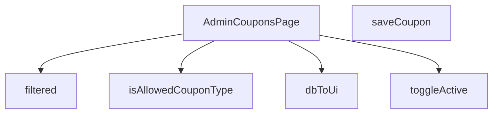

## Genel Bakış
Bu modül, yönetici panelinde kupon yönetimi sayfasını oluşturan React bileşenini ve bu sayfayı destekleyen yardımcı işlevleri içerir. Temel olarak kuponların veritabanından çekilip arayüze dönüştürülmesi, listelenmesi, filtrelenmesi, yeni kupon eklenmesi ve mevcut kuponların aktif/pasif durumlarının değiştirilmesi gibi CRUD benzeri işlemleri yönetir.

## Fonksiyon Grupları
### Ana Sayfa Bileşeni
Sayfanın ana yapı taşını ve akışını kontrol eden React bileşenini tanımlar. Kullanıcı arayüzünü oluşturur ve diğer tüm işlevleri entegre eder.
- AdminCouponsPage

### Veri Dönüştürme ve Doğrulama
Veritabanından gelen ham kupon verilerini, kullanıcı arayüzünde gösterilecek standart bir formata dönüştürür. Ayrıca, kupon türlerinin izin verilen değerler olup olmadığını doğrular.
- dbToUi, isAllowedCouponType

### Görüntüleme ve Filtreleme
Sayfada görüntülenecek kupon listesini, kullanıcının seçtiği filtre kriterlerine göre işler ve hazırlar.
- filtered

### API ve Durum Yönetimi
Kupon ekleme ve bir kuponun aktif/pasif durumunu değiştirme gibi sunucu tarafı işlemleri başlatır ve sonucunu yönetir.
- saveCoupon, toggleActive

---

## AXIOMS – Mimari Varsayımlar

Bu modül, yönetici panelinde kupon yönetimi sayfası için veritabanı ile UI arasındaki veri akışını ve durum değişimlerini yönetir.

[Aksiyom 1]: Eğer `DbCouponRow` tipinde geçerli bir veri yapısı (satır) sağlanmamışsa veya alanlar eksik/yanlış tipteyse, `dbToUi` fonksiyonu beklenmeyen davranış gösterir (runtime hatası veya eksik UI alanları).

[Aksiyom 2]: Eğer `isAllowedCouponType` fonksiyonuna verilen `x` parametresi, izin verilen kupon türleri listesinde değilse, `false` değeri döner.

[Aksiyom 3]: Eğer `filtered()` fonksiyonu çağrıldığında geçerli bir filtre kriteri tanımlanmamışsa, tüm kupon kayıtları (tamamı) döner.

[Aksiyom 4]: Eğer `toggleActive` fonksiyonuna verilen `id` parametresi mevcut kupon kayıtlarında (veritabanında) eşleşen bir kayıt içermiyorsa, aktif/pasif durum değişikliği gerçekleştirilmez (sessizce başarısız olur).

[Aksiyom 5]: Eğer `saveCoupon` fonksiyonu çalıştırıldığında zorunlu kupon alanları (örn: kod, değer, tarih aralığı) eksik veya geçersizse, kaydetme işlemi başlatılmaz.

[Aksiyom 6]: Eğer `AdminCouponsPage` bileşeni render edildiğinde kupon listesi için gerekli başlangıç verisi (API çağrısı sonucu) henüz hazır değilse, bileşen yüklenme durumunda (loading) kalır.

---

## FONKSİYON DETAYLARI

### isAllowedCouponType
**Ne yapar**: Verilen değerin izin verilen kupon tiplerinden (`'percent'` veya `'fixed'`) biri olup olmadığını kontrol eder.  
**Nasıl yapar**: Değeri doğrudan `'percent'` ve `'fixed'` stringleriyle karşılaştırır; eşleşme varsa `true`, aksi takdirde `false` döner.  
**Parametreler**:
- x: unknown — Kontrol edilmek istenen değer.  
**Dönüş**: `x is AllowedCouponType` (boolean) – değer izin verilen tiplerden biriyse `true`, değilse `false`.

### dbToUi
**Ne yapar**: Veritabanı satırını (DbCouponRow) UI katmanında kullanılacak biçime (CouponRow) dönüştürür.  
**Nasıl yapar**: Gelen nesnenin alanlarını yeniden adlandırır, tip dönüşümleri yapar (`discount_type` → `type`, `discount_value` → `value` gibi) ve null/undefined kontrolleriyle güvenli değerler üretir.  
**Parametreler**:
- row: DbCouponRow — Veritabanından alınan kupon kaydı.  
**Dönüş**: `CouponRow` — UI’da gösterilecek kupon nesnesi.

### AdminCouponsPage
**Ne yapar**: Yönetim panelinde kuponları listeleyen, ekleyen ve düzenleyen React bileşenini tanımlar.  
**Nasıl yapar**: İçerik olarak `useState`, `useEffect` ve yukarıdaki yardımcı fonksiyonları (ör. `saveCoupon`, `toggleActive`, `filtered`) kullanarak kupon verilerini yönetir ve UI render eder.  
**Parametreler**: Yok.  
**Dönüş**: `React.FC` — Fonksiyonel React bileşeni.

### filtered
**Ne yapar**: Kullanıcı arama sorgusuna göre kupon listesini filtreler.  
**Nasıl yapar**: Arama metni boşsa tüm satırları döndürür; aksi takdirde kod ve tip alanlarını küçük harfe çevirerek sorgu metniyle içerik kontrolü yapar.  
**Parametreler**: Yok (fonksiyon dışındaki `q` ve `rows` değişkenlerine erişir).  
**Dönüş**: `CouponRow[]` — Filtrelenmiş kupon satırları dizisi.

### saveCoupon
**Ne yapar**: Formdan alınan kupon verilerini doğrular, Supabase edge function aracılığıyla yeni bir kupon oluşturur ve UI’da listeyi günceller.  
**Nasıl yapar**:  
1. Form alanlarını temizler ve temel doğrulamalar (kod uzunluğu, tip seçimi, değer pozitifliği) yapar.  
2. Hata yoksa `supabase.functions.invoke` ile backend’e istek gönderir.  
3. Gelen veriyi `dbToUi` ile UI formatına çevirir, mevcut satır listesine ekler ve formu sıfırlar.  
4. Başarı veya hata durumunda toast mesajları gösterir.  
**Parametreler**: Yok.  
**Dönüş**: `void` (asenkron işlem, sonuç UI üzerinden yansıtılır).

### toggleActive
**Ne yapar**: Belirtilen kuponun aktiflik durumunu tersine çevirir ve UI’da günceller.  
**Nasıl yapar**: Supabase `update` sorgusuyla `is_active` alanını tersine çevirir, güncellenmiş kaydı alır ve `setRows` ile yerel durum dizisini günceller; işlem sonucunda toast bildirimi gösterir.  
**Parametreler**:
- id: string — Güncellenecek kuponun benzersiz kimliği.  
- active: boolean — Kuponun mevcut aktiflik durumu (fonksiyon yeni durumu `!active` olarak ayarlar).  
**Dönüş**: `void` (asenkron işlem, UI yan etkileriyle sonuçlanır).

---

## INTERFACES

### CouponRow
- `id: string`
- `code: string`
- `type: 'percent' | 'fixed' | string`
- `value: number`
- `starts_at?: string | null`
- `ends_at?: string | null`
- `active: boolean`
- `usage_limit?: number | null`
- `used_count?: number | null`
- `created_at: string`

---

## TYPE ALIASES

### AllowedCouponType
```typescript
type AllowedCouponType = 'percent' | 'fixed'
```

### DbCouponRow
```typescript
type DbCouponRow = {

  id: string

  code: string

  discount_type: 'percentage' | 'fixed_amount' | string

  discount_value: number

  valid_from?: string | null

  valid_until?: string | null

  is_active: boolean

 
```

---

## AST POINTERS

### [N1_NASIL] AST Pointer: src/views/admin/AdminCouponsPage.tsx::isAllowedCouponType
- **params**: `x: unknown`
- **ic_degiskenler**: (yok)
- **Dönüş**: `x is AllowedCouponType` (tip koruma predicate, boolean)

---

### [N2_NASIL] AST Pointer: src/views/admin/AdminCouponsPage.tsx::dbToUi
- **params**: `row: DbCouponRow`
- **ic_degiskenler**:
  - `id` — row.id'den gelen kupon benzersiz tanımlayıcısı
  - `code` — row.code'dan gelen kupon kodu
  - `type` — row.discount_type 'percentage' ise 'percent', aksi halde 'fixed' olarak dönüştürülen indirim tipi
  - `value` — row.discount_value'in Number ile sayıya dönüştürülmüş indirim değeri
  - `starts_at` — row.valid_from veya null, kupon geçerlilik başlangıç tarihi
  - `ends_at` — row.valid_until veya null, kupon geçerlilik bitiş tarihi
  - `active` — row.is_active'in !! ile boolean'a dönüştürülmüş aktiflik durumu
  - `usage_limit` — row.usage_limit veya null, kupon kullanım üst limiti
  - `used_count` — row.used_count veya 0, kuponun kullanma sayısı
  - `created_at` — row.created_at, kupon oluşturma tarihi
- **Dönüş**: `CouponRow` (nesne)

---

### [N3_NASIL] AST Pointer: src/views/admin/AdminCouponsPage.tsx::fetchCoupons (anonim async arrow)
- **params**: (yok)
- **ic_degiskenler**:
  - `data` — supabase.select() sorgusundan dönen satır dizisi (DbCouponRow[])
  - `error` — supabase sorgusundan dönen hata nesnesi veya null
  - `mapped` — (data || []).map ile her DbCouponRow'ı dbToUi ile CouponRow'a dönüştürülmüş dizi
  - `e` — catch bloğunda yakalanan hata nesnesi
- **Yan etkiler**: setLoading(true/false), setRows(mapped), console.error çağrısı
- **Dönüş**: yok

---

### [N4_NASIL] AST Pointer: src/views/admin/AdminCouponsPage.tsx::filtered
- **params**: (yok)
- **ic_degiskenler**:
  - `q` — useCallback içinden okunan arama sorgusu stringi (dış state)
  - `rows` — useCallback içinden okunan kupon satırları dizisi (CouponRow[])
  - `s` — q.toLowerCase() ile küçük harfe dönüştürülmüş arama metni
- **Dönüş**: CouponRow[] (filtrelenmiş satır dizisi)

---

### [N5_NASIL] AST Pointer: src/views/admin/AdminCouponsPage.tsx::saveCoupon
- **params**: (yok)
- **ic_degiskenler**:
  - `codeTrim` — form.code'un String() ile string'e dönüştürülüp trim edilmiş hali, kupon kodu doğrulaması için
  - `issues` — string[] tipinde validasyon hata mesajları dizisi
  - `val` — form.value'un Number() ile sayıya dönüştürülmüş hali, indirim tutarı
  - `payload` — supabase edge function'a gönderilen kupon verisi nesnesi (code, discount_type, discount_value, valid_from, valid_until, is_active, usage_limit, used_count alanlarını içerir)
  - `response` — supabase.functions.invoke() çağrısının sonucu (data ve error alanları)
  - `data` — response.data'dan destructured, edge function'dan dönen DbCouponRow veya null
  - `error` — response.error'dan destructured, hata nesnesi veya null
  - `ui` — dbToUi(data) ile DbCouponRow'dan CouponRow'a dönüştürülmüş kupon
  - `e` — catch bloğunda yakalanan hata nesnesi
- **Yan etkiler**: setSaving(true/false), setRows(prev => [ui, ...prev]), setForm(), toast.error(), toast.success(), console.error()
- **Dönüş**: yok

---

### [N6_NASIL] AST Pointer: src/views/admin/AdminCouponsPage.tsx::toggleActive
- **params**: `id: string` (kupon benzersiz tanımlayıcısı), `active: boolean` (mevcut aktiflik durumu)
- **ic_degiskenler**:
  - `data` — supabase.update().select().single() ile dönen güncellenmiş satır ({ id: string; is_active: boolean })
  - `error` — supabase sorgusundan dönen hata nesnesi veya null
  - `e` — catch bloğunda yakalanan hata nesnesi
- **Yan etkiler**: setRows(prev => prev.map(...)) ile ilgili satırın active alanını günceller, toast.success() çağrısı
- **Dönüş**: yok

---

### [N7_NASIL] AST Pointer: src/views/admin/AdminCouponsPage.tsx::usageLimitHandler (e parametreli arrow)
- **params**: `e` (React.ChangeEvent<HTMLInputElement>)
- **ic_degiskenler**:
  - `raw` — e.target.value'Number() ile sayıya dönüştürülmüş hali veya null (boşsa null)
  - `normalized` — raw 0'dan büyükse raw, aksi halde null (negatif/sıfır değerleri filtreler)
- **Yan etkiler**: setForm() ile form.usage_limit alanını normalized değeriyle günceller
- **Dönüş**: (yeni form nesnesi, setForm callback dönüşü)

---

### [N8_NASIL] AST Pointer: src/views/admin/AdminCouponsPage.tsx::tableRowRenderer (r, idx parametreli arrow)
- **params**: `r: CouponRow` (kupon satırı), `idx: number` (satır indeksi)
- **ic_degiskenler**:
  - `r` — CouponRow tipinde, render edilecek kupon satır verisi
  - `idx` — number, satır indeksi (animation gecikmesi için kullanılır)
- **Erişilen CouponRow alanları**:
  - `r.code` — kupon kodu, <span> içinde gösterilir
  - `r.type` — indirim tipi ('percent' veya 'fixed'), koşullu className ve metin belirlemede kullanılır
  - `r.value` — indirim değeri, koşullu formatCurrency veya % prefix ile gösterilir
  - `r.active` — aktiflik durumu, koşullu className ve buton metni belirlemede kullanılır
  - `r.id` — kupon ID'si, key prop'u ve toggleActive çağrısında kullanılır
  - `r.starts_at` — geçerlilik başlangıç tarihi, formatDateTime ile formatlanır veya '-' gösterilir
  - `r.ends_at` — geçerlilik bitiş tarihi, formatDateTime ile formatlanır veya 'SÜRESİZ' gösterilir
  - `r.used_count` — kullanım sayısı, progress bar hesaplamasında ve <span> içinde gösterilir
  - `r.usage_limit` — kullanım limiti, progress bar hesaplamasında ve '∞' fallback ile gösterilir
  - `r.created_at` — oluşturma tarihi, formatDateTime ile formatlanır
- **Dönüş**: JSX (<tr> elementi)

---


## MERMAID CALL GRAPH


## NODE ID STANDARD

  file: src\views\admin\AdminCouponsPage.tsx
  function: src\views\admin\AdminCouponsPage.tsx::isAllowedCouponType
  function: src\views\admin\AdminCouponsPage.tsx::dbToUi
  function: src\views\admin\AdminCouponsPage.tsx::AdminCouponsPage
  function: src\views\admin\AdminCouponsPage.tsx::filtered
  function: src\views\admin\AdminCouponsPage.tsx::saveCoupon
  function: src\views\admin\AdminCouponsPage.tsx::toggleActive

---

## DISA AKTARILANLAR (EXPORTS)
  export: AdminCouponsPage
  export: dbToUi
  export: isAllowedCouponType

---

## STİL TOKENLERİ

### Arbitrary Değerler (token'a geçirilmemiş)
Yok — tüm stiller token'a geçirilmiş. ✅

### Kullanılan Token'lar (zaten token'a geçirilmiş)
- (yok)

### Tailwind Sınıf Özeti
- **Renkler:** `bg-blue-500`, `bg-cyan-500`, `bg-cyan-500/10`, `bg-emerald-500`, `bg-emerald-500/10`, `bg-gradient-to-r`, `bg-slate-500`, `bg-slate-500/10`, `bg-slate-800`, `bg-white/10`, `bg-white/5`, `border-cyan-500/20`, `border-emerald-500/20`, `border-t`, `border-white/10`
- **Layout:** `custom-scrollbar`, `flex`, `flex-col`, `from-cyan-500`, `gap-1`, `gap-1.5`, `gap-2`, `gap-3`, `gap-4`, `gap-5`, `grid`, `grid-cols-1`, `h-1`, `h-1.5`, `h-4`
- **Varyant/Responsive:** `:`, `focus-visible:`, `group-hover:`, `hover:`, `md:` önekleri
- **Yardımcı Sınıflar:** `$`, `${adminButtonPrimaryClass`, `${adminButtonSecondaryClass`, `${adminCardPaddedClass`, `${adminInputClass`, `${adminTableCellClass`, `${adminTableHeadCellClass`, `${r.active`, `${r.type`, `:`, `===`, `animate-in`, `border`, `cursor-pointer`, `divide-white/5`