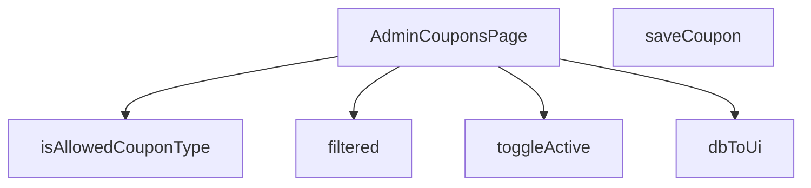

## Genel Bakış
Bu modül, yönetici panelinde kupon yönetimi sayfasını oluşturan React bileşenini ve yardımcı işlevleri içerir. Kuponların listelenmesi, filtrelenmesi, yeni kupon eklenmesi ve aktif/pasif durumlarının değiştirilmesi gibi işlemleri yönetir.

## Fonksiyon Grupları

### Ana Sayfa Bileşeni
Sayfanın temel React bileşenini oluşturur, diğer tüm işlevleri bir araya getirir.
- AdminCouponsPage

### Veri Dönüşümü ve Doğrulama
Veritabanından gelen kupon verilerini kullanıcı arayüzü formatına çevirir ve kupon türlerinin geçerliliğini kontrol eder.
- isAllowedCouponType, dbToUi

### Durum Yönetimi ve Filtreleme
Mevcut kupon listesini belirli kriterlere göre filtreleyerek görüntülenen veriyi hazırlar.
- filtered

### API İşlemleri
Kupon ekleme ve aktiflik durumunu değiştirme gibi sunucuyla etkileşim gerektiren işlemleri gerçekleştirir.
- saveCoupon, toggleActive

---

## AXIOMS – Mimari Varsayımlar  
Bu modül için özel aksiyom tanımlanmamıştır. Aşağıdaki aksiyomlar, yalnızca fonksiyon imzalarından çıkarılan zorunlu koşulları ve beklenen sonuçları tanımlar.

**Aksiyom 1**: Eğer `isAllowedCouponType` fonksiyonuna verilen `x` parametresi **tanımsız (undefined) veya null** ise, fonksiyon **false** döner.  

**Aksiyom 2**: Eğer `isAllowedCouponType` fonksiyonuna verilen `x` parametresi **beklenen coupon‑type formatına** (örneğin string ya da enum) uymuyorsa, fonksiyon **false** döner.  

**Aksiyom 3**: Eğer `dbToUi` fonksiyonuna verilen `row` parametresi **null, undefined** ya da **DbCouponRow tipine uygun değilse**, fonksiyon **bir hata fırlatır** (exception) ya da **null** döner.  

**Aksiyom 4**: Eğer `AdminCouponsPage` bileşeni **gerekli bağlam (React context, router, vb.)** olmadan render edilirse, bileşen **boş** ya da **hata ekranı** gösterir.  

**Aksiyom 5**: Eğer `filtered` fonksiyonu **filtreleme kriterleri** (örn. arama metni, aktif/pasif durumu) **tanımlı değilse**, fonksiyon **tüm kuponları** (yani hiçbir filtre uygulamadan) döner.  

**Aksiyom 6**: Eğer `saveCoupon` fonksiyonu **geçersiz kupon verisi** (örneğin eksik alanlar, tip uyuşmazlığı) alırsa, fonksiyon **kaydetme işlemini reddeder** ve **hata mesajı** üretir.  

**Aksiyom 7**: Eğer `toggleActive` fonksiyonuna verilen `id` **veritabanında mevcut bir kuponu işaret etmiyorsa**, fonksiyon **hiçbir değişiklik yapmaz** ve **başarısızlık durumu** döner.  

**Aksiyom 8**: Eğer `toggleActive` fonksiyonuna verilen `active` değeri **boolean tipinde değilse**, fonksiyon **tip hatası** fırlatır.  

**Domain‑specific kurallar**:  
- Kupon tipinin izin verilen değerleri (örneğin `"percentage"`, `"fixed_amount"` vb.) **bilinmiyor**; bu değerler `isAllowedCouponType` içinde tanımlı olmalıdır.  
- `DbCouponRow` yapısının zorunlu alanları (örneğin `id`, `code`, `type`, `value`) **bilinmiyor**; ancak bu alanların eksik olması `dbToUi` fonksiyonunun hata üretmesine yol açar.

---

## FONKSİYON DETAYLARI

### isAllowedCouponType
**Ne yapar**: Verilen değerin izin verilen kupon tiplerinden (`'percent'` veya `'fixed'`) biri olup olmadığını kontrol eder.  
**Nasıl yapar**: Değeri doğrudan `'percent'` ve `'fixed'` stringleriyle karşılaştırır; eşleşme varsa `true`, aksi takdirde `false` döner.  
**Parametreler**:
- x: unknown — Kontrol edilmek istenen değer.  
**Dönüş**: `x is AllowedCouponType` (boolean) – değer izin verilen tiplerden biriyse `true`, değilse `false`.

### dbToUi
**Ne yapar**: Veritabanı satırını (DbCouponRow) UI katmanında kullanılacak biçime (CouponRow) dönüştürür.  
**Nasıl yapar**: Gelen nesnenin alanlarını yeniden adlandırır, tip dönüşümleri yapar (`discount_type` → `type`, `discount_value` → `value` gibi) ve null/undefined kontrolleriyle güvenli değerler üretir.  
**Parametreler**:
- row: DbCouponRow — Veritabanından alınan kupon kaydı.  
**Dönüş**: `CouponRow` — UI’da gösterilecek kupon nesnesi.

### AdminCouponsPage
**Ne yapar**: Yönetim panelinde kuponları listeleyen, ekleyen ve düzenleyen React bileşenini tanımlar.  
**Nasıl yapar**: İçerik olarak `useState`, `useEffect` ve yukarıdaki yardımcı fonksiyonları (ör. `saveCoupon`, `toggleActive`, `filtered`) kullanarak kupon verilerini yönetir ve UI render eder.  
**Parametreler**: Yok.  
**Dönüş**: `React.FC` — Fonksiyonel React bileşeni.

### filtered
**Ne yapar**: Kullanıcı arama sorgusuna göre kupon listesini filtreler.  
**Nasıl yapar**: Arama metni boşsa tüm satırları döndürür; aksi takdirde kod ve tip alanlarını küçük harfe çevirerek sorgu metniyle içerik kontrolü yapar.  
**Parametreler**: Yok (fonksiyon dışındaki `q` ve `rows` değişkenlerine erişir).  
**Dönüş**: `CouponRow[]` — Filtrelenmiş kupon satırları dizisi.

### saveCoupon
**Ne yapar**: Formdan alınan kupon verilerini doğrular, Supabase edge function aracılığıyla yeni bir kupon oluşturur ve UI’da listeyi günceller.  
**Nasıl yapar**:  
1. Form alanlarını temizler ve temel doğrulamalar (kod uzunluğu, tip seçimi, değer pozitifliği) yapar.  
2. Hata yoksa `supabase.functions.invoke` ile backend’e istek gönderir.  
3. Gelen veriyi `dbToUi` ile UI formatına çevirir, mevcut satır listesine ekler ve formu sıfırlar.  
4. Başarı veya hata durumunda toast mesajları gösterir.  
**Parametreler**: Yok.  
**Dönüş**: `void` (asenkron işlem, sonuç UI üzerinden yansıtılır).

### toggleActive
**Ne yapar**: Belirtilen kuponun aktiflik durumunu tersine çevirir ve UI’da günceller.  
**Nasıl yapar**: Supabase `update` sorgusuyla `is_active` alanını tersine çevirir, güncellenmiş kaydı alır ve `setRows` ile yerel durum dizisini günceller; işlem sonucunda toast bildirimi gösterir.  
**Parametreler**:
- id: string — Güncellenecek kuponun benzersiz kimliği.  
- active: boolean — Kuponun mevcut aktiflik durumu (fonksiyon yeni durumu `!active` olarak ayarlar).  
**Dönüş**: `void` (asenkron işlem, UI yan etkileriyle sonuçlanır).

---

## INTERFACES

### CouponRow
- `id: string`
- `code: string`
- `type: 'percent' | 'fixed' | string`
- `value: number`
- `starts_at?: string | null`
- `ends_at?: string | null`
- `active: boolean`
- `usage_limit?: number | null`
- `used_count?: number | null`
- `created_at: string`

---

## TYPE ALIASES

### AllowedCouponType
```typescript
type AllowedCouponType = 'percent' | 'fixed'
```

### DbCouponRow
```typescript
type DbCouponRow = {

  id: string

  code: string

  discount_type: 'percentage' | 'fixed_amount' | string

  discount_value: number

  valid_from?: string | null

  valid_until?: string | null

  is_active: boolean

 
```

---

## AST POINTERS

### [N1_NASIL] AST Pointer: C:\Users\alize\venthub-hvac\src\views\admin\AdminCouponsPage.tsx::isAllowedCouponType
- **params**: (x: unknown)
- **ic_degiskenler**:
  - `x` — kontrol edilen değer, `'percent'` ya da `'fixed'` olup olmadığı test edilir
- **Dönüş**: `x is AllowedCouponType` (type guard, boolean)

### [N2_NASIL] AST Pointer: C:\Users\alize\venthub-hvac\src\views\admin\AdminCouponsPage.tsx::dbToUi
- **params**: (row: DbCouponRow)
- **ic_degiskenler**:
  - `row.id` — veri tabanındaki kuponun kimliği
  - `row.code` — kupon kodu
  - `row.discount_type` — `'percentage'` ya da `'fixed_amount'`, UI tipine çevrilir
  - `row.discount_value` — sayı olarak saklanan indirim değeri
  - `row.valid_from` — kuponun geçerli olduğu başlangıç tarih‑zamanı, yoksa `null`
  - `row.valid_until` — kuponun geçerli olduğu bitiş tarih‑zamanı, yoksa `null`
  - `row.is_active` — aktiflik bayrağı, UI’da `active` olarak dönüştürülür
  - `row.usage_limit` — kullanım limiti, yoksa `null`
  - `row.used_count` — kullanılan miktar, yoksa `0`
  - `row.created_at` — oluşturulma zaman damgası
- **Dönüş**: `CouponRow` (UI‑model nesnesi)

### [N3_NASIL] AST Pointer: C:\Users\alize\venthub-hvac\src\views\admin\AdminCouponsPage.tsx::(anonymous async fetch)
- **params**: (parametre yok)
- **ic_degiskenler**:
  - `setLoading` — yükleme durumunu `true/false` olarak ayarlar
  - `ensureSessionFresh` — oturumun güncel olup olmadığını kontrol eder
  - `supabase` — Supabase istemcisi, `coupons` tablosundan veri çeker
  - `data` — sorgu sonucu dizi (DbCouponRow[]), `null` olma ihtimali
  - `error` — sorgu hatası, varsa fırlatılır
  - `mapped` — `data` dizisinin `dbToUi` ile dönüştürülmüş hali
  - `setRows` — UI’da gösterilecek kupon satırlarını günceller
- **Dönüş**: yok (yan etki: state güncellenir, console.log hataları)

### [N4_NASIL] AST Pointer: C:\Users\alize\venthub-hvac\src\views\admin\AdminCouponsPage.tsx::filtered
- **params**: (parametre yok)
- **ic_degiskenler**:
  - `q` — arama sorgusu stringi
  - `rows` — mevcut kupon satırları dizisi (state)
  - `s` — `q`’nun küçük harfe dönüştürülmüş hali
- **Dönüş**: `rows` (filtrelenmemiş) veya `rows.filter(...)` (arama kriterine uyan satırlar)

### [N5_NASIL] AST Pointer: C:\Users\alize\venthub-hvac\src\views\admin\AdminCouponsPage.tsx::saveCoupon
- **params**: (parametre yok)
- **ic_degiskenler**:
  - `form.code` — kullanıcı tarafından girilen kupon kodu
  - `codeTrim` — boşlukları temizlenmiş kod stringi
  - `issues` — doğrulama hatalarını tutan dizi
  - `form.type` — kupon tipi (`percent` | `fixed`)
  - `val` — `form.value`’nin sayısal karşılığı
  - `form.value` — kullanıcı girişi değer
  - `form.starts_at`, `form.ends_at` — tarih aralıkları, string ya da `null`
  - `form.active` — kuponun aktif olup olmadığı
  - `form.usage_limit` — kullanım limiti sayı ya da `null`
  - `payload` — API’ye gönderilecek kupon nesnesi
  - `supabase.functions.invoke` — edge function çağrısı, `admin-create-coupon`
  - `response` — fonksiyon yanıtı, `{ data, error }`
  - `data` — oluşturulan `DbCouponRow` veya `null`
  - `error` — yanıt hatası
  - `ui` — `dbToUi(data)` ile UI modeli
  - `setRows` — yeni kuponu listenin başına ekler
  - `setForm` — formu varsayılan değerlere sıfırlar
  - `toast` — kullanıcı bildirimleri (`error`, `success`)
  - `setSaving` — kaydetme işlemi sırasında loading state
- **Dönüş**: yok (yan etki: state güncellenir, toast gösterilir)

### [N6_NASIL] AST Pointer: C:\Users\alize\venthub-hvac\src\views\admin\AdminCouponsPage.tsx::toggleActive
- **params**: (id: string, active: boolean)
- **ic_degiskenler**:
  - `supabase` — Supabase istemcisi, `coupons` tablosunda `is_active` alanını tersine çevirir
  - `data` — güncellenmiş satır `{ id, is_active }`
  - `error` — olası hata, fırlatılır
  - `setRows` — ilgili satırın `active` alanını yeni değerle günceller
  - `toast` — işlem sonucunu kullanıcıya bildirir
- **Dönüş**: yok (yan etki: state güncellenir, toast gösterilir)

---


## MERMAID CALL GRAPH


## NODE ID STANDARD

  file: src\views\admin\AdminCouponsPage.tsx
  function: src\views\admin\AdminCouponsPage.tsx::isAllowedCouponType
  function: src\views\admin\AdminCouponsPage.tsx::dbToUi
  function: src\views\admin\AdminCouponsPage.tsx::AdminCouponsPage
  function: src\views\admin\AdminCouponsPage.tsx::filtered
  function: src\views\admin\AdminCouponsPage.tsx::saveCoupon
  function: src\views\admin\AdminCouponsPage.tsx::toggleActive

---

## DISA AKTARILANLAR (EXPORTS)
  export: AdminCouponsPage
  export: dbToUi
  export: isAllowedCouponType

---

## STİL TOKENLERİ

### Arbitrary Değerler (token'a geçirilmemiş)
Yok — tüm stiller token'a geçirilmiş. ✅

### Kullanılan Token'lar (zaten token'a geçirilmiş)
- (yok)

### Tailwind Sınıf Özeti
- **Renkler:** `bg-blue-500`, `bg-cyan-500`, `bg-cyan-500/10`, `bg-emerald-500`, `bg-emerald-500/10`, `bg-gradient-to-r`, `bg-slate-500`, `bg-slate-500/10`, `bg-slate-800`, `bg-white/10`, `bg-white/5`, `border-cyan-500/20`, `border-emerald-500/20`, `border-t`, `border-white/10`
- **Layout:** `custom-scrollbar`, `flex`, `flex-col`, `from-cyan-500`, `gap-1`, `gap-1.5`, `gap-2`, `gap-3`, `gap-4`, `gap-5`, `grid`, `grid-cols-1`, `h-1`, `h-1.5`, `h-4`
- **Varyant/Responsive:** `:`, `focus-visible:`, `group-hover:`, `hover:`, `md:` önekleri
- **Yardımcı Sınıflar:** `$`, `${adminButtonPrimaryClass`, `${adminButtonSecondaryClass`, `${adminCardPaddedClass`, `${adminInputClass`, `${adminTableCellClass`, `${adminTableHeadCellClass`, `${r.active`, `${r.type`, `:`, `===`, `animate-in`, `border`, `cursor-pointer`, `divide-white/5`