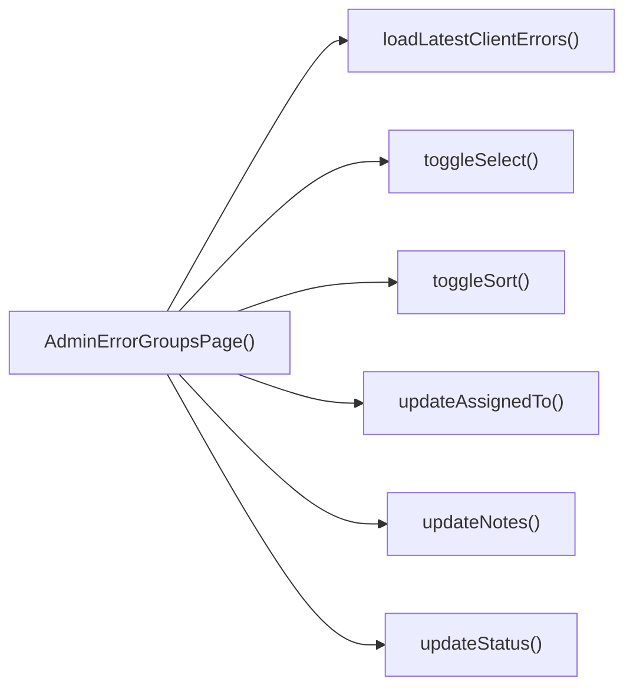

## Genel Bakış
Bu modül, Venthub HVAC platformunun yönetici arayüzünde sistem tarafından kaydedilen istemci hatalarını gruplar halinde yönetmek için geliştirilmiş bir React sayfa bileşenidir. Yöneticilerin hata gruplarını görüntülemesi, sıralaması, durumlarını güncellemesi, sorumlu ataması, not eklemesi ve toplu işlemler yapması gibi tüm temel yönetim işlevlerini tek bir noktada sunar.

## Fonksiyon Grupları
### Ana Bileşen ve Temel Arayüz Etkileşimleri
Sayfanın ana React bileşenini ve yöneticinin arayüzde hata gruplarını sıralama, tekil grupları seçim listesine ekleme/çıkarma gibi temel etkileşimlerini yöneten fonksiyonları barındırır.
- AdminErrorGroupsPage, toggleSort, toggleSelect

### Tekil Hata Grubu Yönetim İşlevleri
Seçilen tek bir hata grubu üzerinde durum güncelleme, sorumlu kullanıcı atama, not ekleme ve gruba ait en yeni hataları yükleme gibi detay yönetim işlemlerini gerçekleştiren asenkron fonksiyonlardır.
- updateStatus, updateAssignedTo, updateNotes, loadLatestClientErrors

### Toplu Hata Grubu İşlemleri
Birden fazla seçili hata grubuna aynı anda işlem uygulamak için kullanılan fonksiyondur, seçili tüm gruplara toplu olarak durum atanmasını sağlar.
- bulkApplyStatus

---

## AXIOMS – Mimari Varsayımlar
Bu React tabanlı admin paneli hata grupları yönetim sayfası modülünün sorunsuz çalışması için yetkili kullanıcı oturumu, hata grupları üzerinde okuma/yazma işlemlerini destekleyen çalışan bir arka uç API'si ve tüm fonksiyonlara gönderilen parametrelerin tanımlı tip kısıtlamalarına uyması zorunludur.

[Aksiyom 1]: Eğer `toggleSort` fonksiyonuna gönderilen `by` parametresi sadece 'last_seen' veya 'count' değerlerinden birini almıyorsa, sayfadaki hata grubu sıralama mantığı çalışmaz, gruplar yanlış veya hiç sıralanmadan görüntülenir.
[Aksiyom 2]: Eğer `updateStatus`, `updateAssignedTo`, `updateNotes`, `loadLatestClientErrors` ve `toggleSelect` fonksiyonlarına gönderilen `id`/`groupId` parametreleri sistemde kayıtlı mevcut bir hata grubu kimliği ile eşleşmiyorsa, ilgili işlemler hedef gruba uygulanamaz, sayfa state'inde beklenmedik hatalar oluşur.
[Aksiyom 3]: Eğer `updateStatus` fonksiyonuna gönderilen `newStatus` parametresi 'open', 'resolved' veya 'ignored' değerlerinden birini almıyorsa, durum güncelleme isteği arka uç tarafından reddedilir, ilgili grubun durumu değişmez.
[Aksiyom 4]: Eğer arka uç API, bu modüldeki tüm yazma işlemleri (durum, atama, not, toplu durum güncelleme) isteklerine başarılı yanıt vermiyorsa, kullanıcı tarafından yapılan tüm değişiklikler kalıcı olarak kaydedilemez, sayfa yenilenmesiyle tüm işlemler kaybolur.
[Aksiyom 5]: Eğer `bulkApplyStatus` fonksiyonu çalıştırılmadan önce hiçbir hata grubu `toggleSelect` ile seçilmemişse, toplu durum uygulama işlemi hiçbir grubu etkilemez, kullanıcıya herhangi bir değişiklik sunulamaz.
[Aksiyom 6]: Eğer sayfaya erişen kullanıcının admin yetkisi bulunmuyorsa, tüm yazma izni gerektiren fonksiyonların istekleri arka uç tarafından reddedilir, hiçbir işlem kalıcı olarak kaydedilemez.

---

## FONKSIYON DETAYLARI

### AdminErrorGroupsPage
**Ne yapar**: VentHub HVAC sisteminin admin paneline ait hata gruplarını görüntüleyen ve yöneten ana sayfa React bileşenidir. Tüm hata grubu yönetim işlevlerini barındıran ana arayüzü oluşturur, adminlerin sistemde oluşan tüm hata gruplarını tek bir yerden takip etmesini sağlar.
**Nasıl yapar**: Sayfa içindeki tüm alt işlevleri (sıralama, durum güncelleme, toplu işlemler, hata detayı yükleme vb.) yönetir, React bileşeni olarak sayfa yapısını oluşturur ve tüm kullanıcı etkileşimlerini işleyerek ilgili işlevleri tetikler. Yerel state yönetimi ile sayfa içindeki tüm verilerin güncel kalmasını sağlar.
**Parametreler**: Bu fonksiyona giriş parametresi tanımlanmamıştır.
**Dönüş**: React.FC türünde bir React sayfa bileşeni döndürür.

### toggleSort
**Ne yapar**: Hata grupları listesinin sıralama kriterini değiştiren işlevdir. Kullanıcıların listeyi istenen kritere göre sıralamasını sağlayarak hata gruplarını kolayca filtrelemesine imkan tanır.
**Nasıl yapar**: Gelen sıralama kriterine göre sayfanın sıralama state'ini günceller, mevcut sıralama yönünü tersine çevirir veya yeni kriteri uygulayarak hata grubu listesinin yeniden sıralanmasını tetikler.
**Parametreler**:
- name: by, type: 'last_seen' | 'count' — Sıralama yapılacak ana kriter, sadece son görülme zamanı (last_seen) veya hata oluşum sayısı (count) değerlerini alabilir
**Dönüş**: Dönüş türü belirtilmemiştir, void türündedir.

### updateStatus
**Ne yapar**: Tek bir hata grubunun mevcut durumunu güncelleyen işlevdir. Hata gruplarını açık, çözülmüş veya yok sayılmış olarak işaretlemek için kullanılır, hata yaşam döngüsü takibini mümkün kılar.
**Nasıl yapar**: Gelen hata grubu kimliği ile eşleşen kaydı bulur, hem yerel state'teki hem de arka plan sunucusundaki ilgili kaydın durum alanını yeni gelen değerle güncelleyerek verilerin senkronize kalmasını sağlar.
**Parametreler**:
- name: id, type: string — Durumu güncellenecek hata grubunun benzersiz kimliği
- name: newStatus, type: 'open' | 'resolved' | 'ignored' — Hata grubuna atanacak yeni durum, sadece açık (open), çözülmüş (resolved) veya yok sayılmış (ignored) değerlerini alabilir
**Dönüş**: Dönüş türü belirtilmemiştir, void türündedir.

### updateAssignedTo
**Ne yapar**: Bir hata grubuna sorumlu kullanıcı atayan veya mevcut atamayı kaldıran işlevdir. Hata gruplarının sorumluluk dağılımını yöneterek hangi hatanın kim tarafından inceleneceğini takip etmeyi sağlar.
**Nasıl yapar**: İlgili hata grubu kaydının atanmış kullanıcı kimliği alanını günceller, atama kaldırılmak istendiğinde gelen boş string değeri ile kaydın atama alanını sıfırlar, hem yerel hem sunucu verisini günceller.
**Parametreler**:
- name: id, type: string — Atama işlemi yapılacak hata grubunun benzersiz kimliği
- name: userId, type: string | '' — Hata grubuna atanacak kullanıcının benzersiz kimliği, mevcut atamayı kaldırmak için boş string değeri kullanılır
**Dönüş**: Dönüş türü belirtilmemiştir, void türündedir.

### updateNotes
**Ne yapar**: Bir hata grubuna özel not ekleme veya mevcut notları güncelleme işlevidir. Adminlerin hata grupları hakkında ek bilgi, çözüm adımları veya notlar saklamasını sağlayarak hata inceleme sürecini destekler.
**Nasıl yapar**: Gelen hata grubu kimliği ile eşleşen kaydın notlar alanını yeni girilen metin ile günceller, hem yerel state hem de sunucu üzerindeki veriyi senkronize olarak güncel tutar.
**Parametreler**:
- name: id, type: string — Notları güncellenecek hata grubunun benzersiz kimliği
- name: notes, type: string — Hata grubuna kaydedilecek yeni not metni
**Dönüş**: Dönüş türü belirtilmemiştir, void türündedir.

### loadLatestClientErrors
**Ne yapar**: Belirli bir hata grubu ile ilişkili en son istemci tarafı hatalarını sunucudan yükleyen işlevdir. Hata grubu detaylarını görüntülerken ilgili son hataları listelemek için kullanılır, hata kök nedenini analiz etmeye yardımcı olur.
**Nasıl yapar**: İstenen hata grubunun kimliği ile sunucudan ilgili son istemci hatalarını çeker, sayfa içindeki detay panelinde görüntülenmek üzere yüklenen verileri yerel state'e kaydeder.
**Parametreler**:
- name: groupId, type: string — İstemci hataları yüklenecek hata grubunun benzersiz kimliği
**Dönüş**: Dönüş türü belirtilmemiştir, void türündedir.

### toggleSelect
**Ne yapar**: Tek bir hata grubunun toplu işlemler için seçilme durumunu değiştiren işlevdir. Kullanıcıların birden fazla hata grubu üzerinde toplu işlem yapabilmesi için seçim yapmalarını sağlar, tek tek işlem yapma yükünü ortadan kaldırır.
**Nasıl yapar**: İlgili hata grubunun seçili olup olmadığını belirten bayrağı, girilen on parametresinin değerine göre ayarlar, true değeri ile hata grubunu toplu işlem seçim listesine ekler, false değeri ile listeden çıkarır.
**Parametreler**:
- name: id, type: string — Seçim durumu güncellenecek hata grubunun benzersiz kimliği
- name: on, type: boolean — Hata grubunun seçili olup olmayacağını belirten boolean değer, true ise seçilir, false ise seçim listesinden çıkarılır
**Dönüş**: Dönüş türü belirtilmemiştir, void türündedir.

### bulkApplyStatus
**Ne yapar**: Önceden toggleSelect ile seçilmiş tüm hata gruplarına toplu olarak aynı durum atamasını yapan işlevdir. Birden fazla hatayı tek seferde yönetmek için kullanılır, adminlerin aynı işlemi tekrar tekrar yapma yükünü azaltır.
**Nasıl yapar**: Seçilmiş tüm hata gruplarının kimliklerini toplar, updateStatus işlevini her bir kimlik için çağırarak aynı yeni durumu tüm seçili hata gruplarına uygular, toplu işlem sonrası seçim listesini sıfırlar.
**Parametreler**: Bu fonksiyona giriş parametresi tanımlanmamıştır.
**Dönüş**: Dönüş türü belirtilmemiştir, void türündedir.

---

## INTERFACES

### ErrorGroup
- `id: string`
- `signature: string`
- `level: string | null`
- `last_message: string | null`
- `url_sample: string | null`
- `env: string | null`
- `release: string | null`
- `first_seen: string`
- `last_seen: string`
- `count: number`
- `status: 'open' | 'resolved' | 'ignored'`
- `assigned_to: string | null`
- `notes: string | null`

### AdminUserOpt
- `id: string`
- `email: string`
- `full_name?: string | null`

### ClientErrorRow
- `id: string`
- `at: string`
- `url?: string | null`
- `message: string`
- `stack?: string | null`
- `user_agent?: string | null`
- `release?: string | null`
- `env?: string | null`
- `level?: string | null`

---

## AST POINTERS

### [N1_NASIL] AST Pointer: C:\Users\alize\venthub-hvac\src\views\admin\AdminErrorGroupsPage.tsx::mount_init_localstorage
- **params**: (parametre yok)
- **ic_degiskenler**:
  - `c` — localStorage'dan okunan görünür sütun ayarlarının JSON string değeri
  - `d` — localStorage'dan okunan tablo yoğunluk ayarının string değeri
  - `setVisibleCols` — görünür sütunları güncelleyen state setter fonksiyonu
  - `setDensity` — tablo yoğunluğunu güncelleyen state setter fonksiyonu
  - `STORAGE_KEY` — localStorage anahtarları için kullanılan sabit önek
- **Dönüş**: void (sunucu tarafında erken dönüş yapar)

### [N2_NASIL] AST Pointer: C:\Users\alize\venthub-hvac\src\views\admin\AdminErrorGroupsPage.tsx::save_visible_cols_to_localstorage
- **params**: (parametre yok)
- **ic_degiskenler**:
  - `visibleCols` — güncel görünür sütun state değeri
  - `STORAGE_KEY` — localStorage anahtarları için kullanılan sabit önek
- **Dönüş**: void

### [N3_NASIL] AST Pointer: C:\Users\alize\venthub-hvac\src\views\admin\AdminErrorGroupsPage.tsx::save_density_to_localstorage
- **params**: (parametre yok)
- **ic_degiskenler**:
  - `density` — güncel tablo yoğunluk state değeri
  - `STORAGE_KEY` — localStorage anahtarları için kullanılan sabit önek
- **Dönüş**: void

### [N4_NASIL] AST Pointer: C:\Users\alize\venthub-hvac\src\views\admin\AdminErrorGroupsPage.tsx::toggleSort
- **params**: by: 'last_seen' | 'count'
- **ic_degiskenler**:
  - `setSortBy` — sıralama sütununu güncelleyen state setter
  - `setSortDir` — sıralama yönünü güncelleyen state setter
  - `prev` — setSortBy callback'inde gelen önceki sortBy değeri
  - `d` — setSortDir callback'inde gelen önceki sortDir değeri
- **Dönüş**: yok

### [N5_NASIL] AST Pointer: C:\Users\alize\venthub-hvac\src\views\admin\AdminErrorGroupsPage.tsx::setSortBy_internal_callback
- **params**: prev (önceki sortBy değeri)
- **ic_degiskenler**:
  - `by` — üst kapsamdaki toggleSort fonksiyonundan gelen sıralama sütunu
  - `setSortDir` — sıralama yönünü güncelleyen state setter
- **Dönüş**: önceki veya yeni sortBy değeri

### [N6_NASIL] AST Pointer: C:\Users\alize\venthub-hvac\src\views\admin\AdminErrorGroupsPage.tsx::debounce_search_cleanup
- **params**: (parametre yok)
- **ic_degiskenler**:
  - `t` - kurulan setTimeout ID'si
  - `setDebouncedQ` - arama sorgusunu 300ms gecikmeyle güncelleyen state setter
  - `q` - girilen güncel ham arama sorgusu
- **Dönüş**: clearTimeout'u çağıran temizleme fonksiyonu, void

### [N7_NASIL] AST Pointer: C:\Users\alize\venthub-hvac\src\views\admin\AdminErrorGroupsPage.tsx::load_admin_users
- **params**: (parametre yok)
- **ic_degiskenler**:
  - `supabase.rpc('admin_list_users')` - admin yetkisiyle kullanıcı listesi çeken secure RPC çağrısı
  - `data` - RPC'den dönen kullanıcı listesi ham verisi
  - `error` - RPC çağrısı sırasında oluşan hata
  - `list` - formatlanmış AdminUserOpt tipinde kullanıcı listesi
  - `u` - map fonksiyonunda işlenen tek kullanıcı nesnesi
  - `setUsers` - kullanıcı listesini state'e kaydeden setter
- **Dönüş**: void

### [N8_NASIL] AST Pointer: C:\Users\alize\venthub-hvac\src\views\admin\AdminErrorGroupsPage.tsx::map_raw_user_to_adminopt
- **params**: u (ham kullanıcı nesnesi)
- **ic_degiskenler**:
  - `u.id` - kullanının benzersiz ID'si
  - `u.email` - kullanının email adresi
  - `u.full_name` - kullanının tam adı (null olabilir)
- **Dönüş**: formatlanmış AdminUserOpt tipinde kullanıcı nesnesi

### [N9_NASIL] AST Pointer: C:\Users\alize\venthub-hvac\src\views\admin\AdminErrorGroupsPage.tsx::fetch_error_groups
- **params**: (parametre yok)
- **ic_degiskenler**:
  - `setLoading` - yükleme durumunu ayarlayan state setter
  - `setError` - hata durumunu ayarlayan state setter
  - `supabase.from('error_groups')` - error_groups tablosundan sorgu oluşturan Supabase client
  - `sortBy` - güncel sıralama sütunu
  - `sortDir` - güncel sıralama yönü
  - `fromDate` - filtre için başlangıç tarihi
  - `toDate` - filtre için bitiş tarihi
  - `level` - filtre için hata seviyesi
  - `status` - filtre için grup durumu
  - `assigned` - filtre için atanan kullanıcı ID'si
  - `debouncedQ` - gecikmeli arama sorgusu
  - `like` - SQL ILIKE operatörü için wildcard'lı arama deseni
  - `from` - sayfalama için başlangıç indeksi
  - `to` - sayfalama için bitiş indeksi
  - `PAGE_SIZE` - tek sayfada gösterilecek kayıt sayısı sabiti
  - `data` - sorgudan dönen error grubu listesi
  - `error` - sorgu hatası
  - `count` - toplam kayıt sayısı
  - `setRows` - error grubu satırlarını state'e kaydeden setter
  - `setTotal` - toplam kayıt sayısını state'e kaydeden setter
  - `e` - yakalanan hata nesnesi
- **Dönüş**: Promise<void>

### [N10_NASIL] AST Pointer: C:\Users\alize\venthub-hvac\src\views\admin\AdminErrorGroupsPage.tsx::schedule_refetch
- **params**: (parametre yok)
- **ic_degiskenler**:
  - `refetchTimer.current` - mevcut bekleyen zamanlayıcı ID'si
  - `fetchRef.current` - verileri tekrar yükleyen ana fetch fonksiyonu referansı
- **Dönüş**: void

### [N11_NASIL] AST Pointer: C:\Users\alize\venthub-hvac\src\views\admin\AdminErrorGroupsPage.tsx::setup_realtime_channel
- **params**: (parametre yok)
- **ic_degiskenler**:
  - `ch` - oluşturulan Supabase realtime kanal nesnesi
  - `supabase.channel` - realtime kanal oluşturan Supabase metodu
  - `scheduleRefetch` - veri yeniden yüklemeyi zamanlayan fonksiyon
  - `supabase.removeChannel` - kanalı temizleyen Supabase metodu
- **Dönüş**: kanalı temizleyen useEffect temizleme fonksiyonu, void

### [N12_NASIL] AST Pointer: C:\Users\alize\venthub-hvac\src\views\admin\AdminErrorGroupsPage.tsx::updateStatus
- **params**: id: string, newStatus: 'open' | 'resolved' | 'ignored'
- **ic_degiskenler**:
  - `prev` - güncelleme öncesi mevcut satır listesi yedeği
  - `setRows` - satır listesini güncelleyen state setter
  - `r` - map fonksiyonunda işlenen tek error grubu satırı
  - `supabase.from('error_groups').update` - durum güncellemesi yapan Supabase sorgusu
  - `error` - sorgu sırasında oluşan hata
- **Dönüş**: Promise<void>

### [N13_NASIL] AST Pointer: C:\Users\alize\venthub-hvac\src\views\admin\AdminErrorGroupsPage.tsx::updateAssignedTo
- **params**: id: string, userId: string | ''
- **ic_degiskenler**:
  - `val` - boş string gelmesi halinde null'a çevrilen atanacak kullanıcı ID'si
  - `prev` - güncelleme öncesi satır listesi yedeği
  - `setRows` - satır listesini güncelleyen state setter
  - `r` - map'te işlenen tek satır
  - `supabase.from('error_groups').update` - atanan kullanıcıyı güncelleyen Supabase sorgusu
  - `error` - sorgu hatası
- **Dönüş**: Promise<void>

### [N14_NASIL] AST Pointer: C:\Users\alize\venthub-hvac\src\views\admin\AdminErrorGroupsPage.tsx::updateNotes
- **params**: id: string, notes: string
- **ic_degiskenler**:
  - `prev` - güncelleme öncesi satır listesi yedeği
  - `setRows` - satır listesini güncelleyen state setter
  - `r` - map'te işlenen tek satır
  - `supabase.from('error_groups').update` - notları güncelleyen Supabase sorgusu
  - `error` - sorgu hatası
- **Dönüş**: Promise<void>

### [N15_NASIL] AST Pointer: C:\Users\alize\venthub-hvac\src\views\admin\AdminErrorGroupsPage.tsx::loadLatestClientErrors
- **params**: groupId: string
- **ic_degiskenler**:
  - `queryResult` - client_errors tablosundan dönen sorgu sonucu
  - `supabase.from('client_errors').select` - hata kayıtlarını çeken Supabase sorgusu
  - `data` - sorgudan dönen client hatası listesi
  - `error` - sorgu hatası
  - `setLatestClientErrors` - yüklenen son hataları state'e kaydeden setter
- **Dönüş**: Promise<void>

### [N16_NASIL] AST Pointer: C:\Users\alize\venthub-hvac\src\views\admin\AdminErrorGroupsPage.tsx::export_all_error_groups
- **params**: (parametre yok)
- **ic_degiskenler**:
  - `CHUNK` - toplu veri çekerken kullanılacak parça boyutu sabiti (1000)
  - `offset` - sorgu için mevcut başlangıç ofseti
  - `all` - birleştirilmiş tüm error grubu listesi
  - `makeQuery` - filtreleri ve sıralamayı uygulayan sorgu üretici fonksiyon
  - `data` - parça sorgusundan dönen veri
  - `error` - parça sorgusu hatası
  - `chunk` - çeken mevcut veri parçası
  - `header` - CSV dosyasının başlık satırı
  - `escape` - CSV değerlerini özel karakterler için formatlayan fonksiyon
  - `rowsCsv` - tüm satırların CSV formatına çevrilmiş listesi
  - `csv` - birleştirilmiş tam CSV string'i
  - `blob` - CSV'den oluşturulan Blob nesnesi
  - `url` - Blob için oluşturulan geçici URL
  - `a` - indirme işlemi için oluşturulan <a> DOM elementi
  - `e` - yakalanan hata nesnesi
- **Dönüş**: Promise<void>

### [N17_NASIL] AST Pointer: C:\Users\alize\venthub-hvac\src\views\admin\AdminErrorGroupsPage.tsx::csv_escape_value
- **params**: v: unknown
- **ic_degiskenler**:
  - `s` - değeri string'e çevrilip temizlenmiş hali
- **Dönüş**: CSV uyumlu formatlanmış string

### [N18_NASIL] AST Pointer: C:\Users\alize\venthub-hvac\src\views\admin\AdminErrorGroupsPage.tsx::toggleSelect
- **params**: id: string, on: boolean
- **ic_degiskenler**:
  - `setSelectedIds` - seçili satır ID'lerini güncelleyen state setter
  - `prev` - önceki seçili ID listesi
  - `x` - filter fonksiyonunda işlenen ID
- **Dönüş**: void

### [N19_NASIL] AST Pointer: C:\Users\alize\venthub-hvac\src\views\admin\AdminErrorGroupsPage.tsx::bulkApplyStatus
- **params**: (parametre yok)
- **ic_degiskenler**:
  - `selectedIds` - seçili olan tüm satır ID'leri
  - `setSavingBulk` - toplu güncelleme yükleme durumunu ayarlayan setter
  - `bulkStatus` - uygulanacak toplu durum değeri
  - `supabase.from('error_groups').update` - birden fazla satırın durumunu güncelleyen Supabase sorgusu
  - `error` - sorgu hatası
  - `setRows` - satır listesini güncelleyen state setter
  - `r` - map'te işlenen tek satır
  - `setSelectedIds` - seçili ID'leri sıfırlayan setter
  - `e` - yakalanan hata nesnesi
- **Dönüş**: Promise<void>

---

## ÇAĞRI HARİTASI

### Disariya Cagrilar (Outgoing)
Dosya içindeki ana fonksiyon AdminErrorGroupsPage(), hata grupları sayfasının tüm işlevlerini yürütmek için sıralama, hata listesi yükleme, sorumlu atama, durum güncelleme, seçim işlemleri ve not güncelleme süreçlerini yönetmek üzere toggleSort, loadLatestClientErrors, updateAssignedTo, updateStatus, toggleSelect ve updateNotes fonksiyonlarını çağırır.

### Disaridan Cagrilanlar (Incoming)
Sağlanan veride bu modülü kullanan herhangi bir dış dosya veya fonksiyon bilgisi bulunmamaktadır.

### Ic Ice Fonksiyonlar (Nested)
Yok

---

## DOSYA-İÇİ ÇAĞRI GRAFİĞİ
  AdminErrorGroupsPage() → loadLatestClientErrors()
  AdminErrorGroupsPage() → toggleSelect()
  AdminErrorGroupsPage() → toggleSort()
  AdminErrorGroupsPage() → updateAssignedTo()
  AdminErrorGroupsPage() → updateNotes()
  AdminErrorGroupsPage() → updateStatus()

---

## NODE ID STANDARD

  file: src\views\admin\AdminErrorGroupsPage.tsx
  function: src\views\admin\AdminErrorGroupsPage.tsx::AdminErrorGroupsPage
  function: src\views\admin\AdminErrorGroupsPage.tsx::toggleSort
  function: src\views\admin\AdminErrorGroupsPage.tsx::updateStatus
  function: src\views\admin\AdminErrorGroupsPage.tsx::updateAssignedTo
  function: src\views\admin\AdminErrorGroupsPage.tsx::updateNotes
  function: src\views\admin\AdminErrorGroupsPage.tsx::loadLatestClientErrors
  function: src\views\admin\AdminErrorGroupsPage.tsx::toggleSelect
  function: src\views\admin\AdminErrorGroupsPage.tsx::bulkApplyStatus

---

## DISA AKTARILANLAR (EXPORTS)
  export: AdminErrorGroupsPage