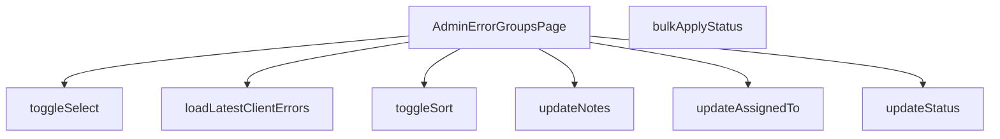

## Genel Bakış
Bu modül, yönetici panelindeki hata gruplarını yönetmek için kullanılan bir React sayfasıdır. Sistemde kaydedilen istemci hatalarını gruplar halinde sunar ve yöneticilerin bu grupları sıralamasına, durumlarını değiştirmesine, sorumlu ataması yapmasına ve notlar eklemesine olanak tanır. Modül, hem toplu işlemleri hem de bireysel grup detaylarını tek bir arayüz altında birleştirerek hata yönetimi süreçlerini merkezileştirir.

## Fonksiyon Grupları
### Ana Sayfa Yapısı ve Arayüz Etkileşimleri
Modülün temelini oluşturan ana bileşeni ve sayfa üzerindeki genel sıralama ile seçim kontrollerini yönetir.
- AdminErrorGroupsPage, toggleSort, toggleSelect

### Bireysel Hata Grubu Yönetim İşlemleri
Belirli bir hata grubu üzerinde gerçekleştirilerek durum güncelleme, sorumlu atama, not ekleme ve o gruba ait en son hata kayıtlarını getirme gibi detaylı operasyonları kapsar.
- updateStatus, updateAssignedTo, updateNotes, loadLatestClientErrors

### Toplu İşlem Yönetimi
Seçili olan birden fazla hata grubuna aynı anda belirli bir durum değişikliğini uygulamak için kullanılan verimli toplu işleme fonksiyonudur.
- bulkApplyStatus

---

## AXIOMS – Mimari Varsayımlar

Bu modül, hata grupları listesini yöneten bir yönetici sayfasıdır ve seçim/durum durumlarını bileşen içi state'te tutar.

[Aksiyom 1]: Eğer `toggleSort` fonksiyonuna `'last_seen'` veya `'count'` dışında bir değer verilirse, sıralama davranışı tanımsızdır.

[Aksiyom 2]: Eğer `updateStatus` fonksiyonuna `'open'`, `'resolved'` veya `'ignored'` dışında bir durum değeri verilirse, güncelleme davranışı tanımsızdır.

[Aksiyom 3]: Eğer `updateAssignedTo` fonksiyonuna boş string (`''`) verilirse, ilgili hata grubunun sorumlusu kaldırılır (atama temizlenir).

[Aksiyom 4]: Eğer `bulkApplyStatus` çağrıldığında hiçbir hata grubu seçili (`toggleSelect` ile `on: true` yapılmamış) değilse, toplu güncelleme işlemi hiçbir kayıt üzerinde etkili olmaz.

[Aksiyom 5]: Eğer `bulkApplyStatus` çağrıldığında uygulanacak geçerli bir durum değeri (`'open'`, `'resolved'` veya `'ignored'`) bileşen state'inde mevcut değilse, toplu güncelleme davranışı tanımsızdır.

[Aksiyom 6]: Eğer `loadLatestClientErrors` fonksiyonuna geçerli bir `groupId` verilmezse (boş string veya olmayan bir ID), istemci hata kayıtları yüklenmez.

[Aksiyom 7]: Eğer `updateNotes` fonksiyonuna geçersiz bir `id` verilse bile, fonksiyon varolan kayıtlar üzerinde dış etki (side effect) oluşturmaz; yalnızca eşleşen kayıt varsa güncellenir.

[Aksiyom 8]: `bulkApplyStatus` fonksiyonu parametre almaz; bu durum, uygulanacak durum değerinin fonksiyon çağrılmadan önce bileşen içi state'inde önceden ayarlanması gerektiğini varsayar.

---

## FONKSİYON DETAYLARI

### AdminErrorGroupsPage
**Ne yapar**: VentHub HVAC sisteminin admin paneline ait hata gruplarını görüntüleyen ve yöneten ana sayfa React bileşenidir. Tüm hata grubu yönetim işlevlerini barındıran ana arayüzü oluşturur, adminlerin sistemde oluşan tüm hata gruplarını tek bir yerden takip etmesini sağlar.
**Nasıl yapar**: Sayfa içindeki tüm alt işlevleri (sıralama, durum güncelleme, toplu işlemler, hata detayı yükleme vb.) yönetir, React bileşeni olarak sayfa yapısını oluşturur ve tüm kullanıcı etkileşimlerini işleyerek ilgili işlevleri tetikler. Yerel state yönetimi ile sayfa içindeki tüm verilerin güncel kalmasını sağlar.
**Parametreler**: Bu fonksiyona giriş parametresi tanımlanmamıştır.
**Dönüş**: React.FC türünde bir React sayfa bileşeni döndürür.

### toggleSort
**Ne yapar**: Hata grupları listesinin sıralama kriterini değiştiren işlevdir. Kullanıcıların listeyi istenen kritere göre sıralamasını sağlayarak hata gruplarını kolayca filtrelemesine imkan tanır.
**Nasıl yapar**: Gelen sıralama kriterine göre sayfanın sıralama state'ini günceller, mevcut sıralama yönünü tersine çevirir veya yeni kriteri uygulayarak hata grubu listesinin yeniden sıralanmasını tetikler.
**Parametreler**:
- name: by, type: 'last_seen' | 'count' — Sıralama yapılacak ana kriter, sadece son görülme zamanı (last_seen) veya hata oluşum sayısı (count) değerlerini alabilir
**Dönüş**: Dönüş türü belirtilmemiştir, void türündedir.

### updateStatus
**Ne yapar**: Tek bir hata grubunun mevcut durumunu güncelleyen işlevdir. Hata gruplarını açık, çözülmüş veya yok sayılmış olarak işaretlemek için kullanılır, hata yaşam döngüsü takibini mümkün kılar.
**Nasıl yapar**: Gelen hata grubu kimliği ile eşleşen kaydı bulur, hem yerel state'teki hem de arka plan sunucusundaki ilgili kaydın durum alanını yeni gelen değerle güncelleyerek verilerin senkronize kalmasını sağlar.
**Parametreler**:
- name: id, type: string — Durumu güncellenecek hata grubunun benzersiz kimliği
- name: newStatus, type: 'open' | 'resolved' | 'ignored' — Hata grubuna atanacak yeni durum, sadece açık (open), çözülmüş (resolved) veya yok sayılmış (ignored) değerlerini alabilir
**Dönüş**: Dönüş türü belirtilmemiştir, void türündedir.

### updateAssignedTo
**Ne yapar**: Bir hata grubuna sorumlu kullanıcı atayan veya mevcut atamayı kaldıran işlevdir. Hata gruplarının sorumluluk dağılımını yöneterek hangi hatanın kim tarafından inceleneceğini takip etmeyi sağlar.
**Nasıl yapar**: İlgili hata grubu kaydının atanmış kullanıcı kimliği alanını günceller, atama kaldırılmak istendiğinde gelen boş string değeri ile kaydın atama alanını sıfırlar, hem yerel hem sunucu verisini günceller.
**Parametreler**:
- name: id, type: string — Atama işlemi yapılacak hata grubunun benzersiz kimliği
- name: userId, type: string | '' — Hata grubuna atanacak kullanıcının benzersiz kimliği, mevcut atamayı kaldırmak için boş string değeri kullanılır
**Dönüş**: Dönüş türü belirtilmemiştir, void türündedir.

### updateNotes
**Ne yapar**: Bir hata grubuna özel not ekleme veya mevcut notları güncelleme işlevidir. Adminlerin hata grupları hakkında ek bilgi, çözüm adımları veya notlar saklamasını sağlayarak hata inceleme sürecini destekler.
**Nasıl yapar**: Gelen hata grubu kimliği ile eşleşen kaydın notlar alanını yeni girilen metin ile günceller, hem yerel state hem de sunucu üzerindeki veriyi senkronize olarak güncel tutar.
**Parametreler**:
- name: id, type: string — Notları güncellenecek hata grubunun benzersiz kimliği
- name: notes, type: string — Hata grubuna kaydedilecek yeni not metni
**Dönüş**: Dönüş türü belirtilmemiştir, void türündedir.

### loadLatestClientErrors
**Ne yapar**: Belirli bir hata grubu ile ilişkili en son istemci tarafı hatalarını sunucudan yükleyen işlevdir. Hata grubu detaylarını görüntülerken ilgili son hataları listelemek için kullanılır, hata kök nedenini analiz etmeye yardımcı olur.
**Nasıl yapar**: İstenen hata grubunun kimliği ile sunucudan ilgili son istemci hatalarını çeker, sayfa içindeki detay panelinde görüntülenmek üzere yüklenen verileri yerel state'e kaydeder.
**Parametreler**:
- name: groupId, type: string — İstemci hataları yüklenecek hata grubunun benzersiz kimliği
**Dönüş**: Dönüş türü belirtilmemiştir, void türündedir.

### toggleSelect
**Ne yapar**: Tek bir hata grubunun toplu işlemler için seçilme durumunu değiştiren işlevdir. Kullanıcıların birden fazla hata grubu üzerinde toplu işlem yapabilmesi için seçim yapmalarını sağlar, tek tek işlem yapma yükünü ortadan kaldırır.
**Nasıl yapar**: İlgili hata grubunun seçili olup olmadığını belirten bayrağı, girilen on parametresinin değerine göre ayarlar, true değeri ile hata grubunu toplu işlem seçim listesine ekler, false değeri ile listeden çıkarır.
**Parametreler**:
- name: id, type: string — Seçim durumu güncellenecek hata grubunun benzersiz kimliği
- name: on, type: boolean — Hata grubunun seçili olup olmayacağını belirten boolean değer, true ise seçilir, false ise seçim listesinden çıkarılır
**Dönüş**: Dönüş türü belirtilmemiştir, void türündedir.

### bulkApplyStatus
**Ne yapar**: Önceden toggleSelect ile seçilmiş tüm hata gruplarına toplu olarak aynı durum atamasını yapan işlevdir. Birden fazla hatayı tek seferde yönetmek için kullanılır, adminlerin aynı işlemi tekrar tekrar yapma yükünü azaltır.
**Nasıl yapar**: Seçilmiş tüm hata gruplarının kimliklerini toplar, updateStatus işlevini her bir kimlik için çağırarak aynı yeni durumu tüm seçili hata gruplarına uygular, toplu işlem sonrası seçim listesini sıfırlar.
**Parametreler**: Bu fonksiyona giriş parametresi tanımlanmamıştır.
**Dönüş**: Dönüş türü belirtilmemiştir, void türündedir.

---

## INTERFACES

### ErrorGroup
- `id: string`
- `signature: string`
- `level: string | null`
- `last_message: string | null`
- `url_sample: string | null`
- `env: string | null`
- `release: string | null`
- `first_seen: string`
- `last_seen: string`
- `count: number`
- `status: 'open' | 'resolved' | 'ignored'`
- `assigned_to: string | null`
- `notes: string | null`

### AdminUserOpt
- `id: string`
- `email: string`
- `full_name?: string | null`

### ClientErrorRow
- `id: string`
- `at: string`
- `url?: string | null`
- `message: string`
- `stack?: string | null`
- `user_agent?: string | null`
- `release?: string | null`
- `env?: string | null`
- `level?: string | null`

---

## AST POINTERS

### [N1_NASIL] AST Pointer: src\views\admin\AdminErrorGroupsPage.tsx::AdminErrorGroupsPage
- **params**: ()
- **ic_degiskenler**:
- **Dönüş**: React.FC bileşeni; hata gruplarını yöneten, filtreleyen ve gösteren React bileşeni

### [N2_NASIL] AST Pointer: src\views\admin\AdminErrorGroupsPage.tsx::toggleSort
- **params**: (by: 'last_seen' | 'count')
- **ic_degiskenler**:
- **Dönüş**: yok

### [N3_NASIL] AST Pointer: src\views\admin\AdminErrorGroupsPage.tsx::updateStatus
- **params**: (id: string, newStatus: 'open' | 'resolved' | 'ignored')
- **ic_degiskenler**:
  - `prev` — güncelleme öncesi mevcut satır listesinin kopyası, hata durumunda geri almak için
- **Dönüş**: yok (async)

### [N4_NASIL] AST Pointer: src\views\admin\AdminErrorGroupsPage.tsx::updateAssignedTo
- **params**: (id: string, userId: string | '')
- **ic_degiskenler**:
  - `val` — boş string ise null, değilse userId değeri, atama işleminde kullanılır
  - `prev` — güncelleme öncesi mevcut satır listesinin kopyası, hata durumunda geri almak için
- **Dönüş**: yok (async)

### [N5_NASIL] AST Pointer: src\views\admin\AdminErrorGroupsPage.tsx::updateNotes
- **params**: (id: string, notes: string)
- **ic_degiskenler**:
  - `prev` — güncelleme öncesi mevcut satır listesinin kopyası, hata durumunda geri almak için
- **Dönüş**: yok (async)

### [N6_NASIL] AST Pointer: src\views\admin\AdminErrorGroupsPage.tsx::loadLatestClientErrors
- **params**: (groupId: string)
- **ic_degiskenler**:
  - `queryResult` — Supabase sorgusunun sonucu (data ve error içeren obje)
  - `data` — queryResult'dan gelen hata satırları dizisi
  - `error` — queryResult'dan gelen hata nesnesi
- **Dönüş**: yok (async)

### [N7_NASIL] AST Pointer: src\views\admin\AdminErrorGroupsPage.tsx::toggleSelect
- **params**: (id: string, on: boolean)
- **ic_degiskenler**:
- **Dönüş**: yok

### [N8_NASIL] AST Pointer: src\views\admin\AdminErrorGroupsPage.tsx::bulkApplyStatus
- **params**: ()
- **ic_degiskenler**: yok
- **Dönüş**: yok (async)

---

## MERMAID CALL GRAPH

## NODE ID STANDARD

  file: src\views\admin\AdminErrorGroupsPage.tsx
  function: src\views\admin\AdminErrorGroupsPage.tsx::AdminErrorGroupsPage
  function: src\views\admin\AdminErrorGroupsPage.tsx::toggleSort
  function: src\views\admin\AdminErrorGroupsPage.tsx::updateStatus
  function: src\views\admin\AdminErrorGroupsPage.tsx::updateAssignedTo
  function: src\views\admin\AdminErrorGroupsPage.tsx::updateNotes
  function: src\views\admin\AdminErrorGroupsPage.tsx::loadLatestClientErrors
  function: src\views\admin\AdminErrorGroupsPage.tsx::toggleSelect
  function: src\views\admin\AdminErrorGroupsPage.tsx::bulkApplyStatus

---

## DISA AKTARILANLAR (EXPORTS)
  export: AdminErrorGroupsPage

---

## STİL TOKENLERİ

### Arbitrary Değerler (token'a geçirilmemiş)
Yok — tüm stiller token'a geçirilmiş. ✅

### Kullanılan Token'lar (zaten token'a geçirilmiş)
- `tracking-hvac-normal`

### Tailwind Sınıf Özeti
- **Renkler:** `bg-amber-500/10`, `bg-cyan-500/10`, `bg-gray-50`, `bg-rose-500/10`, `bg-sky-500/10`, `bg-surface-deep`, `bg-white`, `bg-white/5`, `border-b`, `border-cyan-500/20`, `border-red-100`, `border-t`, `border-white/10`, `border-white/5`, `hover:bg-white/10`
- **Layout:** `!h-10`, `!h-8`, `backdrop-blur-md`, `flex`, `flex-col`, `gap-1`, `gap-2`, `gap-3`, `grid`, `grid-cols-1`, `h-7`, `inline-flex`, `items-center`, `justify-between`, `justify-center`
- **Varyant/Responsive:** `:`, `disabled:`, `hover:`, `last:`, `md:` önekleri
- **Yardımcı Sınıflar:** `!px-2`, `!py-1`, `!text-xs`, `$`, `${adminCardClass`, `${adminInputClass`, `${adminSelectClass`, `${adminTableCellClass`, `${adminTableHeadCellClass`, `${cellPad`, `${headPad`, `:`, `===`, `border`, `break-all`