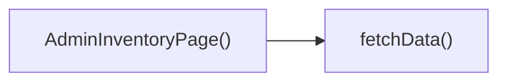

## Genel Bakış
Bu modül, VentHub HVAC projesinin yönetici paneli bünyesinde yer alan envanter yönetimi sayfasını oluşturur. React tabanlı bir kullanıcı arayüzü bileşeni olarak, yalnızca yetkili yönetici kullanıcıların sistemdeki envanter verilerine erişmesini ve görüntülemesini sağlar, sayfa için gerekli iş verilerini çekme yeteneğine de sahiptir.

## Fonksiyon Grupları
### Ana Sayfa Bileşeni
Modülün ana çıktısı olan, yönetici envanter sayfasının tüm kullanıcı arayüzünü ve temel çalışma altyapısını yöneten React tabanlı sayfa bileşenidir.
- AdminInventoryPage

### Veri Getirme İşlevleri
Sayfa üzerinde görüntülenecek envanter verilerinin uzaktan kaynaklardan güvenli şekilde çekilmesini sağlayan asenkron işlev grubudur.
- fetchData

---

## AXIOMS – Mimari Varsayımlar
Bu modül, VentHub HVAC sisteminin yönetici paneline ait envanter görüntüleme sayfasıdır, çalışması için frontend çalışma zamanı, yetki doğrulama mekanizması ve erişilebilir bir veri kaynağına bağımlıdır.

[Aksiyom 1]: Eğer React tabanlı frontend çalışma zamanı proje içinde aktif değilse, AdminInventoryPage bileşeni render edilemez, yönetici kullanıcıları envanter verilerini görüntüleyemez.
[Aksiyom 2]: Eğer fetchData fonksiyonunun erişmesi gereken backend veri kaynağı ağ üzerinden erişilebilir değilse, sayfa üzerindeki envanter verileri hiç yüklenemez, sayfa kalıcı olarak boş veya hata durumunda kalır.
[Aksiyom 3]: Eğer bu sayfaya erişmeden önce kullanıcının yönetici rolünü doğrulayan yetki kontrol mekanizması çalışmıyorsa, yetkisiz kullanıcılar hassas envanter verilerine erişebilir, güvenlik ihlali oluşur.
[Aksiyom 4]: Eğer modülün gerektirdiği TypeScript ve React tabanlı temel frontend bağımlılıkları proje bağımlılık listesinde eksikse, modül derleme aşamasında hata verir, üretim ortamına aktarılamaz.

---

## FONKSIYON DETAYLARI

### AdminInventoryPage
**Ne yapar**: VentHub HVAC projesinin admin paneline ait envanter yönetimi sayfasını oluşturan React bileşenidir. Sadece admin yetkisine sahip kullanıcıların erişebildiği bu sayfa, sistemdeki tüm stok kalemlerinin görüntülenmesi, yönetilmesi ve güncellenmesi işlemlerini gerçekleştiren arayüzü sunar.
**Nasıl yapar**: React tabanlı bir sayfa bileşeni olarak, sayfa içi state yönetimini kullanarak envanter verilerini, yükleme ve hata durumlarını takip eder. Sayfa içerisinde fetchData gibi yardımcı fonksiyonları çağırarak veri akışını yönetir, kullanıcı arayüzündeki tüm etkileşimleri işleyerek arayüzü sürekli olarak güncel tutar.
**Parametreler**: Herhangi bir parametre almaz.
**Dönüş**: React.FC tipinde, admin envanter sayfasının tüm kullanıcı arayüzü ve işlevselliğini barındıran React bileşeni döndürür.

### fetchData
**Ne yapar**: AdminInventoryPage bileşeni tarafından kullanılan, backend sisteminden güncel envanter verilerini çekmek için tasarlanmış yardımcı fonksiyondur. Sayfa ilk yüklendiğinde veya envanterde herhangi bir değişiklik yapıldıktan sonra çağrılarak sayfanın her zaman güncel stok verilerini göstermesini sağlar.
**Nasıl yapar**: Backend API'nin ilgili envanter endpointine standart HTTP isteği göndererek sunucudan güncel stok verilerini alır. Gelen verileri AdminInventoryPage'in yerel state'ine kaydeder, istek sürecinde yükleme durumunu yönetir, herhangi bir istek hatası oluşması halinde hata bilgisini state'e işleyerek kullanıcının görmesi için arayüze yansıtır.
**Parametreler**: Herhangi bir parametre almaz.
**Dönüş**: Dönüş tipi tanımlanmamıştır, herhangi bir değer döndürmez, yalnızca ait olduğu AdminInventoryPage bileşeninin iç state'ini güncellemek üzere çalışır.

---

## TYPE ALIASES

### InventorySummaryRow
```typescript
type InventorySummaryRow = Database['public']['Views']['inventory_summary']['Row'] & { category_id?: string | null }
```

### Category
```typescript
type Category = Database['public']['Tables']['categories']['Row']
```

---

## AST POINTERS

### [N1_NASIL] AST Pointer: C:\Users\alize\venthub-hvac\src\views\admin\AdminInventoryPage.tsx::AdminInventoryPage
- **params**: (parametre yok)
- **ic_degiskenler**:
  - `_t` — useI18n hook'undan alınan çeviri fonksiyonu, uluslararasılaştırma için kullanılır
  - `loading` - Veri yükleme durumunu tutan state değişkeni, başlangıç değeri true
  - `setLoading` - loading state'ini güncellemek için kullanılan state setter fonksiyonu
  - `data` - Ham envanter özeti verilerini tutan state, InventorySummaryRow[] tipinde
  - `setData` - data state'ini güncelleyen setter fonksiyonu
  - `categories` - Ürün kategorilerini tutan state, Category[] tipinde
  - `setCategories` - categories state'ini güncelleyen setter fonksiyonu
  - `searchTerm` - Ürün arama terimini tutan string state, başlangıç değeri boş string
  - `setSearchTerm` - searchTerm state'ini güncelleyen setter fonksiyonu
  - `filterCategory` - Seçili kategori filtresini tutan state, string | null tipinde, başlangıç null
  - `setFilterCategory` - filterCategory state'ini güncelleyen setter fonksiyonu
  - `filterStockStatus` - Stok durumu filtresini tutan state, 'all' | 'low' | 'out' tipinde, başlangıç 'all'
  - `fetchData` - İçeride tanımlanan async veritabanı veri çekme fonksiyonu
  - `filteredData` - useMemo ile hesaplanan filtrelenmiş, formatlanmış envanter verisi
- **Dönüş**: React component JSX elementi

### [N2_NASIL] AST Pointer: C:\Users\alize\venthub-hvac\src\views\admin\AdminInventoryPage.tsx::fetchData
- **params**: (parametre yok)
- **ic_degiskenler**:
  - `setLoading` - Üst scope'tan gelen yükleme durumu güncelleme fonksiyonu
  - `invRes` - Promise.all ile alınan envanter özeti veritabanı yanıtı
  - `catRes` - Promise.all ile alınan kategoriler veritabanı yanıtı
  - `supabase` - Üst scope'tan gelen supabase veritabanı istemcisi, sorgular için kullanılır
  - `invRes.error` - Envanter sorgusundaki hata nesnesi, hata varsa fırlatılır
  - `catRes.error` - Kategori sorgusundaki hata nesnesi, hata varsa fırlatılır
  - `setData` - Üst scope'tan gelen envanter verisi state setter'ı
  - `setCategories` - Üst scope'tan gelen kategori verisi state setter'ı
  - `err` - Try-catch bloğunda yakalanan hata nesnesi, unknown tipinde
  - `toast` - React-hot-toast kütüphanesinden gelen bildirim fonksiyonu, hata mesajı gösterir
- **Dönüş**: yok (void async fonksiyon)

### [N3_NASIL] AST Pointer: C:\Users\alize\venthub-hvac\src\views\admin\AdminInventoryPage.tsx::useEffect_callback
- **params**: (parametre yok)
- **ic_degiskenler**:
  - `fetchData` - Üst scope'tan gelen veri çekme fonksiyonu, component mount olduğunda çağrılır
- **Dönüş**: yok

### [N4_NASIL] AST Pointer: C:\Users\alize\venthub-hvac\src\views\admin\AdminInventoryPage.tsx::useMemo_callback
- **params**: (parametre yok)
- **ic_degiskenler**:
  - `data` - Üst scope'tan gelen ham envanter verisi, filtreleme için kullanılır
  - `searchTerm` - Üstten gelen arama terimi, metin filtrelemesi için kullanılır
  - `filterCategory` - Üstten gelen kategori filtresi, kategoriye göre ayıklama yapar
  - `filterStockStatus` - Üstten gelen stok durumu filtresi, stok seviyelerine göre filtreler
  - `data.filter` - Ham veriyi filtrelemek için kullanılan dizi metodu
- **Dönüş**: Filtrelenmiş, formatlanmış envanter satırları dizisi

### [N5_NASIL] AST Pointer: C:\Users\alize\venthub-hvac\src\views\admin\AdminInventoryPage.tsx::filteredData_filter_callback
- **params**: [item — Filtrelenecek tek ham envanter satırı nesnesi]
- **ic_degiskenler**:
  - `matchesSearch` - Ürün adının arama terimini içerip içermediğini kontrol eden boolean değer
  - `matchesCategory` - Ürünün seçili kategoriye ait olup olmadığını kontrol eden boolean değer
  - `item.category_id` - Ham envanter satırının kategori ID'si, filtreyle karşılaştırılır
  - `stock` - Ürünün fiziksel stok miktarı, 0 varsayılanıyla alınır
  - `threshold` - Düşük stok eşiği, sabit 5 olarak tanımlı
  - `matchesStock` - Ürünün stok durumu filtresine uyup uymadığını kontrol eden boolean değer
- **Dönüş**: boolean (eşleşme durumuna göre item'ın listede kalıp kalmayacağını belirtir)

### [N6_NASIL] AST Pointer: C:\Users\alize\venthub-hvac\src\views\admin\AdminInventoryPage.tsx::filteredData_map_callback
- **params**: [item — Formatlanacak tek ham envanter satırı nesnesi]
- **ic_degiskenler**:
  - `item.product_id` - Ham satırdaki ürün ID'si, boş string varsayılanı atanır
  - `item.name` - Ham satırdaki ürün adı, 'İsimsiz Ürün' varsayılanı atanır
  - `item.physical_stock` - Ham satırdaki fiziksel stok miktarı, 0 varsayılanı atanır
  - `item.reserved_stock` - Ham satırdaki rezerve stok miktarı, 0 varsayılanı atanır
  - `item.available_stock` - Ham satırdaki kullanılabilir stok miktarı, 0 varsayılanı atanır
  - `item.warehouse_location` - Ham satırdaki depo konumu, olduğu gibi aktarılır
  - `item.supplier_name` - Ham satırdaki tedarikçi adı, olduğu gibi aktarılır
- **Dönüş**: Tabloda gösterilmek üzere formatlanmış yeni envanter satırı nesnesi

---

## ÇAĞRI HARİTASI

### Disariya Cagrilar (Outgoing)
AdminInventoryPage() fonksiyonu, envanter sayfası için gerekli verileri çekmek amacıyla aynı dosyadaki fetchData fonksiyonunu çağırır.

### Disaridan Cagrilanlar (Incoming)
Sağlanan çağrı grafiği verisinde bu modülü kullanan herhangi bir dış modül veya fonksiyon belirtilmemiştir.

### Ic Ice Fonksiyonlar (Nested)
Yok

---

## DOSYA-İÇİ ÇAĞRI GRAFİĞİ
  AdminInventoryPage() → fetchData()



---

## NODE ID STANDARD

  file: src\views\admin\AdminInventoryPage.tsx
  function: src\views\admin\AdminInventoryPage.tsx::AdminInventoryPage
  function: src\views\admin\AdminInventoryPage.tsx::fetchData

---

## DISA AKTARILANLAR (EXPORTS)
  export: AdminInventoryPage