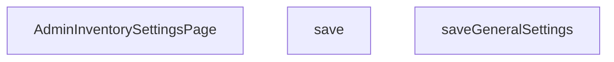

## Genel Bakış
Bu modül, yönetici panelindeki envanter ayarları sayfasını oluşturan React bileşenini ve ilgili kaydetme mantığını içerir. Sayfa, stok konfigürasyonlarının görüntülenmesini ve düzenlemesini sağlarken, kaydetme fonksiyonları değişikliklerin sunucuya iletilmesini yönetir.

## Fonksiyon Grupları

### Sayfa Bileşeni
Envanter ayarları sayfasının ana yapısını ve kullanıcı arayüzünü tanımlar. Form elemanlarını, durum yönetimini ve kullanıcı etkileşimlerini koordine eder.
- AdminInventorySettingsPage

### Kaydetme İşlemleri
Stok ayarlarının güncellenmesi ve kalıcı depolamaya aktarılması için kullanılan asenkron fonksiyonları kapsar. Hem genel ayarlar hem de spesifik veri setleri için ayrı kaydetme süreçleri sunar.
- save, saveGeneralSettings

---

## AXIOMS – Mimari Varsayımlar

Bu modül için verilen fonksiyon imzaları ve eski doküman yapısı temelinde aşağıdaki mimari varsayımlar belirlenmiştir.

**[Aksiyom 1]:** Eğer `AdminInventorySettingsPage` bir React bileşeni olarak çağrılmıyorsa (React component tree içinde değilse), bileşen hiç render edilmez.

**[Aksiyom 2]:** Eğer `save()` veya `saveGeneralSettings()` fonksiyonları çağrıldığında geçerli bir oturum veya kimlik doğrulama bilgisi (auth token vb.) yoksa, bu fonksiyonların asenkron çağrısı başarısız olur veya yetkisiz hata döner.

**[Aksiyom 3]:** Eğer `saveGeneralSettings()` fonksiyonu çalışıyorsa, genel envanter ayarları için bir dışservis (API endpoint) erişilebilir olmalıdır; aksi takdirde kalıcı depolama işlemi gerçekleşmez.

**[Aksiyom 4]:** Eğer `AdminInventorySettingsPage` içinde form durum state'i tutuluyorsa ve bu state başlangıçta başlatılmamışsa (örn: `undefined`), bileşen hatalı render edilir veya kullanıcı arayüzünde eksik veri görüntülenir.

**[Aksiyom 5]:** Eğer `save()` fonksiyonu çağrıldığında form geçerlilik kontrolleri (validation) başarılı değilse, kaydetme işlemi başlatılmamalıdır; aksi takdirde geçersiz veri depolanabilir.

---

> **Not:** Fonksiyon gövdeleri (body) sağlandığında, API endpoint'leri, state management mekanizması ve bağımlılıklar netleştirilerek aksiyomlar daha spesifik hale getirilebilir.

---

## FONKSİYON DETAYLARI

### AdminInventorySettingsPage
**Ne yapar**: React uygulamasında envanter ayarları sayfasının bileşenini tanımlar ve dışarıya bir fonksiyonel bileşen (`React.FC`) olarak sunar.  
**Nasıl yapar**: Fonksiyon, TypeScript/React ortamında bir fonksiyonel bileşen tanımı döndürür; bileşenin içeriği dosyada tanımlı diğer yardımcı fonksiyonlar ve UI öğeleriyle birleştirilir.  
**Parametreler**:
- *yok* — Bu bileşen dışarıdan parametre almaz.
**Dönüş**: `React.FC` — Bileşen tipinde bir fonksiyonel React bileşeni döndürür.

### save
**Ne yapar**: Envandre ait genel ayarları (bildirim e-posta adresi, webhook URL'i ve rezervasyon zaman aşımı süresini) Supabase veritabanında günceller ve audit kaydı oluşturur. İşlem başarılı olursa başarı, hata olursa hata mesajını UI'da gösterir.
**Nasıl yapar**: Fonksiyon, bir `try-catch-finally` bloğu içinde çalışır. Önce `savingGeneral` durumunu `true`'ya ayarlayarak yükleme göstergesini aktif eder, başarı ve hata mesajlarını temizler. Ardından `mutateWithAudit` fonksiyonunu çağırarak veritabanı işlemini audit korumasıyla başlatır. Audit koruması sayesinde, yetki kontrolü (`hasWriteAccess`) yapılarak gerekli loglama çalıştırılır. Audit sonrası asıl veritabanı güncelleme (`fn` parametresi içinde) çalıştırılır. İşlem成功a erişirse kullanıcıya "Genel ayarlar kaydedildi" başarı mesajını atar ve `load()` fonksiyonunu çağırarak sayfadaki verileri yeniler. Herhangi bir hata oluşursa, hatanın türüne göre (`AdminPermissionError` veya genel `Error`) anlamlı bir hata mesajı set edilir. `finally` bloğunda her durumda `savingGeneral` durumu `false`'a dönerek yükleme göstergesi kapatılır.
**Parametreler**:
- (Parametre almaz)
**Dönüş**: void (dönüş değeri yoktur)

### saveGeneralSettings
**Ne yapar**: Envandre ait genel ayarları (bildirim e-posta adresi, webhook URL'i ve rezervasyon zaman aşımı süresini) Supabase veritabanında günceller ve audit kaydı oluşturur. İşlem başarılı olursa başarı, hata olursa hata mesajını UI'da gösterir. Bu fonksiyon, `save` fonksiyonunun tam ve açık isimli karşılığıdır.
**Nasıl yapar**: Fonksiyon, bir `try-catch-finally` bloğu içinde çalışır. Önce `savingGeneral` durumunu `true`'ya ayarlayarak yükleme göstergesini aktif eder, başarı ve hata mesajlarını temizler. Ardından `mutateWithAudit` fonksiyonunu çağırarak veritabanı işlemini audit korumasıyla başlatır. Audit koruması sayesinde, yetki kontrolü (`hasWriteAccess`) yapılarak gerekli loglama çalıştırılır. Audit sonrası asıl veritabanı güncelleme (`fn` parametresi içinde) çalıştırılır. İşlem成功a erişirse kullanıcıya "Genel ayarlar kaydedildi" başarı mesajını atar ve `load()` fonksiyonunu çağırarak sayfadaki verileri yeniler. Herhangi bir hata oluşursa, hatanın türüne göre (`AdminPermissionError` veya genel `Error`) anlamlı bir hata mesajı set edilir. `finally` bloğunda her durumda `savingGeneral` durumu `false`'a dönerek yükleme göstergesi kapatılır.
**Parametreler**:
- (Parametre almaz)
**Dönüş**: void (dönüş değeri yoktur)

---

## ENUMS

### LoadState
- `Idle`
- `Loading`
- `Error`

---

## AST POINTERS

### [N1_NASIL] AdminInventorySettingsPage AST Pointer: `src/views/admin/AdminInventorySettingsPage.tsx`::AdminInventorySettingsPage
- **params**: (yok — React fonksiyonel bileşeni)
- **ic_degiskenler**:
  - `pathname` — `usePathname()` hook'undan gelen mevcut URL yolu, `load` effect'inde dependency olarak kullanılır
  - `defaultThreshold` / `setDefaultThreshold` — `React.useState<number | ''>('')` ile tanımlı, varsayılan düşük stok eşiği değeri; input'tan okunur, `save()` içinde `value`'ya dönüştürülerek RPC'ye gönderilir
  - `resetAll` / `setResetAll` — `React.useState<boolean>(false)` ile tanımlı, checkbox'tan gelen "tüm ürünlere uygula" flag'i; `save()` içinde `after.reset_overrides` olarak mutateWithAudit'e verilir
  - `loading` / `setLoading` — `React.useState<LoadState>(LoadState.Idle)` ile tanımlı, sayfa yükleme durumu; `load()` içinde `LoadState.Loading`/`LoadState.Idle`/`LoadState.Error` olarak ayarlanır, JSX'te skeleton/error gösterimi için kontrol edilir
  - `saving` / `setSaving` — `React.useState<boolean>(false)` ile tanımlı, eşik kaydetme işleminin devam ettiğini gösterir; button disabled durumunu ve metnini kontrol eder
  - `savingGeneral` / `setSavingGeneral` — `React.useState<boolean>(false)` ile tanımlı, genel ayar kaydetme işleminin devam ettiğini gösterir; genel kaydet button disabled/metin kontrolü
  - `error` / `setError` — `React.useState<string>('')` ile tanımlı, hata mesajı; catch bloklarında doldurulur, JSX'te hata bildirimi olarak gösterilir
  - `success` / `setSuccess` — `React.useState<string>('')` ile tanımlı, başarı mesajı; `save()` ve `saveGeneralSettings()` sonunda doldurulur, JSX'te yeşil bildirim olarak gösterilir
  - `alertEmail` / `setAlertEmail` — `React.useState<string>('')` ile tanımlı, kritik stok alarm e-posta adresi; input'tan okunur, `saveGeneralSettings()` içinde `after.alert_email` olarak gönderilir
  - `alertWebhook` / `setAlertWebhook` — `React.useState<string>('')` ile tanımlı, webhook URL'i; input'tan okunur, `saveGeneralSettings()` içinde `after.alert_webhook_url` olarak gönderilir
  - `resTimeout` / `setResTimeout` — `React.useState<number>(24)` ile tanımlı, rezervasyon iptal süresi (saat); input'tan okunur, `saveGeneralSettings()` içinde `after.reservation_timeout_hours` olarak gönderilir
  - `canWrite` — `useRole()` hook'undan dönen write izni kontrol fonksiyonu
  - `hasWriteAccess` — `canWrite('inventory_settings')` çağrısının boolean sonucu; hem button'ları disabled yapar hem de `mutateWithAudit`'e `canWrite` parametresi olarak geçer
  - `load` — `React.useCallback` ile tanımlı, supabase'den `inventory_settings` tablosunu çeken ve state'leri dolduran async fonksiyon
  - `save` — eşik değerini supabase RPC ile kaydeden async fonksiyon
  - `saveGeneralSettings` — genel ayarları (email, webhook, timeout) supabase direct update ile kaydeden async fonksiyon
- **Dönüş**: JSX — `return (...)` bloğunda iki ana kart: Stok Eşik Ayarları kartı (input + checkbox + save) ve Alarm/Otomasyon + Rezervasyon Kuralları kartı (email input + webhook input + timeout input + save). `hasWriteAccess` false ise rose renkli uyarı banner'ı. `loading === LoadState.Loading` iken `AdminSkeleton` gösterilir.

---

### [N2_NASIL] AdminInventorySettingsPage AST Pointer: `src/views/admin/AdminInventorySettingsPage.tsx`::load
- **params**: (yok)
- **ic_degiskenler**:
  - `data` — `supabase.from('inventory_settings').select('*').maybeSingle()` sonucundan dönen satır verisi; `data.default_low_stock_threshold`, `data.alert_email`, `data.alert_webhook_url`, `data.reservation_timeout_hours` alanları okunur
  - `error` — supabase select sorgusundan dönen hata nesnesi;truthy ise `throw error` ile catch'e düşer
  - `val` — `data?.default_low_stock_threshold as number | null` olarak alınan eşik değeri; `null` ise boş string, değilse `Number(val)` olarak `defaultThreshold`'a set edilir
- **Dönüş**: `void` — state'leri set eder: `setDefaultThreshold`, `setAlertEmail`, `setAlertWebhook`, `setResTimeout`, `setError('')`, `setLoading`. Hata olursa `setError('Ayarlar yüklenemedi')` ve `setLoading(LoadState.Error)`

---

### [N3_NASIL] AdminInventorySettingsPage AST Pointer: `src/views/admin/AdminInventorySettingsPage.tsx`::save
- **params**: (yok)
- **ic_degiskenler**:
  - `value` — `(defaultThreshold === '' ? null : Number(defaultThreshold))` ifadesinden elde edilen sayısal eşik değeri veya null; hem `mutateWithAudit`'in `after` objesine hem de `supabase.rpc` çağrısına `p_default` parametresi olarak geçilir
  - `e` — catch bloğundaki `unknown` tipinde hata nesnesi; `AdminPermissionError` veya `Error` instance kontrolü yapılır
  - `msg` — `e` objesinden çıkarılan kullanıcıya gösterilecek hata mesajı stringi
- **Dönüş**: `void` — state'leri set eder: `setSaving(true)`, `setSuccess`, `setError`, `setSaving(false)`. `mutateWithAudit` çağrısı ile `supabase.rpc('update_inventory_thresholds', { p_default: value, p_reset_overrides: resetAll })` çalıştırılır, ardından `load()` çağrılarak veriler yenilenir

---

### [N4_NASIL] AdminInventorySettingsPage AST Pointer: `src/views/admin/AdminInventorySettingsPage.tsx`::saveGeneralSettings
- **params**: (yok)
- **ic_degiskenler**:
  - `e` — catch bloğundaki `unknown` tipinde hata nesnesi; `AdminPermissionError` veya `Error` instance kontrolü yapılır
  - `msg` — `e` objesinden çıkarılan kullanıcıya gösterilecek hata mesajı stringi
- **Dönüş**: `void` — state'leri set eder: `setSavingGeneral(true)`, `setSuccess`, `setError`, `setSavingGeneral(false)`. `mutateWithAudit` çağrısı ile `supabase.from('inventory_settings').update({ alert_email, alert_webhook_url, reservation_timeout_hours, updated_at: new Date().toISOString() }).eq('id', true)` çalıştırılır, ardından `load()` çağrılarak veriler yenilenir. `after` objesinde `alert_email: alertEmail || null`, `alert_webhook_url: alertWebhook || null`, `reservation_timeout_hours: resTimeout || 24` gönderilir

---

## MERMAID CALL GRAPH

## NODE ID STANDARD

  file: src\views\admin\AdminInventorySettingsPage.tsx
  function: src\views\admin\AdminInventorySettingsPage.tsx::AdminInventorySettingsPage
  function: src\views\admin\AdminInventorySettingsPage.tsx::save
  function: src\views\admin\AdminInventorySettingsPage.tsx::saveGeneralSettings

---

## DISA AKTARILANLAR (EXPORTS)
  export: AdminInventorySettingsPage

---

## STİL TOKENLERİ

### Arbitrary Değerler (token'a geçirilmemiş)
Yok — tüm stiller token'a geçirilmiş. ✅

### Kullanılan Token'lar (zaten token'a geçirilmiş)
- `rounded-hvac-xl`

### Tailwind Sınıf Özeti
- **Renkler:** `bg-amber-500/5`, `bg-cyan-500/5`, `bg-rose-500/5`, `bg-surface-deep/40`, `bg-transparent`, `bg-violet-500`, `bg-violet-500/5`, `border-amber-500/10`, `border-b`, `border-rose-500/20`, `border-t`, `border-white/10`, `border-white/5`, `group-hover:bg-cyan-500/10`, `group-hover:bg-violet-500/10`
- **Layout:** `!h-12`, `absolute`, `block`, `flex`, `flex-1`, `gap-10`, `gap-3`, `gap-4`, `gap-6`, `gap-8`, `grid`, `grid-cols-1`, `h-14`, `h-5`, `h-64`
- **Varyant/Responsive:** `focus-visible:`, `group-hover:`, `hover:`, `lg:`, `md:` önekleri
- **Yardımcı Sınıflar:** `!font-black`, `!text-center`, `!text-lg`, `${adminButtonPrimaryClass`, `${adminCardClass`, `${adminInputClass`, `-mr-32`, `-mt-32`, `animate-in`, `blur-3xl`, `border`, `cursor-pointer`, `duration-700`, `fade-in`, `focus-visible:ring-cyan-400/20`