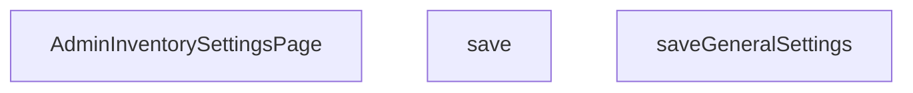

## Genel Bakış
Bu modül, yönetici panelindeki envanter ayarları sayfasını oluşturan bir React bileşenini ve ilgili kaydetme mantığını içerir. Ana bileşen, kullanıcı arayüzünü sunarak yöneticinin stok ayarlarını görüntülemesini ve düzenlemesini sağlar; kaydetme fonksiyonları ise bu değişikliklerin asenkron olarak kalıcı depolama ortamına aktarılmasını yönetir.

## Fonksiyon Grupları
### Sayfa Bileşeni ve Arayüz
Envanter ayarları sayfasının ana yapısını ve kullanıcı arayüzünü tanımlar. Bu bileşen, sayfa içindeki form elemanlarını, durum yönetimini ve kullanıcı etkileşimlerini (kaydetme tetikleme dahil) koordine eder.
- AdminInventorySettingsPage

### Kaydetme İşlemleri
Stok ayarlarının güncellenmesi ve sunucuya gönderimi için kullanılan asenkron fonksiyonları kapsar. Bu grup, hem genel ayarları hem de spesifik veri setlerini kaydetme süreçlerini ele alır.
- save, saveGeneralSettings

---

## AXIOMS – Mimari Varsayımlar

Bu modül için fonksiyon gövdeleri verilmediği için yalnızca fonksiyon imzalarına dayalı çıkarılabilir varsayımlar aşağıdadır.

[Aksiyom 1]: Eğer `save()` veya `saveGeneralSettings()` asenkron çalışacaksa, bu fonksiyonların çağrılmadan önce React bileşeninin bir state yönetimi (örn. `useState`, `useReducer` veya bir state kütüphanesi) ile entegre edilmiş olması gerekir;否则, kaydetme işlemi sonucu kullanıcı arayüzü güncellenemez.

[Aksiyom 2]: Eğer `saveGeneralSettings()` yalnızca "genel ayarları" kaydediyorsa, AdminInventorySettingsPage bileşeninin en az bir global/genel ayar state'ini barındırması gerekir;否则, kaydedilecek veri kaynağı olmaz ve fonksiyon anlamsız çalışır.

[Aksiyom 3]: Eğer `save()` fonksiyonu `saveGeneralSettings()`'ten farklı bir işlevsellik sunuyorsa (örn. tüm ayarları veya farklı bir alt kümesi kaydediyorsa), iki fonksiyon arasında state'lerin hangi kapsama alanına ait olduğuna dair net bir ayrım yapılması gerekir;否则, çakışan state güncellemeleri tutarsız veri kayıtlarına yol açar.

> **Not:** Bu modül bir React TSX bileşeni olduğundan, React runtime ortamının ve JSX derleyicisinin mevcut olması da zorunlu bir altyapı varsayımıdır; ancak bu genel/altyapısal bir gereklilik olduğundan module-özel aksiyom olarak listelenmemiştir.

---

## FONKSİYON DETAYLARI

### AdminInventorySettingsPage
**Ne yapar**: React uygulamasında envanter ayarları sayfasının bileşenini tanımlar ve dışarıya bir fonksiyonel bileşen (`React.FC`) olarak sunar.  
**Nasıl yapar**: Fonksiyon, TypeScript/React ortamında bir fonksiyonel bileşen tanımı döndürür; bileşenin içeriği dosyada tanımlı diğer yardımcı fonksiyonlar ve UI öğeleriyle birleştirilir.  
**Parametreler**:
- *yok* — Bu bileşen dışarıdan parametre almaz.
**Dönüş**: `React.FC` — Bileşen tipinde bir fonksiyonel React bileşeni döndürür.

### save
**Ne yapar**: Genel envanter ayarlarını veritabanına kaydeder ve işlem sonucuna göre kullanıcıya geri bildirim verir.  
**Nasıl yapar**: `saveGeneralSettings` fonksiyonunun aynı mantığını uygular; kaydetme sürecini başlatır, hata ve başarı durumlarını yönetir, ardından ayarları yeniden yükler.  
**Parametreler**:
- *yok* — Fonksiyon dışarıdan veri almaz; gerekli değerler bileşen içinde tanımlı durum değişkenlerinden (`alertEmail`, `alertWebhook`, `resTimeout`) elde edilir.
**Dönüş**: `void` — İşlem tamamlandığında bir değer döndürmez; sadece yan etkileri (state güncellemeleri, console log) vardır.

### saveGeneralSettings
**Ne yapar**: Envanter ayarlarını Supabase veritabanındaki `inventory_settings` tablosuna günceller, işlem sonucunu kullanıcıya bildirir ve güncel ayarları tekrar yükler.  
**Nasıl yapar**: 
1. `setSavingGeneral(true)` ile kaydetme sürecini başlatır ve UI’da bekleme durumu gösterir.  
2. `setSuccess('')` ve `setError('')` ile önceki mesajları temizler.  
3. Supabase SDK’sı ile `inventory_settings` tablosunda `id = true` koşuluna sahip satırı, `alert_email`, `alert_webhook_url`, `reservation_timeout_hours` ve `updated_at` alanlarını güncelleyerek değiştirir.  
4. Güncelleme sırasında bir hata oluşursa `throw` ile yakalar; hata mesajını konsola yazar ve `setError` ile kullanıcıya gösterir.  
5. Başarılı olursa `setSuccess('Genel ayarlar kaydedildi')` mesajını ayarlar ve `await load()` ile en son ayarları tekrar yükler.  
6. `finally` bloğunda `setSavingGeneral(false)` çağrısı yapılarak bekleme durumu sonlandırılır.  
**Parametreler**:
- *yok* — Gerekli tüm veriler bileşen içindeki durum değişkenlerinden (`alertEmail`, `alertWebhook`, `resTimeout`) alınır.
**Dönüş**: `void` — Fonksiyon asenkron çalışır ancak dışarıya bir değer döndürmez; sadece yan etkileri (state güncellemeleri, veri kaydetme) vardır.

---

## ENUMS

### LoadState
- `Idle`
- `Loading`
- `Error`

---

## AST POINTERS

### [N1_NASIL] AST Pointer: src/views/admin/AdminInventorySettingsPage.tsx::AdminInventorySettingsPage
- **params**: (parametre yok)
- **ic_degiskenler**:
  - `pathname` — usePathname() hook'undan gelen mevcut URL yolu, sayfa yükleme efektinde bağımlılık olarak kullanılır
  - `defaultThreshold` — React state, varsayılan düşük stok eşiği değeri (number veya boş string), input bağlaması ve supabase'e gönderilen değer
  - `resetAll` — React state, tüm ürünlere uygula checkbox'ının checked durumu (boolean), toplu uygulama seçeneğini kontrol eder
  - `loading` — React state, veri yükleme durumunu tutar (LoadState enum), skeleton veya form gösterilmesini kontrol eder
  - `saving` — React state, eşik kaydetme (save) işleminin devam edip etmediğini tutar, buton disabled durumunu yönetir
  - `savingGeneral` — React state, genel ayarları kaydetme (saveGeneralSettings) işleminin devam edip etmediğini tutar
  - `error` — React state, hata mesajını tutar, UI'da rose renkli hata bildirimini gösterir
  - `success` — React state, başarı mesajını tutar, UI'da emerald renkli başarı bildirimini gösterir
  - `alertEmail` — React state, alarm e-posta alıcı adresi, input bound ve saveGeneralSettings'e gönderilir
  - `alertWebhook` — React state, webhook URL adresi (Slack/ERP entegrasyonu), input bound ve saveGeneralSettings'e gönderilir
  - `resTimeout` — React state, otomatik rezervasyon iptal süresi saat cinsinden (varsayılan 24), input bound ve saveGeneralSettings'e gönderilir
  - `canWrite` — useRole() hook'undan dönen izin kontrol fonksiyonu, belirli alanlarda yazma yetkisi olup olmadığını sorgular
  - `hasWriteAccess` — canWrite('inventory_settings') çağrısının boolean sonucu, sayfadaki所有但onların disabled durumunu ve uyarı banner'ını kontrol eder
- **Dönüş**: JSX (React element) — Stok eşik, alarm ve rezervasyon ayarları yönetim formunu render eder

### [N2_NASIL] AST Pointer: src/views/admin/AdminInventorySettingsPage.tsx::load
- **params**: (parametre yok)
- **ic_degiskenler**:
  - `data` — supabase.from('inventory_settings').select('*').maybeSingle() çağrısından dönen satır nesnesi, tüm ayar alanlarını (default_low_stock_threshold, alert_email, alert_webhook_url, reservation_timeout_hours) içerir
  - `error` — supabase.select().maybeSingle() çağrısından dönen hata nesnesi, varsa catch bloğuna yönlendirilir
  - `val` — data?.default_low_stock_threshold değerinin number | null olarak cast edilmiş hali, null ise boş string aksi halde Number(val) olarak state'e yazılır
- **Dönüş**: void (yan etki: state setter çağrılarıyla UI'ı günceller)

### [N3_NASIL] AST Pointer: src/views/admin/AdminInventorySettingsPage.tsx::save
- **params**: (parametre yok)
- **ic_degiskenler**:
  - `value` — defaultThreshold boş string ise null, değilse Number(defaultThreshold) olarak hesaplanan eşik değeri, supabase RPC'ye parametre olarak gönderilir
  - `error` — supabase.rpc('update_inventory_thresholds', ...) çağrısından dönen hata nesnesi, varsa throw edilerek catch'e yönlendirilir
  - `e` — catch bloğunda yakalanan bilinmeyen türde hata nesnesi (unknown)
  - `msg` — e instanceof Error kontrolü ile hata mesajı veya varsayılan 'Kaydedilemedi' stringi, setError'e gönderilir
- **Dönüş**: void (yan etki: supabase RPC çağrısı, state setter çağrıları, load() ile veri yeniden yükler)

### [N4_NASIL] AST Pointer: src/views/admin/AdminInventorySettingsPage.tsx::saveGeneralSettings
- **params**: (parametre yok)
- **ic_degiskenler**:
  - `error` — supabase.from('inventory_settings').update({...}).eq('id', true) çağrısından dönen hata nesnesi, varsa throw edilerek catch'e yönlendirilir
  - `e` — catch bloğunda yakalanan bilinmeyen türde hata nesnesi (unknown)
  - `msg` — e instanceof Error kontrolü ile hata mesajı veya varsayılan 'Kaydedilemedi' stringi, setError'e gönderilir
- **Dönüş**: void (yan etki: supabase update çağrısı ile alert_email, alert_webhook_url, reservation_timeout_hours, updated_at alanlarını günceller, load() ile veri yeniden yükler)

---

## MERMAID CALL GRAPH

## NODE ID STANDARD

  file: src\views\admin\AdminInventorySettingsPage.tsx
  function: src\views\admin\AdminInventorySettingsPage.tsx::AdminInventorySettingsPage
  function: src\views\admin\AdminInventorySettingsPage.tsx::save
  function: src\views\admin\AdminInventorySettingsPage.tsx::saveGeneralSettings

---

## DISA AKTARILANLAR (EXPORTS)
  export: AdminInventorySettingsPage

---

## STİL TOKENLERİ

### Arbitrary Değerler (token'a geçirilmemiş)
Yok — tüm stiller token'a geçirilmiş. ✅

### Kullanılan Token'lar (zaten token'a geçirilmiş)
- `rounded-hvac-xl`

### Tailwind Sınıf Özeti
- **Renkler:** `bg-amber-500/5`, `bg-cyan-500/5`, `bg-rose-500/5`, `bg-surface-deep/40`, `bg-transparent`, `bg-violet-500`, `bg-violet-500/5`, `border-amber-500/10`, `border-b`, `border-rose-500/20`, `border-t`, `border-white/10`, `border-white/5`, `group-hover:bg-cyan-500/10`, `group-hover:bg-violet-500/10`
- **Layout:** `!h-12`, `absolute`, `block`, `flex`, `flex-1`, `gap-10`, `gap-3`, `gap-4`, `gap-6`, `gap-8`, `grid`, `grid-cols-1`, `h-14`, `h-5`, `h-64`
- **Varyant/Responsive:** `focus-visible:`, `group-hover:`, `hover:`, `lg:`, `md:` önekleri
- **Yardımcı Sınıflar:** `!font-black`, `!text-center`, `!text-lg`, `${adminButtonPrimaryClass`, `${adminCardClass`, `${adminInputClass`, `-mr-32`, `-mt-32`, `animate-in`, `blur-3xl`, `border`, `cursor-pointer`, `duration-700`, `fade-in`, `focus-visible:ring-cyan-400/20`