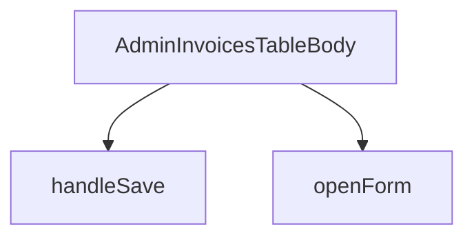

## Genel Bakış
Bu modül, admin panelinde faturası oluşturulmamış siparişlerin listelendiği tablonun gövde kısmını oluşturan bir React bileşenidir. Kullanıcının listeden bir sipariş satırını seçerek fatura formunu açmasını ve oluşturulan faturayı kaydetmesini sağlar.

## Fonksiyon Grupları

### Bileşen ve Tablo Gövdesi
Admin panelindeki fatura tablosunun gövdesini render eder; faturası kesilmemiş sipariş satırlarını listeler ve kullanıcı etkileşimlerini yönetir.
- AdminInvoicesTableBody

### Form ve Kayıt İşlemleri
Seçilen sipariş satırına ait fatura formunu açar ve form verilerinin sunucuya gönderilerek kaydedilmesini sağlar.
- openForm, handleSave

---

## AXIOMS – Mimari Varsayımlar
- Bu modül davranışsal mantık içermez (salt veri / konfigürasyon / tip tanımı).
- [Aksiyom 1]: Modülün dışa açtığı yapı (anahtar kümesi / şema) bir sözleşmedir; tüketiciler bu sabit yapıya bağlıdır — kırıcı değişiklik tüm tüketicileri etkiler.
- [Aksiyom 2]: Bir öğe ekleme/çıkarma yapısal-uyumlu olmalı; ilgili tipler ve seçiciler aynı commit'te güncel tutulmalıdır.

---

## FONKSİYON DETAYLARI

### AdminInvoicesTableBody
**Ne yapar**: Fatura defteri gövdesini oluşturan React bileşenidir. Bekleyen ve faturalanmış sipariş listelerini tek bir ekranda gösterir. ÜST LİSTE (bekleyen) prosedürün 1. adımıdır ve `view_admin_uninvoiced_orders` görünümünden veri alır.
**Nasıl yapar**: Bileşen, iki ayrı liste görüntüler. Süzme işlemi bilerek veritabanında yapılmamıştır; "faturalandı mı" kontrolü istemci tarafında hesaplanır. Bunun nedeni, sayfalama ile birlikte veritabanında süzme yapıldığında yanlış cevap verme riskidir; çünkü o sayfada görünmeyen siparişler göz ardı edilebilir.
**Parametreler**: Bu fonksiyon parametre almaz.
**Dönüş**: `React.FC` tipinde bir bileşen döndürür.

### openForm
**Ne yapar**: Seçilen bir sipariş satırı için form açılmasını tetikler.
**Nasıl yapar**: Arrow fonksiyonu olarak tanımlanmıştır. Çağrıldığında `openForm` fonksiyonunu belirli bir `UninvoicedOrderRow` nesnesiyle çalıştırır.
**Parametreler**:
- row: `UninvoicedOrderRow` — Formu açılacak sipariş satırının verilerini içerir.
**Dönüş**: Dönüş tipi belirtilmemiştir.

### handleSave
**Ne yapar**: Kaydetme işlemini gerçekleştirir.
**Nasıl yapar**: Async bir fonksiyon olarak tanımlanmıştır. Çağrıldığında `handleSave` fonksiyonunu çalıştırır.
**Parametreler**: Bu fonksiyon parametre almaz.
**Dönüş**: Dönüş tipi belirtilmemiştir.

---

## İTHALATLAR (IMPORTS)
- import: ../../components/admin/AdminEmptyState::AdminEmptyState
- import: ../../components/admin/data-table/DataTableKit::DataTableKit
- import: ../../components/admin/data-table/types::type { AdminColumn }
- import: ../../components/admin/overlay/AdminModal::AdminModal
- import: ../../hooks/useAdminTable::type FetchParams
- import: ../../hooks/useAdminTable::type FetchResult
- import: ../../hooks/useAdminTable::useAdminTable
- import: ../../hooks/useRole::useRole
- import: ../../i18n/I18nProvider::useI18n
- import: ../../i18n/currency::SYSTEM_CURRENCY
- import: ../../i18n/datetime::formatDate
- import: ../../i18n/format::formatCurrency
- import: ../../types/database.types::type { Database }
- import: @/lib/admin/mutateWithAudit::mutateWithAudit
- import: @/lib/supabase/client::supabaseBrowserClient
- import: @supabase/supabase-js::type { SupabaseClient }
- import: lucide-react::FileCheck2
- import: lucide-react::Receipt
- import: lucide-react::SearchX
- import: react::React
- import: react::useCallback
- import: react::useEffect
- import: react::useMemo
- import: react::useState
- import: sonner::toast

---

## AST POINTERS

### [N1_NASIL] AST Pointer: AdminInvoicesTableBody.tsx::fetch
- **params**: `(supabase: SupabaseClient<Database>, _params: FetchParams)`
- **ic_degiskenler**:
  - `supabase` — Supabase istemcisi, `listInvoices` fonksiyonuna birinci argüman olarak geçilir
  - `_params` — FetchParams tipinde parametre, fonksiyon gövdesinde KULLANILMAZ (alt çizgi ile işaretli)
  - `rows` — `listInvoices` çağrısından dönen fatura satırları dizisi, `await` ile çözümlenir
- **Dönüş**: `Promise<FetchResult<OrderInvoiceRow>>` — `{ rows, totalMatched: rows.length }` nesnesi döndürülür

### [N2_NASIL] AST Pointer: AdminInvoicesTableBody.tsx::loadPending
- **params**: (parametre yok)
- **ic_degiskenler**:
  - `err` — catch bloğunda yakalanan hata nesnesi, `console.error` ile loglanır
- **Dönüş**: yok — yan etki olarak `setPendingLoading` ve `setPending` state setter'ları çağrılır; `listUninvoicedPaidOrders(supabaseBrowserClient)` sonucu `setPending`'a aktarılır; hata durumunda `toast.error` ile kullanıcıya bildirim gösterilir

### [N3_NASIL] AST Pointer: AdminInvoicesTableBody.tsx::useEffect callback
- **params**: (parametre yok)
- **ic_degiskenler**: (yok)
- **Dönüş**: yok — yan etki olarak `loadPending()` çağrılır (void ile atılır, sonuç beklenmez)

### [N4_NASIL] AST Pointer: AdminInvoicesTableBody.tsx::openForm
- **params**: `(row: UninvoicedOrderRow)`
- **ic_degiskenler**:
  - `row` — faturalanmamış sipariş satırı, `setTarget` state setter'ına aktarılır
- **Dönüş**: yok — yan etki olarak `setTarget(row)`, `setInvoiceNo('')`, `setNote('')` ve `setInvoiceDate(new Date().toISOString().slice(0, 10))` state setter'ları çağrılır; tarih bugünün ISO tarihi olarak ayarlanır

### [N5_NASIL] AST Pointer: AdminInvoicesTableBody.tsx::handleSave
- **params**: (parametre yok)
- **ic_degiskenler**:
  - `target` — mevcut hedef fatura satırı (state), yoksa veya `saving` true ise erken çıkılır
  - `saving` — kayıt işlemi devam ediyor mu (state), true ise erken çıkılır
  - `invoiceNo` — fatura numarası (state), boşsa erken çıkılır; `trim()` ile kontrol edilir
  - `invoiceDate` — fatura tarihi (state), boşsa erken çıkılır
  - `row` — `target`'ın yerel kopyası, `row.id` ve `row.invoice_type` kullanılır
  - `hasWriteAccess` — yazma yetkisi olup olmadığını gösteren değer, `mutateWithAudit`'e `canWrite` olarak geçilir
  - `created` — `mutateWithAudit` içindeki `fn` fonksiyonundan dönen yeni oluşturulan fatura nesnesi, `afterFrom` fonksiyonuna argüman olarak geçilir
  - `err` — catch bloğunda yakalanan hata nesnesi
  - `mesaj` — `err`'ın `message` özelliği (Error ise), aksi halde boş string
  - `tekrar` — `mesaj` içinde duplicate key/unique constraint/23505 eşleşmesi varsa true olan boolean regex test sonucu
- **Dönüş**: yok — yan etki olarak `setSaving(true/false)`, `mutateWithAudit` ile fatura oluşturulur, başarılıysa `toast.success`, `setTarget(null)`, `loadPending()` ve `table.reload()` çağrılır; hata durumunda `toast.error` ile bildirim gösterilir

### [N6_NASIL] AST Pointer: AdminInvoicesTableBody.tsx::afterFrom
- **params**: `(created)`
- **ic_degiskenler**:
  - `created` — yeni oluşturulan fatura nesnesi, özellikleri çıkarılır
- **Dönüş**: `{ id, order_id, invoice_no, invoice_date }` nesnesi — denetim izi (audit log) için kullanılan alt küme

### [N7_NASIL] AST Pointer: AdminInvoicesTableBody.tsx::fn
- **params**: (parametre yok)
- **ic_degiskenler**:
  - `row` — dış scope'daki `target` kopyası, `row.id` ve `row.invoice_type` kullanılır
  - `invoiceNo` — dış scope'daki fatura numarası (state)
  - `invoiceDate` — dış scope'daki fatura tarihi (state)
  - `note` — dış scope'daki not (state)
- **Dönüş**: `createInvoice` fonksiyonunun dönüşü (Promise) — `supabaseBrowserClient` ile `{ orderId: row.id, invoiceNo, invoiceDate, invoiceType: row.invoice_type, note }` argümanlarıyla çağrılır

### [N8_NASIL] AST Pointer: AdminInvoicesTableBody.tsx::columns
- **params**: (parametre yok)
- **ic_degiskenler**:
  - `faturaTipi` — iç fonksiyon, `deger` parametresini alır ve i18n çevrilmiş fatura tipi string'i döndürür
  - `deger` — fatura tipi değeri (`'individual'`, `'corporate'` veya diğer), `faturaTipi` fonksiyonunun parametresi
  - `r` — her sütunun `cell` ve `facetAccessor` callback'lerinde kullanılan satır nesnesi
  - `lang` — dış scope'dan gelen dil bilgisi, `formatDate` fonksiyonuna ikinci argüman olarak geçilir
- **Dönüş**: `AdminColumn[]` — dört sütun tanımlı dizi: `invoice_no`, `invoice_date`, `invoice_type`, `note`

### [N9_NASIL] AST Pointer: AdminInvoicesTableBody.tsx::faturaTipi
- **params**: `(deger: string | null)`
- **ic_degiskenler**:
  - `deger` — fatura tipi string'i, `'individual'` ise bireysel, `'corporate'` ise kurumsal çeviri döndürülür; diğer durumda bilinmeyen çeviri döndürülür
- **Dönüş**: `string` — i18n çevrilmiş fatura tipi metni

### [N10_NASIL] AST Pointer: AdminInvoicesTableBody.tsx::row render callback
- **params**: `(r)`
- **ic_degiskenler**:
  - `r` — faturalanmamış sipariş satırı nesnesi; `r.id`, `r.order_number`, `r.customer_name`, `r.created_at`, `r.total_amount` özellikleri kullanılır
  - `lang` — dış scope'dan gelen dil bilgisi, `formatDate` ve `formatCurrency` fonksiyonlarına geçilir
  - `hasWriteAccess` — dış scope'dan gelen yazma yetkisi boolean'ı, true ise buton gösterilir
  - `openForm` — dış scope'daki fonksiyon, buton `onClick`'inde `r` argümanıyla çağrılır
  - `adminTableActionPrimaryClass` — dış scope'dan gelen CSS sınıf adı, butona uygulanır
- **Dönüş**: `JSX.Element` — tablo satırı (`<tr>`) HTML'i; sipariş numarası, müşteri adı, tarih, tutar ve (yetki varsa) fatura oluşturma butonu içerir

### [N11_NASIL] AST Pointer: AdminInvoicesTableBody.tsx::onOpenChange
- **params**: `(acik)`
- **ic_degiskenler**:
  - `acik` — diyalog açık/kapalı durumu boolean'ı; false ise `setTarget(null)` çağrılır
- **Dönüş**: yok — yan etki olarak `acik` false olduğunda `setTarget(null)` state setter'ı çağrılır

---

## MERMAID CALL GRAPH

## NODE ID STANDARD

  file: src\views\admin\AdminInvoicesTableBody.tsx
  function: src\views\admin\AdminInvoicesTableBody.tsx::AdminInvoicesTableBody
  function: src\views\admin\AdminInvoicesTableBody.tsx::openForm
  function: src\views\admin\AdminInvoicesTableBody.tsx::handleSave

---

## DISA AKTARILANLAR (EXPORTS)
  export: AdminInvoicesTableBody

---

## STİL TOKENLERİ

### Arbitrary Değerler (token'a geçirilmemiş)
Yok — tüm stiller token'a geçirilmiş. ✅

### Kullanılan Token'lar (zaten token'a geçirilmiş)
- (yok)

### Tailwind Sınıf Özeti
- **Renkler:** `bg-admin-surface-muted`, `border-admin-border`, `border-t`, `text-admin-fg`, `text-admin-fg-muted`, `text-base`, `text-left`, `text-right`, `text-sm`, `text-xs`
- **Layout:** `block`, `overflow-x-auto`, `w-full`
- **Varyant/Responsive:** (yok)
- **Yardımcı Sınıflar:** `border`, `font-medium`, `font-semibold`, `px-4`, `py-2`, `rounded-admin-lg`, `space-y-1`, `space-y-3`, `space-y-4`, `space-y-8`, `tabular-nums`