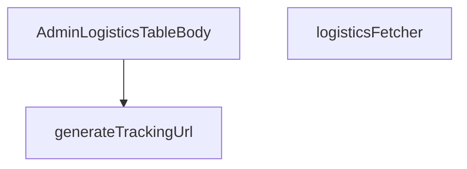

## Genel Bakış
Bu modül, admin yönetim panelindeki lojistik veri tablosunun gövde kısmını oluşturan React bileşenini ve bu bileşenin ihtiyaç duyduğu veri çekme ile dönüşüm fonksiyonlarını içerir. Supabase veritabanından lojistik kayıtlarını asenkron olarak çekme, taşıyıcı bilgisine göre takip URL'leri üretme ve elde edilen veriyi tablo satırlarına dönüştürerek kullanıcıya sunma işlevlerini merkezi bir yapıda yönetir.

## Fonksiyon Grupları

### Veri Sağlama ve İşleme
Bu grup, Supabase veritabanı ile doğrudan iletişim kurarak lojistik kayıtlarını filtrelenmiş ve sıralanmış biçimde getirir; bileşenin tüketimine hazır hale getirir.
- logisticsFetcher

### Yardımcı Dönüşüm İşlevleri
Bu grup, ham taşıyıcı ve takip numarası bilgisini kullanıcı arayüzünde tıklanabilir bir izleme bağlantısına dönüştürür; geçersiz girdiler için null değer döner.
- generateTrackingUrl

### Görünüm Bileşeni
Bu grup, veri çekme ve dönüşüm fonksiyonlarını bir araya getirerek admin panelindeki lojistik tablosunun satır bazlı dinamik içeriğini oluşturan ana React bileşenini tanımlar.
- AdminLogisticsTableBody

---

## AXIOMS – Mimari Varsayımlar
- Bu modül davranışsal mantık içermez (salt veri / konfigürasyon / tip tanımı).
- [Aksiyom 1]: Modülün dışa açtığı yapı (anahtar kümesi / şema) bir sözleşmedir; tüketiciler bu sabit yapıya bağlıdır — kırıcı değişiklik tüm tüketicileri etkiler.
- [Aksiyom 2]: Bir öğe ekleme/çıkarma yapısal-uyumlu olmalı; ilgili tipler ve seçiciler aynı commit'te güncel tutulmalıdır.

---

## FONKSİYON DETAYLARI

### generateTrackingUrl
**Ne yapar**: Belirli bir kargo firmasının ve takip numarasının birleşiminden, o firmaya özel kargo takip sayfasının URL'sini oluşturur.
**Nasıl yapar**: `carrier` parametresini küçük harfe dönüştürerek içeriğini kontrol eder. “yurtici”, “aras”, “mng” veya “ptt” dizelerini içermesine göre, o kargo firmasının resmi takip URL'sini takip numarasını(query parametresi olarak) ekleyerek string olarak döndürür. Tanınmayan bir kargo firması gelirse `null` değerini döndürür.
**Parametreler**:
- carrier: string — Kargo firmasının adı veya tanımı. Fonksiyon, bu parametrenin küçük harfe dönüştürülmüş hâlindeki içeriğine bakarak firmayı tanır.
- tracking: string — Kargo firmanın sistemindeki benzersiz takip numarası.
**Dönüş**: string | null — Oluşturulan takip URL'si veya kargo firması tanınmıyorsa null.

### logisticsFetcher
**Ne yapar**: Veritabanından, belirli durumlardaki (confirmed, processing) ve henüz kargoya verilmemiş (shipped_at null) siparişlerin lojistik bilgilerini getirir.
**Nasıl yapar**: Fonksiyon, oturum tazeliğini kontrol eden bir yardımcıyı çağırarak başlar. Supabase istemcisi ile `view_admin_orders` view'ına bir sorgu oluşturur. Seçilen alanları, toplam eşleşme sayısını ve temel filtreleri (durum ve kargoya verilme tarihi) ayarlar. `params.query` ile gelen arama metni varsa, `search_text` sütunu üzerinde büyük/küçük harf duyarsız bir arama (ilike) ekler. Sıralama parametreleri, tanımlı bir sıralama sütunu varsa onu, yoksa varsayılan olarak `created_at` sütununu kullanır. Sayfalama için offset hesaplayarak sorguyu çalıştırır ve sonucu, API'nin beklediği `LogisticsRow` tipine dönüştürerek döndürür.
**Parametreler**:
- supabaseClient: SupabaseClient<Database> — Veritabanı işlemleri için kullanılacak, tiplendirilmiş Supabase istemcisi nesnesi.
- params: FetchParams — Sorgu metni (`query`), sıralama bilgisi (`sort`) ve sayfalama parametrelerini (`page`, `pageSize`) içeren nesne.
**Dönüş**: Promise<FetchResult<LogisticsRow>> — Sorgu sonucu olarak `LogisticsRow` dizisi ve toplam eşleşen kayıt sayısını (`totalMatched`) içeren bir promise döndürür.

### AdminLogisticsTableBody
**Ne yapar**: Lojistik siparişlerin listelendiği admin tablosunun gövdesini (satırlarını) render eden bir React fonksiyonel bileşenidir.
**Nasıl yapar**: Fonksiyon, bir React.FC (Functional Component) döndürür. Fonksiyonun kendi implementasyon kodu verilmemiş olup, sadece dönüş tipi belirtilmiştir.
**Parametreler**: Parametre almaz (React bileşenleri props alabilir ancak bu fonksiyonun imzasında props belirtilmemiştir).
**Dönüş**: React.FC — Lojistik tablosunun gövdesini (muhtemelen `<tbody>` elementi ve satırları) oluşturan bir React bileşeni.

---

## İTHALATLAR (IMPORTS)
- import: @/components/admin/AdminEmptyState::AdminEmptyState
- import: @/components/admin/AdminToolbar::AdminToolbar
- import: @/components/admin/ExportMenu::ExportMenu
- import: @/components/admin/data-table/BulkBar::BulkBar
- import: @/components/admin/data-table/BulkBar::type BulkAction
- import: @/components/admin/data-table/DataTableKit::DataTableKit
- import: @/components/admin/data-table/types::type { AdminColumn }
- import: @/components/admin/overlay/ConfirmProvider::useConfirm
- import: @/hooks/useAdminTable::type FetchParams
- import: @/hooks/useAdminTable::type FetchResult
- import: @/hooks/useAdminTable::useAdminTable
- import: @/hooks/useRole::useRole
- import: @/i18n/I18nProvider::useI18n
- import: @/i18n/datetime::formatDateTime
- import: @/lib/admin/mutateWithAudit::AdminPermissionError
- import: @/lib/admin/mutateWithAudit::mutateWithAudit
- import: @/lib/ensureSessionFresh::ensureSessionFresh
- import: @/lib/supabase/client::supabaseBrowserClient
- import: @/types/database.types::type { Database }
- import: @/utils/adminShipping::invokeShippingUpdate
- import: @supabase/supabase-js::type { SupabaseClient }
- import: lucide-react::PackageSearch
- import: lucide-react::SearchX
- import: react::React
- import: react::useCallback
- import: react::useMemo
- import: react::useState
- import: sonner::toast

---

## INTERFACES

### LogisticsRow
- `id: string`
- `order_number: string`
- `customer_name: string`
- `created_at: string`
- `carrier: string`
- `tracking_number: string`
- `saved: boolean`

---

## SABİTLER
- **SORT_COLUMN_MAP** (object) — `{
  order_number: 'order_number',
  customer_name: 'customer_name',
  crea...`

---

## AST POINTERS

### [N1_NASIL] AST Pointer: src/views/admin/AdminLogisticsTableBody.tsx::generateTrackingUrl
- **params**: `carrier` (string — kargo firması adı), `tracking` (string — takip numarası)
- **ic_degiskenler**:
  - `c` — `carrier` parametresinin küçük harfe çevrilmiş hali; kargo firması adını eşleştirmek için kullanılır
- **Dönüş**: `string | null` — kargo firmasına göre takip URL'si veya eşleşme yoksa `null`

### [N2_NASIL] AST Pointer: src/views/admin/AdminLogisticsTableBody.tsx::logisticsFetcher
- **params**: `supabaseClient` (SupabaseClient<Database> — veritabanı istemcisi), `params` (FetchParams — sayfalama, sıralama, arama parametreleri)
- **ic_degiskenler**:
  - `query` — `supabaseClient.from('view_admin_orders')` ile oluşturulan sorgu; `LOGISTICS_SELECT` ile seçim yapar, `status` alanı `['confirmed', 'processing']` olan ve `shipped_at` alanı `null` olan kayıtları filtreler
  - `q` — `params.query.trim()` ile boşluklardan arındırılmış arama metni; varsa `search_text` üzerinde `ilike` filtresi uygular
  - `sortKey` — `params.sort?.key` ile sıralama anahtarı; `SORT_COLUMN_MAP` içinde eşleştirilen sütun adını bulmak için kullanılır
  - `col` — `sortKey` varsa `SORT_COLUMN_MAP[sortKey]` ile eşleştirilen veritabanı sütun adı; yoksa `undefined`
  - `ascending` — `params.sort?.dir === 'asc'` koşuluyla sıralama yönü belirlenir
  - `offset` — `(params.page - 1) * params.pageSize` ile sayfa başlangıç indeksi hesaplanır
  - `data` — sorgu sonucu dönen satır verileri
  - `error` — sorgu hatası varsa fırlatılır
  - `count` — eşleşen toplam kayıt sayısı (`{ count: 'exact' }` ile alınır)
  - `rows` — `data` dizisinin her elemanını `LogisticsRow` formatına dönüştüren map işlemi sonucu oluşan dizi; her satırda `id`, `order_number`, `customer_name`, `created_at`, `carrier`, `tracking_number` alanları `String()` ile dönüştürülür, `saved` değeri `false` olarak atanır
- **Dönüş**: `Promise<FetchResult<LogisticsRow>>` — `{ rows, totalMatched }` nesnesi; `rows` LogisticsRow dizisi, `totalMatched` sayı veya `count` yoksa `0`

### [N3_NASIL] AST Pointer: src/views/admin/AdminLogisticsTableBody.tsx::rowMapper (logisticsFetcher içindeki map callback)
- **params**: `r` (veritabanından gelen ham satır nesnesi)
- **ic_degiskenler**:
  - `id` — `String(r.id)` ile sipariş kimliği
  - `order_number` — `String(r.order_number || (r.id as string).substring(0, 8))` ile sipariş numarası; yoksa `id`'nin ilk 8 karakteri
  - `customer_name` — `String(r.customer_name || '')` ile müşteri adı
  - `created_at` — `String(r.created_at)` ile oluşturulma tarihi
  - `carrier` — `String(r.carrier || 'Yurtiçi')` ile kargo firması; yoksa varsayılan `'Yurtiçi'`
  - `tracking_number` — `String(r.tracking_number || '')` ile takip numarası
  - `saved` — `false` olarak sabit değer; henüz kaydedilmediğini belirtir
- **Dönüş**: `LogisticsRow` nesnesi

### [N4_NASIL] AST Pointer: src/views/admin/AdminLogisticsTableBody.tsx::updateRowDraft
- **params**: `id` (string — satır kimliği), `field` (`'carrier' | 'tracking_number'` — güncellenecek alan), `value` (string — yeni değer)
- **ic_degiskenler**:
  - `prev` — `setDrafts` callback'indeki önceki drafts durumu; spread ile kopyalanır
  - `next` — `prev`'in kopyası; `[id]` anahtarıyla güncellenen nesne
  - `carrier` — `field === 'carrier'` ise `value`, değilse `prev[id]?.carrier ?? 'Yurtiçi'` ile mevcut veya varsayılan kargo firması
  - `tracking_number` — `field === 'tracking_number'` ise `value`, değilse `prev[id]?.tracking_number ?? ''` ile mevcut veya varsayılan takip numarası
- **Dönüş**: yok (yan etki: `setDrafts` ile draft durumu güncellenir)

### [N5_NASIL] AST Pointer: src/views/admin/AdminLogisticsTableBody.tsx::handleApplyAll
- **params**: (parametre yok)
- **ic_degiskenler**:
  - `prev` — `setDrafts` callback'indeki önceki drafts durumu
  - `next` — `prev`'in spread kopyası; tüm satırlar için güncellenir
  - `r` — `table.rows` üzerinde döngüdeki her satır; `r.id` ile draft anahtarı belirlenir
  - `globalCarrier` — (dış kapsamdan) tüm satırlara uygulanacak kargo firması değeri
- **Dönüş**: yok (yan etki: `setDrafts` ile tüm satırların `carrier` alanı `globalCarrier` yapılır, `tracking_number` mevcut değeri korunur; `toast.success` ile bildirim gösterilir)

### [N6_NASIL] AST Pointer: src/views/admin/AdminLogisticsTableBody.tsx::handleBulkSubmit
- **params**: (parametre yok)
- **ic_degiskenler**:
  - `selectedIds` — `table.selection.selectedIds` ile seçili satır kimlikleri kümesi
  - `targets` — `table.rows` içinde `selectedIds`'de bulunan ve `tracking_number` boş olmayan satırların filtrelenmiş dizisi
  - `r` — filtre döngüsündeki her satır
  - `tracking` — `drafts[r.id]?.tracking_number ?? r.tracking_number ?? ''` ile draft veya mevcut takip numarası
  - `saving` — (dış kapsamdan) kaydetme durumu; `setSaving(true)` ile başlatılır, `finally`'de `setSaving(false)` ile sıfırlanır
  - `errCount` — hata sayacı; başarılı olmayan güncellemeleri sayar
  - `declined` — kullanıcı tarafından onaylanmayan (paylaşımlı takip numarası) kayıt sayısı
  - `results` — `mutateWithAudit` sonucu dönen dizi; her eleman `{ id, res }` içerir
  - `successfulIds` — başarılı güncelleme kimliklerini toplayan dizi
  - `entry` — `results.forEach` döngüsündeki her sonuç; `entry.res.ok` kontrol edilir
  - `e` — `catch` bloğundaki hata; `AdminPermissionError` ise özel mesaj gösterilir
- **Dönüş**: yok (yan etki: seçili satırların kargo bilgileri güncellenir, draft temizlenir, bildirimler gösterilir, tablo yeniden yüklenir)

### [N7_NASIL] AST Pointer: src/views/admin/AdminLogisticsTableBody.tsx::mutateWithAudit fn callback
- **params**: (parametre yok)
- **ic_degiskenler**:
  - `send` — `(row: LogisticsRow, allowShared: boolean) => {...}` fonksiyonu; her satır için kargo güncellemesi yapar
  - `row` — `send` fonksiyonundaki satır parametresi
  - `allowShared` — `send` fonksiyonundaki paylaşımlı takip numarasına izin parametresi
  - `currentCarrier` — `drafts[row.id]?.carrier ?? row.carrier ?? 'Yurtiçi'` ile draft veya mevcut kargo firması
  - `currentTracking` — `drafts[row.id]?.tracking_number ?? row.tracking_number ?? ''` ile draft veya mevcut takip numarası
  - `first` — `Promise.all(targets.map((row) => send(row, false)))` ile ilk deneme sonuçları
  - `conflicted` — `first` içinde `!r.res.ok && r.res.conflict` koşulunu sağlayan sonuçlar; takip numarası çakışması olan satırlar
  - `approved` — `confirm` dialog sonucu; kullanıcı onay verdiyse `true`
  - `retried` — `conflicted` satırlarının `allowShared: true` ile tekrar denenmesi sonucu
  - `byId` — `first` ve `retried` sonuçlarını birleştiren Map; `r.id` anahtarıyla son durumu tutar
- **Dönüş**: `{ id: string, res: any }[]` — tüm deneme sonuçlarını içeren dizi

### [N8_NASIL] AST Pointer: src/views/admin/AdminLogisticsTableBody.tsx::send (mutateWithAudit fn içinde)
- **params**: `row` (LogisticsRow — güncellenecek satır), `allowShared` (boolean — paylaşımlı takip numarasına izin)
- **ic_degiskenler**:
  - `currentCarrier` — `drafts[row.id]?.carrier ?? row.carrier ?? 'Yurtiçi'` ile kargo firması
  - `currentTracking` — `drafts[row.id]?.tracking_number ?? row.tracking_number ?? ''` ile takip numarası
  - `res` — `invokeShippingUpdate` sonucu; `.then((res) => ({ id: row.id, res }))` ile sarılır
- **Dönüş**: `Promise<{ id: string, res: any }>` — satır kimliği ve güncelleme sonucu

### [N9_NASIL] AST Pointer: src/views/admin/AdminLogisticsTableBody.tsx::handleExport
- **params**: (parametre yok)
- **ic_degiskenler**:
  - `rows` — `table.fetchAllForExport()` ile dışa aktarılacak tüm satırlar
  - `cols` — dışa aktarılacak sütun adları dizisi: `['order_number', 'customer_name', 'created_at', 'carrier', 'tracking_number']`
  - `header` — `cols` dizisinin her elemanı için çevrilmiş başlık metinlerinin virgülle birleştirilmiş hali
  - `c` — `cols.map` döngüsündeki her sütun adı; çeviri anahtarı belirlemek için koşullu kontrol yapılır
  - `lines` — `rows.map` ile her satırın CSV formatına dönüştürülmüş hali
  - `r` — `rows.map` döngüsündeki her satır
  - `currentCarrier` — `drafts[r.id]?.carrier ?? r.carrier ?? 'Yurtiçi'` ile draft veya mevcut kargo firması
  - `currentTracking` — `drafts[r.id]?.tracking_number ?? r.tracking_number ?? ''` ile draft veya mevcut takip numarası
  - `csv` — BOM karakteri (``) ile başlayan ve `[header, ...lines]`'in `\n` ile birleştirilmiş hali
  - `blob` — `csv` verisini içeren `Blob` nesnesi; `type: 'text/csv;charset=utf-8;'`
  - `url` — `URL.createObjectURL(blob)` ile oluşturulan geçici URL
  - `a` — `document.createElement('a')` ile oluşturulan indirme bağlantısı; `href` ve `download` özellikleri ayarlanır
- **Dönüş**: yok (yan etki: `logistics.csv` dosyası indirilir)

### [N10_NASIL] AST Pointer: src/views/admin/AdminLogisticsTableBody.tsx::columns
- **params**: (parametre yok)
- **ic_degiskenler**:
  - `r` — her cell render fonksiyonundaki satır parametresi
  - `currentCarrier` — carrier sütununda `drafts[r.id]?.carrier ?? r.carrier ?? 'Yurtiçi'` ile draft veya mevcut kargo firması
  - `currentTracking` — tracking_number sütununda `drafts[r.id]?.tracking_number ?? r.tracking_number ?? ''` ile draft veya mevcut takip numarası
  - `e` — select ve input onChange olaylarındaki event nesnesi; `e.target.value` ile yeni değer alınır
- **Dönüş**: `AdminColumn[]` — 5 sütun tanımlı dizi:
  - `order_number`: `key: 'order_number'`, `sortable: true`, cell'de `HASH` ön ekli monospace span
  - `customer_name`: `key: 'customer_name'`, `sortable: true`, cell'de kalın fontlu span
  - `created_at`: `key: 'created_at'`, `sortable: true`, cell'de `formatDateTime(r.created_at, lang)` ile tarih
  - `carrier`: `key: 'carrier'`, `sortable: false`, cell'de select dropdown (Yurtiçi, Aras, MNG, PTT, UPS seçenekleri)
  - `tracking_number`: `key: 'tracking_number'`, `sortable: false`, cell'de text input

### [N11_NASIL] AST Pointer: src/views/admin/AdminLogisticsTableBody.tsx::handleClear
- **params**: (parametre yok)
- **ic_degiskenler**: (yok)
- **Dönüş**: yok (yan etki: `setQuery('')` ile arama alanı temizlenir)

### [N12_NASIL] AST Pointer: src/views/admin/AdminLogisticsTableBody.tsx::bulkActions
- **params**: (parametre yok)
- **ic_degiskenler**: (yok)
- **Dönüş**: `BulkAction[]` — tek elemanlı dizi:
  - `key: 'ship'`, `label: t('admin.logistics.shipOrders')`, `tone: 'default'`, `onRun: handleBulkSubmit`

---

## MERMAID CALL GRAPH

## NODE ID STANDARD

  file: src\views\admin\AdminLogisticsTableBody.tsx
  function: src\views\admin\AdminLogisticsTableBody.tsx::generateTrackingUrl
  function: src\views\admin\AdminLogisticsTableBody.tsx::logisticsFetcher
  function: src\views\admin\AdminLogisticsTableBody.tsx::AdminLogisticsTableBody

---

## DISA AKTARILANLAR (EXPORTS)
  export: AdminLogisticsTableBody
  export: generateTrackingUrl
  export: logisticsFetcher

---

## STİL TOKENLERİ

### Arbitrary Değerler (token'a geçirilmemiş)
Yok — tüm stiller token'a geçirilmiş. ✅

### Kullanılan Token'lar (zaten token'a geçirilmiş)
- (yok)

### Tailwind Sınıf Özeti
- **Renkler:** `bg-admin-accent-weak`, `bg-admin-surface-2`, `border-admin-accent/30`, `border-admin-border`, `group-hover:bg-admin-accent-weak`, `hover:bg-admin-surface-3`, `hover:border-admin-border`, `text-admin-accent`, `text-admin-fg`, `text-admin-fg-muted`, `text-xs`
- **Layout:** `absolute`, `block`, `flex`, `flex-1`, `flex-col`, `gap-6`, `h-12`, `h-64`, `max-w-xs`, `md:flex-row`, `md:items-end`, `min-w-140px`, `overflow-hidden`, `p-8`, `relative`
- **Varyant/Responsive:** `active:`, `disabled:`, `focus-visible:`, `group-hover:`, `hover:`, `md:` önekleri
- **Yardımcı Sınıflar:** `!bg-surface-deep/60`, `!font-mono`, `!py-2`, `!rounded-admin-md`, `!text-xs`, `${adminCardClass`, `${adminInputClass`, `${adminSelectClass`, `-mr-32`, `-mt-32`, `active:scale-95`, `blur-3xl`, `border`, `disabled:opacity-40`, `focus-visible:!bg-admin-surface-2`