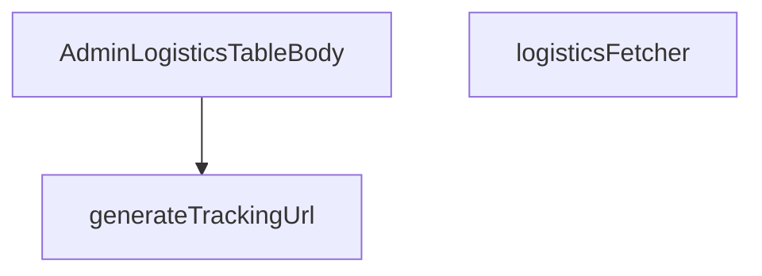

## Genel Bakış
Bu modül, admin arayüzündeki lojistik veri tablosunu göstermekle sorumludur. Taşıyıcı bazlı takip URL'lerini oluşturma, Supabase üzerinden lojistik verilerini çekme ve tablo gövdesini render etme işlevlerini bir araya getirir. Modül, lojistik süreçlerin yönetim arayüzünde veri sunumu katmanını oluşturur.

## Fonksiyon Grupları
### Veri Çekme ve İşleme
Bu grup, Supabase veritabanından lojistik kayıtlarını çekmek ve istemci tarafında filtreleme/sıralama için gerekli verileri hazırlamakla sorumludur.
- logisticsFetcher

### Yardımcı İşlevler
Bu grup, veri gösterimi sırasında gerekli olan yardımcı dönüşümleri ve hesaplamaları içerir; özellikle taşıyıcı bilgilerini kullanarak izleme linkleri üretir.
- generateTrackingUrl

### Görünüm Bileşeni
Bu grup, tüm veriyi ve yardımcı işlevleri bir araya getirerek admin tablosunun satır bazlı görünümünü oluşturan ana React bileşenini içerir.
- AdminLogisticsTableBody

---

## AXIOMS – Mimari Varsayımlar

Bu modül lojistik siparişlerin admin panelinde tablo halinde görüntülenmesini sağlar. Aşağıdaki varsayımlar fonksiyon imzalarından türetilmiştir:

[Aksiyom 1]: Eğer `carrier` parametresi bilinen/desteklenen bir kargo firması değilse, `generateTrackingUrl` `null` döner.

[Aksiyom 2]: Eğer `tracking` parametresi boş bir string ise, `generateTrackingUrl` geçerli bir URL üretemeyebilir (sonuç `null` olabilir).

[Aksiyom 3]: Eğer `supabaseClient` parametresi `Database` generic tipi ile doğru shemaya sahip değilse, `logisticsFetcher` beklenen `LogisticsRow` verisini getiremez ve hata fırlatır.

[Aksiyom 4]: Eğer `params: FetchParams` içeriği (sayfalama, sıralama, filtreleme parametreleri) geçerli değilse, `logisticsFetcher` geçerli bir `FetchResult<LogisticsRow>` sonucu üretemez.

[Aksiyom 5]: Eğer `SORT_COLUMN_MAP` sabiti tanımlı değilse veya UI'dan gelen sıralama sütunu map'te karşılık bulamazsa, sıralama行为bozulur veya beklenmeyen sütuna göre sıralama yapılır.

[Aksiyom 6]: `AdminLogisticsTableBody` bir React.FC olarak, dışarıdan logistics verisi prop olarak almalıdır; aksi takdirde boş/hatalı tablo render edilir.

---

## FONKSİYON DETAYLARI

### generateTrackingUrl
**Ne yapar**: Belirli bir kargo firmasının ve takip numarasının birleşiminden, o firmaya özel kargo takip sayfasının URL'sini oluşturur.
**Nasıl yapar**: `carrier` parametresini küçük harfe dönüştürerek içeriğini kontrol eder. “yurtici”, “aras”, “mng” veya “ptt” dizelerini içermesine göre, o kargo firmasının resmi takip URL'sini takip numarasını(query parametresi olarak) ekleyerek string olarak döndürür. Tanınmayan bir kargo firması gelirse `null` değerini döndürür.
**Parametreler**:
- carrier: string — Kargo firmasının adı veya tanımı. Fonksiyon, bu parametrenin küçük harfe dönüştürülmüş hâlindeki içeriğine bakarak firmayı tanır.
- tracking: string — Kargo firmanın sistemindeki benzersiz takip numarası.
**Dönüş**: string | null — Oluşturulan takip URL'si veya kargo firması tanınmıyorsa null.

### logisticsFetcher
**Ne yapar**: Veritabanından, belirli durumlardaki (confirmed, processing) ve henüz kargoya verilmemiş (shipped_at null) siparişlerin lojistik bilgilerini getirir.
**Nasıl yapar**: Fonksiyon, oturum tazeliğini kontrol eden bir yardımcıyı çağırarak başlar. Supabase istemcisi ile `view_admin_orders` view'ına bir sorgu oluşturur. Seçilen alanları, toplam eşleşme sayısını ve temel filtreleri (durum ve kargoya verilme tarihi) ayarlar. `params.query` ile gelen arama metni varsa, `search_text` sütunu üzerinde büyük/küçük harf duyarsız bir arama (ilike) ekler. Sıralama parametreleri, tanımlı bir sıralama sütunu varsa onu, yoksa varsayılan olarak `created_at` sütununu kullanır. Sayfalama için offset hesaplayarak sorguyu çalıştırır ve sonucu, API'nin beklediği `LogisticsRow` tipine dönüştürerek döndürür.
**Parametreler**:
- supabaseClient: SupabaseClient<Database> — Veritabanı işlemleri için kullanılacak, tiplendirilmiş Supabase istemcisi nesnesi.
- params: FetchParams — Sorgu metni (`query`), sıralama bilgisi (`sort`) ve sayfalama parametrelerini (`page`, `pageSize`) içeren nesne.
**Dönüş**: Promise<FetchResult<LogisticsRow>> — Sorgu sonucu olarak `LogisticsRow` dizisi ve toplam eşleşen kayıt sayısını (`totalMatched`) içeren bir promise döndürür.

### AdminLogisticsTableBody
**Ne yapar**: Lojistik siparişlerin listelendiği admin tablosunun gövdesini (satırlarını) render eden bir React fonksiyonel bileşenidir.
**Nasıl yapar**: Fonksiyon, bir React.FC (Functional Component) döndürür. Fonksiyonun kendi implementasyon kodu verilmemiş olup, sadece dönüş tipi belirtilmiştir.
**Parametreler**: Parametre almaz (React bileşenleri props alabilir ancak bu fonksiyonun imzasında props belirtilmemiştir).
**Dönüş**: React.FC — Lojistik tablosunun gövdesini (muhtemelen `<tbody>` elementi ve satırları) oluşturan bir React bileşeni.

---

## İTHALATLAR (IMPORTS)
- import: @/components/admin/AdminEmptyState::AdminEmptyState
- import: @/components/admin/AdminToolbar::AdminToolbar
- import: @/components/admin/ExportMenu::ExportMenu
- import: @/components/admin/data-table/BulkBar::BulkBar
- import: @/components/admin/data-table/BulkBar::type BulkAction
- import: @/components/admin/data-table/DataTableKit::DataTableKit
- import: @/components/admin/data-table/types::type { AdminColumn }
- import: @/hooks/useAdminTable::type FetchParams
- import: @/hooks/useAdminTable::type FetchResult
- import: @/hooks/useAdminTable::useAdminTable
- import: @/hooks/useRole::useRole
- import: @/i18n/I18nProvider::useI18n
- import: @/i18n/datetime::formatDateTime
- import: @/lib/admin/mutateWithAudit::AdminPermissionError
- import: @/lib/admin/mutateWithAudit::mutateWithAudit
- import: @/lib/ensureSessionFresh::ensureSessionFresh
- import: @/lib/supabase/client::supabaseBrowserClient
- import: @/types/database.types::type { Database }
- import: @supabase/supabase-js::type { SupabaseClient }
- import: lucide-react::PackageSearch
- import: lucide-react::SearchX
- import: react::React
- import: react::useCallback
- import: react::useMemo
- import: react::useState
- import: sonner::toast

---

## INTERFACES

### LogisticsRow
- `id: string`
- `order_number: string`
- `customer_name: string`
- `created_at: string`
- `carrier: string`
- `tracking_number: string`
- `saved: boolean`

---

## SABİTLER
- **SORT_COLUMN_MAP** (object) — `{
  order_number: 'order_number',
  customer_name: 'customer_name',
  crea...`

---

## AST POINTERS

### [N1_NASIL] AST Pointer: src/views/admin/AdminLogisticsTableBody.tsx::generateTrackingUrl
- **params**: `(carrier: string, tracking: string)`
- **ic_degiskenler**:
  - `c` — carrier değerinin küçük harfe çevrilmiş hali, kargo firması adı eşleştirmesi için kullanılır
- **Dönüş**: `string | null` — kargo firmasına uygun takip URL'ini veya eşleşme yoksa `null` döner

---

### [N2_NASIL] AST Pointer: src/views/admin/AdminLogisticsTableBody.tsx::logisticsFetcher
- **params**: `(supabaseClient: SupabaseClient<Database>, params: FetchParams)`
- **ic_degiskenler**:
  - `query` — Supabase sorgu zinciri; `view_admin_orders` tablosundan `LOGISTICS_SELECT` ile veri çeker, `status` filtresi `['confirmed', 'processing']` ve `shipped_at` null olan kayıtları seçer
  - `q` — `params.query` değerinin trim edilmiş hali; arama metnidir, boşsa sorguya `ilike` eklemez
  - `sortKey` — `params.sort?.key` değerinden alınan sıralama anahtarı
  - `col` — `sortKey`'e karşılık gelen `SORT_COLUMN_MAP` sözlüğünden kolon adı; sıralama için kullanılır
  - `ascending` — `params.sort?.dir === 'asc'` karşılaştırması ile belirlenen sıralama yönü
  - `offset` — sayfalama için hesaplanan satır başlangıç indeksi: `(params.page - 1) * params.pageSize`
  - `data` — Supabase sorgusundan dönen ham satır verisi
  - `error` — Supabase sorgu hatası
  - `count` — Supabase'in döndürdüğü toplam eşleşen kayıt sayısı
  - `rows` — ham verinin `LogisticsRow` tipine dönüştürülmüş hali; her satır `id`, `order_number`, `customer_name`, `created_at`, `carrier`, `tracking_number`, `saved` alanlarını içerir; `order_number` yoksa `r.id`'nin ilk 8 karakteri kullanılır
- **API Çağrıları**: `ensureSessionFresh()` — oturum tazeliğini doğrular; `supabaseClient.from('view_admin_orders').select(...)` — veritabanı sorgusu
- **Dönüş**: `Promise<FetchResult<LogisticsRow>>` — `{ rows, totalMatched }` nesnesi; `totalMatched` `count`sayısal ise `count`, değilse `0`

---

### [N3_NASIL] AST Pointer: src/views/admin/AdminLogisticsTableBody.tsx::AdminLogisticsTableBody
- **params**: (parametre yok)
- **ic_degiskenler**:
  - `selectedIds` — tablo seçimindeki seçili satır ID'leri dizisi (`table.selection.selectedIds`)
  - `targets` — `table.rows` içinden, seçili ID'lerde olan ve `tracking_number`'i boş olmayan satırların filtrelenmiş dizisi; toplu güncelleme hedefleri
  - `errCount` — toplu güncelleme sırasında hata alan satır sayacı
  - `results` — `mutateWithAudit` çağrısının döndürdüğü sonuçlar dizisi; her biri `{ id, ok }` yapısındadır
  - `successfulIds` — güncellenmesi başarılı olan satır ID'leri dizisi
  - `next` — `setDrafts` state updater içinde geçici sözlük; mevcut draft'ları kopyalayıp_successful satırları siler
  - `id` — `successfulIds` dizisi içindeki her başarılı satırın ID'si; draft sözlüğünden silinir
  - `currentCarrier` — draft sözlüğünden veya satırdan okunan mevcut kargo firması; draft öncelikli, yoksa `row.carrier`, o da yoksa `'Yurtiçi'`
  - `currentTracking` — draft sözlüğünden veya satırdan okunan mevcut takip numarası; draft öncelikli, yoksa `row.tracking_number`, o da yoksa boş string
  - `turl` — `generateTrackingUrl(currentCarrier, currentTracking)` çağrısı ile oluşturulan takip URL'i
  - `fnErr` — `supabase.functions.invoke('admin-update-shipping')` çağrısından dönen hata
  - `row` — `targets.map` içindeki her bir satır nesnesi; `id`, `carrier`, `tracking_number` alanlarına erişilir
  - `res` — `results.forEach` içindeki her bir sonuç nesnesi; `res.ok` ve `res.id` alanları kullanılır
  - `csv` — BOM karakteri + header satırı + veri satırlarından oluşan CSV string'i
  - `blob` — CSV verisinden oluşturulan `Blob` nesnesi; `text/csv;charset=utf-8` MIME tipi ile
  - `url` — `URL.createObjectURL(blob)` ile oluşturulan nesne URL'i; dosya indirme linki
  - `a` — `document.createElement('a')` ile oluşturulan geçici DOM linki; `logistics.csv` olarak indirme tetikler
  - `lines` — her satırın CSV formatına dönüştürülmüş hali; `order_number`, `customer_name` (tırnak escape'li), `created_at`, `carrier`, `tracking_number` alanlarıvirgüllle ayrılır
  - `header` — CSV başlık satırı; `t()` i18n fonksiyonu ile yerelleştirilmiş kolon adları
  - `r` — `rows.map` içindeki her bir dışa aktarılacak satır nesnesi
  - `r` — `table.rows.map` içindeki (columns callback) her sütun hücre çizimi için satır verisi; `r.order_number`, `r.customer_name`, `r.created_at`, `r.carrier`, `r.tracking_number`, `r.id` alanlarına erişilir
- **API Çağrıları**:
  - `supabase.functions.invoke('admin-update-shipping')` — Edge function çağrısı; `order_id`, `carrier`, `tracking_number`, `tracking_url`, `send_email` parametreleri ile kargo güncelleme işlemi
  - `mutateWithAudit(supabase, { ... })` — audit loglu mutasyon sarmalayıcısı; `resource: 'logistics'`, `action: 'UPDATE'` ile çalışır
  - `table.reload()` — tablo verisini yeniden yükler
  - `table.fetchAllForExport()` — dışa aktarım için tüm satırları getirir
  - `table.selection.clear()` — tüm satır seçimlerini temizler
  - `generateTrackingUrl(currentCarrier, currentTracking)` — takip URL'i üretimi
  - `formatDateTime(r.created_at, lang)` — tarih formatlama
  - `t(...)` — i18n çeviri fonksiyonu
  - `toast.success(...)`, `toast.error(...)` — bildirim gösterimi
  - `URL.createObjectURL(blob)`, `URL.revokeObjectURL(url)` — nesne URL yönetimi
- **Yan Etkileri**: `setSaving(true/false)` ile kaydetme durumu yönetimi; `setDrafts` ile draft state güncellenir; `toast` ile kullanıcıya bildirim gönderilir; Edge function ile veritabanı güncellenir ve e-posta gönderilir (`send_email: true`); CSV dosyası indirilir

---

## MERMAID CALL GRAPH

## NODE ID STANDARD

  file: src\views\admin\AdminLogisticsTableBody.tsx
  function: src\views\admin\AdminLogisticsTableBody.tsx::generateTrackingUrl
  function: src\views\admin\AdminLogisticsTableBody.tsx::logisticsFetcher
  function: src\views\admin\AdminLogisticsTableBody.tsx::AdminLogisticsTableBody

---

## DISA AKTARILANLAR (EXPORTS)
  export: AdminLogisticsTableBody
  export: generateTrackingUrl
  export: logisticsFetcher

---

## STİL TOKENLERİ

### Arbitrary Değerler (token'a geçirilmemiş)
Yok — tüm stiller token'a geçirilmiş. ✅

### Kullanılan Token'lar (zaten token'a geçirilmiş)
- `tracking-hvac-normal`

### Tailwind Sınıf Özeti
- **Renkler:** `bg-cyan-500/10`, `bg-cyan-500/5`, `bg-white/5`, `border-cyan-500/20`, `border-white/10`, `group-hover:bg-cyan-500/10`, `hover:bg-white/10`, `hover:border-white/20`, `text-cyan-400`, `text-slate-100`, `text-slate-400`, `text-slate-500`, `text-white`, `text-xs`
- **Layout:** `absolute`, `block`, `flex`, `flex-1`, `flex-col`, `gap-6`, `h-12`, `h-64`, `max-w-xs`, `md:flex-row`, `md:items-end`, `min-w-140px`, `overflow-hidden`, `p-8`, `relative`
- **Varyant/Responsive:** `active:`, `disabled:`, `focus:`, `group-hover:`, `hover:`, `md:` önekleri
- **Yardımcı Sınıflar:** `!bg-surface-deep/60`, `!font-mono`, `!py-2`, `!rounded-xl`, `!text-xs`, `${adminCardClass`, `${adminInputClass`, `${adminSelectClass`, `-mr-32`, `-mt-32`, `active:scale-95`, `blur-3xl`, `border`, `disabled:opacity-40`, `focus:!bg-white/3`