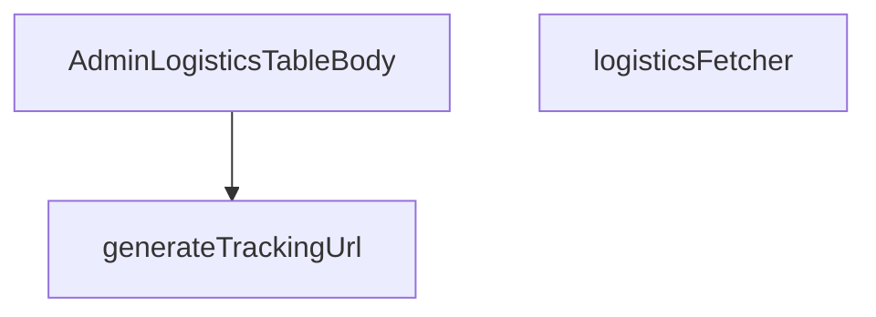

## Genel Bakış
Bu modül, admin arayüzündeki lojistik veri tablosunun gövdesini oluşturan React bileşenini ve ona yardımcı veri sağlama ile dönüşüm fonksiyonlarını barındırır. Taşıyıcı bazlı takip URL'lerini dinamik olarak oluşturma, Supabase üzerinden asenkron veri çekme ve elde edilen veriyi tablo satırlarına dönüştürerek sunma sorumluluklarını merkezi olarak yönetir. Modül, lojistik sürecin yönetim panelindeki veri gösterimi ve etkileşim katmanının temel yapı taşını oluşturur.

## Fonksiyon Grupları
### Veri Sağlama ve İşleme
Bu grup, dış veri kaynağıyla (Supabase) doğrudan iletişim kurarak lojistik kayıtlarını getirme ve bileşen için hazır hale getirme sorumluluğunu taşır.
- logisticsFetcher

### Yardımcı Dönüşüm İşlevleri
Bu grup, ham veriyi kullanıcı arayüzünde anlamlı hale getirmek için gerekli olan hesaplamaları ve URL oluşturma mantığını içerir; özellikle taşıyıcı bilgisini izleme linkine dönüştürür.
- generateTrackingUrl

### Görünüm Bileşeni
Bu grup, tüm veri akışını ve yardımcı işlevleri bir araya getirerek admin tablosunun satır bazlı, dinamik içeriğini oluşturan ana React bileşenini tanımlar.
- AdminLogisticsTableBody

---

## AXIOMS – Mimari Varsayımlar

Bu modül, admin arayüzünde lojistik tablosunu render eden bir React component'inden oluşur. Veri çekme, sıralama ve takip URL oluşturma işlevlerini kapsar.

**[Aksiyom 1]:** Eğer `generateTrackingUrl` fonksiyonuna geçerli bir `carrier` ve `tracking` değeri verilmezse, fonksiyon `null` döner.

**[Aksiyom 2]:** Eğer `logisticsFetcher` fonksiyonuna geçerli bir `supabaseClient` (Database tipinde) veya geçerli bir `params` (FetchParams tipinde) verilmezse, veri çekme işlemi başarısız olur.

**[Aksiyom 3]:** Eğer `SORT_COLUMN_MAP` sabiti tanımlı değilse veya beklenen sütun eşlemelerini içermiyorsa, tabloda sütuna göre sıralama doğru çalışmaz.

**[Aksiyom 4]:** Eğer `AdminLogisticsTableBody` component'i için gerekli props (varsa) sağlanmazsa, React component'i render edilemez veya hata verir.

**[Aksiyom 5]:** Eğer `logisticsFetcher` tarafından dönen `FetchResult<LogisticsRow>` yapısında beklenen alanlar (data, pagination vb.) eksikse, tablo gövdesinde veriler düzgün görüntülenemez.

---

## FONKSİYON DETAYLARI

### generateTrackingUrl
**Ne yapar**: Belirli bir kargo firmasının ve takip numarasının birleşiminden, o firmaya özel kargo takip sayfasının URL'sini oluşturur.
**Nasıl yapar**: `carrier` parametresini küçük harfe dönüştürerek içeriğini kontrol eder. “yurtici”, “aras”, “mng” veya “ptt” dizelerini içermesine göre, o kargo firmasının resmi takip URL'sini takip numarasını(query parametresi olarak) ekleyerek string olarak döndürür. Tanınmayan bir kargo firması gelirse `null` değerini döndürür.
**Parametreler**:
- carrier: string — Kargo firmasının adı veya tanımı. Fonksiyon, bu parametrenin küçük harfe dönüştürülmüş hâlindeki içeriğine bakarak firmayı tanır.
- tracking: string — Kargo firmanın sistemindeki benzersiz takip numarası.
**Dönüş**: string | null — Oluşturulan takip URL'si veya kargo firması tanınmıyorsa null.

### logisticsFetcher
**Ne yapar**: Veritabanından, belirli durumlardaki (confirmed, processing) ve henüz kargoya verilmemiş (shipped_at null) siparişlerin lojistik bilgilerini getirir.
**Nasıl yapar**: Fonksiyon, oturum tazeliğini kontrol eden bir yardımcıyı çağırarak başlar. Supabase istemcisi ile `view_admin_orders` view'ına bir sorgu oluşturur. Seçilen alanları, toplam eşleşme sayısını ve temel filtreleri (durum ve kargoya verilme tarihi) ayarlar. `params.query` ile gelen arama metni varsa, `search_text` sütunu üzerinde büyük/küçük harf duyarsız bir arama (ilike) ekler. Sıralama parametreleri, tanımlı bir sıralama sütunu varsa onu, yoksa varsayılan olarak `created_at` sütununu kullanır. Sayfalama için offset hesaplayarak sorguyu çalıştırır ve sonucu, API'nin beklediği `LogisticsRow` tipine dönüştürerek döndürür.
**Parametreler**:
- supabaseClient: SupabaseClient<Database> — Veritabanı işlemleri için kullanılacak, tiplendirilmiş Supabase istemcisi nesnesi.
- params: FetchParams — Sorgu metni (`query`), sıralama bilgisi (`sort`) ve sayfalama parametrelerini (`page`, `pageSize`) içeren nesne.
**Dönüş**: Promise<FetchResult<LogisticsRow>> — Sorgu sonucu olarak `LogisticsRow` dizisi ve toplam eşleşen kayıt sayısını (`totalMatched`) içeren bir promise döndürür.

### AdminLogisticsTableBody
**Ne yapar**: Lojistik siparişlerin listelendiği admin tablosunun gövdesini (satırlarını) render eden bir React fonksiyonel bileşenidir.
**Nasıl yapar**: Fonksiyon, bir React.FC (Functional Component) döndürür. Fonksiyonun kendi implementasyon kodu verilmemiş olup, sadece dönüş tipi belirtilmiştir.
**Parametreler**: Parametre almaz (React bileşenleri props alabilir ancak bu fonksiyonun imzasında props belirtilmemiştir).
**Dönüş**: React.FC — Lojistik tablosunun gövdesini (muhtemelen `<tbody>` elementi ve satırları) oluşturan bir React bileşeni.

---

## İTHALATLAR (IMPORTS)
- import: @/components/admin/AdminEmptyState::AdminEmptyState
- import: @/components/admin/AdminToolbar::AdminToolbar
- import: @/components/admin/ExportMenu::ExportMenu
- import: @/components/admin/data-table/BulkBar::BulkBar
- import: @/components/admin/data-table/BulkBar::type BulkAction
- import: @/components/admin/data-table/DataTableKit::DataTableKit
- import: @/components/admin/data-table/types::type { AdminColumn }
- import: @/components/admin/overlay/ConfirmProvider::useConfirm
- import: @/hooks/useAdminTable::type FetchParams
- import: @/hooks/useAdminTable::type FetchResult
- import: @/hooks/useAdminTable::useAdminTable
- import: @/hooks/useRole::useRole
- import: @/i18n/I18nProvider::useI18n
- import: @/i18n/datetime::formatDateTime
- import: @/lib/admin/mutateWithAudit::AdminPermissionError
- import: @/lib/admin/mutateWithAudit::mutateWithAudit
- import: @/lib/ensureSessionFresh::ensureSessionFresh
- import: @/lib/supabase/client::supabaseBrowserClient
- import: @/types/database.types::type { Database }
- import: @/utils/adminShipping::invokeShippingUpdate
- import: @supabase/supabase-js::type { SupabaseClient }
- import: lucide-react::PackageSearch
- import: lucide-react::SearchX
- import: react::React
- import: react::useCallback
- import: react::useMemo
- import: react::useState
- import: sonner::toast

---

## INTERFACES

### LogisticsRow
- `id: string`
- `order_number: string`
- `customer_name: string`
- `created_at: string`
- `carrier: string`
- `tracking_number: string`
- `saved: boolean`

---

## SABİTLER
- **SORT_COLUMN_MAP** (object) — `{
  order_number: 'order_number',
  customer_name: 'customer_name',
  crea...`

---

## AST POINTERS

### [N1_NASIL] AST Pointer: AdminLogisticsTableBody.tsx::generateTrackingUrl
- **params**: (carrier: string, tracking: string)
- **ic_degiskenler**:
  - `c` — carrier parametresinin boşluk veya tanımsız olma durumuna karşı güvenli küçük harfe çevrilmiş hali, kargo firması kontrolü için kullanılır
- **Dönüş**: string | null — kargo firmasına göre takip URL'ini veya eşleşme yoksa null döner

### [N2_NASIL] AST Pointer: AdminLogisticsTableBody.tsx::logisticsFetcher
- **params**: (supabaseClient: SupabaseClient<Database>, params: FetchParams)
- **ic_degiskenler**:
  - `q` — params.query değerinin trim edilmiş hali, boşsa ilike araması yapılmaz
  - `sortKey` — sıralama anahtarı, params.sort?.key'den alınır
  - `col` — SORT_COLUMN_MAP ile eşlenen veritabanı sütun adı, tanımsızsa varsayılan sıralama kullanılır
  - `ascending` — sıralama yönü, params.sort?.dir === 'asc' ile belirlenir
  - `offset` — sayfalama için başlangıç satır indeksi, (params.page - 1) * params.pageSize hesaplanır
  - `data` — Supabase sorgusundan dönen ham satır dizisi
  - `error` — Supabase sorgu hatası, varsa fırlatılır
  - `count` — toplam eşleşen kayıt sayısı (count: 'exact' ile alınır)
  - `rows` — LogisticsRow[] dizisi, data'dan map ile dönüştürülmüş normalize edilmiş satırlar
- **Dönüş**: Promise<FetchResult<LogisticsRow>> — rows ve totalMatched içeren nesne

---

## MERMAID CALL GRAPH

## NODE ID STANDARD

  file: src\views\admin\AdminLogisticsTableBody.tsx
  function: src\views\admin\AdminLogisticsTableBody.tsx::generateTrackingUrl
  function: src\views\admin\AdminLogisticsTableBody.tsx::logisticsFetcher
  function: src\views\admin\AdminLogisticsTableBody.tsx::AdminLogisticsTableBody

---

## DISA AKTARILANLAR (EXPORTS)
  export: AdminLogisticsTableBody
  export: generateTrackingUrl
  export: logisticsFetcher

---

## STİL TOKENLERİ

### Arbitrary Değerler (token'a geçirilmemiş)
Yok — tüm stiller token'a geçirilmiş. ✅

### Kullanılan Token'lar (zaten token'a geçirilmiş)
- (yok)

### Tailwind Sınıf Özeti
- **Renkler:** `bg-admin-accent-weak`, `bg-admin-surface-2`, `border-admin-accent/30`, `border-admin-border`, `group-hover:bg-admin-accent-weak`, `hover:bg-admin-surface-3`, `hover:border-admin-border`, `text-admin-accent`, `text-admin-fg`, `text-admin-fg-muted`, `text-xs`
- **Layout:** `absolute`, `block`, `flex`, `flex-1`, `flex-col`, `gap-6`, `h-12`, `h-64`, `max-w-xs`, `md:flex-row`, `md:items-end`, `min-w-140px`, `overflow-hidden`, `p-8`, `relative`
- **Varyant/Responsive:** `active:`, `disabled:`, `focus-visible:`, `group-hover:`, `hover:`, `md:` önekleri
- **Yardımcı Sınıflar:** `!bg-surface-deep/60`, `!font-mono`, `!py-2`, `!rounded-admin-md`, `!text-xs`, `${adminCardClass`, `${adminInputClass`, `${adminSelectClass`, `-mr-32`, `-mt-32`, `active:scale-95`, `blur-3xl`, `border`, `disabled:opacity-40`, `focus-visible:!bg-admin-surface-2`