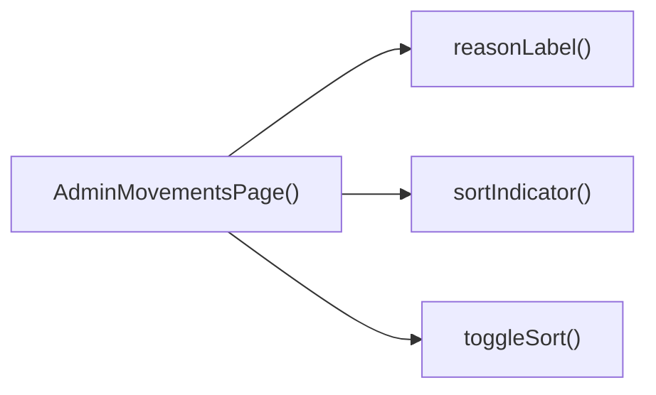

## Genel Bakış
Bu modül, VentHub HVAC yönetim platformunun yönetici panelinde yer alan hareketler takip sayfasını oluşturan React tabanlı bir bileşendir. Sisteme kaydedilen tüm hareketleri yöneticiye sunarken, listeyi düzenleme, sıralama ve farklı formatlarda dışa aktarma gibi temel işlevleri tek merkezde toplar.

## Fonksiyon Grupları
### Ana Sayfa Bileşeni ve Etiketleme Yardımcısı
Modülün ana giriş noktası olan tüm sayfa bileşenini ve hareket nedenlerini yerelleştirilmiş, kullanıcı dostu etiketlere dönüştüren yardımcı fonksiyonu içerir.
- AdminMovementsPage, reasonLabel

### Sıralama Yönetimi Fonksiyonları
Hareket listesinin sütun bazında sıralanmasını yöneten, sıralama durumunu güncelleyen ve kullanıcı arayüzünde göstermek için gösterge üreten işlevleri barındırır.
- toggleSort, sortIndicator

### Veri Dışa Aktarma Fonksiyonları
Listelenen hareket verilerini yaygın kullanılan dosya formatlarında dışa aktarmak için kullanılan işlevleri içerir.
- exportCsv, exportXls

---

## AXIOMS – Mimari Varsayımlar
Bu modül, VentHub HVAC sisteminin admin paneli üzerindeki sistem hareketlerini listeleyen, sıralama, etiketleme ve dosya dışa aktarma işlemlerini yöneten React frontend bileşenidir, doğru çalışması için yetkilendirme, veri ve bağımlılık geçerliliği zorunludur.

[Aksiyom 1]: Eğer reasonLabel fonksiyonuna iletilen çeviri fonksiyonu `t` geçerli bir işlev değilse veya modül sabiti ALL_REASONS tanımsız/geçersiz bir yapıdaysa, hareket sebeplerinin arayüzde doğru şekilde gösterilmesi olanaksız hale gelir, bozuk/çevrilmemiş etiketler görüntülenir.
[Aksiyom 2]: Eğer toggleSort ve sortIndicator fonksiyonlarına iletilen SortKey tipindeki değerler, işlenen hareket nesnelerinin öznitelik anahtarlarıyla eşleşmiyorsa, listedeki sıralama işlemi çalışmaz, sıralama durumu göstergeleri kullanıcıya yanlış bilgi iletir.
[Aksiyom 3]: Eğer exportCsv() ve exportXls() fonksiyonlarının çalıştığı oturumdaki admin kullanıcısının veri dışa aktarma izni yoksa veya dışa aktarılacak hareket verisi sunucudan eksik/geçersiz olarak çekilmişse, CSV ve Excel dışa aktarma işlemleri başarısız olur, kullanıcı hatası oluşur.
[Aksiyom 4]: Eğer AdminMovementsPage ana bileşenine erişimden önce parent bileşenler tarafından admin yetkisi doğrulaması yapılmamışsa, yetkisiz kullanıcıların hassas hareket verilerine erişmesi mümkün hale gelir, ciddi güvenlik ihlali meydana gelir.
[Aksiyom 5]: Eğer reasonLabel fonksiyonuna iletilen null/undefined olmayan `key` parametresi, ALL_REASONS sabiti içinde tanımlı değilse, ilgili hareketin sebebi kullanıcıya doğru şekilde iletilemez, arayüzde tanımsız etiket görüntülenir.

---

## FONKSIYON DETAYLARI

### reasonLabel
**Ne yapar**: Hareket kayıtlarındaki neden alanı için insan tarafından okunabilir, çevrilmiş bir etiket oluşturan yardımcı fonksiyondur. Sistemdeki hareket nedenlerini kullanıcı arayüzünde anlaşılır şekilde göstermek amacıyla kullanılır.
**Nasıl yapar**: Uluslararasılaştırma altyapısı için kullanılan çeviri fonksiyonunu entegre ederek, parametre olarak aldığı neden anahtarını karşılığı olan dile çevirir. Gelen anahtar null veya undefined olduğunda da hatasız çalışarak boş veya varsayılan bir string değeri döndürür.
**Parametreler**:
- key: string | null | undefined — Çevirisi yapılacak hareket nedenini temsil eden benzersiz anahtar, null veya undefined olabilecek şekilde tanımlanmıştır
- t: (k: string) => string — Uluslararasılaştırma (i18n) amacıyla kullanılan, metin anahtarı alıp o dile ait çevrilmiş stringi döndüren çeviri fonksiyonu
**Dönüş**: string — Gelen anahtara ait çevrilmiş, okunabilir hareket nedeni etiketi, herhangi bir durumda string tipinde değer döndürür

### AdminMovementsPage
**Ne yapar**: VentHub HVAC sisteminin admin paneli bünyesinde tüm sistem hareket kayıtlarını listeleyen ana sayfa React bileşenidir. Kullanıcıların hareketleri görüntülemesi, sıralaması, filtrelemesi ve dışa aktarması için gereken tüm arayüz ve işlevleri bir araya getirir.
**Nasıl yapar**: Sayfadaki tüm alt bileşenleri, kullanıcı etkileşimlerini yöneten yardımcı fonksiyonları ve durum yönetimi mantığını bir araya getirerek tek bir sayfa bileşeni olarak sunar. Sayfa açıldığında hareket verilerini çeker, kullanıcı işlemlerine göre veriyi güncelleyerek arayüzü yeniden render eder.
**Parametreler**: Herhangi bir parametre almaz, ana sayfa bileşeni olarak bağımsız çalışır
**Dönüş**: React.FC — React uygulaması tarafından kullanılabilecek, sayfa içeriğini tam olarak render eden fonksiyonel React bileşeni

### toggleSort
**Ne yapar**: Hareket listesi tablosunda sıralama işlemini yöneten kullanıcı etkileşimi fonksiyonudur. Kullanıcının bir sütun başlığına tıklamasıyla tetiklenerek sıralama mantığını günceller.
**Nasıl yapar**: Bileşen içerisinde saklanan aktif sıralama anahtarı ve sıralama yönü durumunu günceller. Tıklanan sütunun anahtarı mevcut aktif sıralama anahtarıyla eşleşiyorsa sıralama yönünü tersine çevirir, farklıysa yeni anahtarı aktif sıralama anahtarı olarak atayıp varsayılan sıralama yönünü ayarlar.
**Parametreler**:
- key: SortKey — Sıralama işleminin uygulanacağı tablo sütununu temsil eden, önceden tanımlanmış türdeki sıralama anahtarı
**Dönüş**: void — Herhangi bir değer döndürmez, yalnızca bileşenin iç durumunu günceller

### sortIndicator
**Ne yapar**: Tablodaki aktif sıralama sütununun yönünü gösteren görsel ok işaretini döndüren yardımcı fonksiyondur. Kullanıcıların hangi sütuna göre hangi yönde sıralama yapıldığını kolayca görmesini sağlar.
**Nasıl yapar**: Parametre olarak aldığı sıralama anahtarının mevcut aktif sıralama anahtarıyla eşleşip eşleşmediğini kontrol eder. Eşleşme durumunda mevcut sıralama yönüne göre ilgili ok karakterini döndürür, eşleşme yoksa boş bir değer döndürerek aktif olmayan sütunlarda gösterim yapmaz.
**Parametreler**:
- key: SortKey — Görsel gösteriminin oluşturulacağı tablo sütununu temsil eden sıralama anahtarı
**Dönüş**: string — Sıralama yönü artan ('asc') ise '▲', azalan ('desc') ise '▼' karakterini, anahtar aktif değilse boş string döndürür

### exportCsv
**Ne yapar**: Sayfada mevcut filtre ve sıralama koşullarına göre listelenen tüm hareket kayıtlarını CSV formatında kullanıcının cihazına indiren dışa aktarma fonksiyonudur. Kullanıcıların verileri basit tablo formatında saklamasını sağlar.
**Nasıl yapar**: Bileşen içerisindeki mevcut filtrelenmiş ve sıralanmış hareket verisini alır, CSV standartlarına uygun şekilde yapılandırır, tarayıcı üzerinden otomatik indirme işlemini tetikler. Tüm virgül ayırma, metin sarmalama gibi standart CSV gereksinimlerini karşılar.
**Parametreler**: Herhangi bir parametre almaz, bileşenin iç durumundaki veri ve ayarları kullanır
**Dönüş**: void — Herhangi bir değer döndürmez, yalnızca dosya indirme işlemini tetikler

### exportXls
**Ne yapar**: Sayfada mevcut filtre ve sıralama koşullarına göre listelenen tüm hareket kayıtlarını Microsoft Excel uyumlu XLS formatında kullanıcının cihazına indiren dışa aktarma fonksiyonudur. Kullanıcıların verileri Excel üzerinde analiz etmesini kolaylaştırır.
**Nasıl yapar**: Bileşen içerisindeki mevcut filtrelenmiş ve sıralanmış hareket verisini alır, standart XLS dosya formatına uygun şekilde yapılandırır, tarayıcı üzerinden indirme işlemini başlatır. Excel tarafından sorunsuz açılabilecek şekilde dosya yapısını oluşturur.
**Parametreler**: Herhangi bir parametre almaz, bileşenin iç durumundaki veri ve ayarları kullanır
**Dönüş**: void — Herhangi bir değer döndürmez, yalnızca dosya indirme işlemini tetikler

---

## TYPE ALIASES

### Movement
```typescript
type Movement = {
  id: string
  product_id: string
  delta: number
  reason: string | null
  order_id?: string | null
  created_at: string
  batch_id?: string | null
}
```

### Product
```typescript
type Product = { id: string; name: string; sku?: string; category_id?: string | null }
```

### Category
```typescript
type Category = { id: string; name: string }
```

### SortKey
```typescript
type SortKey = 'date' | 'product' | 'delta' | 'reason' | 'ref'
```

---

## ENUMS

### LoadState
- `Idle`
- `Loading`
- `Error`

---

## SABİTLER
- **ALL_REASONS** (as_expression) — `['sale', 'po_receipt', 'manual_in', 'manual_out', 'adjust', 'return_in', 'tra...`

---

## AST POINTERS

### [N1_NASIL] AST Pointer: C:\Users\alize\venthub-hvac\src\views\admin\AdminMovementsPage.tsx::reasonLabel
- **params**: key: string | null | undefined, t: (k: string) => string
- **ic_degiskenler**:
  - `val` — Giriş anahtarını string formatına dönüştürerek saklar, işlem koşullarında kullanılır
- **Dönüş**: string

### [N2_NASIL] AST Pointer: C:\Users\alize\venthub-hvac\src\views\admin\AdminMovementsPage.tsx::async_fetch_movements
- **params**: pageNum: number
- **ic_degiskenler**:
  - `setLoading` — Yükleme durumunu güncellemek için kullanılan state setter fonksiyonu
  - `ensureSessionFresh` — Oturumun geçerliliğini kontrol eden yardımcı fonksiyon
  - `from` — Sayfalama için verinin başlangıç indeksini hesaplar
  - `to` — Sayfalama için verinin bitiş indeksini hesaplar
  - `query` — Supabase sorgusu nesnesi, filtreler ve sıralama eklenerek güncellenir
  - `supabase.from('inventory_movements')` - Stok hareketleri tablosuna erişim sağlayan supabase nesnesi
  - `batchFilter` — Toplu işlem filtresi, sorguya eq koşulu ekler
  - `dateRange?.from` — Başlangıç tarih filtresi, sorguya gte koşulu ekler
  - `dateRange?.to` — Bitiş tarih filtresi, sorguya lte koşulu ekler
  - `endOfDay` — Bitiş tarihini gün sonuna ayarlayan yardımcı fonksiyon
  - `data` — Sorgudan dönen ham hareket verisi
  - `error` — Sorgu sırasında oluşan hata nesnesi
  - `count` — Toplam eşleşen kayıt sayısı
  - `movements` — Tip ataması yapılmış Movement türünde hareketler dizisi
  - `setRows` — Tablo satırlarını güncelleyen state setter
  - `ids` — Hareketlerdeki benzersiz ürün kimlikleri kümesi
  - `Promise.all` — Ürün ve kategori sorgularını paralel çalıştırır
  - `prodRes` — Ürün sorgusundan dönen cevap nesnesi
  - `catRes` — Kategori sorgusundan dönen cevap nesnesi
  - `map` — Ürün kimliklerine göre ürün nesnelerini saklayan harita nesnesi
  - `cmap` — Ürün kimliklerine göre kategori kimliklerini saklayan harita nesnesi
  - `prodRes.data` — Ürün verisi dizisi, forEach ile haritalara işlenir
  - `setProductMap` — Ürün haritasını güncelleyen state setter
  - `setProductCategoryMap` — Kategori eşleşme haritasını güncelleyen state setter
  - `catRes.error` — Kategori sorgusu hatası kontrolü
  - `setCategories` — Kategori listesini güncelleyen state setter
  - `setHasMore` — Sonraki sayfa olup olmadığını belirten state setter
  - `setError` — Hata mesajını güncelleyen state setter
  - `t` — Çeviri fonksiyonu, hata mesajı çevirisi için kullanılır
- **Dönüş**: yok

### [N3_NASIL] AST Pointer: C:\Users\alize\venthub-hvac\src\views\admin\AdminMovementsPage.tsx::set_batch_filter
- **params**: (yok)
- **ic_degiskenler**:
  - `searchParams?.get('batch')` — URL'den batch parametresini çeker
  - `b` — Kesilmiş boşluksuz batch filtresi değeri
  - `setBatchFilter` — Toplu filtre state'ini güncelleyen setter
- **Dönüş**: yok

### [N4_NASIL] AST Pointer: C:\Users\alize\venthub-hvac\src\views\admin\AdminMovementsPage.tsx::filter_used_categories
- **params**: (yok)
- **ic_degiskenler**:
  - `idSet` — Kullanılan kategori kimliklerini saklayan benzersiz değer kümesi
  - `rows` — Tüm stok hareketleri dizisi
  - `productCategoryMap[m.product_id]` — Hareketin ait olduğu kategori kimliği
  - `categories` — Tüm mevcut kategoriler listesi
- **Dönüş**: Kullanılan kategorilerden oluşan dizi

### [N5_NASIL] AST Pointer: C:\Users\alize\venthub-hvac\src\views\admin\AdminMovementsPage.tsx::add_category_to_ids
- **params**: m: Movement nesnesi
- **ic_degiskenler**:
  - `cid` — Ürünün kategori kimliği
  - `productCategoryMap[m.product_id]` — Üründen kategori kimliğini çekme
  - `idSet` — Kategori kimliklerini eklediğimiz benzersiz küme
- **Dönüş**: yok

### [N6_NASIL] AST Pointer: C:\Users\alize\venthub-hvac\src\views\admin\AdminMovementsPage.tsx::filter_rows
- **params**: (yok)
- **ic_degiskenler**:
  - `base` — Filtreleme işlemleri uygulanacak ana hareket dizisi
  - `term` — Küçük harfe çevrilmiş arama terimi
  - `q` — Ham arama terimi
  - `productMap[r.product_id]` — Satırdaki ürünün bilgileri
  - `name` — Ürün isminin küçük harf hali
  - `sku` — Ürün stok kodunun küçük harf hali
  - `selectedCategory` — Seçili kategori filtresi değeri
  - `anyReason` — Hiçbir neden filtresinin aktif olup olmadığını kontrol eder
  - `reasonFilter` — Nedenlere göre aktiflik durumu saklayan nesne
  - `reasonFilter[String(m.reason || '')]` — Hareketin nedeninin filtredeki aktifliği
- **Dönüş**: Filtrelenmiş hareket dizisi

### [N7_NASIL] AST Pointer: C:\Users\alize\venthub-hvac\src\views\admin\AdminMovementsPage.tsx::search_filter_callback
- **params**: r: Movement nesnesi
- **ic_degiskenler**:
  - `p` — Satırdaki ürünün bilgileri
  - `productMap[r.product_id]` — Ürün bilgilerini haritadan çekme
  - `name` — Ürün isminin küçük harf hali
  - `sku` — Ürün stok kodunun küçük harf hali
  - `term` — Arama terimi
- **Dönüş**: boolean, arama terimiyle eşleşme durumu

### [N8_NASIL] AST Pointer: C:\Users\alize\venthub-hvac\src\views\admin\AdminMovementsPage.tsx::sort_filtered_rows
- **params**: (yok)
- **ic_degiskenler**:
  - `arr` — Kopyalanmış filtrelenmiş hareket dizisi, sıralama için kullanılır
  - `filtered` — Orijinal filtrelenmiş hareket listesi
  - `dir` — Sıralama yönü çarpanı, asc ise 1, desc ise -1
  - `sortDir` — Mevcut sıralama yönü state'i
  - `sortKey` — Mevcut sıralama yapılacak alan anahtarı
  - `Date.parse(a.created_at)` — Tarih değerini sayısal olarak sıralama için dönüştürme
  - `an` — a hareketindeki ürün isminin küçük harf hali
  - `bn` — b hareketindeki ürün isminin küçük harf hali
  - `ar` — a hareketindeki sipariş kimliği string'i
  - `br` — b hareketindeki sipariş kimliği string'i
- **Dönüş**: Sıralanmış hareket dizisi

### [N9_NASIL] AST Pointer: C:\Users\alize\venthub-hvac\src\views\admin\AdminMovementsPage.tsx::sort_compare_callback
- **params**: a: Movement, b: Movement
- **ic_degiskenler**:
  - `dir` — Sıralama yönü çarpanı
  - `sortDir` — Mevcut sıralama yönü
  - `sortKey` — Sıralama yapılacak alan anahtarı
  - `Date.parse(a.created_at)` — Tarih karşılaştırması için sayısal dönüşüm
  - `an` — a ürününün ismi
  - `bn` — b ürününün ismi
  - `ar` — a sipariş kimliği
  - `br` — b sipariş kimliği
- **Dönüş**: sayısal sıralama sonucu

### [N10_NASIL] AST Pointer: C:\Users\alize\venthub-hvac\src\views\admin\AdminMovementsPage.tsx::toggleSort
- **params**: key: SortKey
- **ic_degiskenler**:
  - `sortKey` — Mevcut aktif sıralama anahtarı
  - `setSortDir` — Sıralama yönünü güncelleyen state setter
  - `setSortKey` — Sıralama anahtarını güncelleyen state setter
- **Dönüş**: yok

### [N11_NASIL] AST Pointer: C:\Users\alize\venthub-hvac\src\views\admin\AdminMovementsPage.tsx::sortIndicator
- **params**: key: SortKey
- **ic_degiskenler**:
  - `sortKey` — Mevcut aktif sıralama anahtarı
  - `sortDir` — Mevcut sıralama yönü
- **Dönüş**: Sıralama yönünü gösteren ok işareti veya boş string

### [N12_NASIL] AST Pointer: C:\Users\alize\venthub-hvac\src\views\admin\AdminMovementsPage.tsx::exportCsv
- **params**: (yok)
- **ic_degiskenler**:
  - `h` — CSV başlık satırı, çevrilmiş başlıkları içerir
  - `t` — Çeviri fonksiyonu, başlıkların çevirisi için kullanılır
  - `lines` — CSV dosyasının veri satırları
  - `filtered` — Dışa aktarılacak filtrelenmiş hareket listesi
  - `p` — Hareketin ait olduğu ürün nesnesi
  - `formatDateTime` — Tarih formatlama fonksiyonu
  - `lang` — Aktif dil kodu
  - `reasonLabel` — Neden metnini çeviren yardımcı fonksiyon
  - `m.order_id.slice(-8).toUpperCase()` — Sipariş kodunun son 8 hanesi, büyük harfe çevrilir
  - `bom` — UTF-8 BOM karakteri, Excel uyumluluğu için eklenir
  - `csvData` — Birleştirilmiş tüm CSV içeriği
  - `blob` — CSV verisini Blob nesnesine dönüştürür
  - `url` — Blob için oluşturulan geçici URL
  - `link` — İndirme işlemi için oluşturulan a etiketi
  - `document.createElement('a')` — DOM'a geçici link oluşturma
  - `URL.revokeObjectURL(url)` — Geçici URL'yi temizleme
  - `page` — Mevcut sayfa numarası, dosya adında kullanılır
- **Dönüş**: yok

### [N13_NASIL] AST Pointer: C:\Users\alize\venthub-hvac\src\views\admin\AdminMovementsPage.tsx::csv_line_builder
- **params**: m: Movement
- **ic_degiskenler**:
  - `p` — Ürün nesnesi
  - `productMap[m.product_id]` — Ürün bilgilerini haritadan çekme
  - `formatDateTime` — Tarih formatlama
  - `lang` — Aktif dil
  - `reasonLabel` — Neden metni çevirme
  - `t` — Çeviri fonksiyonu
  - `m.order_id.slice(-8).toUpperCase()` — Sipariş kodu kısaltması
- **Dönüş**: CSV satırı string'i

### [N14_NASIL] AST Pointer: C:\Users\alize\venthub-hvac\src\views\admin\AdminMovementsPage.tsx::exportXls
- **params**: (yok)
- **ic_degiskenler**:
  - `rowsHtml` — Excel tablosunun gövde satırlarının HTML string'i
  - `filtered` — Dışa aktarılacak hareket listesi
  - `p` — Ürün nesnesi
  - `d` — Formatlanmış tarih string'i
  - `pr` — Ürün ismi
  - `s` — Ürün SKU kodu
  - `dl` — Stok değişimi değeri
  - `r` — Neden metni
  - `o` — Kısaltılmış sipariş kodu
  - `tHtml` — Tüm Excel dosyasının HTML yapısı
  - `blob` — HTML verisini Blob nesnesine dönüştürür
  - `url` — Geçici Blob URL'si
  - `link` — İndirme için oluşturulan a etiketi
  - `URL.revokeObjectURL(url)` — Geçici URL'yi temizleme
  - `page` — Mevcut sayfa numarası, dosya adında kullanılır
- **Dönüş**: yok

### [N15_NASIL] AST Pointer: C:\Users\alize\venthub-hvac\src\views\admin\AdminMovementsPage.tsx::xls_row_builder
- **params**: m: Movement
- **ic_degiskenler**:
  - `p` — Ürün nesnesi
  - `d` — Formatlanmış tarih
  - `pr` — Ürün ismi
  - `s` — SKU kodu
  - `dl` — Stok değişimi
  - `r` — Neden metni
  - `o` — Kısaltılmış sipariş kodu
- **Dönüş**: HTML tablo satırı string'i

### [N16_NASIL] AST Pointer: C:\Users\alize\venthub-hvac\src\views\admin\AdminMovementsPage.tsx::load_local_storage_settings
- **params**: (yok)
- **ic_degiskenler**:
  - `rawCols` — localStorage'dan çekilen görünür sütun ayarları
  - `STORAGE_KEY` — Depolama anahtarı öneki
  - `setVisibleCols` — Görünür sütun state'ini güncelleyen setter
  - `rawDen` — localStorage'dan çekilen yoğunluk ayarı
  - `setDensity` — Yoğunluk state'ini güncelleyen setter
  - `Density` — Yoğunluk tipi
- **Dönüş**: yok

### [N17_NASIL] AST Pointer: C:\Users\alize\venthub-hvac\src\views\admin\AdminMovementsPage.tsx::reason_filter_item_builder
- **params**: r: neden anahtarı string
- **ic_degiskenler**:
  - `key` — Neden anahtarı
  - `label` — Çevrilmiş neden metni
  - `reasonLabel` — Neden metnini çeviren fonksiyon
  - `t` — Çeviri fonksiyonu
  - `active` — Filtrenin aktiflik durumu
  - `reasonFilter[r]` - Mevcut neden filtresinin aktifliği
  - `onToggle` — Filtre aktifliğini değiştiren fonksiyon
  - `setReasonFilter` — Neden filtresi state'ini güncelleyen setter
- **Dönüş**: filtre öğesi nesnesi

### [N18_NASIL] AST Pointer: C:\Users\alize\venthub-hvac\src\views\admin\AdminMovementsPage.tsx::reset_all_filters
- **params**: (yok)
- **ic_degiskenler**:
  - `setPage` — Sayfa numarasını 1'e sıfırlar
  - `setQ` — Arama terimini boşaltır
  - `setSelectedCategory` — Kategori filtresini sıfırlar
  - `setDateRange` — Tarih aralığını sıfırlar
  - `setReasonFilter` — Tüm neden filtrelerini aktif hale getirir
  - `ALL_REASONS` — Tüm geçerli nedenlerin listesi
- **Dönüş**: yok

### [N19_NASIL] AST Pointer: C:\Users\alize\venthub-hvac\src\views\admin\AdminMovementsPage.tsx::table_row_renderer
- **params**: m: Movement
- **ic_degiskenler**:
  - `m.id` — Satırın benzersiz anahtarı
  - `visibleCols.date` — Tarih sütununun görünürlük durumu
  - `formatDateTime` — Tarih formatlama
  - `visibleCols.product` — Ürün sütununun görünürlük durumu
  - `productMap[m.product_id]?.name` — Ürün ismi
  - `productMap[m.product_id]?.sku` — Ürün SKU kodu
  - `visibleCols.delta` — Stok değişimi sütununun görünürlük durumu
  - `ArrowUpRight` — Artış ikonu
  - `ArrowDownRight` — Azalış ikonu
  - `visibleCols.reason` — Neden sütununun görünürlük durumu
  - `reasonLabel(m.reason, t)` — Neden metnini çevirme
  - `visibleCols.ref` — Referans sütununun görünürlük durumu
  - `m.order_id.slice(-8).toUpperCase()` — Sipariş kodu kısaltması
- **Dönüş**: React JSX tablo satırı elemanı

---

## ÇAĞRI HARİTASI

### Disariya Cagrilar (Outgoing)
AdminMovementsPage() ana sayfa fonksiyonu, dosya içindeki UI ve etkileşim yönetimi için reasonLabel, sortIndicator ve toggleSort fonksiyonlarını çağırır.

### Disaridan Cagrilanlar (Incoming)
Sağlanan veri setinde bu modülü kullanan herhangi bir dış dosya veya fonksiyon bilgisi bulunmamaktadır.

### Ic Ice Fonksiyonlar (Nested)
Yok

---

## DOSYA-İÇİ ÇAĞRI GRAFİĞİ
  AdminMovementsPage() → reasonLabel()
  AdminMovementsPage() → sortIndicator()
  AdminMovementsPage() → toggleSort()



---

## NODE ID STANDARD

  file: src\views\admin\AdminMovementsPage.tsx
  function: src\views\admin\AdminMovementsPage.tsx::reasonLabel
  function: src\views\admin\AdminMovementsPage.tsx::AdminMovementsPage
  function: src\views\admin\AdminMovementsPage.tsx::toggleSort
  function: src\views\admin\AdminMovementsPage.tsx::sortIndicator
  function: src\views\admin\AdminMovementsPage.tsx::exportCsv
  function: src\views\admin\AdminMovementsPage.tsx::exportXls

---

## DISA AKTARILANLAR (EXPORTS)
  export: AdminMovementsPage
  export: reasonLabel