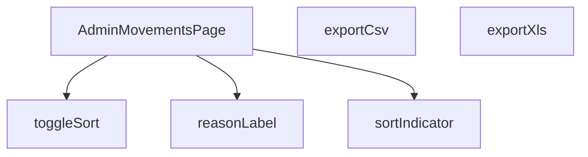

## Genel Bakış
Bu modül, VentHub HVAC yönetim platformunun yönetici panelindeki "Hareketler" sayfasını oluşturan React bileşenidir. Sistemdeki tüm hareket kayıtlarını listeler, düzenler ve yöneticiye farklı formatlarda dışa aktarma olanağı sağlar.

## Fonksiyon Grupları
### Ana Sayfa Bileşeni ve Yardımcı Fonksiyonlar
Modülün ana giriş noktası olan tüm sayfa bileşenini ve hareket nedenlerini yerelleştirilmiş etiketlere dönüştüren yardımcı fonksiyonu barındırır.
- AdminMovementsPage, reasonLabel

### Sıralama Yönetimi Fonksiyonları
Hareket listesinin sütunlara göre sıralanmasını kontrol eden ve arayüzde sıralama durumunu gösteren işlevleri yönetir.
- toggleSort, sortIndicator

### Veri Dışa Aktarma Fonksiyonları
Listelenen hareket verilerini CSV ve XLS gibi yaygın dosya formatlarına aktarma süreçlerini başlatan işlevleri içerir.
- exportCsv, exportXls

---

## AXIOMS – Mimari Varsayımlar

Bu modül için aşağıdaki mimari varsayımlar tanımlanmıştır:

---

**[Aksiyom 1 - Translation Fonksiyonu Bağımlılığı]:** Eğer `reasonLabel` fonksiyonuna geçirilen `t` parametresi geçerli bir çeviri fonksiyonu (i18n hook'undan türetilmiş) değilse, hareket nedenleri için yerelleştirilmiş etiketler gösterilemez ve hata oluşur.

---

**[Aksiyom 2 - SortKey Tanımlılığı]:** Eğer `SortKey` tipi (kullanıldığı `toggleSort` ve `sortIndicator` fonksiyonlarında) geçerli sıralanabilir sütun anahtarlarını içermiyorsa, sıralama işlemi tanımsız davranışa neden olur veya hiçbir etki göstermez.

---

**[Aksiyom 3 - ALL_REASONS Kapsamlılığı]:** Eğer `ALL_REASONS` sabiti (as_expression olarak tanımlı) sistemdeki tüm geçerli hareket nedenlerini içermiyorsa, `reasonLabel` fonksiyonu bazı geçerli neden anahtarları için tanımsız/boş etiket döndürür.

---

**[Aksiyom 4 - Dışa Aktarma Veri Kaynağı]:** Eğer `exportCsv()` ve `exportXls()` fonksiyonları çağrıldığında dışa aktarılacak hareket verisi (state veya prop olarak) mevcut değilse veya boşsa, boş/hatalı dosya oluşur veya fonksiyon hiçbir çıktı üretmez.

---

**[Aksiyom 5 - Tarayıcı Dosya İndirme Desteği]:** Eğer kullanıcı tarayıcısı Blob API'sini veya dosya indirme mekanizmasını desteklemiyorsa, `exportCsv()` ve `exportXls()` fonksiyonları dosya oluşturamaz ve dışa aktarma başarısız olur.

---

## FONKSİYON DETAYLARI

### reasonLabel
**Ne yapar**: Stok hareketi sebebini (reason) yerelleştirilmiş bir etikete dönüştürerek kullanıcıya okunabilir bir metin döndürür.
**Nasıl yapar**: Girdi olarak aldığı `key` parametresini string'e çevirir. Eğer bu string "undo" ile başlıyorsa, çevirisi yapılmış bir "geri al" etiketini döndürür. Diğer durumlarda, `switch` yapısı ile `sale`, `po_receipt`, `manual_in` vb. belirli anahtarları kontrol eder ve karşılık gelen çevrilmiş metni döndürür. Tanınmayan bir anahtar gelirse varsayılan olarak bir tire karakteri (`-`) döner.
**Parametreler**:
- key: string | null | undefined — Stok hareketinin sebebini belirten ve uygulama içinde tanımlı bir anahtar.
- t: (k: string) => string — Verilen anahtarı, kullanıcının diline göre çeviren bir çeviri fonksiyonu.
**Dönüş**: string — Hareket sebebini temsil eden, çevrilmiş ve kullanıcıya sunulacak metin.

### AdminMovementsPage
**Ne yapar**: Uygulamanın yönetim panelindeki stok hareketleri sayfasını render eden ana React bileşenidir.
**Nasıl yapar**: Bu bir fonksiyonel React bileşenidir. Sayfa yüklediğinde veya etkileşim olduğunda, gerekli verileri (stok hareketleri, ürünler) API'den çeker, filtreleme ve sıralama işlemleri uygular, CSV/XLS dışa aktarma fonksiyonlarını sunar ve arayüzü oluşturarak kullanıcıya sunar. Bileşen içinde durum yönetimi (state) ve yan etkiler (effects) kullanarak dinamik bir arayüz sağlar.
**Parametreler**: Yok
**Dönüş**: React.FC — Tam sayfa yapısını ve mantığını içeren React fonksiyonel bileşeni.

### toggleSort
**Ne yapar**: Listelediğimiz stok hareketlerinin sıralamasını değiştirir. Tıklanan sütuna göre sıralama yapar veya sıralama yönünü tersine çevirir.
**Nasıl yapar**: Fonksiyon, mevcut `sortKey` durumu ile gelen `key` parametreini karşılaştırır. Eğer aynı sütuna tekrar tıklanırsa, mevcut sıralama yönünü (`asc`/`desc`) tersine çevirir. Farklı bir sütuna tıklanırsa, sıralama o yeni sütuna (`key`) ayarlanır ve yönü, tarihsel sütun (`date`) için varsayılan olarak `desc`, diğerleri için `asc` olarak ayarlanır.
**Parametreler**:
- key: SortKey — Hangi sütuna göre sırlama yapılacağını belirten anahtar.
**Dönüş**: void — Fonksiyon doğrudan bir değer döndürmez, ancak React state'lerini (`setSortKey`, `setSortDir`) günceller.

### sortIndicator
**Ne yapar**: Hangi sütunun aktif olarak sıralandığını ve sıralama yönünü (artan/azalan) görsel olarak gösteren bir gösterge (▲/▼) döndürür.
**Nasıl yapar**: Fonksiyon, mevcut aktif sıralama sütunu olan `sortKey` durumunu kontrol eder. Eğer istenen sütun (`key`) ile mevcut sıralama sütunu aynı değilse, boş bir string döndürür. Aynı ise, sıralama yönüne (`sortDir`) bakarak artan yön için '▲' veya azalan yön için '▼' karakterini döndürür.
**Parametreler**:
- key: SortKey — Sıralama göstergesinin kontrol edilmek istendiği sütun anahtarı.
**Dönüş**: string — Sıralama yönünü simgeleyen Unicode karakteri veya aktif sıralama sütunu olmadığında boş bir string.

### exportCsv
**Ne yapar**: O an filtrelenmiş olan stok hareketlerini, CSV (Comma-Separated Values) formatında bir dosyaya dönüştürür ve kullanıcının bilgisayarına indirir.
**Nasıl yapar**: Fonksiyon, filtrelenmiş hareketler dizisini (`filtered`) dönüştürerek her satırı CSV formatına uygun hale getirir. Tarih ve metin alanlarını çevirerek, ürün adı ve SKU gibi bilgileri ürün haritasından (`productMap`) çekerek, virgüllerle ayırıp, çift tırnak işaretlerini escape ederek (`"`) satırları oluşturur. Oluşturulan CSV verisine BOM (Byte Order Mark) ekleyerek UTF-8 uyumluluğunu sağlar, bir `Blob` nesnesi oluşturur, geçici bir URL atar ve bu URL'den otomatik bir dosya indirme bağlantısı oluşturarak indirme işlemini tetikler.
**Parametreler**: Yok
**Dönüş**: void — Fonksiyon doğrudan bir değer döndürmez, tarayıcı aracılığıyla dosya indirme işlemini başlatır.

### exportXls
**Ne yapar**: Filtrelenmiş stok hareketlerini, eski sürüm Microsoft Excel ile uyumlu olan bir XLS (HTML tabanlı) formatında dışa aktarır ve bilgisayara indirir.
**Nasıl yapar**: Fonksiyon, her bir hareket verisini bir HTML `<tr>` (satır) elemanına dönüştürerek verileri tablo yapısına yerleştirir. Tam bir HTML dökümanı oluşturur ve bu dökümanın içinde, başlık satırları da dahil olmak üzere verilerin bulunduğu bir HTML tablosu (`<table>`) yer alır. Oluşturulan HTML dökümanını, `application/vnd.ms-excel` MIME türü ile bir `Blob`'a paketler, geçici bir URL oluşturur ve bu URL üzerinden otomatik bir dosya indirme bağlantısı tetikleyerek indirmeyi başlatır.
**Parametreler**: Yok
**Dönüş**: void — Fonksiyon doğrudan bir değer döndürmez, tarayıcı aracılığıyla bir XLS dosyası indirme işlemini başlatır.

---

## TYPE ALIASES

### Movement
```typescript
type Movement = {

  id: string

  product_id: string

  delta: number

  reason: string | null

  order_id?: string | null

  created_at: string

  batch_id?: string | null

}
```

### Product
```typescript
type Product = { id: string; name: string; sku?: string; category_id?: string | null }
```

### Category
```typescript
type Category = { id: string; name: string }
```

### SortKey
```typescript
type SortKey = 'date' | 'product' | 'delta' | 'reason' | 'ref'
```

---

## ENUMS

### LoadState
- `Idle`
- `Loading`
- `Error`

---

## SABİTLER
- **ALL_REASONS** (as_expression) — `['sale', 'po_receipt', 'manual_in', 'manual_out', 'adjust', 'return_in', 'tra...`

---

## AST POINTERS

### [N1_NASIL] AST Pointer: AdminMovementsPage.tsx::reasonLabel
- **params**: `key: string | null | undefined` — hareket sebebi anahtarı, `t: (k: string) => string` — i18n çeviri fonksiyonu
- **ic_degiskenler**:
  - `val` — key'in string'e dönüştürülmüş hali, boşsa boş string; başlangıç kontrolü ve switch'te kullanılır
- **Dönüş**: `string` — çevrilmiş sebebi döner; `undo` ile başlayan anahtarlar içinundo çevirisi, bilinen case'ler için karşılık gelen çeviri, bilinmeyenler için `'-'`

---

### [N2_NASIL] AST Pointer: AdminMovementsPage.tsx::fetchPage (async anonim fonksiyon)
- **params**: `pageNum: number` — istenen sayfa numarası
- **ic_degiskenler**:
  - `from` — sayfalama için Supabase sorgusunun başlangıç indeksi: `(pageNum - 1) * PAGE_SIZE`
  - `to` — sayfalama için bitiş indeksi: `from + PAGE_SIZE - 1`
  - `query` — Supabase `inventory_movements` tablosu üzerine inşa edilen sorgu nesnesi; filtreleme (batchFilter, dateRange) buraya zincirlenir
  - `data` — Supabase'den dönen hareket satırları dizisi
  - `error` — Supabase sorgu hatası (varsa)
  - `count` — Supabase'den dönen toplam satır sayısı (`count: 'exact'`)
  - `movements` — `data`'nın `Movement[]` tipine cast edilmiş hali, `setRows` ile state'e yazılır
  - `ids` — hareketlerde geçen benzersiz `product_id` kümesi; ürünler ve kategorileri çekmek için kullanılır
  - `prodRes` — `products` tablosundan `id,name,sku,category_id` çeken Supabase sonucu; `Promise.all` ile eş zamanlı çekilir
  - `catRes` — `categories` tablosundan `id,name` çeken Supabase sonucu; `Promise.all` ile eş zamanlı çekilir
  - `map` — `Record<string, Product>` — ürün ID'den Product nesnesine eşleme; `productMap` state'ine yazılır
  - `cmap` — `Record<string, string | null>` — ürün ID'den category_id'ye eşleme; `productCategoryMap` state'ine yazılır
- **Dönüş**: yok (state setter'ları ile yan etki: `setLoading`, `setRows`, `setProductMap`, `setProductCategoryMap`, `setCategories`, `setHasMore`, `setError`)

---

### [N3_NASIL] AST Pointer: AdminMovementsPage.tsx::initBatchFilter (anonim fonksiyon)
- **params**: yok
- **ic_degiskenler**:
  - `b` — URL search params'daki `batch` parametresinin trim edilmiş değeri; boşsa boş string
- **Dönüş**: yok (yan etki: `setBatchFilter(b)` ile batch filtresini günceller)

---

### [N4_NASIL] AST Pointer: AdminMovementsPage.tsx::usedCategories (anonim fonksiyon)
- **params**: yok
- **ic_degiskenler**:
  - `idSet` — mevcut satırlarda geçen benzersiz kategori ID'lerini toplayan `Set<string>`; `productCategoryMap` üzerinden `product_id` → `category_id` eşlemesiyle doldurulur
- **Dönüş**: `Category[]` — sadece mevcut satırlarda kullanılan kategorileri içeren `categories` filtrelenmiş dizisi

---

### [N5_NASIL] AST Pointer: AdminMovementsPage.tsx::collectCategoryIds (anonim forEach callback)
- **params**: `m: Movement` — tek bir hareket satırı
- **ic_degiskenler**: yok
- **Dönüş**: yok (yan etki: `idSet`'e `productCategoryMap[m.product_id]` değerini ekler)

---

### [N6_NASIL] AST Pointer: AdminMovementsPage.tsx::filtered (anonim filtreleme fonksiyonu)
- **params**: yok
- **ic_degiskenler**:
  - `base` — filtrelemenin başlangıç dizisi; `rows`'un bir kopyası, ardışık filtreleme zincirinin girişidir
  - `term` — `q` state'inin trim ve küçük harfe dönüştürülmüş hali; ürün adı/SKU eşleştirmesi için kullanılır
- **Dönüş**: `Movement[]` — arama terimi, kategori ve sebep filtrelerinden geçmiş hareket dizisi

---

### [N7_NASIL] AST Pointer: AdminMovementsPage.tsx::productFilterPredicate (anonim filtre callback)
- **params**: `r: Movement` — filtrelenecek hareket satırı
- **ic_degiskenler**:
  - `p` — `productMap[r.product_id]` ile elde edilen ürün nesnesi; adı ve SKU'su kontrol edilir
  - `name` — ürün adının küçük harfe dönüştürülmüş hali
  - `sku` — ürün SKU'sunun küçük harfe dönüştürülmüş hali
- **Dönüş**: `boolean` — ürün adı veya SKU'su arama terimini içeriyorsa `true`

---

### [N8_NASIL] AST Pointer: AdminMovementsPage.tsx::sorted (anonim sıralama fonksiyonu)
- **params**: yok
- **ic_degiskenler**:
  - `arr` — `filtered` dizisinin shallow copy'si; sıralama bu kopya üzerinde yapılır, orijinali değiştirilmez
- **Dönüş**: `Movement[]` — `sortKey` ve `sortDir`'e göre sıralanmış hareket dizisi

---

### [N9_NASIL] AST Pointer: AdminMovementsPage.tsx::sortComparator (anonim sıralama karşılaştırıcı)
- **params**: `a: Movement` — karşılaştırmanın sol tarafı, `b: Movement` — karşılaştırmanın sağ tarafı
- **ic_degiskenler**:
  - `dir` — sıralama yönü çarpanı; `asc` ise `1`, `desc` ise `-1`
  - `an` — `a`'nın ürün adının küçük harfe dönüştürülmüş hali (sadece `product` case'inde)
  - `bn` — `b`'nın ürün adının küçük harfe dönüştürülmüş hali (sadece `product` case'inde)
  - `ar` — `a.order_id` veya boş string (sadece `ref` case'inde)
  - `br` - `b.order_id` veya boş string (sadece `ref` case'inde)
- **Dönüş**: `number` — sıralama karşılaştırma sonucu (negatif, sıfır veya pozitif)

---

### [N10_NASIL] AST Pointer: AdminMovementsPage.tsx::toggleSort
- **params**: `key: SortKey` — tıklanan sütun sıralama anahtarı
- **ic_degiskenler**: yok
- **Dönüş**: yok (yan etki: aynı tuşa tekrar tıklanırsa `setSortDir` ile yön tersine çevrilir; farklı tuşa tıklanırsa `setSortKey` ve `setSortDir` ile yeni sıralama ayarlanır)

---

### [N11_NASIL] AST Pointer: AdminMovementsPage.tsx::sortIndicator
- **params**: `key: SortKey` — göstergesi istenen sütunun sıralama anahtarı
- **ic_degiskenler**: yok
- **Dönüş**: `string` — aktif sıralama sütunuysa `'▲'` (asc) veya `'▼'` (desc), değilse boş string `''`

---

### [N12_NASIL] AST Pointer: AdminMovementsPage.tsx::exportCsv
- **params**: yok
- **ic_degiskenler**:
  - `h` — CSV başlık satırı dizisi; `t()` ile çevrilmiş sütun adlarını içerir (date, product, SKU, delta, reason, ref)
  - `lines` — her hareket satırının CSV formatına dönüştürülmüş hali; `filtered.map()` ile üretilir, her alan `"` ile sarılır ve `""` ile escape edilir
  - `bom` — UTF-8 BOM karakteri (`\ufeff`); Excel'in doğru karakter setini tanıması için eklenir
  - `csvData` — başlık satırı ve veri satırlarının `\n` ile birleştirilmiş hali
  - `blob` — CSV verisinden oluşturulan `Blob` nesnesi; MIME tipi `text/csv;charset=utf-8`
  - `url` — blob'un nesne URL'i; link href'i olarak kullanılır
  - `link` — DOM'da oluşturulan geçici `<a>` elementi; otomatik indirme tetiklenmesi için kullanılır
- **Dönüş**: yok (yan etki: CSV dosyası tarayıcıda indirilir, `URL.revokeObjectURL` ile URL serbest bırakılır)

---

### [N13_NASIL] AST Pointer: AdminMovementsPage.tsx::csvRowMapper (anonim map callback)
- **params**: `m: Movement` — CSV'ye dönüştürülecek hareket satırı
- **ic_degiskenler**:
  - `p` — `productMap[m.product_id]` ile elde edilen ürün nesnesi; adı ve SKU'su alınır
- **Dönüş**: `string` — virgülle ayrılmış, tırnak işaretleri ile sarılmış CSV satırı

---

### [N14_NASIL] AST Pointer: AdminMovementsPage.tsx::exportXls
- **params**: yok
- **ic_degiskenler**:
  - `rowsHtml` — her hareket satırının `<tr><td>...</td></tr>` formatında HTML'ine dönüştürülmüş hali; `filtered.map()` ile üretilir
  - `tHtml` — tam HTML dokümanı; `<table>` yapısını, başlık satırını (`<thead>`) ve veri satırlarını (`<tbody>`) içerir
  - `blob` — HTML verisinden oluşturulan `Blob` nesnesi; MIME tipi `application/vnd.ms-excel`
  - `url` — blob'un nesne URL'i; link href'i olarak kullanılır
  - `link` — DOM'da oluşturulan geçici `<a>` elementi; otomatik indirme tetiklenmesi için kullanılır
- **Dönüş**: yok (yan etki: XLS dosyası tarayıcıda indirilir, `URL.revokeObjectURL` ile URL serbest bırakılır)

---

### [N15_NASIL] AST Pointer: AdminMovementsPage.tsx::xlsRowMapper (anonim map callback)
- **params**: `m: Movement` — XLS'ye dönüştürülecek hareket satırı
- **ic_degiskenler**:
  - `p` — `productMap[m.product_id]` ile elde edilen ürün nesnesi
  - `d` — `formatDateTime(m.created_at, lang)` ile formatlanmış tarih stringi
  - `pr` — ürün adı; `p?.name` varsa o, yoksa `m.product_id`
  - `s` — ürün SKU'su; `p?.sku` varsa o, yoksa boş string
  - `dl` — hareket miktarı: `m.delta`
  - `r` — `reasonLabel(m.reason, t)` ile çevrilmiş sebep metni
  - `o` — sipariş referansının son 8 karakteri büyük harfe dönüştürülmüş hali; `order_id` yoksa boş string
- **Dönüş**: `string` — `<tr>` ile sarılmış HTML satırı

---

### [N16_NASIL] AST Pointer: AdminMovementsPage.tsx::loadPrefs (anonim fonksiyon)
- **params**: yok
- **ic_degiskenler**:
  - `rawCols` — `localStorage`'den okunan sütun görünürlük ayarları JSON stringi; `${STORAGE_KEY}:cols` anahtarından okunur
  - `rawDen` — `localStorage`'den okunan yoğunluk ayarı stringi; `${STORAGE_KEY}:density` anahtarından okunur
- **Dönüş**: yok (yan etki: `setVisibleCols` ve `setDensity` state'lerini localStorage'dan gelen değerlerle günceller; parse hatası olursa sessizce yutulur)

---

### [N17_NASIL] AST Pointer: AdminMovementsPage.tsx::reasonColumnMapper (anonim map callback)
- **params**: `r: string` — ALL_REASONS dizisindeki tek bir sebep anahtarı
- **ic_degiskenler**: yok
- **Dönüş**: ColumnsMenu için kolon tanım nesnesi — `{ key, label, active, onToggle }`; `label` `reasonLabel(r, t)` ile çevrilir, `active` `reasonFilter[r]`'in boolean karşılığı, `onToggle` sebep filtresini tersine çevirir

---

### [N18_NASIL] AST Pointer: AdminMovementsPage.tsx::resetFilters (anonim fonksiyon)
- **params**: yok
- **ic_degiskenler**: yok
- **Dönüş**: yok (yan etki: `setPage(1)`, `setQ('')`, `setSelectedCategory('')`, `setDateRange(undefined)`, `setReasonFilter(...)` ile tüm filtreleri başlangıç değerlerine sıfırlar; `ALL_REASONS` dizisi üzerinde `Object.fromEntries` ile tüm sebepleri `true` olarak ayarlar)

---

### [N19_NASIL] AST Pointer: AdminMovementsPage.tsx::renderRow (anonim map callback)
- **params**: `m: Movement` — tabloda satır olarak render edilecek hareket
- **ic_degiskenler**: yok (tüm değerler doğrudan `m` ve state'lerden okunur)
- **Dönüş**: `JSX.Element` — `<tr>` elementi; `visibleCols` objesinin her alanı için ilgili `<td>` koşullu olarak render edilir; `productMap`, `reasonLabel`, `formatDateTime`, `ArrowUpRight`, `ArrowDownRight` kullanılır

---


## MERMAID CALL GRAPH


## NODE ID STANDARD

  file: src\views\admin\AdminMovementsPage.tsx
  function: src\views\admin\AdminMovementsPage.tsx::reasonLabel
  function: src\views\admin\AdminMovementsPage.tsx::AdminMovementsPage
  function: src\views\admin\AdminMovementsPage.tsx::toggleSort
  function: src\views\admin\AdminMovementsPage.tsx::sortIndicator
  function: src\views\admin\AdminMovementsPage.tsx::exportCsv
  function: src\views\admin\AdminMovementsPage.tsx::exportXls

---

## DISA AKTARILANLAR (EXPORTS)
  export: AdminMovementsPage
  export: reasonLabel

---

## STİL TOKENLERİ

### Arbitrary Değerler (token'a geçirilmemiş)
Yok — tüm stiller token'a geçirilmiş. ✅

### Kullanılan Token'lar (zaten token'a geçirilmiş)
- `tracking-hvac-normal`, `tracking-hvac-tight`

### Tailwind Sınıf Özeti
- **Renkler:** `bg-amber-500`, `bg-cyan-500/50`, `bg-emerald-500/10`, `bg-rose-500/10`, `bg-white/2`, `bg-white/5`, `border-amber-500/20`, `border-b`, `border-emerald-500/20`, `border-rose-500/20`, `border-t`, `border-white/5`, `hover:bg-white/2`, `hover:text-cyan-400`, `text-amber-400`
- **Layout:** `!h-8`, `flex`, `flex-col`, `gap-0.5`, `gap-1`, `gap-2`, `h-1`, `h-1.5`, `inline-flex`, `items-center`, `justify-between`, `min-w-700px`, `overflow-hidden`, `overflow-x-auto`, `p-0`
- **Varyant/Responsive:** `:`, `hover:` önekleri
- **Yardımcı Sınıflar:** `!px-4`, `${adminCardClass`, `${adminTableActionWarningClass`, `${adminTableCellClass`, `${adminTableHeadCellClass`, `${cellPad`, `${headPad`, `${m.delta`, `0`, `:`, `<`, `>`, `animate-pulse`, `border`, `font-black`