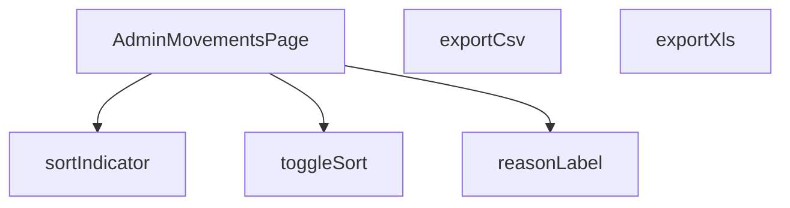

## Genel Bakış
Bu modül, VentHub HVAC yönetim platformunun yönetici panelindeki "Hareketler" sayfasını oluşturan React bileşenidir. Modül, tüm hareket kayıtlarını tablo formatında sunarak sıralama ve farklı formatlarda dışa aktarma işlemleri sağlar. Hareket nedenleri gibi alanlar için çok dilli etiket desteği sunulmaktadır.

## Fonksiyon Grupları
### Ana Sayfa Bileşeni
Modülün ana giriş noktası olup tüm sayfa düzenini, veri akışını ve üst düzey işlevselliği koordine eder.
- AdminMovementsPage

### Veri Görüntüleme ve Yerelleştirme
Ham veriyi kullanıcıya gösterilebilir forma dönüştürmek ve çok dilli destek sağlamakla sorumludur.
- reasonLabel

### Tablo Sıralama İşlevleri
Tablonun hangi sütuna göre sıralanacağını değiştirir ve mevcut sıralama durumunu kullanıcıya görsel olarak iletir.
- toggleSort, sortIndicator

### Veri Dışa Aktarma İşlevleri
Tablodaki mevcut veri setini CSV ve Excel gibi yaygın formatlara dönüştürerek dışa aktarma işlemini başlatır.
- exportCsv, exportXls

---

## AXIOMS – Mimari Varsayımlar

Bu modül, hareket kayıtlarını listeleyen ve yöneten bir yönetici sayfası bileşenidir. Aşağıdaki mimari varsayımlar, fonksiyon imzaları ve mevcut sabitler temel alınarak tanımlanmıştır.

[Aksiyom 1]: Eğer `reasonLabel(key, t)` fonksiyonu çağrıldığında `key` parametresi `null` veya `undefined` ise, fonksiyonun ne döndüreceği tanımsızdır (örn: boş string, `null` veya bir hata fırlatması beklenir, ancak kesin davranış bilinmemektedir).

[Aksiyom 2]: Eğer `reasonLabel(key, t)` fonksiyonuna geçerli (null olmayan) bir `key` verilirse, bu anahtarın modül içinde tanımlı bir kaynakta (örn: `ALL_REASONS` sabitinde veya API yanıtında) karşılığı olmalıdır. Karşılık yoksa, fonksiyonun ne döndüreceği bilinmemektedir.

[Aksiyom 3]: Eğer `toggleSort(key)` fonksiyonu, geçerli bir `SortKey` değeri içermeyen bir argüman ile çağrılırsa, sıralama durumu bozulabilir veya fonksiyon hata fırlatabilir.

[Aksiyom 4]: Eğer `exportCsv()` veya `exportXls()` fonksiyonları çağrıldığında, o anda görüntülenen veri seti (örn: filtrelenmiş, sıralanmış) dışa aktarılacaksa, modülün bu mevcut durumu izlemesi gerekir; aksi takdirde dışa aktarılan veri kullanıcının gördüğü veriyle tutarsız olur.

[Aksiyom 5]: Eğer `sortIndicator(key)` fonksiyonu, geçerli bir `SortKey` değeri içermeyen bir argüman ile çağrılırsa, fonksiyonun ne döndüreceği (örn: boş string, belirli bir ikon) bilinmemektedir.

[Aksiyom 6]: `ALL_REASONS` sabiti, `reasonLabel` fonksiyonu tarafından kullanılacak bir eşleme (mapping) yapısı içermelidir. Eğer bu sabit tanımsız veya boş ise, `reasonLabel` fonksiyonu geçerli etiketler üretemez.

---

## FONKSİYON DETAYLARI

### reasonLabel
**Ne yapar**: Stok hareketi sebebini (reason) yerelleştirilmiş bir etikete dönüştürerek kullanıcıya okunabilir bir metin döndürür.
**Nasıl yapar**: Girdi olarak aldığı `key` parametresini string'e çevirir. Eğer bu string "undo" ile başlıyorsa, çevirisi yapılmış bir "geri al" etiketini döndürür. Diğer durumlarda, `switch` yapısı ile `sale`, `po_receipt`, `manual_in` vb. belirli anahtarları kontrol eder ve karşılık gelen çevrilmiş metni döndürür. Tanınmayan bir anahtar gelirse varsayılan olarak bir tire karakteri (`-`) döner.
**Parametreler**:
- key: string | null | undefined — Stok hareketinin sebebini belirten ve uygulama içinde tanımlı bir anahtar.
- t: (k: string) => string — Verilen anahtarı, kullanıcının diline göre çeviren bir çeviri fonksiyonu.
**Dönüş**: string — Hareket sebebini temsil eden, çevrilmiş ve kullanıcıya sunulacak metin.

### AdminMovementsPage
**Ne yapar**: Uygulamanın yönetim panelindeki stok hareketleri sayfasını render eden ana React bileşenidir.
**Nasıl yapar**: Bu bir fonksiyonel React bileşenidir. Sayfa yüklediğinde veya etkileşim olduğunda, gerekli verileri (stok hareketleri, ürünler) API'den çeker, filtreleme ve sıralama işlemleri uygular, CSV/XLS dışa aktarma fonksiyonlarını sunar ve arayüzü oluşturarak kullanıcıya sunar. Bileşen içinde durum yönetimi (state) ve yan etkiler (effects) kullanarak dinamik bir arayüz sağlar.
**Parametreler**: Yok
**Dönüş**: React.FC — Tam sayfa yapısını ve mantığını içeren React fonksiyonel bileşeni.

### toggleSort
**Ne yapar**: Listelediğimiz stok hareketlerinin sıralamasını değiştirir. Tıklanan sütuna göre sıralama yapar veya sıralama yönünü tersine çevirir.
**Nasıl yapar**: Fonksiyon, mevcut `sortKey` durumu ile gelen `key` parametreini karşılaştırır. Eğer aynı sütuna tekrar tıklanırsa, mevcut sıralama yönünü (`asc`/`desc`) tersine çevirir. Farklı bir sütuna tıklanırsa, sıralama o yeni sütuna (`key`) ayarlanır ve yönü, tarihsel sütun (`date`) için varsayılan olarak `desc`, diğerleri için `asc` olarak ayarlanır.
**Parametreler**:
- key: SortKey — Hangi sütuna göre sırlama yapılacağını belirten anahtar.
**Dönüş**: void — Fonksiyon doğrudan bir değer döndürmez, ancak React state'lerini (`setSortKey`, `setSortDir`) günceller.

### sortIndicator
**Ne yapar**: Hangi sütunun aktif olarak sıralandığını ve sıralama yönünü (artan/azalan) görsel olarak gösteren bir gösterge (▲/▼) döndürür.
**Nasıl yapar**: Fonksiyon, mevcut aktif sıralama sütunu olan `sortKey` durumunu kontrol eder. Eğer istenen sütun (`key`) ile mevcut sıralama sütunu aynı değilse, boş bir string döndürür. Aynı ise, sıralama yönüne (`sortDir`) bakarak artan yön için '▲' veya azalan yön için '▼' karakterini döndürür.
**Parametreler**:
- key: SortKey — Sıralama göstergesinin kontrol edilmek istendiği sütun anahtarı.
**Dönüş**: string — Sıralama yönünü simgeleyen Unicode karakteri veya aktif sıralama sütunu olmadığında boş bir string.

### exportCsv
**Ne yapar**: O an filtrelenmiş olan stok hareketlerini, CSV (Comma-Separated Values) formatında bir dosyaya dönüştürür ve kullanıcının bilgisayarına indirir.
**Nasıl yapar**: Fonksiyon, filtrelenmiş hareketler dizisini (`filtered`) dönüştürerek her satırı CSV formatına uygun hale getirir. Tarih ve metin alanlarını çevirerek, ürün adı ve SKU gibi bilgileri ürün haritasından (`productMap`) çekerek, virgüllerle ayırıp, çift tırnak işaretlerini escape ederek (`"`) satırları oluşturur. Oluşturulan CSV verisine BOM (Byte Order Mark) ekleyerek UTF-8 uyumluluğunu sağlar, bir `Blob` nesnesi oluşturur, geçici bir URL atar ve bu URL'den otomatik bir dosya indirme bağlantısı oluşturarak indirme işlemini tetikler.
**Parametreler**: Yok
**Dönüş**: void — Fonksiyon doğrudan bir değer döndürmez, tarayıcı aracılığıyla dosya indirme işlemini başlatır.

### exportXls
**Ne yapar**: Filtrelenmiş stok hareketlerini, eski sürüm Microsoft Excel ile uyumlu olan bir XLS (HTML tabanlı) formatında dışa aktarır ve bilgisayara indirir.
**Nasıl yapar**: Fonksiyon, her bir hareket verisini bir HTML `<tr>` (satır) elemanına dönüştürerek verileri tablo yapısına yerleştirir. Tam bir HTML dökümanı oluşturur ve bu dökümanın içinde, başlık satırları da dahil olmak üzere verilerin bulunduğu bir HTML tablosu (`<table>`) yer alır. Oluşturulan HTML dökümanını, `application/vnd.ms-excel` MIME türü ile bir `Blob`'a paketler, geçici bir URL oluşturur ve bu URL üzerinden otomatik bir dosya indirme bağlantısı tetikleyerek indirmeyi başlatır.
**Parametreler**: Yok
**Dönüş**: void — Fonksiyon doğrudan bir değer döndürmez, tarayıcı aracılığıyla bir XLS dosyası indirme işlemini başlatır.

---

## TYPE ALIASES

### Movement
```typescript
type Movement = {

  id: string

  product_id: string

  delta: number

  reason: string | null

  order_id?: string | null

  created_at: string

  batch_id?: string | null

}
```

### Product
```typescript
type Product = { id: string; name: string; sku?: string; category_id?: string | null }
```

### Category
```typescript
type Category = { id: string; name: string }
```

### SortKey
```typescript
type SortKey = 'date' | 'product' | 'delta' | 'reason' | 'ref'
```

---

## ENUMS

### LoadState
- `Idle`
- `Loading`
- `Error`

---

## SABİTLER
- **ALL_REASONS** (as_expression) — `['sale', 'po_receipt', 'manual_in', 'manual_out', 'adjust', 'return_in', 'tra...`

---

## AST POINTERS

### [N1_NASIL] AST Pointer: src/views/admin/AdminMovementsPage.tsx::reasonLabel
- **params**: `key: string | null | undefined` — sebep anahtarı, `t: (k: string) => string` — çeviri fonksiyonu
- **ic_degiskenler**:
  - `val` — key'in null/undefined olma durumuna karşı güvenli string'e dönüştürülmüş hali; switch karşılaştırmasında kullanılır
- **Dönüş**: `string` — verilen key'e karşılık gelen çevrilmiş sebep etiketi veya '-'

### [N2_NASIL] AST Pointer: src/views/admin/AdminMovementsPage.tsx::fetchPage (async pageNum)
- **params**: `pageNum: number` — istenen sayfa numarası (1-tabanlı)
- **ic_degiskenler**:
  - `from` — Supabase range sorgusu için başlangıç indeksi; `(pageNum - 1) * PAGE_SIZE` hesaplanır
  - `to` — Supabase range sorgusu için bitiş indeksi; `from + PAGE_SIZE - 1` hesaplanır
  - `query` — Supabase sorgu zinciri; `inventory_movements` tablosuna filtereler eklenerek inşa edilir
  - `data` — Supabase'den dönen ham satır verisi (Movement[])
  - `error` — Supabase sorgusundan dönen hata nesnesi
  - `count` — toplam satır sayısı (sayfalama hesaplama için)
  - `movements` — data'nın Movement[] tipine cast edilmiş hali; satırlara ve map'lere beslenir
  - `ids` — movements içindeki benzersiz product_id kümesi; ürün ve kategori verisi çekmek için kullanılır
  - `prodRes` — products tablosundan gelen yanıt; ürün adı, SKU, category_id bilgilerini içerir
  - `catRes` — categories tablosundan gelen yanıt; kategori adlarını içerir
  - `map` — product_id -> Product eşlemesi; ürün bilgilerine hızlı erişim sağlar
  - `cmap` -> `productCategoryMap` — product_id -> category_id eşlemesi; kategori bazlı filtreleme ve gösterim için kullanılır
- **Dönüş**: yok (state setter'ları çağırarak yan etki üretir: setRows, setProductMap, setProductCategoryMap, setCategories, setHasMore, setError, setLoading)

### [N3_NASIL] AST Pointer: src/views/admin/AdminMovementsPage.tsx::initBatchFilter
- **params**: yok
- **ic_degiskenler**:
  - `b` — searchParams'tan okunan 'batch' parametresinin trim edilmiş hali; batchFilter state'ine atanır
- **Dönüş**: yok (setBatchFilter ile state günceller)

### [N4_NASIL] AST Pointer: src/views/admin/AdminMovementsPage.tsx::getUsedCategories
- **params**: yok
- **ic_degiskenler**:
  - `idSet` — mevcut rows içinde kullanılan benzersiz category ID kümesi; hangi kategorilerin filtrelenebilir olduğunu belirler
- **Dönüş**: `Category[]` — sadece mevcut satırlarda referansı olan kategorilerin filtrelenmiş listesi

### [N5_NASIL] AST Pointer: src/views/admin/AdminMovementsPage.tsx::collectCategoryIds (m => ...)
- **params**: `m: Movement` — tek bir hareket kaydı
- **ic_degiskenler**:
  - `cid` — productCategoryMap içinde m.product_id'den elde edilen category_id; set'e eklenir
- **Dönüş**: yok (dışarıdaki idSet'e yan etki)

### [N6_NASIL] AST Pointer: src/views/admin/AdminMovementsPage.tsx::getFilteredRows
- **params**: yok
- **ic_degiskenler**:
  - `base` — filtreleme öncesi başlangıç olarak rows'un kopyası; ardışık filter'larla daraltılır
  - `term` — arama kutusundaki q değerinin trim ve lowercase hali; ürün adı/SKU eşleştirmesinde kullanılır
- **Dönüş**: `Movement[]` — tüm filtrelerden (arama, kategori, sebep) geçmiş satır dizisi

### [N7_NASIL] AST Pointer: src/views/admin/AdminMovementsPage.tsx::searchFilter (r => ...)
- **params**: `r: Movement` — filtrelenecek tek satır
- **ic_degiskenler**:
  - `p` — productMap'ten r.product_id ile elde edilen Product nesnesi
  - `name` — ürün adının lowercase hali; term ile karşılaştırılır
  - `sku` — ürün SKU'sunun lowercase hali; term ile karşılaştırılır
- **Dönüş**: `boolean` — satırın arama terimiyle eşleşip eşleşmediği

### [N8_NASIL] AST Pointer: src/views/admin/AdminMovementsPage.tsx::getSortedRows
- **params**: yok
- **ic_degiskenler**:
  - `arr` — filtered dizisinin sıralanabilir kopyası; sıralama işlemine tabi tutulur
- **Dönüş**: `Movement[]` — sortKey ve sortDir'e göre sıralanmış satır dizisi

### [N9_NASIL] AST Pointer: src/views/admin/AdminMovementsPage.tsx::sortComparator (a, b)
- **params**: `a: Movement` — karşılaştırılacak birinci satır, `b: Movement` — karşılaştırılacak ikinci satır
- **ic_degiskenler**:
  - `dir` — sıralama yönü çarpanı; asc ise 1, desc ise -1
  - `an` — (product sort dalında) birinci satırın ürün adının lowercase'i
  - `bn` — (product sort dalında) ikinci satırın ürün adının lowercase'i
  - `ar` — (ref sort dalında) birinci satırın order_id'si veya boş string
  - `br` — (ref sort dalında) ikinci satırın order_id'si veya boş string
- **Dönüş**: `number` — sıralama karşılaştırma sonucu (negatif, sıfır veya pozitif)

### [N10_NASIL] AST Pointer: src/views/admin/AdminMovementsPage.tsx::toggleSort
- **params**: `key: SortKey` — sıralanacak sütunun anahtarı
- **ic_degiskenler**: (yok — doğrudan state setter çağrıları)
- **Dönüş**: yok (setSortDir veya setSortKey ile state günceller)

### [N11_NASIL] AST Pointer: src/views/admin/AdminMovementsPage.tsx::sortIndicator
- **params**: `key: SortKey` — göstergesi sorulan sütun anahtarı
- **ic_degiskenler**: (yok)
- **Dönüş**: `string` — sıralama yönüne göre '▲', '▼' veya boş string

### [N12_NASIL] AST Pointer: src/views/admin/AdminMovementsPage.tsx::exportCsv
- **params**: yok
- **ic_degiskenler**:
  - `h` — CSV sütun başlıkları dizisi; çeviri fonksiyonu t() ile hazırlanır
  - `lines` — filtered satırlarının CSV satırına dönüştürülmüş hali; her satır virgülle ayrılıp tırnak içine alınır
  - `bom` — UTF-8 BOM karakteri; Excel'in doğru kodlamayı tanıması için eklenir
  - `csvData` — başlık ve satırların birleştirilmiş ham CSV metni
  - `blob` — CSV verisinden oluşturulmuş Blob nesnesi; indirme bağlantısı için kullanılır
  - `url` — blob için oluşturulan geçici Object URL'i
  - `link` — programatik olarak oluşturulmuş `<a>` elementi; dosya indirme tetikleyicisi
- **Dönüş**: yok (tarayıcıda dosya indirme tetikler)

### [N13_NASIL] AST Pointer: src/views/admin/AdminMovementsPage.tsx::csvRowMapper (m => ...)
- **params**: `m: Movement` — CSV satırına dönüştürülecek hareket kaydı
- **ic_degiskenler**:
  - `p` — productMap'ten m.product_id ile elde edilen Product nesnesi
- **Dönüş**: `string` — virgülle ayrılmış, tırnak içine alınmış CSV satır stringi

### [N14_NASIL] AST Pointer: src/views/admin/AdminMovementsPage.tsx::exportXls
- **params**: yok
- **ic_degiskenler**:
  - `rowsHtml` — filtered satırlarının HTML `<tr>` elementlerine dönüştürülmüş birleşik stringi
  - `tHtml` — tam HTML belgesi; tablo başlıkları ve satırları içerir, .xls olarak indirilir
  - `blob` — HTML verisinden oluşturulmuş Blob nesnesi; MIME type `application/vnd.ms-excel`
  - `url` — blob için oluşturulan geçici Object URL'i
  - `link` — programatik olarak oluşturulmuş `<a>` elementi; dosya indirme tetikleyicisi
- **Dönüş**: yok (tarayıcıda dosya indirme tetikler)

### [N15_NASIL] AST Pointer: src/views/admin/AdminMovementsPage.tsx::xlsRowMapper (m => ...)
- **params**: `m: Movement` — HTML tablo satırına dönüştürülecek hareket kaydı
- **ic_degiskenler**:
  - `p` — productMap'ten m.product_id ile elde edilen Product nesnesi
  - `d` — formatDateTime ile biçimlendirilmiş tarih stringi
  - `pr` — ürün adı veya fallback olarak product_id
  - `s` — ürün SKU'su veya boş string
  - `dl` — hareket miktarı (delta)
  - `r` — reasonLabel ile çevrilmiş sebep etiketi
  - `o` — order_id'nin son 8 karakteri, büyük harfe çevrilmiş; veya boş string
- **Dönüş**: `string` — bir HTML `<tr>` elementi stringi

### [N16_NASIL] AST Pointer: src/views/admin/AdminMovementsPage.tsx::loadSavedPreferences
- **params**: yok
- **ic_degiskenler**:
  - `rawCols` — localStorage'dan okunan sütun görünürlük ayarları JSON stringi
  - `rawDen` — localStorage'dan okunan yoğunluk (density) ayarı stringi
- **Dönüş**: yok (setVisibleCols ve setDensity ile state günceller)

### [N17_NASIL] AST Pointer: src/views/admin/AdminMovementsPage.tsx::mapReasonToMenuItem (r => ...)
- **params**: `r: string` — ALL_REASONS dizisindeki tek bir sebep anahtarı
- **ic_degiskenler**: (yok — inline obje üretimi)
- **Dönüş**: `{ key: string, label: string, active: boolean, onToggle: () => void }` — ColumnsMenu/_COLUMNS_MENU için sebep filtre menü öğesi

### [N18_NASIL] AST Pointer: src/views/admin/AdminMovementsPage.tsx::resetFilters
- **params**: yok
- **ic_degiskenler**: (yok — doğrudan state setter çağrıları)
- **Dönüş**: yok (setPage, setQ, setSelectedCategory, setDateRange, setReasonFilter ile tüm filtre state'lerini sıfırlar)

### [N19_NASIL] AST Pointer: src/views/admin/AdminMovementsPage.tsx::renderMovementRow (m => ...)
- **params**: `m: Movement` — tabloda satır olarak gösterilecek hareket kaydı
- **ic_degiskenler**: (yok — doğrudan JSX içinde m, productMap, visibleCols, formatDateTime, reasonLabel kullanılır)
- **Dönüş**: `JSX.Element` — hareket kaydını temsil eden `<tr>` elementi; visibleCols ayarlarına göre koşulsuz sütun gösterir

### [N20_NASIL] AST Pointer: src/views/admin/AdminMovementsPage.tsx::AdminMovementsPage
- **params**: yok (parametre yok, React FC bileşeni)
- **ic_degiskenler**: (fonksiyon gövdesi bileşen içindeki hook'lardan ve alt bileşenlerden oluşur; tüm state ve fonksiyon tanımları bu kapsama girer)
- **Dönüş**: `React.FC` — admin stok hareketleri sayfasını render eden React bileşeni

---


## MERMAID CALL GRAPH


## NODE ID STANDARD

  file: src\views\admin\AdminMovementsPage.tsx
  function: src\views\admin\AdminMovementsPage.tsx::reasonLabel
  function: src\views\admin\AdminMovementsPage.tsx::AdminMovementsPage
  function: src\views\admin\AdminMovementsPage.tsx::toggleSort
  function: src\views\admin\AdminMovementsPage.tsx::sortIndicator
  function: src\views\admin\AdminMovementsPage.tsx::exportCsv
  function: src\views\admin\AdminMovementsPage.tsx::exportXls

---

## DISA AKTARILANLAR (EXPORTS)
  export: AdminMovementsPage
  export: reasonLabel

---

## STİL TOKENLERİ

### Arbitrary Değerler (token'a geçirilmemiş)
Yok — tüm stiller token'a geçirilmiş. ✅

### Kullanılan Token'lar (zaten token'a geçirilmiş)
- `tracking-hvac-normal`, `tracking-hvac-tight`

### Tailwind Sınıf Özeti
- **Renkler:** `bg-amber-500`, `bg-cyan-500/50`, `bg-emerald-500/10`, `bg-rose-500/10`, `bg-white/2`, `bg-white/5`, `border-amber-500/20`, `border-b`, `border-emerald-500/20`, `border-rose-500/20`, `border-t`, `border-white/5`, `hover:bg-white/2`, `hover:text-cyan-400`, `text-amber-400`
- **Layout:** `!h-8`, `flex`, `flex-col`, `gap-0.5`, `gap-1`, `gap-2`, `h-1`, `h-1.5`, `inline-flex`, `items-center`, `justify-between`, `min-w-700px`, `overflow-hidden`, `overflow-x-auto`, `p-0`
- **Varyant/Responsive:** `:`, `hover:` önekleri
- **Yardımcı Sınıflar:** `!px-4`, `${adminCardClass`, `${adminTableActionWarningClass`, `${adminTableCellClass`, `${adminTableHeadCellClass`, `${cellPad`, `${headPad`, `${m.delta`, `0`, `:`, `<`, `>`, `animate-pulse`, `border`, `content-auto-table`