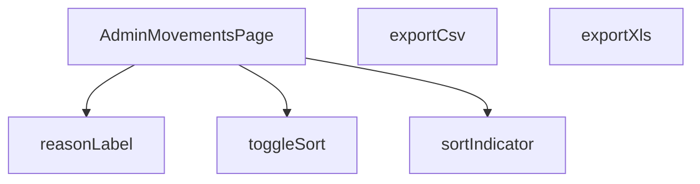

## Genel Bakış
Bu modül, VentHub HVAC yönetim platformunun yönetici panelindeki "Hareketler" sayfasını oluşturan React bileşenidir. Modül, hareket kayıtlarını listeleyerek sıralama ve dışa aktarma işlemleri sunar. Hareket nedenleri gibi alanlar için çok dilli destek sağlar.

## Fonksiyon Grupları
### Ana Sayfa Bileşeni
Modülün ana giriş noktası olup tüm sayfa düzenini ve işlevselliğini bir arada yönetir.
- AdminMovementsPage

### Yerelleştirme Yardımcı Fonksiyonu
Hareket nedenleri gibi kodlanmış anahtarları, kullanıcının diline göre okunabilir etiketlere dönüştürür.
- reasonLabel

### Sıralama İşlevleri
Tabloda hangi sütuna göre sıralama yapıldığını değiştirir ve mevcut sıralama yönünü görsel olarak gösterir.
- toggleSort, sortIndicator

### Veri Dışa Aktarma İşlevleri
Listelenen hareket verilerini CSV ve Excel dosyalarına aktarma süreçlerini başlatır.
- exportCsv, exportXls

---

## AXIOMS – Mimari Varsayımlar

Bu modül, VentHub HVAC yönetim platformunun yönetici panelindeki "Hareketler" sayfasını oluşturan React bileşenidir. Sistemdeki tüm hareket kayıtlarını listeler, düzenler ve yöneticiye farklı formatlarda dışa aktarma olanağı sağlar.

[Aksiyom 1]: Eğer `reasonLabel` fonksiyonu, `key` parametresi olarak `null` veya `undefined` değerini alırsa, `t` fonksiyonu çağrılmaz ve `undefined` döner.
[Aksiyom 2]: Eğer `reasonLabel` fonksiyonu, `ALL_REASONS` sabitinde yer almayan bir `key` değeri alırsa, `t` fonksiyonu çağrılmaz ve `undefined` döner.
[Aksiyom 3]: Eğer `toggleSort` fonksiyonu, `key` parametresi olarak geçerli bir `SortKey` değeri almazsa, sıralama durumu değişmez.
[Aksiyom 4]: Eğer `sortIndicator` fonksiyonu, `key` parametresi olarak geçerli bir `SortKey` değeri almazsa, boş bir string veya nötr bir gösterge döner.
[Aksiyom 5]: Eğer `exportCsv` fonksiyonu, mevcut hareket verisi boşsa, boş bir CSV dosyası oluşturur veya kullanıcıya bilgi verir.
[Aksiyom 6]: Eğer `exportXls` fonksiyonu, mevcut hareket verisi boşsa, boş bir XLS dosyası oluşturur veya kullanıcıya bilgi verir.
[Aksiyom 7]: Eğer `AdminMovementsPage` bileşeni, gerekli veri kaynağını (hareketler listesi) sunucudan alamazsa, hata durumu veya boş bir tablo gösterir.
[Aksiyom 8]: Eğer `AdminMovementsPage` bileşeni, sıralama durumu (`sortKey` ve `sortDirection`) için geçersiz bir değer alırsa, varsayılan sıralamaya döner.
[Aksiyom 9]: Eğer `AdminMovementsPage` bileşeni, dışa aktarma fonksiyonları çağrıldığında, tarayıcı izni veya dosya yazma izni yoksa, kullanıcıya hata mesajı gösterir.

---

## FONKSİYON DETAYLARI

### reasonLabel
**Ne yapar**: Stok hareketi sebebini (reason) yerelleştirilmiş bir etikete dönüştürerek kullanıcıya okunabilir bir metin döndürür.
**Nasıl yapar**: Girdi olarak aldığı `key` parametresini string'e çevirir. Eğer bu string "undo" ile başlıyorsa, çevirisi yapılmış bir "geri al" etiketini döndürür. Diğer durumlarda, `switch` yapısı ile `sale`, `po_receipt`, `manual_in` vb. belirli anahtarları kontrol eder ve karşılık gelen çevrilmiş metni döndürür. Tanınmayan bir anahtar gelirse varsayılan olarak bir tire karakteri (`-`) döner.
**Parametreler**:
- key: string | null | undefined — Stok hareketinin sebebini belirten ve uygulama içinde tanımlı bir anahtar.
- t: (k: string) => string — Verilen anahtarı, kullanıcının diline göre çeviren bir çeviri fonksiyonu.
**Dönüş**: string — Hareket sebebini temsil eden, çevrilmiş ve kullanıcıya sunulacak metin.

### AdminMovementsPage
**Ne yapar**: Uygulamanın yönetim panelindeki stok hareketleri sayfasını render eden ana React bileşenidir.
**Nasıl yapar**: Bu bir fonksiyonel React bileşenidir. Sayfa yüklediğinde veya etkileşim olduğunda, gerekli verileri (stok hareketleri, ürünler) API'den çeker, filtreleme ve sıralama işlemleri uygular, CSV/XLS dışa aktarma fonksiyonlarını sunar ve arayüzü oluşturarak kullanıcıya sunar. Bileşen içinde durum yönetimi (state) ve yan etkiler (effects) kullanarak dinamik bir arayüz sağlar.
**Parametreler**: Yok
**Dönüş**: React.FC — Tam sayfa yapısını ve mantığını içeren React fonksiyonel bileşeni.

### toggleSort
**Ne yapar**: Listelediğimiz stok hareketlerinin sıralamasını değiştirir. Tıklanan sütuna göre sıralama yapar veya sıralama yönünü tersine çevirir.
**Nasıl yapar**: Fonksiyon, mevcut `sortKey` durumu ile gelen `key` parametreini karşılaştırır. Eğer aynı sütuna tekrar tıklanırsa, mevcut sıralama yönünü (`asc`/`desc`) tersine çevirir. Farklı bir sütuna tıklanırsa, sıralama o yeni sütuna (`key`) ayarlanır ve yönü, tarihsel sütun (`date`) için varsayılan olarak `desc`, diğerleri için `asc` olarak ayarlanır.
**Parametreler**:
- key: SortKey — Hangi sütuna göre sırlama yapılacağını belirten anahtar.
**Dönüş**: void — Fonksiyon doğrudan bir değer döndürmez, ancak React state'lerini (`setSortKey`, `setSortDir`) günceller.

### sortIndicator
**Ne yapar**: Hangi sütunun aktif olarak sıralandığını ve sıralama yönünü (artan/azalan) görsel olarak gösteren bir gösterge (▲/▼) döndürür.
**Nasıl yapar**: Fonksiyon, mevcut aktif sıralama sütunu olan `sortKey` durumunu kontrol eder. Eğer istenen sütun (`key`) ile mevcut sıralama sütunu aynı değilse, boş bir string döndürür. Aynı ise, sıralama yönüne (`sortDir`) bakarak artan yön için '▲' veya azalan yön için '▼' karakterini döndürür.
**Parametreler**:
- key: SortKey — Sıralama göstergesinin kontrol edilmek istendiği sütun anahtarı.
**Dönüş**: string — Sıralama yönünü simgeleyen Unicode karakteri veya aktif sıralama sütunu olmadığında boş bir string.

### exportCsv
**Ne yapar**: O an filtrelenmiş olan stok hareketlerini, CSV (Comma-Separated Values) formatında bir dosyaya dönüştürür ve kullanıcının bilgisayarına indirir.
**Nasıl yapar**: Fonksiyon, filtrelenmiş hareketler dizisini (`filtered`) dönüştürerek her satırı CSV formatına uygun hale getirir. Tarih ve metin alanlarını çevirerek, ürün adı ve SKU gibi bilgileri ürün haritasından (`productMap`) çekerek, virgüllerle ayırıp, çift tırnak işaretlerini escape ederek (`"`) satırları oluşturur. Oluşturulan CSV verisine BOM (Byte Order Mark) ekleyerek UTF-8 uyumluluğunu sağlar, bir `Blob` nesnesi oluşturur, geçici bir URL atar ve bu URL'den otomatik bir dosya indirme bağlantısı oluşturarak indirme işlemini tetikler.
**Parametreler**: Yok
**Dönüş**: void — Fonksiyon doğrudan bir değer döndürmez, tarayıcı aracılığıyla dosya indirme işlemini başlatır.

### exportXls
**Ne yapar**: Filtrelenmiş stok hareketlerini, eski sürüm Microsoft Excel ile uyumlu olan bir XLS (HTML tabanlı) formatında dışa aktarır ve bilgisayara indirir.
**Nasıl yapar**: Fonksiyon, her bir hareket verisini bir HTML `<tr>` (satır) elemanına dönüştürerek verileri tablo yapısına yerleştirir. Tam bir HTML dökümanı oluşturur ve bu dökümanın içinde, başlık satırları da dahil olmak üzere verilerin bulunduğu bir HTML tablosu (`<table>`) yer alır. Oluşturulan HTML dökümanını, `application/vnd.ms-excel` MIME türü ile bir `Blob`'a paketler, geçici bir URL oluşturur ve bu URL üzerinden otomatik bir dosya indirme bağlantısı tetikleyerek indirmeyi başlatır.
**Parametreler**: Yok
**Dönüş**: void — Fonksiyon doğrudan bir değer döndürmez, tarayıcı aracılığıyla bir XLS dosyası indirme işlemini başlatır.

---

## TYPE ALIASES

### Movement
```typescript
type Movement = {

  id: string

  product_id: string

  delta: number

  reason: string | null

  order_id?: string | null

  created_at: string

  batch_id?: string | null

}
```

### Product
```typescript
type Product = { id: string; name: string; sku?: string; category_id?: string | null }
```

### Category
```typescript
type Category = { id: string; name: string }
```

### SortKey
```typescript
type SortKey = 'date' | 'product' | 'delta' | 'reason' | 'ref'
```

---

## ENUMS

### LoadState
- `Idle`
- `Loading`
- `Error`

---

## SABİTLER
- **ALL_REASONS** (as_expression) — `['sale', 'po_receipt', 'manual_in', 'manual_out', 'adjust', 'return_in', 'tra...`

---

## AST POINTERS

### [N1_NASIL] AST Pointer: src/views/admin/AdminMovementsPage.tsx::reasonLabel
- **params**: `key` (string | null | undefined — ham sebep anahtarı), `t` ((k: string) => string — çeviri fonksiyonu)
- **ic_degiskenler**:
  - `val` — `key` parametresini `String()` ile string'e dönüştürüp boş string fallback uygular; switch/if-else dal kontrolünde kullanılır
- **Dönüş**: `string` — çevrilmiş sebep etiketi veya varsayılan `'-'`

### [N2_NASIL] AST Pointer: src/views/admin/AdminMovementsPage.tsx::fetchPage (async pageNum)
- **params**: `pageNum` (number — istenen sayfa numarası)
- **ic_degiskenler**:
  - `from` — sayfalama başlangıç indeksi: `(pageNum - 1) * PAGE_SIZE`
  - `to` — sayfalama bitiş indeksi: `from + PAGE_SIZE - 1`
  - `query` — Supabase `inventory_movements` tablosu üzerindeki zincirli sorgu nesnesi; `batchFilter`, `dateRange.from`, `dateRange.to` koşullarıyla filtrelenir
  - `data` — Supabase sorgusundan dönen ham hareket satırları
  - `error` — Supabase sorgu hatası nesnesi
  - `count` — Supabase tarafından dönen toplam eşleşme sayısı (`{ count: 'exact' }` ile)
  - `movements` — `data` dizisinin `Movement[]` tipine cast edilmiş hali; `setRows` ile state'e yazılır
  - `ids` — `movements` içinden benzersiz `product_id` değerlerinden oluşmuş Set; ürün ve kategori sorguları için kullanılır
  - `prodRes` — `products` tablosundan `ids` ile eşleşen kayıtları çeken Supabase yanıt nesnesi
  - `catRes` — `categories` tablosundan tüm kategorileri adlarına göre sıralayarak çeken Supabase yanıt nesnesi
  - `map` — `Record<string, Product>` tipinde; `product_id` → `Product` eşleme sözlüğü; `prodRes.data` döngüsüyle doldurulur
  - `cmap` — `Record<string, string | null>` tipinde; `product_id` → `category_id` eşleme sözlüğü; `p.category_id ?? null` fallback ile doldurulur
- **Dönüş**: yok (yan etkiler: `setLoading`, `setRows`, `setProductMap`, `setProductCategoryMap`, `setCategories`, `setHasMore`, `setError` state güncellemeleri ve `ensureSessionFresh()` API çağrısı)

### [N3_NASIL] AST Pointer: src/views/admin/AdminMovementsPage.tsx::initBatchFilter (anonim)
- **params**: yok
- **ic_degiskenler**:
  - `b` — `searchParams?.get('batch')` değerinin trim edilmiş hali; boşsa boş string fallback; `setBatchFilter` ile state'e yazılır
- **Dönüş**: yok (yan etki: `setBatchFilter`)

### [N4_NASIL] AST Pointer: src/views/admin/AdminMovementsPage.tsx::getActiveCategories (anonim)
- **params**: yok
- **ic_degiskenler**:
  - `idSet` — `Set<string>` tipinde; her bir `row`'un `productCategoryMap[m.product_id]` değerinden toplanan benzersiz kategori ID'leri
- **Dönüş**: `Category[]` — `categories` dizisinin `idSet` içindeki ID'lere sahip elemanlarından filtrelenmiş hali

### [N5_NASIL] AST Pointer: src/views/admin/AdminMovementsPage.tsx::filterMovements (anonim)
- **params**: yok
- **ic_degiskenler**:
  - `base` — `rows` dizisinin referans kopyası; arama ve filtreleme zincirinde başlangıç dizisi olarak kullanılır
  - `term` — `q` değerinin trim edilip küçük harfe çevrilmiş hali; ürün adı ve SKU eşleşmesinde kullanılır
- **Dönüş**: `Movement[]` — arama terimi, `selectedCategory` ve `reasonFilter` koşullarına göre filtrelenmiş satırlar

### [N6_NASIL] AST Pointer: src/views/admin/AdminMovementsPage.tsx::sortedMovements (anonim)
- **params**: yok
- **ic_degiskenler**:
  - `arr` — `filtered` dizisinin spread ile oluşturulmuş shallow kopyası; sıralama üzerinde değişiklik yapılmadan önce diziyi korur
- **Dönüş**: `Movement[]` — `sortKey` ve `sortDir` değerlerine göre sıralanmış satırlar (`date`, `product`, `delta`, `reason`, `ref` switch dalları)

### [N7_NASIL] AST Pointer: src/views/admin/AdminMovementsPage.tsx::toggleSort
- **params**: `key` (SortKey — sıralanacak sütun anahtarı)
- **ic_degiskenler**: yok
- **Dönüş**: yok (yan etki: `setSortDir` ile yön terslenir veya `setSortKey` + `setSortDir` ile yeni sütun seçilir; `date` anahtarı varsayılan olarak `'desc'` yön alır)

### [N8_NASIL] AST Pointer: src/views/admin/AdminMovementsPage.tsx::sortIndicator
- **params**: `key` (SortKey — kontrol edilecek sütun anahtarı)
- **ic_degiskenler**: yok
- **Dönüş**: `string` — aktif sütun değilse boş string, `'asc'` yönünde `'▲'`, `'desc'` yönünde `'▼'`

### [N9_NASIL] AST Pointer: src/views/admin/AdminMovementsPage.tsx::exportCsv
- **params**: yok
- **ic_degiskenler**:
  - `h` — CSV başlık satırı dizisi; `t()` ile çevrilmiş sütun başlıkları (`date`, `product`, `SKU`, `delta`, `reason`, `ref`)
  - `lines` — `filtered` dizisi üzerinde `map` ile oluşturulan CSV satırları; her satır `productMap` lookup, `formatDateTime`, `reasonLabel` ve `order_id.slice(-8)` değerlerini içerir
  - `bom` — `'\ufeff'` UTF-8 BOM karakteri; Excel'in doğru encoding algılaması için kullanılır
  - `csvData` — `h` ve `lines`'ın `\n` ile birleştirilmiş tam CSV içeriği
  - `blob` — `csvData` ve BOM'dan oluşturulan `Blob` nesnesi; MIME tipi `text/csv;charset=utf-8;`
  - `url` — `URL.createObjectURL(blob)` ile üretilen geçici dosya URL'i
  - `link` — `document.createElement('a')` ile oluşturulan DOM köprü elemanı; `url` ve `download` attribute'u ayarlanıp `.click()` ile tetiklenir
- **Dönüş**: yok (yan etki: tarayıcıda CSV dosyası indirme tetiklenir; `URL.revokeObjectURL` ile URL serbest bırakılır)

### [N10_NASIL] AST Pointer: src/views/admin/AdminMovementsPage.tsx::exportXls
- **params**: yok
- **ic_degiskenler**:
  - `rowsHtml` — `filtered` dizisi üzerinde `map` ile oluşturulan HTML `<tr>` satırları; her hücre `formatDateTime`, `productMap` lookup, `reasonLabel` ve `order_id.slice(-8)` değerlerini içerir
  - `tHtml` — `<!DOCTYPE html>` ile başlayan tam HTML belgesi; `<table>` yapısını `<thead>` başlık satırları ve `<tbody>` ile `rowsHtml` gövdesini kapsar
  - `blob` — `tHtml`'den oluşturulan `Blob` nesnesi; MIME tipi `application/vnd.ms-excel`
  - `url` — `URL.createObjectURL(blob)` ile üretilen geçici dosya URL'i
  - `link` — `document.createElement('a')` ile oluşturulan DOM köprü elemanı; `download` attribute'u `inventory_movements_p${page}.xls` olarak ayarlanır
- **Dönüş**: yok (yan etki: tarayıcıda XLS dosyası indirme tetiklenir; `URL.revokeObjectURL` ile URL serbest bırakılır)

### [N11_NASIL] AST Pointer: src/views/admin/AdminMovementsPage.tsx::loadPreferences (anonim)
- **params**: yok
- **ic_degiskenler**:
  - `rawCols` — `localStorage.getItem(\`${STORAGE_KEY}:cols\`)` ile okunan sütun görünürlük tercihleri JSON string'i
  - `rawDen` — `localStorage.getItem(\`${STORAGE_KEY}:density\`)` ile okunan yoğunluk tercihi string'i; `'compact'` veya `'comfortable'` değerlerinden biri olmalıdır
- **Dönüş**: yok (yan etki: `setVisibleCols` ile sütun görünürlükleri, `setDensity` ile yoğunluk state'i güncellenir; `try-catch` ile sessizce hata yutulur)

### [N12_NASIL] AST Pointer: src/views/admin/AdminMovementsPage.tsx::resetFilters (anonim)
- **params**: yok
- **ic_degiskenler**: yok
- **Dönüş**: yok (yan etki: `setPage(1)`, `setQ('')`, `setSelectedCategory('')`, `setDateRange(undefined)`, `setReasonFilter(...)` ile tüm filtre state'leri başlangıç değerlerine sıfırlanır; `ALL_REASONS` dizisi `map` ile `Record<string, boolean>` formatına dönüştürülüp tüm sebepler `true` olarak ayarlanır)

---


## MERMAID CALL GRAPH


## NODE ID STANDARD

  file: src\views\admin\AdminMovementsPage.tsx
  function: src\views\admin\AdminMovementsPage.tsx::reasonLabel
  function: src\views\admin\AdminMovementsPage.tsx::AdminMovementsPage
  function: src\views\admin\AdminMovementsPage.tsx::toggleSort
  function: src\views\admin\AdminMovementsPage.tsx::sortIndicator
  function: src\views\admin\AdminMovementsPage.tsx::exportCsv
  function: src\views\admin\AdminMovementsPage.tsx::exportXls

---

## DISA AKTARILANLAR (EXPORTS)
  export: AdminMovementsPage
  export: reasonLabel

---

## STİL TOKENLERİ

### Arbitrary Değerler (token'a geçirilmemiş)
Yok — tüm stiller token'a geçirilmiş. ✅

### Kullanılan Token'lar (zaten token'a geçirilmiş)
- `tracking-hvac-normal`, `tracking-hvac-tight`

### Tailwind Sınıf Özeti
- **Renkler:** `bg-amber-500`, `bg-cyan-500/50`, `bg-emerald-500/10`, `bg-rose-500/10`, `bg-white/2`, `bg-white/5`, `border-amber-500/20`, `border-b`, `border-emerald-500/20`, `border-rose-500/20`, `border-t`, `border-white/5`, `hover:bg-white/2`, `hover:text-cyan-400`, `text-amber-400`
- **Layout:** `!h-8`, `flex`, `flex-col`, `gap-0.5`, `gap-1`, `gap-2`, `h-1`, `h-1.5`, `inline-flex`, `items-center`, `justify-between`, `min-w-700px`, `overflow-hidden`, `overflow-x-auto`, `p-0`
- **Varyant/Responsive:** `:`, `hover:` önekleri
- **Yardımcı Sınıflar:** `!px-4`, `${adminCardClass`, `${adminTableActionWarningClass`, `${adminTableCellClass`, `${adminTableHeadCellClass`, `${cellPad`, `${headPad`, `${m.delta`, `0`, `:`, `<`, `>`, `animate-pulse`, `border`, `content-auto-table`