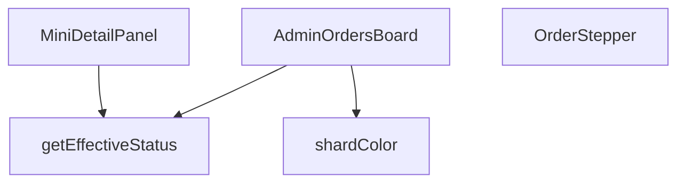

## Genel Bakış
Yönetim panelinde siparişlerin durumlarını kart tabanlı bir panoda görselleştiren React modülüdür. Her sipariş kartı için etkili durum hesaplama, duruma göre renk belirleme ve ilerleme adımı gösterimi sağlar; ayrıca sipariş detaylarını inceleme paneli sunar.

## Fonksiyon Grupları
### UI Bileşenleri
Kullanıcı arayüzünü oluşturan React bileşenleridir. Ana panonu oluşturur, durum ilerleme çubuğunu render eder ve sipariş detay panelini yönetir.
- **AdminOrdersBoard**, **OrderStepper**, **MiniDetailPanel**

### Yardımcı Fonksiyonlar
UI bileşenlerinden iş mantığını ayıran saf fonksiyonlardır. Siparişin etkili durumunu hesaplar ve duruma göre renk değerleri üretir.
- **getEffectiveStatus**, **shardColor**

---


---

## FONKSİYON DETAYLARI

### getEffectiveStatus
**Ne yapar**: Bir sipariş nesnesinin gerçek durumunu belirler; ödeme iade edilmişse iade durumunu, aksi takdirde siparişin mevcut durumunu döndürür.  
**Nasıl yapar**: `order.payment_status` değerini kontrol eder; eğer `'refunded'` veya `'partial_refunded'` ise bu değeri, değilse `order.status` alanını (veya yoksa `'pending'`) döndürür.  
**Parametreler**:
- `order`: `AdminOrderRow` — Sipariş verisini içeren nesne; `payment_status` ve `status` alanlarını barındırır.  
**Dönüş**: `string` — Hesaplanmış etkili sipariş durumu.

### OrderStepper
**Ne yapar**: Siparişin mevcut adımını görsel bir stepper (adım göstergesi) olarak render eder; iptal veya iade durumunda özel bir uyarı mesajı gösterir.  
**Nasıl yapar**: `status` değerine göre adım indeksini `getStepIndex` fonksiyonuyla bulur, iptal/ iade kontrolü yapar ve ilgili JSX yapısını döndürür. Stepper içinde adımların etiketleri i18n çevirileriyle oluşturulur ve ilerleme çubuğu dinamik olarak genişletilir.  
**Parametreler**:
- `status`: `string` — Siparişin geçerli durumu; stepper’ın hangi adımda olacağını belirler.  
**Dönüş**: JSX element (React bileşeni) — Stepper UI’si veya iptal/ iade uyarı mesajı.

### MiniDetailPanel
**Ne yapar**: Seçili bir siparişin detaylarını, notlarını, e‑posta loglarını ve lojistik bilgilerini gösteren modal bir panel sunar; ayrıca yeni not ekleme işlevi sağlar.  
**Nasıl yapar**: `useEffect` içinde siparişle ilgili not, e‑posta log ve taşıyıcı bilgilerini asenkron olarak Supabase’dan çeker, state’leri günceller. Not ekleme fonksiyonu yetki kontrolü yapar, Supabase’a kaydeder ve UI’yı yeniler. Panel, kapanma işlemi için dış tıklama ve Escape tuşu dinleyicileri içerir.  
**Parametreler**:
- `order`: `AdminOrderRow` — Görüntülenecek sipariş nesnesi.  
- `onClose`: `() => void` — Paneli kapatmak için çağrılan geri dönüş fonksiyonu.  
- `hasWriteAccess`: `boolean` — Kullanıcının not ekleme yetkisi olup olmadığını belirten bayrak.  
**Dönüş**: JSX element (React bileşeni) — Detay paneli UI’si.

### AdminOrdersBoard
**Ne yapar**: Yönetim panelinde siparişleri kanban tarzı bir tablo içinde gösterir; sürükle‑bırak ile durum değişikliği, filtreleme, yenileme ve mobil/masaüstü uyumlu görünüm sağlar.  
**Nasıl yapar**: `useEffect` ile siparişleri Supabase’dan çeker, `COLUMNS` tanımıyla her durum grubu için kolon konfigürasyonu oluşturur. `react-beautiful-dnd` ile sürükle‑bırak mantığını yönetir, `onDragEnd` içinde yetki kontrolü, durum güncellemesi ve hata yönetimi yapılır. UI, kaydırma butonları, mobil sekme geçişleri ve seçili sipariş için `MiniDetailPanel` entegrasyonu içerir.  
**Parametreler**: *(yok)*  
**Dönüş**: JSX element (React bileşeni) — Sipariş panosu UI’si.

### shardColor
**Ne yapar**: Sipariş durumuna göre renkli bir arka plan “shard” (parçacık) oluşturur; sürükleme sırasında görünmez hâle getirir.  
**Nasıl yapar**: `status` değerini küçük harfe çevirir, önceden tanımlı durum‑renk eşleştirmesine göre CSS sınıfını seçer ve ilgili `div` elementini döndürür; `isDragging` true ise `null` döner.  
**Parametreler**:
- `status`: `string` — Siparişin mevcut dur renk seçimini etkiler.  
- `isDragging`: `boolean` — Sürükleme durumu; true ise renkli öğe gösterilmez.  
**Dönüş**: JSX element (`<div>` with color class) veya `null` — Duruma göre renkli arka plan veya boş değer.

---

## INTERFACES

### AdminOrderRow
- `id: string`
- `status: string`
- `user_id?: string | null`
- `total_amount?: number | null`
- `created_at: string`
- `customer_name?: string | null`
- `customer_email?: string | null`
- `customer_phone?: string | null`
- `order_number?: string | null`
- `payment_status?: string | null`

### ColumnDef
- `id: ColumnId`
- `title: string`
- `statuses: string[]`
- `icon: LucideIcon`
- `colorClass: string`
- `bgClass: string`
- `targetStatus: string`

### ColumnDef
- `id: ColumnId`
- `title: string`
- `statuses: string[]`
- `icon: LucideIcon`
- `colorClass: string`
- `bgClass: string`
- `targetStatus: string`

### OrderDetail
- `notes: { id: string; note: string; created_at: string }[]`
- `emailLogs: { subject: string; created_at: string }[]`
- `carrier?: string | null`
- `tracking_number?: string | null`

---

## TYPE ALIASES

### ColumnId
```typescript
type ColumnId = 'col_new' | 'col_prep' | 'col_shipped' | 'col_done' | 'col_cancel' | 'col_refund'
```

---

## AST POINTERS

### [N1_NASIL] AST Pointer: views/admin/AdminOrdersBoard.tsx::getEffectiveStatus
- **params**: `order: AdminOrderRow` — sipariş nesnesi
- **ic_degiskenler**: yok
- **Dönüş**: string — siparişin efektif durumu

### [N2_NASIL] AST Pointer: views/admin/AdminOrdersBoard.tsx::OrderStepper
- **params**: `{ status }: { status: string }` — sipariş durumu
- **ic_degiskenler**:
  - `t` — useI18n hook'undan gelen çeviri fonksiyonu
  - `steps` — stepper için adımlar dizisi (pending, paid, confirmed, shipped, delivered)
  - `getStepIndex` — durum string'ini adım indisine dönüştüren iç fonksiyon
  - `currentIndex` — mevcut adımın indisi (getStepIndex çağrısı ile)
  - `isCancelled` — siparişin iptal/edilmiş olup olmadığı boolean
- **Dönüş**: JSX elementi (stepper UI)

### [N3_NASIL] AST Pointer: views/admin/AdminOrdersBoard.tsx::MiniDetailPanel
- **params**: `{ order, onClose, hasWriteAccess }` — order: AdminOrderRow, onClose: kapatma callbacki, hasWriteAccess: yazma izni boolean
- **ic_degiskenler**:
  - `t` — useI18n hook'undan gelen çeviri fonksiyonu
  - `lang` — mevcut dil kodu
  - `detail` — useState ile yönetilen sipariş detay verisi (notes, emailLogs, carrier, tracking_number)
  - `loading` — useState ile yönetilen yükleme durumu boolean
  - `noteInput` — useState ile yönetilen not giriş input değeri
  - `saving` — useState ile yönetilen kaydetme durumu boolean
  - `mounted` — useEffect cleanup flag'i (component mount durumu)
  - `load` — useEffect içindeki async veri yükleme fonksiyonu
  - `notesRes` — order_notes tablosundan gelen not verileri
  - `logsRes` — shipping_email_events tablosundan gelen email logları
  - `orderRes` — venthub_orders tablosundan gelen kargo bilgileri
  - `addNote` — not ekleyen async fonksiyon
  - `data` — supabase.insert sonucu eklenen not verisi
  - `error` — supabase.insert hatası
- **Dönüş**: JSX elementi (sipariş detay modal paneli)

### [N4_NASIL] AST Pointer: views/admin/AdminOrdersBoard.tsx::AdminOrdersBoard
- **params**: (parametre yok)
- **ic_degiskenler**:
  - `pathname` — usePathname hook'undan gelen mevcut URL yolu
  - `t` — useI18n hook'undan gelen çeviri fonksiyonu
  - `lang` — mevcut dil kodu
  - `canWrite` — useRole hook'undan gelen yazma izni kontrol fonksiyonu
  - `hasWriteAccess` — orders için yazma izni boolean (canWrite('orders') çağrısı)
  - `orders` — useState ile yönetilen AdminOrderRow dizisi (tüm siparişler)
  - `loading` — useState ile yönetilen yükleme durumu boolean
  - `selectedOrder` — useState ile yönetilen seçili sipariş (mini detay paneli için)
  - `expandedCol` — useState ile yönetilen genişletilmiş sütun ID'si (ColumnId)
  - `scrollRef` — useRef ile yönetilen scroll контейнер referansı
  - `COLUMNS` — React.useMemo ile tanımlanan sütun tanımları dizisi (ColumnDef[])
  - `fetchOrders` — useCallback ile tanımlanan siparişleri yükleyen async fonksiyon
  - `data` — supabase.select sonucu gelen sipariş verisi
  - `error` — supabase.select hatası
  - `scrollBoard` — sol/sağ kaydırma fonksiyonu
  - `amount` — kaydırma miktarı (340px sabiti)
  - `getOrdersByCol` — belirli bir sütuna ait siparişleri filtreleyen fonksiyon
  - `colDef` — colId'ye karşılık gelen sütun tanımı
  - `onDragEnd` — sürükle-bırak işlemi bittiğinde çağrılan async fonksiyon
  - `result` — DropResult sürükle-bırak sonucu
  - `destination` — sürükleme hedefi
  - `source` — sürükleme kaynağı
  - `draggableId` — sürükleme yapılan sipariş ID'si
  - `destCol` — hedef sütun tanımı
  - `targetOrder` — sürükleme yapılan sipariş nesnesi
  - `targetStatus` — hedef durum (destCol.targetStatus)
  - `effectiveCurrent` — siparişin mevcut efektif durumu
  - `oldStatus` — siparişin eski durumu (güncelleme öncesi)
  - `res` — updateOrderStatus fonksiyonunun dönüş değeri
- **Dönüş**: JSX elementi (kanban sipariş yönetim kurulu)

### [N5_NASIL] AST Pointer: views/admin/AdminOrdersBoard.tsx::shardColor
- **params**: `status: string, isDragging: boolean` — durum ve sürükleme durumu boolean
- **ic_degiskenler**:
  - `base` — status'un küçük harfli hali
  - `color` — duruma göre arka plan rengi class'ı (başlangıç: 'bg-slate-500/20')
- **Dönüş**: JSX elementi veya null (duruma göre renk efekti)

---


## MERMAID CALL GRAPH


## NODE ID STANDARD

  file: src\views\admin\AdminOrdersBoard.tsx
  function: src\views\admin\AdminOrdersBoard.tsx::getEffectiveStatus
  function: src\views\admin\AdminOrdersBoard.tsx::OrderStepper
  function: src\views\admin\AdminOrdersBoard.tsx::MiniDetailPanel
  function: src\views\admin\AdminOrdersBoard.tsx::AdminOrdersBoard
  function: src\views\admin\AdminOrdersBoard.tsx::shardColor

---

## DISA AKTARILANLAR (EXPORTS)
  export: AdminOrdersBoard
  export: MiniDetailPanel
  export: OrderStepper
  export: getEffectiveStatus
  export: shardColor

---

## STİL TOKENLERİ

### Arbitrary Değerler (token'a geçirilmemiş)
Yok — tüm stiller token'a geçirilmiş. ✅

### Kullanılan Token'lar (zaten token'a geçirilmiş)
- `rounded-hvac-2xl`, `rounded-hvac-lg`, `rounded-hvac-xl`, `shadow-glow-md`, `shadow-glow-sm`, `tracking-hvac-normal`, `tracking-hvac-relaxed`, `tracking-hvac-tight`

### Tailwind Sınıf Özeti
- **Renkler:** `bg-amber-400/5`, `bg-blue-500/10`, `bg-blue-500/20`, `bg-clip-text`, `bg-cyan-400`, `bg-cyan-500`, `bg-cyan-500/5`, `bg-gradient-to-r`, `bg-rose-500/10`, `bg-surface-darker/40`, `bg-white`, `bg-white/10`, `bg-white/2`, `bg-white/3`, `bg-white/5`
- **Layout:** `!h-42px`, `-right-4`, `-top-4`, `-z-10`, `absolute`, `backdrop-blur-md`, `backdrop-blur-xl`, `bg-clip-text`, `block`, `custom-scrollbar`, `fixed`, `flex`, `flex-1`, `flex-col`, `from-white`
- **Varyant/Responsive:** `:`, `disabled:`, `group-hover:`, `hover:`, `md:` önekleri
- **Yardımcı Sınıflar:** `!px-5`, `${!isExpanded`, `${adminButtonPrimaryClass`, `${col.bgClass`, `${col.colorClass`, `${color`, `${isActive`, `${isCurrent`, `${isExpanded`, `${isPast`, `${snapshot.isDragging`, `${snapshot.isDraggingOver`, `-mx-1`, `-translate-y-1/2`, `:`