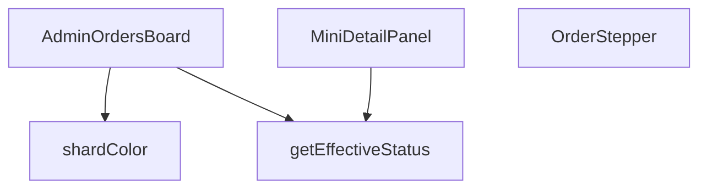

## Genel Bakış
Bu modül, yönetim panelinde siparişlerin durumlarını kart tabanlı, interaktif bir panoda görselleştirmek için kullanılan bir React bileşenidir. Her sipariş için hesaplanan etkili duruma göre renklendirme, adım adım durum gösterimi ve detaylı bilgi paneli sunarak sipariş yönetimi akışını destekler.

## Fonksiyon Grupları
### Ana ve Alt Bileşenler
Kullanıcı arayüzünü oluşturan React bileşenleridir. Ana sipariş panosunu, her bir sipariş kartındaki durum ilerlemesini ve sipariş detaylarının açılabilir mini panelini yönetir.
- AdminOrdersBoard, OrderStepper, MiniDetailPanel

### Yardımcı İş Mantığı Fonksiyonları
UI bileşenlerinden soyutlanmış, hesaplama ve stil belirleme işlerini yapan saf fonksiyonlardır. Siparişin nihai durumunu belirler ve duruma göre renk değerlerini üretir.
- getEffectiveStatus, shardColor

---

## AXIOMS – Mimari Varsayımlar

Bu modül için, fonksiyon gövdelerindeki imza ve bağımlılıklara dayanan temel mimari varsayımlar şunlardır:

[Aksiyom 1]: Eğer `getEffectiveStatus` fonksiyonuna geçerli bir `AdminOrderRow` nesnesi (`order`) verilmezse, fonksiyon beklenmedik bir hata fırlatabilir veya tanımsız bir değer döndürebilir; bu durumda `shardColor` ve `OrderStepper` bileşenleri yanlış durum bilgisiyle çalışır.

[Aksiyom 2]: Eğer `OrderStepper` bileşenine geçerli bir `status` stringi verilmezse (null, undefined veya boş string), adım gösterimi doğru render edilmeyebilir veya hata oluşabilir.

[Aksiyom 3]: Eğer `MiniDetailPanel` bileşenine geçerli bir `order` nesnesi, `onClose` fonksiyonu veya `hasWriteAccess` boolean değeri verilmezse, panel düzgün çalışmayabilir; örneğin, kapatma butonu çalışmaz veya yazma izni gerektiren kontroller hatalı davranır.

[Aksiyom 4]: Eğer `shardColor` fonksiyonuna geçerli bir `status` stringi veya `isDragging` boolean değeri verilmezse, uygun renk değeri döndüremeyebilir; bu durumda UI'da renksiz veya hatalı bir kart görüntüsü oluşabilir.

[Aksiyom 5]: Eğer `AdminOrdersBoard` ana bileşeni, alt bileşenlere (`OrderStepper`, `MiniDetailPanel`) doğru verileri (örneğin, `status`, `order`, `onClose`, `hasWriteAccess`) iletmezse, tüm board düzgün çalışmayabilir.

[Aksiyom 6]: Eğer `getEffectiveStatus` fonksiyonu, `AdminOrderRow` nesnesinin iç yapısına (örneğin, `status` alanına) erişemezse, etkili durum hesaplanamaz; bu durumda `shardColor` ile `OrderStepper` yanlış durum bilgisiyle çalışır ve UI tutarsız hale gelir.

---

## FONKSİYON DETAYLARI

### getEffectiveStatus
**Ne yapar**: Bir sipariş nesnesinin gerçek durumunu belirler; ödeme iade edilmişse iade durumunu, aksi takdirde siparişin mevcut durumunu döndürür.  
**Nasıl yapar**: `order.payment_status` değerini kontrol eder; eğer `'refunded'` veya `'partial_refunded'` ise bu değeri, değilse `order.status` alanını (veya yoksa `'pending'`) döndürür.  
**Parametreler**:
- `order`: `AdminOrderRow` — Sipariş verisini içeren nesne; `payment_status` ve `status` alanlarını barındırır.  
**Dönüş**: `string` — Hesaplanmış etkili sipariş durumu.

### OrderStepper
**Ne yapar**: Bir siparişin mevcut durumunu görsel olarak adım adım gösteren, ilerleme çubuğu ve durum göstergeleri içeren bileşendir. Sipariş iptal edildiğinde veya iade edildiğinde özel bir durum mesajı gösterir.

**Nasıl yapar**: `useI18n` hook'u ile çeviri fonksiyonunu (`t`) alır. Sabit bir adım listesi (`steps`) oluşturur. `getStepIndex` adlı iç fonksiyonla, verilen `status` string'ini bir adım indeksine dönüştürür. `currentIndex` hesaplanır ve `isCancelled` durumu kontrol edilir. iptal/iade durumunda, rose renkli bir hata mesajı döndürür. Aksi takdirde, dikey bir esnek (`flex`) container içinde her bir adımı sırayla render eder. Her adım, geçmişi (`isPast`), mevcut (`isCurrent`) veya gelecek durumuna göre farklı CSS sınıflarıyla stillendirilir. Geçmiş adımlarda onay simgesi, mevcut adımda büyüyen bir halka, gelecek adımlarda ise pasif bir daire gösterir.

**Parametreler**:
- `status`: `string` — Siparişin mevcut durumunu belirten anahtar kelime (örn: 'pending', 'shipped', 'cancelled').

**Dönüş**: `JSX.Element` (veya React.ReactNode) — Sipariş durumunu görsel olarak temsil eden React bileşeni.

### MiniDetailPanel
**Ne yapar**: Bir siparişin detaylı görünümünü, notlarını, kargo bilgilerini ve e-posta logsunu gösteren, modal formatta bir panel bileşenidir. Kullanıcılar bu panelden not ekleyebilir.

**Nasıl yapar**: `useI18n` hook'u ile çeviri ve dil bilgisini alır. `useState` ile `detail` (sipariş detayları), `loading`, `noteInput` ve `saving` durumlarını yönetir. `useEffect` ile `order.id` değiştiğinde, `supabase` istemcisini kullanarak `order_notes`, `shipping_email_events` ve `venthub_orders` tablolarından eş zamanlı (`Promise.all`) veri çeker. Çekilen veriler `detail` state'ine atanır. `addNote` asenkron fonksiyonu, `hasWriteAccess` izni varsa ve girdi boş değilse, `order_notes` tablosuna yeni bir not ekler ve `detail.notes` dizisini günceller. Render kısmında, `loading` durumunda bir spinner, veri yüklendiğinde ise sipariş numarası, müşteri bilgileri, sipariş toplamı, lojistik bilgileri (varsa), notlar listesi ve e-posta logsu bölümlerini içerir. `OrderStepper` bileşenini de gömülü olarak kullanır.

**Parametreler**:
- `order`: `AdminOrderRow` — Panelden gösterilecek sipariş verisini temsil eden nesne. Sipariş numarası, müşteri adı, ID vb. alanları içerir.
- `onClose`: `() => void` — Panel kapatıldığında çağrılacak geri çağırma fonksiyonu.
- `hasWriteAccess`: `boolean` — Kullanıcının not ekleme gibi yazma işlemi yapmaya yetkisi olup olmadığını belirten bayrak.

**Dönüş**: `JSX.Element` (veya React.ReactNode) — Tam ekran bir modal olarak render edilen detay paneli bileşeni.

### AdminOrdersBoard
**Ne yapar**: Siparişleri, durumlarına göre sütunlara ayrılmış interaktif bir Kanban (sürükle-bırak) board'ı olarak gösteren ana yönetim paneli bileşenidir. Siparişleri farklı durumlar arasında taşımayı sağlar.

**Nasıl yapar**: `usePathname`, `useI18n`, `useRole` hook'ları ile mevcut yol, çeviri ve rol izinlerini alır. `useState` ile `orders` (tüm siparişler), `totalCount`, `loading`, `selectedOrder` ve `expandedCol` (genişletilmiş mobil sütun) durumlarını yönetir. `useMemo` ile sütun tanımlarını (`COLUMNS`) bellekte optimize eder. `fetchOrders` `useCallback` fonksiyonu, `supabase`'den `view_admin_orders` görünümünü sorgulayarak siparişleri çeker. `onDragEnd` fonksiyonu, `react-beautiful-dnd` kütüphanesinin sürükle-bırak sonucunu işler: Hedef sütunun `targetStatus`'unu alır, izin kontrolü yapar, local state'i optimistik olarak günceller ve `updateOrderStatus` fonksiyonuyla sunucuya istek gönderir. Hata durumunda eski duruma geri döner. Render kısmı, mobil için sekmeli sütun seçiciyi, masaüstü için yatay kaydırılabilir board'u ve her sütun için `Droppable`, her sipariş kartı için `Draggable` bileşenlerini içerir. Sütun başlıkları, kart sayıları ve sürükle-bırak görselleri dinamik olarak stillendirilir. Sipariş kartına tıklanınca `MiniDetailPanel` modal'ı açılır.

**Parametreler**: Parametre almaz (boş imza).

**Dönüş**: `JSX.Element` (veya React.ReactNode) — Sipariş Kanban board'unu ve ilgili kontrolleri (yenile, kaydır) içeren ana layout bileşeni.

### shardColor
**Ne yapar**: Sipariş durumuna göre renkli bir arka plan “shard” (parçacık) oluşturur; sürükleme sırasında görünmez hâle getirir.  
**Nasıl yapar**: `status` değerini küçük harfe çevirir, önceden tanımlı durum‑renk eşleştirmesine göre CSS sınıfını seçer ve ilgili `div` elementini döndürür; `isDragging` true ise `null` döner.  
**Parametreler**:
- `status`: `string` — Siparişin mevcut dur renk seçimini etkiler.  
- `isDragging`: `boolean` — Sürükleme durumu; true ise renkli öğe gösterilmez.  
**Dönüş**: JSX element (`<div>` with color class) veya `null` — Duruma göre renkli arka plan veya boş değer.

---

## İTHALATLAR (IMPORTS)
- import: ../../components/admin/AdminSkeleton::AdminSkeleton
- import: ../../hooks/useRole::useRole
- import: ../../i18n/I18nProvider::useI18n
- import: ../../i18n/datetime::formatDateTime
- import: ../../i18n/format::formatCurrency
- import: ../../lib/ensureSessionFresh::ensureSessionFresh
- import: ../../lib/orderStatusService::updateOrderStatus
- import: @/lib/supabase/client::supabaseBrowserClient
- import: @hello-pangea/dnd::DragDropContext
- import: @hello-pangea/dnd::Draggable
- import: @hello-pangea/dnd::DropResult
- import: @hello-pangea/dnd::Droppable
- import: next/navigation::usePathname
- import: react::React
- import: react::useCallback
- import: react::useEffect
- import: react::useRef
- import: react::useState
- import: sonner::toast

---

## INTERFACES

### AdminOrderRow
- `id: string`
- `status: string`
- `user_id?: string | null`
- `total_amount?: number | null`
- `created_at: string`
- `customer_name?: string | null`
- `customer_email?: string | null`
- `customer_phone?: string | null`
- `order_number?: string | null`
- `payment_status?: string | null`

### ColumnDef
- `id: ColumnId`
- `title: string`
- `statuses: string[]`
- `icon: LucideIcon`
- `colorClass: string`
- `bgClass: string`
- `targetStatus: string`

### ColumnDef
- `id: ColumnId`
- `title: string`
- `statuses: string[]`
- `icon: LucideIcon`
- `colorClass: string`
- `bgClass: string`
- `targetStatus: string`

### OrderDetail
- `notes: { id: string; note: string; created_at: string }[]`
- `emailLogs: { subject: string; created_at: string }[]`
- `carrier?: string | null`
- `tracking_number?: string | null`

---

## TYPE ALIASES

### ColumnId
```typescript
type ColumnId = 'col_new' | 'col_prep' | 'col_shipped' | 'col_done' | 'col_cancel' | 'col_refund'
```

---

## AST POINTERS

### [N1_NASIL] AST Pointer: AdminOrdersBoard.tsx::getEffectiveStatus
- **params**: `order` — AdminOrderRow tipinde sipariş nesnesi
- **ic_degiskenler**:
  - `order.payment_status` — Siparişin ödeme durumu (refunded, partial_refunded, vb.) kontrol edilir
  - `order.status` — Siparişin genel durumu, ödeme durumu iade/değilse kullanılır
- **Dönüş**: string — Efektif sipariş durumu (payment_status veya status)

### [N2_NASIL] AST Pointer: AdminOrdersBoard.tsx::OrderStepper
- **params**: `status` — string, sipariş durumu
- **ic_degiskenler**:
  - `t` — useI18n() hook'undan çeviri fonksiyonu
  - `steps` — Sipariş adımlarını tanımlayan dizi (pending, paid, confirmed, shipped, delivered)
  - `getStepIndex` — Duruma göre adım indeksini döndüren iç fonksiyon
  - `currentIndex` — Mevcut adım indeksi (getStepIndex ile hesaplanır)
  - `isCancelled` — Siparişin iptal/iade durumunda olup olmadığını belirleyen boolean
- **Dönüş**: JSX — Sipariş ilerleme çubuğu veya iptal/iade uyarısı

### [N3_NASIL] AST Pointer: AdminOrdersBoard.tsx::MiniDetailPanel
- **params**: `order` (AdminOrderRow), `onClose` (() => void), `hasWriteAccess` (boolean)
- **ic_degiskenler**:
  - `t, lang` — useI18n() hook'undan çeviri ve dil bilgisi
  - `detail` (useState) — Sipariş detayları (notlar, e-posta logları, kargo bilgisi)
  - `loading` (useState) — Veri yükleme durumu
  - `noteInput` (useState) — Yeni not girişi için input değeri
  - `saving` (useState) — Not kaydetme işlemi sırasında durum
  - `useEffect` — Sipariş detaylarını yükleyen efekt
  - `mounted` — Bileşen mount durumunu takip eden flag
  - `notesRes, logsRes, orderRes` — Promise.all ile paralel API çağrı sonuçları
  - `addNote` — Async fonksiyon, yeni not ekler
- **Dönüş**: JSX — Modal panel (sipariş detayı, notlar, e-posta logları)

### [N4_NASIL] AST Pointer: AdminOrdersBoard.tsx::AdminOrdersBoard
- **params**: (yok)
- **ic_degiskenler**:
  - `pathname` — usePathname() hook'undan mevcut URL yolu
  - `t, lang` — useI18n() hook'undan çeviri ve dil bilgisi
  - `canWrite, hasWriteAccess` — useRole() hook'undan yazma izni kontrolü
  - `orders, setOrders` (useState) — Tüm siparişler dizisi
  - `totalCount, setTotalCount` (useState) — Toplam sipariş sayısı (limit uyarı için)
  - `loading, setLoading` (useState) — Veri yükleme durumu
  - `selectedOrder, setSelectedOrder` (useState) — Detay paneli için seçili sipariş
  - `expandedCol, setExpandedCol` (useState) — Mobil görünümde genişletilmiş sütun
  - `scrollRef` (useRef) — Panolar arası kaydırma için referans
  - `COLUMNS` (useMemo) — Kanban sütun tanımları (6 sütun: yeni, hazırlık, kargoda, tamamlandı, iptal, iade)
  - `fetchOrders` (useCallback) — Supabase'den siparişleri yükleyen async fonksiyon
  - `scrollBoard` — Panoları yatay kaydıran fonksiyon
  - `getOrdersByCol` — Sütun ID'sine göre filtrelenmiş siparişleri döndüren fonksiyon
  - `onDragEnd` — Sürükleme-bırakma sonrası sipariş durumunu güncelleyen async fonksiyon
- **Dönüş**: JSX — Tam Kanban board arayüzü (sütunlar, sürüklenebilir kartlar, mobil sekmeler)

### [N5_NASIL] AST Pointer: AdminOrdersBoard.tsx::shardColor
- **params**: `status` (string), `isDragging` (boolean)
- **ic_degiskenler**:
  - `base` — status değerinin küçük harf versiyonu
  - `color` — Duruma göre Tailwind arka plan rengi sınıfı (varsayılan: bg-slate-500/20)
- **Dönüş**: JSX veya null — Sürükleme sırasında parıltı efekti için renkli blur çemberi

---


## MERMAID CALL GRAPH


## NODE ID STANDARD

  file: src\views\admin\AdminOrdersBoard.tsx
  function: src\views\admin\AdminOrdersBoard.tsx::getEffectiveStatus
  function: src\views\admin\AdminOrdersBoard.tsx::OrderStepper
  function: src\views\admin\AdminOrdersBoard.tsx::MiniDetailPanel
  function: src\views\admin\AdminOrdersBoard.tsx::AdminOrdersBoard
  function: src\views\admin\AdminOrdersBoard.tsx::shardColor

---

## DISA AKTARILANLAR (EXPORTS)
  export: AdminOrdersBoard
  export: MiniDetailPanel
  export: OrderStepper
  export: getEffectiveStatus
  export: shardColor

---

## STİL TOKENLERİ

### Arbitrary Değerler (token'a geçirilmemiş)
Yok — tüm stiller token'a geçirilmiş. ✅

### Kullanılan Token'lar (zaten token'a geçirilmiş)
- `rounded-hvac-2xl`, `rounded-hvac-lg`, `rounded-hvac-xl`, `shadow-glow-md`, `tracking-hvac-normal`, `tracking-hvac-relaxed`, `tracking-hvac-tight`

### Tailwind Sınıf Özeti
- **Renkler:** `bg-amber-400/5`, `bg-amber-500/10`, `bg-blue-500/10`, `bg-blue-500/20`, `bg-clip-text`, `bg-cyan-400`, `bg-cyan-500`, `bg-cyan-500/5`, `bg-gradient-to-r`, `bg-rose-500/10`, `bg-surface-darker/40`, `bg-white`, `bg-white/10`, `bg-white/5`, `border-2`
- **Layout:** `!h-10`, `-right-4`, `-top-4`, `absolute`, `backdrop-blur-md`, `backdrop-blur-xl`, `bg-clip-text`, `block`, `custom-scrollbar`, `fixed`, `flex`, `flex-1`, `flex-col`, `from-white`, `gap-1`
- **Varyant/Responsive:** `:`, `disabled:`, `group-hover:`, `hover:`, `md:` önekleri
- **Yardımcı Sınıflar:** `!px-6`, `${adminButtonPrimaryClass`, `${adminInputClass`, `${col.bgClass`, `${col.colorClass`, `${color`, `${isActive`, `${isCurrent`, `${isExpanded`, `${isPast`, `${snapshot.isDragging`, `${snapshot.isDraggingOver`, `-mx-1`, `:`, `animate-in`