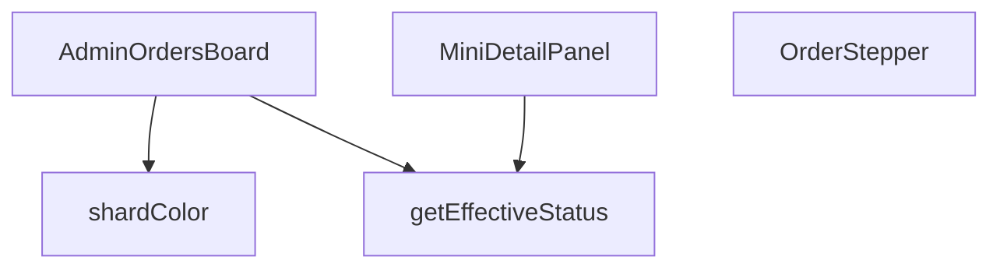

## Genel Bakış
`AdminOrdersBoard` modülü, yönetim panelinde siparişlerin durumlarını görselleştiren ve detaylarını incelemeye yarayan bir arayüz sunar. Sipariş satırlarından etkili durum bilgisini türetir, bu duruma göre renk ve adım göstergesi üretir ve kullanıcı etkileşimlerine (detay paneli açma/kapama, sürükleme) yanıt verir.

## Fonksiyon Grupları
### UI Bileşenleri
Bu grup, JSX/React bileşenleri olarak kullanıcı arayüzünü oluşturur ve diğer yardımcı fonksiyonları kullanarak görsel çıktıyı üretir.  
- **AdminOrdersBoard**, **OrderStepper**, **MiniDetailPanel**

### Yardımcı / İş Mantığı Fonksiyonları
Durum hesaplamaları ve stil/renk belirlemeleri gibi iş mantığını soyutlayarak UI bileşenlerinin daha temiz kalmasını sağlar.  
- **getEffectiveStatus**, **shardColor**  

**İlişkiler:**  
- `AdminOrdersBoard` ana konteyner bileşeni olarak `getEffectiveStatus` ve `shardColor` fonksiyonlarını çağırır; ayrıca `OrderStepper` ve `MiniDetailPanel` bileşenlerini iç içe yerleştirir.  
- `OrderStepper` muhtemelen `getEffectiveStatus` sonucunu alarak adım göstergesini oluşturur.  
- `MiniDetailPanel` doğrudan iş mantığı fonksiyonlarını çağırmaz, sadece kendisine gelen `order` nesnesini gösterir.

---

## AXIOMS – Mimari Varsayımlar
Bu modül için özel aksiyom tanımlanmamıştır.

---

## FONKSİYON DETAYLARI

### getEffectiveStatus
**Ne yapar**: Bir sipariş nesnesinin gerçek durumunu belirler; ödeme iade edilmişse iade durumunu, aksi takdirde siparişin mevcut durumunu döndürür.  
**Nasıl yapar**: `order.payment_status` değerini kontrol eder; eğer `'refunded'` veya `'partial_refunded'` ise bu değeri, değilse `order.status` alanını (veya yoksa `'pending'`) döndürür.  
**Parametreler**:
- `order`: `AdminOrderRow` — Sipariş verisini içeren nesne; `payment_status` ve `status` alanlarını barındırır.  
**Dönüş**: `string` — Hesaplanmış etkili sipariş durumu.

### OrderStepper
**Ne yapar**: Siparişin mevcut adımını görsel bir stepper (adım göstergesi) olarak render eder; iptal veya iade durumunda özel bir uyarı mesajı gösterir.  
**Nasıl yapar**: `status` değerine göre adım indeksini `getStepIndex` fonksiyonuyla bulur, iptal/ iade kontrolü yapar ve ilgili JSX yapısını döndürür. Stepper içinde adımların etiketleri i18n çevirileriyle oluşturulur ve ilerleme çubuğu dinamik olarak genişletilir.  
**Parametreler**:
- `status`: `string` — Siparişin geçerli durumu; stepper’ın hangi adımda olacağını belirler.  
**Dönüş**: JSX element (React bileşeni) — Stepper UI’si veya iptal/ iade uyarı mesajı.

### MiniDetailPanel
**Ne yapar**: Seçili bir siparişin detaylarını, notlarını, e‑posta loglarını ve lojistik bilgilerini gösteren modal bir panel sunar; ayrıca yeni not ekleme işlevi sağlar.  
**Nasıl yapar**: `useEffect` içinde siparişle ilgili not, e‑posta log ve taşıyıcı bilgilerini asenkron olarak Supabase’dan çeker, state’leri günceller. Not ekleme fonksiyonu yetki kontrolü yapar, Supabase’a kaydeder ve UI’yı yeniler. Panel, kapanma işlemi için dış tıklama ve Escape tuşu dinleyicileri içerir.  
**Parametreler**:
- `order`: `AdminOrderRow` — Görüntülenecek sipariş nesnesi.  
- `onClose`: `() => void` — Paneli kapatmak için çağrılan geri dönüş fonksiyonu.  
- `hasWriteAccess`: `boolean` — Kullanıcının not ekleme yetkisi olup olmadığını belirten bayrak.  
**Dönüş**: JSX element (React bileşeni) — Detay paneli UI’si.

### AdminOrdersBoard
**Ne yapar**: Yönetim panelinde siparişleri kanban tarzı bir tablo içinde gösterir; sürükle‑bırak ile durum değişikliği, filtreleme, yenileme ve mobil/masaüstü uyumlu görünüm sağlar.  
**Nasıl yapar**: `useEffect` ile siparişleri Supabase’dan çeker, `COLUMNS` tanımıyla her durum grubu için kolon konfigürasyonu oluşturur. `react-beautiful-dnd` ile sürükle‑bırak mantığını yönetir, `onDragEnd` içinde yetki kontrolü, durum güncellemesi ve hata yönetimi yapılır. UI, kaydırma butonları, mobil sekme geçişleri ve seçili sipariş için `MiniDetailPanel` entegrasyonu içerir.  
**Parametreler**: *(yok)*  
**Dönüş**: JSX element (React bileşeni) — Sipariş panosu UI’si.

### shardColor
**Ne yapar**: Sipariş durumuna göre renkli bir arka plan “shard” (parçacık) oluşturur; sürükleme sırasında görünmez hâle getirir.  
**Nasıl yapar**: `status` değerini küçük harfe çevirir, önceden tanımlı durum‑renk eşleştirmesine göre CSS sınıfını seçer ve ilgili `div` elementini döndürür; `isDragging` true ise `null` döner.  
**Parametreler**:
- `status`: `string` — Siparişin mevcut dur renk seçimini etkiler.  
- `isDragging`: `boolean` — Sürükleme durumu; true ise renkli öğe gösterilmez.  
**Dönüş**: JSX element (`<div>` with color class) veya `null` — Duruma göre renkli arka plan veya boş değer.

---

## INTERFACES

### AdminOrderRow
- `id: string`
- `status: string`
- `user_id?: string | null`
- `total_amount?: number | null`
- `created_at: string`
- `customer_name?: string | null`
- `customer_email?: string | null`
- `customer_phone?: string | null`
- `order_number?: string | null`
- `payment_status?: string | null`

### ColumnDef
- `id: ColumnId`
- `title: string`
- `statuses: string[]`
- `icon: LucideIcon`
- `colorClass: string`
- `bgClass: string`
- `targetStatus: string`

### ColumnDef
- `id: ColumnId`
- `title: string`
- `statuses: string[]`
- `icon: LucideIcon`
- `colorClass: string`
- `bgClass: string`
- `targetStatus: string`

### OrderDetail
- `notes: { id: string; note: string; created_at: string }[]`
- `emailLogs: { subject: string; created_at: string }[]`
- `carrier?: string | null`
- `tracking_number?: string | null`

---

## TYPE ALIASES

### ColumnId
```typescript
type ColumnId = 'col_new' | 'col_prep' | 'col_shipped' | 'col_done' | 'col_cancel' | 'col_refund'
```

---

## AST POINTERS

### [N1_NASIL] AST Pointer: `src/views/admin/AdminOrdersBoard.tsx::getEffectiveStatus`
- **params**: `(order: AdminOrderRow)` — sipariş nesnesi
- **ic_degiskenler**:
  - Yok — doğrudan parametre özellikleri üzerinden okuma yapılır
- **Dönüş**: `string` — geçerli sipariş durumu (payment_status refunded/partial_refunded ise o, değilse order.status veya 'pending')

---

### [N2_NASIL] AST Pointer: `src/views/admin/AdminOrdersBoard.tsx::OrderStepper`
- **params**: `({ status }: { status: string })` — mevcut sipariş durumu
- **ic_degiskenler**:
  - `t` — useI18n() hook'undan çeviri fonksiyonu
  - `steps` — 5 adımlık sırada ilerleme tanımı dizisi (pending → paid → confirmed → shipped → her birinde key ve label içerir)
  - `getStepIndex` — inner fonksiyon, durum string'ini adım indeksine (0-4) eşler; completed/delivered→4, shipped→3, confirmed/processing→2, paid→1, diğer→0
  - `currentIndex` — `getStepIndex(status)` çağrısının sonucu, mevcut adım pozisyonu (0-4 arası tam sayı)
  - `isCancelled` — boolean, durum cancelled/refunded/partial_refunded ise true
- **Dönüş**: JSX element (iptal edilmişse rose renkli uyarı div'i, değilse progress stepper bileşeni)

---

### [N3_NASIL] AST Pointer: `src/views/admin/AdminOrdersBoard.tsx::MiniDetailPanel`
- **params**: `({ order, onClose, hasWriteAccess })`
  - `order: AdminOrderRow` — detayı gösterilecek sipariş nesnesi
  - `onClose: () => void` — paneli kapatma callback'i
  - `hasWriteAccess: boolean` — kullanıcının yazma izni olup olmadığı
- **ic_degiskenler**:
  - `t` — useI18n() hook'undan çeviri fonksiyonu
  - `lang` — useI18n() hook'undan aktif dil kodu
  - `detail` — `useState<OrderDetail | null>(null)` state'i, yüklenen detay verisi (notes, emailLogs, carrier, tracking_number)
  - `loading` — `useState(true)` state'i, veri yüklenme durumu
  - `noteInput` — `useState('')` state'i, kullanıcı not giriş alanı değeri
  - `saving` — `useState(false)` state'i, not kaydetme işlemi devam ediyor mu
  - `mounted` — useEffect içindeki flag, bileşen unmount olduktan sonra state güncellemesini engeller
  - `load` — async inner fonksiyon, useEffect içinde tanımlı; ensureSessionFresh() çağırıp Promise.all ile üç paralel supabase sorgusu çalıştırır
  - `notesRes` — `supabase.from('order_notes').select(...)` sonucu, sipariş notları (id, note, created_at)
  - `logsRes` — `supabase.from('shipping_email_events').select(...)` sonucu, kargo e-posta event logları (subject, created_at)
  - `orderRes` — `supabase.from('venthub_orders').select('carrier,tracking_number')` sonucu, kargo taşıyıcı ve takip numarası
  - `addNote` — async fonksiyon, not ekleme iş mantığı; hasWriteAccess kontrolü, boş input kontrolü, supabase insert, state güncelleme, toast bildirimleri
  - `data` — `supabase.from('order_notes').insert(...).select(...).single()` sonucu, eklenen yeni not nesnesi
  - `error` — `supabase.from('order_notes').insert(...)` hata sonucu, hata varsa throw edilir
- **Dönüş**: yok (JSX modal panel bileşeni render eder)

---

### [N4_NASIL] AST Pointer: `src/views/admin/AdminOrdersBoard.tsx::AdminOrdersBoard`
- **params**: yok (parametresiz React bileşeni)
- **ic_degiskenler**:
  - `pathname` — `usePathname()` hook'undan mevcut URL yolu, sayfa yükleme tetikleyicisi olarak kullanılır
  - `t` — `useI18n()` hook'undan çeviri fonksiyonu
  - `lang` — `useI18n()` hook'undan aktif dil kodu
  - `canWrite` — `useRole()` hook'undan rol tabanlı yazma izni kontrol fonksiyonu
  - `hasWriteAccess` — `canWrite('orders')` çağrısı sonucu boolean, kullanıcının siparişleri düzenleme izni
  - `orders` — `useState<AdminOrderRow[]>([])` state'i, tüm siparişlerin listesi
  - `loading` — `useState(true)` state'i, veri yüklenme durumu
  - `selectedOrder` — `useState<AdminOrderRow | null>(null)` state'i, detay paneli için seçili sipariş
  - `expandedCol` — `useState<ColumnId | null>('col_new')` state'i, mobilde genişletilmiş/aktif kanban sütunu
  - `scrollRef` — `useRef<HTMLDivElement>(null)`, yatay kaydırma konteyneri DOM referansı
  - `COLUMNS` — `React.useMemo` ile memoize edilmiş `ColumnDef[]` dizisi; 6 sütun tanımı (col_new, col_prep, col_shipped, col_done, col_cancel, col_refund), her birinde id, title, statuses, icon, colorClass, bgClass, targetStatus; `t` bağımlılığı
  - `fetchOrders` — `useCallback` ile memoize edilmiş async fonksiyon; ensureSessionFresh() çağırıp `supabase.from('view_admin_orders').select(...)` ile siparişleri yükler, max 200 kayıt, hata durumunda toast gösterir
  - `scrollBoard` — `(direction: 'left' | 'right')` parametreli fonksiyon, `scrollRef.current.scrollBy()` ile 340px yatay kaydırma yapar
  - `getOrdersByCol` — `(colId: ColumnId)` parametreli fonksiyon, sütun tanımını `COLUMNS.find()` ile bulup `orders.filter()` ile ilgili sütununstatuses'ine uyan siparişleri döndürür
  - `onDragEnd` — `(result: DropResult)` parametreli async fonksiyon, sürükleme-bırakma işlemini yönetir; izin kontrolü, hedef/hedef yoklama, `destCol` (hedef sütun tanımı `COLUMNS.find(c => c.id === destination.droppableId)`), `targetOrder` (sürüklünen sipariş `orders.find(o => o.id === draggableId)`), `targetStatus` (hedef durum `destCol.targetStatus`), `effectiveCurrent` (mevcut etkin durum), `oldStatus` (değişiklik öncesi durum), optimistic state güncelleme (`setOrders`), `res` (`updateOrderStatus()` API çağrısı sonucu)
  - `destCol` — `onDragEnd` içinde, `COLUMNS.find(c => c.id === destination.droppableId)` ile bulunan hedef sütun tanımı
  - `targetOrder` — `onDragEnd` içinde, `orders.find(o => o.id === draggableId)` ile bulunan sürüklünen sipariş nesnesi
  - `targetStatus` — `onDragEnd` içinde, `destCol.targetStatus` değerinden gelen hedef durum string'i
  - `effectiveCurrent` — `onDragEnd` içinde, `getEffectiveStatus(targetOrder)` çağrısı sonucu
  - `oldStatus` — `onDragEnd` içinde, `targetOrder.status` değerinden gelen değişiklik öncesi durum
  - `res` — `onDragEnd` içinde, `updateOrderStatus({...})` API çağrısı sonucu; `res.ok` ile başarı kontrolü
- **Dönüş**: yok (React bileşeni JSX render eder; loading durumunda AdminSkeleton, normalde DragDropContext ile kanban board + MiniDetailPanel render eder)

---

### [N5_NASIL] AST Pointer: `src/views/admin/AdminOrdersBoard.tsx::shardColor`
- **params**: `(status: string, isDragging: boolean)`
  - `status` — sipariş durumu string'i
  - `isDragging` — sürükleme sırasında olup olmadığı flag'i
- **ic_degiskenler**:
  - `base` — `status.toLowerCase()` ile küçültülmüş durum string'i
  - `color` — Tailwind arka plan renk class'ı; duruma göre belirlenir (pending→amber, paid/confirmed/processing→cyan, shipped→blue, delivered/completed→emerald, cancelled→rose, refunded/partial_refunded→orange, diğer→slate)
- **Dönüş**: JSX element veya `null` (isDragging true ise null, değilse durum rengine göre absolute pozisyonlu blur efektli dekoratif div)

---


## MERMAID CALL GRAPH


## NODE ID STANDARD

  file: src\views\admin\AdminOrdersBoard.tsx
  function: src\views\admin\AdminOrdersBoard.tsx::getEffectiveStatus
  function: src\views\admin\AdminOrdersBoard.tsx::OrderStepper
  function: src\views\admin\AdminOrdersBoard.tsx::MiniDetailPanel
  function: src\views\admin\AdminOrdersBoard.tsx::AdminOrdersBoard
  function: src\views\admin\AdminOrdersBoard.tsx::shardColor

---

## DISA AKTARILANLAR (EXPORTS)
  export: AdminOrdersBoard
  export: MiniDetailPanel
  export: OrderStepper
  export: getEffectiveStatus
  export: shardColor

---

## STİL TOKENLERİ

### Arbitrary Değerler (token'a geçirilmemiş)
Yok — tüm stiller token'a geçirilmiş. ✅

### Kullanılan Token'lar (zaten token'a geçirilmiş)
- `rounded-hvac-2xl`, `rounded-hvac-lg`, `rounded-hvac-xl`, `shadow-glow-md`, `shadow-glow-sm`, `tracking-hvac-normal`, `tracking-hvac-relaxed`, `tracking-hvac-tight`

### Tailwind Sınıf Özeti
- **Renkler:** `bg-amber-400/5`, `bg-blue-500/10`, `bg-blue-500/20`, `bg-clip-text`, `bg-cyan-400`, `bg-cyan-500`, `bg-cyan-500/5`, `bg-gradient-to-r`, `bg-rose-500/10`, `bg-surface-darker/40`, `bg-white`, `bg-white/10`, `bg-white/2`, `bg-white/3`, `bg-white/5`
- **Layout:** `!h-42px`, `-right-4`, `-top-4`, `-z-10`, `absolute`, `backdrop-blur-md`, `backdrop-blur-xl`, `bg-clip-text`, `block`, `custom-scrollbar`, `fixed`, `flex`, `flex-1`, `flex-col`, `from-white`
- **Varyant/Responsive:** `:`, `disabled:`, `group-hover:`, `hover:`, `md:` önekleri
- **Yardımcı Sınıflar:** `!px-5`, `${!isExpanded`, `${adminButtonPrimaryClass`, `${col.bgClass`, `${col.colorClass`, `${color`, `${isActive`, `${isCurrent`, `${isExpanded`, `${isPast`, `${snapshot.isDragging`, `${snapshot.isDraggingOver`, `-mx-1`, `-translate-y-1/2`, `:`