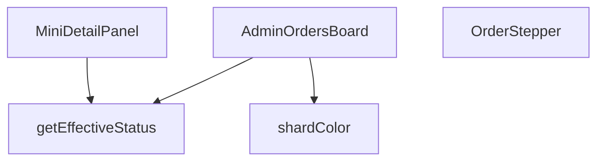

## Genel Bakış
Bu modül, yönetim panelinde siparişlerin durumlarını kart tabanlı, interaktif bir panoda görselleştirmek için kullanılan bir React bileşenidir. Her sipariş için hesaplanan etkili duruma göre renklendirme, adım adım durum gösterimi ve detaylı bilgi paneli sunarak sipariş yönetimi akışını destekler.

## Fonksiyon Grupları
### Ana ve Alt Bileşenler
Kullanıcı arayüzünü oluşturan React bileşenleridir. Ana sipariş panosunu, her bir sipariş kartındaki durum ilerlemesini ve sipariş detaylarının açılabilir mini panelini yönetir.
- AdminOrdersBoard, OrderStepper, MiniDetailPanel

### Yardımcı İş Mantığı Fonksiyonları
UI bileşenlerinden soyutlanmış, hesaplama ve stil belirleme işlerini yapan saf fonksiyonlardır. Siparişin nihai durumunu belirler ve duruma göre renk değerlerini üretir.
- getEffectiveStatus, shardColor

---

## AXIOMS – Mimari Varsayımlar

Bu modül için, fonksiyon gövdelerindeki imza ve bağımlılıklara dayanan temel mimari varsayımlar şunlardır:

[Aksiyom 1]: Eğer `getEffectiveStatus` fonksiyonuna geçerli bir `AdminOrderRow` nesnesi (`order`) verilmezse, fonksiyon beklenmedik bir hata fırlatabilir veya tanımsız bir değer döndürebilir; bu durumda `shardColor` ve `OrderStepper` bileşenleri yanlış durum bilgisiyle çalışır.

[Aksiyom 2]: Eğer `OrderStepper` bileşenine geçerli bir `status` stringi verilmezse (null, undefined veya boş string), adım gösterimi doğru render edilmeyebilir veya hata oluşabilir.

[Aksiyom 3]: Eğer `MiniDetailPanel` bileşenine geçerli bir `order` nesnesi, `onClose` fonksiyonu veya `hasWriteAccess` boolean değeri verilmezse, panel düzgün çalışmayabilir; örneğin, kapatma butonu çalışmaz veya yazma izni gerektiren kontroller hatalı davranır.

[Aksiyom 4]: Eğer `shardColor` fonksiyonuna geçerli bir `status` stringi veya `isDragging` boolean değeri verilmezse, uygun renk değeri döndüremeyebilir; bu durumda UI'da renksiz veya hatalı bir kart görüntüsü oluşabilir.

[Aksiyom 5]: Eğer `AdminOrdersBoard` ana bileşeni, alt bileşenlere (`OrderStepper`, `MiniDetailPanel`) doğru verileri (örneğin, `status`, `order`, `onClose`, `hasWriteAccess`) iletmezse, tüm board düzgün çalışmayabilir.

[Aksiyom 6]: Eğer `getEffectiveStatus` fonksiyonu, `AdminOrderRow` nesnesinin iç yapısına (örneğin, `status` alanına) erişemezse, etkili durum hesaplanamaz; bu durumda `shardColor` ile `OrderStepper` yanlış durum bilgisiyle çalışır ve UI tutarsız hale gelir.

---

## FONKSİYON DETAYLARI

### getEffectiveStatus
**Ne yapar**: Bir sipariş nesnesinin gerçek durumunu belirler; ödeme iade edilmişse iade durumunu, aksi takdirde siparişin mevcut durumunu döndürür.  
**Nasıl yapar**: `order.payment_status` değerini kontrol eder; eğer `'refunded'` veya `'partial_refunded'` ise bu değeri, değilse `order.status` alanını (veya yoksa `'pending'`) döndürür.  
**Parametreler**:
- `order`: `AdminOrderRow` — Sipariş verisini içeren nesne; `payment_status` ve `status` alanlarını barındırır.  
**Dönüş**: `string` — Hesaplanmış etkili sipariş durumu.

### OrderStepper
**Ne yapar**: Siparişin mevcut adımını görsel bir stepper (adım göstergesi) olarak render eder; iptal veya iade durumunda özel bir uyarı mesajı gösterir.  
**Nasıl yapar**: `status` değerine göre adım indeksini `getStepIndex` fonksiyonuyla bulur, iptal/ iade kontrolü yapar ve ilgili JSX yapısını döndürür. Stepper içinde adımların etiketleri i18n çevirileriyle oluşturulur ve ilerleme çubuğu dinamik olarak genişletilir.  
**Parametreler**:
- `status`: `string` — Siparişin geçerli durumu; stepper’ın hangi adımda olacağını belirler.  
**Dönüş**: JSX element (React bileşeni) — Stepper UI’si veya iptal/ iade uyarı mesajı.

### MiniDetailPanel
**Ne yapar**: Seçili bir siparişin detaylarını, notlarını, e‑posta loglarını ve lojistik bilgilerini gösteren modal bir panel sunar; ayrıca yeni not ekleme işlevi sağlar.  
**Nasıl yapar**: `useEffect` içinde siparişle ilgili not, e‑posta log ve taşıyıcı bilgilerini asenkron olarak Supabase’dan çeker, state’leri günceller. Not ekleme fonksiyonu yetki kontrolü yapar, Supabase’a kaydeder ve UI’yı yeniler. Panel, kapanma işlemi için dış tıklama ve Escape tuşu dinleyicileri içerir.  
**Parametreler**:
- `order`: `AdminOrderRow` — Görüntülenecek sipariş nesnesi.  
- `onClose`: `() => void` — Paneli kapatmak için çağrılan geri dönüş fonksiyonu.  
- `hasWriteAccess`: `boolean` — Kullanıcının not ekleme yetkisi olup olmadığını belirten bayrak.  
**Dönüş**: JSX element (React bileşeni) — Detay paneli UI’si.

### AdminOrdersBoard
**Ne yapar**: Yönetim panelinde siparişleri kanban tarzı bir tablo içinde gösterir; sürükle‑bırak ile durum değişikliği, filtreleme, yenileme ve mobil/masaüstü uyumlu görünüm sağlar.  
**Nasıl yapar**: `useEffect` ile siparişleri Supabase’dan çeker, `COLUMNS` tanımıyla her durum grubu için kolon konfigürasyonu oluşturur. `react-beautiful-dnd` ile sürükle‑bırak mantığını yönetir, `onDragEnd` içinde yetki kontrolü, durum güncellemesi ve hata yönetimi yapılır. UI, kaydırma butonları, mobil sekme geçişleri ve seçili sipariş için `MiniDetailPanel` entegrasyonu içerir.  
**Parametreler**: *(yok)*  
**Dönüş**: JSX element (React bileşeni) — Sipariş panosu UI’si.

### shardColor
**Ne yapar**: Sipariş durumuna göre renkli bir arka plan “shard” (parçacık) oluşturur; sürükleme sırasında görünmez hâle getirir.  
**Nasıl yapar**: `status` değerini küçük harfe çevirir, önceden tanımlı durum‑renk eşleştirmesine göre CSS sınıfını seçer ve ilgili `div` elementini döndürür; `isDragging` true ise `null` döner.  
**Parametreler**:
- `status`: `string` — Siparişin mevcut dur renk seçimini etkiler.  
- `isDragging`: `boolean` — Sürükleme durumu; true ise renkli öğe gösterilmez.  
**Dönüş**: JSX element (`<div>` with color class) veya `null` — Duruma göre renkli arka plan veya boş değer.

---

## INTERFACES

### AdminOrderRow
- `id: string`
- `status: string`
- `user_id?: string | null`
- `total_amount?: number | null`
- `created_at: string`
- `customer_name?: string | null`
- `customer_email?: string | null`
- `customer_phone?: string | null`
- `order_number?: string | null`
- `payment_status?: string | null`

### ColumnDef
- `id: ColumnId`
- `title: string`
- `statuses: string[]`
- `icon: LucideIcon`
- `colorClass: string`
- `bgClass: string`
- `targetStatus: string`

### ColumnDef
- `id: ColumnId`
- `title: string`
- `statuses: string[]`
- `icon: LucideIcon`
- `colorClass: string`
- `bgClass: string`
- `targetStatus: string`

### OrderDetail
- `notes: { id: string; note: string; created_at: string }[]`
- `emailLogs: { subject: string; created_at: string }[]`
- `carrier?: string | null`
- `tracking_number?: string | null`

---

## TYPE ALIASES

### ColumnId
```typescript
type ColumnId = 'col_new' | 'col_prep' | 'col_shipped' | 'col_done' | 'col_cancel' | 'col_refund'
```

---

## AST POINTERS

### [N1_NASIL] AST Pointer: src/views/admin/AdminOrdersBoard.tsx::getEffectiveStatus
- **params**: `(order: AdminOrderRow)` — sipariş nesnesi
- **ic_degiskenler**:
  - Değişken yok, sadece parametre üzerinde `order.payment_status` ve `order.status` erişimi yapılır
- **Dönüş**: `string` — effective durum stringi (payment_status refunded/partial_refunded ise onu, değilse order.status veya 'pending' döner)

---


## MERMAID CALL GRAPH


## NODE ID STANDARD

  file: src\views\admin\AdminOrdersBoard.tsx
  function: src\views\admin\AdminOrdersBoard.tsx::getEffectiveStatus
  function: src\views\admin\AdminOrdersBoard.tsx::OrderStepper
  function: src\views\admin\AdminOrdersBoard.tsx::MiniDetailPanel
  function: src\views\admin\AdminOrdersBoard.tsx::AdminOrdersBoard
  function: src\views\admin\AdminOrdersBoard.tsx::shardColor

---

## DISA AKTARILANLAR (EXPORTS)
  export: AdminOrdersBoard
  export: MiniDetailPanel
  export: OrderStepper
  export: getEffectiveStatus
  export: shardColor

---

## STİL TOKENLERİ

### Arbitrary Değerler (token'a geçirilmemiş)
Yok — tüm stiller token'a geçirilmiş. ✅

### Kullanılan Token'lar (zaten token'a geçirilmiş)
- `rounded-hvac-2xl`, `rounded-hvac-lg`, `rounded-hvac-xl`, `shadow-glow-md`, `shadow-glow-sm`, `tracking-hvac-normal`, `tracking-hvac-relaxed`, `tracking-hvac-tight`

### Tailwind Sınıf Özeti
- **Renkler:** `bg-amber-400/5`, `bg-blue-500/10`, `bg-blue-500/20`, `bg-clip-text`, `bg-cyan-400`, `bg-cyan-500`, `bg-cyan-500/5`, `bg-gradient-to-r`, `bg-rose-500/10`, `bg-surface-darker/40`, `bg-white`, `bg-white/10`, `bg-white/2`, `bg-white/3`, `bg-white/5`
- **Layout:** `!h-42px`, `-right-4`, `-top-4`, `-z-10`, `absolute`, `backdrop-blur-md`, `backdrop-blur-xl`, `bg-clip-text`, `block`, `custom-scrollbar`, `fixed`, `flex`, `flex-1`, `flex-col`, `from-white`
- **Varyant/Responsive:** `:`, `disabled:`, `group-hover:`, `hover:`, `md:` önekleri
- **Yardımcı Sınıflar:** `!px-5`, `${!isExpanded`, `${adminButtonPrimaryClass`, `${col.bgClass`, `${col.colorClass`, `${color`, `${isActive`, `${isCurrent`, `${isExpanded`, `${isPast`, `${snapshot.isDragging`, `${snapshot.isDraggingOver`, `-mx-1`, `-translate-y-1/2`, `:`