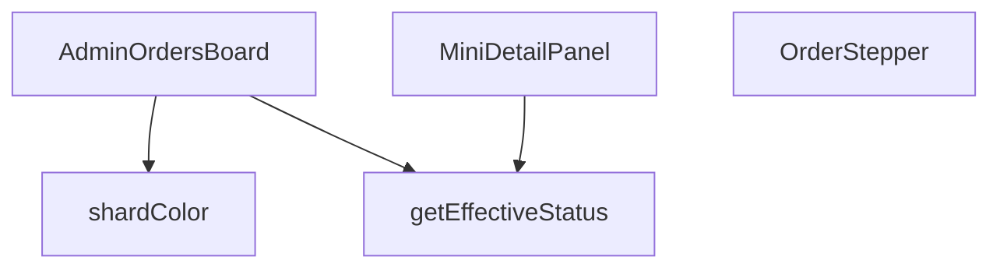

## Genel Bakış
`AdminOrdersBoard` modülü, yönetim panelinde siparişlerin durumlarını görselleştiren ve detaylarını incelemeye yarayan bir arayüz sunar. Sipariş satırlarından etkili durum bilgisini türetir, bu duruma göre renk ve adım göstergesi üretir ve kullanıcı etkileşimlerine (detay paneli açma/kapama, sürükleme) yanıt verir.

## Fonksiyon Grupları
### UI Bileşenleri
Bu grup, JSX/React bileşenleri olarak kullanıcı arayüzünü oluşturur ve diğer yardımcı fonksiyonları kullanarak görsel çıktıyı üretir.  
- **AdminOrdersBoard**, **OrderStepper**, **MiniDetailPanel**

### Yardımcı / İş Mantığı Fonksiyonları
Durum hesaplamaları ve stil/renk belirlemeleri gibi iş mantığını soyutlayarak UI bileşenlerinin daha temiz kalmasını sağlar.  
- **getEffectiveStatus**, **shardColor**  

**İlişkiler:**  
- `AdminOrdersBoard` ana konteyner bileşeni olarak `getEffectiveStatus` ve `shardColor` fonksiyonlarını çağırır; ayrıca `OrderStepper` ve `MiniDetailPanel` bileşenlerini iç içe yerleştirir.  
- `OrderStepper` muhtemelen `getEffectiveStatus` sonucunu alarak adım göstergesini oluşturur.  
- `MiniDetailPanel` doğrudan iş mantığı fonksiyonlarını çağırmaz, sadece kendisine gelen `order` nesnesini gösterir.

---

## AXIOMS – Mimari Varsayımlar
Bu modül için özel aksiyom tanımlanmamıştır.

---

## FONKSİYON DETAYLARI

### getEffectiveStatus
**Ne yapar**: Bir sipariş nesnesinin gerçek durumunu belirler; ödeme iade edilmişse iade durumunu, aksi takdirde siparişin mevcut durumunu döndürür.  
**Nasıl yapar**: `order.payment_status` değerini kontrol eder; eğer `'refunded'` veya `'partial_refunded'` ise bu değeri, değilse `order.status` alanını (veya yoksa `'pending'`) döndürür.  
**Parametreler**:
- `order`: `AdminOrderRow` — Sipariş verisini içeren nesne; `payment_status` ve `status` alanlarını barındırır.  
**Dönüş**: `string` — Hesaplanmış etkili sipariş durumu.

### OrderStepper
**Ne yapar**: Siparişin mevcut adımını görsel bir stepper (adım göstergesi) olarak render eder; iptal veya iade durumunda özel bir uyarı mesajı gösterir.  
**Nasıl yapar**: `status` değerine göre adım indeksini `getStepIndex` fonksiyonuyla bulur, iptal/ iade kontrolü yapar ve ilgili JSX yapısını döndürür. Stepper içinde adımların etiketleri i18n çevirileriyle oluşturulur ve ilerleme çubuğu dinamik olarak genişletilir.  
**Parametreler**:
- `status`: `string` — Siparişin geçerli durumu; stepper’ın hangi adımda olacağını belirler.  
**Dönüş**: JSX element (React bileşeni) — Stepper UI’si veya iptal/ iade uyarı mesajı.

### MiniDetailPanel
**Ne yapar**: Seçili bir siparişin detaylarını, notlarını, e‑posta loglarını ve lojistik bilgilerini gösteren modal bir panel sunar; ayrıca yeni not ekleme işlevi sağlar.  
**Nasıl yapar**: `useEffect` içinde siparişle ilgili not, e‑posta log ve taşıyıcı bilgilerini asenkron olarak Supabase’dan çeker, state’leri günceller. Not ekleme fonksiyonu yetki kontrolü yapar, Supabase’a kaydeder ve UI’yı yeniler. Panel, kapanma işlemi için dış tıklama ve Escape tuşu dinleyicileri içerir.  
**Parametreler**:
- `order`: `AdminOrderRow` — Görüntülenecek sipariş nesnesi.  
- `onClose`: `() => void` — Paneli kapatmak için çağrılan geri dönüş fonksiyonu.  
- `hasWriteAccess`: `boolean` — Kullanıcının not ekleme yetkisi olup olmadığını belirten bayrak.  
**Dönüş**: JSX element (React bileşeni) — Detay paneli UI’si.

### AdminOrdersBoard
**Ne yapar**: Yönetim panelinde siparişleri kanban tarzı bir tablo içinde gösterir; sürükle‑bırak ile durum değişikliği, filtreleme, yenileme ve mobil/masaüstü uyumlu görünüm sağlar.  
**Nasıl yapar**: `useEffect` ile siparişleri Supabase’dan çeker, `COLUMNS` tanımıyla her durum grubu için kolon konfigürasyonu oluşturur. `react-beautiful-dnd` ile sürükle‑bırak mantığını yönetir, `onDragEnd` içinde yetki kontrolü, durum güncellemesi ve hata yönetimi yapılır. UI, kaydırma butonları, mobil sekme geçişleri ve seçili sipariş için `MiniDetailPanel` entegrasyonu içerir.  
**Parametreler**: *(yok)*  
**Dönüş**: JSX element (React bileşeni) — Sipariş panosu UI’si.

### shardColor
**Ne yapar**: Sipariş durumuna göre renkli bir arka plan “shard” (parçacık) oluşturur; sürükleme sırasında görünmez hâle getirir.  
**Nasıl yapar**: `status` değerini küçük harfe çevirir, önceden tanımlı durum‑renk eşleştirmesine göre CSS sınıfını seçer ve ilgili `div` elementini döndürür; `isDragging` true ise `null` döner.  
**Parametreler**:
- `status`: `string` — Siparişin mevcut dur renk seçimini etkiler.  
- `isDragging`: `boolean` — Sürükleme durumu; true ise renkli öğe gösterilmez.  
**Dönüş**: JSX element (`<div>` with color class) veya `null` — Duruma göre renkli arka plan veya boş değer.

---

## INTERFACES

### AdminOrderRow
- `id: string`
- `status: string`
- `user_id?: string | null`
- `total_amount?: number | null`
- `created_at: string`
- `customer_name?: string | null`
- `customer_email?: string | null`
- `customer_phone?: string | null`
- `order_number?: string | null`
- `payment_status?: string | null`

### ColumnDef
- `id: ColumnId`
- `title: string`
- `statuses: string[]`
- `icon: LucideIcon`
- `colorClass: string`
- `bgClass: string`
- `targetStatus: string`

### ColumnDef
- `id: ColumnId`
- `title: string`
- `statuses: string[]`
- `icon: LucideIcon`
- `colorClass: string`
- `bgClass: string`
- `targetStatus: string`

### OrderDetail
- `notes: { id: string; note: string; created_at: string }[]`
- `emailLogs: { subject: string; created_at: string }[]`
- `carrier?: string | null`
- `tracking_number?: string | null`

---

## TYPE ALIASES

### ColumnId
```typescript
type ColumnId = 'col_new' | 'col_prep' | 'col_shipped' | 'col_done' | 'col_cancel' | 'col_refund'
```

---

## AST POINTERS

### [N1_NASIL] AST Pointer: C:\Users\alize\venthub-hvac\src\views\admin\AdminOrdersBoard.tsx::getEffectiveStatus
- **params**: (order: AdminOrderRow)
- **ic_degiskenler**: *none* (function uses only its parameter)
- **Dönüş**: `string` – effective status of the order (`payment_status` when refunded, otherwise `status` or `'pending'`)

### [N2_NASIL] AST Pointer: C:\Users\alize\venthub-hvac\src\views\admin\AdminOrdersBoard.tsx::OrderStepper
- **params**: (status: string)
- **ic_degiskenler**:
  - `t` — translation function obtained from `useI18n()`.
  - `steps` — array of step objects `{ key, label }` where `label` is a translated string for each order status.
  - `getStepIndex` — helper that maps a status string to a numeric step index (0‑4).
  - `currentIndex` — numeric index of the current step, derived from `getStepIndex(status)`.
  - `isCancelled` — boolean flag true when the order is cancelled or refunded.
- **Dönüş**: `JSX.Element` – renders either a cancelled‑refund banner or the visual stepper UI.

### [N3_NASIL] AST Pointer: C:\Users\alize\venthub-hvac\src\views\admin\AdminOrdersBoard.tsx::MiniDetailPanel
- **params**: (order: AdminOrderRow, onClose: () => void, hasWriteAccess: boolean)
- **ic_degiskenler**:
  - `t`, `lang` — translation function and current language from `useI18n()`.
  - `detail` — state holding fetched order details (`OrderDetail | null`).
  - `setDetail` — setter for `detail`.
  - `loading` — boolean state indicating whether detail data is being fetched.
  - `setLoading` — setter for `loading`.
  - `noteInput` — string state bound to the note‑input field.
  - `setNoteInput` — setter for `noteInput`.
  - `saving` — boolean state indicating whether a note is being saved.
  - `setSaving` — setter for `saving`.
  - `mounted` — local flag used inside `useEffect` to avoid state updates after component unmount.
  - `load` — async function that:
    - Calls `ensureSessionFresh()`.
    - Executes three Supabase queries (`order_notes`, `shipping_email_events`, `venthub_orders`) in parallel.
    - Populates `detail` with notes, email logs, carrier and tracking number when the component is still mounted.
  - `addNote` — async function that:
    - Checks write permission; shows error toast if missing.
    - Validates non‑empty `noteInput`.
    - Sets `saving` flag, inserts a new note via Supabase, updates `detail.notes` with the newly created note, clears the input, and shows success/error toasts.
- **Dönüş**: `JSX.Element` – modal panel displaying order details, notes, logs and note‑creation UI.

### [N4_NASIL] AST Pointer: C:\Users\alize\venthub-hvac\src\views\admin\AdminOrdersBoard.tsx::AdminOrdersBoard
- **params**: (none)
- **ic_degiskenler**:
  - `pathname` — current route path from `usePathname()`.
  - `t`, `lang` — translation function and language from `useI18n()`.
  - `canWrite` — permission‑checking function from `useRole()`.
  - `hasWriteAccess` — boolean indicating whether the user may modify orders.
  - `orders` — state array of `AdminOrderRow` objects.
  - `setOrders` — setter for `orders`.
  - `loading` — boolean state for the board’s data‑loading status.
  - `setLoading` — setter for `loading`.
  - `selectedOrder` — state holding the order currently shown in the detail panel.
  - `setSelectedOrder` — setter for `selectedOrder`.
  - `expandedCol` — state tracking which column is expanded on mobile view (`ColumnId | null`).
  - `setExpandedCol` — setter for `expandedCol`.
  - `scrollRef` — ref to the board container element for programmatic scrolling.
  - `COLUMNS` — memoized array of column definitions (`id`, `title`, `statuses`, `icon`, `colorClass`, `bgClass`, `targetStatus`), recomputed when `t` changes.
  - `fetchOrders` — callback that:
    - Sets `loading` true.
    - Calls `ensureSessionFresh()`.
    - Retrieves up to 200 admin orders from Supabase view `view_admin_orders`.
    - Stores the result in `orders` or shows an error toast.
    - Resets `loading`.
  - `scrollBoard` — function that scrolls the board left or right by a fixed pixel amount (340 px) with smooth behavior.
  - `getOrdersByCol` — helper that returns orders belonging to a given column based on the column’s `statuses` and `getEffectiveStatus`.
  - `onDragEnd` — async handler for drag‑and‑drop:
    - Verifies write permission.
    - Ignores invalid or no‑op drops.
    - Determines destination column and target status.
    - Optimistically updates `orders` state (including special handling for refunds).
    - Calls `updateOrderStatus` service with audit information.
    - Shows success toast on OK or rolls back state, shows error toast and refetches orders on failure.
- **Dönüş**: `JSX.Element` – the full admin orders board UI, including column headers, draggable order cards, scroll controls, refresh button, and the `MiniDetailPanel` when an order is selected.

### [N5_NASIL] AST Pointer: C:\Users\alize\venthub-hvac\src\views\admin\AdminOrdersBoard.tsx::shardColor
- **params**: (status: string, isDragging: boolean)
- **ic_degiskenler**:
  - `base` — lower‑cased version of `status` used for comparison.
  - `color` — CSS background‑color class string that is chosen according to `base` (e.g., amber for pending, cyan for paid/confirmed, blue for shipped, emerald for delivered/completed, rose for cancelled, orange for refunded/partial_refunded, default slate).
- **Dönüş**: `JSX.Element | null` – a blurred colored circle positioned behind an order card when it is not being dragged; returns `null` while dragging.

---


## MERMAID CALL GRAPH


## NODE ID STANDARD

  file: src\views\admin\AdminOrdersBoard.tsx
  function: src\views\admin\AdminOrdersBoard.tsx::getEffectiveStatus
  function: src\views\admin\AdminOrdersBoard.tsx::OrderStepper
  function: src\views\admin\AdminOrdersBoard.tsx::MiniDetailPanel
  function: src\views\admin\AdminOrdersBoard.tsx::AdminOrdersBoard
  function: src\views\admin\AdminOrdersBoard.tsx::shardColor

---

## DISA AKTARILANLAR (EXPORTS)
  export: AdminOrdersBoard
  export: MiniDetailPanel
  export: OrderStepper
  export: getEffectiveStatus
  export: shardColor

---

## STİL TOKENLERİ

### Arbitrary Değerler (token'a geçirilmemiş)
Yok — tüm stiller token'a geçirilmiş. ✅

### Kullanılan Token'lar (zaten token'a geçirilmiş)
- `rounded-hvac-2xl`, `rounded-hvac-lg`, `rounded-hvac-xl`, `shadow-glow-md`, `shadow-glow-sm`, `tracking-hvac-normal`, `tracking-hvac-relaxed`, `tracking-hvac-tight`

### Tailwind Sınıf Özeti
- **Renkler:** `bg-amber-400/5`, `bg-blue-500/10`, `bg-blue-500/20`, `bg-clip-text`, `bg-cyan-400`, `bg-cyan-500`, `bg-cyan-500/5`, `bg-gradient-to-r`, `bg-rose-500/10`, `bg-surface-darker/40`, `bg-white`, `bg-white/10`, `bg-white/2`, `bg-white/3`, `bg-white/5`
- **Layout:** `!h-42px`, `-right-4`, `-top-4`, `-z-10`, `absolute`, `backdrop-blur-md`, `backdrop-blur-xl`, `bg-clip-text`, `block`, `custom-scrollbar`, `fixed`, `flex`, `flex-1`, `flex-col`, `from-white`
- **Responsive:** `md:` prefix kullanımları