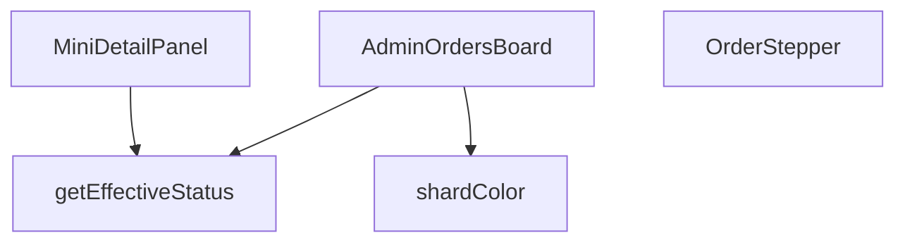

## Genel Bakış
Bu modül, yönetim panelinde siparişlerin durumlarını kart tabanlı ve interaktif bir panoda görselleştiren bir React bileşenidir. Her sipariş için hesaplanan etkili duruma göre renklendirme, adım adım durum gösterimi ve detaylı bilgi paneli sunarak sipariş yönetimi akışını destekler. Modül, ana panoyu oluşturan bileşenler ve bunların kullandığı yardımcı hesaplama fonksiyonlarından oluşur.

## Fonksiyon Grupları
### Ana ve Alt Bileşenler
Kullanıcı arayüzünü oluşturan React bileşenleridir. Ana sipariş panosunu, her bir sipariş kartındaki durum ilerlemesini ve sipariş detaylarının açılabilir mini panelini yönetir.
- AdminOrdersBoard, OrderStepper, MiniDetailPanel

### Yardımcı İş Mantığı Fonksiyonları
UI bileşenlerinden soyutlanmış, hesaplama ve stil belirleme işlerini yapan saf fonksiyonlardır. Siparişin nihai durumunu belirler ve duruma göre renk değerlerini üretir.
- getEffectiveStatus, shardColor

---

## AXIOMS – Mimari Varsayımlar

Bu modül, sipariş durumlarını görselleştiren bir React bileşenidir ve `AdminOrderRow` tipinde veri gerektirir.

[Aksiyom 1]: Eğer `AdminOrderRow` tipi tanımlı değilse, `getEffectiveStatus` ve `MiniDetailPanel` fonksiyonları derleme hatası verir.

[Aksiyom 2]: Eğer `getEffectiveStatus` fonksiyonuna geçerli bir `order` nesnesi sağlanmazsa, etkili durum hesaplanamaz ve `OrderStepper` ile `shardColor` bileşenleri geçerli bir `status` değeri alamaz.

[Aksiyom 3]: Eğer `OrderStepper` bileşenine `status` prop'u sağlanmazsa, adım gösterimi render edilemez.

[Aksiyom 4]: Eğer `MiniDetailPanel` bileşenine `order`, `onClose` veya `hasWriteAccess` prop'larından herhangi biri sağlanmazsa, bileşen düzgün çalışamaz.

[Aksiyom 5]: Eğer `shardColor` fonksiyonuna `status` veya `isDragging` parametreleri sağlanmazsa, kart rengi belirlenemez.

[Aksiyom 6]: Eğer `hasWriteAccess` değeri `false` ise, `MiniDetailPanel` içinde yazma işlemi gerektiren kontroller engellenir.

---

## FONKSİYON DETAYLARI

### getEffectiveStatus
**Ne yapar**: Bir sipariş nesnesinin gerçek durumunu belirler; ödeme iade edilmişse iade durumunu, aksi takdirde siparişin mevcut durumunu döndürür.  
**Nasıl yapar**: `order.payment_status` değerini kontrol eder; eğer `'refunded'` veya `'partial_refunded'` ise bu değeri, değilse `order.status` alanını (veya yoksa `'pending'`) döndürür.  
**Parametreler**:
- `order`: `AdminOrderRow` — Sipariş verisini içeren nesne; `payment_status` ve `status` alanlarını barındırır.  
**Dönüş**: `string` — Hesaplanmış etkili sipariş durumu.

### OrderStepper
**Ne yapar**: Siparişin durumunu görsel bir adım çubuğu (stepper) bileşeni olarak gösterir. Sipariş iptal edilmiş veya iade edilmişse bunu belirten bir uyarı kutusu render eder; aksi takdirde beş aşamalı (alındı, ödendi, hazırlandı, kargolandı, teslim edildi) bir ilerleme çubuğu görüntüler.

**Nasıl yapar**: `useI18n` kancasıyla uluslararasılaştırma metinlerini alır. Beş adımlık bir `steps` dizisi tanımlar; her adım bir `key` ve çevrilmiş bir `label` içerir. `getStepIndex` fonksiyonu, gelen `status` değerine göre hangi adımın aktif olduğunu belirler — `'completed'` veya `'delivered'` durumları 4. indekse, `'shipped'` 3'e, `'confirmed'` veya `'processing'` 2'ye, `'paid'` 1'e eşlenir; diğer tüm durumlar 0 döner. `isCancelled` değişkeni, durum `'cancelled'`, `'refunded'` veya `'partial_refunded'` ise `true` olur ve bu durumda kırmızı arka planlı bir iptal/iade uyarı kutusu render edilir. Normal akışta, her adım için geçmiş, mevcut veya gelecek durumuna göre farklı renk ve simge gösteren daireler ve etiketler oluşturulur; ayrıca dolgu çizgisi `currentIndex` oranına göre genişlik alır.

**Parametreler**:
- `status`: `string` — Siparişin mevcut durumunu temsil eder (örneğin `'pending'`, `'paid'`, `'shipped'`, `'delivered'`, `'cancelled'`, `'refunded'` gibi değerler alır).

**Dönüş**: Belirtilmemiş. JSX yapısı döndürdüğü anlaşılmaktadır ancak dönüş tipi kaynakta açıkça tanımlanmamıştır.

### MiniDetailPanel
**Ne yapar**: Bir siparişin detaylı görünümünü, notlarını, kargo bilgilerini ve e-posta logsunu gösteren, modal formatta bir panel bileşenidir. Kullanıcılar bu panelden not ekleyebilir.

**Nasıl yapar**: `useI18n` hook'u ile çeviri ve dil bilgisini alır. `useState` ile `detail` (sipariş detayları), `loading`, `noteInput` ve `saving` durumlarını yönetir. `useEffect` ile `order.id` değiştiğinde, `supabase` istemcisini kullanarak `order_notes`, `shipping_email_events` ve `venthub_orders` tablolarından eş zamanlı (`Promise.all`) veri çeker. Çekilen veriler `detail` state'ine atanır. `addNote` asenkron fonksiyonu, `hasWriteAccess` izni varsa ve girdi boş değilse, `order_notes` tablosuna yeni bir not ekler ve `detail.notes` dizisini günceller. Render kısmında, `loading` durumunda bir spinner, veri yüklendiğinde ise sipariş numarası, müşteri bilgileri, sipariş toplamı, lojistik bilgileri (varsa), notlar listesi ve e-posta logsu bölümlerini içerir. `OrderStepper` bileşenini de gömülü olarak kullanır.

**Parametreler**:
- `order`: `AdminOrderRow` — Panelden gösterilecek sipariş verisini temsil eden nesne. Sipariş numarası, müşteri adı, ID vb. alanları içerir.
- `onClose`: `() => void` — Panel kapatıldığında çağrılacak geri çağırma fonksiyonu.
- `hasWriteAccess`: `boolean` — Kullanıcının not ekleme gibi yazma işlemi yapmaya yetkisi olup olmadığını belirten bayrak.

**Dönüş**: `JSX.Element` (veya React.ReactNode) — Tam ekran bir modal olarak render edilen detay paneli bileşeni.

### AdminOrdersBoard
**Ne yapar**: Siparişleri, durumlarına göre sütunlara ayrılmış interaktif bir Kanban (sürükle-bırak) board'ı olarak gösteren ana yönetim paneli bileşenidir. Siparişleri farklı durumlar arasında taşımayı sağlar.

**Nasıl yapar**: `usePathname`, `useI18n`, `useRole` hook'ları ile mevcut yol, çeviri ve rol izinlerini alır. `useState` ile `orders` (tüm siparişler), `totalCount`, `loading`, `selectedOrder` ve `expandedCol` (genişletilmiş mobil sütun) durumlarını yönetir. `useMemo` ile sütun tanımlarını (`COLUMNS`) bellekte optimize eder. `fetchOrders` `useCallback` fonksiyonu, `supabase`'den `view_admin_orders` görünümünü sorgulayarak siparişleri çeker. `onDragEnd` fonksiyonu, `react-beautiful-dnd` kütüphanesinin sürükle-bırak sonucunu işler: Hedef sütunun `targetStatus`'unu alır, izin kontrolü yapar, local state'i optimistik olarak günceller ve `updateOrderStatus` fonksiyonuyla sunucuya istek gönderir. Hata durumunda eski duruma geri döner. Render kısmı, mobil için sekmeli sütun seçiciyi, masaüstü için yatay kaydırılabilir board'u ve her sütun için `Droppable`, her sipariş kartı için `Draggable` bileşenlerini içerir. Sütun başlıkları, kart sayıları ve sürükle-bırak görselleri dinamik olarak stillendirilir. Sipariş kartına tıklanınca `MiniDetailPanel` modal'ı açılır.

**Parametreler**: Parametre almaz (boş imza).

**Dönüş**: `JSX.Element` (veya React.ReactNode) — Sipariş Kanban board'unu ve ilgili kontrolleri (yenile, kaydır) içeren ana layout bileşeni.

### shardColor
**Ne yapar**: Sipariş durumuna göre renkli bir arka plan “shard” (parçacık) oluşturur; sürükleme sırasında görünmez hâle getirir.  
**Nasıl yapar**: `status` değerini küçük harfe çevirir, önceden tanımlı durum‑renk eşleştirmesine göre CSS sınıfını seçer ve ilgili `div` elementini döndürür; `isDragging` true ise `null` döner.  
**Parametreler**:
- `status`: `string` — Siparişin mevcut dur renk seçimini etkiler.  
- `isDragging`: `boolean` — Sürükleme durumu; true ise renkli öğe gösterilmez.  
**Dönüş**: JSX element (`<div>` with color class) veya `null` — Duruma göre renkli arka plan veya boş değer.

---

## İTHALATLAR (IMPORTS)
- import: ../../components/admin/AdminSkeleton::AdminSkeleton
- import: ../../components/admin/overlay/AdminModal::AdminModal
- import: ../../hooks/useRole::useRole
- import: ../../i18n/I18nProvider::useI18n
- import: ../../i18n/currency::SYSTEM_CURRENCY
- import: ../../i18n/datetime::formatDateTime
- import: ../../i18n/format::formatCurrency
- import: ../../lib/admin/orderStatusMachine::canTransitionOrder
- import: ../../lib/ensureSessionFresh::ensureSessionFresh
- import: ../../lib/orderStatusService::updateOrderStatus
- import: @/lib/supabase/client::supabaseBrowserClient
- import: @hello-pangea/dnd::DragDropContext
- import: @hello-pangea/dnd::Draggable
- import: @hello-pangea/dnd::DropResult
- import: @hello-pangea/dnd::Droppable
- import: next/navigation::usePathname
- import: react::React
- import: react::useCallback
- import: react::useEffect
- import: react::useRef
- import: react::useState
- import: sonner::toast

---

## INTERFACES

### AdminOrderRow
- `id: string`
- `status: string`
- `user_id?: string | null`
- `total_amount?: number | null`
- `created_at: string`
- `customer_name?: string | null`
- `customer_email?: string | null`
- `customer_phone?: string | null`
- `order_number?: string | null`
- `payment_status?: string | null`

### ColumnDef
- `id: ColumnId`
- `title: string`
- `statuses: string[]`
- `icon: LucideIcon`
- `colorClass: string`
- `bgClass: string`
- `targetStatus: string`

### ColumnDef
- `id: ColumnId`
- `title: string`
- `statuses: string[]`
- `icon: LucideIcon`
- `colorClass: string`
- `bgClass: string`
- `targetStatus: string`

### OrderDetail
- `notes: { id: string; note: string; created_at: string }[]`
- `emailLogs: { subject: string; created_at: string }[]`
- `carrier?: string | null`
- `tracking_number?: string | null`

---

## TYPE ALIASES

### ColumnId
```typescript
type ColumnId = 'col_new' | 'col_prep' | 'col_shipped' | 'col_done' | 'col_cancel' | 'col_refund'
```

---

## AST POINTERS

### [N1_NASIL] AST Pointer: src/views/admin/AdminOrdersBoard.tsx::getEffectiveStatus
- **params**: `order` (AdminOrderRow)
- **ic_degiskenler**: yok
- **Dönüş**: string — `order.payment_status` refunded veya partial_refunded ise `order.payment_status`, aksi halde `order.status` veya `'pending'`

### [N2_NASIL] AST Pointer: src/views/admin/AdminOrdersBoard.tsx::OrderStepper
- **params**: `status` (string)
- **ic_degiskenler**:
  - `t` — `useI18n()` hook'undan gelen çeviri fonksiyonu
  - `steps` — beş adımlık stepper dizisi; her eleman `{ key: string, label: string }` biçiminde (pending, paid, confirmed, shipped, delivered)
  - `getStepIndex` — statü string'ini sayısal indekse çeviren fonksiyon; completed/delivered → 4, shipped → 3, confirmed/processing → 2, paid → 1, diğer → 0
  - `currentIndex` — `getStepIndex(status)` çağrısının dönüş değeri; mevcut adım indeksi
  - `isCancelled` — status cancelled, refunded veya partial_refunded ise true olan boolean
  - `step` — `steps.map()` içindeki her adım elemanı (`step.key`, `step.label`)
  - `idx` — `steps.map()` içindeki döngü indeksi
  - `isPast` — `idx < currentIndex` koşulu; adım geçmişte kaldıysa true
  - `isCurrent` — `idx === currentIndex` koşulu; adım mevcut adım ise true
- **Dönüş**: JSX — isCancelled true ise iptal/iade uyarısı, aksi halde yatay stepper çizgisi ve adım halkaları

### [N3_NASIL] AST Pointer: src/views/admin/AdminOrdersBoard.tsx::MiniDetailPanel
- **params**: `order` (AdminOrderRow), `onClose` (() => void), `hasWriteAccess` (boolean)
- **ic_degiskenler**:
  - `t` — `useI18n()` hook'undan gelen çeviri fonksiyonu
  - `lang` — `useI18n()` hook'undan gelen dil kodu
  - `detail` — `useState<OrderDetail | null>(null)`; sipariş notları, e-posta logları, kargo bilgilerini tutan state
  - `loading` — `useState(true)`; veri yükleme durumunu gösteren boolean state
  - `noteInput` — `useState('')`; yeni not giriş alanının değeri
  - `saving` — `useState(false)`; not kaydetme işlemi sırasında true olan boolean state
  - `mounted` — useEffect içinde tanımlanan boolean; bileşen monte edilmişse true, cleanup'ta false yapılır
  - `notesRes` — `supabase.from('order_notes')` sorgusundan dönen yanıt; `order.id` ile filtrelenmiş son 5 notu içerir
  - `logsRes` — `supabase.from('shipping_email_events')` sorgusundan dönen yanıt; `order.id` ile filtrelenmiş son 3 e-posta olayını içerir
  - `orderRes` — `supabase.from('venthub_orders')` sorgusundan dönen yanıt; `order.id` ile eşleşen kaydın carrier ve tracking_number alanlarını içerir
  - `data` — `addNote` içinde `supabase.from('order_notes').insert(...).select(...).single()` sonucu dönen eklenen not verisi
  - `error` — `addNote` içinde insert işleminden dönen hata; varsa throw edilir
  - `n` — `detail.notes.map()` içindeki her not elemanı (`n.id`, `n.note`, `n.created_at`)
  - `l` — `detail.emailLogs.map()` içindeki her e-posta log elemanı (`l.subject`, `l.created_at`)
  - `i` — `detail.emailLogs.map()` içindeki döngü indeksi
- **Dönüş**: JSX — `<AdminModal>` içinde sipariş detay paneli (stepper, müşteri bilgileri, kargo, notlar, e-posta logları)

### [N4_NASIL] AST Pointer: src/views/admin/AdminOrdersBoard.tsx::AdminOrdersBoard
- **params**: yok
- **ic_degiskenler**:
  - `t` — `useI18n()` hook'undan gelen çeviri fonksiyonu
  - `lang` — `useI18n()` hook'undan gelen dil kodu
  - `hasWriteAccess` — `useRole()` hook'undan gelen yazma yetkisi boolean'ı
  - `scrollRef` — `useRef<HTMLDivElement>(null)`; yatay kaydırma konteynerine referans
  - `orders` — `useState<AdminOrderRow[]>([])`; tüm siparişlerin listesi
  - `loading` — `useState(true)`; veri yükleme durumu
  - `totalCount` — `useState<number | null>(null)`; toplam sipariş sayısı
  - `expandedCol` — `useState<ColumnId | null>('col_new')`; şu an genişletilmiş sütun kimliği
  - `selectedOrder` — `useState<AdminOrderRow | null>(null)`; tıklanarak seçilen sipariş
  - `COLUMNS` — sütun tanımlarını içeren dizi; her eleman `{ id, title, statuses, icon, colorClass, bgClass, targetStatus }` biçiminde (col_new, col_prep, col_shipped, col_done, col_cancel, col_refund)
  - `fetchOrders` — `view_admin_orders` tablosundan son 200 siparişi çeken async fonksiyon; `orders` ve `totalCount` state'lerini günceller
  - `scroll` — `scrollRef.current.scrollBy()` ile yatay kaydırma yapan fonksiyon; parametre olarak `'left'` veya `'right'` alır, 320px kaydırır
  - `getOrdersByCol` — `colId` parametresiyle COLUMNS dizisinde eşleşen sütunun `statuses` dizisine göre siparişleri filtreleyen fonksiyon
  - `result` — `onDragEnd` içindeki `DropResult` parametresi (`destination`, `source`, `draggableId`)
  - `destCol` — `COLUMNS.find(c => c.id === destination.droppableId)`; hedef sütun tanımı
  - `targetOrder` — `orders.find(o => o.id === draggableId)`; sürüklenen sipariş
  - `targetStatus` — `destCol.targetStatus`; hedeflenen yeni durum
  - `effectiveCurrent` — `getEffectiveStatus(targetOrder)`; sürüklenen siparişin mevcut etkin durumu
  - `oldStatus` — `targetOrder.status`; güncelleme öncesi eski durum (hata durumunda geri almak için saklanır)
  - `res` — `updateOrderStatus()` fonksiyonundan dönen yanıt (`res.ok`, `res.warning`, `res.error`)
  - `col` — `COLUMNS.map()` içindeki her sütun elemanı
  - `Icon` — `col.icon`; sütunun Lucide ikon bileşeni
  - `isActive` — `expandedCol === col.id`; sütunun aktif/genişletilmiş olup olmadığı
  - `count` — `getOrdersByCol(col.id).length`; sütundaki sipariş sayısı
  - `colOrders` — `getOrdersByCol(col.id)`; sütuna ait siparişler dizisi
  - `isExpanded` — `expandedCol === col.id`; sütunun genişletilmiş olup olmadığı (render içinde)
  - `provided` — `<Droppable>` ve `<Draggable>` render prop'u; `innerRef`, `droppableProps`, `draggableProps`, `dragHandleProps`, `placeholder` sağlar
  - `snapshot` — `<Droppable>` ve `<Draggable>` render prop'u; `isDraggingOver`, `isDragging` boolean'larını sağlar
  - `order` — `colOrders.map()` içindeki her sipariş elemanı
  - `index` — `colOrders.map()` içindeki döngü indeksi
  - `e` — `onKeyDown` olayı; `e.key === 'Enter'` kontrolü yapar
- **Dönüş**: JSX — Kanban tahtası; üstte yatay sütun sekmeleri, altta sürükleme-bırak destekli sütunlar ve sipariş kartları

### [N5_NASIL] AST Pointer: src/views/admin/AdminOrdersBoard.tsx::shardColor
- **params**: `status` (string), `isDragging` (boolean)
- **ic_degiskenler**:
  - `base` — `status.toLowerCase()`; durum string'inin küçük harf hali
  - `color` — CSS sınıfı string'i; duruma göre atanır: pending → `'bg-admin-warning-weak'`, paid/confirmed/processing → `'bg-admin-accent-weak'`, shipped → `'bg-admin-accent-weak'`, delivered/completed → `'bg-admin-success-weak'`, cancelled → `'bg-admin-danger-weak'`, refunded/partial_refunded → `'bg-admin-warning-weak'`, diğer → `'bg-admin-surface-3'`
- **Dönüş**: JSX veya null — `isDragging` true ise null, aksi halde sağ üst köşede bulanık renk vurgusu div'i

---


## MERMAID CALL GRAPH


## NODE ID STANDARD

  file: src\views\admin\AdminOrdersBoard.tsx
  function: src\views\admin\AdminOrdersBoard.tsx::getEffectiveStatus
  function: src\views\admin\AdminOrdersBoard.tsx::OrderStepper
  function: src\views\admin\AdminOrdersBoard.tsx::MiniDetailPanel
  function: src\views\admin\AdminOrdersBoard.tsx::AdminOrdersBoard
  function: src\views\admin\AdminOrdersBoard.tsx::shardColor

---

## DISA AKTARILANLAR (EXPORTS)
  export: AdminOrdersBoard
  export: MiniDetailPanel
  export: OrderStepper
  export: getEffectiveStatus
  export: shardColor

---

## STİL TOKENLERİ

### Arbitrary Değerler (token'a geçirilmemiş)
Yok — tüm stiller token'a geçirilmiş. ✅

### Kullanılan Token'lar (zaten token'a geçirilmiş)
- `rounded-hvac-xl`, `tracking-hvac-tight`

### Tailwind Sınıf Özeti
- **Renkler:** `bg-admin-accent`, `bg-admin-accent-weak`, `bg-admin-danger-weak`, `bg-admin-surface`, `bg-admin-surface-2`, `bg-admin-surface-3`, `bg-admin-warning-weak`, `bg-transparent`, `border-2`, `border-admin-accent`, `border-admin-accent/30`, `border-admin-border`, `border-admin-danger/30`, `border-admin-warning/30`, `border-b`
- **Layout:** `!h-10`, `-right-4`, `-top-4`, `absolute`, `block`, `custom-scrollbar`, `flex`, `flex-1`, `flex-col`, `gap-1`, `gap-2`, `gap-3`, `gap-4`, `gap-6`, `h-10`
- **Varyant/Responsive:** `:`, `disabled:`, `group-hover:`, `hover:`, `md:` önekleri
- **Yardımcı Sınıflar:** `!px-6`, `${adminButtonPrimaryClass`, `${adminInputClass`, `${col.bgClass`, `${col.colorClass`, `${color`, `${isActive`, `${isCurrent`, `${isExpanded`, `${isPast`, `${snapshot.isDragging`, `${snapshot.isDraggingOver`, `-mx-1`, `:`, `animate-spin`