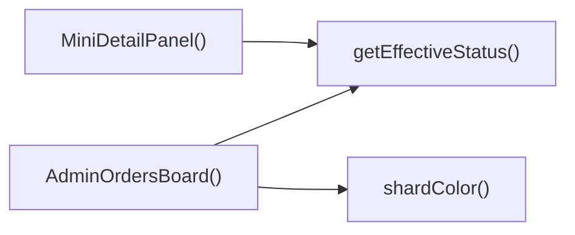

## Genel Bakış
Bu modül, VentHub HVAC sisteminin yönetici paneli için geliştirilmiş sipariş yönetim paneli bileşenidir. Sistemdeki tüm siparişleri listeleyen, durumlarını görselleştiren ve yönetici yetkilerine göre sipariş detaylarının incelenip düzenlenmesine olanak tanır.

## Fonksiyon Grupları
### Ana Yönetim Paneli Bileşeni
Modülün temel giriş noktası olarak tüm siparişler panelinin çalışmasını koordine eden, tüm alt bileşenleri bir araya getiren ana bileşendir.
- AdminOrdersBoard

### Sipariş Durumu Yardımcı Fonksiyonları
Siparişlerin geçerli çalışma durumunu standartlaştıran ve bu durumlara uygun görsel renk kodları atayan, tüm alt bileşenler tarafından ortak kullanılan yardımcı yazılım parçalarıdır.
- getEffectiveStatus, shardColor

### Durum Görselleştirme Bileşeni
Siparişlerin hangi aşamada olduğunu adım adım gösteren kullanıcı dostu bir ilerleme göstergesi sunan, yöneticilerin sipariş durumlarını anlık olarak hızlıca anlamasını sağlayan görsel alt bileşendir.
- OrderStepper

### Sipariş Detay Paneli Bileşeni
Yönetici tarafından seçilen siparişin tüm detaylarını açılan bir panelde gösteren, kullanıcının yazma erişim hakkına göre düzenleme izinlerini yöneten ve panel kapanma işlevlerini üstlenen etkileşimli alt bileşendir.
- MiniDetailPanel

---

## AXIOMS – Mimari Varsayımlar
Bu modül, admin panelindeki HVAC siparişlerinin listelenmesi, durum takibi ve detay yönetimi işlevlerinin sorunsuz çalışması için tüm bileşenlere iletilen girdi verilerinin bütünlüğünü, yetki bilgilerinin doğruluğunu ve geçerli durum değerlerinin tanımlı set içinde olmasını zorunlu kılar.

[Aksiyom 1]: Eğer getEffectiveStatus fonksiyonuna girdi olarak verilen AdminOrderRow nesneleri, durum hesaplaması için ihtiyaç duyulan tüm zorunlu alanlara sahip değilse, tüm siparişlerin efektif durumu yanlış hesaplanır, paneldeki tüm durum gösterimleri hatalı çalışır.
[Aksiyom 2]: Eğer OrderStepper bileşenine iletilen status string değeri sistemde tanımlı geçerli sipariş durumları listesinde yer almıyorsa, adım adım durum takibi yapan stepper arayüzü yanlış veya boş görüntülenir.
[Aksiyom 3]: Eğer MiniDetailPanel bileşenine iletilen hasWriteAccess boolean değeri panele erişen admin kullanıcısının gerçek yazma yetkileriyle eşleşmiyorsa, yetkisiz kullanıcılar siparişlerde değişiklik yapabilir ya da yetkili kullanıcılar değişiklik yapma imkanından mahrum kalır.
[Aksiyom 4]: Eğer MiniDetailPanel'a iletilen onClose kapatma fonksiyonu çalışmıyorsa, açılan sipariş detay paneli kullanıcı tarafından kapatılamaz, arayüz işlevselliği kaybolur.
[Aksiyom 5]: Eğer shardColor fonksiyonuna iletilen status string değeri tanımlı geçerli sipariş durumları listesinde yer almıyorsa, sipariş kartlarına atanacak renkler hatalı seçilir, görsel durum ayrımı kaybolur.
[Aksiyom 6]: Eğer shardColor fonksiyonuna isDragging parametresi olarak boolean türü dışında bir değer iletilirse, sürükleme esnasında ve normal durumdaki sipariş kartı renkleri yanlış uygulanır.
[Aksiyom 7]: Eğer AdminOrdersBoard ana bileşeninin işlediği tüm AdminOrderRow nesneleri benzersiz kimliklere sahip değilse, panelde aynı sipariş birden fazla kez görüntülenir veya detay paneli yanlış siparişin bilgilerini çeker.

---

## FONKSIYON DETAYLARI

### getEffectiveStatus
**Ne yapar**: Yönetici paneline ait bir sipariş nesnesinin, sistemde kullanılmak üzere standardize edilmiş geçerli durumunu string formatında döndürür. Siparişin ham durum verilerini işleyerek hem kullanıcı arayüzünde hem de sistem logic'inde uyumlu bir durum metni sunar.
**Nasıl yapar**: Gelen AdminOrderRow tipindeki sipariş nesnesi içindeki tüm durumla ilgili alanları kontrol eder, olası eski durum kayıtları veya kısmi güncellemeleri normalize ederek tek standart durum string'i oluşturur. Siparişin yaşam döngüsündeki belirsiz durumları ortadan kaldırarak her zaman tutarlı bir durum bilgisini döndürür.
**Parametreler**:
- order: AdminOrderRow — Üzerinde işlem yapılacak, yönetici paneline ait tüm sipariş verilerini barındıran sipariş satırı nesnesi
**Dönüş**: string — Standartlaştırılmış, tüm sistemde kullanılabilecek geçerli sipariş durumu metni

### OrderStepper
**Ne yapar**: Belirtilen sipariş durumuna göre siparişin işlem adımlarını şematik olarak gösteren bir React bileşenidir. Yöneticilerin siparişin hangi aşamada olduğunu tek bakışta görmesini sağlayan görsel bir ilerleme çizelgesi sunar.
**Nasıl yapar**: Aldığı string tipindeki durum değerini, siparişin yaşam döngüsündeki adım sıralamasıyla eşleştirir. Tamamlanan, bekleyen ve aktif olan adımları farklı görsel stillerle işaretleyerek, siparişin sürecindeki konumunu net bir şekilde ortaya koyar.
**Parametreler**:
- status: string — Hangi adımların aktif, tamamlanmış veya beklemede olduğunu belirlemek için kullanılan standart sipariş durumu metni
**Dönüş**: React bileşeni olarak ekrana render edilir, tanımlanmış özel bir dönüş tipi bulunmamaktadır

### MiniDetailPanel
**Ne yapar**: Yönetici tarafından seçilen bir siparişin özet detaylarını gösteren açılır panel React bileşenidir. Kullanıcının yazma erişimine sahip olup olmadığına göre düzenleme yetkilerini kısıtlayarak güvenli bir detay görüntüleme deneyimi sunar.
**Nasıl yapar**: Aldığı sipariş nesnesinin verilerini panel içinde yapılandırarak gösterir, panelin kapanma işlemini tetikleyen onClose fonksiyonunu panelin kapatma butonuna bağlar. hasWriteAccess parametresinin değerine göre sipariş üzerinde değişiklik yapma imkanı veren butonları görünür veya gizli hale getirir.
**Parametreler**:
- order: AdminOrderRow — Detayları gösterilecek olan yönetici paneline ait sipariş satırı nesnesi
- onClose: () => void — Panelin kapanması istendiğinde tetiklenen, ana bileşende paneli kapatan işlevi yerine getiren boş dönüşlü fonksiyon
- hasWriteAccess: boolean — Paneli görüntüleyen kullanıcının ilgili sipariş üzerinde değişiklik yapma yetkisine sahip olup olmadığını belirten mantıksal değer
**Dönüş**: Açılır pencere olarak ekrana render edilir, tanımlanmış özel bir dönüş tipi bulunmamaktadır

### AdminOrdersBoard
**Ne yapar**: VentHub HVAC sisteminin yönetici panelinde tüm siparişleri toplu olarak görüntülemek, sıralamak ve yönetmek için kullanılan ana bileşendir. Tüm alt bileşen ve yardımcı fonksiyonları bünyesinde barındırarak bütünleşik bir sipariş yönetimi deneyimi sunar.
**Nasıl yapar**: Backend servislerinden yönetici yetkilerine uygun tüm sipariş verilerini çeker, gelen siparişleri filtreleme, sıralama ve sürükle-bırak gibi işlemlerle yönetmeye imkan tanır. Kendi bünyesinde getEffectiveStatus, OrderStepper, MiniDetailPanel gibi tüm alt fonksiyon ve bileşenleri entegre bir şekilde çalıştırarak panelin işlevselliğini sağlar.
**Parametreler**: Harici olarak herhangi bir parametre almaz, kendi iç state yapısı ile çalışır
**Dönüş**: Tüm yönetici sipariş paneli arayüzünü ekrana render edilir, tanımlanmış özel bir dönüş tipi bulunmamaktadır

### shardColor
**Ne yapar**: Sipariş kartlarının durumuna ve sürükleme işlemindeki konumuna göre uygun görsel renk değerini oluşturan yardımcı fonksiyondur. Farklı durumdaki siparişlerin arayüzde görsel olarak birbirinden ayırt edilmesini sağlar.
**Nasıl yapar**: Gelen string tipindeki durum değerini önceden tanımlanmış renk eşleşmeleriyle karşılaştırarak temel renk değerini oluşturur. isDragging parametresi true ise, sürüklenen sipariş kartı için özel bir vurgu veya opaklık ayarı ekleyerek farklı bir stil uygular.
**Parametreler**:
- status: string — Renk ataması yapılacak siparişin standart durum metni
- isDragging: boolean — İlgili sipariş kartının o an sürüklenip sürüklenmediğini belirten mantıksal değer
**Dönüş**: Stil özelliklerinde kullanılabilecek renk değeri sunar, tanımlanmış özel bir dönüş tipi bulunmamaktadır

---

## INTERFACES

### AdminOrderRow
- `id: string`
- `status: string`
- `user_id?: string | null`
- `total_amount?: number | null`
- `created_at: string`
- `customer_name?: string | null`
- `customer_email?: string | null`
- `customer_phone?: string | null`
- `order_number?: string | null`
- `payment_status?: string | null`

### ColumnDef
- `id: ColumnId`
- `title: string`
- `statuses: string[]`
- `icon: LucideIcon`
- `colorClass: string`
- `bgClass: string`
- `targetStatus: string`

### ColumnDef
- `id: ColumnId`
- `title: string`
- `statuses: string[]`
- `icon: LucideIcon`
- `colorClass: string`
- `bgClass: string`
- `targetStatus: string`

### OrderDetail
- `notes: { id: string; note: string; created_at: string }[]`
- `emailLogs: { subject: string; created_at: string }[]`
- `carrier?: string | null`
- `tracking_number?: string | null`

---

## TYPE ALIASES

### ColumnId
```typescript
type ColumnId = 'col_new' | 'col_prep' | 'col_shipped' | 'col_done' | 'col_cancel' | 'col_refund'
```

---

## AST POINTERS

### [N1_NASIL] AST Pointer: C:\Users\alize\venthub-hvac\src\views\admin\AdminOrdersBoard.tsx::getEffectiveStatus
- **params**: [order: AdminOrderRow]
- **ic_degiskenler**:
  - `order.payment_status` — Siparişin ödeme durumu, iade işlemlerini kontrol etmek için kullanılır
  - `order.status` — Siparişin ana işlem durumu, iade durumu yoksa bu değer döndürülür
- **Dönüş**: string

---

### [N2_NASIL] AST Pointer: C:\Users\alize\venthub-hvac\src\views\admin\AdminOrdersBoard.tsx::OrderStepper
- **params**: [{ status: string }]
- **ic_degiskenler**:
  - `t` — useI18n hook'undan gelen çeviri fonksiyonu, arayüz metinlerini çevirmek için kullanılır
  - `steps` — Siparişin işlem adımlarının anahtar ve etiketlerini içeren sabit dizi, stepper yapısını oluşturur
  - `getStepIndex` — Gelen sipariş durumuna göre mevcut adımın indeksini hesaplayan iç fonksiyon
  - `s` — getStepIndex fonksiyonunun aldığı durum parametresi
  - `currentIndex` - Hesaplanan mevcut adım indeksi, stepper ilerlemesini göstermek için kullanılır
  - `isCancelled` — Siparişin iptal/iade edilip edilmediğini kontrol eden bayrak, özel iptal görünümü tetikler
  - `step` — steps dizisi üzerinde map işlemiyle erişilen her bir adım nesnesi
  - `idx` — steps dizisi map işlemindeki mevcut indeks
  - `isPast` — Mevcut adımın tamamlanmış adımlardan olup olmadığını belirten bayrak
  - `isCurrent` — Mevcut adımın aktif adım olup olmadığını belirten bayrak
- **Dönüş**: JSX elementi (void)

---

### [N3_NASIL] AST Pointer: C:\Users\alize\venthub-hvac\src\views\admin\AdminOrdersBoard.tsx::MiniDetailPanel
- **params**: [{ order: AdminOrderRow, onClose: () => void, hasWriteAccess: boolean }]
- **ic_degiskenler**:
  - `t` — useI18n hook'undan gelen çeviri fonksiyonu
  - `lang` — useI18n hook'undan gelen mevcut aktif dil kodu, formatlama işlemleri için kullanılır
  - `detail` — Siparişin ek detaylarını (notlar, email logları, kargo bilgileri) tutan state
  - `setDetail` — detail state'ini güncelleyen setter fonksiyonu
  - `loading` — Detay verilerinin yüklenme durumunu tutan state
  - `setLoading` — loading state'ini güncelleyen setter
  - `noteInput` — Kullanıcının girdiği yeni sipariş notunu tutan state
  - `setNoteInput` — noteInput state'ini güncelleyen setter
  - `saving` — Yeni notun kaydedilme sürecinin durumunu tutan state
  - `setSaving` — saving state'ini güncelleyen setter
  - `mounted` - Bileşenin aktif monte durumu, bellek sızıntısını önlemek için kullanılır
  - `load` — Supabase'den sipariş detaylarını çeken async iç fonksiyon
  - `ensureSessionFresh` — Oturumun geçerliliğini kontrol eden yardımcı fonksiyon
  - `notesRes` — order_notes tablosundan dönen sorgu sonucu
  - `logsRes` — shipping_email_events tablosundan dönen sorgu sonucu
  - `orderRes` — venthub_orders tablosundan dönen kargo bilgileri sorgu sonucu
  - `addNote` — Yeni girilen notu supabase'e kaydeden async fonksiyon
  - `order.id` — Seçili siparişin benzersiz kimliği, tüm veritabanı sorgularında kullanılır
  - `n` — detail.notes dizisi map işlemindeki her bir not nesnesi
  - `l` — detail.emailLogs dizisi map işlemindeki her bir email log nesnesi
  - `i` — emailLogs dizisi map işlemindeki mevcut indeks
- **Dönüş**: JSX elementi (void)

---

### [N4_NASIL] AST Pointer: C:\Users\alize\venthub-hvac\src\views\admin\AdminOrdersBoard.tsx::AdminOrdersBoard
- **params**: (parametre yok)
- **ic_degiskenler**:
  - `pathname` — usePathname hook'undan gelen mevcut sayfa yolu
  - `t` — useI18n hook'undan gelen çeviri fonksiyonu
  - `lang` — useI18n hook'undan gelen aktif dil kodu
  - `canWrite` — useRole hook'undan gelen izin kontrol fonksiyonu
  - `hasWriteAccess` — Siparişler üzerinde yazma izni olup olmadığını belirten bayrak
  - `orders` — Tüm siparişleri tutan state, AdminOrderRow tipinde dizi
  - `setOrders` — orders state'ini güncelleyen setter
  - `loading` — Sipariş verilerinin yüklenme durumunu tutan state
  - `setLoading` — loading state'ini güncelleyen setter
  - `selectedOrder` — Kullanıcı tarafından tıklanarak seçilen siparişi tutan state, detay paneli açmak için kullanılır
  - `setSelectedOrder` — selectedOrder state'ini güncelleyen setter
  - `expandedCol` — Mobil görünümde genişletilen kanban sütununun kimliğini tutan state
  - `setExpandedCol` — expandedCol state'ini güncelleyen setter
  - `scrollRef` — Kanban tahtasının kaydırılabilir alanını referanslayan useRef nesnesi
  - `COLUMNS` — Kanban tahtasının tüm sütun tanımlarını içeren useMemo ile önbelleğe alınmış sabit dizi
  - `fetchOrders` — Supabase'den tüm siparişleri çeken useCallback ile sarmalanmış async fonksiyon
  - `scrollBoard` — Tahtayı yatay olarak kaydırmak için kullanılan fonksiyon
  - `direction` — scrollBoard fonksiyonunun aldığı kaydırma yönü parametresi ('left' | 'right')
  - `getOrdersByCol` — Sütun kimliğine göre ilgili siparişleri filtreleyen fonksiyon
  - `colId` — getOrdersByCol fonksiyonunun aldığı sütun kimliği parametresi
  - `onDragEnd` — Sürükle-bırak işlemi tamamlandığında çalışan async fonksiyon, sipariş durumunu günceller
  - `result` — DragDropContext'ten gelen DropResult nesnesi, sürükleme işleminin verilerini içerir
  - `col` — COLUMNS dizisi map işlemindeki her bir sütun nesnesi
  - `order` — colOrders dizisi map işlemindeki her bir sipariş nesnesi
  - `index` — colOrders dizisi map işlemindeki mevcut indeks
- **Dönüş**: JSX elementi (void)

---

### [N5_NASIL] AST Pointer: C:\Users\alize\venthub-hvac\src\views\admin\AdminOrdersBoard.tsx::shardColor
- **params**: [status: string, isDragging: boolean]
- **ic_degiskenler**:
  - `isDragging` — Sipariş kartının sürüklenip sürüklenmediğini belirten bayrak, sürüklenme halinde renk bloğu döndürülmez
  - `base` — Durum string'inin küçük harfe çevrilmiş hali, renk eşleştirmesi için kullanılır
  - `color` — Sipariş durumuna göre atanan arka plan rengi sınıfı, kart üzerindeki blur efekti için kullanılır
- **Dönüş**: JSX elementi veya null

---

## ÇAĞRI HARİTASI

### Disariya Cagrilar (Outgoing)
MiniDetailPanel() sadece getEffectiveStatus fonksiyonunu çağırır; AdminOrdersBoard() ise hem shardColor hem de getEffectiveStatus fonksiyonlarını çağırır.

### Disaridan Cagrilanlar (Incoming)
Sağlanan veri setinde bu modülü kullanan dış modül veya fonksiyon bilgisi bulunmamaktadır.

### Ic Ice Fonksiyonlar (Nested)
Yok

---

## DOSYA-İÇİ ÇAĞRI GRAFİĞİ
  AdminOrdersBoard() → getEffectiveStatus()
  AdminOrdersBoard() → shardColor()
  MiniDetailPanel() → getEffectiveStatus()



---

## NODE ID STANDARD

  file: src\views\admin\AdminOrdersBoard.tsx
  function: src\views\admin\AdminOrdersBoard.tsx::getEffectiveStatus
  function: src\views\admin\AdminOrdersBoard.tsx::OrderStepper
  function: src\views\admin\AdminOrdersBoard.tsx::MiniDetailPanel
  function: src\views\admin\AdminOrdersBoard.tsx::AdminOrdersBoard
  function: src\views\admin\AdminOrdersBoard.tsx::shardColor

---

## DISA AKTARILANLAR (EXPORTS)
  export: AdminOrdersBoard
  export: MiniDetailPanel
  export: OrderStepper
  export: getEffectiveStatus
  export: shardColor