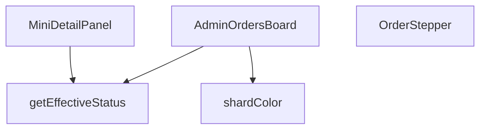

## Genel Bakış
Bu modül, yönetim panelinde siparişlerin durumlarını kart tabanlı bir panoda görselleştirmek için kullanılan bir React bileşenidir. Her sipariş için etkili durumu hesaplar, duruma göre renklendirme yapar, durum değişimlerini adım adım gösterir ve detaylı bilgi paneli sunar.

## Fonksiyon Grupları
### Ana ve Alt Bileşenler
Kullanıcı arayüzünü oluşturan React bileşenleridir. Ana sipariş panosunu, her bir sipariş kartındaki durum gösterimini ve sipariş detaylarının açılabilir panelini yönetir.
- AdminOrdersBoard, OrderStepper, MiniDetailPanel

### Yardımcı İş Mantığı Fonksiyonları
UI bileşenlerinden soyutlanmış, hesaplama ve stil belirleme işlerini yapan saf fonksiyonlardır. Siparişin nihai durumunu belirler ve duruma göre renk değerlerini üretir.
- getEffectiveStatus, shardColor

---

## AXIOMS – Mimari Varsayımlar

Bu modül, sipariş yönetimi panosu için durum hesaplama ve görselleştirme akışını tanımlar.

[Aksiyom 1]: Eğer `AdminOrderRow` tipi tanımlı değilse veya geçerli bir sipariş nesnesi içermiyorsa, `getEffectiveStatus` fonksiyonu tanımsız davranış gösterir.

[Aksiyom 2]: Eğer `getEffectiveStatus` geçerli bir `AdminOrderRow` alamazsa veya hesaplama başarısız olursa, `OrderStepper` bileşeni geçersiz bir `status` string'i alır ve UI'da hatalı durum gösterimi oluşur.

[Aksiyom 3]: Eğer `MiniDetailPanel` bileşenine `onClose` callback'i sağlanmazsa, panel kapatılamaz ve kullanıcı detay görüntülerken panele kilitlenir.

[Aksiyom 4]: Eğer `MiniDetailPanel` bileşenine `hasWriteAccess: false` olarak geçilirse, sipariş üzerinde düzenleme/değişiklik işlemleri kullanıcıya sunulmaz (salt okunur mod).

[Aksiyom 5]: Eğer `shardColor` fonksiyonuna geçerli bir `status` string'i verilmezse, kart rengi belirsiz (varsayılan/tanımsız) olur ve sürükleme sırasında görsel ayrım kaybolur.

[Aksiyom 6]: Eğer `isDragging` durumu `true` iken `shardColor` farklı bir renk döndürmezse, sürükleme sırasında aktif kart ile diğer kartlar arasında görsel ayrım yapılamaz.

[Aksiyom 7]: Eğer `AdminOrdersBoard` bileşeni içinde sipariş listesi boşsa, panoda gösterilecek herhangi bir kart veya `OrderStepper` bileşeni render edilmez.

---

## FONKSİYON DETAYLARI

### getEffectiveStatus
**Ne yapar**: Bir sipariş nesnesinin gerçek durumunu belirler; ödeme iade edilmişse iade durumunu, aksi takdirde siparişin mevcut durumunu döndürür.  
**Nasıl yapar**: `order.payment_status` değerini kontrol eder; eğer `'refunded'` veya `'partial_refunded'` ise bu değeri, değilse `order.status` alanını (veya yoksa `'pending'`) döndürür.  
**Parametreler**:
- `order`: `AdminOrderRow` — Sipariş verisini içeren nesne; `payment_status` ve `status` alanlarını barındırır.  
**Dönüş**: `string` — Hesaplanmış etkili sipariş durumu.

### OrderStepper
**Ne yapar**: Siparişin mevcut adımını görsel bir stepper (adım göstergesi) olarak render eder; iptal veya iade durumunda özel bir uyarı mesajı gösterir.  
**Nasıl yapar**: `status` değerine göre adım indeksini `getStepIndex` fonksiyonuyla bulur, iptal/ iade kontrolü yapar ve ilgili JSX yapısını döndürür. Stepper içinde adımların etiketleri i18n çevirileriyle oluşturulur ve ilerleme çubuğu dinamik olarak genişletilir.  
**Parametreler**:
- `status`: `string` — Siparişin geçerli durumu; stepper’ın hangi adımda olacağını belirler.  
**Dönüş**: JSX element (React bileşeni) — Stepper UI’si veya iptal/ iade uyarı mesajı.

### MiniDetailPanel
**Ne yapar**: Seçili bir siparişin detaylarını, notlarını, e‑posta loglarını ve lojistik bilgilerini gösteren modal bir panel sunar; ayrıca yeni not ekleme işlevi sağlar.  
**Nasıl yapar**: `useEffect` içinde siparişle ilgili not, e‑posta log ve taşıyıcı bilgilerini asenkron olarak Supabase’dan çeker, state’leri günceller. Not ekleme fonksiyonu yetki kontrolü yapar, Supabase’a kaydeder ve UI’yı yeniler. Panel, kapanma işlemi için dış tıklama ve Escape tuşu dinleyicileri içerir.  
**Parametreler**:
- `order`: `AdminOrderRow` — Görüntülenecek sipariş nesnesi.  
- `onClose`: `() => void` — Paneli kapatmak için çağrılan geri dönüş fonksiyonu.  
- `hasWriteAccess`: `boolean` — Kullanıcının not ekleme yetkisi olup olmadığını belirten bayrak.  
**Dönüş**: JSX element (React bileşeni) — Detay paneli UI’si.

### AdminOrdersBoard
**Ne yapar**: Yönetim panelinde siparişleri kanban tarzı bir tablo içinde gösterir; sürükle‑bırak ile durum değişikliği, filtreleme, yenileme ve mobil/masaüstü uyumlu görünüm sağlar.  
**Nasıl yapar**: `useEffect` ile siparişleri Supabase’dan çeker, `COLUMNS` tanımıyla her durum grubu için kolon konfigürasyonu oluşturur. `react-beautiful-dnd` ile sürükle‑bırak mantığını yönetir, `onDragEnd` içinde yetki kontrolü, durum güncellemesi ve hata yönetimi yapılır. UI, kaydırma butonları, mobil sekme geçişleri ve seçili sipariş için `MiniDetailPanel` entegrasyonu içerir.  
**Parametreler**: *(yok)*  
**Dönüş**: JSX element (React bileşeni) — Sipariş panosu UI’si.

### shardColor
**Ne yapar**: Sipariş durumuna göre renkli bir arka plan “shard” (parçacık) oluşturur; sürükleme sırasında görünmez hâle getirir.  
**Nasıl yapar**: `status` değerini küçük harfe çevirir, önceden tanımlı durum‑renk eşleştirmesine göre CSS sınıfını seçer ve ilgili `div` elementini döndürür; `isDragging` true ise `null` döner.  
**Parametreler**:
- `status`: `string` — Siparişin mevcut dur renk seçimini etkiler.  
- `isDragging`: `boolean` — Sürükleme durumu; true ise renkli öğe gösterilmez.  
**Dönüş**: JSX element (`<div>` with color class) veya `null` — Duruma göre renkli arka plan veya boş değer.

---

## INTERFACES

### AdminOrderRow
- `id: string`
- `status: string`
- `user_id?: string | null`
- `total_amount?: number | null`
- `created_at: string`
- `customer_name?: string | null`
- `customer_email?: string | null`
- `customer_phone?: string | null`
- `order_number?: string | null`
- `payment_status?: string | null`

### ColumnDef
- `id: ColumnId`
- `title: string`
- `statuses: string[]`
- `icon: LucideIcon`
- `colorClass: string`
- `bgClass: string`
- `targetStatus: string`

### ColumnDef
- `id: ColumnId`
- `title: string`
- `statuses: string[]`
- `icon: LucideIcon`
- `colorClass: string`
- `bgClass: string`
- `targetStatus: string`

### OrderDetail
- `notes: { id: string; note: string; created_at: string }[]`
- `emailLogs: { subject: string; created_at: string }[]`
- `carrier?: string | null`
- `tracking_number?: string | null`

---

## TYPE ALIASES

### ColumnId
```typescript
type ColumnId = 'col_new' | 'col_prep' | 'col_shipped' | 'col_done' | 'col_cancel' | 'col_refund'
```

---

## AST POINTERS

### [N1_NASIL] AST Pointer: src/views/admin/AdminOrdersBoard.tsx::getEffectiveStatus
- **params**: `(order: AdminOrderRow)` — tek bir sipariş satırı nesnesi
- **ic_degiskenler**:
  *(fonksiyon gövdesinde yerel değişken tanımlanmamıştır; doğrudan parametre özellikleri üzerinden karar verilir)*
- **Dönüş**: `string` — refund/partial_refunded ise `order.payment_status`, aksi halde `order.status` veya `'pending'`

---

### [N2_NASIL] AST Pointer: src/views/admin/AdminOrdersBoard.tsx::OrderStepper
- **params**: `{ status }: { status: string }` — siparişin mevcut durumunu temsil eden string
- **ic_degiskenler**:
  - `t` — `useI18n()` hook'undan dönen çeviri fonksiyonu; stepper etiketlerinin lokalize edilmesi için kullanılır
  - `steps` — 5 elemanlı dizi; her eleman `{ key, label }` formatında tanımlı stepper adımları (pending → paid → confirmed → shipped → delivered)
  - `getStepIndex` — inner fonksiyon; status string'ini 0–4 arası tam sayi indekse dönüştürür (completed/delivered → 4, shipped → 3, confirmed/processing → 2, paid → 1, diğer → 0)
  - `currentIndex` — `getStepIndex(status)` çağrısıyla elde edilen mevcut adım indeksi
  - `isCancelled` — boolean; status `'cancelled'`, `'refunded'` veya `'partial_refunded'` ise true
- **Dönüş**: JSX elementi (ReactNode) — iptal durumunda rose renkli uyarı div'i, normal durumda progress bar ve adım noktaları içeren JSX

---

### [N3_NASIL] AST Pointer: src/views/admin/AdminOrdersBoard.tsx::MiniDetailPanel
- **params**: `(order: AdminOrderRow, onClose: () => void, hasWriteAccess: boolean)` — sipariş nesnesi, kapatma callback'i, yazma izni flag'i
- **ic_degiskenler**:
  - `t` — `useI18n()` hook'undan dönen çeviri fonksiyonu; tüm UI metinlerinin lokalize edilmesi için kullanılır
  - `lang` — `useI18n()` hook'undan dönen dil kodu; `formatCurrency` ve `formatDateTime` çağrılarına geçirilir
  - `detail` — `useState<OrderDetail | null>(null)` ile tanımlı state; sipariş notları, email logları, kargo taşıyıcı ve takip numarasını tutar
  - `loading` — `useState(true)` ile tanımlı state; veri yüklenirken true, yükleme tamamlanınca false olur
  - `noteInput` — `useState('')` ile tanımlı state; not ekleme input'unun değeri
  - `saving` — `useState(false)` ile tanımlı state; not kaydedilirken true, işlem bitince false olur
  - `mounted` — `useEffect` içinde tanımlı boolean flag; bileşen unmount olduktan sonra state güncellemesini engeller (cleanup)
  - `load` — async inner fonksiyon; `ensureSessionFresh()` çağırır, ardından `Promise.all` ile üç supabase sorgusunu paralel çalıştırır:
    - `notesRes` — `supabase.from('order_notes').select('id,note,created_at').eq('order_id', order.id)` çağrısının sonucu (en fazla 5 not)
    - `logsRes` — `supabase.from('shipping_email_events').select('subject,created_at').eq('order_id', order.id)` çağrısının sonucu (en fazla 3 email logu)
    - `orderRes` — `supabase.from('venthub_orders').select('carrier,tracking_number').eq('id', order.id).maybeSingle()` çağrısının sonucu; `orderRes.data?.carrier` ve `orderRes.data?.tracking_number` erişimleri ile kargo bilgileri alınır
  - `addNote` — async fonksiyon; `hasWriteAccess` kontrol eder, `noteInput.trim()` doğrulaması yapar, `supabase.from('order_notes').insert({ order_id: order.id, note: noteInput.trim() }).select('id,note,created_at').single()` ile yeni not ekler, `setDetail` ile mevcut notlar dizisinin başına ekler, `setNoteInput('')` ile input'u temizler
- **Dönüş**: JSX elementi (ReactNode) — modal overlay, sipariş detayları, OrderStepper, kargo bilgisi, not listesi ve email logları içeren JSX

---

### [N4_NASIL] AST Pointer: src/views/admin/AdminOrdersBoard.tsx::AdminOrdersBoard
- **params**: *(parametre yok)*
- **ic_degiskenler**:
  - `pathname` — `usePathname()` hook'undan dönen mevcut URL yolu; `useEffect` bağımlılık dizisinde kullanılır
  - `t` — `useI18n()` hook'undan dönen çeviri fonksiyonu; tüm UI metinleri, toast mesajları, sütun başlıkları için kullanılır
  - `lang` — `useI18n()` hook'undan dönen dil kodu; `formatCurrency` ve `formatDateTime` çağrılarına geçirilir
  - `canWrite` — `useRole()` hook'undan dönen izin kontrol fonksiyonu
  - `hasWriteAccess` — `canWrite('orders')` çağrısıyla elde edilen boolean; sürükleme ve not ekleme işlemlerine izin verilip verilmeyeceğini belirler
  - `orders` — `useState<AdminOrderRow[]>([])` ile tanımlı state; tüm siparişlerin dizisi
  - `loading` — `useState(true)` ile tanımlı state; yükleme durumu
  - `selectedOrder` — `useState<AdminOrderRow | null>(null)` ile tanımlı state; MiniDetailPanel'de gösterilecek seçili sipariş
  - `expandedCol` — `useState<ColumnId | null>('col_new')` ile tanımlı state; mobil görünümde hangi sütunun genişletildiğini tutar
  - `scrollRef` — `useRef<HTMLDivElement>(null)` ile tanımlı ref; board container'ının scroll kontrolü için kullanılır
  - `COLUMNS` — `React.useMemo` ile tanımlı `ColumnDef[]` dizisi; 6 sütun tanımı (col_new, col_prep, col_shipped, col_done, col_cancel, col_refund), her biri `{ id, title, statuses, icon, colorClass, bgClass, targetStatus }` yapısındadır; `t` bağımlılığı ile yeniden hesaplanır
  - `fetchOrders` — `useCallback` ile sarılı async fonksiyon; `ensureSessionFresh()` çağırır, `supabase.from('view_admin_orders').select('id,status,user_id,total_amount,created_at,order_number,customer_name,customer_email,customer_phone,payment_status').order('created_at', { ascending: false }).limit(200)` sorgusuyla siparişleri çeker, `setOrders(data as AdminOrderRow[])` ile state'i günceller; hata durumunda `toast.error` gösterir; `t` bağımlılığı ile memoize edilmiştir
  - `scrollBoard` — `(direction: 'left' | 'right') => void` fonksiyonu; `scrollRef.current.scrollBy` ile 340px'lik smooth yatay kaydırma yapar
  - `getOrdersByCol` — `(colId: ColumnId) => AdminOrderRow[]` fonksiyonu; `COLUMNS.find` ile sütun tanımını bulur, `orders.filter` ile ilgili sütunun `statuses` dizisindeki durumlara eşleşen siparişleri döndürür; `getEffectiveStatus` çağrısı ile her siparişin efektif durumunu hesaplar
  - `onDragEnd` — `async (result: DropResult) => void` fonksiyonu; sürükle-bırak sonucunu işler:
    - `result`'tan `destination`, `source`, `draggableId` destructuring ile alınır
    - `destCol` — `COLUMNS.find(c => c.id === destination.droppableId)` ile hedef sütun tanımı
    - `targetOrder` — `orders.find(o => o.id === draggableId)` ile sürüklünen sipariş nesnesi
    - `targetStatus` — `destCol.targetStatus` ile hedef durum stringi
    - `effectiveCurrent` — `getEffectiveStatus(targetOrder)` ile mevcut efektif durum
    - `oldStatus` — `targetOrder.status` ile değiştirme öncesi orijinal durum
    -乐观更新: `setOrders(prev => prev.map(...))` ile orders state'ini anlık günceller (refunded durumunda status='cancelled' + payment_status='refunded', diğer durumlarda status=targetStatus)
    - `res` — `await updateOrderStatus({ orderId: draggableId, newStatus: targetStatus, oldStatus, userId: targetOrder.user_id, reason, auditComment })` API çağrısının sonucu
    - Başarılıysa `toast.success`, başarısızsa eski duruma geri alma + `toast.error` + `fetchOrders()` çağrısı
- **Dönüş**: JSX elementi (ReactNode) — loading durumunda AdminSkeleton, normal durumda toolbar, mobil tab-switcher, DragDropContext ile sütunlar ve kartlar, MiniDetailPanel içeren tam sayfa JSX

---

### [N5_NASIL] AST Pointer: src/views/admin/AdminOrdersBoard.tsx::shardColor
- **params**: `(status: string, isDragging: boolean)` — sipariş durumu stringi ve sürükleme durumu flag'i
- **ic_degiskenler**:
  - `base` — `status.toLowerCase()` ile küçük harfe dönüştürülmüş durum stringi; case-insensitive karşılaştırma için kullanılır
  - `color` — string; başlangıçta `'bg-slate-500/20'` değerine sahip, `base` değerine göre conditionally güncellenen Tailwind arka plan rengi class'i (pending → amber, paid/confirmed/processing → cyan, shipped → blue, delivered/completed → emerald, cancelled → rose, refunded/partial_refunded → orange)
- **Dönüş**: JSX elementi veya `null` — `isDragging` true ise `null`, aksi halde duruma göre renkli blur efektli `<div>` elementi; sürükleme sırasında kartların arka planını süslemek için kullanılır

---


## MERMAID CALL GRAPH


## NODE ID STANDARD

  file: src\views\admin\AdminOrdersBoard.tsx
  function: src\views\admin\AdminOrdersBoard.tsx::getEffectiveStatus
  function: src\views\admin\AdminOrdersBoard.tsx::OrderStepper
  function: src\views\admin\AdminOrdersBoard.tsx::MiniDetailPanel
  function: src\views\admin\AdminOrdersBoard.tsx::AdminOrdersBoard
  function: src\views\admin\AdminOrdersBoard.tsx::shardColor

---

## DISA AKTARILANLAR (EXPORTS)
  export: AdminOrdersBoard
  export: MiniDetailPanel
  export: OrderStepper
  export: getEffectiveStatus
  export: shardColor

---

## STİL TOKENLERİ

### Arbitrary Değerler (token'a geçirilmemiş)
Yok — tüm stiller token'a geçirilmiş. ✅

### Kullanılan Token'lar (zaten token'a geçirilmiş)
- `rounded-hvac-2xl`, `rounded-hvac-lg`, `rounded-hvac-xl`, `shadow-glow-md`, `shadow-glow-sm`, `tracking-hvac-normal`, `tracking-hvac-relaxed`, `tracking-hvac-tight`

### Tailwind Sınıf Özeti
- **Renkler:** `bg-amber-400/5`, `bg-blue-500/10`, `bg-blue-500/20`, `bg-clip-text`, `bg-cyan-400`, `bg-cyan-500`, `bg-cyan-500/5`, `bg-gradient-to-r`, `bg-rose-500/10`, `bg-surface-darker/40`, `bg-white`, `bg-white/10`, `bg-white/2`, `bg-white/3`, `bg-white/5`
- **Layout:** `!h-42px`, `-right-4`, `-top-4`, `-z-10`, `absolute`, `backdrop-blur-md`, `backdrop-blur-xl`, `bg-clip-text`, `block`, `custom-scrollbar`, `fixed`, `flex`, `flex-1`, `flex-col`, `from-white`
- **Varyant/Responsive:** `:`, `disabled:`, `group-hover:`, `hover:`, `md:` önekleri
- **Yardımcı Sınıflar:** `!px-5`, `${!isExpanded`, `${adminButtonPrimaryClass`, `${col.bgClass`, `${col.colorClass`, `${color`, `${isActive`, `${isCurrent`, `${isExpanded`, `${isPast`, `${snapshot.isDragging`, `${snapshot.isDraggingOver`, `-mx-1`, `-translate-y-1/2`, `:`