## Genel Bakış
`AdminOrdersPage.tsx`, yönetici panelinde siparişlerin listelendiği, sıralandığı ve yönetildiği ana sayfa bileşenidir. Bu modül, sipariş verilerini görsel bir tabloda sunarak gönderi takibi, not yönetimi ve toplu işlem gibi kritik işlevleri kontrol eden modal pencereleri ve yardımcı fonksiyonları barındırır.

## Fonksiyon Grupları
### Ana Bileşen ve Etkileşim Kontrolleri
Sayfayı oluşturan ana React bileşeni ve kullanıcı etkileşimlerini tetikleyen modal açma/kapama mantığını yönetir.
- AdminOrdersPage, openShipModal, closeShipModal, openLogsModal, closeLogsModal, openNotesModal, closeNotesModal

### Sipariş İşlemleri ve Veri Değişiklikleri
Siparişler üzerinde gerçekleştirilen temel veri değiştirme ve dışa aktarma eylemlerini kapsar.
- addNote, deleteNote, submitShip, bulkCancelShipping, exportCsv

### Sıralama ve Tablo Görünümü
Sipariş tablosunun sıralama mantığını ve durum görselleştirmesi için yardımcı fonksiyonları içerir.
- toggleSort, sortIndicator, badgeClass, prettyStatus

### Veri Biçimlendirme ve Yardımcı Fonksiyonlar
Ham veriyi (tarih, para birimi) kullanıcıya uygun formatlara dönüştüren ve dış bağlantılar oluşturan yardımcı araçları sunar.
- formatAmount, safeDate, generateTrackingUrl

---

## AXIOMS – Mimari Varsayımlar

Bu modül sipariş yönetimi面板ıdır ve üç farklı modal (gönderim, loglar, notlar), sıralama, toplu işlem ve CSV dışa aktarma işlevlerini yönetir.

**[Aksiyom 1]**: `SortKey` tipi (sütun sıralama anahtarları) modül dışında tanımlı olmalıdır. Eğer `SortKey` tipi yoksa, `toggleSort()` ve `sortIndicator()` fonksiyonları çalışamaz.

**[Aksiyom 2]**: `Lang` (dil) tipi modül dışında tanımlı olmalıdır. Eğer `Lang` tipi yoksa, `formatAmount()` ve `safeDate()` fonksiyonları doğru dilde formatlama yapamaz.

**[Aksiyom 3]**: `prettyStatus()` için `t` parametresi (çeviri fonksiyonu) her çağrımda sağlanmalıdır. Eğer `t` fonksiyonu sağlanmazsa, durum etiketleri ham anahtar olarak gösterilir ve kullanıcı diline çevrilmez.

**[Aksiyom 4]**: `addNote()` çağrılmadan önce not içeriği (örn: state/input) modül içinde dolu olmalıdır. Eğer not içeriği boş/null ise, boş not kaydı oluşur veya ekleme başarısız olur.

**[Aksiyom 5]**: `openShipModal(id)`, `openLogsModal(id)` ve `openNotesModal(id)` çağrılırken `id` parametresi geçerli bir sipariş ID'si olmalıdır. Eğer geçersiz/boş bir ID verilirse, ilgili modal hatalı veri gösterir veya boş açılır.

**[Aksiyom 6]**: `deleteNote(noteId)` çağrılacaksa, `noteId` daha önce var olan bir nota ait olmalıdır. Eğer geçersiz bir `noteId` verilirse, silme işlemi başarısız olur.

**[Aksiyom 7]**: `submitShip()` çağrılmadan önce gönderim bilgileri (kargo firması, takip no vb.) state içinde doldurulmuş olmalıdır. Eğer gönderim verileri eksikse, gönderim işlemi başarısız olur veya doğrulama hatası oluşur.

**[Aksiyom 8]**: `bulkCancelShipping()` çağrıldığında en az bir sipariş seçili (selected) olmalıdır. Eğer hiç sipariş seçilmediyse, toptan iptal işlemi uygulanacak hedef yoktur.

**[Aksiyom 9]**: `safeDate(iso, lang)` fonksiyonuna verilen `iso` parametresi geçerli bir ISO 8601 tarih dizgesi olmalıdır. Eğer geçersiz bir tarih verilirse, "bilinmeyen tarih" gibi güvenli bir dönüş yapılır (çökmez).

**[Aksiyom 10]**: `generateTrackingUrl(carrier, tracking)` için hem `carrier` hem de `tracking` boş string olmamalıdır. Eğer herhangi biri boşsa, geçersiz veya boş bir takip URL'i üretilir.

**[Aksiyom 11]**: `formatAmount(v, lang)` – `v` parametresi `undefined` veya `null` olabilir, bu durumda güvenli bir varsayılan gösterim yapılmalıdır. Eğer `v` negatif bir değer olarak verilirse, modülün bunu nasıl gösterdiği fonksiyon gövdesine bağlıdır (bilinmiyor).

**[Aksiyom 12]**: `badgeClass(s)` için `s` parametresi geçerli bir sipariş durum stringi olmalıdır. Eğer bilinmeyen bir durum verilirse, varsayılan/güvenli bir CSS sınıfı döndürülmelidir.

**[Aksiyom 13]**: `toggleSort(key)` fonksiyonu, mevcut bir sıralama sütunu `key` ile çağrılmalıdır. Eğer SortKey union'ına uym

---

## FONKSİYON DETAYLARI

### AdminOrdersPage
**Ne yapar**: Admin panelinde siparişlerin listelendiği ve yönetildiği ana React bileşenini tanımlar.  
**Nasıl yapar**: Fonksiyon bir React Functional Component (FC) döndürür; bileşen içinde durum yönetimi, modal açma/kapatma ve veri çekme işlemleri tanımlanır.  
**Parametreler**:  
- *yok*  
**Dönüş**: React.FC — Bileşen tipinde bir fonksiyon döndürür.

### openShipModal
**Ne yapar**: Belirtilen sipariş kimliği için gönderim modalını açar.  
**Nasıl yapar**: `openShipModal` fonksiyonunu çağıran bir ok fonksiyonu (`() => openShipModal(r.id)`) ile tetiklenir; modal görünürlüğü ve ilgili sipariş kimliği ayarlanır.  
**Parametreler**:  
- id: string — Açılacak gönderim modalının ilişkilendirileceği siparişin benzersiz kimliği.  
**Dönüş**: void (geri dönüş değeri yok).

### closeShipModal
**Ne yapar**: Açık olan gönderim modalını kapatır.  
**Nasıl yapar**: Modal görünürlüğü durumunu `false` olarak günceller.  
**Parametreler**: *yok*  
**Dönüş**: void.

### openLogsModal
**Ne yapar**: Belirtilen sipariş kimliği için e‑posta loglarını gösteren bir modal açar ve logları veri kaynağından çeker.  
**Nasıl yapar**: Modalı açar, yükleme durumunu `true` yapar, Supabase üzerinden `shipping_email_events` tablosundan ilgili kayıtları alır, hataları yakalar ve sonuçları duruma (`setEmailLogs`) kaydeder; sonunda yükleme durumunu `false` eder.  
**Parametreler**:  
- id: string — Logların getirileceği siparişin kimliği.  
**Dönüş**: void.

### closeLogsModal
**Ne yapar**: Açık olan e‑posta logları modalını kapatır.  
**Nasıl yapar**: Modal görünürlüğü durumunu `false` olarak günceller.  
**Parametreler**: *yok*  
**Dönüş**: void.

### openNotesModal
**Ne yapar**: Belirtilen sipariş kimliği için notları gösteren bir modal açar ve notları veri kaynağından çeker.  
**Nasıl yapar**: Modalı açar, ilgili sipariş kimliğini duruma (`setNotesOrderId`) kaydeder, Supabase üzerinden `order_notes` tablosundan notları alır, hataları yakalar ve notları duruma (`setNotes`) ekler.  
**Parametreler**:  
- id: string — Notların getirileceği siparişin kimliği.  
**Dönüş**: void.

### closeNotesModal
**Ne yapar**: Açık olan notlar modalını kapatır.  
**Nasıl yapar**: Modal görünürlüğü durumunu `false` olarak günceller.  
**Parametreler**: *yok*  
**Dönüş**: void.

### addNote
**Ne yapar**: Kullanıcı tarafından girilen yeni bir notu veri tabanına ekler ve listeye yansıtır.  
**Nasıl yapar**: `notesOrderId` ve `noteInput` geçerli ise Supabase `order_notes` tablosuna yeni bir kayıt ekler, eklenen notu mevcut notlar listesine ekler ve giriş alanını temizler; hataları yakalar ve kullanıcıyı bilgilendirir.  
**Parametreler**: *yok*  
**Dönüş**: void.

### deleteNote
**Ne yapar**: Belirtilen not kimliğine sahip notu veri tabanından siler ve listeden kaldırır.  
**Nasıl yapar**: Supabase `order_notes` tablosunda `id` eşleşen kaydı siler, başarılı olursa notları filtreleyerek günceller ve bir başarı mesajı gösterir; hataları yakalar ve hata mesajı gösterir.  
**Parametreler**:  
- noteId: string — Silinecek notun benzersiz kimliği.  
**Dönüş**: void.

### submitShip
**Ne yapar**: Siparişin gönderim bilgilerini kaydeder ve gönderim modalını kapatır.  
**Nasıl yapar**: (Kod içeriği verilmediği için detaylandırılamaz; fonksiyon muhtemelen Supabase üzerinden gönderim verisini günceller, ardından `closeShipModal` çağrısı yapar.)  
**Parametreler**: *yok*  
**Dönüş**: void.

### toggleSort
**Ne yapar**: Sıralama anahtarına göre sıralama yönünü değiştirir. Kullanıcı bir sütun başlığına tıkladığında, eğer o sütun zaten aktif sıralama anahtarıysa yönü tersine çevirir; değilse yeni anahtarı aktif eder ve varsayılan yönü atar.

**Parametreler**:
- `key: SortKey` — Sıralanacak sütunun anahtarı.

**Dönüş**: `void`

### sortIndicator
**Ne yapar**: Belirtilen sıralama anahtarı için bir yön oku (▲ veya ▼) döndürür. Eğer anahtar şu anki sıralama anahtarı değilse boş string döner.

**Parametreler**:
- `key: SortKey` — Göstergeyi almak istenen sütun anahtarı.

**Dönüş**: `string` — Yön oku veya boş string.

### bulkCancelShipping
**Ne yapar**: Seçili `shipped` durumundaki siparişler için toplu iptal işlemi başlatır. Önce hedefleri filtreler, kullanıcıdan onay alır, ardından her bir sipariş için `admin-update-shipping` fonksiyonunu çalıştırır. Başarılı iptallerde sipariş durumunu `confirmed` yapar, başarısız olanları olduğu gibi bırakır ve seçimi temizler.

**Parametreler**: Parametre almaz.

**Dönüş**: `Promise<void>`

### exportCsv
**Ne yapar**: Mevcut sipariş listesini UTF-8 BOM’lu CSV formatında dışa aktarır. Başlık satırı (order ID, status, amount) çeviri anahtarları ile oluşturulur, her satır sipariş bilgileriyle doldurulur. Oluşturulan CSV bir `Blob` ile indirme bağlantısı olarak tetiklenir.

**Parametreler**: Parametre almaz.

**Dönüş**: `void`

### formatAmount
**Ne yapar**: Sayısal bir değeri para birimi formatında biçimlendirir. Eğer değer `null` veya `undefined` ise `'-'` döndürür. Para birimi çevrimi için `formatCurrency` fonksiyonunu kullanır, ondalık basamak sayısını sıfırlar.

**Parametreler**:
- `v?: number | null` — Biçimlendirilecek tutar.
- `lang: Lang` — Dil parametresi (varsayılan `'tr'`).

**Dönüş**: `string` — Biçimlendirilmiş tutar veya `'-'`.

### safeDate
**Ne yapar**: ISO tarih string’ini görüntülenebilir bir formata çevirir. `formatDateTime` çağrısını dener, başarısız olursa ham ISO string’ini olduğu gibi döndürür.

**Parametreler**:
- `iso: string` — ISO formatındaki tarih.
- `lang: Lang` — Dil parametresi (varsayılan `'tr'`).

**Dönüş**: `string` — Biçimlendirilmiş tarih veya orijinal ISO string.

### prettyStatus
**Ne yapar**: Sipariş durum kodunu (ör. `pending`, `paid`) çeviri fonksiyonu aracılığıyla okunabilir etikete dönüştürür. Eğer durum boşsa olduğu gibi döner, bilinmeyen durumlar için de orijinal değeri kullanır.

**Parametreler**:
- `s: string` — Sipariş durum kodu.
- `t: (key: string, params?: Record<string, unknown>) => string` — Çeviri fonksiyonu.

**Dönüş**: `string` — Çevrilmiş durum etiketi.

### badgeClass
**Ne yapar**: Sipariş durumuna göre CSS sınıfı üretir. Her durum için arka plan, metin, kenarlık ve gölge renklerini belirleyen hazır bir `base` string’ine duruma özel sınıflar eklenir. Eğer durum yoksa varsayılan nötr görünüm döner.

**Parametreler**:
- `s: string` — Sipariş durum kodu.

**Dönüş**: `string` — Kullanılacak CSS sınıfları.

### generateTrackingUrl
**Ne yapar**: Kargo firması adı ve takip numarasına göre ilgili kargonun takip sayfasına URL oluşturur. Desteklenen firmalar: Yurtiçi, Aras, MNG, PTT. Tanınmayan firma veya eksik bilgi durumunda `null` döner.

**Parametreler**:
- `carrier: string` — Kargo firması adı.
- `tracking: string` — Takip numarası.

**Dönüş**: `string | null` — Takip URL’si veya `null`.

---

## INTERFACES

### AdminOrderRow
- `id: string`
- `status: 'pending' | 'paid' | 'confirmed' | 'shipped' | 'cancelled' | 'refunded' | 'partial_refunded' | string`
- `conversation_id?: string | null`
- `total_amount?: number | null`
- `created_at: string`
- `order_number?: string | null`
- `customer_name?: string | null`
- `customer_email?: string | null`
- `customer_phone?: string | null`

---

## TYPE ALIASES

### SortKey
```typescript
type SortKey = 'id' | 'status' | 'conversation' | 'amount' | 'created'
```

---

## AST POINTERS

### [N1_NASIL] AST Pointer: `src/views/admin/AdminOrdersPage.tsx`::AdminOrdersPage
- **params**: (parametre yok)
- **ic_degiskenler**:
  - `statusFilterOptions` — durum filtreleme seçeneklerini döndüren memoized callback; value/label çiftleri içerir
  - `hasActiveFilters` — URL'de `q` veya `preset` parametresi olup olmadığını kontrol eder
  - `debouncedQueryEffect` — `query` değişiminde 300ms debounce ile `setDebouncedQuery` çağırır; cleanup ile timeout temizler
  - `deepLinkWindowEffect` — ilk yüklemede `window.location.search`'ten `preset` ve `q` parametrelerini okur; `pendingShipments` preset'i ve arama sorgusunu state'e yazar
  - `deepLinkSearchParamsEffect` — `searchParams` değişiminde URL parametrelerinden `preset` ve `q` değerlerini okur; `deepLinkAppliedRef` ile çift tetiklemeyi önler
  - `fetchOrders` — Supabase'den `view_admin_orders` tablosunu sayfalı olarak çeker; durum, tarih aralığı ve arama filtresi uygular; `ensureSessionFresh()` çağırarak oturum tazeler
  - `viewModeEffect` — `viewMode === 'list'` olduğunda `fetchOrders` çağırır
  - `status` — seçili sipariş durumu filtresi
  - `presetPendingShipments` — pending shipments presetinin aktif olup olmadığını belirtir
  - `debouncedQuery` — debounce edilmiş arama sorgusu
  - `dateRange` — tarih aralığı filtresi (from/to Date nesneleri)
  - `page` — mevcut sayfa numarası
  - `PAGE_SIZE` — sayfa başına satır sabiti
  - `loading` — yükleme durumu flag'i
  - `setLoading` — yükleme durumunu günceller
  - `setRows` — tablo satırlarını günceller
  - `setTotal` — toplam kayıt sayısını günceller
  - `lastFetchId` — race condition önleme için incremented fetch ID ref'i
  - `t` — i18n çeviri fonksiyonu
  - `toast` — bildirim toast nesnesi
  - `rows` — mevcut tablo satırları dizisi
  - `selectedIds` — çoklu seçimde işaretli sipariş ID'leri
  - `visibleCols` — görünür sütun toggles nesnesi (id, status, conversation, amount, created)
  - `hasWriteAccess` — yazma izni flag'i
  - `lang` — mevcut dil kodu (Lang tipi)
  - `sortKey` — sıralama sütun anahtarı (SortKey tipi)
  - `sortDir` — sıralama yönü ('asc' veya 'desc')
  - `sortedRows` — sıralanmış satırlar dizisi (memoized)
  - `openShipModal` — kargo modalını açar; mevcut taşıyıcı/takip bilgilerini yükler
  - `openLogsModal` — e-posta log modalını açar
  - `openNotesModal` — not modalını açar
  - `setSelectedIds` — seçim dizisini günceller
  - `openShipModal` — tekli kargo güncelleme modalını açar
  - `openLogsModal` — log listeleme modalını açar
  - `openNotesModal` — not yönetimi modalını açar
  - `submitShip` — tekli veya toplu kargo güncelleme/fişleme işlemini çalıştırır
  - `bulkCancelShipping` — seçili shipped siparişlerin kargosunu toplu iptal eder
  - `exportCsv` — siparişleri CSV olarak dışa aktarır
  - `rowRenderer` — her satır için JSX render callback'ini döndüren fonksiyon
  - `logRowRenderer` — e-posta log satırı render callback'i
  - `noteRenderer` — not kartı render callback'i
  - `formatAmount` — para birimi formatlama
  - `safeDate` — hata güvenli tarih formatlama
  - `prettyStatus` — durum kodunu çevrilmiş görünüme dönüştürür
  - `badgeClass` — duruma göre Tailwind badge CSS class'ı döndürür
  - `generateTrackingUrl` — kargo firmasına göre takip URL'i üretir
- **Dönüş**: `React.FC` (JSX)

---

### [N2_NASIL] AST Pointer: `src/views/admin/AdminOrdersPage.tsx`::statusFilterOptions (anonim callback)
- **params**: (parametre yok)
- **ic_degiskenler**:
  - `t` — i18n çeviri fonksiyonu; `admin.orders.statusLabels.*` anahtarlarından çeviriler getirir
- **Dönüş**: `{ value: string, label: string }[]` dizisi

---

### [N3_NASIL] AST Pointer: `src/views/admin/AdminOrdersPage.tsx`::hasActiveFilters (anonim callback)
- **params**: (parametre yok)
- **ic_degiskenler**:
  - `qs` — `window.location.search`'ten oluşturulan `URLSearchParams` nesnesi; URL query string'ini parse eder
- **Dönüş**: `boolean` — `q` veya `preset` parametresi varsa `true`

---

### [N4_NASIL] AST Pointer: `src/views/admin/AdminOrdersPage.tsx`::debouncedQueryEffect (anonim callback)
- **params**: (parametre yok)
- **ic_degiskenler**:
  - `t` — `setTimeout` dönüşü; cleanup fonksiyonunda `clearTimeout(t)` ile temizlenen timer ID'si
  - `query` — mevcut arama sorgusu state'i; trim edilip 300ms gecikmeyle `setDebouncedQuery`'ye aktarılır
  - `setDebouncedQuery` — debounce edilmiş sorgu state'ini günceller
- **Dönüş**: cleanup fonksiyonu `() => void`

---

### [N5_NASIL] AST Pointer: `src/views/admin/AdminOrdersPage.tsx`::deepLinkWindowEffect (anonim callback)
- **params**: (parametre yok)
- **ic_degiskenler**:
  - `deepLinkAppliedRef` — daha önce deep link uygulanıp uygulanmadığını takip eden ref; tekrar işlenmeyi önler
  - `urlParams` — `window.location.search`'ten oluşturulan `URLSearchParams`; URL parametrelerini parse eder
  - `preset` — URL'deki `preset` parametre değeri; `pendingShipments` ise filtre uygulanır
  - `qParam` — URL'deki `q` parametre değeri; arama sorgusu olarak kullanılır
  - `setPresetPendingShipments` — pending shipments preset durumunu günceller
  - `setStatus` — durum filtresini günceller (genellikle sıfırlar)
  - `setQuery` — arama sorgusu state'ini günceller
  - `setDebouncedQuery` — debounce edilmiş sorguyu doğrudan set eder
- **Dönüş**: `void`

---

### [N6_NASIL] AST Pointer: `src/views/admin/AdminOrdersPage.tsx`::deepLinkSearchParamsEffect (anonim callback)
- **params**: (parametre yok)
- **ic_degiskenler**:
  - `searchParams` — Next.js `useSearchParams()` hook'undan gelen parametreler; URL parametrelerine erişim sağlar
  - `deepLinkAppliedRef` — deep link'in daha önce uygulanıp uygulanmadığını kontrol eder; `true` ise fonksiyon erken döner
  - `preset` — `searchParams.get('preset')` ile alınan preset parametre değeri
  - `isPending` — `preset === 'pendingShipments'` kontrolü; pending shipments modunda olup olmadığını belirtir
  - `qParam` — `searchParams.get('q')` ile alınan arama sorgusu parametresi
  - `setPresetPendingShipments` — pending shipments preset state'ini günceller
  - `setStatus` — durum filtresini günceller
  - `setQuery` — arama sorgusu state'ini günceller
  - `setDebouncedQuery` — debounce edilmiş sorguyu günceller
- **Dönüş**: `void`

---

### [N7_NASIL] AST Pointer: `src/views/admin/AdminOrdersPage.tsx`::fetchOrders (anonim async callback)
- **params**: (parametre yok)
- **ic_degiskenler**:
  - `fetchId` — race condition önleme için `++lastFetchId.current` ile artırılan benzersiz istek ID'si; eski isteklerin state'i bozmasını engeller
  - `lastFetchId` — en son fetch isteğinin ID'sini tutan ref; birden fazla istek çakıştığında sadece en sonuncunun sonuçları uygulanır
  - `qb` — Supabase sorgu builder zinciri; `view_admin_orders` tablosunu sütun/filtre/sıralama/pagination ile yapılandırır
  - `presetPendingShipments` — pending shipments presetinin aktif olup olmadığı; `confirmed`/`processing` ve `shipped_at` null olan siparişleri filtreler
  - `status` — seçili durum filtresi; `qb.eq('status', status)` ile uygulanır
  - `debouncedQuery` — debounce edilmiş arama sorgusu; `search_text` sütununda `ilike` ile arama yapılır
  - `dateRange` — tarih aralığı filtresi; `from` ve `to` değerleri `created_at` sütununda `gte`/`lte` ile filtreler
  - `page` — mevcut sayfa numarası; offset hesaplamasında kullanılır
  - `PAGE_SIZE` — sayfa başına satır sayısı sabiti; `range()` hesaplamasında kullanılır
  - `offset` — `(page - 1) * PAGE_SIZE` ile hesaplanan satır başlangıç indeksi
  - `data` — Supabase yanıtından dönen satır verisi; `AdminOrderRow[]` dizisine cast edilir
  - `count` — Supabase yanıtından dönen toplam kayıt sayısı
  - `fetchErr` — Supabase sorgu hatası; fırlatılır
  - `setRows` — tablo satırlarını günceller
  - `setTotal` — toplam kayıt sayısını günceller
  - `setLoading` — yükleme durumunu false'a çeker (finally bloğunda)
  - `ensureSessionFresh` — oturum token'ının taze olduğunu garanti altına alan fonksiyon
  - `t` — i18n çeviri fonksiyonu; hata mesajları için kullanılır
  - `toast` — bildirim toast nesnesi; hata durumunda `toast.error` çağırır
- **Dönüş**: `void`

---

### [N8_NASIL] AST Pointer: `src/views/admin/AdminOrdersPage.tsx`::openShipModal (async fonksiyon)
- **params**: `(id: string)` — kargo modalının açılacağı sipariş ID'si
- **ic_degiskenler**:
  - `setBulkMode` — toplu modu kapatır (false)
  - `setShipId` — modalda düzenlenecek sipariş ID'sini ayarlar
  - `setCarrier` — taşıyıcı adı state'ini sıfırlar
  - `setTracking` — takip numarası state'ini sıfırlar
  - `setSendEmail` — e-posta gönderim flag'ini true yapar
  - `data` — Supabase'den dönen `venthub_orders` satırı; `carrier` ve `tracking_number` alanlarını içerir
  - `dto` — `data`'nın typed cast hali `{ carrier?: string | null; tracking_number?: string | null }`
  - `setShipOpen` — modalın açık/kapalı durumunu `true` yapar
  - `supabase` — Supabase istemci nesnesi; `venthub_orders` tablosundan `.select('carrier, tracking_number').eq('id', id).maybeSingle()` sorgusu yapar
- **Dönüş**: `void`

---

### [N9_NASIL] AST Pointer: `src/views/admin/AdminOrdersPage.tsx`::openLogsModal (async fonksiyon)
- **params**: `(id: string)` — loglarının görüneceği sipariş ID'si
- **ic_degiskenler**:
  - `setLogsOpen` — log modalını açar
  - `setLogsLoading` — log yükleme durumunu aktif eder
  - `data` — Supabase'den dönen `shipping_email_events` satırları; `subject`, `email_to`, `provider_message_id`, `created_at`, `carrier`, `tracking_number` alanlarını içerir
  - `error` — Supabase sorgu hatası
  - `setEmailLogs` — `EmailLog[]` dizisini günceller; hata durumunda boş dizi atanır
  - `setLogsLoading` — finally bloğunda yükleme durumunu kapatır
  - `t` — i18n çeviri fonksiyonu
  - `toast` — bildirim toast nesnesi; hata durumunda `toast.error` çağırır
  - `supabase` — Supabase istemci nesnesi; `shipping_email_events` tablosundan `order_id` filtreli, `created_at` azalan sıralı, `limit(20)` sorgusu yapar
- **Dönüş**: `void`

---

### [N10_NASIL] AST Pointer: `src/views/admin/AdminOrdersPage.tsx`::openNotesModal (async fonksiyon)
- **params**: `(id: string` — notlarının görüneceği sipariş ID'si
- **ic_degiskenler**:
  - `setNotesOrderId` — not modalına ait sipariş ID'sini ayarlar
  - `setNotesOpen` — not modalını açar
  - `data` — Supabase'den dönen `order_notes` satırları; `id`, `note`, `created_at`, `user_id` alanlarını içerir
  - `error` — Supabase sorgu hatası
  - `setNotes` — `OrderNote[]` dizisini günceller; hata durumunda boş dizi atanır
  - `t` — i18n çeviri fonksiyonu
  - `toast` — bildirim toast nesnesi
  - `supabase` — Supabase istemci nesnesi; `order_notes` tablosundan `order_id` filtreli, `created_at` azalan sıralı, `limit(50)` sorgusu yapar
- **Dönüş**: `void`

---

### [N11_NASIL] AST Pointer: `src/views/admin/AdminOrdersPage.tsx`::addNote (async fonksiyon)
- **params**: (parametre yok)
- **ic_degiskenler**:
  - `notesOrderId` — mevcut not modalına ait sipariş ID'si; boşsa veya `noteInput` boş trim ise fonksiyon erken döner
  - `noteInput` — kullanıcı tarafından girilen not metni; trim edilerek insert edilir
  - `data` — Supabase insert sonrası dönen tek satır; `id`, `note`, `created_at`, `user_id` alanlarını içerir
  - `error` — Supabase insert hatası
  - `setNotes` — mevcut notların başına yeni notu ekler (prepend)
  - `setNoteInput` — not giriş alanını sıfırlar
  - `t` — i18n çeviri fonksiyonu
  - `toast` — bildirim toast nesnesi
  - `supabase` — Supabase istemci nesnesi; `order_notes` tablosuna `.insert({ order_id: notesOrderId, note: noteInput.trim() }).select(...).single()` yapar
- **Dönüş**: `void`

---

### [N12_NASIL] AST Pointer: `src/views/admin/AdminOrdersPage.tsx`::deleteNote (async fonksiyon)
- **params**: `(noteId: string)` — silinecek notun ID'si
- **ic_degiskenler**:
  - `error` — Supabase delete hatası
  - `setNotes` — mevcut notlardan `noteId` eşleşen notu filtreleyerek kaldırır
  - `t` — i18n çeviri fonksiyonu
  - `toast` — bildirim toast nesnesi; başarı veya hata durumunda toast gösterir
  - `supabase` — Supabase istemci nesnesi; `order_notes` tablosundan `.delete().eq('id', noteId)` yapar
- **Dönüş**: `void`

---

### [N13_NASIL] AST Pointer: `src/views/admin/AdminOrdersPage.tsx`::submitShip (anonim async callback)
- **params**: (parametre yok)
- **ic_degiskenler**:
  - `bulkMode` — toplu kargo modu flag'i; `false` ise tekli, `true` ise toplu güncelleme yapılır
  - `shipId` — tekli modda güncellenecek siparişin ID'si
  - `rows` — mevcut tablo satırları dizisi
  - `selectedIds` — çoklu seçimde işaretli sipariş ID'leri
  - `curRow` — `shipId` ile eşleşen mevcut satır; `status` alanı kontrol edilir
  - `isShipped` — siparişin zaten shipped olup olmadığı; `curRow?.status === 'shipped'` kontrolü
  - `carrier` — taşıyıcı adı state'i
  - `tracking` — takip numarası state'i
  - `turl` — `generateTrackingUrl(carrier, tracking)` ile üretilen kargo takip URL'i; null olabilir
  - `sendEmail` — kargo güncellemesi sonrası e-posta gönderim flag'i
  - `fnErr` — `supabase.functions.invoke('admin-update-shipping')` çağrısından dönen hata
  - `supabase.functions` — Supabase Edge Functions API'si; `admin-update-shipping` fonksiyonunu çağırır
  - `setRows` — tekli modda satır durumunu günceller (shipped veya mevcut durum korunur)
  - `setShipOpen` — modalı kapatır
  - `t` — i18n çeviri fonksiyonu
  - `toast` — bildirim toast nesnesi
  - `targets` — toplu modda shipped olmayan seçili sipariş ID'leri dizisi
  - `advBulk` — gelişmiş toplu mod flag'i; her sipariş için ayrı taşıyıcı/takip girilip girilmediğini belirtir
  - `advRows` — gelişmiş toplu modda her sipariş için `{ id, carrier, tracking }` dizisi
  - `mapById` — `advRows`'ı ID bazında Map'e dönüştüren nesne; hızlı erişim sağlar
  - `invalid` — taşıyıcı veya takip numarası boş olan hedef ID'ler dizisi
  - `results` — `Promise.all` ile çalıştırılan toplu güncelleme sonuçları; her biri `{ id, ok: boolean }` şeklindedir
  - `logAdminAction` — admin aksiyonunu loglayan fonksiyon; tablo adı, satır PK, aksiyon tipi, before/after değerleri ve yorum alır
- **Dönüş**: `void`

---

### [N14_NASIL] AST Pointer: `src/views/admin/AdminOrdersPage.tsx`::toggleSort (fonksiyon)
- **params**: `(key: SortKey)` — sıralanacak sütun anahtarı
- **ic_degiskenler**:
  - `sortKey` — mevcut sıralama sütunu; aynı sütun tekrar tıklanırsa yön tersine çevrilir
  - `setSortDir` — sıralama yönünü `asc`/`desc` olarak toggler
  - `setSortKey` — sıralama sütununu değiştirir
- **Dönüş**: `void`

---

### [N15_NASIL] AST Pointer: `src/views/admin/AdminOrdersPage.tsx`::sortIndicator (fonksiyon)
- **params**: `(key: SortKey)` — sütun anahtarı
- **ic_degiskenler**:
  - `sortKey` — mevcut aktif sıralama sütunu; `key` ile eşleşmiyorsa boş dize döner
  - `sortDir` — sıralama yönü; `'asc'` ise `▲`, `'desc'` ise `▼` gösterir
- **Dönüş**: `string` — `'▲'`, `'▼'` veya boş dize

---

### [N16_NASIL] AST Pointer: `src/views/admin/AdminOrdersPage.tsx`::bulkCancelShipping (async fonksiyon)
- **params**: (parametre yok)
- **ic_degiskenler**:
  - `rows` — mevcut tablo satırları dizisi
  - `selectedIds` — çoklu seçimde işaretli sipariş ID'leri
  - `targets` — shipped durumundaki seçili siparişlerin ID'leri dizisi; `status === 'shipped'` filtresi uygulanır
  - `window.confirm` — onay dialogu; toplu iptal işlemi için kullanıcı onayı alır
  - `results` — `Promise.all` ile çalıştırılan iptal sonuçları; her biri `{ id, ok: boolean }` şeklindedir
  - `fnErr` — `supabase.functions.invoke('admin-update-shipping')` çağrısından dönen hata; `cancel: true` body gönderilir
  - `failed` — başarısız olan sipariş ID'leri dizisi
  - `setRows` — başarılı iptallerde satır durumunu `'confirmed'` olarak günceller; başarısız olanlarda mevcut durumu korur
  - `setSelectedIds` — seçim dizisini sıfırlar
  - `supabase.functions` — `admin-update-shipping` Edge Function'ını `{ cancel: true, send_email: false }` body ile çağırır
- **Dönüş**: `void`

---

### [N17_NASIL] AST Pointer: `src/views/admin/AdminOrdersPage.tsx`::exportCsv (fonksiyon)
- **params**: (parametre yok)
- **ic_degiskenler**:
  - `header` — CSV başlık satırı dizisi; `orderId`, `status`, `amount` başlıkları
  - `rows` — dışa aktarılacak tablo satırları dizisi
  - `lines` — her satırın `id`, `status`, `total_amount` değerlerini virgülle ayrılmış ve çift tırnakla escape edilmiş hali
  - `blob` — CSV verisinden oluşturulan `Blob` nesnesi; BOM (`\ufeff`) ile UTF-8 charset eklenir
  - `url` — `URL.createObjectURL(blob)` ile oluşturulan geçici dosya URL'i
  - `a` — programatik oluşturulan `<a>` DOM elementi; `download`属性 ile `orders.csv` olarak indirme tetiklenir
  - `t` — i18n çeviri fonksiyonu; başlık metinleri için kullanılır
- **Dönüş**: `void`

---

### [N18_NASIL] AST Pointer: `src/views/admin/AdminOrdersPage.tsx`::rowRenderer (anonim callback)
- **params**: `(r: AdminOrderRow)` — render edilecek sipariş satırı
- **ic_degiskenler**:
  - `selectedIds` — işaretli sipariş ID'leri dizisi; checkbox `checked` değerini belirler
  - `setSelectedIds` — checkbox değişiminde sipariş ID'sini diziden ekler/çıkarır; `e.target.checked` ile toggle yapar
  - `visibleCols` — sütun görünürlük nesnesi; `id`, `status`, `conversation`, `amount`, `created` alanları ile hangi `<td>`'lerin render edileceği kontrol edilir
  - `badgeClass` — duruma göre Tailwind badge CSS class'ını döndüren fonksiyon
  - `prettyStatus` — durum kodunu çevrilmiş metne dönüştüren fonksiyon
  - `t` — i18n çeviri fonksiyonu; buton metinleri için kullanılır
  - `formatAmount` — para birimi formatlama fonksiyonu; `r.total_amount` ve `lang` ile çağrılır
  - `lang` — mevcut dil kodu (Lang tipi)
  - `safeDate` — tarih formatlama fonksiyonu; `r.created_at` ile çağrılır
  - `hasWriteAccess` — yazma izni flag'i; kargo butonunun gösterilip gösterilmeyeceğini belirler
  - `openShipModal` — kargo modalını açan fonksiyon; `r.id` ile çağrılır
  - `openLogsModal` — log modalını açan fonksiyon; `r.id` ile çağrılır
  - `openNotesModal` — not modalını açan fonksiyon; `r.id` ile çağrılır
  - `r.id` — siparişin tam ID'si
  - `r.order_number` — sipariş numarası; yoksa `r.id.slice(0, 8)` kısaltması gösterilir
  - `r.status` — sipariş durumu kodu
  - `r.conversation_id` — konuşma ID'si; yoksa `'-'` gösterilir
  - `r.total_amount` — sipariş toplam tutarı
  - `r.created_at` — sipariş oluşturma tarihi (ISO string)
- **Dönüş**: `JSX.Element` (`<tr>` satırı)

---

### [N19_NASIL] AST Pointer: `src/views/admin/AdminOrdersPage.tsx`::logRowRenderer (anonim callback)
- **params**: `(l: EmailLog, i: number)` — e-posta log satırı ve indeks
- **ic_degiskenler**:
  - `safeDate` — tarih formatlama fonksiyonu; `l.created_at` ile çağrılır
  - `l.created_at` — e-posta gönderim tarihi (ISO string)
  - `l.subject` — e-posta konu satırı
- **Dönüş**: `JSX.Element` (`<tr>` satırı)

---

### [N20_NASIL] AST Pointer: `src/views/admin/AdminOrdersPage.tsx`::noteRenderer (anonim callback)
- **params**: `(n: OrderNote)` — render edilecek not nesnesi
- **ic_degiskenler**:
  - `n.id` — not ID'si; silme butonunda `deleteNote(n.id)` olarak kullanılır
  - `n.note` — not metni içeriği
  - `n.created_at` — not oluşturma tarihi (ISO string)
  - `deleteNote` — notu silen fonksiyon; silme butonunun `onClick` handler'ı
  - `safeDate` — tarih formatlama fonksiyonu; `n.created_at` ile çağrılır
- **Dönüş**: `JSX.Element` (not kartı `<div>`'i)

---

### [N21_NASIL] AST Pointer: `src/views/admin/AdminOrdersPage.tsx`::formatAmount (fonksiyon)
- **params**: `(v?: number | null, lang: Lang = 'tr')` — formatlanacak tutar ve dil kodu
- **ic_degiskenler**:
  - `v` — formatlanacak sayısal tutar; `null` veya `undefined` ise `'-'` döner
  - `lang` — para birimi formatında kullanılacak dil kodu; varsayılan `'tr'`
- **Dönüş**: `string` — `formatCurrency(v, lang, { maximumFractionDigits: 0 })` sonucu veya `'-'`

---

### [N22_NASIL] AST Pointer: `src/views/admin/AdminOrdersPage.tsx`::safeDate (fonksiyon)
- **params**: `(iso: string, lang: Lang = 'tr')` — ISO tarih string'i ve dil kodu
- **ic_degiskenler**:
  - `iso` — formatlanacak ISO tarih string'i
  - `lang` — tarih formatında kullanılacak dil kodu; varsayılan `'tr'`
- **Dönüş**: `string` — `formatDateTime(iso, lang)` sonucu; hata durumunda

---


## MERMAID CALL GRAPH

```mermaid
graph TD
    AdminOrdersPage_tsx__AdminOrdersPage["AdminOrdersPage"]
    AdminOrdersPage_tsx__addNote["addNote"]
    AdminOrdersPage_tsx__badgeClass["badgeClass"]
    AdminOrdersPage_tsx__bulkCancelShipping["bulkCancelShipping"]
    AdminOrdersPage_tsx__closeLogsModal["closeLogsModal"]
    AdminOrdersPage_tsx__closeNotesModal["closeNotesModal"]
    AdminOrdersPage_tsx__closeShipModal["closeShipModal"]
    AdminOrdersPage_tsx__deleteNote["deleteNote"]
    AdminOrdersPage_tsx__exportCsv["exportCsv"]
    AdminOrdersPage_tsx__formatAmount["formatAmount"]
    AdminOrdersPage_tsx__generateTrackingUrl["generateTrackingUrl"]
    AdminOrdersPage_tsx__openLogsModal["openLogsModal"]
    AdminOrdersPage_tsx__openNotesModal["openNotesModal"]
    AdminOrdersPage_tsx__openShipModal["openShipModal"]
    AdminOrdersPage_tsx__prettyStatus["prettyStatus"]
    AdminOrdersPage_tsx__safeDate["safeDate"]
    AdminOrdersPage_tsx__sortIndicator["sortIndicator"]
    AdminOrdersPage_tsx__submitShip["submitShip"]
    AdminOrdersPage_tsx__toggleSort["toggleSort"]
    AdminOrdersPage_tsx__AdminOrdersPage --> AdminOrdersPage_tsx__openShipModal
    AdminOrdersPage_tsx__AdminOrdersPage --> AdminOrdersPage_tsx__sortIndicator
    AdminOrdersPage_tsx__AdminOrdersPage --> AdminOrdersPage_tsx__generateTrackingUrl
    AdminOrdersPage_tsx__AdminOrdersPage --> AdminOrdersPage_tsx__deleteNote
    AdminOrdersPage_tsx__AdminOrdersPage --> AdminOrdersPage_tsx__badgeClass
    AdminOrdersPage_tsx__AdminOrdersPage --> AdminOrdersPage_tsx__toggleSort
    AdminOrdersPage_tsx__AdminOrdersPage --> AdminOrdersPage_tsx__safeDate
    AdminOrdersPage_tsx__AdminOrdersPage --> AdminOrdersPage_tsx__formatAmount
    AdminOrdersPage_tsx__AdminOrdersPage --> AdminOrdersPage_tsx__openLogsModal
    AdminOrdersPage_tsx__AdminOrdersPage --> AdminOrdersPage_tsx__prettyStatus
    AdminOrdersPage_tsx__AdminOrdersPage --> AdminOrdersPage_tsx__openNotesModal
```


## NODE ID STANDARD

  file: src\views\admin\AdminOrdersPage.tsx
  function: src\views\admin\AdminOrdersPage.tsx::AdminOrdersPage
  function: src\views\admin\AdminOrdersPage.tsx::openShipModal
  function: src\views\admin\AdminOrdersPage.tsx::closeShipModal
  function: src\views\admin\AdminOrdersPage.tsx::openLogsModal
  function: src\views\admin\AdminOrdersPage.tsx::closeLogsModal
  function: src\views\admin\AdminOrdersPage.tsx::openNotesModal
  function: src\views\admin\AdminOrdersPage.tsx::closeNotesModal
  function: src\views\admin\AdminOrdersPage.tsx::addNote
  function: src\views\admin\AdminOrdersPage.tsx::deleteNote
  function: src\views\admin\AdminOrdersPage.tsx::submitShip
  function: src\views\admin\AdminOrdersPage.tsx::toggleSort
  function: src\views\admin\AdminOrdersPage.tsx::sortIndicator
  function: src\views\admin\AdminOrdersPage.tsx::bulkCancelShipping
  function: src\views\admin\AdminOrdersPage.tsx::exportCsv
  function: src\views\admin\AdminOrdersPage.tsx::formatAmount
  function: src\views\admin\AdminOrdersPage.tsx::safeDate
  function: src\views\admin\AdminOrdersPage.tsx::prettyStatus
  function: src\views\admin\AdminOrdersPage.tsx::badgeClass
  function: src\views\admin\AdminOrdersPage.tsx::generateTrackingUrl

---

## DISA AKTARILANLAR (EXPORTS)
  export: AdminOrdersPage
  export: badgeClass
  export: formatAmount
  export: generateTrackingUrl
  export: prettyStatus
  export: safeDate

---

## STİL TOKENLERİ

### Arbitrary Değerler (token'a geçirilmemiş)
Yok — tüm stiller token'a geçirilmiş. ✅

### Kullanılan Token'lar (zaten token'a geçirilmiş)
- `rounded-hvac-2xl`, `rounded-hvac-xl`, `shadow-glow-md`, `tracking-hvac-normal`, `tracking-hvac-relaxed`

### Tailwind Sınıf Özeti
- **Renkler:** `bg-black/20`, `bg-clip-text`, `bg-cyan-400`, `bg-cyan-500`, `bg-emerald-500`, `bg-gradient-to-r`, `bg-surface-darker/40`, `bg-surface-deep`, `bg-white/2`, `bg-white/5`, `border-2`, `border-b`, `border-cyan-500/20`, `border-rose-500/20`, `border-t`
- **Layout:** `backdrop-blur-md`, `backdrop-blur-xl`, `bg-clip-text`, `custom-scrollbar`, `fixed`, `flex`, `flex-1`, `flex-col`, `flex-wrap`, `from-white`, `gap-1`, `gap-2`, `gap-3`, `gap-4`, `gap-6`
- **Varyant/Responsive:** `:`, `active:`, `disabled:`, `focus-visible:`, `group-hover:`, `hover:`, `md:`, `placeholder:` önekleri
- **Yardımcı Sınıflar:** `$`, `${adminButtonSecondaryClass`, `${adminTableHeadCellClass`, `${headPad`, `:`, `===`, `active:scale-95`, `animate-in`, `animate-spin`, `board`, `border`, `decoration-white/20`, `disabled:cursor-not-allowed`, `disabled:opacity-30`, `divide-white/2`