## Genel Bakış
`AdminOrdersPage.tsx`, yönetici paneli içinde sipariş listesini gösteren ve yönetimi sağlayan bir React bileşenidir. Sayfa, sipariş tablosunu sıralama, filtreleme ve dışa aktarma işlevlerini birleştiren çeşitli modal pencereler aracılığıyla gönderi, log ve not işlemlerini yönetir. Ayrıca, tarih, para birimi ve durum gibi verileri görsel olarak düzenleyen yardımcı fonksiyonlar içerir.

## Fonksiyon Grupları
### Bileşen ve Modal Kontrolleri
Sayfanın ana render işlevi ve kullanıcı etkileşimlerini tetikleyen modal açma/kapama fonksiyonları yer alır.
- AdminOrdersPage, openShipModal, closeShipModal, openLogsModal, closeLogsModal, openNotesModal, closeNotesModal

### Sipariş İşlemleri ve Eylemler
Sipariş üzerinden gerçekleştirilen veri değiştirme işlemleri (not ekleme/silme, gönderi onayı, toplu iptal, CSV dışa aktarma) bu grupta toplanmıştır.
- addNote, deleteNote, submitShip, bulkCancelShipping, exportCsv

### Sıralama ve Görselleştirme
Tablo başlıklarının sıralama durumunu yöneten ve sıralama göstergesi sağlayan fonksiyonlar bulunur.
- toggleSort, sortIndicator

### Biçimlendirme ve Yardımcı İşlevler
Tutar, tarih, durum etiketi ve takip URL’si gibi verilerin kullanıcıya sunulması için biçimlendirmeyi ve sınıflandırma görevlerini üstlenen fonksiyonlar yer alır.
- formatAmount, safeDate, prettyStatus, badgeClass, generateTrackingUrl

---

## AXIOMS – Mimari Varsayımlar
Bu modül için özel aksiyom tanımlanmamıştır.

**Aksiyom 1**: Eğer `openShipModal` fonksiyonu çağrılırken `id` parametresi sağlanmazsa, modal hiç açılmaz ve kullanıcıya bir hata/uyarı gösterilir.  

**Aksiyom 2**: Eğer `closeShipModal` fonksiyonu çağrıldığında gönderim (ship) modalı zaten kapalıysa, hiçbir yan etki (state değişikliği, UI güncellemesi) gerçekleşmez.  

**Aksiyom 3**: Eğer `openLogsModal` fonksiyonu çağrılırken `id` parametresi eksik ya da boş bir string ise, log modalı açılmaz ve ilgili kayıt bulunamadı mesajı gösterilir.  

**Aksiyom 4**: Eğer `closeLogsModal` fonksiyonu çağrıldığında log modalı zaten kapalıysa, sistem mevcut durumu korur ve ek bir işlem yapılmaz.  

**Aksiyom 5**: Eğer `openNotesModal` fonksiyonu çağrılırken `id` parametresi geçerli bir sipariş/öğe kimliği değilse, notlar modalı açılmaz ve kullanıcıya “Geçersiz öğe” uyarısı verilir.  

**Aksiyom 6**: Eğer `closeNotesModal` fonksiyonu çağrıldığında notlar modalı zaten kapalıysa, hiçbir UI güncellemesi gerçekleşmez.  

**Aksiyom 7**: Eğer `addNote` fonksiyonu çalıştırıldığında not içeriği (ör. bir form alanı) boş ya da geçersizse, not eklenmez ve kullanıcıya “Not boş olamaz” hatası gösterilir.  

**Aksiyom 8**: Eğer `deleteNote` fonksiyonu çağrılırken `noteId` parametresi mevcut bir not kimliğine karşılık gelmezse, silme işlemi gerçekleşmez ve “Not bulunamadı” mesajı döndürülür.  

**Aksiyom 9**: Eğer `submitShip` fonksiyonu çalıştırıldığında gönderim (shipping) için gerekli tüm zorunlu alanlar (ör. taşıyıcı, takip numarası) eksikse, gönderim isteği gönderilmez ve kullanıcıya eksik alan hatası bildirilir.  

**Aksiyom 10**: Eğer `toggleSort` fonksiyonu verilen `key` parametresi geçerli bir `SortKey` değilse, sıralama durumu değişmez ve mevcut sıralama korunur.  

**Aksiyom 11**: Eğer `sortIndicator` fonksiyonu verilen `key` parametresi geçerli bir `SortKey` değilse, sıralama göstergesi (ok, ikon vb.) döndürülmez.  

**Aksiyom 12**: Eğer `bulkCancelShipping` fonksiyonu çalıştırıldığında iptal edilecek gönderim kaydı bulunmazsa, toplu iptal işlemi hiçbir etkide bulunmaz ve kullanıcıya “İptal edilecek gönderim yok” mesajı gösterilir.  

**Aksiyom 13**: Eğer `exportCsv` fonksiyonu çalıştırıldığında dışa aktarılacak veri seti boşsa, CSV dosyası oluşturulmaz ve kullanıcıya “Dışa aktarılacak veri yok” uyarısı verilir.  

**Aksiyom 14**: Eğer `formatAmount` fonksiyonu `v` parametresi `null` veya `undefined` ise, fonksiyon `null`/`undefined` döndürür (veya varsayılan bir “‑” gösterimi) ve dil (`lang`) parametresi yine de kullanılmaz.  

**Aksiyom 15**: Eğer `safeDate` fonksiyonu `iso` parametresi geçerli bir ISO‑8601 tarih stringi değilse, fonksiyon geçerli bir tarih döndürmez ve “Geçersiz tarih” değeri (ör. `null`) verir.  

**Aksiyom 16**: Eğer `prettyStatus` fonksiyonu `s` parametresi tanımsız bir durum kodu içeriyorsa, çeviri fonksiyonu `t` çağrılmaz ve fonksiyon orijinal `s` değerini döndürür.  

**Aksiyom 17**: Eğer `badgeClass` fonksiyonu `s` parametresi beklenen bir durum (ör. “pending”, “shipped”) ile eşleşmezse, fonksiyon varsayılan bir CSS sınıfı (ör. `badge-default`) döndürür.  

**Aksiyom 18**: Eğer `generateTrackingUrl` fonksiyonu `carrier` parametresi tanımsız ya da desteklenmeyen bir taşıyıcı ise, fonksiyon `null` döndürür ve takip URL’si oluşturulmaz.  

**Domain‑specific kurallar**:  
- `toggleSort`, `sortIndicator` ve `badgeClass` fonksiyonları için geçerli `SortKey` ve durum değerleri proje içinde tanımlı sabitlerdir; bu sabitlerin dışındaki değerler “geçersiz” kabul edilir.  
- `formatAmount` ve `safeDate` fonksiyonları, `lang` parametresiyle gelen dil kodunun desteklenip desteklenmediği kontrol edilmez; desteklenmeyen bir dil kodu için yerel ayar (locale) varsayılan sistem diline düşer.  

Bu aksiyomlar, modülün fonksiyonlarının beklenen ön koşullarını ve eksik/yanlış veri durumunda sistemin nasıl davranması gerektiğini tanımlar.

---

## FONKSİYON DETAYLARI

### AdminOrdersPage
**Ne yapar**: Admin panelinde siparişlerin listelendiği ve yönetildiği ana React bileşenini tanımlar.  
**Nasıl yapar**: Fonksiyon bir React Functional Component (FC) döndürür; bileşen içinde durum yönetimi, modal açma/kapatma ve veri çekme işlemleri tanımlanır.  
**Parametreler**:  
- *yok*  
**Dönüş**: React.FC — Bileşen tipinde bir fonksiyon döndürür.

### openShipModal
**Ne yapar**: Belirtilen sipariş kimliği için gönderim modalını açar.  
**Nasıl yapar**: `openShipModal` fonksiyonunu çağıran bir ok fonksiyonu (`() => openShipModal(r.id)`) ile tetiklenir; modal görünürlüğü ve ilgili sipariş kimliği ayarlanır.  
**Parametreler**:  
- id: string — Açılacak gönderim modalının ilişkilendirileceği siparişin benzersiz kimliği.  
**Dönüş**: void (geri dönüş değeri yok).

### closeShipModal
**Ne yapar**: Açık olan gönderim modalını kapatır.  
**Nasıl yapar**: Modal görünürlüğü durumunu `false` olarak günceller.  
**Parametreler**: *yok*  
**Dönüş**: void.

### openLogsModal
**Ne yapar**: Belirtilen sipariş kimliği için e‑posta loglarını gösteren bir modal açar ve logları veri kaynağından çeker.  
**Nasıl yapar**: Modalı açar, yükleme durumunu `true` yapar, Supabase üzerinden `shipping_email_events` tablosundan ilgili kayıtları alır, hataları yakalar ve sonuçları duruma (`setEmailLogs`) kaydeder; sonunda yükleme durumunu `false` eder.  
**Parametreler**:  
- id: string — Logların getirileceği siparişin kimliği.  
**Dönüş**: void.

### closeLogsModal
**Ne yapar**: Açık olan e‑posta logları modalını kapatır.  
**Nasıl yapar**: Modal görünürlüğü durumunu `false` olarak günceller.  
**Parametreler**: *yok*  
**Dönüş**: void.

### openNotesModal
**Ne yapar**: Belirtilen sipariş kimliği için notları gösteren bir modal açar ve notları veri kaynağından çeker.  
**Nasıl yapar**: Modalı açar, ilgili sipariş kimliğini duruma (`setNotesOrderId`) kaydeder, Supabase üzerinden `order_notes` tablosundan notları alır, hataları yakalar ve notları duruma (`setNotes`) ekler.  
**Parametreler**:  
- id: string — Notların getirileceği siparişin kimliği.  
**Dönüş**: void.

### closeNotesModal
**Ne yapar**: Açık olan notlar modalını kapatır.  
**Nasıl yapar**: Modal görünürlüğü durumunu `false` olarak günceller.  
**Parametreler**: *yok*  
**Dönüş**: void.

### addNote
**Ne yapar**: Kullanıcı tarafından girilen yeni bir notu veri tabanına ekler ve listeye yansıtır.  
**Nasıl yapar**: `notesOrderId` ve `noteInput` geçerli ise Supabase `order_notes` tablosuna yeni bir kayıt ekler, eklenen notu mevcut notlar listesine ekler ve giriş alanını temizler; hataları yakalar ve kullanıcıyı bilgilendirir.  
**Parametreler**: *yok*  
**Dönüş**: void.

### deleteNote
**Ne yapar**: Belirtilen not kimliğine sahip notu veri tabanından siler ve listeden kaldırır.  
**Nasıl yapar**: Supabase `order_notes` tablosunda `id` eşleşen kaydı siler, başarılı olursa notları filtreleyerek günceller ve bir başarı mesajı gösterir; hataları yakalar ve hata mesajı gösterir.  
**Parametreler**:  
- noteId: string — Silinecek notun benzersiz kimliği.  
**Dönüş**: void.

### submitShip
**Ne yapar**: Siparişin gönderim bilgilerini kaydeder ve gönderim modalını kapatır.  
**Nasıl yapar**: (Kod içeriği verilmediği için detaylandırılamaz; fonksiyon muhtemelen Supabase üzerinden gönderim verisini günceller, ardından `closeShipModal` çağrısı yapar.)  
**Parametreler**: *yok*  
**Dönüş**: void.

### toggleSort
**Ne yapar**: Sıralama anahtarına göre sıralama yönünü değiştirir. Kullanıcı bir sütun başlığına tıkladığında, eğer o sütun zaten aktif sıralama anahtarıysa yönü tersine çevirir; değilse yeni anahtarı aktif eder ve varsayılan yönü atar.

**Parametreler**:
- `key: SortKey` — Sıralanacak sütunun anahtarı.

**Dönüş**: `void`

### sortIndicator
**Ne yapar**: Belirtilen sıralama anahtarı için bir yön oku (▲ veya ▼) döndürür. Eğer anahtar şu anki sıralama anahtarı değilse boş string döner.

**Parametreler**:
- `key: SortKey` — Göstergeyi almak istenen sütun anahtarı.

**Dönüş**: `string` — Yön oku veya boş string.

### bulkCancelShipping
**Ne yapar**: Seçili `shipped` durumundaki siparişler için toplu iptal işlemi başlatır. Önce hedefleri filtreler, kullanıcıdan onay alır, ardından her bir sipariş için `admin-update-shipping` fonksiyonunu çalıştırır. Başarılı iptallerde sipariş durumunu `confirmed` yapar, başarısız olanları olduğu gibi bırakır ve seçimi temizler.

**Parametreler**: Parametre almaz.

**Dönüş**: `Promise<void>`

### exportCsv
**Ne yapar**: Mevcut sipariş listesini UTF-8 BOM’lu CSV formatında dışa aktarır. Başlık satırı (order ID, status, amount) çeviri anahtarları ile oluşturulur, her satır sipariş bilgileriyle doldurulur. Oluşturulan CSV bir `Blob` ile indirme bağlantısı olarak tetiklenir.

**Parametreler**: Parametre almaz.

**Dönüş**: `void`

### formatAmount
**Ne yapar**: Sayısal bir değeri para birimi formatında biçimlendirir. Eğer değer `null` veya `undefined` ise `'-'` döndürür. Para birimi çevrimi için `formatCurrency` fonksiyonunu kullanır, ondalık basamak sayısını sıfırlar.

**Parametreler**:
- `v?: number | null` — Biçimlendirilecek tutar.
- `lang: Lang` — Dil parametresi (varsayılan `'tr'`).

**Dönüş**: `string` — Biçimlendirilmiş tutar veya `'-'`.

### safeDate
**Ne yapar**: ISO tarih string’ini görüntülenebilir bir formata çevirir. `formatDateTime` çağrısını dener, başarısız olursa ham ISO string’ini olduğu gibi döndürür.

**Parametreler**:
- `iso: string` — ISO formatındaki tarih.
- `lang: Lang` — Dil parametresi (varsayılan `'tr'`).

**Dönüş**: `string` — Biçimlendirilmiş tarih veya orijinal ISO string.

### prettyStatus
**Ne yapar**: Sipariş durum kodunu (ör. `pending`, `paid`) çeviri fonksiyonu aracılığıyla okunabilir etikete dönüştürür. Eğer durum boşsa olduğu gibi döner, bilinmeyen durumlar için de orijinal değeri kullanır.

**Parametreler**:
- `s: string` — Sipariş durum kodu.
- `t: (key: string, params?: Record<string, unknown>) => string` — Çeviri fonksiyonu.

**Dönüş**: `string` — Çevrilmiş durum etiketi.

### badgeClass
**Ne yapar**: Sipariş durumuna göre CSS sınıfı üretir. Her durum için arka plan, metin, kenarlık ve gölge renklerini belirleyen hazır bir `base` string’ine duruma özel sınıflar eklenir. Eğer durum yoksa varsayılan nötr görünüm döner.

**Parametreler**:
- `s: string` — Sipariş durum kodu.

**Dönüş**: `string` — Kullanılacak CSS sınıfları.

### generateTrackingUrl
**Ne yapar**: Kargo firması adı ve takip numarasına göre ilgili kargonun takip sayfasına URL oluşturur. Desteklenen firmalar: Yurtiçi, Aras, MNG, PTT. Tanınmayan firma veya eksik bilgi durumunda `null` döner.

**Parametreler**:
- `carrier: string` — Kargo firması adı.
- `tracking: string` — Takip numarası.

**Dönüş**: `string | null` — Takip URL’si veya `null`.

---

## INTERFACES

### AdminOrderRow
- `id: string`
- `status: 'pending' | 'paid' | 'confirmed' | 'shipped' | 'cancelled' | 'refunded' | 'partial_refunded' | string`
- `conversation_id?: string | null`
- `total_amount?: number | null`
- `created_at: string`
- `order_number?: string | null`
- `customer_name?: string | null`
- `customer_email?: string | null`
- `customer_phone?: string | null`

---

## TYPE ALIASES

### SortKey
```typescript
type SortKey = 'id' | 'status' | 'conversation' | 'amount' | 'created'
```

---

## AST POINTERS

### [N1_NASIL] AST Pointer: src\views\admin\AdminOrdersPage.tsx::AdminOrdersPage
- **params**: (parametre yok)
- **ic_degiskenler**:
  - `statusOptions` — sabit seçenek listesi, her biri `{value, label}` objesi
  - `hasQuery` — URL’de `q` veya `preset` parametresi var mı kontrolü
  - `debounceTimer` — `setTimeout` id, debounced query için
  - `deepLinkAppliedRef` — `useRef` flag, deep‑link bir kez uygulanıp uygulanmadığını tutar
  - `urlParams` — `URLSearchParams` nesnesi, pencere URL sorgu parametrelerini okur
  - `preset` — `urlParams.get('preset')`, preset değeri
  - `qParam` — `urlParams.get('q')`, arama sorgusu
  - `searchParams` — `useSearchParams()` sonucu, Next.js arama parametreleri
  - `isPending` — `preset === 'pendingShipments'` kontrolü
  - `fetchId` — her fetch çağrısı için artan kimlik
  - `qb` — Supabase query builder, `view_admin_orders` tablosundan veri çeker
  - `q` — `debouncedQuery.trim()`, arama metni
  - `offset` — sayfalama için `(page-1)*PAGE_SIZE`
  - `data`, `count`, `fetchErr` — Supabase sorgusunun döndürdüğü veri, toplam satır ve hata
  - `rows` — `setRows` ile güncellenen sipariş satırları (state)
  - `total` — toplam kayıt sayısı (state)
  - `shipId` — seçili gönderi sipariş id’si
  - `carrier`, `tracking` — gönderi bilgileri (state)
  - `sendEmail` — gönderi e‑posta gönderim onayı (state)
  - `advRows` — toplu gönderi için gelişmiş satır listesi
  - `advBulk` — gelişmiş toplu mod flag’i
  - `targets` — işlem yapılacak sipariş id’leri dizisi
  - `results` — toplu işlem sonuçları `{id, ok}`
  - `invalid` — eksik alanları olan satır id’leri
  - `turl` — `generateTrackingUrl` çıktısı, takip URL’si
  - `mapById` — `advRows` üzerinden id → satır haritası
  - `arr` — sıralanmış sipariş kopyası (return)
- **Dönüş**: React bileşeni; UI render eder, yan etkileri (fetch, modal yönetimi) vardır.

### [N2_NASIL] AST Pointer: src\views\admin\AdminOrdersPage.tsx::openShipModal
- **params**: `id: string`
- **ic_degiskenler**:
  - `fetchId` — `++lastFetchId.current` ile artan kimlik
  - `setBulkMode` — toplu mod kapatılır
  - `setShipId` — seçilen sipariş id’si state’e konur
  - `setCarrier`, `setTracking` — carrier ve tracking state sıfırlanır
  - `setSendEmail` — e‑posta gönderim flag’i true yapılır
  - `data` — Supabase `venthub_orders` tablosundan getirilen carrier/tracking
  - `dto` — `data` tip dönüşümü `{carrier?, tracking_number?}`
- **Dönüş**: yok (modal açma yan etkisi)

### [N3_NASIL] AST Pointer: src\views\admin\AdminOrdersPage.tsx::closeShipModal
- **params**: (parametre yok)
- **ic_degiskenler**: yok
- **Dönüş**: yok (modal kapama yan etkisi)

### [N4_NASIL] AST Pointer: src\views\admin\AdminOrdersPage.tsx::openLogsModal
- **params**: `id: string`
- **ic_degiskenler**:
  - `setLogsOpen`, `setLogsLoading` — modal ve loading state
  - `data`, `error` — Supabase `shipping_email_events` sorgusundan gelen kayıtlar ve hata
  - `setEmailLogs` — alınan logları state’e koyar
- **Dönüş**: yok

### [N5_NASIL] AST Pointer: src\views\admin\AdminOrdersPage.tsx::closeLogsModal
- **params**: (parametre yok)
- **ic_degiskenler**: yok
- **Dönüş**: yok

### [N6_NASIL] AST Pointer: src\views\admin\AdminOrdersPage.tsx::openNotesModal
- **params**: `id: string`
- **ic_degiskenler**:
  - `setNotesOrderId`, `setNotesOpen` — ilgili sipariş id ve modal state
  - `data`, `error` — Supabase `order_notes` sorgusundan gelen notlar
  - `setNotes` — notları state’e koyar
- **Dönüş**: yok

### [N7_NASIL] AST Pointer: src\views\admin\AdminOrdersPage.tsx::closeNotesModal
- **params**: (parametre yok)
- **ic_degiskenler**: yok
- **Dönüş**: yok

### [N8_NASIL] AST Pointer: src\views\admin\AdminOrdersPage.tsx::addNote
- **params**: (parametre yok)
- **ic_degiskenler**:
  - `notesOrderId` — notun ekleneceği sipariş id
  - `noteInput` — kullanıcı girişi
  - `data`, `error` — Supabase `order_notes` insert sonucu
  - `setNotes` — yeni notu mevcut listeye ekler
  - `setNoteInput` — giriş alanını temizler
- **Dönüş**: yok

### [N9_NASIL] AST Pointer: src\views\admin\AdminOrdersPage.tsx::deleteNote
- **params**: `noteId: string`
- **ic_degiskenler**:
  - `error` — Supabase delete işlem hatası
  - `setNotes` — silinen notu listeden çıkarır
- **Dönüş**: yok

### [N10_NASIL] AST Pointer: src\views\admin\AdminOrdersPage.tsx::submitShip
- **params**: (parametre yok)
- **ic_degiskenler**:
  - `bulkMode`, `shipId`, `carrier`, `tracking`, `sendEmail`, `rows`, `selectedIds`, `advRows`, `advBulk`
  - `curRow` — `rows.find` ile seçili satır
  - `isShipped` — mevcut durum kontrolü
  - `turl` — `generateTrackingUrl` çıktısı
  - `fnErr` — Supabase function invoke hatası
  - `logAdminAction` — admin log kaydı
  - `setRows` — satırların `status` alanını günceller
  - `setShipOpen` — modal kapanışı
  - `toast.success` / `toast.error` — kullanıcı bildirimi
  - `targets` — toplu işlemde seçili ve gönderilmemiş sipariş id’leri
  - `results`, `invalid` — toplu işlem sonuçları ve geçersiz satırlar
  - `mapById` — gelişmiş toplu satır haritası
- **Dönüş**: yok

### [N11_NASIL] AST Pointer: src\views\admin\AdminOrdersPage.tsx::toggleSort
- **params**: `key: SortKey`
- **ic_degiskenler**:
  - `sortKey`, `sortDir` — mevcut sıralama anahtarı ve yön state
- **Dönüş**: yok

### [N12_NASIL] AST Pointer: src\views\admin\AdminOrdersPage.tsx::sortIndicator
- **params**: `key: SortKey`
- **ic_degiskenler**:
  - `sortKey`, `sortDir` — mevcut sıralama bilgisi
- **Dönüş**: string (`''`, `'▲'` veya `'▼'`)

### [N13_NASIL] AST Pointer: src\views\admin\AdminOrdersPage.tsx::bulkCancelShipping
- **params**: (parametre yok)
- **ic_degiskenler**:
  - `targets` — `status === 'shipped'` ve seçili id’ler
  - `results` — her id için Supabase function invoke sonucu
  - `failed` — başarısız id listesi
  - `setRows` — başarılı olanların `status`ını `confirmed` yapar
  - `setSelectedIds` — seçim temizlenir
- **Dönüş**: yok

### [N14_NASIL] AST Pointer: src\views\admin\AdminOrdersPage.tsx::formatAmount
- **params**: `v?: number | null, lang: Lang = 'tr'`
- **ic_degiskenler**: yok
- **Dönüş**: string (`formatCurrency` sonucu veya `'-'`)

### [N15_NASIL] AST Pointer: src\views\admin\AdminOrdersPage.tsx::safeDate
- **params**: `iso: string, lang: Lang = 'tr'`
- **ic_degiskenler**: yok
- **Dönüş**: string (`formatDateTime` sonucu veya orijinal iso)

### [N16_NASIL] AST Pointer: src\views\admin\AdminOrdersPage.tsx::prettyStatus
- **params**: `s: string, t: (key: string, params?: Record<string, unknown>) => string`
- **ic_degiskenler**: yok
- **Dönüş**: string (lokalize edilmiş status etiketi)

### [N17_NASIL] AST Pointer: src\views\admin\AdminOrdersPage.tsx::badgeClass
- **params**: `s: string`
- **ic_degiskenler**: yok
- **Dönüş**: string (CSS sınıfı)

### [N18_NASIL] AST Pointer: src\views\admin\AdminOrdersPage.tsx::generateTrackingUrl
- **params**: `carrier: string, tracking: string`
- **ic_degiskenler**: yok
- **Dönüş**: string | null (carrier’a göre oluşturulan takip URL’si)

---


## MERMAID CALL GRAPH

```mermaid
graph TD
    AdminOrdersPage_tsx__AdminOrdersPage["AdminOrdersPage"]
    AdminOrdersPage_tsx__addNote["addNote"]
    AdminOrdersPage_tsx__badgeClass["badgeClass"]
    AdminOrdersPage_tsx__bulkCancelShipping["bulkCancelShipping"]
    AdminOrdersPage_tsx__closeLogsModal["closeLogsModal"]
    AdminOrdersPage_tsx__closeNotesModal["closeNotesModal"]
    AdminOrdersPage_tsx__closeShipModal["closeShipModal"]
    AdminOrdersPage_tsx__deleteNote["deleteNote"]
    AdminOrdersPage_tsx__exportCsv["exportCsv"]
    AdminOrdersPage_tsx__formatAmount["formatAmount"]
    AdminOrdersPage_tsx__generateTrackingUrl["generateTrackingUrl"]
    AdminOrdersPage_tsx__openLogsModal["openLogsModal"]
    AdminOrdersPage_tsx__openNotesModal["openNotesModal"]
    AdminOrdersPage_tsx__openShipModal["openShipModal"]
    AdminOrdersPage_tsx__prettyStatus["prettyStatus"]
    AdminOrdersPage_tsx__safeDate["safeDate"]
    AdminOrdersPage_tsx__sortIndicator["sortIndicator"]
    AdminOrdersPage_tsx__submitShip["submitShip"]
    AdminOrdersPage_tsx__toggleSort["toggleSort"]
    AdminOrdersPage_tsx__AdminOrdersPage --> AdminOrdersPage_tsx__badgeClass
    AdminOrdersPage_tsx__AdminOrdersPage --> AdminOrdersPage_tsx__openLogsModal
    AdminOrdersPage_tsx__AdminOrdersPage --> AdminOrdersPage_tsx__deleteNote
    AdminOrdersPage_tsx__AdminOrdersPage --> AdminOrdersPage_tsx__toggleSort
    AdminOrdersPage_tsx__AdminOrdersPage --> AdminOrdersPage_tsx__prettyStatus
    AdminOrdersPage_tsx__AdminOrdersPage --> AdminOrdersPage_tsx__sortIndicator
    AdminOrdersPage_tsx__AdminOrdersPage --> AdminOrdersPage_tsx__formatAmount
    AdminOrdersPage_tsx__AdminOrdersPage --> AdminOrdersPage_tsx__openNotesModal
    AdminOrdersPage_tsx__AdminOrdersPage --> AdminOrdersPage_tsx__safeDate
    AdminOrdersPage_tsx__AdminOrdersPage --> AdminOrdersPage_tsx__openShipModal
    AdminOrdersPage_tsx__AdminOrdersPage --> AdminOrdersPage_tsx__generateTrackingUrl
```


## NODE ID STANDARD

  file: src\views\admin\AdminOrdersPage.tsx
  function: src\views\admin\AdminOrdersPage.tsx::AdminOrdersPage
  function: src\views\admin\AdminOrdersPage.tsx::openShipModal
  function: src\views\admin\AdminOrdersPage.tsx::closeShipModal
  function: src\views\admin\AdminOrdersPage.tsx::openLogsModal
  function: src\views\admin\AdminOrdersPage.tsx::closeLogsModal
  function: src\views\admin\AdminOrdersPage.tsx::openNotesModal
  function: src\views\admin\AdminOrdersPage.tsx::closeNotesModal
  function: src\views\admin\AdminOrdersPage.tsx::addNote
  function: src\views\admin\AdminOrdersPage.tsx::deleteNote
  function: src\views\admin\AdminOrdersPage.tsx::submitShip
  function: src\views\admin\AdminOrdersPage.tsx::toggleSort
  function: src\views\admin\AdminOrdersPage.tsx::sortIndicator
  function: src\views\admin\AdminOrdersPage.tsx::bulkCancelShipping
  function: src\views\admin\AdminOrdersPage.tsx::exportCsv
  function: src\views\admin\AdminOrdersPage.tsx::formatAmount
  function: src\views\admin\AdminOrdersPage.tsx::safeDate
  function: src\views\admin\AdminOrdersPage.tsx::prettyStatus
  function: src\views\admin\AdminOrdersPage.tsx::badgeClass
  function: src\views\admin\AdminOrdersPage.tsx::generateTrackingUrl

---

## DISA AKTARILANLAR (EXPORTS)
  export: AdminOrdersPage
  export: badgeClass
  export: formatAmount
  export: generateTrackingUrl
  export: prettyStatus
  export: safeDate

---

## STİL TOKENLERİ

### Arbitrary Değerler (token'a geçirilmemiş)
Yok — tüm stiller token'a geçirilmiş. ✅

### Kullanılan Token'lar (zaten token'a geçirilmiş)
- `rounded-hvac-2xl`, `rounded-hvac-xl`, `shadow-glow-md`, `tracking-hvac-normal`, `tracking-hvac-relaxed`

### Tailwind Sınıf Özeti
- **Renkler:** `bg-black/20`, `bg-clip-text`, `bg-cyan-400`, `bg-cyan-500`, `bg-emerald-500`, `bg-gradient-to-r`, `bg-surface-darker/40`, `bg-surface-deep`, `bg-white/2`, `bg-white/5`, `border-2`, `border-b`, `border-cyan-500/20`, `border-rose-500/20`, `border-t`
- **Layout:** `backdrop-blur-md`, `backdrop-blur-xl`, `bg-clip-text`, `custom-scrollbar`, `fixed`, `flex`, `flex-1`, `flex-col`, `flex-wrap`, `from-white`, `gap-1`, `gap-2`, `gap-3`, `gap-4`, `gap-6`
- **Varyant/Responsive:** `:`, `active:`, `disabled:`, `focus-visible:`, `group-hover:`, `hover:`, `md:`, `placeholder:` önekleri
- **Yardımcı Sınıflar:** `$`, `${adminButtonSecondaryClass`, `${adminTableHeadCellClass`, `${headPad`, `:`, `===`, `active:scale-95`, `animate-in`, `animate-spin`, `board`, `border`, `decoration-white/20`, `disabled:cursor-not-allowed`, `disabled:opacity-30`, `divide-white/2`