## Genel Bakış
`AdminOrdersPage.tsx`, yönetici panelindeki sipariş yönetim sayfası olarak görev yapan bir React bileşenidir. Modül, siparişlerin listelenmesi, sıralanması, filtrelenmesi ve yönetilmesi için gerekli olan tüm arayüz ve veri işleme mantığını bir arada bulundurur.

## Fonksiyon Grupları
### Ana Bileşen ve Etkileşim Kontrolleri
Sayfanın ana yapısını oluşturan React bileşeni ve siparişlerle ilgili farklı işlemleri (gönderi, not, loglar) başlatan modal pencerelerini açıp kapama fonksiyonlarını içerir.
- AdminOrdersPage, openShipModal, closeShipModal, openLogsModal, closeLogsModal, openNotesModal, closeNotesModal

### Sipariş İşlemleri ve Veri Yönetimi
Siparişler üzerinde yapılan veri değişikliklerini ve toplu eylemleri yönetir. Not ekleme/silme, kargo bilgisi gönderme, toplu iptal ve dışa aktarma gibi işlemleri kapsar.
- addNote, deleteNote, submitShip, bulkCancelShipping, exportCsv

### Sıralama ve Görünüm Yardımcıları
Sipariş tablosunun sıralama mantığını, durum görselleştirmesini ve tarih/miktar formatlamasını sağlayan yardımcı fonksiyonları barındırır.
- toggleSort, sortIndicator, prettyStatus, badgeClass, formatAmount, safeDate, generateTrackingUrl

---


---

## FONKSİYON DETAYLARI

### AdminOrdersPage
**Ne yapar**: Admin panelinde siparişlerin listelendiği ve yönetildiği ana React bileşenini tanımlar.  
**Nasıl yapar**: Fonksiyon bir React Functional Component (FC) döndürür; bileşen içinde durum yönetimi, modal açma/kapatma ve veri çekme işlemleri tanımlanır.  
**Parametreler**:  
- *yok*  
**Dönüş**: React.FC — Bileşen tipinde bir fonksiyon döndürür.

### openShipModal
**Ne yapar**: Belirtilen sipariş kimliği için gönderim modalını açar.  
**Nasıl yapar**: `openShipModal` fonksiyonunu çağıran bir ok fonksiyonu (`() => openShipModal(r.id)`) ile tetiklenir; modal görünürlüğü ve ilgili sipariş kimliği ayarlanır.  
**Parametreler**:  
- id: string — Açılacak gönderim modalının ilişkilendirileceği siparişin benzersiz kimliği.  
**Dönüş**: void (geri dönüş değeri yok).

### closeShipModal
**Ne yapar**: Açık olan gönderim modalını kapatır.  
**Nasıl yapar**: Modal görünürlüğü durumunu `false` olarak günceller.  
**Parametreler**: *yok*  
**Dönüş**: void.

### openLogsModal
**Ne yapar**: Belirtilen sipariş kimliği için e‑posta loglarını gösteren bir modal açar ve logları veri kaynağından çeker.  
**Nasıl yapar**: Modalı açar, yükleme durumunu `true` yapar, Supabase üzerinden `shipping_email_events` tablosundan ilgili kayıtları alır, hataları yakalar ve sonuçları duruma (`setEmailLogs`) kaydeder; sonunda yükleme durumunu `false` eder.  
**Parametreler**:  
- id: string — Logların getirileceği siparişin kimliği.  
**Dönüş**: void.

### closeLogsModal
**Ne yapar**: Açık olan e‑posta logları modalını kapatır.  
**Nasıl yapar**: Modal görünürlüğü durumunu `false` olarak günceller.  
**Parametreler**: *yok*  
**Dönüş**: void.

### openNotesModal
**Ne yapar**: Belirtilen sipariş kimliği için notları gösteren bir modal açar ve notları veri kaynağından çeker.  
**Nasıl yapar**: Modalı açar, ilgili sipariş kimliğini duruma (`setNotesOrderId`) kaydeder, Supabase üzerinden `order_notes` tablosundan notları alır, hataları yakalar ve notları duruma (`setNotes`) ekler.  
**Parametreler**:  
- id: string — Notların getirileceği siparişin kimliği.  
**Dönüş**: void.

### closeNotesModal
**Ne yapar**: Açık olan notlar modalını kapatır.  
**Nasıl yapar**: Modal görünürlüğü durumunu `false` olarak günceller.  
**Parametreler**: *yok*  
**Dönüş**: void.

### addNote
**Ne yapar**: Kullanıcı tarafından girilen yeni bir notu veri tabanına ekler ve listeye yansıtır.  
**Nasıl yapar**: `notesOrderId` ve `noteInput` geçerli ise Supabase `order_notes` tablosuna yeni bir kayıt ekler, eklenen notu mevcut notlar listesine ekler ve giriş alanını temizler; hataları yakalar ve kullanıcıyı bilgilendirir.  
**Parametreler**: *yok*  
**Dönüş**: void.

### deleteNote
**Ne yapar**: Belirtilen not kimliğine sahip notu veri tabanından siler ve listeden kaldırır.  
**Nasıl yapar**: Supabase `order_notes` tablosunda `id` eşleşen kaydı siler, başarılı olursa notları filtreleyerek günceller ve bir başarı mesajı gösterir; hataları yakalar ve hata mesajı gösterir.  
**Parametreler**:  
- noteId: string — Silinecek notun benzersiz kimliği.  
**Dönüş**: void.

### submitShip
**Ne yapar**: Siparişin gönderim bilgilerini kaydeder ve gönderim modalını kapatır.  
**Nasıl yapar**: (Kod içeriği verilmediği için detaylandırılamaz; fonksiyon muhtemelen Supabase üzerinden gönderim verisini günceller, ardından `closeShipModal` çağrısı yapar.)  
**Parametreler**: *yok*  
**Dönüş**: void.

### toggleSort
**Ne yapar**: Sıralama anahtarına göre sıralama yönünü değiştirir. Kullanıcı bir sütun başlığına tıkladığında, eğer o sütun zaten aktif sıralama anahtarıysa yönü tersine çevirir; değilse yeni anahtarı aktif eder ve varsayılan yönü atar.

**Parametreler**:
- `key: SortKey` — Sıralanacak sütunun anahtarı.

**Dönüş**: `void`

### sortIndicator
**Ne yapar**: Belirtilen sıralama anahtarı için bir yön oku (▲ veya ▼) döndürür. Eğer anahtar şu anki sıralama anahtarı değilse boş string döner.

**Parametreler**:
- `key: SortKey` — Göstergeyi almak istenen sütun anahtarı.

**Dönüş**: `string` — Yön oku veya boş string.

### bulkCancelShipping
**Ne yapar**: Seçili `shipped` durumundaki siparişler için toplu iptal işlemi başlatır. Önce hedefleri filtreler, kullanıcıdan onay alır, ardından her bir sipariş için `admin-update-shipping` fonksiyonunu çalıştırır. Başarılı iptallerde sipariş durumunu `confirmed` yapar, başarısız olanları olduğu gibi bırakır ve seçimi temizler.

**Parametreler**: Parametre almaz.

**Dönüş**: `Promise<void>`

### exportCsv
**Ne yapar**: Mevcut sipariş listesini UTF-8 BOM’lu CSV formatında dışa aktarır. Başlık satırı (order ID, status, amount) çeviri anahtarları ile oluşturulur, her satır sipariş bilgileriyle doldurulur. Oluşturulan CSV bir `Blob` ile indirme bağlantısı olarak tetiklenir.

**Parametreler**: Parametre almaz.

**Dönüş**: `void`

### formatAmount
**Ne yapar**: Sayısal bir değeri para birimi formatında biçimlendirir. Eğer değer `null` veya `undefined` ise `'-'` döndürür. Para birimi çevrimi için `formatCurrency` fonksiyonunu kullanır, ondalık basamak sayısını sıfırlar.

**Parametreler**:
- `v?: number | null` — Biçimlendirilecek tutar.
- `lang: Lang` — Dil parametresi (varsayılan `'tr'`).

**Dönüş**: `string` — Biçimlendirilmiş tutar veya `'-'`.

### safeDate
**Ne yapar**: ISO tarih string’ini görüntülenebilir bir formata çevirir. `formatDateTime` çağrısını dener, başarısız olursa ham ISO string’ini olduğu gibi döndürür.

**Parametreler**:
- `iso: string` — ISO formatındaki tarih.
- `lang: Lang` — Dil parametresi (varsayılan `'tr'`).

**Dönüş**: `string` — Biçimlendirilmiş tarih veya orijinal ISO string.

### prettyStatus
**Ne yapar**: Sipariş durum kodunu (ör. `pending`, `paid`) çeviri fonksiyonu aracılığıyla okunabilir etikete dönüştürür. Eğer durum boşsa olduğu gibi döner, bilinmeyen durumlar için de orijinal değeri kullanır.

**Parametreler**:
- `s: string` — Sipariş durum kodu.
- `t: (key: string, params?: Record<string, unknown>) => string` — Çeviri fonksiyonu.

**Dönüş**: `string` — Çevrilmiş durum etiketi.

### badgeClass
**Ne yapar**: Sipariş durumuna göre CSS sınıfı üretir. Her durum için arka plan, metin, kenarlık ve gölge renklerini belirleyen hazır bir `base` string’ine duruma özel sınıflar eklenir. Eğer durum yoksa varsayılan nötr görünüm döner.

**Parametreler**:
- `s: string` — Sipariş durum kodu.

**Dönüş**: `string` — Kullanılacak CSS sınıfları.

### generateTrackingUrl
**Ne yapar**: Kargo firması adı ve takip numarasına göre ilgili kargonun takip sayfasına URL oluşturur. Desteklenen firmalar: Yurtiçi, Aras, MNG, PTT. Tanınmayan firma veya eksik bilgi durumunda `null` döner.

**Parametreler**:
- `carrier: string` — Kargo firması adı.
- `tracking: string` — Takip numarası.

**Dönüş**: `string | null` — Takip URL’si veya `null`.

---

## INTERFACES

### AdminOrderRow
- `id: string`
- `status: 'pending' | 'paid' | 'confirmed' | 'shipped' | 'cancelled' | 'refunded' | 'partial_refunded' | string`
- `conversation_id?: string | null`
- `total_amount?: number | null`
- `created_at: string`
- `order_number?: string | null`
- `customer_name?: string | null`
- `customer_email?: string | null`
- `customer_phone?: string | null`

---

## TYPE ALIASES

### SortKey
```typescript
type SortKey = 'id' | 'status' | 'conversation' | 'amount' | 'created'
```

---

## AST POINTERS

### [N1_NASIL] AST Pointer: C:\Users\alize\venthub-hvac\src\views\admin\AdminOrdersPage.tsx::statusLabelsFactory
- **params**: ()
- **ic_degiskenler**:
  - `t` — Fonksiyon scope'unda tanımlı çeviri fonksiyonu (useContext'ten gelir)
- **Dönüş**: `{value: string, label: string}[]` — Sipariş durum etiketleri dizisi

### [N2_NASIL] AST Pointer: C:\Users\alize\venthub-hvac\src\views\admin\AdminOrdersPage.tsx::hasSearchQuery
- **params**: ()
- **ic_degiskenler**:
  - `window` — Tarayıcı global nesnesi
  - `qs` — URL arama parametreleri (URLSearchParams)
- **Dönüş**: `boolean` — URL'de q veya preset parametresi varsa true

### [N3_NASIL] AST Pointer: C:\Users\alize\venthub-hvac\src\views\admin\AdminOrdersPage.tsx::debounceQuery
- **params**: ()
- **ic_degiskenler**:
  - `query` — Arama sorgusu (state değişkeni)
  - `setDebouncedQuery` — Debounced sorgu güncelleme fonksiyonu
  - `t` — setTimeout timer nesnesi
- **Dönüş**: `() => void` — Timer temizleme fonksiyonu

### [N4_NASIL] AST Pointer: C:\Users\alize\venthub-hvac\src\views\admin\AdminOrdersPage.tsx::applyDeepLinkFromWindow
- **params**: ()
- **ic_degiskenler**:
  - `deepLinkAppliedRef` — Deep link uygulanmış mı ref referansı
  - `window` — Tarayıcı global nesnesi
  - `urlParams` — URL arama parametreleri (URLSearchParams)
  - `preset` — URL preset parametresi değeri
  - `setPresetPendingShipments` — pending shipments preset state güncelleme
  - `setStatus` — Durum state güncelleme
  - `qParam` — URL q parametresi değeri
  - `setQuery` — Sorgu state güncelleme
  - `setDebouncedQuery` — Debounced sorgu state güncelleme
- **Dönüş**: yok

### [N5_NASIL] AST Pointer: C:\Users\alize\venthub-hvac\src\views\admin\AdminOrdersPage.tsx::applyDeepLinkFromSearchParams
- **params**: ()
- **ic_degiskenler**:
  - `searchParams` — Next.js useSearchParams hook'u
  - `deepLinkAppliedRef` — Deep link uygulanmış mı ref referansı
  - `preset` — URL preset parametresi değeri
  - `setPresetPendingShipments` — pending shipments preset state güncelleme
  - `setStatus` — Durum state güncelleme
  - `qParam` — URL q parametresi değeri
  - `setQuery` — Sorgu state güncelleme
  - `setDebouncedQuery` — Debounced sorgu state güncelleme
- **Dönüş**: yok

### [N6_NASIL] AST Pointer: C:\Users\alize\venthub-hvac\src\views\admin\AdminOrdersPage.tsx::fetchOrders
- **params**: ()
- **ic_degiskenler**:
  - `fetchId` — Her fetch isteği için benzersiz sayaç (lastFetchId ref'inden)
  - `setLoading` — Yükleniyor durumu güncelleme
  - `ensureSessionFresh` — Oturum tazeleme fonksiyonu
  - `supabase` — Supabase client instance'ı
  - `presetPendingShipments` — pending shipments preset durumu
  - `status` — Durum filtresi
  - `debouncedQuery` — Debounced arama sorgusu
  - `dateRange` — Tarih aralığı filtresi
  - `page` — Sayfa numarası
  - `PAGE_SIZE` — Sayfa boyutu sabiti
  - `offset` — Sayfalama ofset değeri
  - `data` — Supabase sorgu sonucu (AdminOrderRow[])
  - `count` — Toplam kayıt sayısı
  - `error` — Sorgu hatası
  - `setRows` — Satır verileri state güncelleme
  - `setTotal` — Toplam sayı state güncelleme
  - `toast` — Bildirim gösterme fonksiyonu
  - `t` — Çeviri fonksiyonu
- **Dönüş**: Promise<void>

### [N7_NASIL] AST Pointer: C:\Users\alize\venthub-hvac\src\views\admin\AdminOrdersPage.tsx::triggerFetchOrders
- **params**: ()
- **ic_degiskenler**:
  - `viewMode` — Görünüm modu (list veya grid)
  - `fetchOrders` — Siparişleri çekme fonksiyonu
- **Dönüş**: yok

### [N8_NASIL] AST Pointer: C:\Users\alize\venthub-hvac\src\views\admin\AdminOrdersPage.tsx::openShipModal
- **params**: `id: string` — Sipariş ID'si
- **ic_degiskenler**:
  - `setBulkMode` — Toplu mod state güncelleme
  - `setShipId` — Kargo modal sipariş ID state güncelleme
  - `setCarrier` — Kargo firması state güncelleme
  - `setTracking` — Takip numarası state güncelleme
  - `setSendEmail` — E-posta gönderim state güncelleme
  - `supabase` — Supabase client instance'ı
  - `data` — Sorgu sonucu (carrier ve tracking_number alanları)
  - `setShipOpen` — Kargo modal açma state güncelleme
- **Dönüş**: Promise<void>

### [N9_NASIL] AST Pointer: C:\Users\alize\venthub-hvac\src\views\admin\AdminOrdersPage.tsx::initializeAdvBulkRows
- **params**: ()
- **ic_degiskenler**:
  - `shipOpen` — Kargo modalı açık mı durumu
  - `bulkMode` — Toplu mod durumu
  - `selectedIds` — Seçili sipariş ID'leri
  - `setAdvRows` — Gelişmiş toplu satır verilerini güncelleme
  - `setAdvBulk` — Gelişmiş toplu mod güncelleme
- **Dönüş**: yok

### [N10_NASIL] AST Pointer: C:\Users\alize\venthub-hvac\src\views\admin\AdminOrdersPage.tsx::openLogsModal
- **params**: `id: string` — Sipariş ID'si
- **ic_degiskenler**:
  - `setLogsOpen` — Log modal açma state güncelleme
  - `setLogsLoading` — Log yükleniyor durumu güncelleme
  - `supabase` — Supabase client instance'ı
  - `data` — E-posta log verileri (EmailLog[])
  - `error` — Sorgu hatası
  - `setEmailLogs` — E-posta logları state güncelleme
  - `toast` — Bildirim gösterme fonksiyonu
  - `t` — Çeviri fonksiyonu
- **Dönüş**: Promise<void>

### [N11_NASIL] AST Pointer: C:\Users\alize\venthub-hvac\src\views\admin\AdminOrdersPage.tsx::openNotesModal
- **params**: `id: string` — Sipariş ID'si
- **ic_degiskenler**:
  - `setNotesOrderId` — Not modal sipariş ID state güncelleme
  - `setNotesOpen` — Not modal açma state güncelleme
  - `supabase` — Supabase client instance'ı
  - `data` — Not verileri (OrderNote[])
  - `error` — Sorgu hatası
  - `setNotes` — Notlar state güncelleme
  - `toast` — Bildirim gösterme fonksiyonu
  - `t` — Çeviri fonksiyonu
- **Dönüş**: Promise<void>

### [N12_NASIL] AST Pointer: C:\Users\alize\venthub-hvac\src\views\admin\AdminOrdersPage.tsx::addNote
- **params**: ()
- **ic_degiskenler**:
  - `notesOrderId` — Not eklenecek sipariş ID'si
  - `noteInput` — Not input değeri
  - `supabase` — Supabase client instance'ı
  - `data` — Eklenen not verisi (OrderNote)
  - `error` — Sorgu hatası
  - `setNotes` — Notları güncelleme (önceki notların üzerine ekleme)
  - `setNoteInput` — Not input state güncelleme
  - `toast` — Bildirim gösterme fonksiyonu
  - `t` — Çeviri fonksiyonu
- **Dönüş**: Promise<void>

### [N13_NASIL] AST Pointer: C:\Users\alize\venthub-hvac\src\views\admin\AdminOrdersPage.tsx::deleteNote
- **params**: `noteId: string` — Silinecek not ID'si
- **ic_degiskenler**:
  - `supabase` — Supabase client instance'ı
  - `error` — Silme hatası
  - `setNotes` — Notları güncelleme (silinen notu listeden kaldırma)
  - `toast` — Bildirim gösterme fonksiyonu
  - `t` — Çeviri fonksiyonu
- **Dönüş**: Promise<void>

### [N14_NASIL] AST Pointer: C:\Users\alize\venthub-hvac\src\views\admin\AdminOrdersPage.tsx::submitShip
- **params**: ()
- **ic_degiskenler**:
  - `bulkMode` — Toplu mod durumu
  - `shipId` — Kargo modal sipariş ID'si
  - `rows` — Sipariş satırları
  - `selectedIds` — Seçili sipariş ID'leri
  - `carrier` — Kargo firması
  - `tracking` — Takip numarası
  - `sendEmail` — E-posta gönderim durumu
  - `generateTrackingUrl` — Takip URL oluşturma fonksiyonu
  - `supabase` — Supabase client instance'ı
  - `logAdminAction` — Admin loglama fonksiyonu
  - `setRows` — Satır verileri state güncelleme
  - `setShipOpen` — Kargo modal kapatma state güncelleme
  - `toast` — Bildirim gösterme fonksiyonu
  - `t` — Çeviri fonksiyonu
  - `alert` — Uyarı gösterme fonksiyonu
  - `setSelectedIds` — Seçili ID'leri sıfırlama
  - `setBulkMode` — Toplu modu kapatma
  - `advBulk` — Gelişmiş toplu mod durumu
  - `advRows` — Gelişmiş toplu satır verileri
  - `mapById` — ID bazlı satır haritası
  - `invalid` — Geçersiz satırlar dizisi
  - `results` — Promise.all sonuçları
  - `targets` — Hedef sipariş ID'leri
- **Dönüş**: Promise<void>

### [N15_NASIL] AST Pointer: C:\Users\alize\venthub-hvac\src\views\admin\AdminOrdersPage.tsx::submitSingleShip
- **params**: `id: string` — Sipariş ID'si
- **ic_degiskenler**:
  - `supabase` — Supabase client instance'ı
  - `carrier` — Kargo firması
  - `tracking` — Takip numarası
  - `sendEmail` — E-posta gönderim durumu
  - `generateTrackingUrl` — Takip URL oluşturma fonksiyonu
  - `fnErr` — Fonksiyon hatası
- **Dönüş**: Promise<{id: string, ok: boolean}>

### [N16_NASIL] AST Pointer: C:\Users\alize\venthub-hvac\src\views\admin\AdminOrdersPage.tsx::validateAdvancedBulkRow
- **params**: `id: string` — Sipariş ID'si
- **ic_degiskenler**:
  - `mapById` — ID bazlı satır haritası
  - `row` — Belirli ID'ye karşılık gelen satır
- **Dönüş**: `boolean` — Satır geçerli mi (carrier ve tracking dolu mu)

### [N17_NASIL] AST Pointer: C:\Users\alize\venthub-hvac\src\views\admin\AdminOrdersPage.tsx::submitAdvancedBulkShip
- **params**: `id: string` — Sipariş ID'si
- **ic_degiskenler**:
  - `mapById` — ID bazlı satır haritası
  - `row` — Belirli ID'ye karşılık gelen satır
  - `generateTrackingUrl` — Takip URL oluşturma fonksiyonu
  - `supabase` — Supabase client instance'ı
  - `sendEmail` — E-posta gönderim durumu
  - `fnErr` — Fonksiyon hatası
  - `turl` — Takip URL'si
- **Dönüş**: Promise<{id: string, ok: boolean}>

### [N18_NASIL] AST Pointer: C:\Users\alize\venthub-hvac\src\views\admin\AdminOrdersPage.tsx::getSortedRows
- **params**: ()
- **ic_degiskenler**:
  - `rows` — Sipariş satırları
  - `sortKey` — Sıralama anahtarı
  - `sortDir` — Sıralama yönü
- **Dönüş**: `AdminOrderRow[]` — Sıralanmış satırlar

### [N19_NASIL] AST Pointer: C:\Users\alize\venthub-hvac\src\views\admin\AdminOrdersPage.tsx::sortComparator
- **params**: `(a, b)` — Sıralanacak iki satır
- **ic_degiskenler**:
  - `sortDir` — Sıralama yönü (asc veya desc)
  - `sortKey` — Sıralama anahtarı
- **Dönüş**: `number` — Karşılaştırma sonucu (-1, 0, 1)

### [N20_NASIL] AST Pointer: C:\Users\alize\venthub-hvac\src\views\admin\AdminOrdersPage.tsx::toggleSort
- **params**: `key: SortKey` — Sıralama anahtarı
- **ic_degiskenler**:
  - `sortKey` — Mevcut sıralama anahtarı
  - `setSortDir` — Sıralama yönü state güncelleme
  - `setSortKey` — Sıralama anahtarı state güncelleme
- **Dönüş**: yok

### [N21_NASIL] AST Pointer: C:\Users\alize\venthub-hvac\src\views\admin\AdminOrdersPage.tsx::sortIndicator
- **params**: `key: SortKey` — Sıralama anahtarı
- **ic_degiskenler**:
  - `sortKey` — Mevcut sıralama anahtarı
  - `sortDir` — Sıralama yönü
- **Dönüş**: `string` — Sıralama göstergesi (▲ veya ▼)

### [N22_NASIL] AST Pointer: C:\Users\alize\venthub-hvac\src\views\admin\AdminOrdersPage.tsx::bulkCancelShipping
- **params**: ()
- **ic_degiskenler**:
  - `rows` — Sipariş satırları
  - `selectedIds` — Seçili sipariş ID'leri
  - `targets` — Kargo iptal edilecek hedef ID'leri
  - `window` — Tarayıcı global nesnesi (confirm için)
  - `supabase` — Supabase client instance'ı
  - `setRows` — Satır verileri state güncelleme
  - `setSelectedIds` — Seçili ID'leri sıfırlama
  - `results` — Promise.all sonuçları
  - `failed` — Başarısız olan sipariş ID'leri
- **Dönüş**: Promise<void>

### [N23_NASIL] AST Pointer: C:\Users\alize\venthub-hvac\src\views\admin\AdminOrdersPage.tsx::cancelShippingForOrder
- **params**: `id: string` — Sipariş ID'si
- **ic_degiskenler**:
  - `supabase` — Supabase client instance'ı
  - `fnErr` — Fonksiyon hatası
- **Dönüş**: Promise<{id: string, ok: boolean}>

### [N24_NASIL] AST Pointer: C:\Users\alize\venthub-hvac\src\views\admin\AdminOrdersPage.tsx::exportCsv
- **params**: ()
- **ic_degiskenler**:
  - `t` — Çeviri fonksiyonu
  - `rows` — Sipariş satırları
  - `header` — CSV başlık satırı
  - `lines` — CSV veri satırları
  - `blob` — Blob nesnesi (dosya içeriği)
  - `url` — Object URL
  - `a` — Anchor element (dosya indirme için)
- **Dönüş**: yok

### [N25_NASIL] AST Pointer: C:\Users\alize\venthub-hvac\src\views\admin\AdminOrdersPage.tsx::OrderRow
- **params**: `r: AdminOrderRow` — Sipariş satır verisi
- **ic_degiskenler**:
  - `selectedIds` — Seçili sipariş ID'leri
  - `setSelectedIds` — Seçili ID'leri güncelleme
  - `visibleCols` — Görünür sütunlar
  - `t` — Çeviri fonksiyonu
  - `lang` — Dil ayarı
  - `badgeClass` — Rozet CSS sınıfı
  - `prettyStatus` — Durum çevirisi
  - `formatAmount` — Tutar formatlama
  - `safeDate` — Tarih formatlama
  - `hasWriteAccess` — Yazma erişim izni
  - `openShipModal` — Kargo modal açma fonksiyonu
  - `openLogsModal` — Log modal açma fonksiyonu
  - `openNotesModal` — Not modal açma fonksiyonu
- **Dönüş**: JSX.Element — Tablo satırı

### [N26_NASIL] AST Pointer: C:\Users\alize\venthub-hvac\src\views\admin\AdminOrdersPage.tsx::EmailLogRow
- **params**: `(l, i)` — Log verisi ve indeks
- **ic_degiskenler**:
  - `l.created_at` — Oluşturulma tarihi
  - `l.subject` — E-posta konusu
  - `safeDate` — Tarih formatlama
- **Dönüş**: JSX.Element — E-posta log satırı

### [N27_NASIL] AST Pointer: C:\Users\alize\venthub-hvac\src\views\admin\AdminOrdersPage.tsx::NoteCard
- **params**: `n: OrderNote` — Not verisi
- **ic_degiskenler**:
  - `n.id` — Not ID'si
  - `n.note` — Not içeriği
  - `n.created_at` — Oluşturulma tarihi
  - `deleteNote` — Not silme fonksiyonu
  - `safeDate` — Tarih formatlama
- **Dönüş**: JSX.Element — Not kartı

### [N28_NASIL] AST Pointer: C:\Users\alize\venthub-hvac\src\views\admin\AdminOrdersPage.tsx::formatAmount
- **params**: `v?: number | null, lang: Lang = 'tr'` — Tutar ve dil
- **ic_degiskenler**:
  - `formatCurrency` — Para birimi formatlama fonksiyonu
- **Dönüş**: `string` — Formatlanmış tutar

### [N29_NASIL] AST Pointer: C:\Users\alize\venthub-hvac\src\views\admin\AdminOrdersPage.tsx::safeDate
- **params**: `iso: string, lang: Lang = 'tr'` — ISO tarih ve dil
- **ic_degiskenler**:
  - `formatDateTime` — Tarih formatlama fonksiyonu
- **Dönüş**: `string` — Formatlanmış tarih

### [N30_NASIL] AST Pointer: C:\Users\alize\venthub-hvac\src\views\admin\AdminOrdersPage.tsx::prettyStatus
- **params**: `s: string, t: (key: string, params?: Record<string, unknown>) => string` — Durum kodu ve çeviri fonksiyonu
- **ic_degiskenler**:
  - `key` — Küçük harfe çevrilmiş durum kodu
- **Dönüş**: `string` — Çevrilmiş durum etiketi

### [N31_NASIL] AST Pointer: C:\Users\alize\venthub-hvac\src\views\admin\AdminOrdersPage.tsx::badgeClass
- **params**: `s: string` — Durum kodu
- **ic_degiskenler**:
  - `base` — Temel CSS sınıfları
  - `key` — Küçük harfe çevrilmiş durum kodu
- **Dönüş**: `string` — Duruma göre CSS sınıfı

### [N32_NASIL] AST Pointer: C:\Users\alize\venthub-hvac\src\views\admin\AdminOrdersPage.tsx::generateTrackingUrl
- **params**: `carrier: string, tracking: string` — Kargo firması ve takip numarası
- **ic_degiskenler**:
  - `c` — Küçük harfe çevrilmiş kargo firması adı
- **Dönüş**: `string | null` — Takip URL'si veya null

---


## MERMAID CALL GRAPH

```mermaid
graph TD
    AdminOrdersPage_tsx__AdminOrdersPage["AdminOrdersPage"]
    AdminOrdersPage_tsx__addNote["addNote"]
    AdminOrdersPage_tsx__badgeClass["badgeClass"]
    AdminOrdersPage_tsx__bulkCancelShipping["bulkCancelShipping"]
    AdminOrdersPage_tsx__closeLogsModal["closeLogsModal"]
    AdminOrdersPage_tsx__closeNotesModal["closeNotesModal"]
    AdminOrdersPage_tsx__closeShipModal["closeShipModal"]
    AdminOrdersPage_tsx__deleteNote["deleteNote"]
    AdminOrdersPage_tsx__exportCsv["exportCsv"]
    AdminOrdersPage_tsx__formatAmount["formatAmount"]
    AdminOrdersPage_tsx__generateTrackingUrl["generateTrackingUrl"]
    AdminOrdersPage_tsx__openLogsModal["openLogsModal"]
    AdminOrdersPage_tsx__openNotesModal["openNotesModal"]
    AdminOrdersPage_tsx__openShipModal["openShipModal"]
    AdminOrdersPage_tsx__prettyStatus["prettyStatus"]
    AdminOrdersPage_tsx__safeDate["safeDate"]
    AdminOrdersPage_tsx__sortIndicator["sortIndicator"]
    AdminOrdersPage_tsx__submitShip["submitShip"]
    AdminOrdersPage_tsx__toggleSort["toggleSort"]
    AdminOrdersPage_tsx__AdminOrdersPage --> AdminOrdersPage_tsx__prettyStatus
    AdminOrdersPage_tsx__AdminOrdersPage --> AdminOrdersPage_tsx__toggleSort
    AdminOrdersPage_tsx__AdminOrdersPage --> AdminOrdersPage_tsx__formatAmount
    AdminOrdersPage_tsx__AdminOrdersPage --> AdminOrdersPage_tsx__openShipModal
    AdminOrdersPage_tsx__AdminOrdersPage --> AdminOrdersPage_tsx__openLogsModal
    AdminOrdersPage_tsx__AdminOrdersPage --> AdminOrdersPage_tsx__openNotesModal
    AdminOrdersPage_tsx__AdminOrdersPage --> AdminOrdersPage_tsx__deleteNote
    AdminOrdersPage_tsx__AdminOrdersPage --> AdminOrdersPage_tsx__safeDate
    AdminOrdersPage_tsx__AdminOrdersPage --> AdminOrdersPage_tsx__sortIndicator
    AdminOrdersPage_tsx__AdminOrdersPage --> AdminOrdersPage_tsx__badgeClass
    AdminOrdersPage_tsx__AdminOrdersPage --> AdminOrdersPage_tsx__generateTrackingUrl
```


## NODE ID STANDARD

  file: src\views\admin\AdminOrdersPage.tsx
  function: src\views\admin\AdminOrdersPage.tsx::AdminOrdersPage
  function: src\views\admin\AdminOrdersPage.tsx::openShipModal
  function: src\views\admin\AdminOrdersPage.tsx::closeShipModal
  function: src\views\admin\AdminOrdersPage.tsx::openLogsModal
  function: src\views\admin\AdminOrdersPage.tsx::closeLogsModal
  function: src\views\admin\AdminOrdersPage.tsx::openNotesModal
  function: src\views\admin\AdminOrdersPage.tsx::closeNotesModal
  function: src\views\admin\AdminOrdersPage.tsx::addNote
  function: src\views\admin\AdminOrdersPage.tsx::deleteNote
  function: src\views\admin\AdminOrdersPage.tsx::submitShip
  function: src\views\admin\AdminOrdersPage.tsx::toggleSort
  function: src\views\admin\AdminOrdersPage.tsx::sortIndicator
  function: src\views\admin\AdminOrdersPage.tsx::bulkCancelShipping
  function: src\views\admin\AdminOrdersPage.tsx::exportCsv
  function: src\views\admin\AdminOrdersPage.tsx::formatAmount
  function: src\views\admin\AdminOrdersPage.tsx::safeDate
  function: src\views\admin\AdminOrdersPage.tsx::prettyStatus
  function: src\views\admin\AdminOrdersPage.tsx::badgeClass
  function: src\views\admin\AdminOrdersPage.tsx::generateTrackingUrl

---

## DISA AKTARILANLAR (EXPORTS)
  export: AdminOrdersPage
  export: badgeClass
  export: formatAmount
  export: generateTrackingUrl
  export: prettyStatus
  export: safeDate

---

## STİL TOKENLERİ

### Arbitrary Değerler (token'a geçirilmemiş)
Yok — tüm stiller token'a geçirilmiş. ✅

### Kullanılan Token'lar (zaten token'a geçirilmiş)
- `rounded-hvac-2xl`, `rounded-hvac-xl`, `shadow-glow-md`, `tracking-hvac-normal`, `tracking-hvac-relaxed`

### Tailwind Sınıf Özeti
- **Renkler:** `bg-black/20`, `bg-clip-text`, `bg-cyan-400`, `bg-cyan-500`, `bg-emerald-500`, `bg-gradient-to-r`, `bg-surface-darker/40`, `bg-surface-deep`, `bg-white/2`, `bg-white/5`, `border-2`, `border-b`, `border-cyan-500/20`, `border-rose-500/20`, `border-t`
- **Layout:** `backdrop-blur-md`, `backdrop-blur-xl`, `bg-clip-text`, `custom-scrollbar`, `fixed`, `flex`, `flex-1`, `flex-col`, `flex-wrap`, `from-white`, `gap-1`, `gap-2`, `gap-3`, `gap-4`, `gap-6`
- **Varyant/Responsive:** `:`, `active:`, `disabled:`, `focus-visible:`, `group-hover:`, `hover:`, `md:`, `placeholder:` önekleri
- **Yardımcı Sınıflar:** `$`, `${adminButtonSecondaryClass`, `${adminTableHeadCellClass`, `${headPad`, `:`, `===`, `active:scale-95`, `animate-in`, `animate-spin`, `board`, `border`, `decoration-white/20`, `disabled:cursor-not-allowed`, `disabled:opacity-30`, `divide-white/2`