## Genel Bakış
`AdminOrdersPage`, yönetici panelinde siparişlerin listelendiği, sıralandığı ve yönetildiği ana sayfa bileşenidir. Modül, kargo gönderimi, not ekleme/silme, sipariş loglarını görüntüleme gibi işlemleri modal pencereler üzerinden yürütür. Ayrıca sipariş verilerini CSV olarak dışa aktarma ve toplu kargo iptali gibi toplu işlemleri de destekler.

## Fonksiyon Grupları
### Ana Bileşen ve Modal Yönetimi
Sayfa yapısını oluşturur ve siparişlerle ilgili farklı işlemler için modal pencereleri açıp kapatır.
- AdminOrdersPage, openShipModal, closeShipModal, openLogsModal, closeLogsModal, openNotesModal, closeNotesModal

### Sipariş İşlemleri
Not ekleme ve silme, kargo bilgisi gönderme, toplu kargo iptali ve sipariş verilerini dışa aktarma gibi veri değişimlerini yönetir.
- addNote, deleteNote, submitShip, bulkCancelShipping, exportCsv

### Sıralama Kontrolleri
Sipariş tablosunda sütuna göre sıralama yapmayı ve sıralama yönü göstergesini yönetir.
- toggleSort, sortIndicator

### Görünüm ve Biçimlendirme Yardımcıları
Tarih, tutar, sipariş durumu ve kargo takip bilgilerinin okunaklı formatta gösterilmesini sağlar.
- formatAmount, safeDate, prettyStatus, badgeClass, generateTrackingUrl

---

## AXIOMS – Mimari Varsayımlar

Bu modül için özel aksiyom tanımlanmamıştır.

**Neden:** Mimari aksiyomlar, fonksiyon gövdelerinin analiz edilmesiyle üretilebilir. Bu modül için yalnızca fonksiyon imzaları (başlıklar) verilmiş olup, fonksiyon gövdeleri (implementasyon detayları) paylaşılmamıştır. Aksiyom üretimi için fonksiyonların içinde hangi koşulların kontrol edildiği, hangi durumlarda hata fırlatıldığı veya hangi invariant'ların korunduğu gibi bilgilere ihtiyaç vardır. Bu bilgiler olmadan varsayımda bulunmak "uydurma" olacağından, aksiyom üretilememektedir.

---

## FONKSİYON DETAYLARI

### AdminOrdersPage
**Ne yapar**: Admin panelinde siparişlerin listelendiği ve yönetildiği ana React bileşenini tanımlar.  
**Nasıl yapar**: Fonksiyon bir React Functional Component (FC) döndürür; bileşen içinde durum yönetimi, modal açma/kapatma ve veri çekme işlemleri tanımlanır.  
**Parametreler**:  
- *yok*  
**Dönüş**: React.FC — Bileşen tipinde bir fonksiyon döndürür.

### openShipModal
**Ne yapar**: Belirtilen sipariş kimliği için gönderim modalını açar.  
**Nasıl yapar**: `openShipModal` fonksiyonunu çağıran bir ok fonksiyonu (`() => openShipModal(r.id)`) ile tetiklenir; modal görünürlüğü ve ilgili sipariş kimliği ayarlanır.  
**Parametreler**:  
- id: string — Açılacak gönderim modalının ilişkilendirileceği siparişin benzersiz kimliği.  
**Dönüş**: void (geri dönüş değeri yok).

### closeShipModal
**Ne yapar**: Açık olan gönderim modalını kapatır.  
**Nasıl yapar**: Modal görünürlüğü durumunu `false` olarak günceller.  
**Parametreler**: *yok*  
**Dönüş**: void.

### openLogsModal
**Ne yapar**: Belirtilen sipariş kimliği için e‑posta loglarını gösteren bir modal açar ve logları veri kaynağından çeker.  
**Nasıl yapar**: Modalı açar, yükleme durumunu `true` yapar, Supabase üzerinden `shipping_email_events` tablosundan ilgili kayıtları alır, hataları yakalar ve sonuçları duruma (`setEmailLogs`) kaydeder; sonunda yükleme durumunu `false` eder.  
**Parametreler**:  
- id: string — Logların getirileceği siparişin kimliği.  
**Dönüş**: void.

### closeLogsModal
**Ne yapar**: Açık olan e‑posta logları modalını kapatır.  
**Nasıl yapar**: Modal görünürlüğü durumunu `false` olarak günceller.  
**Parametreler**: *yok*  
**Dönüş**: void.

### openNotesModal
**Ne yapar**: Belirtilen sipariş kimliği için notları gösteren bir modal açar ve notları veri kaynağından çeker.  
**Nasıl yapar**: Modalı açar, ilgili sipariş kimliğini duruma (`setNotesOrderId`) kaydeder, Supabase üzerinden `order_notes` tablosundan notları alır, hataları yakalar ve notları duruma (`setNotes`) ekler.  
**Parametreler**:  
- id: string — Notların getirileceği siparişin kimliği.  
**Dönüş**: void.

### closeNotesModal
**Ne yapar**: Açık olan notlar modalını kapatır.  
**Nasıl yapar**: Modal görünürlüğü durumunu `false` olarak günceller.  
**Parametreler**: *yok*  
**Dönüş**: void.

### addNote
**Ne yapar**: Kullanıcı tarafından girilen yeni bir notu veri tabanına ekler ve listeye yansıtır.  
**Nasıl yapar**: `notesOrderId` ve `noteInput` geçerli ise Supabase `order_notes` tablosuna yeni bir kayıt ekler, eklenen notu mevcut notlar listesine ekler ve giriş alanını temizler; hataları yakalar ve kullanıcıyı bilgilendirir.  
**Parametreler**: *yok*  
**Dönüş**: void.

### deleteNote
**Ne yapar**: Belirtilen not kimliğine sahip notu veri tabanından siler ve listeden kaldırır.  
**Nasıl yapar**: Supabase `order_notes` tablosunda `id` eşleşen kaydı siler, başarılı olursa notları filtreleyerek günceller ve bir başarı mesajı gösterir; hataları yakalar ve hata mesajı gösterir.  
**Parametreler**:  
- noteId: string — Silinecek notun benzersiz kimliği.  
**Dönüş**: void.

### submitShip
**Ne yapar**: Siparişin gönderim bilgilerini kaydeder ve gönderim modalını kapatır.  
**Nasıl yapar**: (Kod içeriği verilmediği için detaylandırılamaz; fonksiyon muhtemelen Supabase üzerinden gönderim verisini günceller, ardından `closeShipModal` çağrısı yapar.)  
**Parametreler**: *yok*  
**Dönüş**: void.

### toggleSort
**Ne yapar**: Sıralama anahtarına göre sıralama yönünü değiştirir. Kullanıcı bir sütun başlığına tıkladığında, eğer o sütun zaten aktif sıralama anahtarıysa yönü tersine çevirir; değilse yeni anahtarı aktif eder ve varsayılan yönü atar.

**Parametreler**:
- `key: SortKey` — Sıralanacak sütunun anahtarı.

**Dönüş**: `void`

### sortIndicator
**Ne yapar**: Belirtilen sıralama anahtarı için bir yön oku (▲ veya ▼) döndürür. Eğer anahtar şu anki sıralama anahtarı değilse boş string döner.

**Parametreler**:
- `key: SortKey` — Göstergeyi almak istenen sütun anahtarı.

**Dönüş**: `string` — Yön oku veya boş string.

### bulkCancelShipping
**Ne yapar**: Seçili `shipped` durumundaki siparişler için toplu iptal işlemi başlatır. Önce hedefleri filtreler, kullanıcıdan onay alır, ardından her bir sipariş için `admin-update-shipping` fonksiyonunu çalıştırır. Başarılı iptallerde sipariş durumunu `confirmed` yapar, başarısız olanları olduğu gibi bırakır ve seçimi temizler.

**Parametreler**: Parametre almaz.

**Dönüş**: `Promise<void>`

### exportCsv
**Ne yapar**: Mevcut sipariş listesini UTF-8 BOM’lu CSV formatında dışa aktarır. Başlık satırı (order ID, status, amount) çeviri anahtarları ile oluşturulur, her satır sipariş bilgileriyle doldurulur. Oluşturulan CSV bir `Blob` ile indirme bağlantısı olarak tetiklenir.

**Parametreler**: Parametre almaz.

**Dönüş**: `void`

### formatAmount
**Ne yapar**: Sayısal bir değeri para birimi formatında biçimlendirir. Eğer değer `null` veya `undefined` ise `'-'` döndürür. Para birimi çevrimi için `formatCurrency` fonksiyonunu kullanır, ondalık basamak sayısını sıfırlar.

**Parametreler**:
- `v?: number | null` — Biçimlendirilecek tutar.
- `lang: Lang` — Dil parametresi (varsayılan `'tr'`).

**Dönüş**: `string` — Biçimlendirilmiş tutar veya `'-'`.

### safeDate
**Ne yapar**: ISO tarih string’ini görüntülenebilir bir formata çevirir. `formatDateTime` çağrısını dener, başarısız olursa ham ISO string’ini olduğu gibi döndürür.

**Parametreler**:
- `iso: string` — ISO formatındaki tarih.
- `lang: Lang` — Dil parametresi (varsayılan `'tr'`).

**Dönüş**: `string` — Biçimlendirilmiş tarih veya orijinal ISO string.

### prettyStatus
**Ne yapar**: Sipariş durum kodunu (ör. `pending`, `paid`) çeviri fonksiyonu aracılığıyla okunabilir etikete dönüştürür. Eğer durum boşsa olduğu gibi döner, bilinmeyen durumlar için de orijinal değeri kullanır.

**Parametreler**:
- `s: string` — Sipariş durum kodu.
- `t: (key: string, params?: Record<string, unknown>) => string` — Çeviri fonksiyonu.

**Dönüş**: `string` — Çevrilmiş durum etiketi.

### badgeClass
**Ne yapar**: Sipariş durumuna göre CSS sınıfı üretir. Her durum için arka plan, metin, kenarlık ve gölge renklerini belirleyen hazır bir `base` string’ine duruma özel sınıflar eklenir. Eğer durum yoksa varsayılan nötr görünüm döner.

**Parametreler**:
- `s: string` — Sipariş durum kodu.

**Dönüş**: `string` — Kullanılacak CSS sınıfları.

### generateTrackingUrl
**Ne yapar**: Kargo firması adı ve takip numarasına göre ilgili kargonun takip sayfasına URL oluşturur. Desteklenen firmalar: Yurtiçi, Aras, MNG, PTT. Tanınmayan firma veya eksik bilgi durumunda `null` döner.

**Parametreler**:
- `carrier: string` — Kargo firması adı.
- `tracking: string` — Takip numarası.

**Dönüş**: `string | null` — Takip URL’si veya `null`.

---

## INTERFACES

### AdminOrderRow
- `id: string`
- `status: 'pending' | 'paid' | 'confirmed' | 'shipped' | 'cancelled' | 'refunded' | 'partial_refunded' | string`
- `conversation_id?: string | null`
- `total_amount?: number | null`
- `created_at: string`
- `order_number?: string | null`
- `customer_name?: string | null`
- `customer_email?: string | null`
- `customer_phone?: string | null`

---

## TYPE ALIASES

### SortKey
```typescript
type SortKey = 'id' | 'status' | 'conversation' | 'amount' | 'created'
```

---

## AST POINTERS

### [N1_NASIL] AST Pointer: src/views/admin/AdminOrdersPage.tsx::AdminOrdersPage
- **params**: (parametre yok)
- **ic_degiskenler**:
  - `t` — çeviri fonksiyonu, useTranslation veya benzeri hook'tan gelir
  - `query` — arama çubuğundaki ham sorgu metni
  - `debouncedQuery` — 300ms gecikmeli arama sorgusu, API sorgularında kullanılır
  - `status` — filtrelenen sipariş durumu (paid, confirmed, shipped vb.)
  - `presetPendingShipments` — URL'den gelen pendingShipments preset bayrağı
  - `dateRange` — DateRange nesnesi, created_at tarih filtresi için from/to içerir
  - `page` — mevcut sayfa numarası, pagination için kullanılır
  - `sortKey` — sıralama yapılan sütun anahtarı (id, status, amount, created vb.)
  - `sortDir` — sıralama yönü ('asc' veya 'desc')
  - `rows` — AdminOrderRow[] tipinde yüklenen sipariş satırları dizisi
  - `total` — toplam sipariş sayısı, pagination için kullanılır
  - `loading` — yükleme durumu bayrağı
  - `viewMode` — görünüm modu ('list' veya diğer)
  - `bulkMode` — toplu işlem modu aktif mi
  - `selectedIds` — seçili sipariş ID'leri dizisi
  - `shipOpen` — kargo modalı açık mı
  - `shipId` — kargo modalında düzenlenen siparişin ID'si
  - `carrier` — kargo firması adı
  - `tracking` — kargo takip numarası
  - `sendEmail` — kargo bildirimi e-posta gönderilsin mi
  - `advBulk` — gelişmiş toplu kargo modu aktif mi
  - `advRows` — gelişmiş toplu modda her sipariş için {id, carrier, tracking} dizisi
  - `logsOpen` — e-posta logları modalı açık mı
  - `logsLoading` — e-posta logları yükleniyor mu
  - `emailLogs` — EmailLog[] tipinde e-posta gönderim kayıtları
  - `notesOrderId` — not modalında düzenlenen siparişin ID'si
  - `notesOpen` — notlar modalı açık mı
  - `notes` — OrderNote[] tipinde sipariş notları dizisi
  - `noteInput` — yeni not giriş alanı metni
  - `lastFetchId` — Ref, sıralı fetch'lerde eski istekleri geçersiz kılmak için sayaç
  - `deepLinkAppliedRef` — Ref, deep link parametrelerinin uygulanıp uygulanmadığını takip eder
  - `visibleCols` — hangi sütunların görünür olduğunu belirten nesne
  - `hasWriteAccess` — kullanıcının yazma yetkisi var mı
  - `lang` — mevcut dil kodu (Lang tipi, örn 'tr')
  - `ensureSessionFresh` — Supabase session tazeleme fonksiyonu
  - `PAGE_SIZE` — sayfa başına satır sabiti
  - `searchParams` — URL arama parametreleri (useSearchParams)
  - `pathname` — mevcut URL yolu (usePathname)
- **Dönüş**: JSX elementi (React.FC) — admin sipariş yönetimi sayfası

### [N2_NASIL] AST Pointer: src/views/admin/AdminOrdersPage.tsx::statusOptions
- **params**: (parametre yok) — arrow function
- **ic_degiskenler**:
  - `t` — çeviri fonksiyonu, state option'larının label'ları için kullanılır
- **Dönüş**: Array<{value: string, label: string}> — sipariş durumu filtre seçenekleri dizisi

### [N3_NASIL] AST Pointer: src/views/admin/AdminOrdersPage.tsx::hasDeepLink
- **params**: (parametre yok) — arrow function
- **ic_degiskenler**:
  - `qs` — URLSearchParams nesnesi, window.location.search'den parse edilir
- **Dönüş**: boolean — URL'de q veya preset parametresi varsa true

### [N4_NASIL] AST Pointer: src/views/admin/AdminOrdersPage.tsx::debouncedQueryEffect
- **params**: (parametre yok) — useEffect cleanup callback
- **ic_degiskenler**:
  - `t` — setTimeout ID'si, 300ms debounce gecikmesi için timer referansı
- **Dönüş**: () => void — cleanup fonksiyonu, timer'ı temizler

### [N5_NASIL] AST Pointer: src/views/admin/AdminOrdersPage.tsx::deepLinkEffect
- **params**: (parametre yok) — useEffect callback
- **ic_degiskenler**:
  - `urlParams` — URLSearchParams nesnesi, window.location.search'den parse edilir
  - `preset` — URL'deki preset parametresi değeri (null veya string)
  - `qParam` — URL'deki q parametresi değeri (null veya string)
- **Dönüş**: yok

### [N6_NASIL] AST Pointer: src/views/admin/AdminOrdersPage.tsx::searchParamsEffect
- **params**: (parametre yok) — useEffect callback
- **ic_degiskenler**:
  - `preset` — searchParams'tan alınan preset parametresi
  - `isPending` — preset'in 'pendingShipments' olup olmadığı
  - `qParam` — searchParams'tan alınan q parametresi
- **Dönüş**: yok

### [N7_NASIL] AST Pointer: src/views/admin/AdminOrdersPage.tsx::fetchOrders
- **params**: (parametre yok) — async arrow function
- **ic_degiskenler**:
  - `fetchId` — artan sayaç, concurrent fetch'lerde race condition önlemi için kullanılır
  - `qb` — Supabase query builder, view_admin_orders tablosuna sorgu zinciri kurulur
  - `q` — trimlenmiş arama sorgusu metni
  - `offset` — pagination offset hesabı: (page - 1) * PAGE_SIZE
  - `data` — Supabase yanıtından gelen satır dizisi
  - `count` — Supabase yanıtından gelen toplam kayıt sayısı
  - `fetchErr` — Supabase sorgu hatası
- **Dönüş**: yok (state'leri günceller: rows, total, loading)

### [N8_NASIL] AST Pointer: src/views/admin/AdminOrdersPage.tsx::viewModeEffect
- **params**: (parametre yok) — useEffect callback
- **ic_degiskenler**: (yok)
- **Dönüş**: yok — viewMode 'list' ise fetchOrders çağırır

### [N9_NASIL] AST Pointer: src/views/admin/AdminOrdersPage.tsx::openShipModal
- **params**: `id: string` — düzenlenecek siparişin benzersiz ID'si
- **ic_degiskenler**:
  - `data` — Supabase'den dönen venthub_orders satırı, carrier ve tracking_number içerir
  - `dto` — data'nın tip güvenli hali: { carrier?: string | null; tracking_number?: string | null }
- **Dönüş**: yok (state'leri günceller: bulkMode, shipId, carrier, tracking, sendEmail, shipOpen)

### [N10_NASIL] AST Pointer: src/views/admin/AdminOrdersPage.tsx::shipOpenEffect
- **params**: (parametre yok) — useEffect callback
- **ic_degiskenler**: (yok)
- **Dönüş**: yok — shipOpen ve bulkMode true ise advRows'ı başlatır

### [N11_NASIL] AST Pointer: src/views/admin/AdminOrdersPage.tsx::openLogsModal
- **params**: `id: string` — e-posta logları görüntülenecek siparişin ID'si
- **ic_degiskenler**:
  - `data` — Supabase'den dönen shipping_email_events satırları dizisi
  - `error` — Supabase sorgu hatası
- **Dönüş**: yok (state'leri günceller: logsOpen, logsLoading, emailLogs)

### [N12_NASIL] AST Pointer: src/views/admin/AdminOrdersPage.tsx::openNotesModal
- **params**: `id: string` — notları görüntülenecek siparişin ID'si
- **ic_degiskenler**:
  - `data` — Supabase'den dönen order_notes satırları dizisi
  - `error` — Supabase sorgu hatası
- **Dönüş**: yok (state'leri günceller: notesOrderId, notesOpen, notes)

### [N13_NASIL] AST Pointer: src/views/admin/AdminOrdersPage.tsx::addNote
- **params**: (parametre yok)
- **ic_degiskenler**:
  - `data` — Supabase insert sonucu dönen tek satır OrderNote nesnesi
  - `error` — Supabase insert hatası
- **Dönüş**: yok (state'leri günceller: notes, noteInput)

### [N14_NASIL] AST Pointer: src/views/admin/AdminOrdersPage.tsx::deleteNote
- **params**: `noteId: string` — silinecek notun benzersiz ID'si
- **ic_degiskenler**:
  - `error` — Supabase delete hatası
- **Dönüş**: yok (state'i günceller: notes, toast gösterir)

### [N15_NASIL] AST Pointer: src/views/admin/AdminOrdersPage.tsx::submitShip
- **params**: (parametre yok) — async arrow function
- **ic_degiskenler**:
  - `curRow` — shipId ile eşleşen mevcut satır (rows.find ile)
  - `isShipped` — mevcut satırın durumu 'shipped' mi
  - `turl` — generateTrackingUrl ile oluşturulan kargo takip URL'i veya null
  - `fnErr` — supabase.functions.invoke hatası
  - `targets` — seçili ve henüz shipped olmayan sipariş ID'leri dizisi (bulk mod için)
  - `results` — Promise.all ile dönen {id, ok} sonuçları dizisi (bulk mod için)
  - `mapById` — Map<id, {id, carrier, tracking}> advRows'ın ID bazlı haritası (advanced bulk için)
  - `invalid` — geçersiz (carrier veya tracking boş) satır ID'leri dizisi (advanced bulk için)
  - `row` — mapById'den alınan tek satır (advanced bulk döngüsünde)
- **Dönüş**: yok (state'leri günceller: rows, shipOpen, selectedIds, bulkMode)

### [N16_NASIL] AST Pointer: src/views/admin/AdminOrdersPage.tsx::bulkSimpleHandler
- **params**: `id` — sipariş ID'si
- **ic_degiskenler**:
  - `fnErr` — supabase.functions.invoke hatası
- **Dönüş**: { id: string, ok: boolean } — işlenen sipariş ve başarı durumu

### [N17_NASIL] AST Pointer: src/views/admin/AdminOrdersPage.tsx::bulkValidationCheck
- **params**: `id` — sipariş ID'si
- **ic_degiskenler**:
  - `row` — mapById.get(id) ile alınan satır
- **Dönüş**: boolean — satır yoksa veya carrier/tracking boşsa true (geçersiz)

### [N18_NASIL] AST Pointer: src/views/admin/AdminOrdersPage.tsx::bulkAdvancedHandler
- **params**: `id` — sipariş ID'si
- **ic_degiskenler**:
  - `row` — mapById.get(id)! ile alınan satır (non-null assertion)
  - `turl` — generateTrackingUrl(row.carrier, row.tracking) ile oluşturulan takip URL'i
  - `fnErr` — supabase.functions.invoke hatası
- **Dönüş**: { id: string, ok: boolean } — işlenen sipariş ve başarı durumu

### [N19_NASIL] AST Pointer: src/views/admin/AdminOrdersPage.tsx::sortedRows
- **params**: (parametre yok) — useMemo arrow function
- **ic_degiskenler**:
  - `arr` — rows'un sıralanmış kopyası ([...rows])
  - `dir` — sıralama yön çarpanı (asc ise 1, desc ise -1)
- **Dönüş**: AdminOrderRow[] — sıralanmış sipariş satırları dizisi

### [N20_NASIL] AST Pointer: src/views/admin/AdminOrdersPage.tsx::sortComparator
- **params**: `a: AdminOrderRow, b: AdminOrderRow` — karşılaştırılacak iki satır
- **ic_degiskenler**:
  - `dir` — sıralama yön çarpanı (asc ise 1, desc ise -1)
- **Dönüş**: number — negatif, sıfır veya pozitif sıralama karşılaştırma sonucu

### [N21_NASIL] AST Pointer: src/views/admin/AdminOrdersPage.tsx::toggleSort
- **params**: `key: SortKey` — sıklanacak sütun anahtarı
- **ic_degiskenler**: (yok)
- **Dönüş**: yok (state'leri günceller: sortKey, sortDir)

### [N22_NASIL] AST Pointer: src/views/admin/AdminOrdersPage.tsx::sortIndicator
- **params**: `key: SortKey` — göstergesi istenen sütun anahtarı
- **ic_degiskenler**: (yok)
- **Dönüş**: string — sıralama yönü göstergesi ('▲', '▼' veya boş string)

### [N23_NASIL] AST Pointer: src/views/admin/AdminOrdersPage.tsx::bulkCancelShipping
- **params**: (parametre yok) — async function
- **ic_degiskenler**:
  - `targets` — durumu 'shipped' olan seçili sipariş ID'leri dizisi
  - `results` — Promise.all ile dönen {id, ok} sonuçları dizisi
  - `failed` — başarısız olan sipariş ID'leri dizisi
- **Dönüş**: yok (state'leri günceller: rows, selectedIds)

### [N24_NASIL] AST Pointer: src/views/admin/AdminOrdersPage.tsx::bulkCancelSingleHandler
- **params**: `id` — iptal edilecek sipariş ID'si
- **ic_degiskenler**:
  - `fnErr` — supabase.functions.invoke hatası
- **Dönüş**: { id: string, ok: boolean } — işlenen sipariş ve başarı durumu

### [N25_NASIL] AST Pointer: src/views/admin/AdminOrdersPage.tsx::exportCsv
- **params**: (parametre yok) — function declaration
- **ic_degiskenler**:
  - `header` — CSV başlık satırı dizisi (orderId, status, amount)
  - `lines` — rows dizisinin CSV satırlarına dönüştürülmüş hali
  - `blob` — BOM (\ufeff) eklenmiş CSV verisi Blob nesnesi
  - `url` — Blob'dan oluşturulan nesne URL'i
  - `a` — tetiklenen geçici <a> elementi, dosya indirme işlemini başlatır
- **Dönüş**: yok — dosya indirme tetikler (yan etki)

### [N26_NASIL] AST Pointer: src/views/admin/AdminOrdersPage.tsx::renderOrderRow
- **params**: `r: AdminOrderRow` — render edilecek sipariş satırı
- **ic_degiskenler**: (yok — fonksiyon gövdesinde ek değişken yok, doğrudan JSX döner)
- **Dönüş**: JSX elementi — tek bir sipariş tablo satırı (<tr>)

### [N27_NASIL] AST Pointer: src/views/admin/AdminOrdersPage.tsx::renderLogRow
- **params**: `l: EmailLog, i: number` — e-posta log satırı ve indeksi
- **ic_degiskenler**: (yok)
- **Dönüş**: JSX elementi — tek bir e-posta log satırı (<tr>)

### [N28_NASIL] AST Pointer: src/views/admin/AdminOrdersPage.tsx::renderNoteCard
- **params**: `n: OrderNote` — render edilecek not nesnesi
- **ic_degiskenler**: (yok)
- **Dönüş**: JSX elementi — tek bir not kartı div'i, silme butonu ve tarih içerir

### [N29_NASIL] AST Pointer: src/views/admin/AdminOrdersPage.tsx::formatAmount
- **params**: `v?: number | null` — formatlanacak tutar, `lang: Lang` — dil kodu (varsayılan 'tr')
- **ic_degiskenler**: (yok)
- **Dönüş**: string — formatlanmış para birimi stringi veya '-'

### [N30_NASIL] AST Pointer: src/views/admin/AdminOrdersPage.tsx::safeDate
- **params**: `iso: string` — ISO tarih stringi, `lang: Lang` — dil kodu (varsayılan 'tr')
- **ic_degiskenler**: (yok)
- **Dönüş**: string — formatlanmış tarih veya hata durumunda ham iso stringi

### [N31_NASIL] AST Pointer: src/views/admin/AdminOrdersPage.tsx::prettyStatus
- **params**: `s: string` — durum anahtarı, `t: (key: string, params?: Record<string, unknown>) => string` — çeviri fonksiyonu
- **ic_degiskenler**:
  - `key` — küçük harfe çevrilmiş durum stringi
- **Dönüş**: string — çevrilmiş durum etiketi veya ham durum stringi

### [N32_NASIL] AST Pointer: src/views/admin/AdminOrdersPage.tsx::badgeClass
- **params**: `s: string` — durum anahtarı
- **ic_degiskenler**:
  - `base` — tüm durumlar için ortak CSS class parçası
  - `key` — küçük harfe çevrilmiş durum stringi
- **Dönüş**: string — Tailwind CSS class string'i (duruma özel badge stili)

### [N33_NASIL] AST Pointer: src/views/admin/AdminOrdersPage.tsx::generateTrackingUrl
- **params**: `carrier: string` — kargo firması adı, `tracking: string` — kargo takip numarası
- **ic_degiskenler**:
  - `c` — carrier'ın küçük harfe çevrilmiş hali
- **Dönüş**: string | null — tanımlı kargo firması için takip URL'i, desteklenmeyen firma ise null

---


## MERMAID CALL GRAPH

```mermaid
graph TD
    AdminOrdersPage_tsx__AdminOrdersPage["AdminOrdersPage"]
    AdminOrdersPage_tsx__addNote["addNote"]
    AdminOrdersPage_tsx__badgeClass["badgeClass"]
    AdminOrdersPage_tsx__bulkCancelShipping["bulkCancelShipping"]
    AdminOrdersPage_tsx__closeLogsModal["closeLogsModal"]
    AdminOrdersPage_tsx__closeNotesModal["closeNotesModal"]
    AdminOrdersPage_tsx__closeShipModal["closeShipModal"]
    AdminOrdersPage_tsx__deleteNote["deleteNote"]
    AdminOrdersPage_tsx__exportCsv["exportCsv"]
    AdminOrdersPage_tsx__formatAmount["formatAmount"]
    AdminOrdersPage_tsx__generateTrackingUrl["generateTrackingUrl"]
    AdminOrdersPage_tsx__openLogsModal["openLogsModal"]
    AdminOrdersPage_tsx__openNotesModal["openNotesModal"]
    AdminOrdersPage_tsx__openShipModal["openShipModal"]
    AdminOrdersPage_tsx__prettyStatus["prettyStatus"]
    AdminOrdersPage_tsx__safeDate["safeDate"]
    AdminOrdersPage_tsx__sortIndicator["sortIndicator"]
    AdminOrdersPage_tsx__submitShip["submitShip"]
    AdminOrdersPage_tsx__toggleSort["toggleSort"]
    AdminOrdersPage_tsx__AdminOrdersPage --> AdminOrdersPage_tsx__openShipModal
    AdminOrdersPage_tsx__AdminOrdersPage --> AdminOrdersPage_tsx__deleteNote
    AdminOrdersPage_tsx__AdminOrdersPage --> AdminOrdersPage_tsx__toggleSort
    AdminOrdersPage_tsx__AdminOrdersPage --> AdminOrdersPage_tsx__openNotesModal
    AdminOrdersPage_tsx__AdminOrdersPage --> AdminOrdersPage_tsx__openLogsModal
    AdminOrdersPage_tsx__AdminOrdersPage --> AdminOrdersPage_tsx__sortIndicator
    AdminOrdersPage_tsx__AdminOrdersPage --> AdminOrdersPage_tsx__formatAmount
    AdminOrdersPage_tsx__AdminOrdersPage --> AdminOrdersPage_tsx__generateTrackingUrl
    AdminOrdersPage_tsx__AdminOrdersPage --> AdminOrdersPage_tsx__badgeClass
    AdminOrdersPage_tsx__AdminOrdersPage --> AdminOrdersPage_tsx__safeDate
    AdminOrdersPage_tsx__AdminOrdersPage --> AdminOrdersPage_tsx__prettyStatus
```


## NODE ID STANDARD

  file: src\views\admin\AdminOrdersPage.tsx
  function: src\views\admin\AdminOrdersPage.tsx::AdminOrdersPage
  function: src\views\admin\AdminOrdersPage.tsx::openShipModal
  function: src\views\admin\AdminOrdersPage.tsx::closeShipModal
  function: src\views\admin\AdminOrdersPage.tsx::openLogsModal
  function: src\views\admin\AdminOrdersPage.tsx::closeLogsModal
  function: src\views\admin\AdminOrdersPage.tsx::openNotesModal
  function: src\views\admin\AdminOrdersPage.tsx::closeNotesModal
  function: src\views\admin\AdminOrdersPage.tsx::addNote
  function: src\views\admin\AdminOrdersPage.tsx::deleteNote
  function: src\views\admin\AdminOrdersPage.tsx::submitShip
  function: src\views\admin\AdminOrdersPage.tsx::toggleSort
  function: src\views\admin\AdminOrdersPage.tsx::sortIndicator
  function: src\views\admin\AdminOrdersPage.tsx::bulkCancelShipping
  function: src\views\admin\AdminOrdersPage.tsx::exportCsv
  function: src\views\admin\AdminOrdersPage.tsx::formatAmount
  function: src\views\admin\AdminOrdersPage.tsx::safeDate
  function: src\views\admin\AdminOrdersPage.tsx::prettyStatus
  function: src\views\admin\AdminOrdersPage.tsx::badgeClass
  function: src\views\admin\AdminOrdersPage.tsx::generateTrackingUrl

---

## DISA AKTARILANLAR (EXPORTS)
  export: AdminOrdersPage
  export: badgeClass
  export: formatAmount
  export: generateTrackingUrl
  export: prettyStatus
  export: safeDate

---

## STİL TOKENLERİ

### Arbitrary Değerler (token'a geçirilmemiş)
Yok — tüm stiller token'a geçirilmiş. ✅

### Kullanılan Token'lar (zaten token'a geçirilmiş)
- `rounded-hvac-2xl`, `rounded-hvac-xl`, `shadow-glow-md`, `tracking-hvac-normal`, `tracking-hvac-relaxed`

### Tailwind Sınıf Özeti
- **Renkler:** `bg-black/20`, `bg-clip-text`, `bg-cyan-400`, `bg-cyan-500`, `bg-emerald-500`, `bg-gradient-to-r`, `bg-surface-darker/40`, `bg-surface-deep`, `bg-white/2`, `bg-white/5`, `border-2`, `border-b`, `border-cyan-500/20`, `border-rose-500/20`, `border-t`
- **Layout:** `backdrop-blur-md`, `backdrop-blur-xl`, `bg-clip-text`, `custom-scrollbar`, `fixed`, `flex`, `flex-1`, `flex-col`, `flex-wrap`, `from-white`, `gap-1`, `gap-2`, `gap-3`, `gap-4`, `gap-6`
- **Varyant/Responsive:** `:`, `active:`, `disabled:`, `focus-visible:`, `group-hover:`, `hover:`, `md:`, `placeholder:` önekleri
- **Yardımcı Sınıflar:** `$`, `${adminButtonSecondaryClass`, `${adminTableHeadCellClass`, `${headPad`, `:`, `===`, `active:scale-95`, `animate-in`, `animate-spin`, `board`, `border`, `decoration-white/20`, `disabled:cursor-not-allowed`, `disabled:opacity-30`, `divide-white/2`