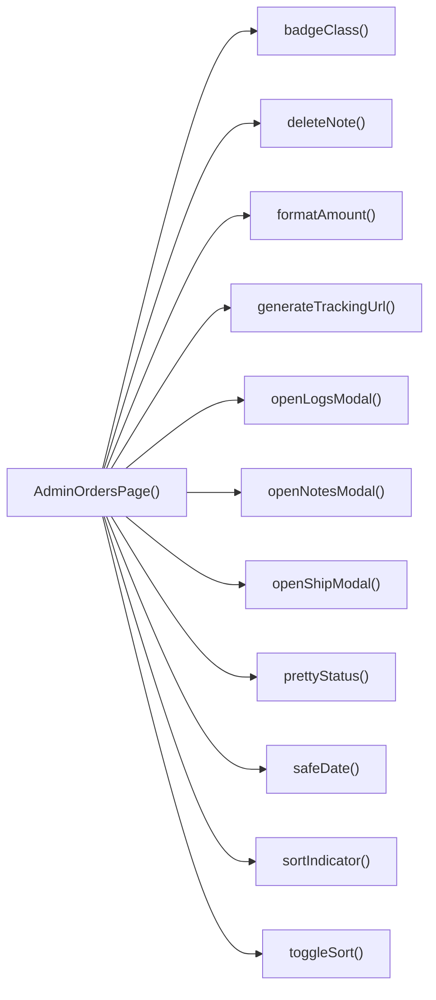

## Genel Bakış
Bu modül, VentHub HVAC sisteminin yönetici paneli için tüm siparişlerin görüntülenmesi ve yönetilmesini sağlayan ana React bileşenini barındırır. Yöneticilerin siparişleri sıralama, kargo durumunu güncelleme, siparişlere not ekleme, işlem günlüklerini görüntüleme gibi tüm yönetim işlemlerini tek bir arayüzden gerçekleştirmesine olanak tanır. Hem ana sayfa işlevlerini hem de verileri kullanıcı dostu formata dönüştüren yardımcı araçları tek modülde toplar.

## Fonksiyon Grupları
### Ana Sayfa Bileşeni
Tüm yönetici siparişleri sayfasının arka planını oluşturan, tüm alt işlevleri entegre eden ana bileşendir.
- AdminOrdersPage

### Modal Yönetimi Fonksiyonları
Kargo onayı, işlem günlükleri ve sipariş notları gibi ayrı açılır pencerelerin (modallerin) açılıp kapanma işlemlerini yönetir.
- openShipModal, closeShipModal, openLogsModal, closeLogsModal, openNotesModal, closeNotesModal

### Sipariş İşlem Fonksiyonları
Siparişler üzerinde değişiklik yapma işlemlerini gerçekleştirir, not yönetiminden kargo süreçlerinin yönetilmesine kadar tüm aksiyonları kapsar.
- addNote, deleteNote, submitShip, bulkCancelShipping

### Sıralama ve Veri Dışa Aktarma Fonksiyonları
Sipariş listesinin istenen kritere göre sıralanmasını sağlar ve tüm sipariş verilerinin CSV formatında dışa aktarılmasına imkan sunar.
- toggleSort, sortIndicator, exportCsv

### Yardımcı Formatlama Fonksiyonları
Para tutarları, tarihler ve sipariş durumları gibi ham verileri kullanıcı dostu formata dönüştürür, kargo takip bağlantıları oluşturur gibi ortak destek işlerini yerine getirir.
- formatAmount, safeDate, prettyStatus, badgeClass, generateTrackingUrl

---

## AXIOMS – Mimari Varsayımlar
Bu modül, VentHub HVAC platformu admin paneli sipariş yönetim sayfasıdır; tüm işlevlerinin sorunsuz çalışması için sayfa içi state yönetimlerinin, backend API erişiminin ve kullanıcı arayüzü için gerekli kaynakların sürekli olarak erişilebilir olması zorunludur.

[Aksiyom 1]: Eğer tüm modal (gönderim, loglar, notlar) işlevleri için sayfa içi React durumları (açık/kapalı durumu, ilişkili sipariş kimliği) yoksa, hiçbir modal düzgün şekilde açılamaz veya kapanamaz, sayfa işlevselliği bozulur.
[Aksiyom 2]: Eğer addNote, deleteNote, submitShip, bulkCancelShipping gibi işlem fonksiyonları için gerekli backend API uç noktalarına erişim yoksa, not ekleme/silme, gönderim kaydetme, toplu gönderim iptali gibi işlemler hiçbir şekilde gerçekleştirilemez.
[Aksiyom 3]: Eğer exportCsv fonksiyonu için gerekli CSV formatlama kütüphanesi ve tarayıcı dosya indirme yeteneği yoksa, sipariş verileri CSV formatında dışarı aktarılamaz.
[Aksiyom 4]: Eğer toggleSort ve sortIndicator fonksiyonları için tanımlı sıralama durumu (sıralama anahtarı, sıralama yönü) yoksa, sipariş listesi hiçbir kritere göre sıralanamaz, sıralama göstergesi görüntülenemez.
[Aksiyom 5]: Eğer formatAmount, safeDate, prettyStatus gibi formatlama fonksiyonlarına parametre olarak geçilen dil (Lang) tipinde tanımlı yerelleştirme kaynakları yoksa, tutar, tarih, sipariş durumu gibi değerler kullanıcıya doğru şekilde görüntülenemez.
[Aksiyom 6]: Eğer prettyStatus fonksiyonuna parametre olarak geçilen çeviri fonksiyonu (t) yoksa, tüm sipariş durumları kullanıcının dilinde çevrilerek gösterilemez.
[Aksiyom 7]: Eğer generateTrackingUrl fonksiyonu için kargo firmalarına özel takip URL şablonları tanımlı değilse, geçerli kargo takip linkleri oluşturulamaz.

---

## FONKSIYON DETAYLARI

### AdminOrdersPage
**Ne yapar**: VentHub HVAC sisteminin yönetici panelinde tüm siparişlerin görüntülendiği ve yönetildiği ana sayfa bileşenidir. Tüm sipariş odaklı işlemlerin merkezi olarak çalıştığı, kullanıcı arayüzünü oluşturan React bileşenidir.
**Nasıl yapar**: React.FC tipi ile tanımlanarak sayfa içindeki tüm modalların açık/kapalı durumlarını yönetir, sipariş listesini yükleyip kullanıcıya sunar ve tüm sayfa içi etkileşimleri ilgili işlevlere yönlendirir.
**Parametreler**:
- Herhangi bir giriş parametresi almaz
**Dönüş**: React.FC — Çizdirilebilir React sayfa bileşeni döndürür

### openShipModal
**Ne yapar**: Belirli bir sipariş için kargo gönderimi işlemlerinin yapıldığı modal penceresini açan işlevdir. Yöneticinin seçilen siparişin kargo bilgilerini girmesini sağlayan arayüzü aktif hale getirir.
**Nasıl yapar**: İlgili siparişin benzersiz kimliğini alarak modalın görünürlük durumunu true yapar, seçilen siparişin temel verilerini modal içindeki form alanlarına yükler.
**Parametreler**:
- id: string — Kargo modalının açılacağı ilgili siparişin benzersiz kimliği
**Dönüş**: void — Herhangi bir değer döndürmez, yalnızca bileşen içi durum güncellemesi yapar

### closeShipModal
**Ne yapar**: Açık durumdaki kargo gönderimi modal penceresini kapatır. Kargo işlemi iptal edildiğinde veya tamamlandığında modalı arayüzden kaldırır.
**Nasıl yapar**: Kargo modalının görünürlük durumunu false yapar, formda girilen kaydedilmemiş geçici verileri sıfırlar, bileşen durumunu başlangıç haline getirir.
**Parametreler**:
- Herhangi bir giriş parametresi almaz
**Dönüş**: void — Herhangi bir değer döndürmez, yalnızca bileşen içi durum güncellemesi yapar

### openLogsModal
**Ne yapar**: Belirli bir siparişe ait tüm işlem günlüklerinin görüntülendiği modal penceresini açan işlevdir. Yöneticinin siparişin geçmiş işlemlerini incelemesini sağlar.
**Nasıl yapar**: İlgili siparişin kimliğini alarak günlüklerin yükleneceği kaynağı belirler, modalın görünürlük durumunu aktif hale getirir ve ilgili siparişin günlüklerini servis üzerinden çekerek görüntülemeye hazırlar.
**Parametreler**:
- id: string — Günlükleri görüntülenecek ilgili siparişin benzersiz kimliği
**Dönüş**: void — Herhangi bir değer döndürmez, yalnızca bileşen içi durum güncellemesi yapar

### closeLogsModal
**Ne yapar**: Açık durumdaki işlem günlükleri modal penceresini kapatır. Günlük inceleme işlemi bittiğinde modalı arayüzden kaldırır.
**Nasıl yapar**: Günlükler modalının görünürlük durumunu false yapar, bellekte tutulan geçici günlük verilerini temizler.
**Parametreler**:
- Herhangi bir giriş parametresi almaz
**Dönüş**: void — Herhangi bir değer döndürmez, yalnızca bileşen içi durum güncellemesi yapar

### openNotesModal
**Ne yapar**: Belirli bir siparişe ait özel notların görüntülendiği ve yeni not eklenebildiği modal penceresini açan işlevdir. Yöneticinin sipariş üzerine not almasını veya mevcut notları düzenlemesini sağlar.
**Nasıl yapar**: İlgili siparişin kimliğini alarak mevcut notların servisten çekilmesini sağlar, modalın görünürlük durumunu aktif hale getirir ve not ekleme formunu kullanıma sunar.
**Parametreler**:
- id: string — Notları yönetilecek ilgili siparişin benzersiz kimliği
**Dönüş**: void — Herhangi bir değer döndürmez, yalnızca bileşen içi durum güncellemesi yapar

### closeNotesModal
**Ne yapar**: Açık durumdaki not yönetimi modal penceresini kapatır. Not ekleme veya inceleme işlemi bittiğinde modalı arayüzden kaldırır.
**Nasıl yapar**: Notlar modalının görünürlük durumunu false yapar, formda girilen kaydedilmemiş not verisini sıfırlar, mevcut not listesinin geçici kopyasını temizler.
**Parametreler**:
- Herhangi bir giriş parametresi almaz
**Dönüş**: void — Herhangi bir değer döndürmez, yalnızca bileşen içi durum güncellemesi yapar

### addNote
**Ne yapar**: Not yönetimi modalında yönetici tarafından girilen yeni notun sisteme kaydedilmesini sağlayan işlevdir. Girilen notu ilgili siparişe ekleyerek kalıcı olarak saklar.
**Nasıl yapar**: Formdaki not metnini alır, doğrular ve ilgili servise göndererek kayıt işlemini tamamlar, ardından sayfadaki not listesini güncelleyerek yeni eklenen notu görüntüler.
**Parametreler**:
- Herhangi bir giriş parametresi almaz
**Dönüş**: void — Herhangi bir değer döndürmez, yalnızca veri kaydetme ve durum güncellemesi işlemlerini yürütür

### deleteNote
**Ne yapar**: Sistemde kayıtlı mevcut bir notun silinmesini sağlayan işlevdir. Yöneticinin gereksiz gördüğü notu siparişten kalıcı olarak kaldırmasını sağlar.
**Nasıl yapar**: Silinecek notun benzersiz kimliğini alarak ilgili silme servisini çağırır, işlem başarılı olursa siparişin not listesinden silinen kaydı kaldırarak arayüzü günceller.
**Parametreler**:
- noteId: string — Silinecek notun benzersiz kimliği
**Dönüş**: void — Herhangi bir değer döndürmez, yalnızca veri silme ve durum güncellemesi işlemlerini yürütür

### submitShip
**Ne yapar**: Kargo gönderimi modalında girilen kargo bilgilerinin kaydedilmesini ve siparişin durumunu "kargoya verildi" olarak güncelleyen işlevdir. Kargo gönderim işlemini tamamlar.
**Nasıl yapar**: Formdaki kargo takip numarası gibi zorunlu alanları doğrular, tüm bilgiler geçerliyse ilgili servise göndererek siparişin durumunu günceller, işlem başarılı olursa kargo modalını otomatik olarak kapatır ve sipariş listesini günceller.
**Parametreler**:
- Herhangi bir giriş parametresi almaz
**Dönüş**: void — Herhangi bir değer döndürmez, yalnızca sipariş durumu güncelleme ve durum yönetimi işlemlerini yürütür

---


### toggleSort
**Ne yapar**: Admin sipariş listesinin sıralama yönünü, seçilen sütun anahtarına göre değiştiren yerel durum yönetimi fonksiyonudur. Sıralama mantığını tetikleyerek sipariş listesinin güncel sırayla yeniden yüklenmesini sağlar.
**Nasıl yapar**: Aktif olarak kullanılan sıralama anahtarını mevcut component durumu üzerinden kontrol eder. Eğer aynı anahtar tekrar tetiklenirse mevcut sıralama yönünü (artan/azalan) tersine çevirir, farklı bir anahtar seçilirse varsayılan sıralama yönü ile yeni sütuna göre sıralamayı başlatır.
**Parametreler**:
- key: SortKey — Sıralama işleminin uygulanacağı sütunu temsil eden, tipleştirilmiş sıralama anahtarı
**Dönüş**: Herhangi bir değer döndürmez, yalnızca component içi durum değişikliği gerçekleştirir, return tipi olarak void tanımlanmıştır.

### sortIndicator
**Ne yapar**: Sıralama yapılan sütun başlığında gösterilecek olan yön sembolünü, mevcut sıralama durumuna göre üreten UI yardımcı fonksiyonudur. Kullanıcıya aktif sıralamanın yönünü görsel olarak bildirir.
**Nasıl yapar**: Component durumu içerisinde tutulan mevcut sıralama yönü (sortDir) değerini okur, ilgili sıralama anahtarının aktif olup olmadığını kontrol eder. Eğer anahtar aktifse sıralama yönüne göre ok sembolünü döndürür.
**Parametreler**:
- key: SortKey — Yön sembolünün hangi sıralama anahtarı için gösterileceğini belirten sütun anahtarı
**Dönüş**: string tipinde sembol değeri döndürür. Sıralama yönü 'asc' (artan) ise '▲' sembolünü, 'desc' (azalan) ise '▼' sembolünü döndürür.

### bulkCancelShipping
**Ne yapar**: Admin tarafından seçilen birden fazla siparişin kargolama işlemini toplu olarak iptal etme işlemini yöneten iş akışı fonksiyonudur. Toplu işlem yetkisi olan admin kullanıcıların çoklu sipariş üzerinde aynı anda işlem yapmasını sağlar.
**Nasıl yapar**: Component içerisinde kullanıcının işaretlediği seçili sipariş kimlikleri listesini alır, bu listeyi backend API'sine toplu iptal isteği ile gönderir. İşlem sonrası kullanıcıya başarı veya hata bildirimi gösterir, ardından güncel sipariş listesini yeniden yükler.
**Parametreler**: Hiçbir harici parametre almaz, yalnızca component içi yerel durumda tutulan seçili sipariş listesini kullanır.
**Dönüş**: Herhangi bir değer döndürmez, yalnızca işlem akışını yönetir, return tipi olarak void tanımlanmıştır.

### exportCsv
**Ne yapar**: Ekranda mevcut olan filtrelenmiş ve sıralanmış tüm sipariş verilerini CSV formatında indirme işlemini tetikleyen fonksiyondur. Admin kullanıcıların sipariş verilerini dışa aktarmasını sağlar.
**Nasıl yapar**: Component içerisinde tutulan güncel sipariş listesini alır, CSV formatına uygun şekilde sütun ve satır yapısına dönüştürür. Oluşturulan veri blobunu tarayıcıya ileterek otomatik indirme işlemini başlatır.
**Parametreler**: Hiçbir harici parametre almaz, yalnızca component içindeki mevcut sipariş verilerini kullanır.
**Dönüş**: Herhangi bir değer döndürmez, yalnızca indirme işlemini tetikler, return tipi olarak void tanımlanmıştır.

### formatAmount
**Ne yapar**: Finansal tutarları kullanıcının dil ayarına göre formatlayan para birimi yardımcı fonksiyonudur. Tutarların yerel ayarlara uygun olarak gösterilmesini sağlar, eksik veri durumlarında güvenli gösterim sunar.
**Nasıl yapar**: Gelen tutar değerinin null, undefined veya geçersiz bir değer olup olmadığını kontrol eder. Eğer geçerli bir sayı değilse varsayılan gösterim metnini döndürür, geçerli bir sayı ise belirtilen dil ayarına göre para formatına çevirir.
**Parametreler**:
- v?: number | null — Formatlanacak para tutarı, opsiyonel olarak null veya undefined değer alabilir
- lang: Lang — Tutarın formatlanacağı dil ve yerel ayarları temsil eden, tipleştirilmiş locale nesnesi
**Dönüş**: string tipinde formatlanmış tutar değeri döndürür. Eğer geçerli bir tutar girilmemişse '-' karakterini döndürür.

### safeDate
**Ne yapar**: ISO formatındaki tarih stringini kullanıcının dil ayarına göre güvenli bir şekilde formatlayan tarih yardımcı fonksiyonudur. Hatalı veya geçersiz tarih girişlerinde uygulamanın çökmesini önler, yerelleştirilmiş tarih gösterimi sunar.
**Nasıl yapar**: Gelen ISO tarih stringinin geçerliliğini Date nesnesi ile kontrol eder, geçersiz tarihlerde varsayılan bir gösterim sunar. Geçerli tarihler için belirtilen dil ayarına göre yerelleştirilmiş, okunabilir bir tarih formatı üretir.
**Parametreler**:
- iso: string — Formatlanacak ISO 8601 standardına uygun tarih stringi
- lang: Lang — Tarihin formatlanacağı dil ve yerel ayarları temsil eden, tipleştirilmiş locale nesnesi
**Dönüş**: Herhangi bir değer döndürdüğü açıkça belirtilmemiştir, yalnızca component içerisinde kullanılmak üzere tarih formatlama işlemini gerçekleştirir.

### prettyStatus
**Ne yapar**: Siparişlerin sistemdeki ham durum anahtarını kullanıcı dostu, yerelleştirilmiş bir metne dönüştüren durum formatlama fonksiyonudur. Farklı dillerde doğru durum metinlerinin gösterilmesini sağlar.
**Nasıl yapar**: Uygulamanın uluslararasılaştırma sistemi için kullanılan çeviri fonksiyonunu çağırarak, ham durum anahtarını ilgili dildeki karşılığı ile değiştirir. Gerekirse durum metni içine dinamik parametreler ekleyerek kişiselleştirilmiş gösterim sunar.
**Parametreler**:
- s: string — Çevrilecek ve formatlanacak ham sipariş durumu anahtarı
- t: (key: string, params?: Record<string, unknown>) => string — Uygulamanın çeviri sistemi tarafından kullanılan, anahtar ve opsiyonel parametre alarak yerelleştirilmiş metin döndüren çeviri fonksiyonu
**Dönüş**: Herhangi bir değer döndürdüğü açıkça belirtilmemiştir, yalnızca component içerisinde kullanılmak üzere yerelleştirilmiş durum metni üretir.

### badgeClass
**Ne yapar**: Sipariş durumu stringine göre UI'da kullanılacak durum etiketi (badge) bileşeninin CSS sınıfını belirleyen stil yardımcı fonksiyonudur. Farklı durumların farklı renk ve stillerde gösterilmesini sağlar.
**Nasıl yapar**: Gelen durum anahtarını kontrol ederek, duruma özel olarak tanımlanmış renk, doluluk ve kenarlık stillerini içeren CSS sınıfını atar. Bu sayede örneğin iptal edilen siparişler kırmızı, tamamlanan siparişler yeşil renkte gösterilir.
**Parametreler**:
- s: string — CSS sınıfının belirleneceği ham sipariş durumu anahtarı
**Dönüş**: Herhangi bir değer döndürdüğü açıkça belirtilmemiştir, yalnızca component içerisinde kullanılmak üzere duruma uygun CSS sınıfı üretir.

### generateTrackingUrl
**Ne yapar**: Kargo firması ve takip numarasına göre erişilebilir kargo takip bağlantısı üreten entegrasyon yardımcı fonksiyonudur. Admin kullanıcıların doğrudan sipariş üzerinden kargo takibine yönlenmesini sağlamak için tasarlanmıştır.
**Nasıl yapar**: Desteklenen kargo firmaları listesini kontrol ederek, ilgili firmanın resmi takip sayfası URL'sine takip numarasını ekleyerek tam erişilebilir bir bağlantı üretmesi planlanmıştır.
**Parametreler**:
- carrier: string — Kargo firmasının kimliğini temsil eden string
- tracking: string — Siparişe ait kargo takip numarası
**Dönüş**: Şu anda her zaman null değeri döndürmektedir, geliştirme süreci tamamlandığında üretilmiş tam takip URL'sini string olarak döndürmesi planlanmaktadır.

---

## INTERFACES

### AdminOrderRow
- `id: string`
- `status: 'pending' | 'paid' | 'confirmed' | 'shipped' | 'cancelled' | 'refunded' | 'partial_refunded' | string`
- `conversation_id?: string | null`
- `total_amount?: number | null`
- `created_at: string`
- `order_number?: string | null`
- `customer_name?: string | null`
- `customer_email?: string | null`
- `customer_phone?: string | null`

---

## TYPE ALIASES

### SortKey
```typescript
type SortKey = 'id' | 'status' | 'conversation' | 'amount' | 'created'
```

---

## AST POINTERS

### [N1_NASIL] AST Pointer: C:\Users\alize\venthub-hvac\src\views\admin\AdminOrdersPage.tsx::anonim_durum_filtre_options_üretici
- **params**: (parametre yok)
- **ic_degiskenler**:
  - `t` — Yerelleştirme/çeviri fonksiyonu, durum etiketlerini arayüzde doğru dilde göstermek için kullanılır
  - `value` — Her filtre seçeneğinin arka planda kullanılan benzersiz değeri
  - `label` — Her filtre seçeneğinin kullanıcıya gösterilen okunabilir etiketi
- **Dönüş**: 7 elemanlı durum filtresi seçenekleri dizisi

### [N2_NASIL] AST Pointer: C:\Users\alize\venthub-hvac\src\views\admin\AdminOrdersPage.tsx::anonim_aktif_filtre_kontrolü
- **params**: (parametre yok)
- **ic_degiskenler**:
  - `typeof window` — Sunucu tarafı (SSR) çalışma kontrolü için window nesnesinin tip kontrolü
  - `window.location.search` — Tarayıcı adres çubuğundaki sorgu parametreleri stringi
  - `URLSearchParams` — Sorgu parametrelerini işlemek için JS yerleşik sınıfı
  - `qs` — Oluşturulan URLSearchParams nesnesi
  - `qs.get('q')` -> Adresteki arama sorgusu parametresinin değeri
  - `qs.get('preset')` -> Adresteki ön ayarlı filtre parametresinin değeri
- **Dönüş**: boolean, aktif filtre uygulanıp uygulanmadığını belirtir

### [N3_NASIL] AST Pointer: C:\Users\alize\venthub-hvac\src\views\admin\AdminOrdersPage.tsx::anonim_debounce_temizleyici
- **params**: (parametre yok)
- **ic_degiskenler**:
  - `setTimeout` — Zamanlayıcı oluşturmak için yerleşik fonksiyon
  - `setDebouncedQuery` — Sorgu gecikmesini ayarlayan state setter fonksiyonu
  - `query` — Kullanıcının girdiği ham arama sorgusu
  - `t` — Oluşturulan zamanlayıcı kimliği
  - `clearTimeout` — Zamanlayıcıyı iptal etmek için yerleşik fonksiyon
- **Dönüş**: Temizleme fonksiyonu (efekt temizleyicisi)

### [N4_NASIL] AST Pointer: C:\Users\alize\venthub-hvac\src\views\admin\AdminOrdersPage.tsx::anonim_ilk_deeplink_uygulayıcı
- **params**: (parametre yok)
- **ic_degiskenler**:
  - `deepLinkAppliedRef.current` -> DeepLink'in daha önce uygulanıp uygulanmadığını tutan ref değeri
  - `typeof window` — SSR çalışma kontrolü
  - `window.location.search` — Adres sorgu parametreleri
  - `URLSearchParams` — Sorgu parametrelerini işleyen sınıf
  - `urlParams` — Oluşturulan URLSearchParams nesnesi
  - `preset` -> Adresten alınan ön ayar parametresi değeri
  - `setPresetPendingShipments` — Bekleyen gönderi filtresi state setter'ı
  - `setStatus` — Seçili durum filtresi state setter'ı
  - `qParam` -> Adresten alınan arama sorgusu değeri
  - `setQuery` — Ham arama sorgusu state setter'ı
  - `setDebouncedQuery` — Geciktirilmiş arama sorgusu state setter'ı
- **Dönüş**: void (erken dönüşler haricinde dönüş yok)

### [N5_NASIL] AST Pointer: C:\Users\alize\venthub-hvac\src\views\admin\AdminOrdersPage.tsx::anonim_searchparams_senkronizatörü
- **params**: (parametre yok)
- **ic_degiskenler**:
  - `searchParams` — Next.js gibi framework'lerden gelen arama parametreleri nesnesi
  - `deepLinkAppliedRef.current` -> DeepLink uygulama durumunu tutan ref
  - `preset` -> searchParams'tan alınan ön ayar değeri
  - `isPending` -> Bekleyen gönderi filtresinin aktif olup olmadığını belirten boolean
  - `setPresetPendingShipments` — Bekleyen gönderi filtresi state setter'ı
  - `setStatus` — Durum filtresi state setter'ı
  - `qParam` -> searchParams'tan alınan arama sorgusu değeri
  - `setQuery` — Ham arama sorgusu state setter'ı
  - `setDebouncedQuery` — Geciktirilmiş arama sorgusu state setter'ı
- **Dönüş**: void (erken dönüşler haricinde dönüş yok)

### [N6_NASIL] AST Pointer: C:\Users\alize\venthub-hvac\src\views\admin\AdminOrdersPage.tsx::anonim_fetch_orders
- **params**: (parametre yok)
- **ic_degiskenler**:
  - `lastFetchId.current` -> Son sipariş getirme işleminin kimliğini tutan ref
  - `fetchId` -> Mevcut getirme işleminin benzersiz kimliği
  - `setLoading` — Yükleme durumu state setter'ı
  - `ensureSessionFresh` — Kullanıcı oturumunun geçerliliğini kontrol eden fonksiyon
  - `supabase` — Supabase veritabanı istemcisi
  - `qb` — Sorgu oluşturucu nesnesi, tüm filtreleri eklemek için kullanılır
  - `presetPendingShipments` — Bekleyen gönderi filtresinin aktif durumu
  - `status` — Seçili durum filtresi değeri
  - `debouncedQuery` — Geciktirilmiş arama sorgusu değeri
  - `dateRange?.from` -> Tarih aralığının başlangıç tarihi
  - `dateRange?.to` -> Tarih aralığının bitiş tarihi
  - `endOfDay` — Bitiş tarihinin gün sonu değerini hesaplayan fonksiyon
  - `page` -> Mevcut sayfa numarası
  - `PAGE_SIZE` — Sayfa başına düşen sipariş sayısı sabiti
  - `offset` -> Veritabanı sorgusu için başlangıç indeksi
  - `data` -> Veritabanından dönen sipariş verisi
  - `count` -> Toplam eşleşen sipariş sayısı
  - `fetchErr` -> Sorgu sırasında oluşan hata nesnesi
  - `setRows` — Getirilen sipariş satırlarını ayarlayan state setter'ı
  - `setTotal` — Toplam sipariş sayısını ayarlayan state setter'ı
  - `toast.error` — Hata bildirimi gösterme fonksiyonu
  - `t` — Çeviri fonksiyonu, hata mesajını yerelleştirir
- **Dönüş**: void (async fonksiyon, Promise<void> dönüşü)

### [N7_NASIL] AST Pointer: C:\Users\alize\venthub-hvac\src\views\admin\AdminOrdersPage.tsx::anonim_gorunum_modu_degisikligi_tetikleyicisi
- **params**: (parametre yok)
- **ic_degiskenler**:
  - `viewMode` -> Mevcut görünüm modu (list olarak kontrol edilir)
  - `fetchOrders` — Siparişleri getiren async fonksiyon
- **Dönüş**: void

### [N8_NASIL] AST Pointer: C:\Users\alize\venthub-hvac\src\views\admin\AdminOrdersPage.tsx::openShipModal
- **params**: id: string
- **ic_degiskenler**:
  - `setBulkMode` — Toplu işlem modunu kapatan state setter'ı
  - `setShipId` — İşlem yapılacak siparişin ID'sini ayarlayan state setter'ı
  - `setCarrier` — Kargo firması değerini sıfırlayan state setter'ı
  - `setTracking` — Takip numarası değerini sıfırlayan state setter'ı
  - `setSendEmail` — Email gönderim durumunu varsayılan olarak açık ayarlayan state setter'ı
  - `supabase` — Supabase veritabanı istemcisi
  - `data` -> Veritabanından dönen mevcut kargo bilgileri
  - `dto` -> Tip dönüşümü yapılmış kargo bilgisi nesnesi
  - `setShipOpen` — Kargo modalını açan state setter'ı
- **Dönüş**: yok (async Promise<void>)

### [N9_NASIL] AST Pointer: C:\Users\alize\venthub-hvac\src\views\admin\AdminOrdersPage.tsx::anonim_toplu_gonderi_hesaplayici
- **params**: (parametre yok)
- **ic_degiskenler**:
  - `shipOpen` -> Kargo modalının açık olma durumu
  - `bulkMode` -> Toplu işlem modunun aktif olma durumu
  - `setAdvRows` — Toplu işlem için seçilen siparişlerin satır verisini ayarlayan state setter'ı
  - `selectedIds` -> Toplu işlem için seçilen tüm sipariş ID'leri dizisi
  - `id` -> Her seçili siparişin ID'si
  - `setAdvBulk` — Gelişmiş toplu işlem modunu kapatan state setter'ı
- **Dönüş**: void

### [N10_NASIL] AST Pointer: C:\Users\alize\venthub-hvac\src\views\admin\AdminOrdersPage.tsx::openLogsModal
- **params**: id: string
- **ic_degiskenler**:
  - `setLogsOpen` — Log modalını açan state setter'ı
  - `setLogsLoading` — Log yükleme durumunu aktif yapan state setter'ı
  - `supabase` — Supabase veritabanı istemcisi
  - `data` -> Veritabanından dönen email log verisi
  - `error` -> Sorgu sırasında oluşan hata nesnesi
  - `setEmailLogs` — Getirilen logları state'e kaydeden setter
  - `toast.error` — Hata bildirimi gösterme fonksiyonu
  - `t` — Çeviri fonksiyonu, hata mesajını yerelleştirir
  - `setLogsLoading` — Yükleme durumunu kapatan son olarak çalışan state setter'ı
- **Dönüş**: yok (async Promise<void>)

## AST POINTERS

### [N1_NASIL] AST Pointer: C:\Users\alize\venthub-hvac\src\views\admin\AdminOrdersPage.tsx::openNotesModal
- **params**: [id: string]
- **ic_degiskenler**:
  - `setNotesOrderId` — Notlar modalı açılırken ilgili siparişin ID'sini state'e kaydeden setter fonksiyonu
  - `setNotesOpen` — Notlar modalının görünürlüğünü aktifleştiren state setter
  - `supabase` — Supabase veritabanı istemcisi, order_notes tablosundan veri çekmek için kullanılır
  - `data` — Supabase'den dönen sipariş notları listesini tutan nesne
  - `error` — Veritabanı sorgusu sırasında oluşan hatayı tutan nesne
  - `setNotes` — Çekilen notları state'e kaydeden setter fonksiyonu
  - `toast` — Hata durumunda kullanıcıya bildirim göstermek için kullanılan kütüphane
  - `t` — Çeviri fonksiyonu, hata mesajını yerelleştirmek için kullanılır
- **Dönüş**: yok

### [N2_NASIL] AST Pointer: C:\Users\alize\venthub-hvac\src\views\admin\AdminOrdersPage.tsx::addNote
- **params**: (parametre yok)
- **ic_degiskenler**:
  - `notesOrderId` — Not modalı açık olan mevcut siparişin ID'sini tutan state değişkeni
  - `noteInput` — Kullanıcının girdiği yeni not metnini tutan state değişkeni
  - `supabase` — Supabase istemcisi, yeni notu order_notes tablosuna eklemek için kullanılır
  - `data` — Eklenen notun veritabanından dönen detaylarını tutan nesne
  - `error` — Not ekleme işlemi sırasında oluşan hatayı tutan nesne
  - `setNotes` — Yeni eklenen notu mevcut not listesine ekleyen state setter
  - `setNoteInput` — Not giriş alanını temizleyen state setter
  - `toast` — İşlem sonucu bildirimi göstermek için kullanılan kütüphane
  - `t` — Çeviri fonksiyonu, hata mesajını yerelleştirmek için kullanılır
- **Dönüş**: yok

### [N3_NASIL] AST Pointer: C:\Users\alize\venthub-hvac\src\views\admin\AdminOrdersPage.tsx::deleteNote
- **params**: [noteId: string]
- **ic_degiskenler**:
  - `supabase` — Supabase istemcisi, belirtilen ID'li notu order_notes tablosundan silmek için kullanılır
  - `error` — Silme işlemi sırasında oluşan hatayı tutan nesne
  - `setNotes` — Silinen notu listeden çıkararak not listesini güncelleyen state setter
  - `toast` — İşlem başarı/başarısızlık bildirimi göstermek için kullanılan kütüphane
  - `t` — Çeviri fonksiyonu, tüm bildirim metinlerini yerelleştirmek için kullanılır
- **Dönüş**: yok

### [N4_NASIL] AST Pointer: C:\Users\alize\venthub-hvac\src\views\admin\AdminOrdersPage.tsx::submitShip
- **params**: (parametre yok)
- **ic_degiskenler**:
  - `bulkMode` — Toplu sevkiyat modunun aktif olup olmadığını belirten state değişkeni
  - `shipId` — Tekli modda sevkiyatı güncellenecek siparişin ID'sini tutan state değişkeni
  - `rows` — Tüm sipariş satırlarını içeren ana liste state'i
  - `curRow` — Güncellenecek tekli siparişin satır verisini tutan geçici değişken
  - `isShipped` — Siparişin zaten sevk edilmiş olup olmadığını kontrol eden boolean değişken
  - `carrier` — Girilen kargo firması bilgisini tutan state değişkeni
  - `tracking` — Girilen kargo takip numarasını tutan state değişkeni
  - `alert` — Eksik alan durumunda kullanıcıya uyarı göstermek için kullanılan tarayıcı fonksiyonu
  - `t` — Çeviri fonksiyonu, tüm uyarı/bildirim metinlerini yerelleştirmek için kullanılır
  - `generateTrackingUrl` — Kargo ve takip numarasından geçerli takip URL'si oluşturan yardımcı fonksiyon
  - `supabase` — Supabase istemcisi, edge function'ı çağırmak ve işlem kaydı eklemek için kullanılır
  - `turl` — Oluşturulan takip URL'sini tutan geçici değişken
  - `fnErr` — Edge function çağrısı sırasında oluşan hatayı tutan nesne
  - `logAdminAction` — Yönetici işlemlerini veritabanına kaydeden yardımcı fonksiyon
  - `setRows` — Sevkiyat durumu güncellenen siparişleri ana listede güncelleyen state setter
  - `setShipOpen` — Sevkiyat modalını kapatan state setter
  - `toast` — İşlem sonucu bildirimleri göstermek için kullanılan kütüphane
  - `sendEmail` — Sipariş sahibine bildirim e-postası gönderilip gönderilmeyeceğini belirten state değişkeni
  - `targets` — Toplu modda sevkiyatı güncellenecek seçili, sevk edilmemiş siparişlerin ID listesi
  - `setSelectedIds` — Toplu işlem sonrası seçili ID listesini sıfırlayan state setter
  - `setBulkMode` — Toplu modu kapatan state setter
  - `advBulk` — Gelişmiş toplu sevkiyat modunun aktif olup olmadığını belirten state değişkeni
  - `advRows` — Gelişmiş modda her sipariş için ayrı girilen kargo/takip bilgilerini tutan satır listesi
  - `mapById` — Gelişmiş moddaki satırları ID'ye göre eşlemek için oluşturulan Map nesnesi
  - `invalid` — Gelişmiş modda eksik bilgiye sahip siparişlerin ID listesi
  - `Promise.all` — Tüm toplu işlemleri eş zamanlı çalıştıran yerleşik fonksiyon
- **Dönüş**: yok

### [N5_NASIL] AST Pointer: C:\Users\alize\venthub-hvac\src\views\admin\AdminOrdersPage.tsx::anon_bulk_single_update
- **params**: [id: string]
- **ic_degiskenler**:
  - `supabase` — Supabase istemcisi, admin-update-shipping edge function'ını çağırmak için kullanılır
  - `carrier` — Toplu modda girilen ortak kargo firması bilgisi
  - `tracking` — Toplu modda girilen ortak takip numarası bilgisi
  - `turl` — Oluşturulan ortak takip URL'si
  - `sendEmail` — E-posta gönderim durumu
  - `fnErr` — Edge function çağrısı sırasında oluşan hatayı tutan nesne
- **Dönüş**: {id: string, ok: boolean}

### [N6_NASIL] AST Pointer: C:\Users\alize\venthub-hvac\src\views\admin\AdminOrdersPage.tsx::anon_adv_row_validator
- **params**: [id: string]
- **ic_degiskenler**:
  - `mapById` — ID'ye göre gelişmiş mod satırlarını saklayan Map nesnesi
  - `row` — Doğrulanacak siparişin gelişmiş moddaki satır verisi
- **Dönüş**: boolean (satırın geçersiz olup olmadığını belirtir)

### [N7_NASIL] AST Pointer: C:\Users\alize\venthub-hvac\src\views\admin\AdminOrdersPage.tsx::anon_adv_bulk_single_update
- **params**: [id: string]
- **ic_degiskenler**:
  - `mapById` — ID'ye göre gelişmiş mod satırlarını saklayan Map nesnesi
  - `row` — Güncellenecek siparişin gelişmiş moddaki satır verisi
  - `generateTrackingUrl` — Satırdaki kargo ve takip bilgisinden takip URL'si oluşturan yardımcı fonksiyon
  - `turl` — Oluşturulan takip URL'si
  - `supabase` — Supabase istemcisi, admin-update-shipping edge function'ını çağırmak için kullanılır
  - `fnErr` — Edge function çağrısı sırasında oluşan hatayı tutan nesne
  - `sendEmail` — E-posta gönderim durumu
- **Dönüş**: {id: string, ok: boolean}

### [N8_NASIL] AST Pointer: C:\Users\alize\venthub-hvac\src\views\admin\AdminOrdersPage.tsx::anon_sorted_rows_generator
- **params**: (parametre yok)
- **ic_degiskenler**:
  - `rows` — Orijinal sıralanmamış sipariş listesi
  - `arr` — Orijinal listenin kopyası, sıralama işlemi bu kopya üzerinde yapılır
  - `sortDir` — Sıralama yönünü (asc/desc) belirten state değişkeni
  - `dir` — Sıralama katsayısı, ascend için 1, descend için -1 olarak ayarlanır
  - `sortKey` — Hangi alana göre sıralama yapılacağını belirten state değişkeni
- **Dönüş**: Sıralanmış sipariş listesi

### [N9_NASIL] AST Pointer: C:\Users\alize\venthub-hvac\src\views\admin\AdminOrdersPage.tsx::anon_sort_comparator
- **params**: [a: Order, b: Order]
- **ic_degiskenler**:
  - `sortDir` — Sıralama yönünü belirten state değişkeni
  - `dir` — Sıralama katsayısı, ascend için 1, descend için -1
  - `sortKey` — Sıralama yapılacak alanı belirten state değişkeni
  - `Date.parse` — ISO tarih formatını timestamp'e çevirerek tarih karşılaştırması yapan yerleşik fonksiyon
- **Dönüş**: Sıralama için sayısal karşılaştırma sonucu

### [N10_NASIL] AST Pointer: C:\Users\alize\venthub-hvac\src\views\admin\AdminOrdersPage.tsx::toggleSort
- **params**: [key: SortKey]
- **ic_degiskenler**:
  - `sortKey` — Mevcut aktif sıralama anahtarını tutan state değişkeni
  - `setSortDir` — Sıralama yönünü güncelleyen state setter
  - `setSortKey` — Yeni sıralama anahtarını state'e kaydeden setter
- **Dönüş**: yok

## AST POINTERS

### [N1_NASIL] AST Pointer: C:\Users\alize\venthub-hvac\src\views\admin\AdminOrdersPage.tsx::sortIndicator
- **params**: key: SortKey
- **ic_degiskenler**:
  - `sortKey` — mevcut aktif sıralama anahtarı, parametre anahtarı ile karşılaştırılır
  - `sortDir` — mevcut sıralama yönü (artan/azalan), gösterilecek ok sembolünü belirler
- **Dönüş**: boş string veya ▲/▼ ok sembolü içeren string

### [N2_NASIL] AST Pointer: C:\Users\alize\venthub-hvac\src\views\admin\AdminOrdersPage.tsx::bulkCancelShipping
- **params**: (parametre yok)
- **ic_degiskenler**:
  - `targets` — seçili olan ve durumu 'shipped' olan siparişlerin kimlik listesi
  - `window.confirm` — kullanıcıdan toplu iptal onayı alan tarayıcı API'si
  - `t` — çeviri fonksiyonu, onay mesajını yerelleştirir
  - `results` — her hedef sipariş için supabase fonksiyonu çağrısının sonuçları
  - `failed` — iptal işlemi başarısız olan siparişlerin kimlik listesi
  - `supabase.functions.invoke` — 'admin-update-shipping' edge fonksiyonunu çağıran Supabase API'si
  - `setRows` — sipariş listesi state'ini güncelleyen setter fonksiyonu
  - `setSelectedIds` — seçili sipariş kimlikleri listesini sıfırlayan state setter'ı
- **Dönüş**: yok

### [N3_NASIL] AST Pointer: C:\Users\alize\venthub-hvac\src\views\admin\AdminOrdersPage.tsx::anonim_async_id_isleyici
- **params**: id: string
- **ic_degiskenler**:
  - `fnErr` — supabase fonksiyonu çağrısı sırasında oluşan hata nesnesi
  - `supabase.functions.invoke` — 'admin-update-shipping' edge fonksiyonunu çağıran Supabase API'si
  - `order_id` — istek gövdesine iletilen sipariş kimliği
  - `cancel` — istek gövdesine iletilen iptal bayrağı (sabit true)
  - `send_email` — istek gövdesine iletilen mail gönderme bayrağı (sabit false)
- **Dönüş**: {id: string, ok: boolean} nesnesi

### [N4_NASIL] AST Pointer: C:\Users\alize\venthub-hvac\src\views\admin\AdminOrdersPage.tsx::exportCsv
- **params**: (parametre yok)
- **ic_degiskenler**:
  - `header` — CSV dosyasının başlık satırı, yerelleştirilmiş başlık metinleri
  - `t` — çeviri fonksiyonu, CSV başlıklarını yerelleştirir
  - `lines` — her siparişin verisini içeren CSV satırları listesi
  - `rows` — tüm siparişlerin yer aldığı kaynak liste
  - `r.id` — satırdaki siparişin kimliği
  - `r.status` — satırdaki siparişin durumu
  - `r.total_amount` — satırdaki siparişin toplam tutarı
  - `blob` — CSV verisini içeren Blob nesnesi
  - `URL.createObjectURL` — Blob'dan indirilebilir URL oluşturan tarayıcı API'si
  - `document.createElement` — indirme için a etiketi oluşturan DOM API'si
  - `a.href` — oluşturulan nesne URL'si a etiketine atanır
  - `a.download` — indirilecek dosyanın adı 'orders.csv' olarak ayarlanır
  - `a.click` — indirme işlemini tetikleyen method
  - `URL.revokeObjectURL` — kullanılan URL'i bellekten silen tarayıcı API'si
- **Dönüş**: yok

### [N5_NASIL] AST Pointer: C:\Users\alize\venthub-hvac\src\views\admin\AdminOrdersPage.tsx::anonim_siparis_satiri_olusturucu
- **params**: r: SiparisNesnesi
- **ic_degiskenler**:
  - `r.id` — siparişin benzersiz kimliği, satır anahtarı ve işlem kimliği olarak kullanılır
  - `selectedIds` — seçili sipariş kimliklerinin listesi, checkbox durumunu belirler
  - `setSelectedIds` — seçili kimlikler listesini güncelleyen state setter'ı
  - `e.target.checked` — checkbox'ın yeni işaretlenme durumu
  - `visibleCols.id` — id sütununun görünürlük bayrağı
  - `r.order_number` — siparişin görünür sipariş numarası
  - `r.id.slice(0,8)` — sipariş id'sinin ilk 8 karakteri, kısaltma olarak gösterilir
  - `visibleCols.status` — durum sütununun görünürlük bayrağı
  - `badgeClass` — durum sınıfını döndüren yardımcı fonksiyon
  - `prettyStatus` — durum metnini yerelleştiren yardımcı fonksiyon
  - `t` — çeviri fonksiyonu, prettyStatus'a iletilir
  - `visibleCols.conversation` — konuşma sütununun görünürlük bayrağı
  - `r.conversation_id` — siparişe ait konuşma kimliği
  - `visibleCols.amount` — tutar sütununun görünürlük bayrağı
  - `formatAmount` — tutarı biçimlendiren yardımcı fonksiyon
  - `r.total_amount` — siparişin toplam tutarı, formatAmount'a iletilir
  - `lang` — uygulama dili, formatAmount'a iletilir
  - `visibleCols.created` — oluşturulma tarihi sütununun görünürlük bayrağı
  - `safeDate` — tarih biçimlendiren yardımcı fonksiyon
  - `r.created_at` — siparişin oluşturulma ISO tarihi, safeDate'a iletilir
  - `hasWriteAccess` — kullanıcının yazma izni olup olmadığını belirten bayrak
  - `openShipModal` — kargo modalını açan fonksiyon, r.id ile çağrılır
  - `openLogsModal` — loglar modalını açan fonksiyon, r.id ile çağrılır
  - `openNotesModal` — notlar modalını açan fonksiyon, r.id ile çağrılır
- **Dönüş**: JSX sipariş satırı elementi

### [N6_NASIL] AST Pointer: C:\Users\alize\venthub-hvac\src\views\admin\AdminOrdersPage.tsx::anonim_log_satiri_olusturucu
- **params**: l: LogNesnesi, i: number
- **ic_degiskenler**:
  - `i` — log satırının indexi, satır anahtarı olarak kullanılır
  - `l.created_at` — logun oluşturulma ISO tarihi, safeDate'a iletilir
  - `safeDate` — tarih biçimlendiren yardımcı fonksiyon
  - `l.subject` — logun konu başlığı, gösterilir
- **Dönüş**: JSX log satırı elementi

### [N7_NASIL] AST Pointer: C:\Users\alize\venthub-hvac\src\views\admin\AdminOrdersPage.tsx::anonim_not_karti_olusturucu
- **params**: n: NotNesnesi
- **ic_degiskenler**:
  - `n.id` — notun benzersiz kimliği, kart anahtarı olarak kullanılır
  - `n.note` — notun metin içeriği, gösterilir
  - `deleteNote` — notu silen fonksiyon, n.id ile çağrılır
  - `safeDate` — tarih biçimlendiren yardımcı fonksiyon
  - `n.created_at` — notun oluşturulma ISO tarihi, safeDate'a iletilir
- **Dönüş**: JSX not kartı elementi

### [N8_NASIL] AST Pointer: C:\Users\alize\venthub-hvac\src\views\admin\AdminOrdersPage.tsx::formatAmount
- **params**: v?: number | null, lang: Lang
- **ic_degiskenler**:
  - `formatCurrency` — para birimini biçimlendiren yardımcı fonksiyon, v ve lang parametreleriyle çağrılır
- **Dönüş**: biçimlendirilmiş para tutarı string'i veya '-'

### [N9_NASIL] AST Pointer: C:\Users\alize\venthub-hvac\src\views\admin\AdminOrdersPage.tsx::safeDate
- **params**: iso: string, lang: Lang
- **ic_degiskenler**:
  - `formatDateTime` — tarih saatini biçimlendiren yardımcı fonksiyon, iso ve lang parametreleriyle çağrılır
- **Dönüş**: biçimlendirilmiş tarih string'i veya hata durumunda orijinal ISO string'i

### [N10_NASIL] AST Pointer: C:\Users\alize\venthub-hvac\src\views\admin\AdminOrdersPage.tsx::prettyStatus
- **params**: s: string, t: (key: string, params?: Record<string, unknown>) => string
- **ic_degiskenler**:
  - `key` — durum string'inin küçük harfe dönüştürülmüş hali, switch case'te kullanılır
  - `t` — çeviri fonksiyonu, durum anahtarına göre yerelleştirilmiş metin döndürür
- **Dönüş**: yerelleştirilmiş durum string'i veya tanımlı değilse orijinal s string'i

## AST POINTERS

### [N1_NASIL] AST Pointer: C:\Users\alize\venthub-hvac\src\views\admin\AdminOrdersPage.tsx::badgeClass
- **params**: (s: string)
- **ic_degiskenler**:
  - `base` — Tüm sipariş durumu badge'leri için ortak temel Tailwind CSS sınıflarını tutan değişken, durum özelinde eklenen sınıflarla birleştirilerek döndürülür
  - `key` — Gelen sipariş durumu string'inin küçük harfe dönüştürülmüş hali, switch case'lerinde durum eşleştirmesi yapmak için kullanılır
- **Dönüş**: string (sipariş durumuna özel birleştirilmiş tam Tailwind CSS sınıfı string'i)

### [N2_NASIL] AST Pointer: C:\Users\alize\venthub-hvac\src\views\admin\AdminOrdersPage.tsx::generateTrackingUrl
- **params**: (carrier: string, tracking: string)
- **ic_degiskenler**:
  - `c` — Gelen kargo firması (carrier) string'inin küçük harfe dönüştürülmüş hali, desteklenen kargo firmalarını tespit etmek için içeren kontrolünde kullanılır
- **Dönüş**: string | null (eşleşen destekli kargo firması varsa kargo takip URL'si string'i, eksik parametre veya eşleşmeyen firma durumunda null)

---

## ÇAĞRI HARİTASI

### Disariya Cagrilar (Outgoing)
AdminOrdersPage() fonksiyonu, yönetici sipariş sayfasının tüm işlevlerini çalıştırabilmek için dosya içindeki openNotesModal, prettyStatus, deleteNote, toggleSort, generateTrackingUrl, openLogsModal, sortIndicator, badgeClass, formatAmount, safeDate ve openShipModal fonksiyonlarını çağırır.

### Disaridan Cagrilanlar (Incoming)
Sağlanan veride bu modülü kullanan herhangi bir dış dosya, modül veya fonksiyon bilgisi yer almamaktadır.

### Ic Ice Fonksiyonlar (Nested)
Yok

---

## DOSYA-İÇİ ÇAĞRI GRAFİĞİ
  AdminOrdersPage() → badgeClass()
  AdminOrdersPage() → deleteNote()
  AdminOrdersPage() → formatAmount()
  AdminOrdersPage() → generateTrackingUrl()
  AdminOrdersPage() → openLogsModal()
  AdminOrdersPage() → openNotesModal()
  AdminOrdersPage() → openShipModal()
  AdminOrdersPage() → prettyStatus()
  AdminOrdersPage() → safeDate()
  AdminOrdersPage() → sortIndicator()
  AdminOrdersPage() → toggleSort()



---

## NODE ID STANDARD

  file: src\views\admin\AdminOrdersPage.tsx
  function: src\views\admin\AdminOrdersPage.tsx::AdminOrdersPage
  function: src\views\admin\AdminOrdersPage.tsx::openShipModal
  function: src\views\admin\AdminOrdersPage.tsx::closeShipModal
  function: src\views\admin\AdminOrdersPage.tsx::openLogsModal
  function: src\views\admin\AdminOrdersPage.tsx::closeLogsModal
  function: src\views\admin\AdminOrdersPage.tsx::openNotesModal
  function: src\views\admin\AdminOrdersPage.tsx::closeNotesModal
  function: src\views\admin\AdminOrdersPage.tsx::addNote
  function: src\views\admin\AdminOrdersPage.tsx::deleteNote
  function: src\views\admin\AdminOrdersPage.tsx::submitShip
  function: src\views\admin\AdminOrdersPage.tsx::toggleSort
  function: src\views\admin\AdminOrdersPage.tsx::sortIndicator
  function: src\views\admin\AdminOrdersPage.tsx::bulkCancelShipping
  function: src\views\admin\AdminOrdersPage.tsx::exportCsv
  function: src\views\admin\AdminOrdersPage.tsx::formatAmount
  function: src\views\admin\AdminOrdersPage.tsx::safeDate
  function: src\views\admin\AdminOrdersPage.tsx::prettyStatus
  function: src\views\admin\AdminOrdersPage.tsx::badgeClass
  function: src\views\admin\AdminOrdersPage.tsx::generateTrackingUrl

---

## DISA AKTARILANLAR (EXPORTS)
  export: AdminOrdersPage
  export: badgeClass
  export: formatAmount
  export: generateTrackingUrl
  export: prettyStatus
  export: safeDate