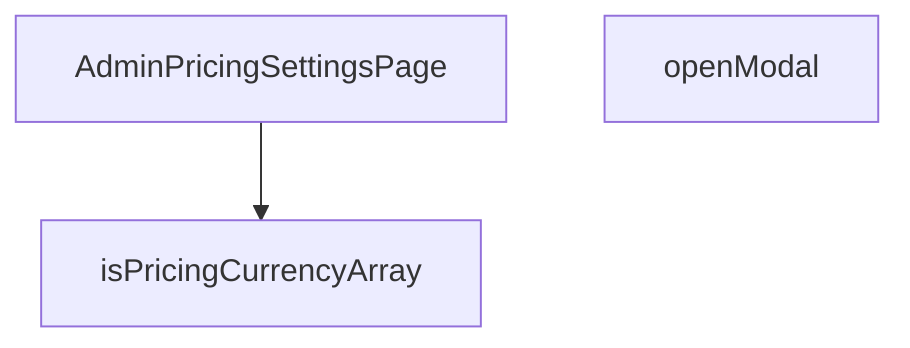

## Genel Bakış
Bu modül, yönetici panelindeki fiyatlandırma ayarlarını görüntülemek ve düzenlemek için kullanılan bir sayfa bileşenidir. Para birimi verilerinin doğrulanması ve kullanıcı etkileşimi için modal açılması gibi temel işlevleri içerir.

## Fonksiyon Grupları

### Tip Doğrulama
Verilen değerin geçerli bir fiyatlandırma para birimi dizisi olup olmadığını kontrol eden yardımcı fonksiyonu içerir. Bu fonksiyon, veri yükleme veya kullanıcı girdisi sırasında veri bütünlüğünü sağlamak amacıyla kullanılır.
- isPricingCurrencyArray

### Bileşen ve Etkileşim
Ana sayfa bileşenini ve kullanıcı arabirimi etkileşimlerini yönetir. Sayfa bileşeni, fiyatlandırma ayarlarını görüntülerken; modal açma fonksiyonu, düzenleme veya detay işlemleri için kullanıcıya bir pencere sunar.
- AdminPricingSettingsPage, openModal

---

## AXIOMS – Mimari Varsayımlar
- Bu modül davranışsal mantık içermez (salt veri / konfigürasyon / tip tanımı).
- [Aksiyom 1]: Modülün dışa açtığı yapı (anahtar kümesi / şema) bir sözleşmedir; tüketiciler bu sabit yapıya bağlıdır — kırıcı değişiklik tüm tüketicileri etkiler.
- [Aksiyom 2]: Bir öğe ekleme/çıkarma yapısal-uyumlu olmalı; ilgili tipler ve seçiciler aynı commit'te güncel tutulmalıdır.

---

## FONKSİYON DETAYLARI

### isPricingCurrencyArray
**Ne yapar**: Verilen değerin fiyatlandırma para birimi dizisi olup olmadığını kontrol eden bir doğrulama fonksiyonudur. Fonksiyon adından, bir type guard (tip koruyucu) işlevi gördüğü anlaşılmaktadır.
**Nasıl yapar**: Kaynak kodda docstring bulunmadığından iç mantığı bilinmiyor. `unknown` tipinde bir değer alarak, bu değerin beklenen fiyatlandırma para birimi yapısına uygun olup olmadığını denetlediği düşünülmektedir; ancak kesin doğrulama kriterleri kaynakta belirtilmemiştir.
**Parametreler**:
- value: unknown — Doğrulanacak değer. Herhangi bir tipte olabilir; fonksiyon bu değerin geçerli bir fiyatlandırma para birimi dizisi olup olmadığını sınar.
**Dönüş**: Kaynakta dönüş tipi belirtilmemiştir. Bilinmiyor.

### AdminPricingSettingsPage
**Ne yapar**: Admin panelindeki fiyatlandırma ayarları sayfasını oluşturan bir React bileşenidir. Dosya yolu (`src/views/admin/AdminPricingSettingsPage.tsx`) bu bileşenin admin görünüm katmanında yer aldığını göstermektedir.
**Nasıl yapar**: Kaynak kodda docstring bulunmadığından bileşenin iç yapısı ve hangi alt bileşenleri, durum yönetimini veya yan etkileri kullandığı bilinmiyor. `React.FC` tipinde bir fonksiyonel bileşen olarak tanımlanmıştır; bu, bir React elementi döndüren fonksiyonel bileşen anlamına gelir.
**Parametreler**:
- (Parametre almıyor) — Fonksiyon tanımında herhangi bir parametre belirtilmemiştir.
**Dönüş**: `React.FC` — React fonksiyonel bileşeni. JSX elementi döndürür.

### openModal
**Ne yapar**: Fiyatlandırma ayarları sayfasında bir modal (açılır pencere/diyalog) açma işlemini gerçekleştiren fonksiyondur. Fonksiyon adı, kullanıcı etkileşimiyle tetiklenen bir modal gösterme eylemini ifade eder.
**Nasıl yapar**: Kaynak kodda docstring bulunmadığından hangi modal'ı açtığı, modal'ın içeriğinin ne olduğu ve nasıl bir durum değişikliği tetiklediği bilinmiyor. `AdminPricingSettingsPage` bileşeni içinde tanımlanmış bir yardımcı fonksiyon olduğu anlaşılmaktadır.
**Parametreler**:
- (Parametre almıyor) — Fonksiyon tanımında herhangi bir parametre belirtilmemiştir.
**Dönüş**: Kaynakta dönüş tipi belirtilmemiştir. Bilinmiyor.

---

## İTHALATLAR (IMPORTS)
- import: ../../components/admin/AdminSkeleton::AdminSkeleton
- import: @/components/admin/pricing/CurrencyRatesCard::CurrencyRatesCard
- import: @/hooks/useRole::useRole
- import: @/i18n/I18nProvider::useI18n
- import: @/lib/supabase/client::supabaseBrowserClient
- import: lucide-react::DollarSign
- import: react::React
- import: react::useCallback
- import: react::useEffect
- import: react::useState

---

## AST POINTERS

### [N1_NASIL] AST Pointer: src/views/admin/AdminPricingSettingsPage.tsx::isPricingCurrencyArray
- **params**: `value: unknown`
- **ic_degiskenler**: (yok — doğrudan parametre üzerinde işlem yapılır)
- **Dönüş**: `value is PricingSettingsValues['enabled_currencies']` — TypeScript type guard; `value` dizisi `PricingSettingsValues` tipindeki `enabled_currencies` alanına uygunsa `true` döner. Kontrol: `Array.isArray(value)` ve `value.length > 0` ve her eleman `'TRY'` veya `'EUR'` veya `'USD'` olmalı.

---

### [N2_NASIL] AST Pointer: src/views/admin/AdminPricingSettingsPage.tsx::AdminPricingSettingsPage
- **params**: (yok)
- **ic_degiskenler**:
  - `t` — `useI18n()` kancasından gelen çeviri fonksiyonu; UI metinlerini yerelleştirmek için kullanılır
  - `canWrite` — `useRole()` kancasından gelen yetki kontrol fonksiyonu; belirli bir modül için yazma izni olup olmadığını döner
  - `hasWriteAccess` — `canWrite('pricing')` çağrısının sonucu; fiyatlandırma ayarlarını düzenleme butonunun `disabled` durumunu belirler
  - `loading` — `useState(true)` ile tanımlı durum; veri yükleniyor mu bilgisini tutar, `true` iken iskelet (skeleton) ekranı gösterilir
  - `setLoading` — `loading` durumunu güncelleyen setter fonksiyonu
  - `error` — `useState<string | null>(null)` ile tanımlı durum; yükleme sırasında oluşan hata mesajını tutar, `null` ise hata yok
  - `setError` — `error` durumunu güncelleyen setter fonksiyonu
  - `values` — `useState<PricingSettingsValues | null>(null)` ile tanımlı durum; Supabase'den çekilen fiyatlandırma ayarlarını tutar
  - `setValues` — `values` durumunu güncelleyen setter fonksiyonu
  - `modalOpen` — `useState(false)` ile tanımlı durum; düzenleme modalının açık/kapalı bilgisini tutar
  - `setModalOpen` — `modalOpen` durumunu güncelleyen setter fonksiyonu
  - `fetchSettings` — `useCallback` ile sarılı async fonksiyon; Supabase'den `site_settings` tablosunda `key='pricing'` olan kaydı çeker, `data?.value` alanını `PricingSettingsValues` tipine dönüştürerek `setValues` ile state'e yazar. Hata durumunda `setError` ile hata mesajını kaydeder. `finally` bloğunda `setLoading(false)` çağırır. Bağımlılık dizisi boş `[]` olduğundan yalnızca bir kez oluşur.
  - `data` — Supabase sorgusundan dönen veri; `data?.value` alanı `Partial<PricingSettingsValues>` tipinde fiyatlandırma ayarlarını içerir
  - `fetchError` — Supabase sorgusundan dönen hata nesnesi; varsa `throw` ile yakalanır
  - `raw` — `data?.value || {}` ifadesinin `Partial<PricingSettingsValues>` tipine cast edilmiş hali; ayarların ham halini temsil eder
  - `raw.enabled_currencies` — ham verideki etkin para birimleri dizisi; `isPricingCurrencyArray` ile doğrulanır, geçersizse `DEFAULT_PRICING_SETTINGS.enabled_currencies` kullanılır
  - `raw.default_vat_rate_pct` — ham verideki varsayılan KDV oranı; `typeof` ile `number` kontrolü yapılır, geçersizse `DEFAULT_PRICING_SETTINGS.default_vat_rate_pct` kullanılır
  - `raw.default_price_is_vat_inclusive` — ham verideki KDV dahil fiyat bayrağı; `!!` ile boolean'a dönüştürülür
  - `raw.default_round_to` — ham verideki varsayılan yuvarlama değeri; `typeof` ile `number` kontrolü yapılır, geçersizse `DEFAULT_PRICING_SETTINGS.default_round_to` kullanılır
  - `raw.default_charm_ending` — ham verideki cazip fiyat bitiş değeri; `typeof` ile `number` kontrolü yapılır, geçersizse `null` atanır
  - `raw.display_spread_pct` — ham verideki görüntüleme spread yüzdesi; `typeof` ile `number` kontrolü yapılır, geçersizse `DEFAULT_PRICING_SETTINGS.display_spread_pct` kullanılır
  - `err` — `catch` bloğundaki hata; `instanceof Error` kontrolü ile `err.message` veya `String(err)` olarak `setError`'ye aktarılır, ayrıca `console.error` ile loglanır
  - `openModal` — `setModalOpen(true)` çağrısı yapan fonksiyon; düzenleme butonunun `onClick` handler'ı olarak kullanılır
- **Dönüş**: `React.FC` — loading durumunda iskelet ekranı, aksi halde fiyatlandırma ayarlarını gösteren tam sayfa JSX döner. Sayfa içinde `CurrencyRatesCard` bileşeni ve `modalOpen` true olduğunda `PricingSettingsFormModal` bileşeni render edilir.

---

### [N3_NASIL] AST Pointer: src/views/admin/AdminPricingSettingsPage.tsx::openModal
- **params**: (yok)
- **ic_degiskenler**: (yok)
- **Dönüş**: yok — `setModalOpen(true)` çağırarak `modalOpen` durumunu `true` yapar; yan etki olarak modal açılmasını tetikler.

---

## MERMAID CALL GRAPH

## NODE ID STANDARD

  file: AdminPricingSettingsPage.tsx
  function: AdminPricingSettingsPage.tsx::isPricingCurrencyArray
  function: AdminPricingSettingsPage.tsx::AdminPricingSettingsPage
  function: AdminPricingSettingsPage.tsx::openModal

---

## DISA AKTARILANLAR (EXPORTS)
  export: AdminPricingSettingsPage
  export: isPricingCurrencyArray

---

## STİL TOKENLERİ

### Arbitrary Değerler (token'a geçirilmemiş)
Yok — tüm stiller token'a geçirilmiş. ✅

### Kullanılan Token'lar (zaten token'a geçirilmiş)
- (yok)

### Tailwind Sınıf Özeti
- **Renkler:** `bg-admin-accent-weak`, `bg-admin-danger-weak`, `border-admin-accent/30`, `border-admin-border`, `border-admin-danger/30`, `border-b`, `border-t`, `hover:bg-admin-accent`, `hover:text-admin-fg-subtle`, `text-admin-accent`, `text-admin-danger`, `text-admin-fg`, `text-admin-fg-muted`, `text-lg`, `text-sm`
- **Layout:** `block`, `flex`, `flex-col`, `gap-3`, `gap-6`, `gap-8`, `grid`, `grid-cols-1`, `items-center`, `items-start`, `justify-between`, `lg:grid-cols-2`, `lg:p-10`, `md:flex-row`, `md:items-end`
- **Varyant/Responsive:** `disabled:`, `hover:`, `lg:`, `md:` önekleri
- **Yardımcı Sınıflar:** `${adminCardClass`, `animate-in`, `border`, `disabled:cursor-not-allowed`, `disabled:opacity-50`, `duration-300`, `duration-700`, `fade-in`, `font-bold`, `font-semibold`, `group`, `pb-20`, `pb-4`, `pt-6`, `py-3`