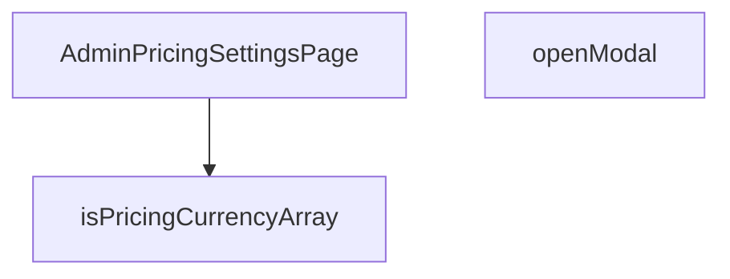

## Genel Bakış
Bu modül, yönetici panelinde fiyatlandırma ayarlarının görüntülendiği ve düzenlendiği bir React sayfa bileşenidir. Sayfa, fiyatlandırma verilerinin formatını doğrulayan yardımcı fonksiyonlar ve modal pencere açma gibi etkileşim işlevleri içerir.

## Fonksiyon Grupları
### Yardımcı Doğrulama Fonksiyonları
Veri doğrulama ve tip kontrolü için kullanılan pure fonksiyonları barındırır.
- isPricingCurrencyArray

### Ana Sayfa Bileşeni
Fiyatlandırma ayarlarının ana arayüzünü ve mantığını yöneten, state ve effect'leri barındıran React bileşenidir.
- AdminPricingSettingsPage

### Kullanıcı Etkileşim İşlevleri
Sayfadaki belirli kullanıcı eylemlerini (örn: modal açma) tetikleyen, genellikle olay işleyicileri içinde kullanılan fonksiyonlardır.
- openModal

---

## AXIOMS – Mimari Varsayımlar

Bu modül için yalnızca fonksiyon imzaları mevcut olup, gövde implementasyonu verilmemiştir. Aşağıdaki varsayımlar imzalar ve modül yapısından çıkarılabilecek en düşük seviyeli çıkarımlardır:

[Aksiyom 1]: Eğer `value` parametresi `unknown` tipinde verilmezse veya `isPricingCurrencyArray` çağrılmazsa, pricing currency verilerinin tipi doğrulanamaz ve geçersiz veri UI'a taşınabilir.

[Aksiyom 2]: Eğer `AdminPricingSettingsPage` bir React fonksiyonel bileşeni (FC) olarak çalışmıyorsa, pricing ayarları sayfası render edilemez.

[Aksiyom 3]: Eğer `openModal()` modül içinde erişilebilir bir modal state/signal'ı manipüle etmiyorsa, modal açılamaz veya beklenen UI bileşeni gösterilmez.

[Aksiyom 4]: `isPricingCurrencyArray` fonksiyonu bir **type guard** olarak imzalanmıştır; eğer bu fonksiyon `unknown` input için doğru `boolean` sonucunu döndürmüyorsa, TypeScript runtime'da tip güvenliği sağlanamaz.

---

> **Not:** Fonksiyon gövdeleri (implementation bodies) verilmediği için, dependenci'ler (state management, API çağrıları, prop'lar, context kullanımı vb.) hakkında kesin çıkarım yapılamamıştır. Daha detaylı aksiyonlar için modül kaynak kodu gereklidir.

---

## FONKSİYON DETAYLARI

### isPricingCurrencyArray
**Ne yapar**: Bu fonksiyon, verilen bir değerin pricing currency (fiyatlandırma para birimi) nesneleri dizisi olup olmadığını doğrulayan bir tip koruma (type guard) fonksiyonudur. TypeScript ortamında运行时 tip güvenliğini sağlamak için kullanılır.

**Nasıl yapar**: Bilinmeyen (unknown) tipteki girdiyi alır ve bu değerin pricing currency objeleri içeren bir dizi olup olmadığını kontrol eder. Bu tür fonksiyonlar genellikle Array.isArray() kontrolü ile birlikte dizi elemanlarının belirli bir şemaya uyup uymadığını doğrulayarak çalışır. TypeScript'te `value is PricingCurrency[]` şeklinde bir return type annotation kullanarak tip daraltma (type narrowing) sağlar.

**Parametreler**:
- value: unknown — Kontrol edilecek değer. Herhangi bir tipte olabilir, bu yüzden `unknown` olarak belirtilmiştir.

**Dönüş**: `value is PricingCurrency[]` — boolean döndürür ancak TypeScript tip sisteminde return type olarak kullanıldığında parametrenin `PricingCurrency[]` tipinde olduğunu garanti altına alır.

### AdminPricingSettingsPage
**Ne yapar**: Geliştirildi ancak detay üretilemedi.

### openModal
**Ne yapar**: Geliştirildi ancak detay üretilemedi.

---

## İTHALATLAR (IMPORTS)
- import: ../../components/admin/AdminSkeleton::AdminSkeleton
- import: @/components/admin/pricing/CurrencyRatesCard::CurrencyRatesCard
- import: @/hooks/useRole::useRole
- import: @/i18n/I18nProvider::useI18n
- import: @/lib/supabase/client::supabaseBrowserClient
- import: lucide-react::DollarSign
- import: react::React
- import: react::useCallback
- import: react::useEffect
- import: react::useState

---

## AST POINTERS

### [N1_NASIL] AST Pointer: `src/views/admin/AdminPricingSettingsPage.tsx`::isPricingCurrencyArray
- **params**: `(value: unknown)`
- **ic_degiskenler**:
  - `value` — Fonksiyona geçirilen argüman, `PricingSettingsValues['enabled_currencies']` tipine ait olup olmadığının kontrol edildiği ham veri
  - `v` — `value.every()` iterator callback parametresi; dizi elemanlarını temsil eder, `'TRY'`, `'EUR'` veya `'USD'` olup olmadığı kontrol edilir
- **Dönüş**: `value is PricingSettingsValues['enabled_currencies']` — TypeScript type guard; argümanın geçerli bir pricing currency dizisi olup olmadığını boolean olarak döner

---

### [N2_NASIL] AST Pointer: `src/views/admin/AdminPricingSettingsPage.tsx`::AdminPricingSettingsPage
- **params**: (parametre yok — React functional component)
- **ic_degiskenler**:
  - `t` — `useI18n()` hook'undan destructure edilen çeviri fonksiyonu; tüm UI metinleri (`t('admin.titles.pricing')`, `t('admin.common.edit')` vb.) bu fonksiyonla render edilir
  - `canWrite` — `useRole()` hook'undan destructure edilen yetki kontrol fonksiyonu; belirli modüller için yazma izni sorgulanır
  - `hasWriteAccess` — `canWrite('pricing')` çağrısının boolean sonucu; modal açma butonunun `disabled` durumunu belirler
  - `loading` — `useState(true)` ile oluşturulan state; Supabase veri yükleme sırasında `true`, tamamlandığında `false` olur; skeleton gösterimini kontrol eder
  - `setLoading` — `loading` state setter'ı; `fetchSettings` içinde `true`/`false` olarak ayarlanır
  - `error` — `useState<string | null>(null)` ile oluşturulan state; fetch sırasında oluşan hata mesajını tutar, hata banner'ında render edilir
  - `setError` — `error` state setter'ı; `fetchSettings` içinde hata oluştuğunda mesaj yazılır, sıfırlandığında `null` olur
  - `values` — `useState<PricingSettingsValues | null>(null)` ile oluşturulan state; `site_settings` tablosundan çekilen fiyatlandırma ayarları (base_currency, enabled_currencies, default_vat_rate_pct vb.); JSX'te `values?.base_currency`, `values?.enabled_currencies`, `values?.default_vat_rate_pct`, `values?.default_price_is_vat_inclusive`, `values?.default_round_to`, `values?.default_charm_ending`, `values?.display_spread_pct` olarak okunur
  - `setValues` — `values` state setter'ı; `fetchSettings` içinde supabase yanıtından dönüştürülen değerler yazılır
  - `modalOpen` — `useState(false)` ile oluşturulan state; `PricingSettingsFormModal`'in açık/kapalı durumunu kontrol eder; JSX'te `{modalOpen && (<PricingSettingsFormModal open={modalOpen} .../>)}` koşulunda kullanılır
  - `setModalOpen` — `modalOpen` state setter'ı; `openModal` callback'inde `true` yapılır, `PricingSettingsFormModal`'in `onOpenChange` prop'una verilir
  - `fetchSettings` — `useCallback(async () => {...}, [])` ile tanımlanan memoized async fonksiyon; `supabase.from('site_settings').select('key, value').eq('key', 'pricing').maybeSingle()` sorgusuyla veriyi çeker, `data?.value` yanıtını `raw` değişkenine (`Partial<PricingSettingsValues>`) cast eder, `raw.enabled_currencies`'i `isPricingCurrencyArray` ile doğrular, `raw.default_vat_rate_pct`, `raw.default_price_is_vat_inclusive`, `raw.default_round_to`, `raw.default_charm_ending`, `raw.display_spread_pct` alanlarını tip kontrolü ile `DEFAULT_PRICING_SETTINGS` fallback'leriyle birlikte `setValues`'e yazar; `fetchError` fırlatılır, yakalanan `err` `console.error` ile loglanır ve `setError`'e yazılır; finally bloğunda `setLoading(false)` çağrılır
  - `openModal` — Arrow function callback; `setModalOpen(true)` çağrısıyla modal'ı açar; JSX'te butonun `onClick` handler'ına bağlanır
  - `data` — `supabase` sorgusundan dönen `{ data, error: fetchError }` destructured yanıtı; `data?.value` erişimiyle ham pricing ayarları alınır
  - `fetchError` — `supabase` sorgusundan dönen hata nesnesi; `if (fetchError) throw fetchError` ile fırlatılır
  - `raw` — `data?.value || {}` ifadesinin `Partial<PricingSettingsValues>` tipine cast edilmiş hali; `enabled_currencies`, `default_vat_rate_pct`, `default_price_is_vat_inclusive`, `default_round_to`, `default_charm_ending`, `display_spread_pct` alanları okunur
  - `err` — `catch` bloğu yakalama parametresi (`unknown` tipinde); `instanceof Error` kontrolü ile `err.message` veya `String(err)` olarak `setError`'e yazılır
- **Dönüş**: JSX (React.ReactNode) — `loading` true iken skeleton grid, false iken pricing ayarları kartı + `CurrencyRatesCard` + `PricingSettingsFormModal` render eden React bileşen JSX'i döner; `error` durumunda rose renkli hata banner'ı eklenir

---

### [N3_NASIL] AST Pointer: `src/views/admin/AdminPricingSettingsPage.tsx`::openModal
- **params**: (parametre yok)
- **ic_degiskenler**: (yok — doğrudan `setModalOpen(true)` çağrısı yapar)
- **Dönüş**: `void` — yan etki olarak `modalOpen` state'ini `true` yapar ve modal'ın açılmasını tetikler

---

## MERMAID CALL GRAPH

## NODE ID STANDARD

  file: src\views\admin\AdminPricingSettingsPage.tsx
  function: src\views\admin\AdminPricingSettingsPage.tsx::isPricingCurrencyArray
  function: src\views\admin\AdminPricingSettingsPage.tsx::AdminPricingSettingsPage
  function: src\views\admin\AdminPricingSettingsPage.tsx::openModal

---

## DISA AKTARILANLAR (EXPORTS)
  export: AdminPricingSettingsPage
  export: isPricingCurrencyArray

---

## STİL TOKENLERİ

### Arbitrary Değerler (token'a geçirilmemiş)
Yok — tüm stiller token'a geçirilmiş. ✅

### Kullanılan Token'lar (zaten token'a geçirilmiş)
- (yok)

### Tailwind Sınıf Özeti
- **Renkler:** `bg-cyan-400/10`, `bg-cyan-500/5`, `bg-rose-500/10`, `border-b`, `border-cyan-400/20`, `border-rose-500/20`, `border-t`, `border-white/5`, `group-hover:bg-cyan-500/10`, `hover:bg-cyan-400`, `hover:text-slate-950`, `text-cyan-400`, `text-lg`, `text-rose-500`, `text-slate-300`
- **Layout:** `block`, `flex`, `flex-col`, `gap-3`, `gap-6`, `gap-8`, `grid`, `grid-cols-1`, `items-center`, `items-start`, `justify-between`, `lg:grid-cols-2`, `lg:p-10`, `md:flex-row`, `md:items-end`
- **Varyant/Responsive:** `disabled:`, `group-hover:`, `hover:`, `lg:`, `md:` önekleri
- **Yardımcı Sınıflar:** `${adminBlurBlobClass`, `${adminCardClass`, `animate-in`, `border`, `disabled:cursor-not-allowed`, `disabled:opacity-50`, `duration-300`, `duration-700`, `fade-in`, `font-black`, `font-bold`, `font-semibold`, `group`, `pb-20`, `pb-4`